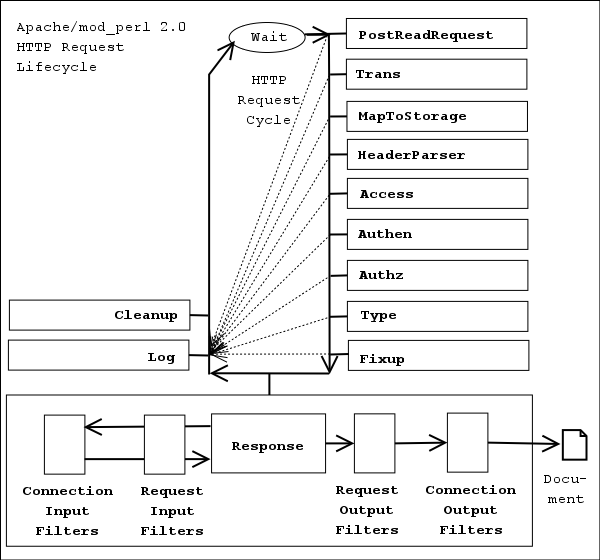

# Apache Configuration

## Basic Configuration
```
ServerRoot "/mnt/software/apache2" #你的apache软件安装的位置。其它指定的目录如果没有指定绝对路径，则目录是相对于该目录。 

PidFile logs/httpd.pid #第一个httpd进程(所有其他进程的父进程)的进程号文件位置。 

Listen 80 #服务器监听的端口号。 

ServerName www.clusting.com:80 #主站点名称（网站的主机名）。 

ServerAdmin admin@clusting.com #管理员的邮件地址。 

DocumentRoot "/mnt/web/clusting" #主站点的网页存储位置。 
```

## Directory Access Configuration 
```
<Directory "/mnt/web/clusting"> 
    Options FollowSymLinks 
    AllowOverride None 
    Order allow,deny 
    Allow from all 
</Directory>
```

* Options: 配置在特定目录使用哪些特性，常用的值和基本含义如下： 
  * ExecCGI: 在该目录下允许执行CGI脚本。 
  * FollowSymLinks: 在该目录下允许文件系统使用符号连接。 
  * Indexes: 当用户访问该目录时，如果用户找不到DirectoryIndex指定的主页文件(例如index.html),则返回该目录下的文件列表给用户。
  * SymLinksIfOwnerMatch: 当使用符号连接时，只有当符号连接的文件拥有者与实际文件的拥有者相同时才可以访问。 
  * None: 无
* AllowOverride：允许存在于.htaccess文件中的指令类型(.htaccess文件名是可以改变的，其文件名由AccessFileName指令决定)： 
  * None: 当AllowOverride被设置为None时。不搜索该目录下的.htaccess文件（可以减小服务器开销）。
  * All: 在.htaccess文件中可以使用所有的指令。 
  * AuthConfig 允许使用与认证授权相关的指令 (AuthDBMGroupFile, AuthDBMUserFile, AuthGroupFile, AuthName, AuthType, AuthUserFile, Require, 等)
  * FileInfo 允许使用控制文档类型的指令(DefaultType, ErrorDocument, ForceType, LanguagePriority, SetHandler, SetInputFilter, SetOutputFilter, mod_mime中的 Add* 和 Remove* 指令等等)、控制文档元数据的指令(Header, RequestHeader, SetEnvIf, SetEnvIfNoCase, BrowserMatch, CookieExpires, CookieDomain, CookieStyle, CookieTracking, CookieName)、mod_rewrite中的指令(RewriteEngine, RewriteOptions, RewriteBase, RewriteCond, RewriteRule)和mod_actions中的Action指令。
  * Indexes 允许使用控制目录索引的指令(AddDescription, AddIcon, AddIconByEncoding, AddIconByType, DefaultIcon, DirectoryIndex, FancyIndexing, HeaderName, IndexIgnore, IndexOptions, ReadmeName, 等)。
  * Limit 允许使用控制主机访问的指令(Allow, Deny, Order)。
  * Options[=Option,...] 允许使用控制指定目录功能的指令(Options和XBitHack)。可以在等号后面附加一个逗号分隔的(无空格的)Options选项列表，用来控制允许Options指令使用哪些选项。
* Order：控制在访问时Allow和Deny两个访问规则哪个优先： 
  * Allow：允许访问的主机列表(可用域名或子网，例如：Allow from 192.168.0.0/16)。 
  * Deny：拒绝访问的主机列表。
* DirectoryIndex index.html index.htm index.php #主页文件的设置
    ```
    DirectoryIndex index.html
  
    Or

    <IfModule dir_module>
        DirectoryIndex index.html
    </IfModule>
    ```
* Files
  * The <Files> directive provides for access control by filename.
  ```
  #
  # The following lines prevent .htaccess and .htpasswd files from being
  # viewed by Web clients.
  #
  <Files ".ht*">
      Require all denied
  </Files>
  
  <Files ~ "\.(gif|jpe?g|png)$">
       Require all denied
  </Files>
  ```
* Location
  * The <Location> directive provides for access control by URL.
  * The <Location> functionality is especially useful when combined with the SetHandler directive.
  ```
  # SetHandler server-status to serve /status
  <Location /status>
    SetHandler server-status
    order deny,allow
    deny from all
    allow from .example.com
  </Location>
  
  # only local can access
  <Location /server-status>
    SetHandler server-status
    Require local
  </Location>
  ```
* mine types
  ```
  TypesConfig conf/mime.types
  # AddType allows you to add to or override the MIME configuration
  # file mime.types for specific file types.
  AddType application/x-httpd-cgi .cgi
  ...
  ```
* Charset
  ```
  AddDefaultCharset UTF-8
  AddCharset ISO-8859-1  .iso8859-1  .latin1
  ...
  ```
* Action
  ```
  # Action lets you define media types that will execute a script whenever
  # a matching file is called. This eliminates the need for repeated URL
  # pathnames for oft-used CGI file processors.
  # Format: Action media/type /cgi-script/location
  # Format: Action handler-name /cgi-script/location
  ```
* Handler
  ```
  # AddHandler allows you to map certain file extensions to "handlers":
  AddHandler cgi-script .cgi
  ```
* Include
  ```
  Include conf/conf.d/*.conf
  ```
* Header
  ```
  Header always append TestHeader "test"
  Header add MyHeader "myHeader"
  
  or 
  <ifModule mod_headers.c>
    Header add MyHeader "myHeader"
  </ifModule>
  
  <filesMatch "test.html">
    FileETag None
    Header unset ETag
    Header set TestHeader "test"
    Header set Cache-Control ""max-age=0, no-cache, no-store"
    ...
  </filesMatch>
  ```
  * Prevent XSS attack
    * X-Content-Type-Options: nosniff
      * script and styleSheet elements can reject to respond the request with the wrong MIME type 
    * CSP - Content-Security-Policy
      * CSP 的实质就是白名单制度，开发者明确告诉客户端，哪些外部资源可以加载和执行，等同于提供白名单。它的实现和执行全部由浏览器完成，开发者只需提供配置。CSP 的主要目标是减少和报告 
      * 配置好并启用后，不符合 CSP 的外部资源就会被阻止加载。
      * Content-Security-Policy-Report-Only: 表示不执行限制选项，只是记录违反限制的行为。 它必须与report-uri选项配合使用。
    ```
    限制全局: default-src 
    限制特定资源类型: connect-src、mainfest-src、img-src、font-src、media-src、style-src、frame-src、script-src…

    Example:
    Apache Header configure
    Header set Content-Security-Policy "default-src 'self' *.trust.com; script-src 'self' 'unsafe-eval' 'unsafe-inline'; style-src 'self' 'unsafe-inline' blob:; img-src * data: blob:; font-src 'self' data:; frame-ancestors 'self';"
    # image-src explanation: allow data: blob: for image from anyway.
  
    在HTML上使用
    <meta http-equiv="content-security-policy" content="default-src 'self' *.trust.com; ...">
  
    Content-Security-Policy-Report-Only "default-src 'self' *.trust.com; script-src 'self' 'unsafe-eval' 'unsafe-inline'; ...; report-uri /urlpath;
    ```
  * XSS VS CSRF (XSS一般也是攻击成功后，进行CSRF攻击)

    |名称 |目的    |备注   |
    |----|-------|-------|
    |XSS |篡改内容|不关心权限|
    |CSRF|获取资源|只关心权限|
  
## MPM: Multi-Processing Module
* choose a MPM in build
* show static libs built in httpd: httpd -l
* show all libs used by httpd (include static libs): httpd -M
* MPMs
  * prefork: 如果httpd -l列出prefork.c，则需要对下面的段进行配置(一个进程只有一个线程)：
    ``` 
    <IfModule prefork.c>  
    StartServers 5 #启动apache时启动的httpd进程个数。
    MinSpareServers 5 #服务器保持的最小空闲进程数。
    MaxSpareServers 10 #服务器保持的最大空闲进程数。
    MaxClients 150 #最大并发连接数。
    MaxRequestsPerChild 1000 #每个子进程被请求服务多少次后被kill掉。0表示不限制，推荐设置为1000。
    </IfModule> 
    ```
  * worker: 如果httpd -worker.c，则需要对下面的段进行配置：
    ``` 
    <IfModule worker.c> 
    StartServers 2 #启动apache时启动的httpd进程个数。
    MaxClients 150 #最大并发连接数。
    MinSpareThreads 25 #服务器保持的最小空闲线程数。
    MaxSpareThreads 75 #服务器保持的最大空闲线程数。
    ThreadsPerChild 25 #每个子进程的产生的线程数。
    MaxRequestsPerChild 0 #每个子进程被请求服务多少次后被kill掉。0表示不限制，推荐设置为1000。
    </IfModule> 
    ```
  * perchild: 如果httpd -perchild.c，则需要对下面的段进行配置(一个进程只有一个线程)：
    ``` 
    <IfModule perchild.c> 
    NumServers 5 #服务器启动时启动的子进程数
    StartThreads 5 #每个子进程启动时启动的线程数
    MinSpareThreads 5 #内存中的最小空闲线程数
    MaxSpareThreads 10 #最大空闲线程数
    MaxThreadsPerChild 2000 #每个线程最多被请求多少次后退出。0不受限制。
    MaxRequestsPerChild 10000 #每个子进程服务多少次后被重新fork。0表示不受限制。
    </IfModule> 
    ```
## HTTP header in response
* ServerTokens Prod #该参数设置http头部返回的apache版本信息，可用的值和含义如下：
  ```
  Prod：仅软件名称，例如：Server: Apache 
  Major：包括主版本号，例如：Server: Apache/2
  Minor：包括次版本号，例如：Server: Apache/2.0
  Min：仅apache的完整版本号，例如：Server: Apache/2.0.56
  OS：包括操作系统类型，例如：Server: Apache/2.0.56（Unix）
  Full：包括apache支持的模块及模块版本号，例如：Server: Apache/2.0.56（Unix）mod_ssl/2.0.54 OpenSSL/0.9.7g
  ServerSignature Off #在页面产生错误时是否出现服务器版本信息。推荐设置为Off
  ```
## Keep alive configuration
   ```
   KeepAlive On #开启持久性连接功能。即当客户端连接到服务器，下载完数据后仍然保持连接状态。 
   MaxKeepAliveRequests 100 #一个连接服务的最多请求次数。 
   KeepAliveTimeout 30 #持续连接多长时间，该连接没有再请求数据，则断开该连接。缺省为15秒。 
   ```
## Alias
* 对于不在DocumentRoot指定的目录内的页面，既可以使用符号连接，也可以使用别名。别名的设置如下：
  ```
  Alias /download/ "/var/www/download/" #访问时可以输入:http://www.custing.com/download/ 
  <Directory "/var/www/download"> #对该目录进行访问控制设置 
      Options Indexes MultiViews 
      Order allow,deny 
      Allow from all 
  </Directory> 
  ```
## CGI Configuration
* LoadModule cgi_module /usr/lib/apache2/modules/mod_cgi.so
* enable the cgi under a folder
  ```
  ScriptAlias /cgi-bin/ "/mnt/software/apache2/cgi-bin/" # 该目录下的CGI脚本文件要加可执行权限！
  <Directory "/usr/local/apache2/cgi-bin">
      Options Indexes FollowSymLinks ExecCGI   #加上ExecCGI，使其支持cgi程序
      AllowOverride None
      # Allow open access:
      Require all granted
      AddHandler cgi-script .exe .pl .cgi .sh   #添加cgi程序将要处理的后缀名
  </Directory>
  
  # AllowOverride: mod_authn_core and mod_authz_core must be loaded
  ```
* cgi perl example: test.cgi under /usr/local/apache2/cgi-bin
  ```
  #!/usr/bin/perl -w
  use warnings;
  use CGI qw(:standard);
  #! must use 'my' to define a variable
  print header;
  my $now_string = localtime();
  print "<b>Hello, CGI using Perl!</b><br/>It's $now_string NOW!<br />";
  ```
  * visit http://localhost/cgi-bin/test.cgi
* cgi shell example: shellTest.sh under /usr/local/apache2/cgi-bin
  ```
  #! /bin/bash
  echo "Content-Type:text/html\n;charset=utf-8"
  echo
  echo Hello, World.
  echo "{\"Language\": \"JAVA\"},"
  echo "{\"URL\": \"java.html\"}"
  ```
  * visit http://localhost/cgi-bin/shellTest.sh
## Log configuration
* Error log
  ```
  ErrorLog logs/error_log #日志的保存位置 
  LogLevel warn #日志的级别
  ErrorLogFormat "[%t] [%l] [pid %P] %F: %E: [client %a] %M"
  ```
* Access log
  ```
  LogFormat "%h %l %u %t "%r" %>s %b "%{Referer}i" "%{User-Agent}i"" combined 
  LogFormat "%h %l %u %t "%r" %>s %b" common #common为日志格式名称
  LogFormat "%{Referer}i -> %U" referer
  LogFormat "%{User-agent}i" agent
  CustomLog logs/access_log common
  /*
  格式中的各个参数如%h --客户端的ip地址或主机名
  %l --The 这是由客户端 identd 判断的RFC 1413身份，输出中的符号 "-" 表示此处信息无效。
  %u --由HTTP认证系统得到的访问该网页的客户名。有认证时才有效，输出中的符号 "-" 表示此处信息无效。
  %t --服务器完成对请求的处理时的时间。
  "%r" --引号中是客户发出的包含了许多有用信息的请求内容。
  %>s --这个是服务器返回给客户端的状态码。
  %b --最后这项是返回给客户端的不包括响应头的字节数。
  "%{Referer}i" --此项指明了该请求是从被哪个网页提交过来的。
  "%{User-Agent}i" --此项是客户浏览器提供的浏览器识别信息。 一段访问日志的实例：
  192.168.10.22 - bearzhang [10/Oct/2005:16:53:06 +0800] "GET /download/ HTTP/1.1" 200 1228
  192.168.10.22 - - [10/Oct/2005:16:53:06 +0800] "GET /icons/blank.gif HTTP/1.1" 304 -
  192.168.10.22 - - [10/Oct/2005:16:53:06 +0800] "GET /icons/back.gif HTTP/1.1" 304 -
  */
  ```
## Authentication Configuration
1. Configuration in httpd.conf
   ```
   AccessFileName .htaccess 
   .........
   Alias /download/ "/var/www/download/"
   <Directory "/var/www/download">
   Options Indexes
   AllowOverride AuthConfig
   </Directory>
   ```
2. Create a password file:
   ```
   /usr/local/apache2/bin/htpasswd -c /var/httpuser/passwords testuser 
   ```
3. Configure the server to request a password and tell the server which users are allowed access.
   /var/www/download/.htaccess: 
   ```
   AuthType Basic 
   AuthName "Restricted Files"
   AuthUserFile /var/httpuser/passwords
   Require user testuser
   # Require valid-user #all valid user
   ```
## Virtual host configuration
* based on IP
  ```
  Listen 80 
  <VirtualHost 172.20.30.40> 
      DocumentRoot /www/example1
      ServerName www.example1.com
  </VirtualHost>
  <VirtualHost 172.20.30.50>
      DocumentRoot /www/example2
      ServerName www.example2.org
  </VirtualHost>
  ```
* based on IP and multiple ports
  ```
  Listen 172.20.30.40:80
  Listen 172.20.30.40:8080
  Listen 172.20.30.50:80
  Listen 172.20.30.50:8080
  <VirtualHost 172.20.30.40:80> 
      DocumentRoot /www/example1-80
      ServerName www.example1.com
  </VirtualHost>
  <VirtualHost 172.20.30.40:8080>
      DocumentRoot /www/example1-8080
      ServerName www.example1.org
  </VirtualHost>
  <VirtualHost 172.20.30.50:80> 
      DocumentRoot /www/example2-80
      ServerName www.example2.com
  </VirtualHost>
  <VirtualHost 172.20.30.50:8080>
      DocumentRoot /www/example2-8080
      ServerName www.example2.org
  </VirtualHost>  
  ```
* based on server name for a host with a single address 
  ```
  # Ensure that Apache listens on port 80 
  Listen 80 
  # Listen for virtual host requests on all IP addresses 
  NameVirtualHost *:80
  <VirtualHost *:80> 
      DocumentRoot /www/example1
      ServerName www.example1.com
      # Other directives here 
  </VirtualHost>
  <VirtualHost *:80>
      DocumentRoot /www/example2
      ServerName www.example2.org
      # Other directives here 
  </VirtualHost>
  ```
* based on server name for a host with multiple addresses
  ```
  # Ensure that Apache listens on port 80 
  Listen 80 
  # This is the "main" server running on 172.20.30.40 
  ServerName server.domain.com 
  DocumentRoot /www/mainserver 
  # This is the other address 
  NameVirtualHost 172.20.30.50
  <VirtualHost 172.20.30.50> 
      DocumentRoot /www/example1
      ServerName www.example1.com
      # Other directives here 
  </VirtualHost>
  <VirtualHost 172.20.30.50>
      DocumentRoot /www/example2
      ServerName www.example2.org
      # Other directives here 
  </VirtualHost>
  ```
* based on port and server name
  ```
  Listen 80 
  Listen 8080
  NameVirtualHost 172.20.30.40:80 
  NameVirtualHost 172.20.30.40:8080 
  <VirtualHost 172.20.30.40:80> 
      DocumentRoot /www/example1-domain-80
      ServerName www.example1.com
      # Other directives here 
  </VirtualHost>
  <VirtualHost 172.20.30.40:8080> 
      DocumentRoot /www/example1-domain-8080
      ServerName www.example1.com
      # Other directives here 
  </VirtualHost>  
  <VirtualHost 172.20.30.50:80>
      DocumentRoot /www/example2-domain-80
      ServerName www.example2.org
      # Other directives here 
  </VirtualHost>
  <VirtualHost 172.20.30.50:8080>
      DocumentRoot /www/example2-domain-8080
      ServerName www.example2.org
      # Other directives here 
  </VirtualHost>
  ```
## SSL Configuration
1. main configuration
   ```
   /*
   <IfModule mod_ssl.c>
       Listen 443
   </IfModule>
   */
   Listen 443
   SSLPassPhraseDialog buildin 
   #SSLPassPhraseDialog exec:/path/to/program 
   SSLSessionCache dbm:/usr/local/apache2/logs/ssl_scache 
   SSLSessionCacheTimeout 300 
   SSLMutex file:/usr/local/apache2/logs/ssl_mutex 
   <VirtualHost _default_:443> 
   # <VirtualHost *:443> 
       # General setup for the virtual host 
       DocumentRoot "/usr/local/apache2/htdocs" 
       ServerName www.example.com:443 
       ServerAdmin you@example.com 
       ErrorLog /usr/local/apache2/logs/error_log 
       TransferLog /usr/local/apache2/logs/access_log 
       SSLEngine on 
       SSLProtocol all -SSLv2 -SSLv3
       SSLCipherSuite ALL:!ADH:!EXPORT56:RC4+RSA:+HIGH:+MEDIUM:+LOW:+SSLv2:+EXP:+eNULL 
       SSLCertificateFile /usr/local/apache2/conf/ssl.crt/server.crt 
       SSLCertificateKeyFile /usr/local/apache2/conf/ssl.key/server.key 
       CustomLog /usr/local/apache2/logs/ssl_request_log "%t %h %{SSL_PROTOCOL}x %{SSL_CIPHER}x "%r" %b" 
       ...
   </VirtualHost>
   ```
2. Create self-signed certificate
   ```
   Create a RSA private key for your Apache server: /usr/local/openssl/bin/openssl genrsa -des3 -out /usr/local/apache2/conf/ssl.key/server.key 1024 
   Create a Certificate Signing Request (CSR): /usr/local/openssl/bin/openssl req -new -key /usr/local/apache2/conf/ssl.key/server.key -out /usr/local/apache2/conf/ssl.key/server.csr
   Create a self-signed CA Certificate (X509 structure): with the RSA key of the CA /usr/local/openssl/bin/openssl req -x509 -days 365 -key /usr/local/apache2/conf/ssl.key/server.key -in /usr/local/apache2/conf/ssl.key/server.csr -out /usr/local/apache2/conf/ssl.crt/se`这里写代码片`rver.crt /usr/local/openssl/bin/openssl genrsa 1024 -out server.key /usr/local/openssl/bin/openssl req -new -key server.key -out server.csr /usr/local/openssl/bin/openssl req -x509 -days 365 -key server.key -in server.csr -out server.crt 
   ```
3. Create CA certificate for your server
   ```
    mkdir /CA 
    cd /CA
    cp openssl-0.9.7g/apps/CA.sh /CA
    ./CA.sh -newca
    openssl genrsa -des3 -out server.key 1024
    openssl req -new -key server.key -out server.csr
    cp server.csr newreq.pem
    ./CA.sh -sign
    cp newcert.pem /usr/local/apache2/conf/ssl.crt/server.crt
    cp server.key /usr/local/apache2/conf/ssl.key/
   ```

## Proxy
* ProxyPass:
  * 描述：将远程服务器映射到本地服务器的URL空间 
  * 语法：ProxyPass [路径] !|url [键=值 键=值 ...]] [nocanon]
  * 上下文： server config, virtual host, directory
  * 状态：扩展
  * 模块：mod_proxy
```
该指令可以将远程服务器映射到本地服务器的URL空间；本地的服务器并不是扮演传统意义上的代理服务器的角色，而是表现为远程服务器的一个镜像。此本地服务器常被成为 反向代理 （reversed proxy）或者是 网关 （gateway）。 路径 是指本地虚拟路径的名字； url 指远程服务器的一个部分URL，不能包含查询字符串。
注意：在使用 ProxyPass 指令的时候， ProxyRequests 指令通常都应该是关闭的。
假设本地服务器的地址是 http://example.com/ ，那么

ProxyPass /mirror/foo/ http://backend.example.com/
将会把对 http://example.com/mirror/foo/bar 的本地请求内部转换成到 http://backend.example.com/bar 的代理请求。
其中， ! 指令当你不想对某个子目录进行反向代理的时候就有用了，例如：

ProxyPass /mirror/foo/i !
ProxyPass /mirror/foo http://backend.example.com
将会把所有的 /mirror/foo 请求重定向到 backend.example.com 除了对 /mirror/foo/i 的请求。
注意：
顺序很重要：排除的指令必须在一般的 ProxyPass 指令之前。
顺序很重要：排除的指令必须在一般的 ProxyPass 指令之前。
和Apache 2.1一样，具备了使用到后端服务器的线程池的能力。使用“ 键=值 ”的参数便可调节线程池的分配。 硬性最大值（Hard Maximum） 的默认值为当前MPM中每个进程的线程数量。在Prefork MPM中，该值总是为1，在Worker MPM中，该值受 ThreadsPerChild 控制。
设置 min 可以决定有多少到后端服务器的链接始终打开。根据需要最多创建数量为柔性最大值（Soft Maximum），也就是 smax 的链接。任何超出 smax 数量的链接都会指定一个生存时间也就是 ttl 。Apache不会同时创建超过硬性最大值（或 max ）数量的到后端服务器的链接。

ProxyPass /example http://backend.example.com smax=5 max=20 ttl=120 retry=300
```
* ProxyPassMatch
  * ProxyPassMatch [regex] !|url
  * examples
    * ProxyPassMatch ^/images !  
    * ProxyPassMatch ^(/.*\.gif)$ http://backend.example.com$1  (ttp://example.com/foo/bar.gif -> http://backend.example.com/foo/bar.gif)
* ProxyPassReverse
  * ProxyPassReverse [路径] url
  * 它一般和ProxyPass指令配合使用，此指令使Apache调整HTTP重定向应答中Location, Content-Location, URI头里的URL
  ```
  举例说明，假设用户访问http://www.test.com/exam.php，通过转发交给http://192.168.100.22/exam.php处理，
  假定exam.php处理的结果是实现redirect到login.php(使用相对路径,即省略了域名信息)，如果没有配置反向代理，客户端收到的请求响应是重定向操作，
  并且重定向目的url为http://192.168.100.22/login.php ，而这个地址只是代理服务器能访问到的，可想而知，客户端肯定是打不开的，
  反之如果配置了反向代理，则会在转交HTTP重定向应答到客户端之前调整它为http://www.test.com/login.php，
  即是在原请求之后追加上了redirect的路径。当客户端再次请求http://www.test.com/login.php，
  代理服务器再次工作把其转发到http://192.168.100.22/login.php。

  客户端到服务器称之为正向代理，那服务器到客户端就叫反向代理。
  ```
* balancer
```
 如果代理的指令类型以 balancer:// 开头那么会创建一个虚拟工作单元，并不直接和后端服务器通讯。
 它负责对一些“真正”的工作单元进行管理。这种情况下可以给虚拟工作单元添加一系列额外参数。
 更多关于均衡器如何工作的信息请查看 mod_proxy_balancer 。
 
ProxyPass /special-area http://special.example.com/ smax=5 max=10
ProxyPass / balancer://mycluster stickysession=JSESSIONID|jsessionid nofailover=On
<Proxy balancer://mycluster>
BalancerMember http://1.2.3.4:8009
BalancerMember http://1.2.3.5:8009 smax=10
# 性能较弱的服务器，不要给他发送太多请求
BalancerMember http://1.2.3.6:8009 smax=1 loadfactor=20
</Proxy>

设置一个热备份，也就是只有当没有其他成员可用的时候才使用：
ProxyPass / balancer://hotcluster/
<Proxy balancer://hotcluster>
BalancerMember http://1.2.3.4:8009 loadfactor=1
BalancerMember http://1.2.3.5:8009 loadfactor=2
# 以下是热备份
BalancerMember http://1.2.3.6:8009 status=+H
ProxySet lbmethod=bytraffic 
</Proxy>
```

* ProxyRequests On: 开启Apache正向代理
* ProxyVia On：控制位于代理服务器链中的代理请求的流向
  * 如果设置为默认值Off ，将不会采取特殊的处理。如果一个请求或应答包含"Via:"头，将不进行任何修改而直接通过。
  * 如果设置为On每个请求和应答都会对应当前主机得到一个"Via:"头。
  * 如果设置为Full ，每个产生的"Via:"头中都会额外加入Apache服务器的版本，以"Via:"注释域出现。
  * 如果设置为Block ，每个代理请求中的所有"Via:"头行都将被删除。且不会产生新的"Via:"头。
```
<VirtualHost *:80>
     ServerAdmin test@test.com
     DocumentRoot /var/www/test
     ServerName www.test.com
     ErrorLog logs/dummy-host.example.com-error_log
     CustomLog logs/dummy-host.example.com-access_log common
     <Directory "/var/www/test">
         Options FollowSymLinks
         AllowOverride None
         Order allow,deny
         Allow from all
     </Directory>
 
     ProxyRequests On
     ProxyVia On
  
     <Proxy *>
         Order deny,allow
         Deny from all
         Allow from 192.168.50.80/24
     </Proxy>
 </VirtualHost>
 
 现在即可在浏览器的网络连接属性框中或 QQ 登录配置中，填写上 your_apache_server_ip 的 ip 地址，端口是 80，开始用代理了。
```

## Auth
* Require valid-user/Require user john paul george ringo: grant access 
  * mod_authz_user.so provides authorization capabilities so that authenticated users can be allowed or denied access to portions of the web site. 
  * mod_authz_user grants access if the authenticated user is listed in a Require user directive. 
  * Alternatively Require valid-user can be used to grant access to all successfully authenticated users.
* apache模块 mod_auth_basic.so、mod_authn_file.so、mod_authz_user.so

## Rewrite
```
NameVirtualHost 70.40.213.183:80
ServerAdmin slj@kiya.cn
DocumentRoot “/web”
ServerName kiya.cn
RewriteEngine on #打开rewirte功能
RewriteCond %{HTTP_HOST} !^www.kiya.cn [NC] #声明Client请求的主机中前缀不是www.kiya.cn，其中 [NC] 的意思是忽略大小写
RewriteCond %{HTTP_HOST} !^70.40.213.183 [NC] #声明Client请求的主机中前缀不是70.40.213.183，其中 [NC] 的意思是忽略大小写
RewriteCond %{HTTP_HOST} !^$ #声明Client请求的主机中前缀不为空
RewriteRule ^(.*) http://www.kiya.cn/ [L] #含义是如果Client请求的主机中的前缀符合上述条件，则直接进行跳转到http://www.kiya.cn/,[L]意味着立即停止重写操作，并不再应用其他重写规则。这里的.*是指匹配所有URL中不包含换行字符，()括号的功能是把所有的字符做一个标记，以便于后面的应用.就是引用前面里的(.*)字符。
```

```
1) R[=code](force redirect) 强制外部重定向
强制在替代字符串加上http://thishost[:thisport]/前缀重定向到外部的URL.如果code不指定，将用缺省的302 HTTP状态码。
2) F(force URL to be forbidden)禁用URL,返回403HTTP状态码。
3) G(force URL to be gone) 强制URL为GONE，返回410HTTP状态码。
4) P(force proxy) 强制使用代理转发。
5) L(last rule) 表明当前规则是最后一条规则，停止分析以后规则的重写。
6) N(next round) 重新从第一条规则开始运行重写过程。
7) C(chained with next rule) 与下一条规则关联
如果规则匹配则正常处理，该标志无效，如果不匹配，那么下面所有关联的规则都跳过。
8) T=MIME-type(force MIME type) 强制MIME类型
9) NS (used only if no internal sub-request) 只用于不是内部子请求
10) NC(no case) 不区分大小写
11) QSA(query string append) 追加请求字符串
12) NE(no URI escaping of output) 不在输出转义特殊字符
例如：RewriteRule /foo/(.*) /bar?arg=P1%3d$1 [R,NE] 将能正确的将/foo/zoo转换成/bar?arg=P1=zoo
13) PT(pass through to next handler) 传递给下一个处理
例如：
RewriteRule ^/abc(.*) /def$1 [PT] # 将会交给/def规则处理
Alias /def /ghi
14) S=num(skip next rule(s)) 跳过num条规则
15) E=VAR:VAL(set environment variable) 设置环境变量
```

## Perl module
* LoadModule
```
LoadModule perl_module modules/mod_perl.so
```
* set perl http handler
  ```
  <IfModule mod_perl.c>
    Alias /perl/ /home/httpd/perl/
    <Location /perl>
      SetHandler perl-script
      PerlHandler ModPerl::Registry
      Options +ExecCGI
    </Location>
  </IfModule>

  # 第一个指令 SetHandler 由 mod_mime 模块处理，该指令表示使用什么模块作为处理请求的主要部分。这里所设置的perl-script 表示使用 mod_perl 来处理请求。
  # 第二个指令PerlHandler由mod_perl模块来处理，它只是简单的说明使用我们的模块来处理请求的主要部分。
  
  ##  PerlHandler has been renamed to PerlResponseHandler in mod_perl 2.0
  ```
* HTTP request is processed by 12 phases, executed in the following order:
  
  
  ```
  PerlPostReadRequestHandler (PerlInitHandler)
  PerlTransHandler
  PerlMapToStorageHandler
  PerlHeaderParserHandler (PerlInitHandler)
  PerlAccessHandler
  PerlAuthenHandler
  PerlAuthzHandler
  PerlTypeHandler
  PerlFixupHandler
  PerlResponseHandler
  PerlLogHandler
  PerlCleanupHandler
  ```
* PerlAccessHandler: The access_checker phase is the first of three handlers that are involved in what's known as AAA: Authentication, Authorization, and Access control.
* PerlAuthenHandler: The check_user_id (authen) phase is called whenever the requested file or directory is password protected.
* PerlAuthzHandler: The auth_checker (authz) phase is used for authorization control.
* PerlFixupHandler: he fixups phase is happening just before the content handling phase. It gives the last chance to do things before the response is generated.
* https://perl.apache.org/docs/2.0/user/handlers/http.html#HTTP_Request_Handler_Skeleton
  

## cas module
* LoadModule
```
LoadModule authz_user_module modules/mod_authz_user.so
LoadModule auth_cas_module modules/mod_auth_cas.so
```