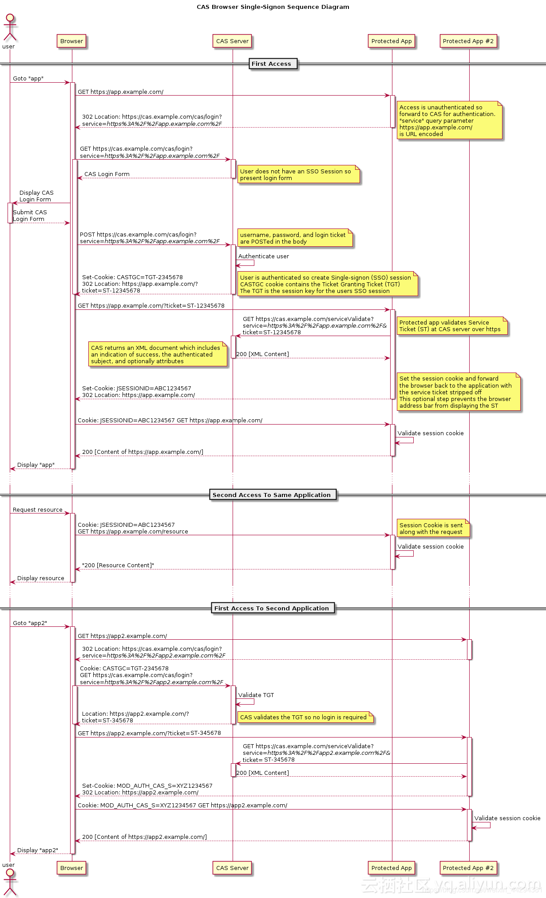
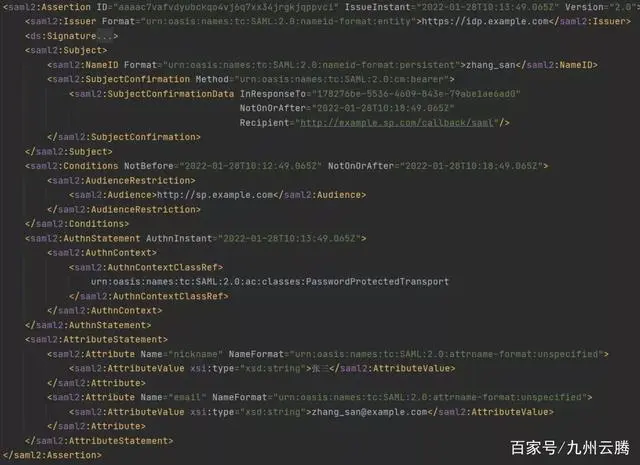

# Cas Server

## Login work flow

* configuration file: login-webflow.xml
* no session id from cas client side, redirect to login work flow of cas server
  * FlowHandlerAdapter.handle
  * **start log flow**: If execution request parameter not existed, get login flow id and call FlowExecutorImpl.launchExecution
     1. initialFlowSetupAction
        * retrieve ticketGrantingTicketId from request cookie and set it to flow.scope
        * retrieve warnCookieValue from request cookie and set it to flow.scope
        * Get Service and set it to flow.scope
     2. ticketGrantingTicketCheck
        * call ticketGrantingTicketCheckAction.checkValidity(flowRequestContext): get ticketGrantingTicketId from request.scope or flow.scope
        * if ticketGrantingTicketId not exist, go to **start authentication**.
        * if ticketGrantingTicketId exist, check if it valid or not. (invalid: cannot find Ticket from ticketRegistry by ticketGrantingTicketId or Ticket expired)
     3. Switch
       * **start authentication**: AbstractNonInteractiveCredentialsAction
         * ticketGrantingTicketId cookie path is /cas (not root)
         1. get ticketGrantingTicketId from request.scope or flow.scope
         2. get Service from flow.scope
         3. **grant service ticket**: CentralAuthenticationServiceImpl.grantServiceTicket (if request parameter renew presented and ticketGrantingTicketId existed)
            * get TicketGrantingTicket from ticketRegistry by ticketGrantingTicketId
            * call CASAuthenticationManager.authenticate if credential provided.
            * generate serviceTicketId
            * ticketGrantingTicket.grantServiceTicket (ServiceTicket) with generated serviceTicketId
            * add ServiceTicket to serviceTicketRegistry
            * put id of ServiceTicket as serviceTicketId to request.scope
            * redirect to original requested URL with adding serviceTicketId as parameter
         4. else, ticketGrantingTicketId should be null: CentralAuthenticationServiceImpl.createTicketGrantingTicket
            * call CASAuthenticationManager.authenticate
            * generate ticketGrantingTicketId and create TicketGrantingTicket with the ticketGrantingTicketId: CentralAuthenticationServiceImpl.createTicketGrantingTicket
            * add TicketGrantingTicket to ticketRegistry
            * put id of TicketGrantingTicket as ticketGrantingTicketId to request.scope
            * sendTicketGrantingTicketAction: add ticketGrantingTicketId to response cookie
            * generateServiceTicketAction: **grant service ticket**, go to **start authentication** if error
            * redirect to original requested URL with adding serviceTicketId as parameter
         5. if CASAuthenticationManager.authenticate failed (like credential not provided yet), **show login page**
         6. **show login page**: 
            * generateLoginTicketAction.generate(flowRequestContext): generate loginTicket id and put it to flow.scope
            * show login form with execution and lt (loginTicket)
            * **resume log flow** after submit login form 
       * ticketGrantingTicketId invalid
         1. terminateSessionAction.terminate: clear cookies
         2. **show login page**
       * ticketGrantingTicketId valid
         1. renewRequestCheck
         2. if renew, **startAuthenticate**
         3. else, generateServiceTicketAction: **grant service ticket**, go to **start authentication** if error
            * redirect to original requested URL with adding serviceTicketId as parameter
  * **resume log flow**: If execution request parameter existed, call FlowExecutorImpl.resumeExecution
    1. bind username and pwd from log page to credential model
    2. authenticationViaFormAction.submit
       1. get loginTicket ids from flow.scope and request parameter, make sure they are the same.
       2. similar with **start authentication**

## Validate
* path: /TrustAllProxies/samlValidate
* controller: org.jasig.cas.web.ServiceValidateController
  1. Create Service with artifactId (artifactId (serviceTicketId) from request body)
  2. CentralAuthenticationServiceImpl.validateServiceTicket
  3. If validation passed, respond success (SAML assertion with serviceTicketId) to client (client will direct to original requested URL)
  4. else, return error to client (client will direct to cas login URL)


## Cas Objects
### org.jasig.cas.authentication.principal.Service -> org.jasig.cas.authentication.principal.WebApplicationService
* Created by org.jasig.cas.web.support.ArgumentExtractor based on request

### org.jasig.cas.services.RegisteredService
* The registered services held by org.jasig.cas.services.ServicesManager
* If a Service (based on request) doesn't match any RegisteredService, UnauthorizedServiceException occurred.
* The properties of the RegisteredService have been set when loading.
* allowedAttributes: can filter the attributes in principal before populating them to application server
* allowedToProxy: allow proxy  

### org.jasig.cas.ticket.TicketGrantingTicket
* The client singes on cas server, a ticketGrantingTicket id (TGT) will be stored in the client's cookie for cas server
* ticketGrantingTicket id points to a TicketGrantingTicket instance stored on cas server
* When an application server starts to check authentication via cas server
  1. If no TicketGrantingTicket or TicketGrantingTicket expired, redirect to cas server and do login to generate a TicketGrantingTicket (logged in TicketRegistry) and create TGT cookie to the client
  2. Grant Service Ticket (logged in TicketGrantingTicket and TicketRegistry) to the application server

### org.jasig.cas.ticket.ServiceTicket
* The client will be redirected to cas server to validate the service ticket granted or not (via request parameter ticket)

### org.jasig.cas.ticket.support.TicketGrantingTicketExpirationPolicy
* expire policy for TicketGrantingTicket
* maxTimeToLiveInMilliSeconds: the max time to live after ticket created
* timeToKillInMilliSeconds: the max inactive time since it's last used (grantServiceTicket)

### org.jasig.cas.ticket.support.MultiTimeUseOrTimeoutExpirationPolicy
* expire policy for ServiceTicket
* numberOfUses: te max times for using it. (isValidFor)
* timeToKill: the max inactive time since it's last used (isValidFor)

### org.jasig.cas.ticket.registry.support.DefaultTicketRegistryCleaner
* The clean method to clean the expired ServiceTickets and TicketGrantingTickets

### org.jasig.cas.CentralAuthenticationServiceImpl
* The core service for authentication: create TGT, grantServiceTicket

### org.jasig.cas.authentication.PolicyBasedAuthenticationManager
* Container of org.jasig.cas.authentication.AuthenticationHandler

### org.jasig.cas.authentication.AuthenticationHandler
* The real authentication class
* boolean supports(Credential credential)
* HandlerResult authenticate(Credential credential)

### org.jasig.cas.authentication.principal.PrincipalResolver
* Principal resolve(Credential credential): resolve principal based on input Credential after authenticated
* PrincipalResolver can associate with an instance of IPersonAttributes to get attributes for the principal by IPersonAttributes.getPerson(principalId).getAttributes()
* If no related PrincipalResolver for an AuthenticationHandler, get principal by HandlerResult.getPrincipal()

### Normal
* client: https://app.example.com?ticket=<grant service ticket for TGT> 
* application server (app.example.com): /serviceValidate?service=https://app.example.com&ticket=<grant service ticket for TGT>
*  (ticket can use cookie under application server instead ticket parameter, and ticket can store in application server, then application server can call /serviceValidate without ticket parameter by writing ticket in request body by SAML)
* application server: responds the resource to client

### Proxy

* The cases: 
  1. 有这样一个场景：有两个服务holiday(节假日服务)和mainWeb(集成服务)，这两个服务都集成了CAS，所有的请求都要经过CAS Server的认证。由于mainWeb内部会去调用holiday的服务，但是mainWeb的请求会被holiday配置的CAS拦截器AuthenticationFilter拦截并重定向到CAS Server。这样我们的mainWeb就没法直接访问holiday服务。CAS的代理模式可以解决这个问题。
  2. CAS Proxy的目的是，当浏览器用户Peter访问应用A，应用A引用了应用B1, B2的授权性资源(Authorized Resource)，应用A想代表Peter去访问应用B1, B2，因此应用A需要告诉应用B1, B2当前用户是谁，以便B1,B2对Peter的Request进行授权。这就是CAS代理(Proxy)。
* application server: /proxyValidate?service=app.example.com&pgtUrl=proxyCallBackURLOnService&ticket=xxx
  * ServiceValidateController -> CentralAuthenticationService.delegateTicketGrantingTicket -> serviceTicket.grantTicketGrantingTicket -> ProxyGrantingTicket (PGT)
  * Cas20ProxyHandler.handle: generate proxyIou ticket and hit proxyCallBackURLOnService?pgtIou=PGTIOU-xxx&pgt=TGT-xxx to application service to store pgtIou and pgt.
  * respond assertion with pgtIou
  * then application service can use pgtIou to query pgt.
* application service: /proxy?targetService=https://app2.example.com&pgt=xxx -> org.jasig.cas.web.ProxyController -> grant service ticket for pgt
* application service visits application 2 service by https://app2.example.com?ticket=<grant service ticket for pgt>
* application 2 service calls /proxyValidate?service=https://app2.example.com&ticket=<grant service ticket for pgt>
* application 2 service responds the resource to application server.


### Security Assertion Markup Language (SAML protocol)
* 安全断言标记语言（英语：Security Assertion Markup Language，简称SAML，发音sam-el）是一个基于XML的开源标准数据格式，它在当事方之间交换身份验证和授权数据，尤其是在身份提供者和服务提供者之间交换。
* SAML解决的最重要的需求是网页浏览器单点登录（SSO 跨域）。 (另一种解决浏览器单点登录问题的方法是OpenID Connect协议)
* SAML协议中的参与者
  * Asserting Party，即断言签发方，是签发断言的业务系统     (cas server)
  * Relying Party，即断言依赖方，是消费断言的业务系统       (application server)
  * User，即用户，一般通过Web浏览器与两个业务系统进行交互     (client)
* SAML协议中的基本概念
  * Assertions: 安全信息的载体
    * 通常由断言签发者、主体（Subject）、关于该主体的一组声明（Statements)以及声明生效的条件（Conditions）四部分构成。
    * 三种类型的声明: Authentication Statements, Attribute Statements, Authorization Decision Statements
    * Example:
    ```
    该断言是由 https://idp.example.com 在 2022-01-28 10:12:49 签发，其受众是 http://sp.example.com ，
    并且断言仅在 2022-01-28 10:12:49 到 2022-01-28 10:18:49 时间内有效；
    断言中声明了当前主体“zhang_san”在 2022-01-28 10:13:49通过账密方式被认证通过，
    并且该主体的昵称为“张三”，邮箱为“zhang_san@example.com”。
    ```
    
    
    