## Checkpoint 容错机制

* 这个机制主要就是通过持续产生快照的方式实现的
* 快照主要包括两部分数据一部分是数据流的数据，另一部分是operator的状态数据
* 对应的快照机制的实现有主要两个部分组成，一个是屏障(Barrier），一个是状态(State)
* 
### Barrier
* 因为Flink这里处理的数据流，数据在多个operator的DAG拓扑中持续流动 
* 要想实现某个时刻快照可以用于系统故障恢复，必须保证这个快照，完全能够确定某一个时刻状态，这个时刻之前的数据全部处理完，之后的数据一个都没有处理
* Flink 分布式快照里面的一个核心的元素就是流屏障（stream barrier）
* 这些屏障会被插入(injected)到数据流中，并作为数据流的一部分随着数据流动
* 屏障并不会持有任何数据，而是和数据一样线性的流动
* 可以看到屏障将数据流分成了两部分数据（实际上是多个连续的部分），一部分是当前快照的数据，一部分下一个快照的数据
* 每个屏障会带有它的快照ID。这个快照的数据都在这个屏障的前面
  * 从图上看，数据是从左向右移动（右边的先进入系统），那么快照n包含的数据就是右侧到下一个屏障（n-1）截止的数据
  * 图中两个灰色竖线之间的部分，也就是part of checkpoint n
* 另外屏障并不会打断数的流动,因而屏障是非常轻量的。在同一个时刻，多个快照可以在同一个数据流中，这也就是说多个快照可以同时产生。
* 如果是多个输入数据流，多个数据流的屏障会被同时插入到数据流中
* 快照n的屏障被插入到数据流的点（我们称之为Sn），就是数据流中一直到的某个位置之前所有的数据为快照n
  * 在Kafaka中，这个位置就是这个分区的最后一条记录的offset。
* 这个位置Sn就会上报给 checkpoint 的协调器（Flink的 JobManager）。
  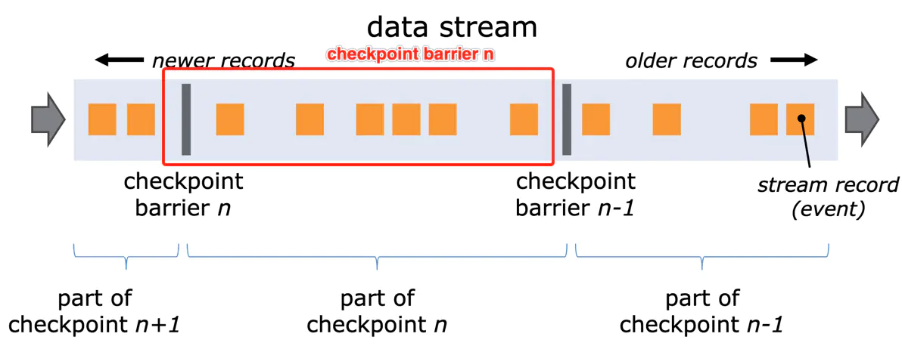
* 然后屏障开始向下流动。当一个中间的operator收到它的所有输入源的快照n屏障后，它就会向它所有的输出流发射一个快照n的屏障
* 一旦一个sink的operator收到所有输入数据流的屏障n，它就会向checkpoint的协调器发送快照n确认。
* 当所有的sink都确认了快照n，系统才认为当前快照的数据已经完成。
* 一旦快照n已经执行完成，任务则不会再请求Sn之前的数据，因为此刻，这些数据都已经完全通过了数据流拓扑图。
* 对齐机制： 接收不止一个数据输入的operator需要基于屏障对齐输入数据流。
  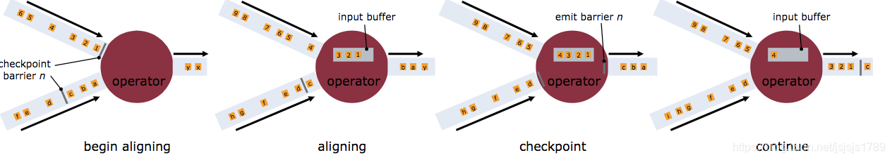
* 例子
  * source任务的并行度=2，sum任务的并行度也是2，sink任务的并行度也是2。
  * 两个流的数据都是1、2、3、4、5、6；蓝色数字圆圈代表最后一个处理的是蓝流里面的数据，黄色数字圆圈代表最后一个处理的是黄流里面的数据。
    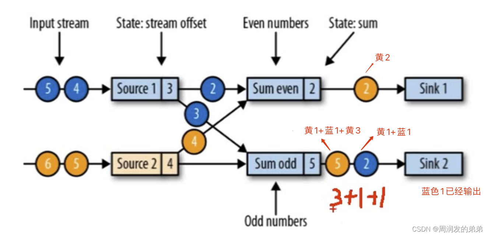
  * barrier 产生
    * JobManager会向每个source任务（同时发给并行的source任务）发送一条带有检查点ID的消息（蓝色三角形2），通过这种方式来启动检查点。
      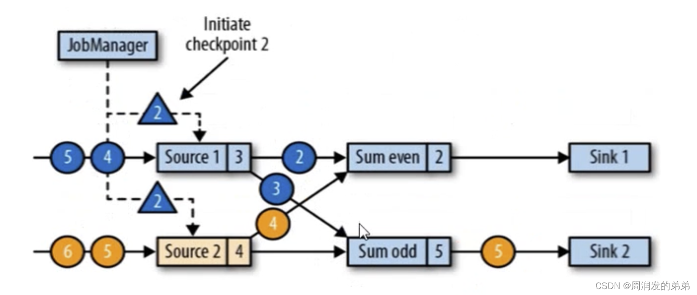
    * 产生barrier的过程中，不会影响下游task的正常工作.
    * barrier（ID=2）插入在stream1的3后面，stream2的4后面
    * barrier随着数据流动，广播到下游
    * source任务处理完barrier（ID=2）后，会向状态后端发送checkpoint，记录此时的状态。
      * 数据源将他们的状态写入检查点后，并发出这个检查点barrier到下游
      * 状态后端在状态存入检查点之后，会返回通知给source任务，source任务就会向JobManager确认检查点完成
      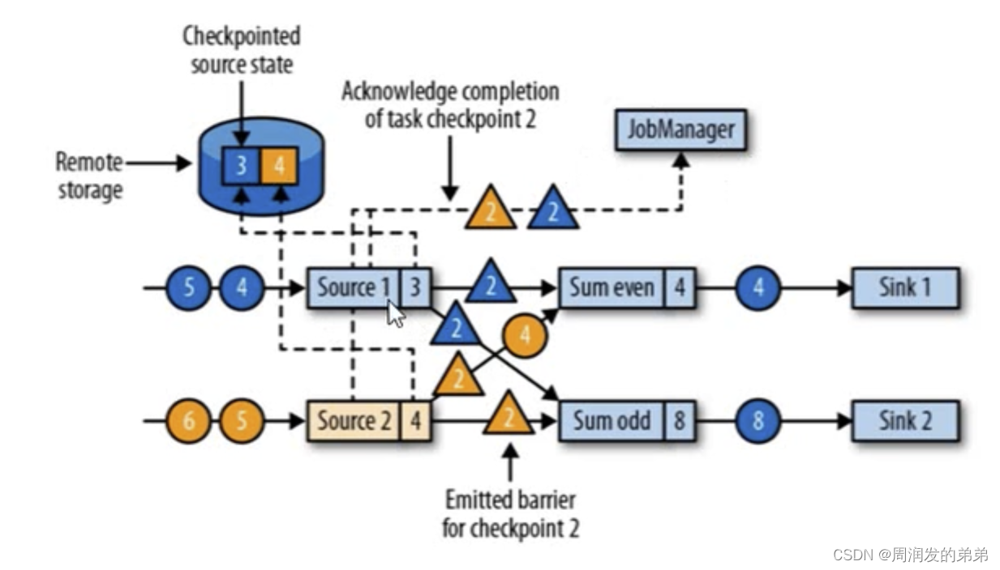
    * sum_even收到上游所有的barrier之后，才能去做checkpoint状态保存，这就叫做Barrier对齐
      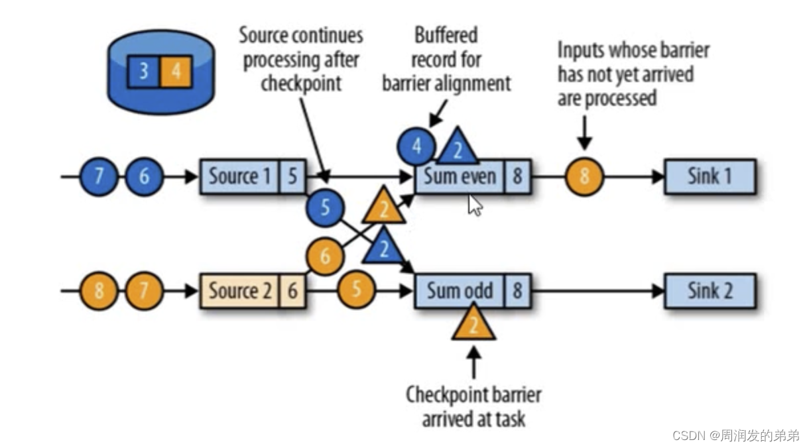
    * 当收到所有分区的barrier时，任务就讲其状态保存到状态后端的检查点中，然后barrier继续向下游广播
      * barrier（ID=2）继续向下游广播。此时蓝色4会从缓存中拿出来做接下来的计算
      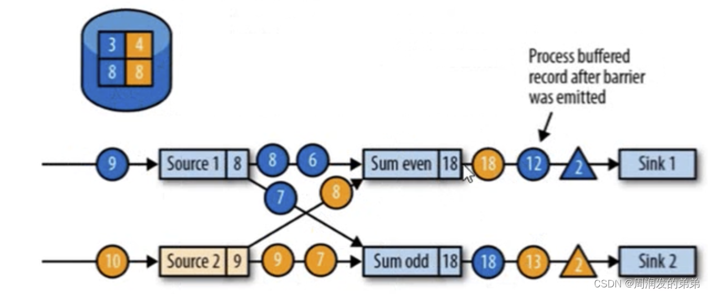
    * sink任务向JobManager确认状态保存到checkpoint完毕
    * 当所有的任务都确认已经成功将状态保存到检查点时，检查点就真正完成了（3-4-8-8拓扑保存完成）
      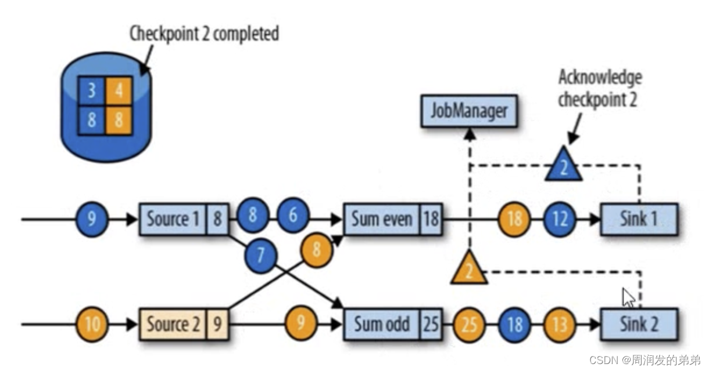
### 一致性检查点 checkpoint
* checkpoint是Flink故障恢复的核心，全称是应用状态的一致性检查点
* 有状态流应用的一致性检查点，其实就是所有任务处理完数据的状态，在某个时间点的一份拷贝（一份快照，存储在状态后端）
* 例子
  * 假设1、2、3、4、5、6、7为source源，even为偶数6=2+4，odd为奇数求和9=1+3+5，此时5这个数据在所有tasks都处理完成了，每个任务都会提交一份快照给JM
  * 最终这份拓扑结构（source任务状态是5、sum_even状态是6、sum_odd状态是9）称为checkpoint
    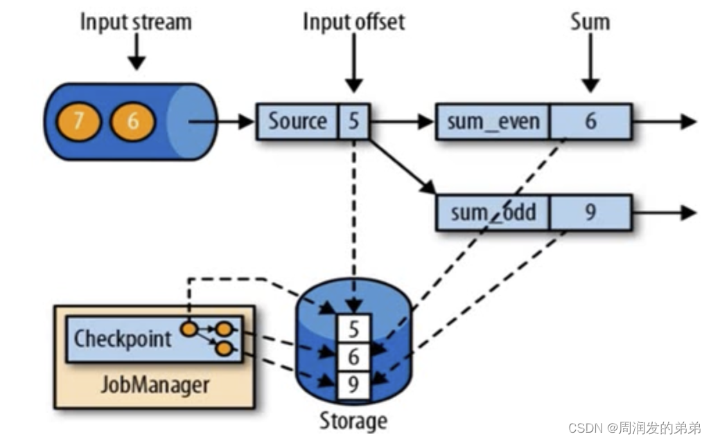

### 从检查点恢复状态
* 在执行流应用期间，Flink会定期保存状态的一致性检查点
* 如果发生故障，Flink会使用最近的检查点来一致恢复应用程序的状态，并重新启动处理流程
* 例子
  * 假设处理到7这个数据的时候，sum_even=2+4+6=12，sum_odd在处理7这个数据的时候fail了，应该如果恢复数据呢
    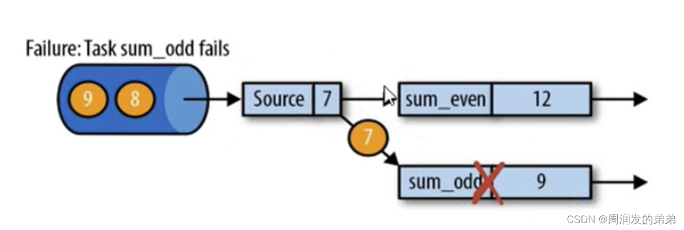
  * 第一步：遇到故障之后，重启受影响的应用，应用重启的之后，所有任务的状态都是空的
    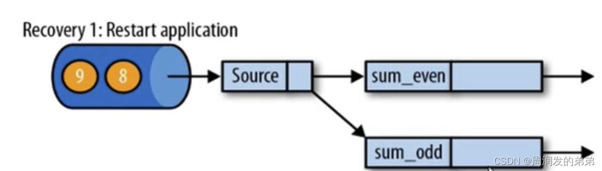
  * 第二步：从checkpoint中读取状态，将状态重置，从检查点重新启动应用程序后，其内部状态与检查点完成时的状态完全相同
    * 恢复后，source任务必须从检查点恢复的结果后开始读取数据（必须从6开始读取数据）
      
  * 第三步：开始消费并处理检查点到发生故障之间的所有数据。
    * 处理完7后，sum_even=2+4+6=12，sum_odd=1+3+5+7=16
      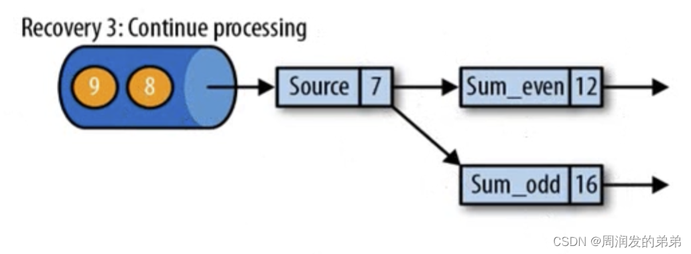
    

### 保存点
* Flink还提供了自定义的镜像保存功能，就是保存点（savepoints）
* 原则上，创建保存点使用的算法与检查点的完全相同，因此保存点可以认为就是具有一些额外元数据的检查点
* Flink不会自动创建保存点，因此用户（或者外部调度系统）必须明确的触发创建操作
* 保存点是一个强大的功能。除了故障恢复外，保存点可以用于：有计划的手动备份，更新应用程序，版本迁移，暂停和重启应用，等等

### 状态后端
* Flink 提供了三种可用的状态后端用于在不同情况下进行状态的保存
  * MemoryStateBackend
    * 内存级的状态后端，将监控状态作为内存中的对象进行管理，将他们存储在TM的JVM堆上，而将checkpoint存储在JobManager的内存中
  * FsStateBackend
    * 将checkpoint存储到远程的持久化系统FileSystem中，而对于本地状态，和MemoryStateBackend一样，也会存储在TaskManager的JVM堆上
  * RocksDBStateBackend
    * 将所有的状态序列化后，存入本地的RocksDB中
    * RocksDb的支持并不直接包含在Flink中，需要引入依赖
    * RocksDBStateBackend 是唯一支持增量快照的状态后端。
