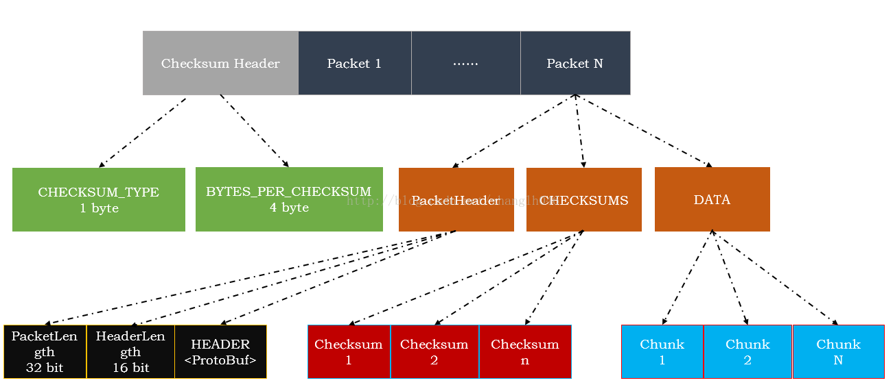

## Block file
Block file name: blk_<block_id>
Checksum file name: blk_<block_id>_<GENERATION_STAMP>.meta

##Checksum file content: 
Version (short) + Checksum Type (byte) + bytesPerChecksum (int) + checksum + checksum ... + checksum
checksum: size is checksumSize bytes. A checksum is calculated for each chunk((bytesPerChecksum bytes).

Checksum Type ---> DataChecksum

##DataChecksum:
    Type: has id (Checksum Type) and size(checksumSize).
    bytesPerChecksum (int)
    Checksum instance
###Checksum Types:
    CHECKSUM_NULL: Type -> 0, checksumSize -> 0
    CHECKSUM_CRC32: Type -> 1, checksumSize -> 4
    CHECKSUM_CRC32C: Type -> 2, checksumSize -> 4
    CHECKSUM_DEFAULT: Type -> 3, checksumSize -> 0 // This cannot be used to create DataChecksum
    CHECKSUM_MIXED: Type -> 4, checksumSize -> 0

## BlockSender: send block data format:
* Send checksumHeader
* Send packets

### In one packet
    // Each packet looks like:
    //   PLEN    HLEN      HEADER     CHECKSUMS  DATA
    //   32-bit  16-bit   <protobuf>  <variable length>
    //
    // PLEN:      Payload length
    //            = length(PLEN) + length(CHECKSUMS) + length(DATA)
    //            This length includes its own encoded length in
    //            the sum for historical reasons.
    //
    // HLEN:      Header length
    //            = length(HEADER)
    //
    // HEADER:    the actual packet header fields, encoded in protobuf
    // CHECKSUMS: the crcs for the data chunk. May be missing if
    //            checksums were not requested
    // DATA       the actual block data
* HeaderLength is the length of HEADER, which occupies 2 bytes.
* PacketLen = total length of chunks + total length of checksum + 4 -> packetLen is int, which occupies 4 bytes.
### Send packet
#### Normal transfer
* check sum before send if verifyChecksum set to true
* send PacketHeader, checksums and chunks to client
#### TransferTo
* send PacketHeader and checksums to client
* Use transferTo to send chunks to client
### An empty packet is sent to mark the end and read completion.

