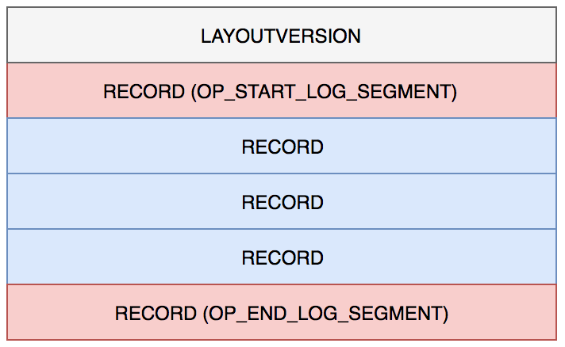

## editlog
* 

* LAYOUTVERSION：版本信息；
* OP_START_LOG_SEGMENT：标识文件开始；
* RECORD：顺序逐个记录 HDFS 写操作的事务内容；
* OP_END_LOG_SEGMENT：标记文件结束

* RECORD (ChecksummedReader.decodeOp()) = logVersion (4 bytes -> int) + FSEditLogOpCodes (1 byte)
           + txid (8 bytes -> long) + ContentsOfFSEditLogOp (FSEditLogOp.readFields)
           + checksum (4 bytes -> int)
           
           
### Question?
* It writes length of OP to edit log for each OP (line 4513) in method writeOp of org.apache.hadoop.hdfs.server.namenode.FSEditLogOp
* But it doesn't read length of OP in ChecksummedReader.decodeOp() in FSEditLogOp.