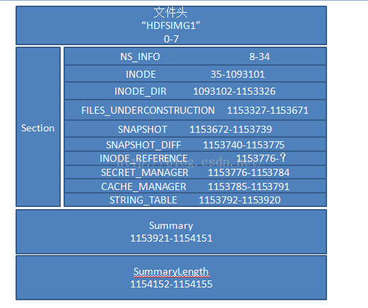
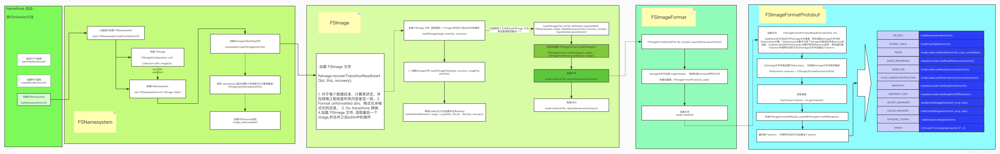

## format
* bin/hdfs namenode –format –clusterid eric
* Call stack:
  NameNode.main() -> NameNode.createNameNode() -> NameNode.format() -> FSImage.format() -> FSImage.saveFSImageInAllDirs() -> FSImageSaver.saveFSImage()

## fsimage
* example code
  ```
    import java.io.IOException;
    import java.io.File;
    import java.util.List;
    import org.junit.Test;
    import java.io.ByteArrayInputStream;
    import java.io.RandomAccessFile;
    import org.apache.hadoop.hdfs.server.namenode.FsImageProto.FileSummary;
    import org.apache.hadoop.hdfs.server.namenode.FsImageProto.FileSummary.Section;
     
    public class TestImageUtil {
    
      public void testImage() {
    
          // 文件头字符串HDFSIMG1对应byte[]
          byte[] fileHead = "HDFSIMG1".getBytes();
    
          RandomAccessFile raFile = null;
          try {
              // 创建文件file，对应为f盘下FSImage文件fsimage_0000000000002311798
              File file = new File("f:/fsimage_0000000000002311798");
                
              raFile = new RandomAccessFile(file, "r");
                
              // 文件summary长度域所占大小为4
              final int FILE_LENGTH_FIELD_SIZE = 4;
              System.out.println("文件summary长度域大小：FILE_LENGTH_FIELD_SIZE=" + FILE_LENGTH_FIELD_SIZE);
                
              // 获取FSImage文件长度
              long fileLength = raFile.length();
              System.out.println("获取FSImage文件长度：fileLength=" + fileLength);
                
              // 创建文件头byte[]数组fileHeadTmp，用于存储文件头byte[]数组，大小为上述fileHead数组大小
              byte[] fileHeadTmp = new byte[fileHead.length];
                
              // 读入文件头至byte[]数组fileHeadTmp
              System.out.println("文件从头开始读取" + fileHeadTmp.length + "个byte至byte[]数组fileHeadTmp");
              raFile.readFully(fileHeadTmp);
                
              // 获取文件头长度
              System.out.println("获取文件头长度：fileHeadLength=" + fileHead.length);
                
              // 将byte[]数组fileHeadTmp转换成字符串fileHeadString
              String fileHeadString = new String(fileHeadTmp);
              // 验证文件头字符串
              System.out.println("fileHeadString=" + fileHeadString);
                
              // 文件file通过raFile.seek()方法定位到文件summary长度字段起始处，即文件大小减去文件summary长度域所占字节数4
              raFile.seek(fileLength - FILE_LENGTH_FIELD_SIZE);
              System.out.println("文件定位到文件summary长度开始处：" + (fileLength - FILE_LENGTH_FIELD_SIZE));
                
              // 读入一个int，即文件长度summaryLength
              int summaryLength = raFile.readInt();
              System.out.println("获取文件summary部分长度：summaryLength=" + summaryLength);
                
              // 文件file通过raFile.seek()方法定位到文件summary部分开始处，即文件大小减去文件长度所占字节数4，再减去文件内容总长度
              raFile.seek(fileLength - FILE_LENGTH_FIELD_SIZE - summaryLength);
              System.out.println("文件定位到文件summary部分开始处：" + (fileLength - FILE_LENGTH_FIELD_SIZE - summaryLength));
                
              // 再从当前位置开始读入文件summary部分内容
              // 构造文件长度summaryLength大小的byte[]数组
              byte[] summaryBytes = new byte[summaryLength];
                
              // 读取文件内容至数组summaryBytes
              raFile.readFully(summaryBytes);
              System.out.println("从当前位置开始读入文件summary部分内容至summaryBytes数组");
                
              FileSummary summary = FileSummary
                  .parseDelimitedFrom(new ByteArrayInputStream(summaryBytes));
                
              System.out.println("解析文件summary部分内容如下：");
              System.out.println("1、ondiskVersion=" + summary.getOndiskVersion());
              System.out.println("2、layoutVersion=" + summary.getLayoutVersion());
              System.out.println("3、codec=" + summary.getCodec());
                
              System.out.println("4、section"); 
              List<Section> sectionsList = summary.getSectionsList();
              for (Section section : sectionsList) {
                  System.out.println(" ");
                  System.out.println("name=" + section.getName());
                  System.out.println("length=" + section.getLength());
                  System.out.println("offset=" + section.getOffset());
              }
          } catch (Exception e) {
              e.printStackTrace();
          } finally {
              if (raFile != null) {
                  try {
                      raFile.close();
                  } catch (IOException e) {
                      e.printStackTrace();
                  }
              }
          }
      }
    }
  ```
* Output
  ```
    文件summary长度域大小：FILE_LENGTH_FIELD_SIZE=4
    获取FSImage文件长度：fileLength=1154156
    文件从头开始读取8个byte至byte[]数组fileHeadTmp
    获取文件头长度：fileHeadLength=8
    fileHeadString=HDFSIMG1
    文件定位到文件summary长度开始处：1154152
    获取文件summary部分长度：summaryLength=231
    文件定位到文件summary部分开始处：1153921
    从当前位置开始读入文件summary部分内容至summaryBytes数组
    解析文件summary部分内容如下：
    1、ondiskVersion=1
    2、layoutVersion=-60
    3、codec=
    4、section
     
    name=NS_INFO
    length=27
    offset=8
     
    name=INODE
    length=1093067
    offset=35
     
    name=INODE_DIR
    length=60225
    offset=1093102
     
    name=FILES_UNDERCONSTRUCTION
    length=345
    offset=1153327
     
    name=SNAPSHOT
    length=68
    offset=1153672
     
    name=SNAPSHOT_DIFF
    length=36
    offset=1153740
     
    name=INODE_REFERENCE
    length=0
    offset=1153776
     
    name=SECRET_MANAGER
    length=9
    offset=1153776
     
    name=CACHE_MANAGER
    length=7
    offset=1153785
     
    name=STRING_TABLE
    length=129
    offset=1153792
  ```

  原文链接：https://blog.csdn.net/lipeng_bigdata/article/details/51277267
* 

### each section
* INODE（INodeSection）：整个目录树所有节点数据，包括 INodeFile/INodeDirectory/INodeSymlink 等所有类型节点的属性数据，其中记录了如节点 id，节点名称，访问权限，创建和访问时间等等信息；
* INODE_DIR（INodeDirectorySection）：整个目录树中所有节点之间的父子关系，配合 INODE 可构建完整的目录树；
* FILES_UNDERCONSTRUCTION（FilesUnderConstructionSection）：尚未完成写入的文件集合，主要为重启时重建 Lease 集合；
* SNAPSHOT（SnapshotSection）：记录 Snapshot 数据，快照是 Hadoop 2.1.0 引入的新特性，用于数据备份、回滚，以防止因用户误操作导致集群出现数据问题；
* SNAPSHOT_DIFF（SnapshotDiffSection）：执行快照操作的目录 / 文件的 Diff 集合数据，与 SNAPSHOT 一起构建较完整的快照管理能力；
* SECRET_MANAGER（SecretManagerSection）：记录 DelegationKey 和 DelegationToken 数据，根据 DelegationKey 及由 DelegationToken 构造出的 DelegationTokenIdentifier 方便进一步计算密码，以上数据可以完善所有合法 Token 集合；
* CACHE_MANAGER（CacheManagerSection）：集中式缓存特性全局信息，集中式缓存特性是 Hadoop-2.3.0 为提升数据读性能引入的新特性；
* STRING_TABLE（StringTableSection）：字符串到 id 的映射表，维护目录 / 文件的 Permission 字符到 ID 的映射，节省存储空间；


## load fsimage
* Call stack:
NameNode.main() -> NameNode.createNameNode() -> NameNode.NameNode() -> NameNode.initialize() -> NameNode.loadNamesystem() -> FSNamesystem.loadFromDisk()
* 