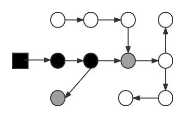
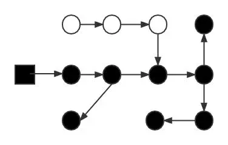
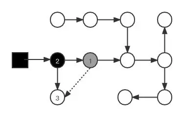
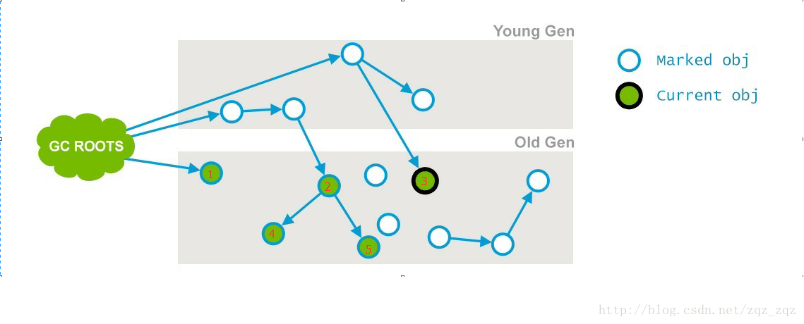
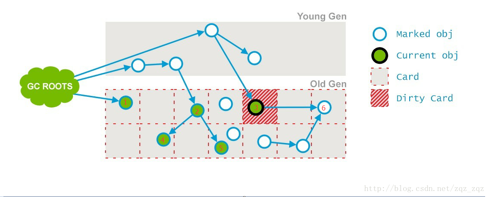

# 垃圾回收器CMS - Concurrent Mark Sweep

## CMS回收
* CMS是在老年代的垃圾回收算法 
* 具体分为六个步骤：初始标记、并发标记、并发预处理、重新标记、并发清理、并发重置

  

* 三色标记（Tri-Color Marking）
  * 白色：对象没有被垃圾回收器访问过。在初始阶段，所有的对象都是白色的，在可达性分析后如果对象还是白色，则说明这个对象是不可达的，需要被回收。
  * 黑色：对象已经被垃圾回收器访问过，且这个对象所有的引用都已经被扫描过。黑色代表这个对象被扫描过，且是存活的，如果有其他对象引用指向黑色对象，则无需重新扫描。黑色对象不可直接指向某个白色对象。
  * 灰色：对象已经被垃圾收集器扫描过，但这个对象上还存在至少一个引用没有被扫描过。
  * 过程
    1. 初始状态: 只有GC Roots是黑色的。箭头的方向代表引用的方向。如下图：GC Roos引用一个对象。一个对象只有被黑色对象引用才能存活。

        
    2. 扫描过程: 从GC Roots开始，沿着引用链不断扫描，灰色对象是黑色对象和白色对象的分界点。
       
       
    3. 扫描完成：这时候黑色对象就是存活的对象，白色对象就是已经死亡的对象，需要被回收。
       
       
    4. 下图图展示了GC线程标记后用户线程又修改了引用关系：灰色对象1到白色对象3的引用被切断。同时已经扫描过的黑色对象2建立了和白色对象3的关系。这种情况非常危险，因为黑色对象2不会被重新扫描，导致实际存活的对象3被认为是死亡。
       
       
        * 当且仅当以下两个条件同时满足时，会产生“对象消失”的问题，即：应该是黑色的对象被误标记为白色。 
          * 赋值器插入了一条或多条从黑色对象到白色对象的新引用 
          * 赋值器删除了全部从灰色对象到该白色对象的直接或间接引用
        * 因此要解决并发标记时对象消失问题，只需要破坏这两个条件的任意一个即可。由此产生了两个方案：
          * 增量更新(Incremental Update)：破坏第一个条件。当黑色对象被插入指向白色对象的引用关系时，就将黑色对象记录下来，等并发标记结束之后，再以黑色对象为根重新扫描。也可以简单理解为：只要被插入指向白色对象的引用，黑色对象就变成了灰色对象。
          * 原始快照(Snapshot At The Begining)：破坏第二个条件。当灰色对象要删除指向白色对象的引用关系时，将这个引用关系记录下来。在并发标记结束之后，再以这些记录下来的引用关系中的灰色对象为根，重新扫描一次。可以简化理解为：在引用关系删除的那一刻，将引用关系以快照的方式存下来 ，之后再进行搜索。
        * CMS使用的是增量更新；G1使用的是原始快照。
1. 初始标记 
   * 初始标记阶段会触发stop the world，标记所有（1）GCRoots直接关联的对象，以及（2）年轻代对象对老年代对象的引用。这个阶段的速度很快，因为没有向下追溯，即只标记一层。 间接关联的在下一阶段。
     *（1）标记老年代中所有的GC Roots对象，如下图节点1；
     *（2）标记年轻代中活着的对象引用到的老年代的对象（指的是年轻带中还存活的引用类型对象，引用指向老年代中的对象）如下图节点2、3；
     
     
   * ps：为了加快此阶段处理速度，减少停顿时间，可以开启初始标记并行化，-XX:+CMSParallelInitialMarkEnabled，同时调大并行标记的线程数，线程数不要超过cpu的核数；
2. 并发标记
   * 与用户线程并发执行，会遍历上一阶段标记过的对象进行遍历，并将这些对象所有的引用进行标记。
     * 第一，第二阶段就是要将老年代，新生代的里面存活的对象找出来
     * 如下图，根据GCRoot节点1、2、3，最终标记了节点4和5。
     
       
   * 不是老年代的所有存活对象都会被标记，因为标记的同时应用程序会改变一些对象的引用。如下所示对象在这阶段可能没被标记：
     1. 年轻代部分对象晋升至老年代 
        * 晋升到老年代的这些对象可能还被年轻代的对象引用，所以它们变成了GCRoot       -> 重新标记阶段处理
     2. 老年代对象引用发生变更 （一个GCRoot对象引用了另一个未标记的老年代对象，这个被引用的对象也是可达对象） -> 预清理阶段处理
     3. 还有一些大对象直接进入老年代。(新的GCRoot)   -> 重新标记阶段处理
   * 为了提高下一阶段重新标记的效率，该阶段会把上述对象所在的Card标识为Dirty，后续只需扫描这些Dirty Card的对象，避免扫描整个老年代；
   * 并发标记阶段只负责将引用发生改变的Card标记为Dirty状态，不负责处理；
     * card table（卡表）：将老年代空间分成若干card（通常一个card 128 byte）。记录每个card的状态的表叫卡表
       
       
   * 如下图所示，在并发标记阶段，节点3的引用指向了6；则会把节点3所在的card标记为Dirty；
     
     

3. 预清理阶段
   * 这个阶段就是用来处理前一个阶段因为引用关系改变导致没有标记到的存活对象的，它会扫描所有标记为Direty的Card
     * 根据节点3所在的card，扫描节点3的引用，找到并标记节点6
       
       

4. 重新标记
   * 这个阶段会导致第二次stop the word，该阶段的任务是完成标记整个年老代的所有的存活对象。
   * 这个阶段，重新标记的内存范围是整个堆，包含_young_gen和_old_gen。为什么要扫描新生代呢，因为对于老年代中的对象，如果被新生代中的对象引用，那么就会被视为存活对象，即使新生代的对象已经不可达了，也会使用这些不可达的对象当做cms的“gc root”，来扫描老年代
     * 可以加入参数-XX:+CMSScavengeBeforeRemark，在重新标记之前，先执行一次ygc，
   * 可以开启并行收集：-XX:+CMSParallelRemarkEnabled

5. 并发清理
   * 通过以上几个阶段的标记，老年代所有存活的对象已经被标记并且现在要通过Garbage Collector采用清扫的方式回收那些不能用的对象了。 这个阶段主要是清除那些没有标记的对象并且回收空间；
   * 由于CMS并发清理阶段用户线程还在运行着，伴随程序运行自然就还会有新的垃圾不断产生，这一部分垃圾出现在标记过程之后，CMS无法在当次收集中处理掉它们，只好留待下一次GC时再清理掉。这一部分垃圾就称为“浮动垃圾”。

6. 并发重置
   * 这个阶段并发执行，重新设置CMS算法内部的数据结构，准备下一个CMS生命周期的使用。