# Java 并发编程
## 基础

### 基础概念
* 原子性：即一个操作或者多个操作，要么全部执行并且执行的过程不会被任何因素打断，要么就都不执行
* 可见性：指当多个线程访问同一个变量时，一个线程修改了这个变量的值，其他线程能够立即看得到修改的值
* 有序性：即程序执行的顺序按照代码的先后顺序执行

#### 线程之间如何通信？
* 命令式编程中线程通信的方式：
  * 共享内存: 线程之间共享内存的公共状态
  * 消息传递: 线程之间靠消息的发送接收来显示的进行通信
* Java 使用共享内存模型进行线程通信

#### Java 内存模型是什么？
* Java 内存模型（Java Memory Model，JMM）用于屏蔽掉各种硬件和操作系统的内存访问差异，以实现让 Java 程序在各种平台下都能达到一致的并发效果。
* JMM 规范了 Java 虚拟机与计算机内存是如何协同工作的
  * 规定了一个线程如何和何时可以看到由其他线程修改过后的共享变量的值
  * 以及在必须时如何同步的访问共享变量

#### 现代硬件内存架构
* 现代硬件内存模型与 Java 内存模型有一些不同
  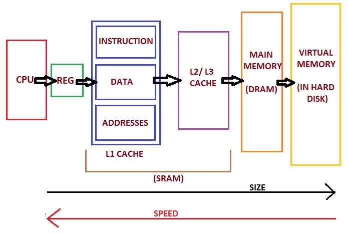
  * 多 CPU
    * 一个现代计算机通常由两个或者多个 CPU。其中一些 CPU 还有多核。
    * 每个 CPU 在某一时刻运行多个线程是没有问题的。
  * CPU 寄存器
    * 每个 CPU 都包含一系列的寄存器，它们是 CPU 内内存的基础。
    * CPU 在寄存器上执行操作的速度远大于在主存上执行的速度。这是因为 CPU 访问寄存器的速度远大于主存。
  * 高速缓存 cache (L1/L2/L3)
    * 计算机的存储设备与处理器的运算速度之间有着几个数量级的差距
    * 现代计算机系统都不得不加入一层读写速度尽可能接近处理器运算速度的高速缓存（Cache）来作为内存与处理器之间的缓冲
      * 将运算需要使用到的数据复制到缓存中，让运算能快速进行
      * 当运算结束后再从缓存同步回内存之中
      * 这样处理器就无须等待缓慢的内存读写了
      * CPU 访问缓存层的速度快于访问主存的速度
      * 但通常比访问内部寄存器的速度还要慢一点
      * 每个 CPU 可能有一个 CPU 缓存层或多层缓存 （L1/L2/L3）
      * 某一时刻，一个或者多个缓存行（cache lines）可能被读到缓存，一个或者多个缓存行可能再被刷新回主存。
  * 内存
    * 一个计算机还包含一个主存,所有的 CPU 都可以访问主存
    * 主存通常比 CPU 中的缓存大得多
* 运作原理
  * 通常情况下，当一个 CPU 需要读取主存时，它会将主存的部分读到 CPU 缓存中
  * 再将缓存中的部分内容读到它的内部寄存器中,然后在寄存器中执行操作
  * 当 CPU 需要将结果写回到主存中去时，它会将内部寄存器的值刷新到缓存中，然后在某个时间点将值刷新回主存
* 多线程环境下一些问题
  * 缓存一致性问题
    * 当多个处理器的运算任务都涉及同一块主内存区域时，将可能导致各自的缓存数据不一致的情况
    * 如果真的发生这种情况，那同步回到主内存时以谁的缓存数据为准呢？
    * 为了解决一致性的问题，需要各个处理器访问缓存时都遵循一些协议 (一致性协议)， 在读写时要根据协议来进行操作
    * 这类协议有 MSI、MESI（IllinoisProtocol）、MOSI、Synapse、Firefly 及 DragonProtocol，等等
  * 指令重排序问题
    * 为了使得处理器内部的运算单元能尽量被充分利用，处理器可能会对输入代码进行乱序执行（Out-Of-Order Execution）优化
    * 处理器会在计算之后将乱序执行的结果重组，保证该结果与顺序执行的结果是一致的
    * 但并不保证程序中各个语句计算的先后顺序与输入代码中的顺序一致
    * 因此，如果存在一个计算任务依赖另一个计算任务的中间结果，那么其顺序性并不能靠代码的先后顺序来保证
    * 与处理器的乱序执行优化类似，Java 虚拟机的即时编译器中也有类似的指令重排序（Instruction Reorder）优化

#### Java 内存模型结构 (JMM)
* Java 堆和方法区是多个线程共享的数据区域，多个线程可以操作堆和方法区中的同一个数据
* Java 内存模型的英文名称为 Java Memory Model(JMM)，其并不像 JVM 内存结构一样真实存在，而是一个抽象的概念
* 从抽象的角度来看，JMM 定义了线程和主内存之间的抽象关系
  * 线程之间的共享变量存储在主内存（Main Memory）中
  * 每个线程都有一个私有的本地内存（Local Memory）
    * 本地内存是 JMM 的一个抽象概念，并不真实存在
    * 本地内存涵盖了缓存、写缓冲区、寄存器以及其他的硬件和编译器优化
    * 本地内存中存储了该线程以读/写共享变量的拷贝副本
  * 从更低的层次来说，主内存就是硬件的内存
  * 而为了获取更好的运行速度，虚拟机及硬件系统可能会让工作内存优先存储于寄存器和高速缓存中 （抽象本地内存）
  * Java 内存模型中的线程的工作内存（working memory）是 cpu 的寄存器和高速缓存的抽象描述
  * 而 JVM 的静态内存储模型（JVM 内存模型）只是一种对内存的物理划分而已，它只局限在内存，而且只局限在 JVM 的内存。
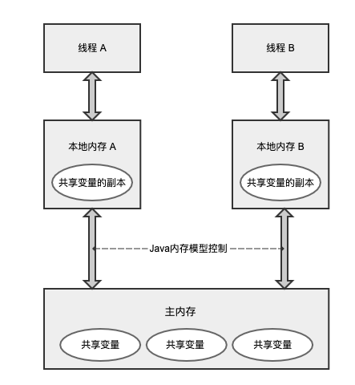
* 从整体上看，这个通信过程需要经过主内存。JMM 通过控制主内存与每个线程本地内存之间的交互来提供内存可见性保证

##### JMM 规定主内存与工作内存交互协议
* 关于主内存与工作内存之间的具体交互协议
  * 即一个变量如何从主内存拷贝到工作内存，如何从工作内存同步到主内存之间的实现细节
* JMM 定义了以下八种操作来完成
  * lock（锁定）：作用于主内存的变量，把一个变量标识为一条线程独占状态
  * unlock（解锁）：作用于主内存变量，把一个处于锁定状态的变量释放出来，释放后的变量才可以被其他线程锁定
  * read（读取）：作用于主内存变量，把一个变量值从主内存传输到线程的工作内存中，以便随后的 load 动作使用
  * load（装载）：作用于工作内存的变量，它把 read 操作从主内存中得到的变量值放入工作内存的变量副本中
  * use（使用）：作用于工作内存的变量，把工作内存中的一个变量值传递给执行引擎，每当虚拟机遇到一个需要使用变量的值的字节码指令时将会执行这个操作
  * assign（赋值）：作用于工作内存的变量，它把一个从执行引擎接收到的值赋值给工作内存的变量，每当虚拟机遇到一个给变量赋值的字节码指令时执行这个操作
  * store（存储）：作用于工作内存的变量，把工作内存中的一个变量的值传送到主内存中，以便随后的 write 的操作
  * write（写入）：作用于主内存的变量，它把 store 操作从工作内存中一个变量的值传送到主内存的变量中
* JMM 还规定了在执行上述八种基本操作时，必须满足如下规则
  * 如果要把一个变量从主内存中复制到工作内存，就需要按顺寻地执行 read 和 load 操作， 如果把变量从工作内存中同步回主内存中，就要按顺序地执行 store 和 write 操作。但 JMM 只要求上述操作必须按顺序执行，而没有保证必须是连续执行。
  * 不允许 read 和 load、store 和 write 操作之一单独出现
  * 不允许一个线程丢弃它的最近 assign 的操作，即变量在工作内存中改变了之后必须同步到主内存中。
  * 不允许一个线程无原因地（没有发生过任何 assign 操作）把数据从工作内存同步回主内存中。
  * 一个新的变量只能在主内存中诞生，不允许在工作内存中直接使用一个未被初始化（load 或 assign）的变量。即就是对一个变量实施 use 和 store 操作之前，必须先执行过了 load 和 assign 操作。
  * 一个变量在同一时刻只允许一条线程对其进行 lock 操作，但 lock 操作可以被同一条线程重复执行多次，多次执行 lock 后，只有执行相同次数的 unlock 操作，变量才会被解锁。lock 和 unlock 必须成对出现
  * 如果对一个变量执行 lock 操作，将会清空工作内存中此变量的值，在执行引擎使用这个变量前需要重新执行 load 或 assign 操作初始化变量的值
  * 如果一个变量事先没有被 lock 操作锁定，则不允许对它执行 unlock 操作；也不允许去 unlock 一个被其他线程锁定的变量。
  * 对一个变量执行 unlock 操作之前，必须先把此变量同步到主内存中（执行 store 和 write 操作）

#### 重排序
* 为什么要重排序？
  * 为了提高性能，编译器与处理器通常会对指令做重排序，通常为 3 种
    * 编译器优化的重排序: 不改变单线程语义的情况下重新安排语句执行顺序
    * 指令级并行的重排序: 现在处理器采用指令并行技术，可将多条指令并行执行。如果不存在数据依赖性，可以改变语句对应指令顺序
    * 内存系统的重排序: 由于处理器使用缓存和读写缓存区，使得加载和存储操作看上去是乱序执行
* 源码如何变成执行指令？
  * 步骤：`源代码->1 编译器优化重排序->2 指令级并行重排序->3 内存系统重排序-> 最终执行指令`
    * 对于步骤 1 是编译器重排序，步骤 2、3 是处理器重排序
  * 对于编译器重排序，JMM 的编译器重排序规则会禁止特定类型的重排序
  * 对于处理器重排序，JMM 的处理器重排序规则会要求 Java 编译器生成指令序列时插入特定类型的内存屏障指令来禁止特定类型的重排序。


#### 内存屏障
* load（装载）：作用于工作内存的变量，它把 read 操作从主内存中得到的变量值放入工作内存的变量副本中。
* store（存储）：作用于工作内存的变量，把工作内存中的一个变量的值传送到主内存中，以便随后的 write 的操作。
* 内存屏障的四种类型如下：

| 屏障类型            | 指令示例 |                                                   |
|-----------------| ------ |---------------------------------------------------|
| LoadLoad 屏障     | Load1;LoadLoad;Load2 | 确保 Load1 数据装载先于 Load2 及所有后续装载指令的装载                |
| StoreStore 屏障   | Store1;StoreStore;Store2 | 确保 Store1 数据对其他处理器可见（刷新到内存）先于 Store2 及所有后续存储指令的存储 |
| LoadStore 屏障    | Load1;LoadStore;Store2 | 确保 Load1 数据装载先于 Store2 及所有后续存储指令刷新到内存 |
| StoreLoad 屏障    | Store1;StoreLoad;Load2	| 确保 Store1 数据对其他处理器可见（刷新到内存）先于 Load2 及所有后续装载指令的装载。该屏障会使之前所有的内存访问指令（存储和装载）完成之后，才执行该屏障之后的内存访问指令 |

#### happens-before 语义
* 从 JDK5 开始，Java 使用新的 JSR-133 内存模型进行管理。JSR-133 使用 happens-before 概念来阐述操作之间的可见性
* 在 JMM 中如果一个操作执行的结果需要对另外一个操作可见，那么这两个操作之间必须要存在 happens-before 关系（2 个操作可以是同一线程或不同线程中）
* JMM 把 happens-before 重排序分为 2 类：
  1. 会改变程序结果的重排序，JMM 要求编译器和处理器禁止这种重排序。
  2. 不会改变程序结果的重排序，JMM 允许这种重排序。 
* 分析可知 JMM 遵循一个基本原则：只要不改变程序执行结果（单线程和同步的多线程）编译器和处理器怎么优化都可以，比如
  * 一个锁只被单线程访问，那么锁可以消除
  * 一个 volatile 变量只被单线程访问，编译器可以把它当做普通变量使用 
* happens-before 规则：
  * 程序顺序规则：在一个线程内，按照程序代码的顺序，前面的代码运行的结果能被后面的代码可见
  * 监视器锁规则：一个锁的解锁 happens-before 于后续对这个锁的加锁
  * volatile 变量规则：对一个 volatile 域的写，happens-before 于任意后续对这个 volatile 域的读
    * 前一个操作的结果对后一个操作可见：写入volatile变量的值会立即对所有线程可见，而且后续读取该volatile变量的值的操作将看到最新的写入值。
    * 内存屏障：Java内存模型会在volatile写之前插入一个写屏障，确保写操作先于后续的读操作。这个写屏障会阻止处理器重排序写操作和后续的读操作，从而确保happens-before关系。
    * 缓存一致性协议：处理器和操作系统会根据缓存一致性协议来保证volatile变量的一致性，确保对volatile变量的写操作能够被其他处理器看到。
  * 传递性规则：如果 A happens-before B，且 B happens-before C，那么 A happens-before C
  * start() 规则：指的是主线程 A 启动子线程 B 后，子线程 B 能看到主线程在启动线程 B 前的任何操作
  * join() 规则：主线程 A 等待子线程 B 完成 (对 B 线程 join() 调用)，当子线程 B 操作完成后，主线程 A 能看到 B 线程的操作
  * interrupt() 规则：线程 A 调用线程 B 的 interrupt() 方法，happens-before 于线程 B 检测中断事件 (也就是 Thread.interrupted() 方法)
  * finalize() 规则：对象的构造函数执行、结束 happens-before 于 finalize() 方法的开始

#### as-if-serial 语义
* 不管怎么重排序（编译器和处理器为了提高并行度），（单线程）程序的执行结果不会改变
* 编译器、runtime 和处理器都必须遵守 as-if-serial 语义
* 为了遵守 as-if-serial 语义，编译器和处理器不会对存在数据依赖关系的操作做重排序
* 如果操作之间不存在数据依赖关系，这些操作就可能被编译器和处理器重排序


### 顺序一致性
* 什么是数据竞争
  * 当程序未正确同步时，就会存在数据竞争
  * java 内存模型规范对数据竞争的定义如下：在一个线程中写一个变量，在另一个线程读同一个变量，而且写和读没有通过同步来排序
  * 如果一个多线程程序能正确同步，这个程序将是一个没有数据竞争的程序，程序的执行将具有顺序一致性。
* 理论参考模型-顺序一致性内存模型
  * 它为程序员提供了极强的内存可见性保证
  * JMM 在规范里也保证了顺序一致性
  * 顺序一致性内存模型有两大特性：
    * 一个线程中的所有操作必须按照程序的顺序来执行
    * 所有线程都只能看到一个单一的操作执行顺序
  * 举例说明：
    * 假设有两个线程 A 和 B 并发执行（线程 A 执行后线程 B 执行）
    * A 线程有三个操作，它们在程序中的顺序是：A1->A2->A3
    * B 线程有三个操作，它们在程序中的顺序是：B1->B2->B3
    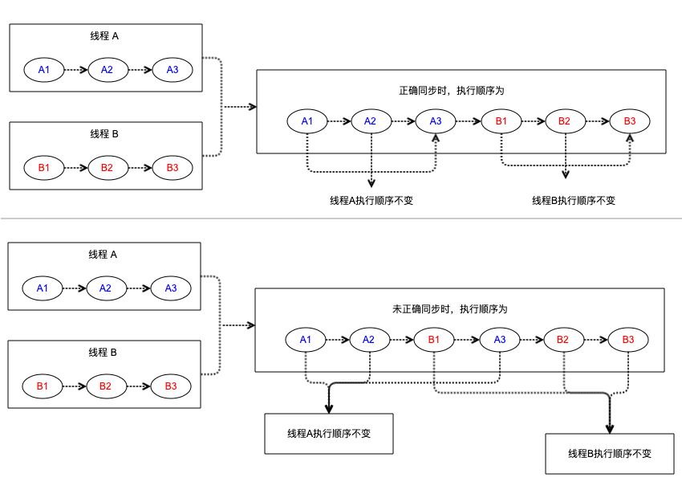
    * 顺序一致性特征说明
      * 线程 A 程序的执行顺序永远是 A1->A2->A3
      * 线程 B 程序的执行顺序永远是 B1->B2->B3
      * 如果正确同步的话，线程 A 执行后释放监视器给线程 B 执行顺序将是 A1->A2->A3->B1->B2->B3
      * 如果未正确同步的话，可能（CPU 抢占问题）出现的顺序是 A1->A2->B1->A3->B2->B3
        * 未正确同步程序在顺序一致性模型中虽然整体执行顺序是无序的，但所有线程都只能看到一个一致的整体执行顺序
        * 以上图为例，线程 A 和 B 看到的执行顺序都是：A1->A2->B1->A3->B2->B3
          * 之所以能得到这个保证是因为顺序一致性内存模型中的每个操作必须立即对任意线程可见
* JMM-顺序一致性内存模型
  * 顺序一致性，保证程序的执行顺序一致
  * JMM 会根据一定规则（比如遵循 happens-before 原则），会对程序执行指令进行重排序，达到对编译器和处理器优化的目标。
  * 在 JMM 模型下，在不影响程序执行结果的前提下，编译器、处理器会对指令进行重排序
  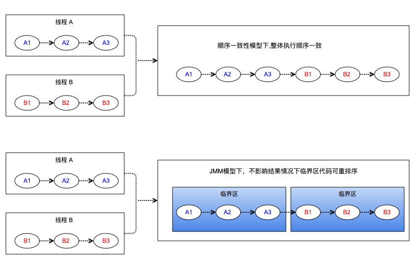
  * 特别说明：
    * 假如线程 A 的 "A2" 操作必须保证对线程 B 的"B2"的可见性
    * 每个线程临界区的代码重排序，可能最终执行顺序为：A3->`A2`->B3->`B2`->A1->B1

* 理论参考模型与 JMM 模型差异比对
  * 实际上，【理论参考模型-顺序一致性内存模型】我们很少用
  * 因为这样编译器和处理器无法对程序做到优化，在 Java 中我们使用的是可以进行指令重排序的 JMM 模型
  * 顺序一致模型要求线程的每一个操作都具有原子性，也就是说，读写都会操作主存，这样的效率肯定会比 JMM 模型下先对线程本地内存操作的方式要低的多。


### CAS实现原理
* CAS 是什么
  * Compare And Swap 的缩写
  * Java 的 compareAndSet(jdk13)/compareAndSwap(jdk1.8) 相关方法调用简称为 CAS
  * CAS 机制当中使用了 3 个基本操作数：内存地址 V，旧的预期值 A，要修改的新值 B
    * 更新一个变量的时候，只有当变量的预期值 A 和内存地址 V 当中的实际值相同时，才会将内存地址 V 对应的值修改为 B
  * CAS 操作的是乐观锁，每次不加锁而是假设没有冲突而去完成某项操作，如果因为冲突失败就重试，直到成功为止
  * JDK 文档对 compareAndSet() 方法说明：如果当前状态值等于预期值，则以原子方式将同步状态 设置为给定的更新值。此操作具有 volatile 读和写的内存语义。
* CAS 实现原理
  * 分析 Java 中Unsafe#compareAndSwapInt方法
    * native 方法最终调用实现`hotspot/src/os_cpu/linux_x86/vm/atomic_linux_x86.inline.hpp`中`Atomic::cmpxchg`实现
    ```
    inline jint Atomic::cmpxchg(jint exchange_value, volatile jint* dest, jint compare_value) {
      int mp = os::is_MP();
      __asm__ volatile (LOCK_IF_MP(%4) "cmpxchgl %1,(%3)"
                        : "=a" (exchange_value)
                        : "r" (exchange_value), "a" (compare_value), "r" (dest), "r" (mp)
                        : "cc", "memory");
      return exchange_value;
    }
    ```
    * 程序会根据当前处理器的类型来决定是否为 cmpxchg 指令添加 lock 前缀。
      * 如果程序是在多处理器上运行，就为 cmpxchg 指令加上 lock 前缀 (Lock Cmpxchg)。
      * 如果程序是在单处理器上运行，就省略 lock 前缀 (单处理器自身会维护单处理器内的顺序一致性，不需要 lock 前缀提供的内存屏障效果)。
  * intel 的手册对 lock 前缀的说明如下：
    1. 确保对内存的读-改-写操作原子执行。
       * 在 Pentium 及 Pentium 之前的处理器中，带有 lock 前缀的指令在执行期间会锁住总线，使得其他处理器暂时无法通过总线访问内存。
       * 很显然，这会带来昂贵的开销。从 Pentium 4、Intel Xeon 及 P6 处理器开始，Intel 使用缓存锁定 (Cache Locking) 来保证指令执行的原子性
       * 缓存锁定将大大降低 lock 前缀指令的执行开销
    2. 禁止该指令与之前和之后的读和写指令重排序
    3. 把写缓冲区中的所有数据刷新到内存中
    * 上面的第 2 点和第 3 点所具有的内存屏障效果，足以同时实现 volatile 读和 volatile 写的内存语义
    * 经过上面的分析，现在我们终于能明白为什么 JDK 文档说 CAS 同时具有 volatile 读和 volatile 写的内存语义了
* CAS 实现原子操作的三大问题
  1. ABA 问题
     * 如果一个值原来是 A，变成了 B，又变成了 A，那么使用 CAS 进行检查时会发现它的值没有发生变化，但是实际上却变化了
     * ABA 问题的解决思路就是使用版本号
       * 在变量前面 追加上版本号，每次变量更新的时候把版本号加 1，那么 A→B→A 就会变成 1A→2B→3A
       * 从 Java 1.5 开始，JDK 的 Atomic 包里提供了一个类 AtomicStampedReference 来解决 ABA 问题
         * 这个类的 compareAndSet 方法的作用是首先检查当前引用是否等于预期引用，并且检查当前标志是否等于预期标志
         * 如果全部相等，则以原子方式将该引用和该标志的值设置为给定的更新值 
  2. 循环时间长开销大
     * 自旋 CAS 如果长时间不成功，会给 CPU 带来非常大的执行开销
     * 如果 JVM 能支持处理器提供的 pause 指令，那么效率会有一定的提升。 pause 指令有两个作用:
       * 它可以延迟流水线执行指令 (de-pipeline)，使 CPU 不会消耗过多的执行资源
       * 延迟的时间取决于具体实现的版本，在一些处理器上延迟时间是零
       * 它可以避免在退出循环的时候因内存顺序冲突 (Memory Order Violation) 而引起 CPU 流水线被清空 (CPU Pipeline Flush)，从而提高 CPU 的执行效率
  3. 只能保证一个共享变量的原子操作
     * 当对一个共享变量执行操作时，我们可以使用循环 CAS 的方式来保证原子操作
     * 但是对多个共享变量操作时，循环 CAS 就无法保证操作的原子性，这个时候就可以用锁
     * 还有一个取巧的办法，就是把多个共享变量合并成一个共享变量来操作
     * 比如，有两个共享变量 i=2，j=a，合并一下 ij=2a，然后用 CAS 来操作 ij
     * 从 Java 1.5 开始，JDK 提供了 AtomicReference 类来保证引用对象之间的原子性，就可以把多个变量放在一个对象里来进行 CAS 操作
  * 使用场景
    * 保证以上三大问题不与需求有冲突
    * 我们在并发修改单个变量时，是否需要先比较再修改，如果不需要那 volatile 是否满足需求 ？

### 原子操作
* 什么是原子操作
  * 原子本意是“不能被进一步分割的最小粒子”
  * 原子操作意为“不可被中断的一个或一系列操作”
  * 我们形象的理解为在并发编程中：
    * 如果一块代码需要并发操作，则这块代码就是一个原子操作
    * 一个共享变量在不同线程之间要同步修改，以保证程序准确性，那么修改这个变量的操作就是原子操作
* 处理器如何实现原子操作
  * 处理器提供总线锁定和缓存锁定两个机制来保证复杂内存操作的原子性
    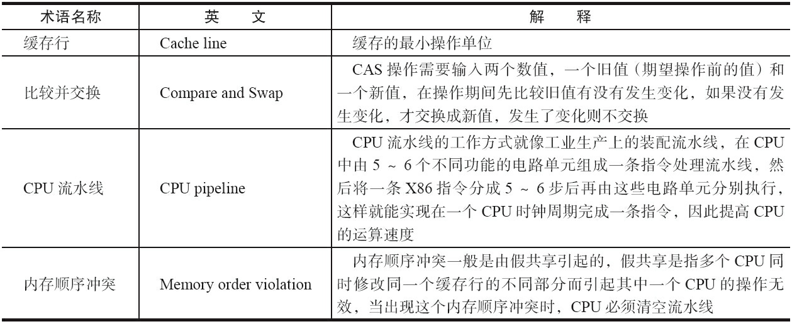
    * 使用总线锁保证原子性
      * 总线锁就是使用处理器提供的一个 LOCK#信号
      * 当一个处理器在总线上输出此信号时，其他处理器的请求将被阻塞住，那么该处理器可以独占共享内存
      * 总线锁定把 CPU 和内存之间的通信锁住了，这使得锁定期间，其他处理器不能操作其他内存地址的数据
    * 使用缓存锁保证原子性
      * 总线锁定的开销比较大，目前处理器在某些场合下使用缓存锁定代替总线锁定来进行优化
      * 在同一时刻，我们只需保证对某个内存地址的操作是原子性即可
      * “缓存锁定”是指内存区域如果被缓存在处理器的缓存行中，当它执行锁操作回写到内存时，修改内部的内存地址直接操作主内存，并使用缓存一致性协议让所有cpu锁定的改缓存行失效
        * 用于确保某些数据在CPU执行期间不被缓存，而是直接在主内存中访问
        * 缓存锁定的本质是告诉处理器不要将特定的数据缓存在处理器的缓存中，而是直接在主内存中读取或写入这些数据。
        * 这能够确保数据的一致性，并避免由于多核处理器系统中各核心缓存之间的数据不一致性而导致的问题
        * 缓存锁定的实现通常通过CPU指令来完成。
        * 在Intel架构中，可以使用CLFLUSH指令来清除一个内存区域的缓存行，或者使用MFENCE指令来确保在该指令之前的所有存储操作都已经完成。
      * i++例子中，当 CPU1 修 改缓存行中的 i 时使用了缓存锁定，那么 CPU2 就不能同时缓存 i 的缓存行
      * 有两种情况下处理器不会使用缓存锁定
        * 当操作的数据不能被缓存在处理器内部，或操作的数据跨多个缓存行 (cache line) 时，则处理器会调用总线锁定
        * 有些处理器不支持缓存锁定
          ```
          针对以上两个机制，我们通过 Intel 处理器提供了很多 Lock 前缀的指令来实现。
          例如，位测试和修改指令:BTS、BTR、BTC;交换指令 XADD、CMPXCHG，以及其他一些操作数和逻辑指令 (如 ADD、OR) 等，
          被这些指令操作的内存区域就会加锁，导致其他处理器不能同时访问它。
          ```
* Java 如何实现原子操作
  * CAS：保证原子性
  * volatile：单个操作保证原子性，组合操作（例如：++操作符）不保证原子性, 主要是可见性
  * synchronized：保证原子性
  * Lock：保证原子性
  * 原子性是否保证可见性？ 原子性不一定保证可见性。比如 CAS 只解决了比较和更新的原子性的问题，要保证可见性，需要加锁或者是用 volatile 修饰变量。


### final域的内存语义
* final 域的重排序规则
  * 在构造函数内对一个 final 域的写入，与随后把这个被构造对象的引用赋值给一个引用变量，这两个操作之间不能重排序
  * 初次读一个包含 final 域的对象的引用，与随后初次读这个 final 域，这两个操作之间不能重排序
* 写 final 域的重排序规则
  * JMM 禁止编译器把 final 域的写重排序到构造函数之外
  * 编译器会在 final 域的写之后，构造函数 return 之前，插入一个 StoreStore 屏障。这个屏障禁止处理器把 final 域的写重排序到构造函数之外
* 读 final 域的重排序规则
  * 在一个线程中，初次读对象引用与初次读该对象包含的 final 域，JMM 禁止处理器重排序这两个操作 
  * 编译器会在读 final 域操作的前面插入一个 LoadLoad 屏障
* 例子
```
public class FinalExample {
    int i;                        //普通变量
    final int j;                   //final 变量
    final int[] intArray;          //final 是引用类型
    static FinalExample obj;

    public FinalExample() {       //构造函数
        i = 1;                    //写普通域
        j = 2;                    //写 final 域
        intArray = new int[2];    //写 final 引用类型域步骤 1
        intArray[0] = 1;          //写 final 引用类型域步骤 2
        intArray[1] = 2;          //写 final 引用类型域步骤 3
    }

    public static void writer() { //写线程 A 执行
        obj = new FinalExample();
    }

    public static void reader() {  //读线程 B 执行
        FinalExample object = obj; //读对象引用
        int a = object.i;          //读普通域
        int b = object.j;          //读 final 域
        int c = object.intArray[0];//读 final 引用类型域
    }
}
```
 * 例子：线程A call writer， 线程B call reader， 执行顺序：线程A -> 线程 B
   * 写final域
     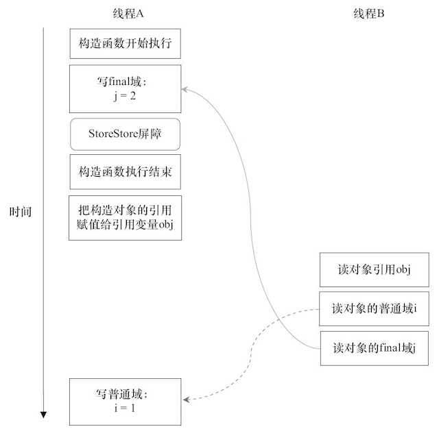
     * 总结为：在对象引用为任意线程可见之前，对象的 final 域已经被 正确初始化过了，而普通域不具有这个保障
   * 读final域
     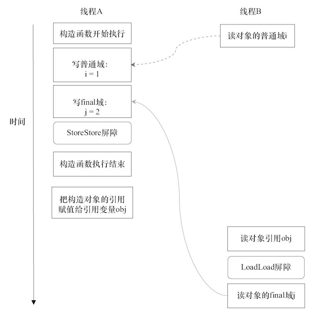
     * 总结为：在读一个对象的 final 域之前，一定会先读包含这个 final 域的对象的引用
* final 域为引用类型
  * 对于引用类型，写 final 域的重排序规则对编译器和处理器增加了如下约束:
    * 在构造函数内对一个 final 引用的对象的成员域的写入，与随后在构造函数外把这个被构造对象的引用赋值给一个引用变量，这两个操作之间不能重排序
  * 示例代码 FinalExample中以下 3 个步骤为构造函数中对一个 final 引用的对象的成员域的写入操作，任何一个操作不可与obj = new FinalExample()操作重排序
    ```
    intArray = new int[2]; //写 final 引用类型域步骤 1
    intArray[0] = 1; //写 final 引用类型域步骤 2
    intArray[1] = 2; //写 final 引用类型域步骤 3
    ```
* 为什么 final 引用不能从构造函数内“逸出”
  * 前面提到过，写 final 域的重排序规则可以确保：`在引用变量为任意线程可见之前，该引用变量指向的对象的 final 域已经在构造函数中被正确初始化过了`
  * 其实要得到这个效果，还需要一个保证：`在构造函数内部，不能让这个被构造对象的引用为其他线程可见，也就是对象引用不能在构造函数中“逸出”`
* 例子
  ```
  class FinalReferenceEscapeExample {
    final int i;
    static FinalReferenceEscapeExample obj;

    public FinalReferenceEscapeExample() {
        i = 1;                              //1 写 final 域
        obj = this;                         //2 this 引用在此“逸出”
    }

    public static void writer() {
        new FinalReferenceEscapeExample();
    }

    public static void reader() {
        if (obj != null) {                   //3
            int temp = obj.i;                //4
        }
    }
  }
  ```
  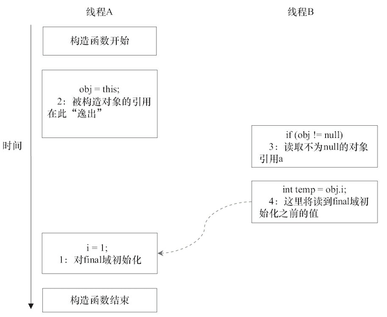
  * 总结为：被构造对象的引用在构造函数不要发生“逸出”问题！!
* final 语义在处理器中的实现
  * 写 final 域的重排序规则会要求编译器在 final 域的写之后，构造函数 return 之前插入一个 StoreStore 障屏
  * 读 final 域的重排序规则要求编译器在读 final 域的操作前面插入一个 LoadLoad 屏障
* 总结：只要对象是正确构造的 (被构造对象的引用在构造函数中没有“逸出”)，那么不需要使用同步 (指 lock 和 volatile 的使用) 就可以保证任意线程都能看到这个 final 域在构造函数中被初始化之后的值

### volatile
* 如果一个字段被声明成 volatile，java 线程内存模型确保所有线程看到这个变量的值是一致的。
* 特性
  * 可见性 : 对一个 volatile 的变量的读，总是能看到任意线程对这个变量最后的写入
  * 单个读或者写具有原子性 : 对于单个 volatile 变量的读或者写具有原子性，复合操作不具有
  * 互斥性 : 同一时刻只允许一个线程对变量进行操作.(互斥锁的特点)
* 写-读建立的 happens-before 关系
  * 从 JSR-133 开始 (即从 JDK5 开始)，volatile 变量的写-读可以实现线程之间的通信
  * volatile 写和锁的释放有相同的内存语义；volatile 读与锁的获取有相同的内存语义
  * example
    ```
    public class VolatileExample {
      int a = 0;  // 普通共享变量
      volatile boolean flag = false; // volatile 共享变量

      public void writer() {       // 写线程 A 操作
          a = 1;                   //1
          flag = true;             //2
      }

      public void reader() {       // 读线程 B 操作
          if (flag) {              //3
              int i = a;           //4
              System.out.printf(String.valueOf(i));
              // do something ...
          }
      }
    }
    ```
    * 假设线程 A 执行 writer() 方法之后，线程 B 执行 reader() 方法
    * 根据 happens-before 规则，这个过程建立的 happens-before 关系可以分为 3 类
      * 根据程序次序规则，1 happens-before 2;3 happens-before 4
      * 根据 volatile 规则，2 happens-before 3
      * 根据 happens-before 的传递性规则，1 happens-before 4
* 写-读的内存语义
  * volatile 写的内存语义：当写一个 volatile 变量时，JMM 会把该线程对应的本地内存中的共享变量值刷新到主内存
  * volatile 读的内存语义：当读一个 volatile 变量时，JMM 会把该线程对应的本地内存置为无效。线程接下来将从主内存中读取共享变量
  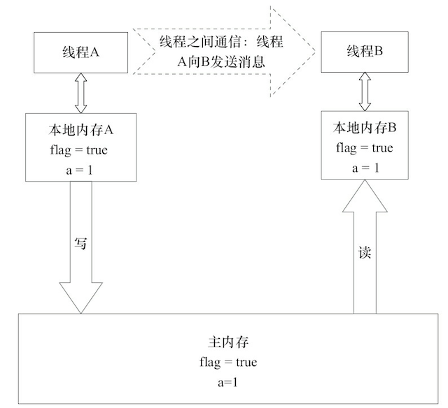
  ```
  如果我们把 volatile 写和 volatile 读两个步骤综合起来看的话，在读线程 B 读一个 volatile 变量后，
  写线程 A 在写这个 volatile 变量之前所有可见的共享变量的值都将立即变得对读线程 B 可见。
  ```
  * 下面对 volatile 写和 volatile 读的内存语义做个总结 (volatile 相当于通过内存发送消息)
    * 线程 A 写一个 volatile 变量，实质上是线程 A 向接下来将要读这个 volatile 变量的某个线程发出了 (其对共享变量所做修改的) 消息
    * 线程 B 读一个 volatile 变量，实质上是线程 B 接收了之前某个线程发出的 (在写这个 volatile 变量之前对共享变量所做修改的) 消息
    * 线程 A 写一个 volatile 变量，随后线程 B 读这个 volatile 变量，这个过程实质上是线程 A 通过主内存向线程 B 发送消息
* volatile内存语义的实现
  * JMM 针对编译器制定的 volatile 重排序规则：
  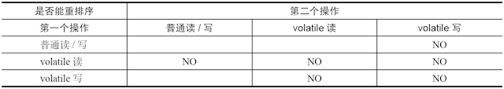
    * 当第二个操作是 volatile 写时，不管第一个操作是什么，都不能重排序。这个规则确保 volatile 写之前的操作不会被编译器重排序到 volatile 写之后。
    * 当第一个操作是 volatile 读时，不管第二个操作是什么，都不能重排序。这个规则确保 volatile 读之后的操作不会被编译器重排序到 volatile 读之前。
    * 当第一个操作是 volatile 写，第二个操作是 volatile 读时，不能重排序。
  * JMM 内存屏障插入策略：
    * 在每个 volatile 写操作的前面插入一个 StoreStore 屏障
    * 在每个 volatile 写操作的后面插入一个 StoreLoad 屏障 （StoreLoad 比较特殊）
      * StoreStore  ->  volatile 写操作  ->  StoreLoad
      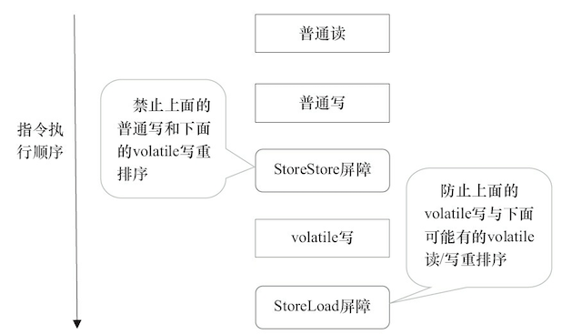
    * 在每个 volatile 读操作的后面插入一个 LoadLoad 屏障
    * 在每个 volatile 读操作的后面插入一个 LoadStore 屏障
      * volatile 读 —> LoadLoad -> LoadStore
      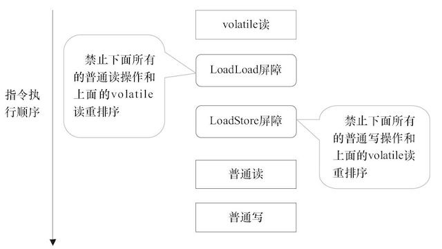
* 应用场景
  * 始终牢记使用 volatile 的限制:只有在状态真正独立于程序内其他内容时才能使用 volatile
  * 在有限的一些情形下使用 volatile 变量替代锁
    1. 对变量的写操作不依赖于当前值
    2. 该变量没有包含在具有其他变量的不变式中 （不变式：例如 “start <= end”）
  * 解析
    * 第一个条件，因为 volatile 不支持增量操作(i++)，即单个读写操作可以保证原子性，但组合操作(++，读取－修改－写入操作序列组成的组合操作)不具有原子性。
    * 第二个条件，例如下面VolatileNumberRange示例了一个不变式的类。
    ```
    @NotThreadSafe
    public class VolatileNumberRange {
    private int lower, upper;

        public int getLower() { return lower; }
        public int getUpper() { return upper; }
    
        public void setLower(int value) {
            if (value > upper)
                throw new IllegalArgumentException("...");
            lower = value;
        }
    
        public void setUpper(int value) {
            if (value < lower)
                throw new IllegalArgumentException("...");
            upper = value;
        }
    }
    ```
      * 如果初始状态是 (0, 5)，同一时间内，线程 A 调用 setLower(4) 并且线程 B 调用 setUpper(3)  
      * 显然这两个操作交叉存入的值是不符合条件的，那么两个线程都会通过用于保护不变式的检查，使得最后的范围值是 (4, 3) —— 一个无效值。
      * 至于针对范围的其他操作，我们需要使 setLower() 和 setUpper() 操作原子化 
      * 而将字段定义为 volatile 类型是无法实现这一目的的
* volatile 的性能考量
  * 使用 volatile 变量的主要原因是其简易性：在某些情形下，使用 volatile 变量要比使用相应的锁简单得多
  * 使用 volatile 变量次要原因是其性能：某些情况下，volatile 变量同步机制的性能要优于锁
    * 在目前大多数的处理器架构上，volatile 读操作开销非常低 —— 几乎和非 volatile 读操作一样
    * 而 volatile 写操作的开销要比非 volatile 写操作多很多，因为要保证可见性需要实现内存界定（Memory Fence）
    * volatile 的总开销仍然要比锁开销低
    * volatile 操作不会像锁一样造成阻塞
    * 在能够安全使用 volatile 的情况下，volatile 可以提供一些优于锁的可伸缩特性
    * 如果读操作的次数要远远超过写操作，与锁相比，volatile 变量通常能够减少同步的性能开销
* volatile bean
  * volatile bean 模式中，JavaBean 的所有数据成员都是 volatile 类型的
  * 并且 getter 和 setter 方法必须非常普通 —— 除了获取或设置相应的属性外，不能包含任何逻辑
  * 对于任何 volatile 变量，不变式或约束都不能包含 JavaBean 属性
* 开销较低的读－写锁策略
  * 如果读操作远远超过写操作，您可以结合使用内部锁和 volatile 变量来减少公共代码路径的开销
  * example
    ```
    @ThreadSafe
    public class CheesyCounter {
      // 使用当前对象 'this' 作为锁
      @GuardedBy("this") private volatile int value;

      public int getValue() { return value; }
   
      public synchronized int increment() {
          return value++;
      }
    } 
    ```

### synchronized

#### synchronized 实现原理
* JVM 基于进入和退出 Monitor 对象来实现方法同步和代码块同步，但两者的实现细节不一样
* 代码块同步：使用 monitorenter 和 monitorexit 指令实现的
* 方法同步：使用另外一种方式实现的，细节在 JVM 规范里并没有详细说明。但是，方法的同步同样可以使用这两个指令来实现。
* monitorenter 指令是在编译后插入到同步代码块的开始位置
* monitorexit 是插入到方法结束处和异常处
* JVM 要保证每个 monitorenter 必须有对应的 monitorexit 与之配对
* 任何对象都有一个 monitor 与之关联，当且一个 monitor 被持有后，它将处于锁定状态
* 线程执行到 monitorenter 指令时，将会尝试获取对象所对应的 monitor 的所有权，即尝试获得对象的锁
* synchronized 是悲观锁，这种线程一旦得到锁，其他需要锁的线程就挂起的情况就是悲观锁

#### synchronized 的并发特性
* synchronized 保证原子性
  * 通过 monitorenter 和 monitorexit 指令，可以保证被 synchronized 修饰的代码在同一时间只能被一个线程访问，在锁未释放之前，无法被其他线程访问到
  * 即使在执行过程中，由于某种原因，比如 CPU 时间片用完，线程 1 放弃了 CPU，但是它并没有进行解锁。而由于 synchronized 的锁是可重入的，下一个时间片还是只能被他自己获取到，还是会继续执行代码。直到所有代码执行完。
* synchronized 保证可见性
  * 对一个 synchronized 修饰的变量解锁之前，必须先把此变量同步回主存中
* synchronized 保证有序性
  * 由于 synchronized 修饰的代码，同一时间只能被同一线程访问 (如果在本线程内观察，所有操作都是天然有序的)
  * 同一线程内的执行遵守 as-if-serial 语义
* 可重入性
  * 得一次锁之后，如果调用其它同步方法，不需要重新获取锁，可以直接使用
* 不可中断性
  * 一旦这个锁被某线程获得，其他线程只能等待或者阻塞。
  * Lock 锁可以中断或者退出等待（超时机制）

#### 如何使用
* Java 中的每一个对象都可以作为锁。具体表现为以下 3 种形式
  * 对于普通同步方法，锁是当前实例化的对象
  * 对于静态同步方法，锁是当前类的 Class 对象
  * 对于同步方法块，锁是 synchronized 括号里配置的对象
    * synchronized(this) 表示锁是当前类实例对象，与同步方法块互斥
    * synchronized(实例化对象引用) 表示锁是当前类实例对象，与同步方法块互斥
    * synchronized(Object.class) 表示锁是类对象,与静态同步方法互斥

#### 锁的升级与对比
* 无锁
  * 无锁没有对资源进行锁定，所有的线程都能访问并修改同一个资源，但同时只有一个线程能修改成功
  * 无锁的特点：就是修改操作在循环内进行，线程会不断的尝试修改共享资源
    * 如果没有冲突就修改成功并退出，否则就会继续循环尝试
    * 如果有多个线程修改同一个值，必定会有一个线程能修改成功，而其他修改失败的线程会不断重试直到修改成功
  * 实现机制：CAS 原理及应用即是无锁的实现。无锁无法全面代替有锁，但无锁在某些场合下的性能是非常高的
* 偏向锁
  * 偏向锁是指一段同步代码一直被一个线程所访问，那么该线程会自动获取锁，降低获取锁的代价
  * 为什么引入：在大多数情况下，锁总是由同一线程多次获得，不存在多线程竞争，所以出现了偏向锁。
    * 其目标就是在只有一个线程执行同步代码块时能够提高性能
    * 引入偏向锁是为了在无多线程竞争的情况下尽量减少不必要的轻量级锁执行路径
    * 因为轻量级锁的获取及释放依赖多次 CAS 原子指令
    * 而偏向锁只需要在置换 ThreadID 的时候依赖一次 CAS 原子指令即可。
  * 实现机制：当一个线程访问同步代码块并获取锁时，会在 Mark Word 里存储锁偏向的线程 ID。在线程进入和退出同步块时不再通过 CAS 操作来加锁和解锁，而是检测 Mark Word 里是否存储着指向当前线程的偏向锁。
  * 偏向锁的撤销
    * 偏向锁只有遇到其他线程尝试竞争偏向锁时， 持有偏向锁的线程才会释放锁， 线程不会主动释放偏向锁
    * 偏向锁的撤销需要等待全局安全点（在这个时间点上没有字节码正在执行）
      * 它会首先暂停拥有偏向锁的线程
      * 判断锁对象是否处于被锁定状态
      * 撤销偏向锁后恢复到无锁（标志位为“01”）或轻量级锁（标志位为“00”）的状态
  * 关闭偏向锁：偏向锁在 JDK 6 及以后的 JVM 里是默认启用的。可以通过 JVM 参数关闭偏向锁：-XX:-UseBiasedLocking=false，关闭之后程序默认会进入轻量级锁状态
  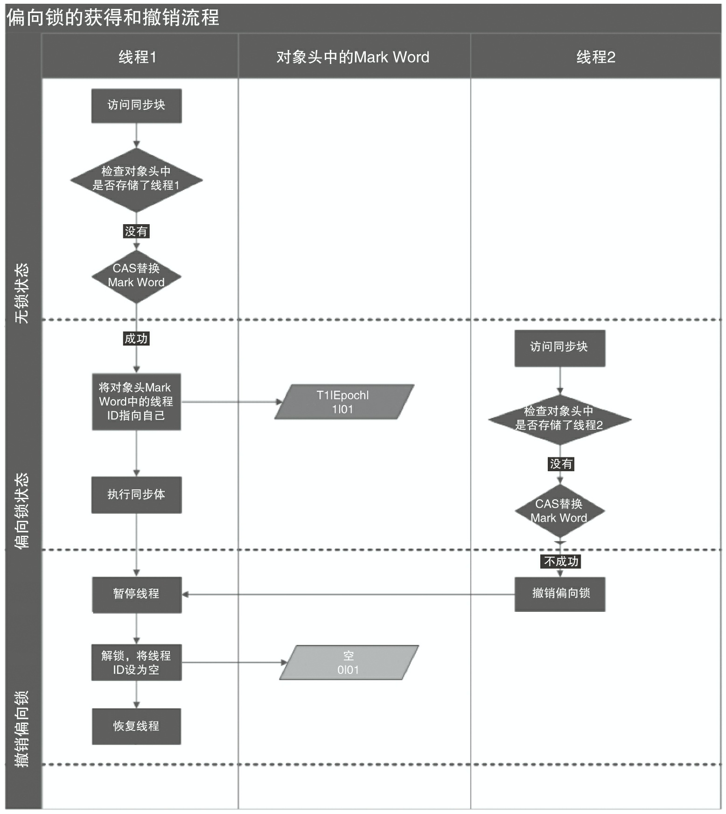
* 轻量级锁
  * 轻量级锁是指当锁是偏向锁的时候， 被另外的线程所访问，偏向锁就会升级为轻量级锁
  * 其他线程会通过自旋的形式尝试获取锁，不会阻塞，从而提高性能
  * 加锁
    * 在代码进入同步块的时候，如果同步对象锁状态为无锁状态
    * 虚拟机首先将在当前线程的栈帧中建立一个名为锁记录（Lock Record）的空间， 用于存储锁对象目前的 Mark Word 的拷贝
    * 然后拷贝对象头中的 Mark Word 复制到锁记录中
    * 拷贝成功后，虚拟机将使用 CAS 操作尝试将对象的 Mark Word 更新为指向 Lock Record 的指针，并将 Lock Record 里的 owner 指针指向对象的 Mark Word
    * 如果这个更新动作成功了，那么这个线程就拥有了该对象的锁，并且对象 Mark Word 的锁标志位设置为“00”，表示此对象处于轻量级锁定状态。
  * 解锁
    * 线程会使用CAS操作尝试将对象的标记字段还原为无锁状态
    * 如果CAS成功，则轻量级锁被成功释放
    * 如果CAS失败，说明有其他线程尝试获得锁，轻量级锁会升级为重量级锁（Mutex）来保证多线程并发执行的正确性
    * 若当前只有一个等待线程，则该线程通过自旋进行等待
    * 但是当自旋超过一定的次数，或者一个线程在持有锁，一个在自旋，又有第三个来访时，轻量级锁升级为重量级锁
  * 重入?
    * 如果轻量级锁的更新操作失败了，虚拟机首先会检查对象的 Mark Word 是否指向当前线程的栈帧
    * 如果是就说明当前线程已经拥有了这个对象的锁，那就可以直接进入同步块继续执行
  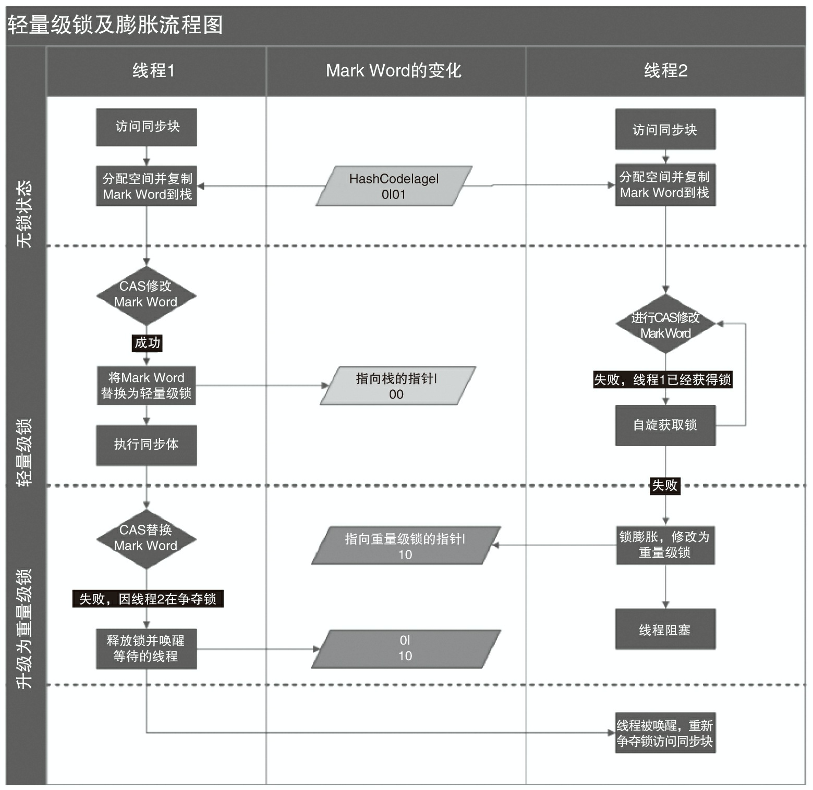
  * 重量级锁
    * 升级为重量级锁时, 此时 Mark Word 中存储的是指向重量级锁的指针
    * 此时等待锁的线程都会进入阻塞状态
* 优缺点对比

| 锁  | 优点 | 缺点 | 适用场景 |
|----|-----|----|-----|
| 偏向锁	| 加锁和解锁不需要额外的消耗，和执行非同步方法相比存在纳秒级的差距 | 如果多线程存在锁竞争会带来额外的锁撤销消耗	 | 适用于只有一个线程访问同步块 |
| 轻量级锁 | 竞争的线程不会阻塞，提高程序的响应速度 | 一直得不到锁竞争的线程会自旋消耗CPU  | 追求响应时间 同步块执行速度非常快 |
| 重量级锁 | 线程竞争不适应自旋，不会消耗CPU | 线程阻塞，响应时间缓慢 | 追求吞吐量，同步块执行速度较长 |


### 锁的内存语义
* 什么是锁
  * 互斥信号量
  * 在 Java 中称之为锁
* 锁的内存语义分析
  * 以 ReentrantLock 为例
  * ReentrantLock 的实现依赖于 Java 同步器框架 AbstractQueuedSynchronizer(本文简称之为 AQS)
  * AQS 使用一个整型的 volatile 变量 (命名为 state) 来维护同步状态
  * ReentrantLock 内部实现了公平锁（FairSync）和非公平锁（NonfairSync）
  * 公平锁和非公平锁加锁逻辑存在差异，公平锁按线程排队优先级获取锁，非公平自然竞争。解锁逻辑完全一样
    * 公平锁-加锁分析
      ```
      static final class FairSync extends Sync {
        private static final long serialVersionUID = -3000897897090466540L;
  
        final void lock() {
            acquire(1);
        }
      
        // 公平锁-加锁最终执行方法
        protected final boolean tryAcquire(int acquires) {
            final Thread current = Thread.currentThread();
            int c = getState(); // 获取锁的开始，首先读 volatile 变量 state
            if (c == 0) { // 可以竞争
                if (!hasQueuedPredecessors() && // 是否排在线程队列头节点（公平）
                    compareAndSetState(0, acquires)) { // CAS 方式修改 state
                    setExclusiveOwnerThread(current);
                    return true;
                }
            }
            else if (current == getExclusiveOwnerThread()) { // 当前线程重入
                int nextc = c + acquires;
                if (nextc < 0)
                    throw new Error("Maximum lock count exceeded");
                setState(nextc);
                return true;
            }
            return false;
        }
      }
      ```
    * 非公平锁-加锁分析
      ```
      static final class NonfairSync extends Sync {
           final void lock() {
               if (compareAndSetState(0, 1)) // 无竞争情况直接获取锁
                   setExclusiveOwnerThread(Thread.currentThread());
               else
                   acquire(1); // 存在竞争使用 nonfairTryAcquire 竞争锁资源
           }

           // nonfairTryAcquire 实现中无需判断 hasQueuedPredecessors 线程优先级
           protected final boolean tryAcquire(int acquires) {
              return nonfairTryAcquire(acquires);
           }
      }

      // AbstractQueuedSynchronizer 中提供 CAS 操作
      protected final boolean compareAndSetState(int expect, int update) {
          // See below for intrinsics setup to support this
          return unsafe.compareAndSwapInt(this, stateOffset, expect, update);
      }
      ```
    
    * 公平锁非公平锁-解锁分析
      ```
      protected final boolean tryRelease(int releases) {
          int c = getState() - releases;
          if (Thread.currentThread() != getExclusiveOwnerThread())
              throw new IllegalMonitorStateException();
          boolean free = false;
          if (c == 0) { // 是否完全释放（重入锁，即多次加锁时需多次释放）
              free = true;
              setExclusiveOwnerThread(null);
          }
          setState(c); // 释放锁的最后，写 volatile 变量 state
          return free;
      }
      ```
  * 释放锁的最后写 volatile 变量 state，在获取锁时首先读这个 volatile 变量
  * 根据 volatile 的 happens-before 规则，释放锁的线程在写 volatile 变量之前可见的共享变量，在获取锁的线程读取同一个 volatile 变量后将立即变得对获取锁的线程可见。
* 锁内存语义总结
  * 由于 Java 的 CAS 同时具有 volatile 读和 volatile 写的内存语义，因此 Java 线程之间的通信现在有了下面 4 种方式
    * A 线程写 volatile 变量，随后 B 线程读这个 volatile 变量
    * A 线程写 volatile 变量，随后 B 线程用 CAS 更新这个 volatile 变量
    * A 线程用 CAS 更新一个 volatile 变量，随后 B 线程用 CAS 更新这个 volatile 变量
    * A 线程用 CAS 更新一个 volatile 变量，随后 B 线程读这个 volatile 变量
  * 锁的通用化的实现模式
    * 声明共享变量为 volatile
    * 使用 CAS 的原子条件更新来实现线程之间的同步
    * 配合以 volatile 的读/写和 CAS 所具有的 volatile 读和写的内存语义来实现线程之间的通信

### 并发操作比较（CAS、volatile、synchronized、Lock）
* 场景
  * CAS：单个变量支持比较替换操作，如果实际值与期望值一致时才进行修改
  * volatile：单个变量并发操作，直接修改为我们的目标值
  * synchronized：一般性代码级别的并发
  * Lock：代码级别的并发，需要使用锁实现提供的独特机制，例如：读写分离、分段、中断、共享等 synchronized 不支持的机制。
* 原子性
  * CAS：保证原子性
  * volatile：单个操作保证原子性，组合操作（例如：++）不保证原子性
  * synchronized：保证原子性
  * Lock：保证原子性
* 并发粒度
  * CAS：单个变量值
  * volatile：单个变量值
  * synchronized：静态、非静态方法、代码块
  * Lock：代码块
* 编码操作性
  * CAS：调用 JDK 方法
  * volatile：使用关键字，系统通过屏障指令保证并发性
  * synchronized：使用关键字，加锁解锁操作系统默认通过指令控制
  * Lock：手动加锁解锁
* 线程阻塞
  * CAS：不会
  * volatile：不会
  * synchronized：可能会
  * Lock：可能会
* 性能 (CAS：主要表现在 CPU 资源占用在合理使用情况下比较，比如我们可以用 volatile 实现的需求即不用 Lock）
  * CAS：主要表现在 CPU 资源占用
  * volatile：性能较好
  * synchronized：性能一般（JDK 1.6 优化后增加了偏向锁、轻量级锁机制）
  * Lock：性能较差
* 锁比较
  * 锁重入
    * synchronized：支持
    * Lock：ReentrantLock 实现类支持
  * 锁中断操作
    * synchronized：不支持中断操作
    * Lock：支持中断，支持超时中断
  * 锁功能性
    * synchronized：独占锁、可重入锁
    * Lock：独占锁、共享锁、可重入锁、读写锁、分段锁 ...
  * 锁状态感知
    * synchronized：无法判断是否拿到锁
    * Lock：可以判断是否拿到锁


## 线程

### 线程简介
* 线程的状态
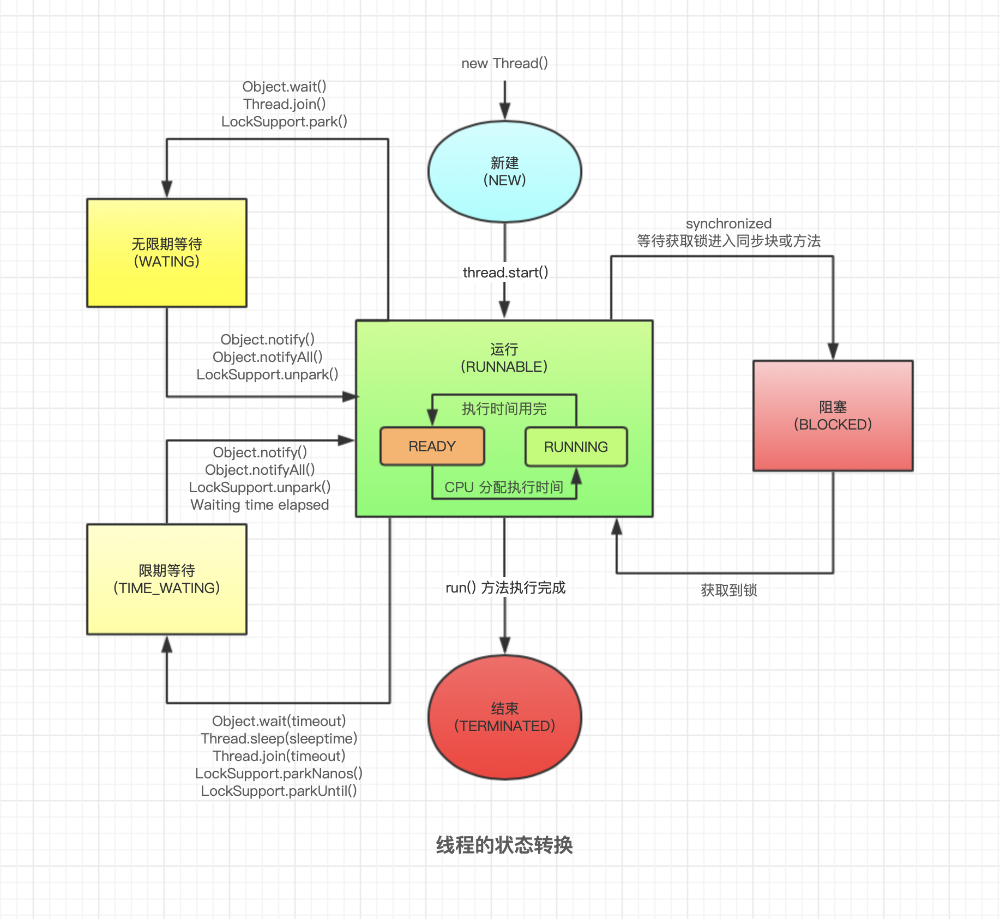
* Daemon 线程
  * Daemon 线程是一种支持型线程
  * 它主要被用作程序中后台调度以及支持性工作
  * 当一个 Java 虚拟机中不存在非 Daemon 线程的时候，Java 虚拟机将会退出
  * 可以通过调用 Thread.setDaemon(true) 将线程设置为 Daemon 线程
  * Daemon 属性需要在启动线程之前设置，不能在启动线程之后设置
  * Java 虚拟机退出时 Daemon 线程中的 finally 块并不一定会执行 (Java 虚拟机中的所有 Daemon 线程都需要立即终止)
  * 不能依靠 finally 块中的内容来确保执行关闭或清理资源
* 初始化线程（init）
* 启动线程（start）
  * 线程 start 方法的含义是：当前线程 (即 parent 线程) 同步告知 Java 虚拟机，只要线程规划器空闲，应立即启动调用 start 方法的线程。
* 中断线程（interrupt）
  * 中断可以理解为线程的一个标识位属性，它表示一个运行中的线程是否被其他线程进行了中断操作
  * 中断好比其他线程对该线程打了个招呼，其他线程通过调用该线程的 interrupt 方法对其进行中断操作
  * 线程通过检查自身是否被中断来进行响应
    * 线程通过方法 isInterrupted 来进行判断是否被中断
    * 也可以调用静态方法 Thread.interrupted 对当前线程的中断标识位进行复位
    * 如果该线程已经处于终结状态，即使该线程被中断过，在调用该线程对象的 isInterrupted 时依旧会返回 false
  * 中断状态设置情况
    * 如果该线程调用 Object.wait 被阻塞，或者调用 Thread.join ， Thread.sleep 方法，那么它的中断状态将被清除，同时抛出 InterruptedException
    * 如果该线程被阻塞在 I/O 操作 InterruptibleChannel ，则信道被关闭，该线程设置为中断状态，同时抛出 java.nio.channels.ClosedByInterruptException
    * 如果这个线程被阻塞在 java.nio.channels.Selector，该线程设置为中断状态
    * 许多声明抛出 InterruptedException 的方法 (例如 Thread.sleep(long millis) 方法) 这些方法在抛出 InterruptedException 之前，Java 虚拟机会先将该线程的中断标识位清除，然后抛出 InterruptedException，此时调用 isInterrupted 方法将会返回 false
    * 中断一个不存在的线程不会有任何效果
  * 为什么需要中断
    * 线程运行过程中，我们根据实际需求需要中断线程执行
    * 处理器等其他外界条件让线程不能正常运行下去
  * 中断操作会让线程停止吗？
    * 不会，中断仅仅是一个状态值，可能会抛出异常
* 停止线程
  * 线程运行代码中设置标识符，通过标识符判断退出
  * 调用中断方法，代码逻辑中判断是否中断或者捕获中断相关异常后退出
* suspend、resume 和 stop 方法分别致使线程暂停、恢复和终止工作
  * 不建议使用的原因主要有
    * suspend/resume 方法，在调用后，线程不会释放已经占有的资源 (比如锁)，而是占有着资源进入睡眠状态，这样容易引发死锁问题
    * stop 方法，在终结一个线程时不会保证线程的资源正常释放，通常是没有给予线程完成资源释放工作的机会，因此会导致程序可能工作在不确定状态下
* 线程 join
  * 如果一个线程 A 执行了 thread.join 语句，其含义是:当前线程 A 等待 thread 线程终止之后才从 thread.join 返回

### 线程等待通知机制
* 简介
  * 一个线程 A 调用了对象 O 的 wait 方法进入等待状态
  * 而另一个线程 B 调用了对象 O 的 notify 或者 notifyAll 方法
  * 线程 A 收到通知后从对象 O 的 wait 方法返回，进而执行后续操作
* Object 作为所有对象的父类，其中与等待通知机制相关几个方法如下：
  * wait : 调用该方法线程进入 WAITING 状态，只有等待其他线程的通知或者被中断才会返回（调用后会释放锁，sleep 不会）
  * wait（超时设置） : 在 wait 方法的基础上增加了超时，达到超时设置后如果没有通知或者中断也会返回
  * notify : 通知一个在对象上等待的线程 A（调用过 wait 方法的线程），使其从 wait 方法返回，前提是该线程 A 获取到了对象锁。（多线程存在锁竞争）
  * notifyAll : 通知所有等待在该对象上的线程
# 执行细节说明
  * 使用 wait、notify 和 notifyAll 时需要先对调用对象加锁
  * 调用 wait 方法后，线程状态由 RUNNING 变为 WAITING，并将当前线程放置到对象的等待队列
  * notify 或 notifyAll 方法调用后，等待线程依旧不会从 wait() 返回，需要调用 notify 或 notifyAll 的线程释放锁之后，等待线程才有机会从 wait 返回
  * notify 方法将等待队列中的一个等待线程从等待队列中移到同步队列中，而 notifyAll 方法则是将等待队列中所有的线程全部移到同步队列，被移动的线程状态由 WAITING 变为 BLOCKED
  * 从 wait 方法返回的前提是获得了调用对象的锁
  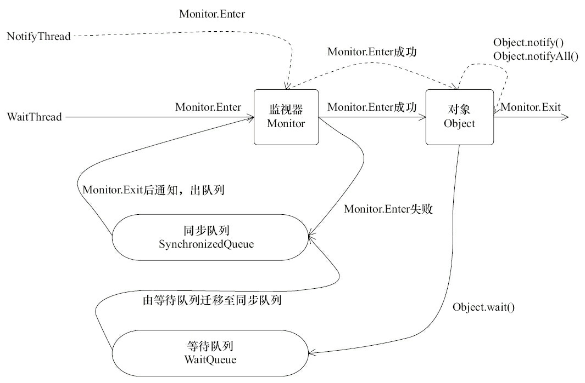

### 线程等待/通知的经典范式
* 等待方伪代码
  ```
  synchronized(对象) { 
    while(条件判断) { // 循环判断条件是否满足，条件不满足时进入等待状态
        对象.wait(); // wait 后释放锁，其他线程拿到锁后执行对于逻辑
    } 
    对应的处理逻辑    // 其他线程调用 notify、notifyAll 后并释放锁后，继续运行该处代码
  }
  ```
  
* 通知方伪代码
  ```
  synchronized(对象) { 
    改变条件
    对象.notifyAll();
  }
  ```

* 为什么 wait/notify 需要在同步块里执行？
  * 参考上面的经典范式，如果没有在同步块里：
    * 等待方条件判断不符合时将执行 wait 方法
    * 在执行 wait 方法前通知方刚好改变了条件并执行 notifyAll 方法
    * 然后等待方执行了 wait 方法（可能永远不会被唤醒了，本来应该被唤醒的）
  * 总结 用 synchronized 确保在条件判断和 notify 之间不要调用 wait。保证线程的通信交流

### 线程等待操作比较（sleep、wait、park、Condition）
* 比较
  * 实现原理（底层）
    * sleep：native 方法，内核定时器触发
    * wait：native 方法，配合 synchronized 的 monitorenter 和 monitorexit 指令
    * park：native 方法，二元信号量
    * Condition：AQS 维护等待队列与同步队列
  * 编码操作
    * sleep：Thread.sleep 静态方法
    * wait：使用 synchronized 加锁的对象，Object 的 wait/notify
    * park：LockSupport.park/unpark
    * Condition：由 Lock 对象 newCondition 方法创建，wait/signal
  * 等待时是否释放锁
    * sleep：不释放
    * wait：释放
    * park：释放
    * Condition：释放
  * 都支持超时等待
  * 都支持等待过程中断
  * 唤醒操作
    * sleep：不支持，定时器唤醒
    * wait：支持，notify/notifyAll
    * park：支持，unpark
    * Condition：支持，signal/signalAll
  * 等待操作精准性
    * sleep：当前线程
    * wait：当前线程
    * park：指定具体的线程
    * Condition：当前线程
  * 唤醒操作精准性
    * wait：notify 随机唤醒一个线程，notifyAll 唤醒所有等待的线程
    * park：unpark 唤醒指定的线程
    * Condition：signal 随机唤醒一个线程，signalAll 唤醒所有等待的线程
  * 执行顺序
    * park：unpark 可以在 park 前执行。可以先调用 unpark 方法释放一个许可证，后面线程调用 park 方法时，发现已经许可证了，就可以直接获取许可证而不用进入休眠状态了
    * wait/notify：保证 wait 方法比 notify 方法先执行。如果 notify 方法比 wait 方法晚执行的话，就会导致因 wait 方法进入休眠的线程接收不到唤醒通知的问题
    * Condition：保证 wait 方法比 signal 方法先执行

### 线程池
* 实现原理
  * 当提交一个新任务到线程池时，线程池的处理流程如下
    1. 线程池判断核心线程池里的线程是否都在执行任务
       * 如果不是，则创建一个新的工作线程来执行任务
       * 如果是，则进入下个流程
    2. 线程池判断工作队列是否已经满
       * 如果工作队列没有满，则将新提交的任务存储在这个工作队列里
       * 如果工作队列满了，则进入下个流程
    3. 线程池判断线程池的线程是否都处于工作状态
       * 如果没有，则创建一个新的工作线程来执行任务
       * 如果已经满了，则交给饱和策略来处理这个任务
  * 示意图
    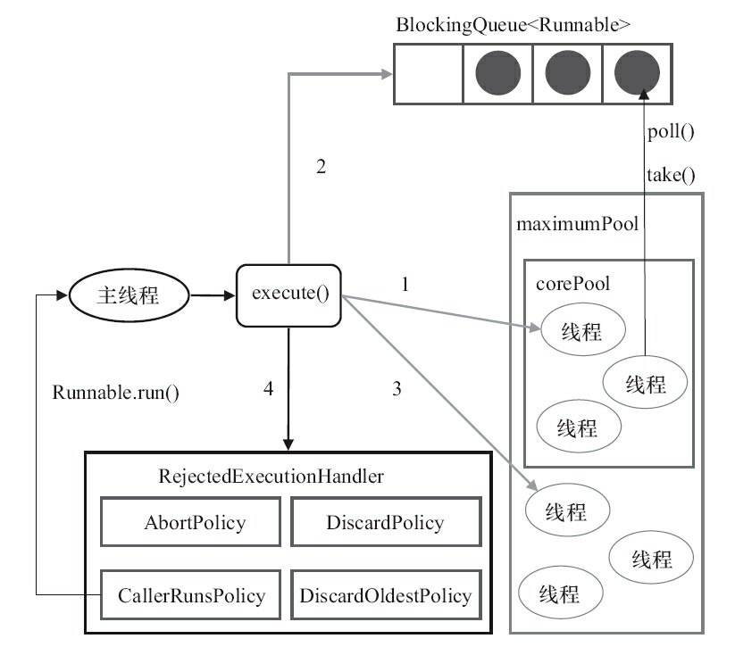
  * ThreadPoolExecutor.execute 提交任务源码分析
    ```
    public void execute(Runnable command) {
        if (command == null)
            throw new NullPointerException();
        int c = ctl.get();

        // 运行的线程少于 corePoolSize 时则创建线程并执行当前任务
        if (workerCountOf(c) < corePoolSize) { 
            if (addWorker(command, true))  // addWork需要获取全局锁mainLock
                return;
            c = ctl.get();
        }
        
        // 如线程数大于等于基本线程数或线程创建失败，则将当前任务放到工作队列中。
        if (isRunning(c) && workQueue.offer(command)) {
            int recheck = ctl.get();
            // 重新检查是否满足条件（可能上次检查后有线程完成）
            if (! isRunning(recheck) && remove(command))
                reject(command);
            else if (workerCountOf(recheck) == 0)
                addWorker(null, false);    // addWork需要获取全局锁mainLock
        }
        else if (!addWorker(command, false)) // 如果无法将任务排队，则尝试添加新的线程
            reject(command); // 添加失败，抛出 RejectedExecutionException 异常
    }
    ```
    
  * Worker thread 运行机制
    ```
    private final class Worker
        extends AbstractQueuedSynchronizer
        implements Runnable
    {
      final void runWorker(Worker w) {
          Thread wt = Thread.currentThread();
          Runnable task = w.firstTask;
          w.firstTask = null;
          w.unlock(); // 允许中断
          boolean completedAbruptly = true;
          try {
              while (task != null || (task = getTask()) != null) { // 循环获取任务
                  w.lock();  
                  // 中断处理：如果池正在停止，或者运行 worker 被中断
                  if ((runStateAtLeast(ctl.get(), STOP) ||
                       (Thread.interrupted() &&
                        runStateAtLeast(ctl.get(), STOP))) &&
                      !wt.isInterrupted())
                      wt.interrupt();
                  try {
                      beforeExecute(wt, task);
                      try {
                          task.run(); // 运行任务逻辑
                          afterExecute(task, null);
                      } catch (Throwable ex) {
                          afterExecute(task, ex);
                          throw ex;
                      }
                  } finally {
                      task = null;
                      w.completedTasks++;
                      w.unlock();
                  }
              }
              completedAbruptly = false;
          } finally {
              processWorkerExit(w, completedAbruptly);
          }
      }
    }
    ```
    * Worker 执行时所属的线程为 wt，如果 wt 线程想中断 Worker 时必须获取 Worker 的锁

* 创建线程池
  ```
  final ThreadPoolExecutor poolExecutor = new ThreadPoolExecutor(
        2,  // corePoolSize
        10, // maximumPoolSize
        30, TimeUnit.MINUTES, // keepAliveTime
        new ArrayBlockingQueue<>(20, true), // BlockingQueue
        Thread::new,    // ThreadFactory
        new ThreadPoolExecutor.DiscardPolicy() // RejectedExecutionHandler
    );
  ```
  
  * corePoolSize: 当提交一个任务到线程池时，线程池会创建一个线程来执行任务，即使其他空闲的核心线程能够执行新任务也会创建线程，等到需要执行的任务数大于线程池基本大小时就不再创建
  * keepAliveTime: 当线程数大于核心线程数量时，多余的线程多久后回收
  * maximumPoolSize: 线程池允许创建的最大线程数。如果队列满了，并且已创建的线程数小于最大线程数，则线程池会再创建新的线程执行任务
    * 如果使用了无界的任务队列这个参数就没什么效果
  * BlockingQueue: 用于保存等待执行的任务的阻塞队列 BlockingQueue
    * ArrayBlockingQueue: 是一个基于数组结构的有界阻塞队列，此队列按 FIFO(先进先出) 原则对元素进行排序。
    * DelayQueue: 一个无界阻塞队列，只有在延迟期满时，才能从中提取元素，队列的头部，是延迟期满后保存时间最长的 delay 元素
    * LinkedBlockingQueue: 一个基于链表结构的阻塞队列，此队列按 FIFO 排序元素，吞吐量通常要高于 ArrayBlockingQueue。
    * LinkedBlockingDeque: 一个由链表结构组成的双向阻塞队列。
    * LinkedTransferQueue: 一个由链表结构组成的无界阻塞队列。
    * SynchronousQueue: 一个不存储元素的阻塞队列。每个插入操作必须等到另一个线程调用移除操作，否则插入操作一直处于阻塞状态，吞吐量通常要高于 Linked-BlockingQueue。
    * PriorityBlockingQueue: 一个具有优先级的无限阻塞队列。
  * ThreadFactory: 用于设置创建线程的工厂，可以通过线程工厂给每个创建出来的线程设置更有意义的名字
  * RejectedExecutionHandler: 当队列和线程池都满了，说明线程池处于饱和状态，那么必须采取一种策略处理提交的新任务
    * AbortPolicy: 直接抛出异常 (默认)
    * CallerRunsPolicy: 只用调用者所在线程来运行任务
    * DiscardOldestPolicy: 丢弃队列里最近的一个任务，并执行当前任务
    * DiscardPolicy: 不处理，丢弃掉
* 提交任务到线程池
  * execute 方法用于提交不需要返回值的任务
  * submit 方法用于提交需要返回值的任务
    * 线程池会返回一个 Future 类型的对象
    * 通过这个 Future 对象可以判断任务是否执行成功
      * 并且可以通过 Future 的 get 方法来获取返回值
      * get 方法会阻塞当前线程直到任务完成
      * 而使用 get(long timeout，TimeUnit unit) 方法则会阻塞当前线程一段时间后立即返回
* 关闭线程池
  * 调用线程池的 shutdown 或 shutdownNow 方法来关闭线程池
  * 原理是遍历线程池中的工作线程，然后逐个调用线程的 interrupt 方法来中断线程，所以无法响应中断的任务可能永远无法终止
  * shutdown 只是将线程池的状态设置成 SHUTDOWN 状态，然后中断所有没有正在执行任务的线程
  * shutdownNow 首先将线程池的状态设置成 STOP，然后尝试停止所有的正在执行或暂停任务的线程，并返回等待执行任务的列表
  * 关闭返回状态说明
    * isShutdown: 只要调用了这两个关闭方法中的任意一个，isShutdown 方法就会返回 true
    * isTerminated: 当所有的任务都已关闭后，才表示线程池关闭成功，这时调用 isTerminated 方法会返回 true
  * 至于应该调用哪一种方法来关闭线程池，应该由提交到线程池的任务特性决定，通常调用 shutdown 方法来关闭线程池，如果任务不一定要执行完，则可以调用 shutdownNow 方法

## Lock
* AbstractQueuedSynchronizer (队列同步器 AQS)
  * 是用来构建锁或者其他同步组件的基础框架
  * 使用了一个 int 成员变量表示同步状态
  * 提供的 3 个方法 (getState()、setState(int newState) 和 compareAndSetState(int expect,int update)) 来对同步状态进行更改
  * 内置的 FIFO 队列来完成资源获取线程的排队工作
* 同步器与锁的关系
  * 在锁的实现中聚合同步器，利用同步器实现锁的语义
  * 锁是面向使用者的，它定义了使用者与锁交互的接口
  * 同步器面向的是锁的实现者，它简化了锁的实现方式，屏蔽了同步状态管理、线程的排队、等待与唤醒等底层操作
  * 继承时可重写的方法
    ```
    // 独占式获取状态。实现需要查询当前状态是否符合预期，然后再使用 CAS 设置同步状态
    protected boolean tryAcquire(int arg)
    // 独占式释放状态，等待获取同步状态的线程将有机会获取同步状态
    protected boolean tryRelease(int arg)
  
    // 共享式获取状态，返回≥0 的值表示成功，反之获取失败
    protected int tryAcquireShared(int arg)
    // 共享式释放同步状态
    protected boolean tryReleaseShared(int arg)
  
    // 在独占式模式下判断是否被线程占用
    protected boolean isHeldExclusively()

    ```
  * 默认提供的模板方法

    ``` 
    // ---------------------- 独占式相关操作 ----------------------

    // 独占模式获取，忽略中断。调用一次重写的 tryAcquire 方法，在成功时返回。
    // 否则，线程进入同步队列等待，直到调用 tryAcquire 成功为止。
    // 这种方法可以用来实现方法 Lock.lock
    public final void acquire(int arg) {
        if (!tryAcquire(arg) &&
            acquireQueued(addWaiter(Node.EXCLUSIVE), arg))
           selfInterrupt();
    }
    
    // 与 acquire(int arg) 相同，但是该方法响应中断
    public final void acquireInterruptibly(int arg) throws InterruptedException...
    
    // 与 acquireInterruptibly(int arg) 相同，支持超时返回
    public final boolean tryAcquireNanos(int arg, long nanosTimeout) throws InterruptedException...
    
    // 独占式的释放同步状态，该方法会在释放同步状态后将同步队列中的第一个节点包含的线程唤醒
    public final boolean release(int arg)
    
    
    // ---------------------- 共享式相关操作 ----------------------
    
    // 共享式的获取同步状态，与独占式获取的主要区别是同一时刻可以有多个线程获取同步状态
    public final void acquireShared(int arg) {
        if (tryAcquireShared(arg) < 0)
            doAcquireShared(arg);
    }
    // 与 acquireShared(int arg) 相同，但是该方法响应中断
    public final void acquireSharedInterruptibly(int arg) throws InterruptedException
    
    // 与 acquireSharedInterruptibly(int arg) 相同，支持超时返回
    public final boolean tryAcquireNanos(int arg, long nanosTimeout) throws InterruptedException
    
    // 共享式的释放同步状态
    public final boolean releaseShared(int arg)

    ```
  * 锁 implement example
    ```
    public class MutexLockExample implements Lock {
    
        // 静态内部类，自定义同步器，重写 AQS 的方法
        private static class Sync extends AbstractQueuedSynchronizer {
            // 是否处于占用状态
            @Override
            protected boolean isHeldExclusively() {
                return getState() == 1;
            }
    
            // 当状态为 0 的时候获取锁
            @Override
            public boolean tryAcquire(int acquires) {
                if (compareAndSetState(0, 1)) {
                    setExclusiveOwnerThread(Thread.currentThread());
                    return true;
                }
                return false;
            }
    
            // 释放锁，将状态设置为 0
            @Override
            protected boolean tryRelease(int releases) {
                if (getState() == 0) throw new IllegalMonitorStateException();
                setExclusiveOwnerThread(null);
                setState(0);
                return true;
            }
    
            // 返回一个 Condition，每个 condition 都包含了一个 condition 队列
            protected Condition newCondition() {
                return new ConditionObject();
            }
        }
    
        // 将 Lock 方法的实现代理到 Sync 实现
        private final Sync sync = new Sync();
    
        @Override
        public void lock() { sync.acquire(1); }
        @Override
        public void lockInterruptibly() throws InterruptedException {
            sync.acquireInterruptibly(1);
        }
        @Override
        public boolean tryLock() { return sync.tryAcquire(1); }
        @Override
        public boolean tryLock(long timeout, TimeUnit unit) throws InterruptedException {
            return sync.tryAcquireNanos(1, unit.toNanos(timeout));
        }
        public boolean isLocked() { return sync.isHeldExclusively(); }
        @Override
        public void unlock() { sync.release(1); }
        @Override
        public Condition newCondition() { return sync.newCondition(); }
    }
    ```
* 同步器如何维护线程状态
  * 同步器的实现依赖于一个 FIFO 队列
  * 队列中的元素 Node 就是保存着线程引用和线程状态的容器
  * 同步器拥有首节点 (head) 和尾节点 (tail)
  * 没有成功获取同步状态的线程将会成为节点加入该队列的尾部
  * 首节点的线程在释放同步状态时，将会唤醒后继节点
  * 后继节点将会在获取同步状态成功时将自己设置为首节点
  ```
       +------+  prev +-----+  prev +-----+       +-----+
  head |      | <---- |     | <---- |     | <---- |     |  tail
       +------+       +-----+       +-----+       +-----+

  ```
  * 节点（Node）介绍
    ```
    static final class Node {
    /**
    * 表示节点的状态。其中包含的状态有：
      * CANCELLED，值为 1，表示当前的线程被取消；
      * SIGNAL，   值为-1，表示当前节点的后继节点包含的线程需要运行，也就是 unpark；
      * CONDITION，值为-2，表示当前节点在等待 condition，也就是在 condition 队列中；
      * PROPAGATE，值为-3，表示当前场景下后续的 acquireShared 能够得以执行；
      * 值为 0，不是以上状态时（新节点入队时的默认状态）
      */
      volatile int waitStatus;
    
          // 前驱节点，比如当前节点被取消，那就需要前驱节点和后继节点来完成连接。
          volatile Node prev;
    
          // 后继节点。
          volatile Node next;
    
          // 入队列时的当前线程。
          volatile Thread thread;
    
          // 存储 condition 队列中的后继节点。
          Node nextWaiter;
    }
    ```
    
  * 首节点尾节点设置
    ```
    public abstract class AbstractQueuedSynchronizer
    extends AbstractOwnableSynchronizer
    implements java.io.Serializable {
    
        // 设置首节点方法
        private void setHead(Node node) {
                head = node;
                node.thread = null;
                node.prev = null;
        }
    
        // 设置尾节点方法
        private Node enq(Node node) {
                for (;;) {
                    Node oldTail = tail;
                    if (oldTail != null) {
                        node.setPrevRelaxed(oldTail);
                        if (compareAndSetTail(oldTail, node)) { // CAS 操作
                            oldTail.next = node;
                            return oldTail;
                        }
                    } else {
                        initializeSyncQueue();
                    }
                }
        }
    
    
        private Node enq(final Node node) {
            for (;;) {
                Node t = tail;
                if (t == null) { // Must initialize
                    if (compareAndSetHead(new Node()))
                        tail = head;
                } else {
                    node.prev = t;
                    if (compareAndSetTail(t, node)) {
                        t.next = node;
                        return t;
                    }
               }
            }
        }
    }
    ```
    * 设置首节点方法说明
      * 通过获取同步状态成功的线程来完成，由于只有一个线程能够成功获取到同步状态
      * 因此设置头节点的方法并不需要使用 CAS 来保证
    * 设置尾节点方法说明
      * 由于线程无法获取到同步状态时，转而被构造成节点并加入到同步队列
      * 可能存在多个线程一起设置为尾节点的动作，必须保证线程安全
      * 因此内部通过方法 compareAndSetTail 设置，它需要传递当前线程“认为”的尾节点和当前节点
      * 只有设置成功后，当前节点才正式与之前的尾节点建立关联

  * 独占式同步状态获取
    * 首先调用自定义同步器实现的 tryAcquire 方法，该方法保证线程安全的获取同步状态
    * 如果同步状态获取失败，则构造同步节点并通过 addWaiter 方法将该节点加入到同步队列的尾部
    * 最后调用 acquireQueued 方法，使得该节点以“死循环”的方式获取同步状态
      * 如果获取不到，判断自己是否要进入等待状态，进入等待状态后唤醒主要依靠前驱节点的出队或阻塞线程被中断来实现
      * 如果获取到，将自己设置为首节点

    ```
    public final void acquire(int arg) {
        if (!tryAcquire(arg) &&     // 尝试获取同步状态（自定义重写该方法）
            acquireQueued(addWaiter(Node.EXCLUSIVE), arg)) // 获取同步失败时，构造同步节点加入队列
            selfInterrupt();
        // 独占式 Node.EXCLUSIVE : 同一时刻只能有一个线程成功获取同步状态  
    }

    // 将节点添加至同步队列尾部
    private Node addWaiter(Node mode) {
        Node node = new Node(Thread.currentThread(), mode);
        // Try the fast path of enq; backup to full enq on failure
        Node pred = tail;
        if (pred != null) {
            node.prev = pred;
            if (compareAndSetTail(pred, node)) {
                pred.next = node;
                return node;
            }
        }
        enq(node);
        return node;
    }

    final boolean acquireQueued(final Node node, int arg) {
        boolean interrupted = false;
        try {
            for (;;) {
                final Node p = node.predecessor(); // 获取当前节点的前一节点 p
                if (p == head && tryAcquire(arg)) { // 如果是头节点再次尝试获取同步状态
                    setHead(node);
                    p.next = null; // help GC
                    return interrupted;
                }
                // 判断是否可以进入等待状态（前一节点 waitStatus=Node.SIGNAL 时）
                if (shouldParkAfterFailedAcquire(p, node)) 
                    interrupted |= parkAndCheckInterrupt(); // 等待过程是否被中断
            }
        } catch (Throwable t) { // 异常情况下取消获取并做中断处理
            cancelAcquire(node); 
            if (interrupted)
                selfInterrupt();
            throw t;
        }
    }
    ```
  * 独占式同步状态释放
    * 首先调用自定义同步器实现的 tryRelease 方法进行释放操作
    * 如果释放成功尝试唤醒后续节点，唤醒逻辑为：
      * 当前头节点状态重置为 0
      * 依次循环寻找一个有效的节点进行唤醒
    ```
    public final boolean release(int arg) {
        if (tryRelease(arg)) { // 自定义释放逻辑
            Node h = head;
            if (h != null && h.waitStatus != 0)
                unparkSuccessor(h); // 唤醒后续节点
            return true;
        }
        return false;
    }

    private void unparkSuccessor(Node node) {
        int ws = node.waitStatus;
        if (ws < 0) // 如果状态小于 0 ，尝试修改为 0
            node.compareAndSetWaitStatus(ws, 0);

        // 获取当前释放节点的后驱节点
        // 如果后驱节点为空或者等待状态>0 时,表示已被取消
        // 从后向前遍历寻找有效的节点进行唤醒。此时，再和 acquireQueued 方法联系起来
        Node s = node.next;
        if (s == null || s.waitStatus > 0) {
            s = null;
            for (Node p = tail; p != node && p != null; p = p.prev)
                if (p.waitStatus <= 0)
                    s = p;
        }
        if (s != null)
            LockSupport.unpark(s.thread); // 唤醒
    }
    ```
  * 共享式同步状态获取
    * 调用共享锁的 tryAcquireShared 返回一个整型值
    * 如果该值小于 0，则代表当前线程获取共享锁失败
    * 如果该值大于 0，则代表当前线程获取共享锁成功，并且接下来其他线程尝试获取共享锁的行为很可能成功
    * 如果该值等于 0，则代表当前线程获取共享锁成功，但是接下来其他线程尝试获取共享锁的行为会失败
    * 只要该返回值大于等于 0，就表示获取共享锁成功
    ```
    public final void acquireShared(int arg) {
        if (tryAcquireShared(arg) < 0)
            doAcquireShared(arg);
    }

    private void doAcquireShared(int arg) {
        final Node node = addWaiter(Node.SHARED); // 构造一个共享式节点加入等待队列
        boolean interrupted = false;
        try {
        // 共享式获取的自旋过程中
        // 成功获取到同步状态并退出自旋的条件就是 tryAcquireShared 方法返回值大于等于 0
            for (;;) {
                final Node p = node.predecessor();
                if (p == head) {
                    int r = tryAcquireShared(arg);
                    if (r >= 0) { // 返回值大于等于 0 时，表示能够获取到同步状态
                        setHeadAndPropagate(node, r); // 设置头节点并尝试唤醒后驱节点（重点）
                        p.next = null; // help GC
                        return; 
                    }
                }
                if (shouldParkAfterFailedAcquire(p, node))
                    interrupted |= parkAndCheckInterrupt();
            }
        } catch (Throwable t) {
            cancelAcquire(node);
            throw t;
        } finally {
            if (interrupted)
                selfInterrupt();
        }
    }    
    ```
    * 独占与共享获取同步状态主要差异：
      * 独占锁的 acquireQueued 调用的是 addWaiter(Node.EXCLUSIVE)，而共享锁调用的是 addWaiter(Node.SHARED)
      * 获取锁成功后的行为，对于独占锁而言，是直接调用了 setHead 方法，而共享锁调用的是 setHeadAndPropagate
      ```
      private void setHeadAndPropagate(Node node, int propagate) {
          Node h = head; // 记录现在的头节点，后面 if 中重新赋值（处理多线程同时设置头节点情况）
          setHead(node);
          if (propagate > 0 || h == null || h.waitStatus < 0 ||
              (h = head) == null || h.waitStatus < 0) {
              Node s = node.next;
              // 在共享锁模式下，锁可以被多个线程所共同持有，既然当前线程已经拿到共享锁了，
              // 那么就可以直接通知后驱节点来拿锁，而不必等待锁被释放的时候再通知。
              if (s == null || s.isShared())
                  doReleaseShared(); 
          }
      }
      ```
  * 共享式同步状态释放
    ```
    public final boolean releaseShared(int arg) {
        if (tryReleaseShared(arg)) {
            doReleaseShared();
            return true;
        }
        return false;
    }

    private void doReleaseShared() {
        for (;;) {
            Node h = head;
            if (h != null && h != tail) { // 注意这里说明了队列至少有两个节点（2 个说明有一个可能会被唤醒）
                int ws = h.waitStatus;
                if (ws == Node.SIGNAL) { // 头节点的后驱节点需要被唤醒
                    if (!h.compareAndSetWaitStatus(Node.SIGNAL, 0))
                        continue;            // CAS 修改头节点状态为 0 
                    unparkSuccessor(h);      // 修改成功时进行唤醒操作
                }
                // 如果头节点状态已经是 0 时，尝试修改状态为 PROPAGATE
                // 如果尝试修改失败时说明说明有新的节点入队了，ws 的值被改为了 Node.SIGNAL
                else if (ws == 0 &&
                         !h.compareAndSetWaitStatus(0, Node.PROPAGATE))
                    continue;                
            }
            if (h == head)  // 如果 head 没有被修改跳出循环
                break;
        }
    }
    ```
    

* LockSupport
  * LockSupport 定义了一组的公共静态方法，这些方法提供了最基本的线程阻塞和唤醒功能
  * LockSupport 也成为构建同步组件的基础工具 (AQS 中大量使用了该工具类)
  * park 开头的方法用来阻塞当前线程
  * unpark(Thread thread) 方法来唤醒一个被阻塞的线程
  * LockSupport 方法中最终调用的是 Unsafe 中的 native 代码
  * 底层实现原理
    * LockSupport.park 的实现原理是通过二元信号量做的阻塞
    * 这个信号量最多只能加到 1
      * unpark 方法会释放一个许可证
      * park 方法则是获取许可证，如果当前没有许可证，则进入休眠状态，直到许可证被释放了才被唤醒
      * 无论执行多少次 unpark 方法，也最多只会有一个许可证
    * 在 Linux 系统下，是用的 Posix 线程库 pthread 中的 mutex（互斥量），condition（条件变量）来实现的
      * mutex 和 condition 保护了一个_counter 的变量
      * 当 park 时，这个变量被设置为 0
      * 当 unpark 时，这个变量被设置为 1
    * 每个 Java 线程都有一个 Parker 实例，Parker 类是这样定义的
      ```
      class Parker : public os::PlatformParker {
          private:
              volatile int _counter ; // 记录“许可”
              ...
          public:
              void park(bool isAbsolute, jlong time);
              void unpark();
              ...
      }
      class PlatformParker : public CHeapObj<mtInternal> {
          protected:
              pthread_mutex_t _mutex [1] ; // 互斥量
              pthread_cond_t  _cond  [1] ; // 条件变量
              ...
      }
      ```

* 锁等待通知机制（Condition）
  * Condition 定义了等待/通知两种类型的方法
  * 当前线程调用这些方法时，需要提前获取到 Condition 对象关联的锁
  * Condition 对象是由 Lock 对象 (调用 Lock 对象的 newCondition() 方法) 创建出来的，Condition 是依赖 Lock 对象的
  * Condition 提供方法说明
  ```
  public interface Condition {
  
      // 当前线程进入等待。
      // 其他线程调用该 Condition 的 signal/signalAll 方法是被唤醒
      // 其他线程调用 interrupt 方法中断当前线程
      // 如果当前等待线程从 await 返回，表示该线程已经获取了 Condition 对象所在的锁
      void await() throws InterruptedException;
      
      // 在 await 方法基础上取消了响应中断的处理
      void awaitUninterruptibly();
      
      // 在 await 方法基础上支持超时返回
      long awaitNanos(long nanosTimeout) throws InterruptedException;
      
      // 在 await 方法基础上支持超时返回
      boolean await(long time, TimeUnit unit) throws InterruptedException;
      
      // 在 await 方法基础上支持超过截止时间返回
      boolean awaitUntil(Date deadline) throws InterruptedException;
  
  
      // 唤醒一个等待在 Condition 上的线程，该线程从等待方法返回前必须获得与 Condition 相关联的锁
      void signal();
      
      // 唤醒所有等待在 Condition 上的线程，能够从等待方法返回的线程必须获得与 Condition 相关联的锁
      void signalAll();
  }
  ```

  * Condition 实现分析
    * 等待队列
      * 同步队列：同步队列是 AQS 中等待获取同步状态的队列
      * 等待队列：等待队列是一个 FIFO 的队列，在队列中的每个节点都包含了一个线程引用，该线程就是在 Condition 对象上等待的线程
    * Condition 拥有等待队列首尾节点的引用
    * 而新增节点只需要将原有的尾节点 nextWaiter 指向它, 并且更新尾节点即可
    * 如果一个线程调用了 Condition.await 方法，那么该线程将会释放锁、构造成节点加入Condition的等待队列并进入等待状态
    * 上述节点引用更新的过程并没有使用 CAS 保证，原因在于调用 await 方法的线程必定是获取了锁的线程，也就是说该过程是由锁来保证线程安全的
    ```
    public class ConditionObject implements Condition, java.io.Serializable {
        /** 首节点. */
        private transient Node firstWaiter;
        /** 尾节点. */
        private transient Node lastWaiter;
        ...
    }
    ```
    * 与监视器（wait/notify）的队列区别
      * 在 Object 的监视器（wait/notify）模型上，一个对象拥有一个同步队列和等待队列
      * 并发包中的 Lock(确切地说是同步器 AQS) 拥有一个同步队列和多个等待队列 (可以创建多个Condition对象)
    * Condition.await实现
    ```
    public final void await() throws InterruptedException {
        if (Thread.interrupted())
            throw new InterruptedException();
        Node node = addConditionWaiter(); // 当前线程加入等待队列
        int savedState = fullyRelease(node); // 释放同步状态，也就是释放锁
        int interruptMode = 0;
        while (!isOnSyncQueue(node)) {  // check有没有被唤醒进入sync queue （同步队列）
            LockSupport.park(this); // 进入等待状态
            if ((interruptMode = checkInterruptWhileWaiting(node)) != 0)
                break;
        }

        // 唤醒节点的线程开始尝试获取同步状态
        if (acquireQueued(node, savedState) && interruptMode != THROW_IE)
            interruptMode = REINTERRUPT;
        if (node.nextWaiter != null) // clean up if cancelled
            unlinkCancelledWaiters();
        if (interruptMode != 0)
            reportInterruptAfterWait(interruptMode);
    }
    
    private Node addConditionWaiter() {
        Node t = lastWaiter;
        // If lastWaiter is cancelled, clean out.
        if (t != null && t.waitStatus != Node.CONDITION) {
            unlinkCancelledWaiters();
            t = lastWaiter;
        }
        Node node = new Node(Thread.currentThread(), Node.CONDITION);
        if (t == null)
            firstWaiter = node;
        else
            t.nextWaiter = node;
        lastWaiter = node;
        return node;
    }
    ```
      * 调用 await 方法的线程已经成功获取了锁的线程，也就是同步队列中的首节点
      * 该方法会将当前线程构造成节点并加入等待队列中，然后释放同步状态，唤醒同步队列中的后继节点，然后当前线程会进入等待状态
      * 如果不是通过其他线程调用 Condition.signal 方法唤醒，而是对等待线程进行中断，则会抛出 InterruptedException
    * Condition.signal实现
    ```
    public final void signal() {
        if (!isHeldExclusively()) //  当前线程必须是获取了锁的线程
           throw new IllegalMonitorStateException();
        Node first = firstWaiter; // 获取等待队列的首节点
        if (first != null)
            doSignal(first);
    }

    private void doSignal(Node first) {
        do {
            if ((firstWaiter = first.nextWaiter) == null)
                lastWaiter = null;
            first.nextWaiter = null;
        } while (!transferForSignal(first) &&
            (first = firstWaiter) != null);
    }    
    
    final boolean transferForSignal(Node node) {
        if (!node.compareAndSetWaitStatus(Node.CONDITION, 0))
            return false;

        Node p = enq(node); // 等待队列中的头节点线程安全地移动到同步队列
        int ws = p.waitStatus;
        if (ws > 0 || !p.compareAndSetWaitStatus(ws, Node.SIGNAL)) // 节点状态更改为待唤醒状态
            LockSupport.unpark(node.thread); // 唤醒节点
        return true;
    }    
    ```
      * 调用 signal 方法条件是当前线程必须获取了锁，因此做了 isHeldExclusively 检查。
      * 调用同步器的 enq 方法，等待队列中的头节点线程安全地移动到同步队列
      * 当节点移动到同步队列后，当前线程再使用 LockSupport 唤醒该节点的线程
      * 被唤醒后的线程，将从 await 方法中的 while 循环中退出（isOnSyncQueue 方法返回 true，节点已经在同步队列中)，进而调用同步器的 acquireQueued 方法加入到获取同步状态的竞争中
      * 成功获取同步状态 (或者说锁) 之后，被唤醒的线程将从先前调用的 await 方法返回后继续执行后续的代码

* 如何避免死锁
  * 加锁顺序：保证获取锁的顺序一致，例如示例中永远以 lock1->lock2 顺序加锁解锁
  * 加锁时限：如果一个线程没有在指定的时间期限内获取到锁，则结束当前线程并释放掉已获得的锁
  * 死锁检测：利用开源工具扫描检测

* CountDownLatch 
  * 初始化一个共享式锁，初始化时同步状态设置为计数值 N（理解为：初始化后已经被 N 个线程持有锁了）
  * 调用 wait 方法后，当前线程进入等待状态，等待同步状态为 0 时获取锁
  * 每个线程完成后调用 countDown 方法，即同步状态 -1
  * 所有线程完成后，同步状态为 0，wait 方法所在线程获取锁继续执行

* CyclicBarrier
  * CyclicBarrier 内部使用 ReentrantLock 与 Condition 维护等待状态，放行状态
    * ReentrantLock 用于正确修改维护等待状态的变量
    * Condition 用于线程的等待通知机制实现
  * 主要处理逻辑
    * 调用 await 的线程判断当前等待数量是否等于屏障放行数量
    * 如果不相等，当前计数-1，当前线程进入等待状态
    * 如果相等，重置等待相关变量数据，唤醒所有等待的线程
    * 如果调用 reset 方法重置后，等待的状态将变为破坏，等待中的线程将抛出 BrokenBarrierException 异常
* CyclicBarrier 与 CountDownLatch 区别
  * CountDownLatch 计数器是一次性的，CyclicBarrier 计数器是可循环利用的
  * CountDownLatch 参与的线程的职责是不一样的，有的在倒计时（工作的线程），有的在等待倒计时结束（启动工作的线程）
  * CyclicBarrier 参与的线程职责是一样的

* Semaphore 
  * Semaphore(信号量) 是用来控制同时访问特定资源的线程数量，它通过协调各个线程，以保证合理的使用公共资源
  * 内部基于 AbstractQueuedSynchronizer（AQS）实现一个公平与非公平公共的父类 Sync ，用于管理同步状态
  * 主要处理逻辑为
    * 初始化 Semaphore 后，同步状态值设置为许可数量
    * 调用 acquire 方法后，许可数量 -1（同步状态值-1）
    * 调用 release 方法后，许可数量 +1（同步状态值+1）


* Exchanger
  * Exchanger(交换者) 是一个线程间协作的工具类，用于进行线程间的数据交换
  * 它提供一个同步点，在这个同步点，两个线程可以交换彼此的数据
    * 如果第一个线程先执行 exchange 方法，它会一直等待第二个线程也执行 exchange 方法
    * 当两个线程都到达同步点时，这两个线程就可以交换数据，将本线程生产出来的数据传递给对方
  * 如果偶数个线程执行，可以交换
  * 如果奇数个线程执行，可能会剩余最后一个线程一直等待
  * Example
  ```
  public class ExchangerExample {
      private final Exchanger<String> exchanger = new Exchanger<>();
  
      class TypeA implements Runnable {
          public void run() {
              log.info("TypeA 执行计算逻辑...");
              String a = "TypeA 中间计算结果";
              try {
                  String exchange = exchanger.exchange(a);
                  log.info("获取 TypeB ={}", exchange);
                  // 获取 TypeB 内容后继续处理
              } catch (InterruptedException ignored) {
              }
          }
      }
  
      class TypeB implements Runnable {
          public void run() {
              log.info("TypeB 执行计算逻辑...");
              String b = "TypeB 中间计算结果";
              try {
                  String exchange = exchanger.exchange(b);
                  log.info("获取 TypeA ={}", exchange);
                  // 获取 TypeA 内容后继续处理
              } catch (InterruptedException ignored) {
              }
          }
      }
  }
  ```
  * 实现原理
    * 在竞争比较小的时候，采用单槽位进行交换数据。当线程来交换数据时，发现槽位为空，则自己在这里等待，否则就和槽位进行交换数据，同时会唤醒等待的线程
    * 在竞争比较激烈的情况下，就会转到多槽位的交换
      * 当一个线程来交换的时候，如果”第一个”槽位是空的，那么自己就在那里等待
      * 如果发现”第一个”槽位有等待线程，那么就直接交换，如果交换失败，说明其它线程在进行交换，那么就往后挪一个槽位， 如果有数据就交换，没数据就等一会，但是不会阻塞在这里。在这里等了一会，发现还没有其它线程来交换数据，那么就往“第一个”槽位的方向挪， 如果反复这样过后，挪到了第一个槽位，没有线程来交换数据了，那么自己就在”第一个”槽位阻塞等待。

## ForkJoin
* Fork/Join 框架是什么
  * Fork 就是把一个大任务切分为若干子任务并行的执行
  * Join 就是合并这些子任务的执行结果，最后得到这个大任务的结果
  * Fork/Join 框架根据工作窃取算法设计
  * 工作窃取算法（work-stealing）是指某个线程从其他队列里窃取任务来执行
    * 被窃取任务线程永远从双端队列的头部拿任务执行
    * 窃取任务的线程永远从双端队列的尾部拿任务执行
    * 优点：充分利用线程进行并行计算，减少了线程间的竞争
    * 缺点：在某些情况下还是存在竞争，比如双端队列里只有一个任务时。并且该算法会消耗了更多的系统资源，比如创建多个线程和多个双端队列
* Fork/Join 框架的设计
  * Fork，分割任务。首先我们需要有一个 fork 类来把大任务分割成子任务
    * 有可能子任务还是很大，所以还需要不停地分割，直到分割出的子任务足够小
    * 抽象类 ForkJoinTask 提供了 2 个子抽象类
      * RecursiveAction：用于没有返回结果的任务
      * RecursiveTask：用于有返回结果的任务
  * Join，执行任务并合并结果
    * 分割的子任务分别放在双端队列里
    * 然后几个启动线程分别从双端队列里获取任务执行
    * 子任务执行完的结果都统一放在一个队列里
    * 启动一个线程从队列里拿数据，然后合并这些数据
  * ForkJoinPool：ForkJoinTask 需要通过 ForkJoinPool 来执行
  * Fork/Join 框架实现原理
    * WorkQueue
      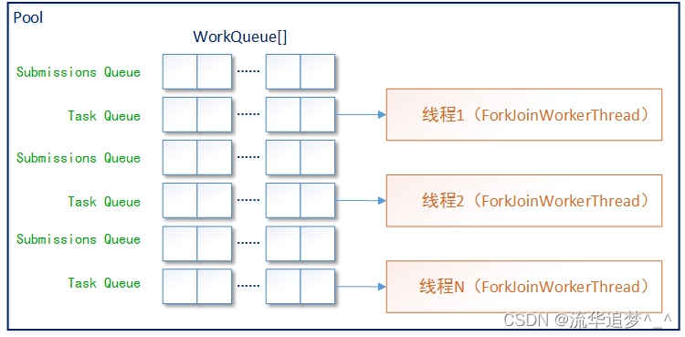
      * 队列是一个队列的数组，也就是多个队列
      * 每个ForkJoinWorkerThread线程都有自己的队列
      * 偶数下标的队列用来保存外部提交的任务，奇数下标装的是线程自己的任务
      * WorkQueue 是双端队列
        * top                        // index of next slot for push
        * base  (volatile)           // index of next slot for poll
      * 当调用 fork 方法时，将任务放进队列头部 // push
      * 线程以 LIFO 顺序, 使用 push/pop 方式处理队列中的任务
      * 如果自己队列里的任务处理完后，会从其他线程维护的队列尾部使用 poll 的方式窃取任务，以达到充分利用 CPU 资源的目的。
      * 从尾部窃取可以减少同原线程的竞争
      * 当队列中剩最后一个任务时，通过 cas 解决原线程和窃取线程的竞争
      * FIFO (async): 从SubmissionQueue底部steal task （FIFO），thread自己的WorkQueue从底部拿task（FIFO）
      * LIFO (default): 从SubmissionQueue底部steal task （FIFO），thread自己的WorkQueue从头部拿task（LIFO）
      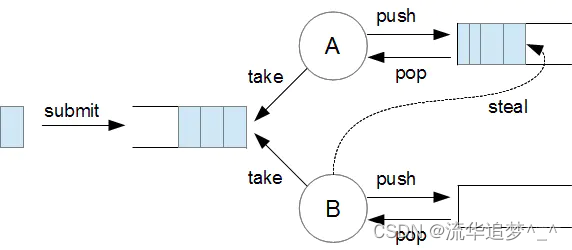
    * ctl（5个部分组成）
      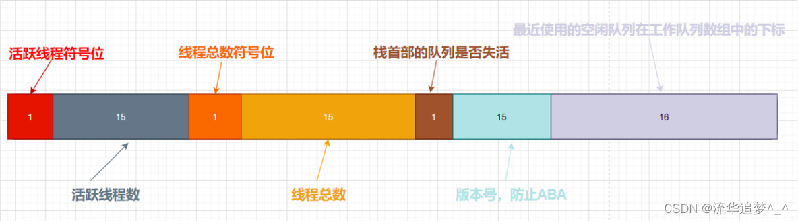
      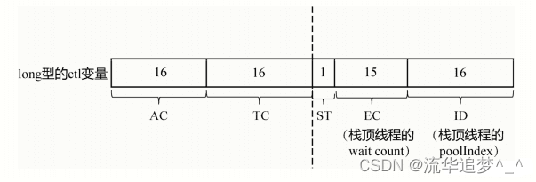
      * AC: 最高的16个比特位，表示 Active 线程数-parallelism，parallelism 是上面的构造方法传进去的最大并行线程数参数
      * TC: 次高的16个比特位，表示 Total 线程数-parallelism
      * ST: 1个比特位，如果是1，表示整个 ForkJoinPool 正在关闭
      * EC: 15个比特位，表示阻塞栈的栈顶线程的 wait count
      * ID: 16个比特位，表示阻塞栈的栈顶线程对应的 poolIndex
    * 阻塞栈（Treiber Stack）
      * 实现多个线程的阻塞、唤醒，除了 park/unpark 这一对操作原语，还需要一个无锁链表实现的阻塞队列，把所有阻塞的线程串在一起
      * 在 ForkJoinPool 中，使用了阻塞栈。把所有空闲的 Worker 线程放在一个栈里面
      * ForkJoinWorkerThread 的 poolIndex 变量，记录了自己在 ForkJoinWorkerThread[] 数组中的下标位置，poolIndex 变量就相当于每个 ForkJoinPoolWorkerThread 对象的地址
      * ForkJoinWorkerThread 的 nextWait 变量，记录了前一个阻塞线程的 poolIndex，nextWait 变量就相当于链表的 next 指针，把所有的阻塞线程串联在一起，组成一个 TreiberStack
      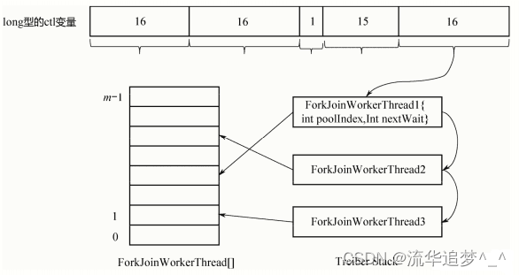
      * 首先，WorkQueue 有一个 id 变量，记录了自己在 WorkQueue[] 数组中的下标位置，id 变量就相当于每个 WorkQueue 或 ForkJoinWorkerThread 对象的地址
      * WorkQueue 还有一个 stackPred 变量，记录了前一个阻塞线程的 id，这个stackPred 变量就相当于链表的 next 指针，把所有的阻塞线程串联在一起，组成一个 Treiber Stack
      * ctl 变量的最低16位，记录了栈的栈顶线程的 poolIndex；中间的15位，记录了栈顶线程被阻塞的次数，也称为 waitcount
    * ForkJoinPool 中的线程可能的三种状态
      * 空闲状态（放在 Treiber Stack 里面）
      * 活跃状态（正在执行某个 ForkJoinTask，未阻塞）
      * 阻塞状态（正在执行某个 ForkJoinTask，但阻塞了，于是调用 join，等待另外一个任务的结果返回）
      * ctl 变量很好地反映出了三种状态：
        * 高32位：u=(int) (ctl >>> 32)，然后u又拆分成 tc、ac 两个16位
        * 低32位：c=(int) ctl
        * c＞0，说明 Treiber Stack 不为空，有空闲线程；c=0，说明没有空闲线程
    * Steal flow
    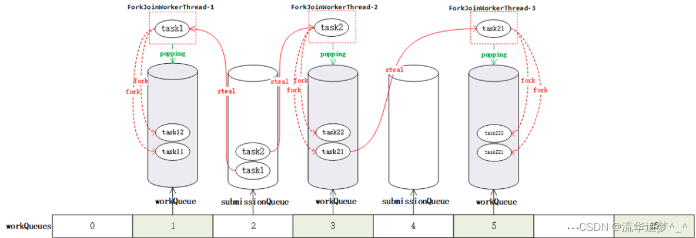 
      * 工作队列数组的一个分布情况，它的大小一定是2次幂
      * 奇数位和偶数位存放的都是任务队列
      * 奇数位是带工作线程的存放 fork 出的子任务的队列，偶数队列存放的是外部提交的任务
      * steal的task会fork成子任务
    * Submit task flow
      * 第一步，如果线程池没有初始化会先进行初始化操作，比如工作队列数组的空间分配还有线程池的状态修改等
      * 第二步，如果随机的偶数槽位队列不为空，则将任务推入队列并调用signalWork方法唤醒线程
        * 如果第二步槽位为null，则第三步为这个槽位创建队列后再重复循环。如果发生竞争会重新随机槽位
      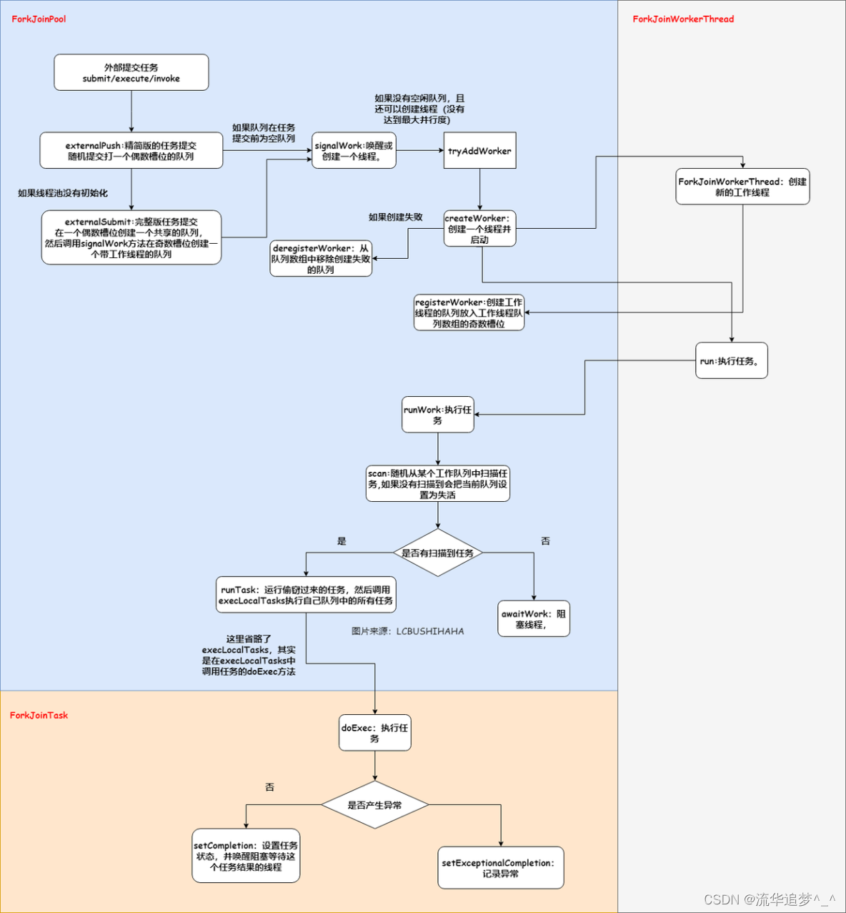
      ```
      /**
       *externalPush的完整版本，处理哪些不常用的逻辑。如第一次push的时候进行初始化、此外如果索引队列为空或者被占用，那么创建一个新的任务队列。
       *
       * @param task the task. Caller must ensure non-null.
       */
      private void externalSubmit(ForkJoinTask<?> task) {
         //r是随机数，此处双重检测，确保r不为0
          int r;                                    // initialize caller's probe
          if ((r = ThreadLocalRandom.getProbe()) == 0) {
              ThreadLocalRandom.localInit();
              r = ThreadLocalRandom.getProbe();
          }
          //死循环
          for (;;) {
              WorkQueue[] ws; WorkQueue q; int rs, m, k;
              //move默认为false
              boolean move = false;
              //如果runstate小于0 则线程池处于SHUTDOWN状态，配合进行终止
              if ((rs = runState) < 0) {
                  //终止的方法 并抛出异常，拒绝该任务
                  tryTerminate(false, false);     // help terminate
                  throw new RejectedExecutionException();
              }
              //如果状态不为STARTED 说明此时线程池可用
              else if ((rs & STARTED) == 0 ||     // initialize
                       //如果workQueues为null 或者其length小于1 则说明没用初始化
                       ((ws = workQueues) == null || (m = ws.length - 1) < 0)) {
                  int ns = 0;
                  //对线程池以CAS的方式加锁，从RUNSTATE变为RSLOCK，如果不为RUNSTATE则自旋
                  rs = lockRunState();
                  try {
                      //如果状态为  RSIGNAL RSLOCK  说明加锁成功
                      if ((rs & STARTED) == 0) {
                         //用cas的方式初始化STEALCOUNTER
                          U.compareAndSwapObject(this, STEALCOUNTER, null,
                                                 new AtomicLong());
                          // create workQueues array with size a power of two
                          //创建workQueues的数组
                          //根据并行度计算得到config，此处确保p在SMASK范围内，即2个字节
                          int p = config & SMASK; // ensure at least 2 slots
                          //n判断p是否大于1，反之则默认按1处理
                          int n = (p > 1) ? p - 1 : 1;
                          //下列过程是找到大于n的最小的2的幂 这个过程之前在HashMap中演示过
                          n |= n >>> 1; n |= n >>> 2;  n |= n >>> 4;
                          n |= n >>> 8; n |= n >>> 16; n = (n + 1) << 1;
                          //根据并行度计算得到了n,之后根据n确定workQueues的array的大小，这个数组的大小不会超过2^16
                          workQueues = new WorkQueue[n];
                          //将ns的值修改为STARTED
                          ns = STARTED;
                      }
                  } finally {
                      //最后将状态解锁 此时改为STARTED状态，这个计算过程有一点绕 
                      unlockRunState(rs, (rs & ~RSLOCK) | ns);
                  }
                  //实际上这个分支只是创建了外层的workQueues数组，此时数组内的内容还是全部都是空的 
              }
              //如果根据随机数计算出来的槽位不为空，即索引处的队列已经创建，这个地方是外层死循环再次进入的结果
              //需要注意的是这个k的计算过程，SQMASK最低的位为0，这样就导致，无论随机数r怎么变化，得到的结果总是偶数。
              else if ((q = ws[k = r & m & SQMASK]) != null) {
                  //如果这个槽位的workQueue未被锁定，则用cas的方式加锁 将其改为1
                  if (q.qlock == 0 && U.compareAndSwapInt(q, QLOCK, 0, 1)) {
                      //拿到这个队列中的array
                      ForkJoinTask<?>[] a = q.array;
                      //s为top索引
                      int s = q.top;
                      //初始化submitted状态
                      boolean submitted = false; // initial submission or resizing
                      try {                      // locked version of push
                          //与上面的externalPush一致，此处push到队列中
                          //先判断 数组不为空且数组中有空余位置，能够容纳这个task
                          if ((a != null && a.length > s + 1 - q.base) ||
                              //或者通过初始化的双端队列的数组不为null 
                              (a = q.growArray()) != null) {
                              //计算数组的index
                              int j = (((a.length - 1) & s) << ASHIFT) + ABASE;
                              //在索引index处插入task
                              U.putOrderedObject(a, j, task);
                              //将队列的QTOP加1
                              U.putOrderedInt(q, QTOP, s + 1);
                              //将提交成功状态改为true
                              submitted = true;
                          }
                      } finally {
                          //最终采用cas的方式进行解锁 将队列的锁定状态改为0
                          U.compareAndSwapInt(q, QLOCK, 1, 0);
                      }
                      //如果submitted为true说明数据添加成功，此时调用其他worker来窃取
                      if (submitted) {
                          //调用窃取的方法
                          signalWork(ws, q);
                          //退出
                          return;
                      }
                  }
                  //move状态改为true
                  move = true;                   // move on failure
              }
              //如果状态不为RSLOCK 上面两个分支都判断过了，那么此处说明这个索引位置没有初始化
              else if (((rs = runState) & RSLOCK) == 0) { // create new queue
                 /new一个新队列
                  q = new WorkQueue(this, null);
                  //hint 记录随机数
                  q.hint = r;
                  //计算config SHARED_QUEUE 将确保第一位为1 则这个计算出来的config是负数，这与初始化的方法是一致的
                  q.config = k | SHARED_QUEUE;
                  //将scan状态改为INCATIVE
                  q.scanState = INACTIVE;
                  //用cas的方式加锁
                  rs = lockRunState();  将创建的workQueue push到workQueues的数组中
                  // publish index
                  if (rs > 0 &&  (ws = workQueues) != null &&
                      k < ws.length && ws[k] == null)
                      //赋值
                      ws[k] = q;                 // else terminated
                  //解锁
                  unlockRunState(rs, rs & ~RSLOCK);
              }
              else
                  //将move改为true
                  move = true;                   // move if busy
              if (move)
                  //重新计算r
                  r = ThreadLocalRandom.advanceProbe(r);
          }
      }
      ```
    
      * signalWork: 任务提交成功后会调用这个方法，它的作用就是激活一个空闲线程或创建一个线程并绑定一个队列在队列数组的奇数槽位
        * 判断worker是否充足，如果不够，则创建新的worker
        * 如果够，就看最近使用的worker的状态是否被park了，如果park则用unpark唤醒。这样worker就可以取scan其他队列进行窃取了
      ```
      /**
       * 此处将激活worker Thread。如果工作线程太少则创建，反之则来进行窃取。
       *
       * @param ws the worker array to use to find signallees
       * @param q a WorkQueue --if non-null, don't retry if now empty
       */
      final void signalWork(WorkQueue[] ws, WorkQueue q) {
          long c; int sp, i; WorkQueue v; Thread p;
          //如果ctl为负数  ctl初始化的时候就会为负数 如果小于0  说明有任务需要处理
          while ((c = ctl) < 0L) {                       // too few active
              //c为long，强转int 32位的高位都丢弃，此时如果没有修改过ctl那么低位一定为0 可参考前面ctl的推算过程，所以此处sp 为0 sp为0则说明没有空闲的worker
              if ((sp = (int)c) == 0) {                  // no idle workers
                  //还是拿c与ADD_WORKER取& 如果不为0 则说明worker太少，需要新增worker
                  if ((c & ADD_WORKER) != 0L)            // too few workers
                      //通过tryAddWorker 新增worker
                      tryAddWorker(c);
                  break;
              }
              //再次缺认ws有没有被初始化 如果没有 退出
              if (ws == null)                            // unstarted/terminated
                  break;
              //如果ws的length小于sp的最低位 退出
              if (ws.length <= (i = sp & SMASK))         // terminated
                  break;
              //如果index处为空 退出
              if ((v = ws[i]) == null)                   // terminating
                  break;
              //将sp的低32位取出
              int vs = (sp + SS_SEQ) & ~INACTIVE;        // next scanState
              //计算用sp减去 scanState
              int d = sp - v.scanState;                  // screen CAS
              long nc = (UC_MASK & (c + AC_UNIT)) | (SP_MASK & v.stackPred);
              //采用cas的方式修改ctl 实际上就是加锁 由于ctl的修改可能会导致while循环退出
              if (d == 0 && U.compareAndSwapLong(this, CTL, c, nc)) {
                  v.scanState = vs;                      // activate v
                  //如果p被park wait中
                  if ((p = v.parker) != null)
                      //将worker唤醒 
                      U.unpark(p);
                  //退出
                  break;
              }
              //如果此队列为空或者没有task 也退出
              if (q != null && q.base == q.top)          // no more work
                  break;
          }
      }
      ```
      * tryAddWorker: 只是做了一些准备过程，增加count，以及加锁判断，最终还是通过createWorker来进行
      ```
      /**
       * 尝试新增一个worker，然后增加ctl中记录的worker的数量
       *
       * @param c incoming ctl value, with total count negative and no
       * idle workers.  On CAS failure, c is refreshed and retried if
       * this holds (otherwise, a new worker is not needed).
       */
      private void tryAddWorker(long c) {
          //传入的c为外层调用方法的ctl add标记为false
          boolean add = false;
          do {
              long nc = ((AC_MASK & (c + AC_UNIT)) |
                         (TC_MASK & (c + TC_UNIT)));
              //如果此时ctl与外层传入的ctl相等 说明没有被修改
              if (ctl == c) {
                  int rs, stop;                 // check if terminating
                  //用cas的方式加锁
                  if ((stop = (rs = lockRunState()) & STOP) == 0)
                      //增加ctl的数量，如果成功 add为ture
                      add = U.compareAndSwapLong(this, CTL, c, nc);
                  //解锁
                  unlockRunState(rs, rs & ~RSLOCK);
                  //如果stop不为0 则说明线程池停止 退出
                  if (stop != 0)
                      break;
                  //如果前面增加ctl中的数量成功，那么此处开始创建worker
                  if (add) {
                      createWorker();
                      break;
                  }
              }
          //这个while循环， 前半部分与ADD_WORKER取并，最终只会保留第48位，这个位置为1，同时c的低32为为0，
          } while (((c = ctl) & ADD_WORKER) != 0L && (int)c == 0);
      }
      ```
      * createWorker
        * 创建了一个ForkJoinThread, 并启动线程
        * ForkJoinThread构造方法会去创建奇数位的work queue，并关联到这个Thread
      ```
      // Creating, registering and deregistering workers
    
      /**
       * 创建并启动一个worker，因为前面已经做了增加count，如果此处出现异常，创建worker不成功，则在deregisterWorker中会判断如果ex不为空，且当前为创建状态的话，会重新进入tryAddWorker方法。
       *
       * @return true if successful
       */
      private boolean createWorker() {
          //创建线程的工厂方法
          ForkJoinWorkerThreadFactory fac = factory;
          Throwable ex = null;
          ForkJoinWorkerThread wt = null;
          try {
              //如果工厂方法不为空，则用这个工厂方法创建线程，之后再启动线程，此时newThread将与workQueue绑定
              if (fac != null && (wt = fac.newThread(this)) != null) {
                  wt.start();
                  return true;
              }
          //如果创建失败，出现了异常 则ex变量有值
          } catch (Throwable rex) {
              ex = rex;
          }
          deregisterWorker(wt, ex);
          return false;
      }
      ```
      * registerWorker
      ```
      /**
       * 创建线程，并建立线程与workQueue的关系，此处只会在workQueues数组的奇数位操作
       *
       * @param wt the worker thread
       * @return the worker's queue
       */
      final WorkQueue registerWorker(ForkJoinWorkerThread wt) {
          UncaughtExceptionHandler handler;
          //将线程设置为守护线程
          wt.setDaemon(true);                           // configure thread
          //如果没有handler则抛出异常
          if ((handler = ueh) != null)
              wt.setUncaughtExceptionHandler(handler);
          //创建一个workQueue，此时owoner为当前输入的ForkJoinThread
          WorkQueue w = new WorkQueue(this, wt);
          //定义i为0
          int i = 0;                                    // assign a pool index
          //定义mode 
          int mode = config & MODE_MASK;
          //加锁
          int rs = lockRunState();
          try {
              WorkQueue[] ws; int n;                    // skip if no array
              //如果workQueues存在，且长度大于0
              if ((ws = workQueues) != null && (n = ws.length) > 0) {
                  //通过魔数计算
                  int s = indexSeed += SEED_INCREMENT;  // unlikely to collide
                  //m为n-1,而n为数组的初始化长度，第一次创建的时候，n=16，那么m为15
                  int m = n - 1;
                  //将s左移然后最后一位补上1，之后与奇数m求并集，那么得到的结果必然是奇数
                  i = ((s << 1) | 1) & m;               // odd-numbered indices
                  //判断i位置是否为空 如果不为空，出现了碰撞，则计算步长向后移动来存放这个queue 这个步长一定是偶数
                  if (ws[i] != null) {                  // collision
                      int probes = 0;                   // step by approx half n
                      //最小步长为2  n是数组长度，比为偶数，那么如果n小于等于4，则步长为2，反之，则将n右移，将偶数最后一位的0清除，之后再和EVENMASK求并，这样就相当于将原来的长度缩小2倍，并确保是偶数。之后再加上2。那么假定n为16的话，此处计算的step就为10
                      int step = (n <= 4) ? 2 : ((n >>> 1) & EVENMASK) + 2;
                      //之后再通过while循环，继续判断增加步长之后是否碰撞，如果碰撞，则继续增加步长
                      while (ws[i = (i + step) & m] != null) {
                          //如果还是碰撞，且probes增加1之后大于长度n，则会触发扩容，workQueues会扩大2倍 这个probes感觉意义不大
                          if (++probes >= n) {
                              workQueues = ws = Arrays.copyOf(ws, n <<= 1);
                              m = n - 1;
                              //将probes置为0
                              probes = 0;
                          }
                      }
                  }
                  //设置随机数seed
                  w.hint = s;                           // use as random seed
                  //修改config
                  w.config = i | mode;
                  //修改scanState为i
                  w.scanState = i;                      // publication fence
                  //将w设置到i处
                  ws[i] = w;
              }
          } finally {
             //cas的方式进行解锁
              unlockRunState(rs, rs & ~RSLOCK);
          }
          //此处设置线程name
          wt.setName(workerNamePrefix.concat(Integer.toString(i >>> 1)));
          return w;
      }
      ```
      * deregisterWorker: 如果线程创建没有成功，那么count需要回收。以及进行一些清理工作
      ```
      /**
       *此方法的主要目的是在创建worker或者启动worker失败之后的回调方法，此时将之前的ctl中增加的count减去。
       *
       * @param wt the worker thread, or null if construction failed
       * @param ex the exception causing failure, or null if none
       */
      final void deregisterWorker(ForkJoinWorkerThread wt, Throwable ex) {
          WorkQueue w = null;
          //如果workQueue和thread不为空
          if (wt != null && (w = wt.workQueue) != null) {
              WorkQueue[] ws;                           // remove index from array
              //根据config计算index
              int idx = w.config & SMASK;
              //加锁
              int rs = lockRunState();
              如果ws不为空且length大于idx同时idx处的worker就是workerQueue 则将该idx处的worker移除
              if ((ws = workQueues) != null && ws.length > idx && ws[idx] == w)
                  ws[idx] = null;
              //解锁 修改rs状态 
              unlockRunState(rs, rs & ~RSLOCK);
          }
          //后续对count减少
          long c;                                       // decrement counts
          //死循环 cas的方式将ctl修改
          do {} while (!U.compareAndSwapLong
                       (this, CTL, c = ctl, ((AC_MASK & (c - AC_UNIT)) |
                                             (TC_MASK & (c - TC_UNIT)) |
                                             (SP_MASK & c))));
           //如果workQueue不为空  将其中的task取消                              
          if (w != null) {
              w.qlock = -1;                             // ensure set
              w.transferStealCount(this);
              w.cancelAll();                            // cancel remaining tasks
          }
          //死循环 如果为停止状态则配合停止
          for (;;) {                                    // possibly replace
              WorkQueue[] ws; int m, sp;
              if (tryTerminate(false, false) || w == null || w.array == null ||
                  (runState & STOP) != 0 || (ws = workQueues) == null ||
                  (m = ws.length - 1) < 0)              // already terminating
                  break;
              if ((sp = (int)(c = ctl)) != 0) {         // wake up replacement
                  if (tryRelease(c, ws[sp & m], AC_UNIT))
                      break;
              }
              else if (ex != null && (c & ADD_WORKER) != 0L) {
                  tryAddWorker(c);                      // create replacement
                  break;
              }
              else                                      // don't need replacement
                  break;
          }
          //异常处理
          if (ex == null)                               // help clean on way out
              ForkJoinTask.helpExpungeStaleExceptions();
          else                                          // rethrow
              ForkJoinTask.rethrow(ex);
      }
      ```
    * workQueue的工作过程
      * 在workQueue创建完成之后，下一步，这些线程的run方法调用后被启动,之后就进入了worker线程的生命周期了
      ```
      public void run() {
          if (workQueue.array == null) { // only run once
              Throwable exception = null;
              try {
                  onStart();
                  pool.runWorker(workQueue);
              } catch (Throwable ex) {
                  exception = ex;
              } finally {
                  try {
                      onTermination(exception);
                  } catch (Throwable ex) {
                      if (exception == null)
                          exception = ex;
                  } finally {
                      pool.deregisterWorker(this, exception);
                  }
              }
          }
      }
      ```
      * runWorker
        * 根据随机数计算一个k，然后根据k去遍历workQueues
        * 看看这个位置是否有数据，如果不为空，则检查checkSum，根据checkSum的状态确认是否从这个队列中取数据。按之前约定的FIFO或者LIFO取数
        * 这意味着，工作队列对窃取和是否获得本队列中的任务之间并没有优先级，而是根据随机数得到的index，之后对数组进行遍历
      ```
      /**
       * 通过调用线程的run方法，此时开始最外层的runWorker
       */
      final void runWorker(WorkQueue w) {
         //初始化队列，这个方法会根据任务进行判断是否需要扩容
          w.growArray();                   // allocate queue
          //hint是采用的魔数的方式增加
          int seed = w.hint;               // initially holds randomization hint
          //如果seed为0 则使用1
          int r = (seed == 0) ? 1 : seed;  // avoid 0 for xorShift
          //死循环
          for (ForkJoinTask<?> t;;) {
             //调用scan方法 对经过魔数计算的r 之后开始进行窃取过程 如果能够窃取 则task不为空
              if ((t = scan(w, r)) != null)
                  //运行窃取之后的task
                  w.runTask(t);
              //反之则当前线程进行等待
              else if (!awaitWork(w, r))
                  break;
              r ^= r << 13; r ^= r >>> 17; r ^= r << 5; // xorshift
          }
      }
      ```
      * scan
      ```
      /**
       * 通过scan方法进行任务窃取，扫描从一个随机位置开始，如果出现竞争则通过魔数继续随机移动，
       * 反之则线性移动，直到所有队列上的相同校验连续两次出现为空，则说明没有任何任务可以窃取，
       * 因此worker会停止窃取，之后重新扫描，如果找到任务则重新激活，否则返回null，
       * 扫描工作应该尽可能少的占用内存，以减少对其他扫描线程的干扰。
       *
       * @param w the worker (via its WorkQueue)
       * @param r a random seed
       * @return a task, or null if none found
       */
      private ForkJoinTask<?> scan(WorkQueue w, int r) {
          WorkQueue[] ws; int m;
          //如果workQueues不为空且长度大于1，当前workQueue不为空
          if ((ws = workQueues) != null && (m = ws.length - 1) > 0 && w != null) {
              //ss为扫描状态
              int ss = w.scanState;                     // initially non-negative
              //for循环 这是个死循环  origin将r与m求并，将多余位去除。然后赋值给k
              for (int origin = r & m, k = origin, oldSum = 0, checkSum = 0;;) {
                  WorkQueue q; ForkJoinTask<?>[] a; ForkJoinTask<?> t;
                  int b, n; long c;
                  //如果k处不为空
                  if ((q = ws[k]) != null) {
                      //如果task大于0
                      if ((n = (b = q.base) - q.top) < 0 &&
                          (a = q.array) != null) {      // non-empty
                          //计算i
                          long i = (((a.length - 1) & b) << ASHIFT) + ABASE;
                          //得到i处的task 
                          if ((t = ((ForkJoinTask<?>)
                                    U.getObjectVolatile(a, i))) != null &&
                              q.base == b) {
                              //如果扫描状态大于0 (w处于active状态)
                              if (ss >= 0) {
                                  //更改a中i的值为空 也就是此处将任务窃取走了
                                  if (U.compareAndSwapObject(a, i, t, null)) {
                                      //将底部的指针加1
                                      q.base = b + 1;
                                      //如果n小于-1 则通知工作线程工作
                                      if (n < -1)       // signal others
                                          signalWork(ws, q);
                                      //将窃取的task返回
                                      return t;
                                  }
                              }
                              //如果 scan状态小于0 (w处于inactive状态) 则调用tryRelease方法唤醒的栈顶的空闲worker
                              else if (oldSum == 0 &&   // try to activate
                                       w.scanState < 0)
                                  //调用tryRelease方法 后续详细介绍
                                  tryRelease(c = ctl, ws[m & (int)c], AC_UNIT);
                          }
                          //如果ss小于0 
                          if (ss < 0)                   // refresh
                              //更改ss
                              ss = w.scanState;
                          r ^= r << 1; r ^= r >>> 3; r ^= r << 10;
                          origin = k = r & m;           // move and rescan
                          oldSum = checkSum = 0;
                          continue;
                      }
                      checkSum += b;
                  }
                  // 此处判断k，k在此通过+1的方式完成对原有workQueues的遍历
                  // 将w的scanState设置成inactive并将w设置成栈顶的空闲work，work.stackPred指向之前的栈顶空闲work
                  // scanState active时是w的index，inactive的时候是index | INACTIVE   
                  if ((k = (k + 1) & m) == origin) {    // continue until stable
                      if ((ss >= 0 || (ss == (ss = w.scanState))) &&
                          oldSum == (oldSum = checkSum)) {
                          if (ss < 0 || w.qlock < 0)    // already inactive
                              break;
                          int ns = ss | INACTIVE;       // try to inactivate
                          long nc = ((SP_MASK & ns) |
                                     (UC_MASK & ((c = ctl) - AC_UNIT)));
                          w.stackPred = (int)c;         // hold prev stack top
                          U.putInt(w, QSCANSTATE, ns);
                          if (U.compareAndSwapLong(this, CTL, c, nc))
                              ss = ns;
                          else
                              w.scanState = ss;         // back out
                      }
                      checkSum = 0;
                  }
              }
          }
          return null;
      }
      ```
      * tryRelease
      ```
      /**
       * 如果worker处于空闲worker Stack的workQueue的顶部。则发信号对其进行释放。
       *
       * @param c incoming ctl value
       * @param v if non-null, a worker
       * @param inc the increment to active count (zero when compensating)
       * @return true if successful
       */
      private boolean tryRelease(long c, WorkQueue v, long inc) {
          //sp取c的低位，计算vs -  scanState active
          int sp = (int)c, vs = (sp + SS_SEQ) & ~INACTIVE; Thread p;
          //如果v不为空 且v的sancState为sp 
          if (v != null && v.scanState == sp) {          // v is at top of stack
              //计算nc，将栈顶空闲空闲work指向v.stackPred
              long nc = (UC_MASK & (c + inc)) | (SP_MASK & v.stackPred);
              //采用cas的方式 将ctl改为nc
              if (U.compareAndSwapLong(this, CTL, c, nc)) {
                  //修改scanState的状态
                  v.scanState = vs;
                  //如果此时这线程为park状态，则调用unpark
                  if ((p = v.parker) != null)
                      U.unpark(p);
                  return true;
              }
          }
          return false;
      }
      ```
      * awaitWork
        * scan方法没有拿到task，则会调用awaitWork。将当前的线程进行阻塞
      ```
      /**
       *如果不能窃取到任务，那么就将worker阻塞。如果停用导致线程池处于静止状态，则检查是否要关闭，如果这不是唯一的工作线程，则等待给定的持续时间，达到超时时间后，如果ctl没有更改，则将这个worker终止，之后唤醒另外一个其他的worker对这个过程进行重复。
       *
       * @param w the calling worker
       * @param r a random seed (for spins)
       * @return false if the worker should terminate
       */
      private boolean awaitWork(WorkQueue w, int r) {
          //如果w不为空且w的qlock小于0 则直接返回false 
          if (w == null || w.qlock < 0)                 // w is terminating
              return false;
          //for循环，这是个死循环，定义pred
          for (int pred = w.stackPred, spins = SPINS, ss;;) {
              //如果ss大于0 则返回
              if ((ss = w.scanState) >= 0)
                  break;
              //如果spins大于0 
              else if (spins > 0) {
                 //计算r
                  r ^= r << 6; r ^= r >>> 21; r ^= r << 7;
                  //如果r大于0 且spins为0
                  if (r >= 0 && --spins == 0) {         // randomize spins
                      WorkQueue v; WorkQueue[] ws; int s, j; AtomicLong sc;
                      //如果pred不为0 且ws不为空
                      if (pred != 0 && (ws = workQueues) != null &&
                           //j<ws.length
                          (j = pred & SMASK) < ws.length &&
                          //j位置处不为空
                          (v = ws[j]) != null &&        // see if pred parking
                           //并且没有park
                          (v.parker == null || v.scanState >= 0))
                          //继续在for循环中自旋
                          spins = SPINS;                // continue spinning
                  }
              }
              //如果qlock小于0  返回false
              else if (w.qlock < 0)                     // recheck after spins
                  return false;
              //如果被中断
              else if (!Thread.interrupted()) {
                  long c, prevctl, parkTime, deadline;
                  int ac = (int)((c = ctl) >> AC_SHIFT) + (config & SMASK);
                  //如果线程池停止
                  if ((ac <= 0 && tryTerminate(false, false)) ||
                      (runState & STOP) != 0)           // pool terminating
                      return false;
                  //最后的等待 获取不到任务 此时采用超时等待  park的方式进行
                  if (ac <= 0 && ss == (int)c) {        // is last waiter
                      prevctl = (UC_MASK & (c + AC_UNIT)) | (SP_MASK & pred);
                      int t = (short)(c >>> TC_SHIFT);  // shrink excess spares
                      if (t > 2 && U.compareAndSwapLong(this, CTL, c, prevctl))
                          return false;                 // else use timed wait
                      parkTime = IDLE_TIMEOUT * ((t >= 0) ? 1 : 1 - t);
                      deadline = System.nanoTime() + parkTime - TIMEOUT_SLOP;
                  }
                  else
                      prevctl = parkTime = deadline = 0L;
                  //获取线程
                  Thread wt = Thread.currentThread();
                  //设置PARKBLOCKER
                  U.putObject(wt, PARKBLOCKER, this);   // emulate LockSupport
                  w.parker = wt;
                  //调用park方法
                  if (w.scanState < 0 && ctl == c)      // recheck before park
                      U.park(false, parkTime);
                  U.putOrderedObject(w, QPARKER, null);
                  U.putObject(wt, PARKBLOCKER, null);
                  //如果scanState大于0 退出
                  if (w.scanState >= 0)
                      break;
                  //如果已经达到deadline的时间 则返回false
                  if (parkTime != 0L && ctl == c &&
                      deadline - System.nanoTime() <= 0L &&
                      U.compareAndSwapLong(this, CTL, c, prevctl))
                      return false;                     // shrink pool
              }
          }
          return true;
      }
      ```
  * Fork 处理逻辑
    * 如果当前线程是 ForkJoinWorkerThread 类型的线程则任务提交到依赖的 ForkJoinPool 中执行
    * 否则使用一个静态公用的 ForkJoinPool 执行
    * 提交过程为：把当前任务存放在 ForkJoinTask 数组队列里。然后再调用 ForkJoinPool 的 signalWork 方法唤醒或创建一个工作线程来执行任务
    * 在实现ForkJoinTask的exec方法create子的ForkJoinTask，调用子的ForkJoinTask的fork方法来拆分子Task
    * fork代码参考

    ```
    // ForkJoinTask.fork 方法
    public final ForkJoinTask<V> fork() {
        Thread t;
        if ((t = Thread.currentThread()) instanceof ForkJoinWorkerThread)
            ((ForkJoinWorkerThread)t).workQueue.push(this);
        else
            ForkJoinPool.common.externalPush(this);
        return this;
    }

    // WorkQueue.push 方法
    final void push(ForkJoinTask<?> task) {
        ForkJoinTask<?>[] a; ForkJoinPool p;
        int b = base, s = top, n;
        if ((a = array) != null) {    // ignore if queue removed
            int m = a.length - 1;     // fenced write for task visibility
            U.putOrderedObject(a, ((m & s) << ASHIFT) + ABASE, task);
            U.putOrderedInt(this, QTOP, s + 1);
            if ((n = s - b) <= 1) {
                if ((p = pool) != null)
                    p.signalWork(p.workQueues, this);
            }
            else if (n >= m)
                growArray();
        }
    }    
    ```
  * Join 处理逻辑
    * 任务状态有 4 种:已完成 (NORMAL)、被取消 (CANCELLED)、信号 (SIGNAL) 和出现异常 (EXCEPTIONAL)
    * 调用 doJoin 方法，得到当前任务的状态来判断返回什么结果
    * 如果任务状态是已完成，则直接返回任务结果
    * 如果任务状态是被取消，则直接抛出 CancellationException
    * 如果任务状态是抛出异常，则直接抛出对应的异常
    * 在 doJoin 方法里，首先通过查看任务的状态，看任务是否已经执行完成
      * 如果执行完成，则直接返回任务状态
      * 如果没有执行完，则从任务数组里取出任务并执行
        * 如果任务顺利执行完成，则设置任务状态为 NORMAL
        * 如果出现异常，则记录异常，并将任务状态设置为 EXCEPTIONAL
    * 在实现ForkJoinTask的exec方法调用所有fork的子ForkJoinTask的join方法来获取他们的执行结果，然后合并所有结果
    * join源码参考
    ```
    public final V join() {
        int s;
        if ((s = doJoin() & DONE_MASK) != NORMAL)
            reportException(s);
        return getRawResult();
    }
    
    private int doJoin() {
        int s; Thread t; ForkJoinWorkerThread wt; ForkJoinPool.WorkQueue w;
        return (s = status) < 0 ? s :
            ((t = Thread.currentThread()) instanceof ForkJoinWorkerThread) ?
            (w = (wt = (ForkJoinWorkerThread)t).workQueue).
            tryUnpush(this) && (s = doExec()) < 0 ? s :
            wt.pool.awaitJoin(w, this, 0L) :
            externalAwaitDone();
    }    
    
    ```
  * Example
    * 计算 1+2+3+...+100，如果加数之间差值大于等于 10 则拆分为子任务
    ```
    @Slf4j
    @Getter
    @AllArgsConstructor
    public class ForkJoinExample extends RecursiveTask<Integer> {
    
        private static final int THRESHOLD = 10;  // 阈值
        private int start;
        private int end;
    
        public ForkJoinExample(int start, int end) {
            this.start = start;
            this.end = end; 
        }
    
        @Override
        protected Integer compute() {
            int sum = 0;
            boolean canCompute = (end - start) <= THRESHOLD;
            if (canCompute) {
                for (int i = start; i <= end; i++) {
                    sum += i;
                }
            } else {
                // 如果任务大于阈值，就分裂成两个子任务计算
                int middle = (start + end) / 2;
                final ForkJoinExample leftTask = new ForkJoinExample(start, middle);
                final ForkJoinExample rightTask = new ForkJoinExample(middle + 1, end);
                leftTask.fork();
                rightTask.fork();
    
                // 等待子任务执行完，并得到其结果
                int leftResult = leftTask.join();
                int rightResult = rightTask.join();
                // 合并子任务
                sum = leftResult + rightResult;
            }
            return sum;
        }
    
        public static void main(String[] args) {
            final ForkJoinPool forkJoinPool = new ForkJoinPool();
            // 生成一个计算任务，负责计算
            final ForkJoinExample task = new ForkJoinExample(1, 100);
            // 异步执行一个任务
            final Future<Integer> result = forkJoinPool.submit(task);
            // final Integer r2 = forkJoinPool.invoke(task); // 同步执行
            try {
                log.info("sum = {}", result.get());
            } catch (InterruptedException | ExecutionException ignored) {
            }
        }
    }
    
    
    ```


