# 垃圾回收器CMS - Concurrent Mark Sweep

## 分代收集

### 为什么要分代
* 绝大多数对象都是朝生夕灭的。（年轻代）
* 熬过越多次垃圾收集过程的对象就越难以消亡。（老年代）
* 跨代引用相对于同代引用来说仅占极少数。（跨代引用较少）
* 垃圾收集器可以每次只回收其中某一个或者某些部分的区域。（按需收集）
* 针对不同的区域安排不同的的垃圾收集算法（标记-复制算法、标记-清除算法、标记-整理算法）

### 如何分代

* 针对上面分代的经验法则，「多数商业虚拟机」在 Java 堆划分出不同的区域（年轻代、老年代）。
  * 年轻代 ，又划分为 Eden 和 Survivor 2 个区域
  * 老年代

### 分代收集种类
* 在虚拟机中一般根据 GC 作用及位置划分为以下几种：
  * 部分收集（Partial GC）：指目标不是完整收集整个 Java 堆，其中又分为：
    * 年轻代收集（Minor GC/Young GC）：只是年轻代的垃圾收集。
    * 老年代收集（Major GC/Old GC）：只是老年代的垃圾收集。目前只有 CMS 收集器会有单独收集老年代的行为。
    * 混合收集（Mixed GC）：收集整个年轻代以及部分老年代的垃圾收集。目前只有 G1 收集器会有这种行为。
    * 整堆收集（Full GC）：收集整个 Java 堆和方法区的垃圾。


## 内存分配策略
* 大多数情况下，对象在年轻代 Eden 区中分配
* 大对象直接进入老年代
  ```
  HotSpot 虚拟机提供了-XX：PretenureSizeThreshold 参数，指定大于该设置值的对象直接在老年代分配，
  这样做的目的就是避免在 Eden 区及两个 Survivor 区之间来回复制，产生大量的内存复制操作
  ```
* 长期存活的对象将进入老年代
  ```
  对象通常在 Eden 区里诞生，如果经过第一次 Young GC 后仍然存活，
  并且能被 Survivor 容纳的话，该对象会被移动到 Survivor 空间中，并且将其对象年龄设为 1 岁。
  对象在 Survivor 区中每熬过一次 Young GC，年龄就增加 1 岁，当它的年龄增加到一定程度（默认为 15），
  就会被晋升到老年代中。对象晋升老年代的年龄阈值，可以通过参数-XX：MaxTenuringThreshold 设置。
  ```
* 动态对象年龄判定
  ```
  为了能更好地适应不同程序的内存状况，HotSpot 虚拟机并不是永远要求对象的年龄必须达到-XX：MaxTenuringThreshold 才能晋升老年代，
  如果在 Survivor 空间中相同年龄所有对象大小的总和大于 Survivor 空间的一半，年龄大于或等于该年龄的对象就可以直接进入老年代，
  无须等到-XX：MaxTenuringThreshold 中要求的年龄。
  ```

### 内存回收策略
* Young GC
  * 年轻代中的 Eden 区分配满的时候触发。
  * 注意 Young GC 中有部分存活对象会晋升到老年代
  * 所以 Young GC 后老年代的占用量通常会有所升高
* Old GC
  * 目前只有 CMS 收集器会有单独收集老年代的行为
* Full GC
  * 在发生 Young GC 之前，虚拟机必须先检查老年代最大可用的连续空间是否大于年轻代所有对象总空间
    * 如果条件成立，那这一次 Young GC 可以确保是安全的
    * 如果条件不成立，则虚拟机会先查看-XX：HandlePromotionFailure 参数的设置值是否允许担保失败
      * 如果允许担保失败，继续检查老年代最大可用的连续空间是否大于历次晋升到老年代对象的平均大小
        * 如果大于，将尝试进行一次 Young GC
        * 如果小于，改为进行一次 Full GC
      * 如果不允许担保失败，改为进行一次 Full GC
* 元空间分配时没有足够空间时，触发 Full GC
* System.gc 方法、heap dump 时带 GC，默认触发 Full GC

## 收集算法
### 标记-清除算法 (find-delete)
* 「标记」首先标记出所有需要回收的对象，也可以反过来，标记存活的对象。标记过程就是对象是否属于垃圾的判定过程。
* 「清理」清理回收
* 主要优点：
  * 不需要移动对象
* 主要缺点：
  * 执行效率不稳定，如果 Java 堆中包含大量对象，其中大部分是需要被回收的，这时必须进行大量标记和清除的动作
  * 存空间的碎片化问题，标记、清除之后会产生大量不连续的内存碎片，内存碎片太多可能会导致当以后在程序运行过程中需要分配较大对象时无法找到足够的连续内存而不得不提前触发另一次垃圾收集动作

### 标记-复制算法 (find-copy)
* 「内存切分」它将可用内存按容量划分为大小相等的两块，每次只使用其中的一块。
* 「复制-清理」当这一块的内存用完了，就将还存活着的对象复制到另外一块上面，然后再把已使用过的内存空间一次清理掉。
* 主要优点：
  * 分配内存时也就不用考虑有空间碎片的复杂情况
* 主要缺点：
  * 算法将会产生大量的内存间复制的开销
  * 可用内存缩小为了原来的一半
### 标记-整理算法 (find-sort)
  * 「标记」首先标记出所有需要回收的对象，也可以反过来，标记存活的对象。标记过程就是对象是否属于垃圾的判定过程。
  * 「整理」让存活的对象都向内存空间一端移动（将存活的与要死亡对象的分开）
  * 「清理」清理边界以外的内存
  * 主要优点：
    * 分配内存时也就不用考虑有空间碎片的复杂情况
  * 主要缺点：
    * 移动存活对象需要更新引用「Stop The World」
  * 关于移动对象的影响：
    * 从延迟时间来看，不移动对象停顿时间会更短，甚至可以不需要停顿。
    * 从整个程序的吞吐量来看，移动对象会更划算。

### 算法示意图
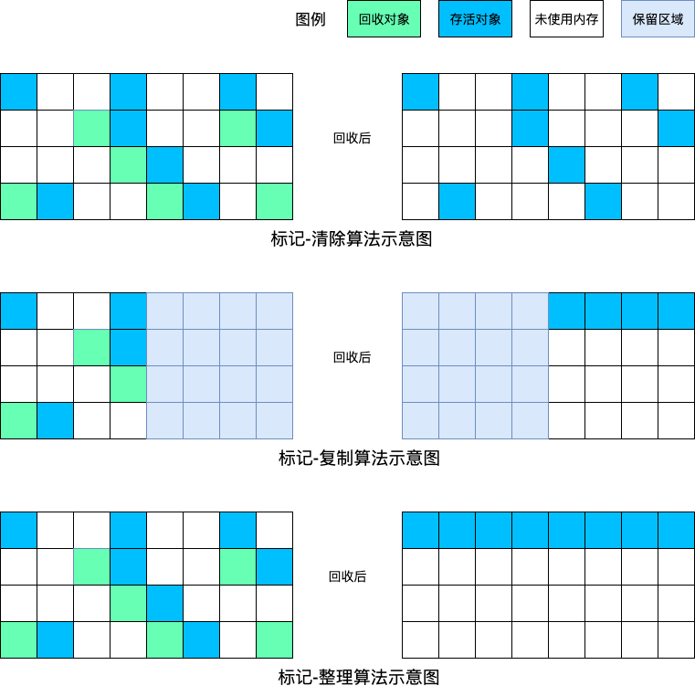

### 算法总结与应用场景

| | 标记-清除 | 标记-复制 | 标记-整理 |
| ------ | ------ | ------ | ------ | 
| 速度 | 中等 | 最快 | 最慢 |
| 空间使用率 | 100% | 50% | 100% |
| 空间碎片 | 会 | 不会 | 不会 |
| 移动对象 | 否 | 是 | 是 |

* 年轻代中的对象存活率较低，一般使用复制算法，因为其时间开销与存活对象的大小成正比，如果存活对象很少，它就非常快；而且年轻代本身应该比较小，就算需要 2 倍空间也只会浪费不太多的空间
* 老年代被对象存活率可能会很高，而且假定可用剩余空间不太多，这样复制算法就不太合适，于是更可能选用另两种算法，特别是不用移动对象的清除算法
* 无论哪种算法，内存碎片的问题需要解决，而且仅有「清除算法」会产生内存碎片
  * 因此收集器可能会搭配其他的收集器来进行内存整理（CMS 搭配 Serial Old 进行 Full GC）
  * 或者在 Full GC 时进行整理。HotSpot VM 的 Full GC 时使用整理算法实现

## gc算法
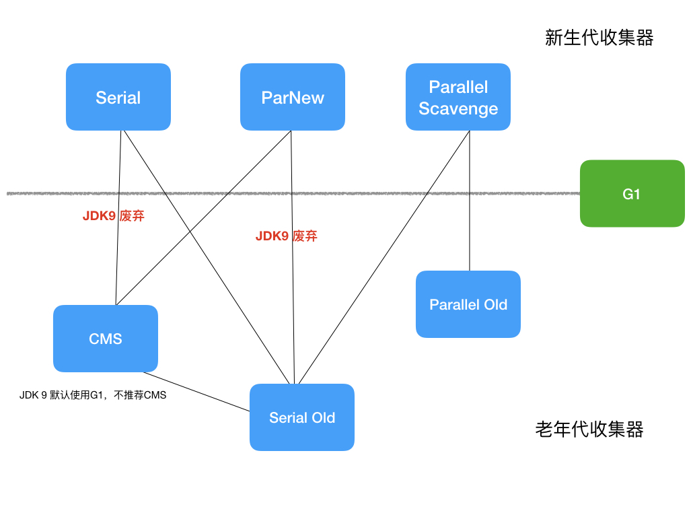

### 算法评估指标
* 并发与并行的概念声明
  * 并行：同一时间有多条垃圾收集线程工作，通常默认此时用户线程处于等待状态
  * 并发：同一时间垃圾收集线程与用户线程都在运行
* 吞吐量 ： 用户代码时间 / (用户代码CPU时间 + 垃圾收集CPU时间)
* 回收停顿时间 ：用户程序被暂停的时间，通常我们叫作「Stop The World」
* 一般评估一个垃圾收集器的标准主要看这两个指标，吞吐量越高越好、回收停顿时间越短越好。但是二者又互相矛盾：
* 如果说为了高吞吐量，我们可以少进行 GC，CPU时间多用来运行用户代码。 
* 但是如果这样，在真正需要 GC 时候累积了太多对象需要处理，GC 一次耗时又很长，回收停顿时间变大了。
* 反过来如果为了最短回收停顿时间，我们不停的 GC ，那么CPU用来做GC的时间会增大，导致吞吐量下降。
* 因此：一个 GC 算法只可能针对两个目标之一（最大吞吐量或最小回收停顿时间），或尝试找到一个二者的折衷。

### Serial/Serial Old 收集器
* Serial 是一个新生代收集器，基于标记-复制算法实现
* Serial Old 是一个老年代收集器，基于标记-整理算法实现
* 两者都是单线程收集，需要「Stop The World」
* 应用场景：
  * 客户端模式下的默认新生代收集器
  * 对于内存资源受限的环境，它是所有收集器里额外内存消耗最小的
  * 对于单核处理器或处理器核心数较少的环境来说，Serial 收集器由于没有线程交互的开销

### ParNew 收集器
* ParNew 收集器是是一款新生代收集器。与 Serial 收集器相比，支持垃圾收集器多线程并行收集。

### Parallel Scavenge/Parallel Old 收集器
* Parallel Scavenge 收集器是一款新生代收集器，基于标记-复制算法实现
* Parallel Old 收集器是一款老年代收集器，基于标记-整理算法实现
* 两者都支持多线程并行收集，需要「Stop The World」
* 控制吞吐量为目标
* 特性
  * 可控制的吞吐量
    * 两个参数用于精确控制吞吐量，分别是
      * 控制最大垃圾收集停顿时间 -XX：MaxGCPauseMillis ( >0 的毫秒数)
      * 设置吞吐量大小的 -XX：GCTimeRatio（0-100 的整数）
    * 自适应的调节策略
      ```
      -XX：+UseAdaptiveSizePolicy 当这个参数被激活之后，就不需要人工指定新生代的大小（-Xmn）、Eden 与 Survivor 区的比例（-XX：SurvivorRatio）、晋升老年代对象大小（-XX：PretenureSizeThreshold）等细节参数， 
      虚拟机会根据当前系统的运行情况收集性能监控信息，动态调整这些参数以提供最合适的停顿时间或者最大的吞吐量。
      ```

### CMS回收
* CMS是在老年代的垃圾回收算法, 基于标记-清除算法实现
* 以最短回收停顿时间为目标
* 具体分为六个步骤：初始标记、并发标记、并发预处理、重新标记、并发清理、并发重置
  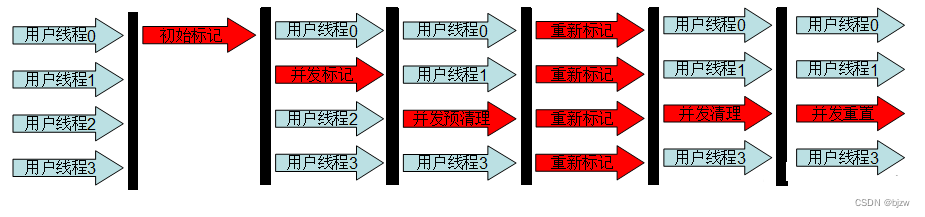

* 缺点
  * 并发阶段占用一部分线程，CMS 默认启动的回收线程数是（处理器核心数量 +3）/4
  * 并发标记和清理阶段，程序可能会有垃圾对象不断产生最终导致 Full GC
  * 为了支持并发标记和清理阶段程序运行，超过参数值 -XX：CMSInitiatingOccupancyFraction 后临时使用 Serial Old 收集器进行一次 Full GC
  * 基于标记-清除算法实现会有大量空间碎片产生，CMS 收集器不得不进行 Full GC 时开启内存碎片的合并整理过程，由于这个内存整理必须移动存活对象，因此无法并发执行。
* 应用场景
  * 关注服务的响应速度，希望系统停顿时间尽可能短，以给用户带来良好的交互体验。

* 三色标记（Tri-Color Marking）
  * 白色：对象没有被垃圾回收器访问过。在初始阶段，所有的对象都是白色的，在可达性分析后如果对象还是白色，则说明这个对象是不可达的，需要被回收。
  * 黑色：对象已经被垃圾回收器访问过，且这个对象所有的引用都已经被扫描过。黑色代表这个对象被扫描过，且是存活的，如果有其他对象引用指向黑色对象，则无需重新扫描。黑色对象不可直接指向某个白色对象。
  * 灰色：对象已经被垃圾收集器扫描过，但这个对象上还存在至少一个引用没有被扫描过。
  * 过程
    1. 初始状态: 只有GC Roots是黑色的。箭头的方向代表引用的方向。如下图：GC Roos引用一个对象。一个对象只有被黑色对象引用才能存活。

       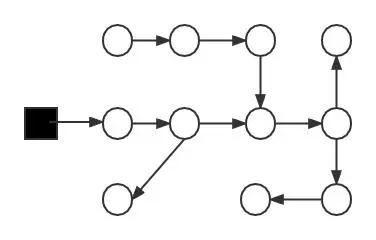 
    2. 扫描过程: 从GC Roots开始，沿着引用链不断扫描，灰色对象是黑色对象和白色对象的分界点。
       
       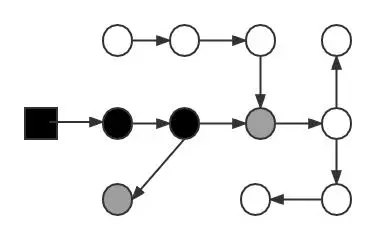
    3. 扫描完成：这时候黑色对象就是存活的对象，白色对象就是已经死亡的对象，需要被回收。
       
       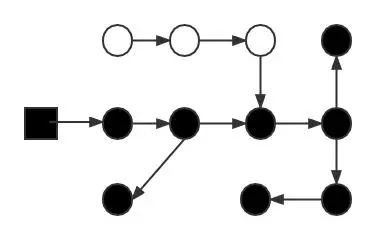
    4. 下图图展示了GC线程标记后用户线程又修改了引用关系：灰色对象1到白色对象3的引用被切断。同时已经扫描过的黑色对象2建立了和白色对象3的关系。这种情况非常危险，因为黑色对象2不会被重新扫描，导致实际存活的对象3被认为是死亡。
       
       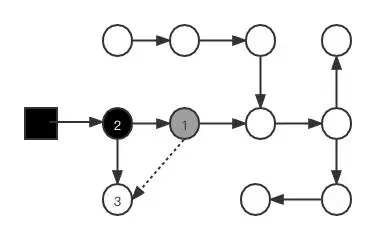
        * 当且仅当以下两个条件同时满足时，会产生“对象消失”的问题，即：应该是黑色的对象被误标记为白色。 
          * 赋值器插入了一条或多条从黑色对象到白色对象的新引用 
          * 赋值器删除了全部从灰色对象到该白色对象的直接或间接引用
        * 因此要解决并发标记时对象消失问题，只需要破坏这两个条件的任意一个即可。由此产生了两个方案：
          * 增量更新(Incremental Update)：破坏第一个条件。当黑色对象被插入指向白色对象的引用关系时，就将黑色对象记录下来，等并发标记结束之后，再以黑色对象为根重新扫描。也可以简单理解为：只要被插入指向白色对象的引用，黑色对象就变成了灰色对象。
          * 原始快照(Snapshot At The Begining)：破坏第二个条件。当灰色对象要删除指向白色对象的引用关系时，将这个引用关系记录下来。在并发标记结束之后，再以这些记录下来的引用关系中的灰色对象为根，重新扫描一次。可以简化理解为：在引用关系删除的那一刻，将引用关系以快照的方式存下来 ，之后再进行搜索。
        * CMS使用的是增量更新；G1使用的是原始快照。
1. 初始标记 
   * 初始标记阶段会触发stop the world，标记所有（1）GCRoots直接关联的对象，以及（2）年轻代对象对老年代对象的引用。这个阶段的速度很快，因为没有向下追溯，即只标记一层。 间接关联的在下一阶段。
     *（1）标记老年代中所有的GC Roots对象，如下图节点1；
     *（2）标记年轻代中活着的对象引用到的老年代的对象（指的是年轻带中还存活的引用类型对象，引用指向老年代中的对象）如下图节点2、3；
     
     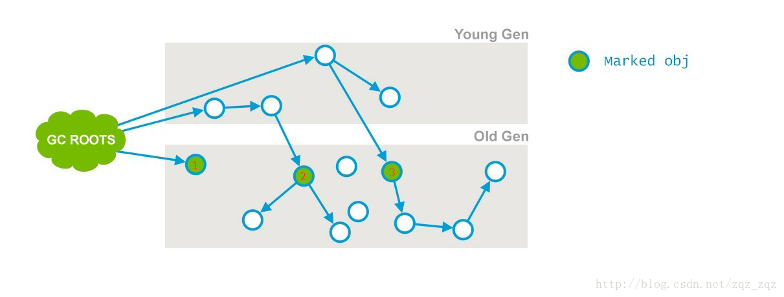
   * ps：为了加快此阶段处理速度，减少停顿时间，可以开启初始标记并行化，-XX:+CMSParallelInitialMarkEnabled，同时调大并行标记的线程数，线程数不要超过cpu的核数；
2. 并发标记
   * 与用户线程并发执行，会遍历上一阶段标记过的对象进行遍历，并将这些对象所有的引用进行标记。
     * 第一，第二阶段就是要将老年代，新生代的里面存活的对象找出来
     * 如下图，根据GCRoot节点1、2、3，最终标记了节点4和5。
     
       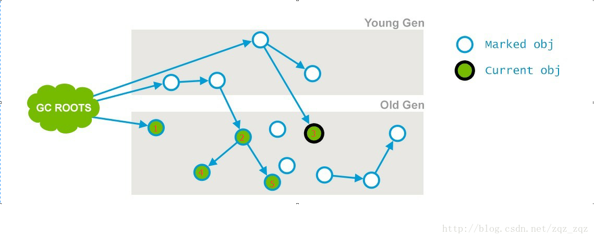
   * 不是老年代的所有存活对象都会被标记，因为标记的同时应用程序会改变一些对象的引用。如下所示对象在这阶段可能没被标记：
     1. 年轻代部分对象晋升至老年代 
        * 晋升到老年代的这些对象可能还被年轻代的对象引用，所以它们变成了GCRoot       -> 重新标记阶段处理
     2. 老年代对象引用发生变更 （一个GCRoot对象引用了另一个未标记的老年代对象，这个被引用的对象也是可达对象） -> 预清理阶段处理
     3. 还有一些大对象直接进入老年代。(新的GCRoot)   -> 重新标记阶段处理
   * 为了提高下一阶段重新标记的效率，该阶段会把上述对象所在的Card标识为Dirty，后续只需扫描这些Dirty Card的对象，避免扫描整个老年代；
   * 并发标记阶段只负责将引用发生改变的Card标记为Dirty状态，不负责处理；
     * card table（卡表）：将老年代空间分成若干card（通常一个card 128 byte）。记录每个card的状态的表叫卡表
       
       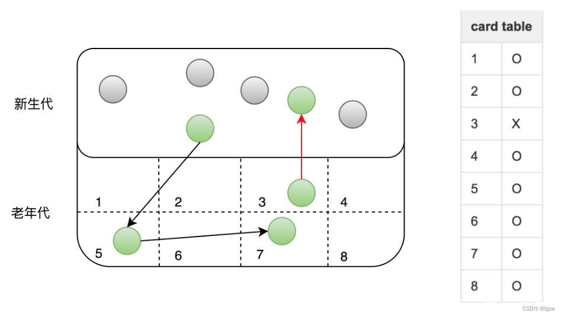
   * 如下图所示，在并发标记阶段，节点3的引用指向了6；则会把节点3所在的card标记为Dirty；
     
     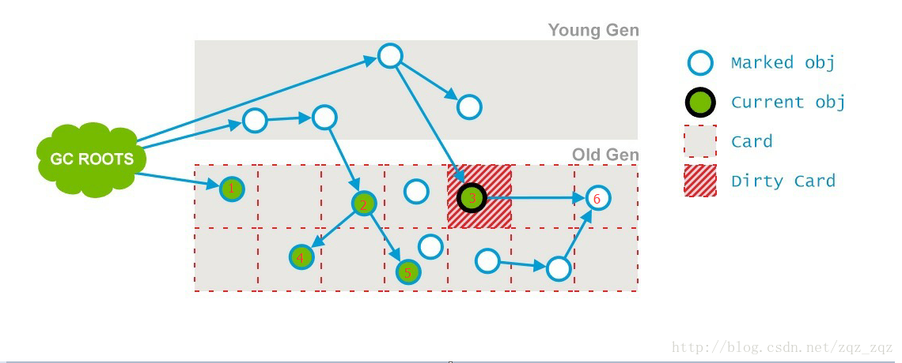

3. 预清理阶段
   * 这个阶段就是用来处理前一个阶段因为引用关系改变导致没有标记到的存活对象的，它会扫描所有标记为Direty的Card
     * 根据节点3所在的card，扫描节点3的引用，找到并标记节点6
       
       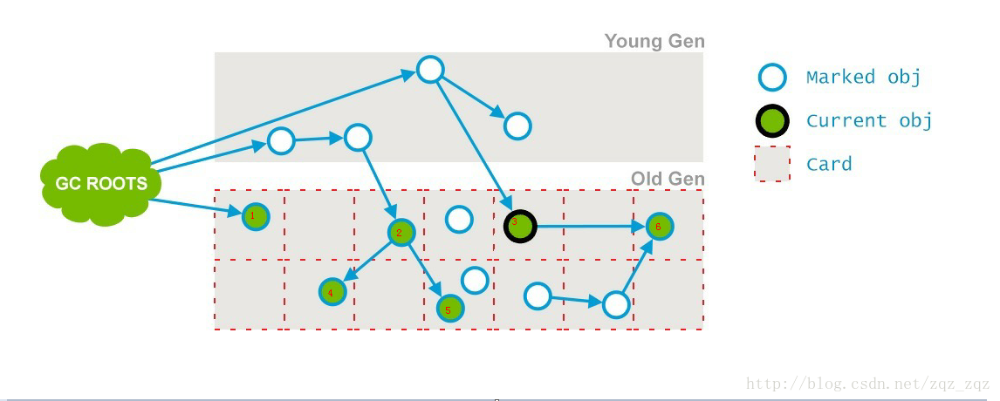

4. 重新标记
   * 这个阶段会导致第二次stop the word，该阶段的任务是完成标记整个年老代的所有的存活对象。
   * 这个阶段，重新标记的内存范围是整个堆，包含_young_gen和_old_gen。为什么要扫描新生代呢，因为对于老年代中的对象，如果被新生代中的对象引用，那么就会被视为存活对象，即使新生代的对象已经不可达了，也会使用这些不可达的对象当做cms的“gc root”，来扫描老年代
     * 可以加入参数-XX:+CMSScavengeBeforeRemark，在重新标记之前，先执行一次ygc，
   * 可以开启并行收集：-XX:+CMSParallelRemarkEnabled

5. 并发清理
   * 通过以上几个阶段的标记，老年代所有存活的对象已经被标记并且现在要通过Garbage Collector采用清扫的方式回收那些不能用的对象了。 这个阶段主要是清除那些没有标记的对象并且回收空间；
   * 由于CMS并发清理阶段用户线程还在运行着，伴随程序运行自然就还会有新的垃圾不断产生，这一部分垃圾出现在标记过程之后，CMS无法在当次收集中处理掉它们，只好留待下一次GC时再清理掉。这一部分垃圾就称为“浮动垃圾”。

6. 并发重置
   * 这个阶段并发执行，重新设置CMS算法内部的数据结构，准备下一个CMS生命周期的使用。

### G1 收集器
* G1 是一款主要面向服务端应用的垃圾收集器。
* 从整体来看是基于「标记-整理」算法实现的收集器，但从局部（两个 Region 之间）上看又是基于「标记-复制」算法实现
* "G1 即是新生代又是老年代收集器"，无需组合其他收集器。
* Region划分
  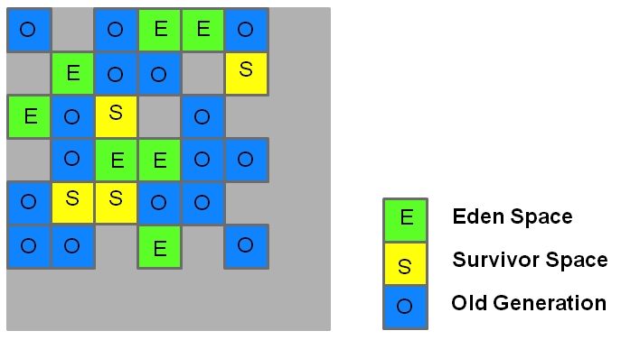
  * 对比较旧的垃圾收集器（Serial，Parallel，CMS）将堆分为三个部分：固定内存大小的年轻代，老年代和永久代 (元空间)
  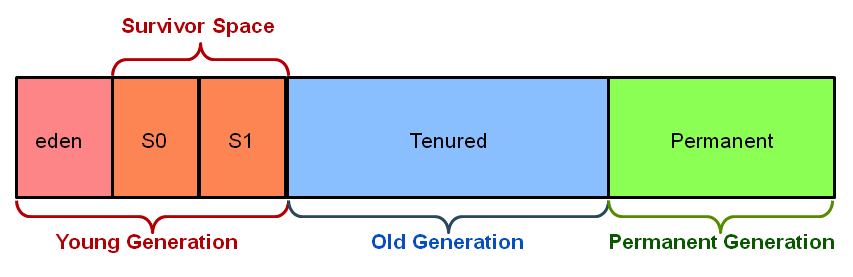
* 特性
  * Region 区域：把连续的 Java 堆划分为多个大小相等的独立 Region，每一个 Region 都可以根据需要，扮演新生代的 Eden 空间、Survivor 空间，或者老年代空间
  * Humongous 区域：专门用来存储大对象。只要大小超过了一个 Region 容量一半的对象即可判定为大对象。
  * 基于停顿时间模型：消耗在垃圾收集上的时间大概率不超过 N 毫秒的目标（使用参数-XX：MaxGCPauseMillis 指定，默认值是 200 毫秒）
  * Mixed GC 模式：可以面向堆内存任何部分来组成「回收集」进行回收，衡量标准不再是它属于哪个分代，而是哪块内存中存放的垃圾数量最多，回收收益最大
  * 无内存空间碎片：G1 算法实现意味着运作期间不会产生内存空间碎片
  
  ```
  每个 Region 的大小可以通过参数-XX：G1HeapRegionSize 设定，取值范围为 1MB～32MB，且应为 2 的 N 次幂。
  而对于那些超过了整个 Region 容量的超级大对象，将会被存放在 N 个连续的 Humongous Region 之中，
  G1 的大多数行为都把 Humongous Region 作为老年代的一部分来进行看待
  ```
* 大致实现步骤
  * 初始标记
    * 仅仅只是标记一下 GC Roots 能直接关联到的对象
    * 并且修改 TAMS 指针的值，让下一阶段用户线程并发运行时，能正确地在可用的 Region 中分配新对象
    * 需要「Stop The World」，但耗时很短，而且是借用进行 Minor GC 的时候同步完成的。
  * 并发标记
    * 从 GC Root 开始对堆中对象进行可达性分析，递归扫描整个堆里的对象图,找出要回收的对象
    * 这阶段耗时较长，但可与用户程序并发执行
    * 当对象图扫描完成以后，还要重新处理 SATB 记录下的在并发时有引用变动的对象。
  * 最终标记
    * 对用户线程做另一个短暂的暂停，用于处理并发阶段结束后仍遗留下来的最后那少量的 SATB 记录。
  * 筛选回收
    * 负责更新 Region 的统计数据，对各个 Region 的回收价值和成本进行排序
    * 根据用户所期望的停顿时间来制定回收计划
    * 可以自由选择任意多个 Region 构成回收集，然后把决定回收的那一部分 Region 的存活对象复制到空的 Region 中
    * 再清理掉整个旧 Region 的全部空间。需要「Stop The World」，多条收集器线程并行完成。
  ```
  TAMS 指针/SATB 记录的概念请阅读《深入理解 Java 虚拟机：JVM 高级特性与最佳实践（第 3 版）》周志明， 3.4.6、3.5.7 内容。

  TAMS 指针简单理解为：G1 为每一个 Region 设计了两个名为 TAMS（Top at Mark Start）的指针，
       把 Region 中的一部分空间划分出来用于并发回收过程中的新对象分配，并发回收时新分配的对象地址都必须要在这两个指针位置以上
  SATB 记录简单理解为：解决并发扫描时对象的消失问题
  ```
* G1 缺点
  * G1 内存占用比 CMS 高，每个 Region 维护一个卡表
  * G1 额外执行负载比 CMS 高，维护卡表的额外操作复杂
* G1 应用场景
  * G1 的首要重点是为运行需要大堆且 GC 延迟有限的应用程序的用户提供解决方案。
  * 这意味着堆大小约为 6 GB 或更大，并且稳定且可预测的暂停时间低于 0.5 秒。
  * 如果应用程序具有以下一个或多个特征，那么今天运行 CMS 或并行压缩的应用程序将从切换到 G1 中受益。
    * 超过 50％的 Java 堆被实时数据占用。
    * 对象分配率或提升率差异很大。
    * 应用程序希望暂停时间低于 0.5 秒。
* G1 最佳实践
  * 不要设置年轻代的大小
    * 如果通过 -Xmn 显式地指定了年轻代的大小, 则会干扰到 G1 收集器的默认行为。
    * G1 在垃圾收集时将不再关心暂停时间指标。所以从本质上说，设置年轻代的大小将禁用暂停时间目标。
    * G1 在必要时也不能够增加或者缩小年轻代的空间。 因为大小是固定的，所以对更改大小无能为力。
  * 响应时间指标
    * 设置 XX:MaxGCPauseMillis=N 时不应该使用平均响应时间 (ART, average response time) 作为指标
    * 而应该考虑使用目标时间的 90% 或者以上作为响应时间指标,也就是说 90% 的用户请求响应时间不会超过预设的目标值。
    * 暂停时间只是一个目标，并不能保证总是满足。
  * 什么是转移失败 (Evacuation Failure)?
    * 对 Survivors 或晋升对象进行 GC 时如果 JVM 的 Heap 区不足就会发生提升失败。堆内存不能继续扩充，因为已经达到最大值了。
    * 当使用 -XX:+PrintGCDetails 时将会在 GC 日志中显示 to-space overflow。
    * 避免转移失败
      * 增加堆内存大小
      * 增加空闲空间的预留内存百分比 -XX:G1ReservePercent=n，默认值是 10%
      * 更早启动标记周期，通过减少 -XX:InitiatingHeapOccupancyPercent 提前启动标记周期。
      * 增加标记线程的数量 -XX:ConcGCThreads=n

### 收集器运行示意图
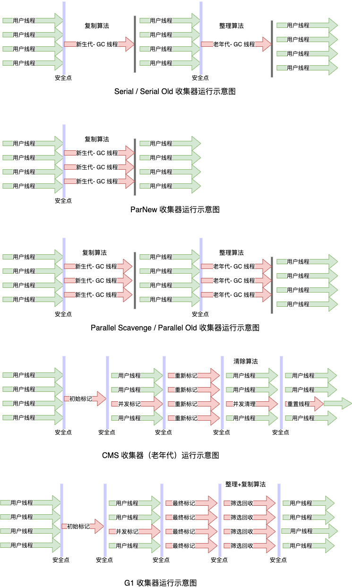

* JDK9 前，我们会在 CMS 和 G1 间选择，对于大概 4GB 到 6GB 以下的堆内存，CMS 一般能处理得比较好，而对于更大的堆内存，可重点考察一下 G1


### Shenandoah收集器
* RedHat 公司独立发展的新型收集器项目，在 2014 年 RedHat 把 Shenandoah 贡献给了 OpenJDK，并推动它成为 OpenJDK 12 (opens new window)的正式特性之一
* 目标是实现一种能在任何堆内存大小下都可以把垃圾收集的停顿时间限制在「十毫秒」以内的垃圾收集器。
#### 与 G1 的关系
  * Shenandoah 像是 G1 的下一代继承者，它们两者有着相似的堆内存布局，在初始标记、并发标记等许多阶段的处理思路上都高度一致。
  * 相比较G1将低停顿做到了百毫秒级别，Shenandoah的设计目标是将停顿压缩到10ms级别，且与堆大小无关。它的设计非常激进，很多设计点在权衡上更倾向于低停顿，而不是高吞吐。
  * 它与 G1 至少有三个明显的不同之处：
    * 支持并发的整理算法，G1 的回收阶段是可以多线程并行的，但却不能与用户线程并发
    * 默认不使用分代收集，不会有专门的新生代 Region 或者老年代 Region 的存在，没有实现分代
    * 摒弃了在 G1 中耗费大量内存和计算资源去维护的记忆集，改用名为「连接矩阵」（Connection Matrix）的全局数据结构来记录跨 Region 的引用关系，降低了处理跨代指针时的记忆集维护消耗，也降低了伪共享问题
      * 使用名为连接矩阵的全局数据结构记录跨Region引用关系，G1使用哈希表的局部数据结构记录跨Region引用关系。

#### 工作过程
* 名词解释
  * Collection Set：回收集
  * Immediate Garbage Region：一个存活对象都没有找到的 Region
1. 初始标记（Initial Marking）
   * 与 G1 一样，首先标记与 GC Roots 直接关联的对象，停顿时间与堆大小无关，只与 GC Roots 的数量相关。
   * 第一个「Stop The World」
2. 并发标记（Concurrent Marking）
   * 与 G1 一样，遍历对象图，标记出全部可达的对象
   * 这个阶段是与用户线程一起并发的，时间长短取决于堆中存活对象的数量以及对象图的结构复杂程度
   * 由于应用程序可以在此阶段自由分配新数据，因此在并发标记期间堆占用率会上升。
3. 最终标记（Final Marking）
   * 与 G1 一样，处理剩余的 SATB 扫描，并在这个阶段统计出回收价值最高的 Region，将这些 Region 构成一组回收集。
   * 第二个「Stop The World」（短暂的停顿）。
4. 并发清理（Concurrent Cleanup）
   * 这个阶段用于清理「一个存活对象都没有找到的 Region」。
5. 并发疏散（Concurrent Evacuation）
   * 将回收集里面的存活对象先复制一份到其他未被使用的 Region 之中。
   * 并发疏散阶段运行的时间长短取决于回收集的大小。
   * 并发进行时，复制对象动作通过读屏障和被称为「Brooks Pointers」的转发指针来解决。
   * 转发指针：在原有对象布局结构的最前面统一增加一个新的引用字段，在正常不处于并发移动的情况下，该引用指向对象自己。
6. 初始引用更新（Initial Update Reference）
   * 并发疏散阶段复制对象结束后，还需要把堆中所有指向旧对象的引用修正到复制后的新地址，这个操作称为引用更新。
   * 引用更新的初始化阶段实际上并未做什么具体的处理，设立这个阶段只是为了建立一个线程集合点，确保所有并发疏散阶段中进行的收集器线程都已完成分配给它们的对象移动任务而已。
   * 第三个「Stop The World」（短暂的停顿）。
7. 并发引用更新（Concurrent Update Reference）
   * 真正开始进行引用更新操作，这个阶段是与用户线程一起并发的，时间长短取决于内存中涉及的引用数量的多少。
   * 并发引用更新与并发标记不同，它不再需要沿着对象图来搜索，只需要按照内存物理地址的顺序，线性地搜索出引用类型，把旧值改为新值即可。
8. 最终引用更新（Final Update Reference）
   * 解决了堆中的引用更新后，还要修正存在于 GC Roots 中的引用。
   * 第四个「Stop The World」，停顿时间只与 GC Roots 的数量相关
9. 并发清理（Concurrent Cleanup）
   * 经过并发疏散和引用更新之后，整个回收集中所有的 Region 已再无存活对象，这些 Region 都变成 Immediate Garbage Regions 了
   * 最后再调用一次并发清理过程来回收这些 Region 的内存空间，供以后新对象分配使用。

* 关键步骤示意图
  

#### 转发指针
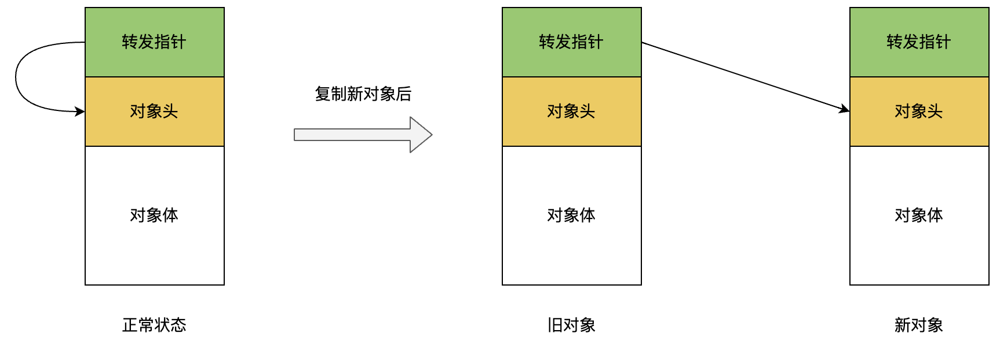
* 转发指针的性能优势
  ```
  想要达到并发回收，就需要在用户线程运行的同时，将存活对象逐步复制到空的Region中，
  这个过程中就会在堆中同时存在新旧两个对象。那么如何让用户线程访问到新对象呢？
  在对象头前面增加一个新的引用字段，在非并发移动情况下指向自己，产生新对象后指向新对象。
  那么当访问对象的时候，都需要先访问转发指针看看其指向哪里。
  ```
* 转发指针的问题
  * 转发指针主要存在两个问题：修改时的线程安全问题和高频访问的性能问题 
  1. 对象体增加了一个转发指针，这个指针的修改和对象本身的修改就存在了线程安全问题。
     * 如果发生复制了新对象后，在修改旧对象的转发指针之前发生了旧对象内容的修改，这就存在两个对象不一致的问题了。
     * 对于这个问题，Shenandoah是通过CAS操作来保证复制新对象和修改旧对象的转发指针为原子操作。
  2. 转发指针的加入需要覆盖所有对象访问的场景，包括读、写、加锁等等
     * 所以需要同时设置读屏障和写屏障。
     * 尤其读操作相比单纯写操作出现频率更高，这样高频操作带来的性能问题影响巨大。
     * 所以Shenandoah在JDK13中对此进行了优化，将内存屏障模型改为引用访问屏障
     * 也就是说，仅仅在对象中引用类型的读写操作增加屏障，而不去管原生对象的操作，这就省去了大量的对象访问操作。

#### 连接矩阵（Connection Matrix）
* G1中每个Region都要维护卡表，既耗费计算资源还占据了非常大的内存空间，Shenandoah使用了连接矩阵来优化了这个问题。
* 连接矩阵可以简单理解为一个二维表格，如果Region A中有对象指向Region B中的对象，那么就在表格的第A行第B列打上标记。
* 比如，Region 1指向Region 3，Region 4指向Region 2，Region 3指向Region 5：
  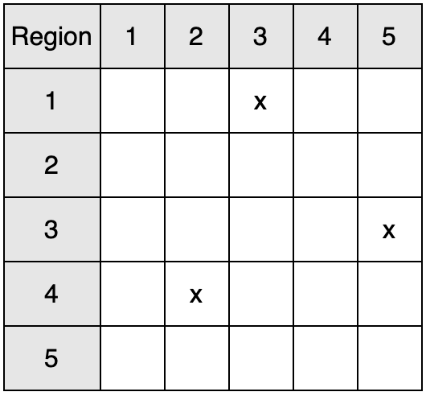

### ZGC 收集器
* Oracle官方研发并JDK11中引入，并于JDK15中作为生产就绪使用，其设计之初定义了三大目标：
  1. 支持TB级内存
  2. 停顿控制在10ms以内，且不随堆大小增加而增加
  3. 对程序吞吐量影响小于15%
* 随着JDK的迭代，目前JDK16及以上版本，ZGC已经可以实现不超过1毫秒的停顿，适用于堆大小在8MB到16TB之间。
* 主要特征
  * 基于Region内存布局
  * 不设分代
  * 使用了读屏障, 染色指针和内存多重映射等技术来实现可并发的标记-整理算法
  * 以低延迟为首要目标
* ZGC的Region分为三种：
  1. 小型Region容量固定为2MB，用于存放小于256KB的对象。
  2. 中型Region容量固定为32MB，用于存放大于等于256KB但不足4MB的对象。
  3. 大型Region容量为2MB的整数倍，存放4MB及以上大小的对象，而且每个大型Region中只存放一个大对象。由于大对象移动代价过大，所以该对象不会被重分配。
  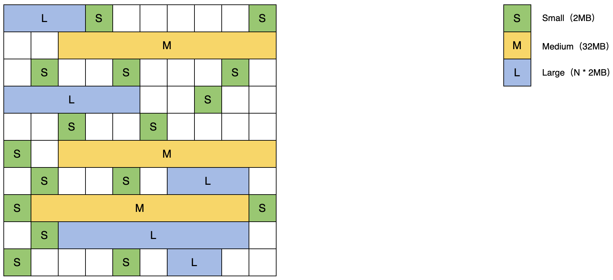
* Relocation Set：重分配集
  * G1中的回收集用来存放所有需要G1扫描的Region，而ZGC为了省去卡表的维护，标记过程会扫描所有Region，如果判定某个Region中的存活对象需要被重分配，那么就将该Region放入重分配集中。
* 染色指针技术
  * 在64位系统中, 理论可以访问的内存高达16EB。实际上基于需求, 性能, 和成本考虑, 在AMD64架构中只支持到52位(4PB)的地址总线和48位(256TB)的虚拟地址空间, 目前64位的硬件实际能够支持的最大内存只有256TB。此外操作系统还有自己的约束, 64Linux系统分别支持47位(128TB)的进程虚拟地址和46位(64TB)的物理地址空间, 64位的Windows系统只支持44位(16TB)的物理地址空间。
  * 虽然Linux下64位指针的高18位不能用来寻址, 剩余的46位指针所能支持的64TB内存在今天仍能够充分满足大型服务器需要。
  * 而ZGC则利用了剩下的46位指针的高4位提取出来用于存储四个标志信息。
  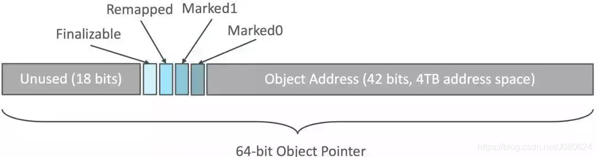
  ```
    6                 4 4 4  4 4                                             0
    3                 7 6 5  2 1                                             0
    +-------------------+-+----+-----------------------------------------------+
    |00000000 00000000 0|0|1111|11 11111111 11111111 11111111 11111111 11111111|
    +-------------------+-+----+-----------------------------------------------+
    |                   | |    |
    |                   | |    * 41-0 Object Offset (42-bits, 4TB address space)
    |                   | |
    |                   | * 45-42 Metadata Bits (4-bits)  0001 = Marked0
    |                   |                                 0010 = Marked1
    |                   |                                 0100 = Remapped
    |                   |                                 1000 = Finalizable
    |                   |
    |                   * 46-46 Unused (1-bit, always zero)
    |
    * 63-47 Fixed (17-bits, always zero)
  ```
    * 通过这些标志位, 虚拟机可以直接从指针中看到其引用对象的状态, 是否进入重分配集, 是否通过finalize()方法才能被访问到。
      * Finalizable 标识表示对象是否只能通过finalize()方法访问到
      * Remapped、Marked0和Marked1用作三色标记， Remapped为1表示指向的对象要进行重新分配扫描
      * 为什么有了Marked0,还要有Marked1呢？
        * 因为ZGC标记完成后并不需要等待对象指针重映射就可以进行下一次垃圾回收循环，也就是说两次垃圾回收的全过程是有重叠的，所以使用两个标记位分别用作两次相邻GC过程的标记，Marked0和Marked1交替使用
    * 由于进一步压缩了原本只有46位的地址空间, ZGC能够管理的内存不可以超过4TB (42位地址空间)。
  * 三大优势
    * 染色指针可以使得一旦某个Region的存活对象被移走之后, 此Region立即就能够被释放和重用掉,而不必等待整个堆中所有指向该Region的引用都被修正后才能清理。
    * 染色指针可以大幅减少在垃圾收集过程中内存屏障的使用数量。
    * 染色指针可以作为一种可扩展的存储结构用来记录更多与对象标记、重定位过程相关的数据, 以便日后进一步提高性能。
  * 染色指针只是JVM定义的，操作系统、处理器未必支持。为了解决这个问题，ZGC在Linux/x86-64平台上采用了使用了多重映射(Multi-Mapping)虚拟内存映射技术。
    * ZGC为每个对象都创建了三个虚拟内存地址，分别对应Remapped、Marked 0和Marked 1，通过指针指向不同的虚拟内存地址来表示不同的染色标记。 
    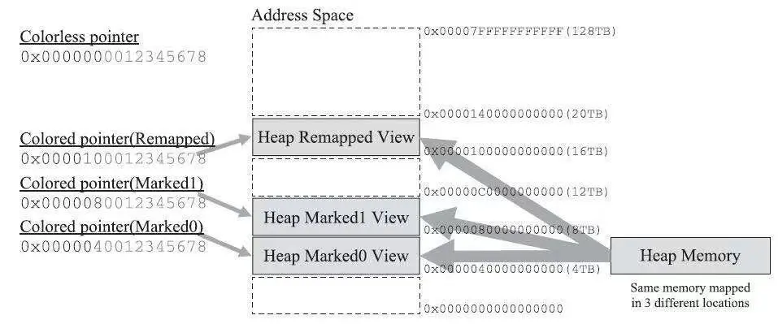
    * 任何的进程在进程自己看来自己的内存空间都是连续的, 但是计算机实际的物理内存并不是与该进程的内存是一一对应的。碎片化的物理内存可以映射成一个完整的虚拟内存, 同时应用可以申请比物理内存大的内存, 使得多个内存互不干扰, 使编译好的二进制文件的地址统一化......
  * 染色指针的在GC过程中的作用
    1. 第一次标记开始时所有的指针都处于Remapped状态
    2. 从GC Root开始，顺着对象图遍历扫描，存活对象标记为Marked0
    3. 标记完成后，开始进行并发重分配。最终目标是将存活对象都移动到新的Region中去。
    4. 在新的Region中复制的新对象的指针就可以由M0改为Remapped，并将旧对象到新对象到映射关系保存到转发表中。
    5. 下次标记就标记Marked1，这样每轮标记交替的使用Marked0和Marked1
* 读屏障
  * ZGC使用了读屏障来完成指针的“自愈”，由于ZGC目前没有分代，且ZGC通过扫描所有Region来省去卡表使用，所以ZGC并没有写屏障，这成为ZGC一大性能优势。
* NUMA
  * 多核CPU同时操作内存就会发生争抢，现代CPU把内存控制系统器集成到处理器内核中，每个CPU核心都有属于自己的本地内存。
  * 在NUMA架构下，ZGC会有现在自己的本地内存上分配对象，避免了内存使用的竞争。
  * 在ZGC之前，只有Parallel Scavenge支持NUMA内存分配。
  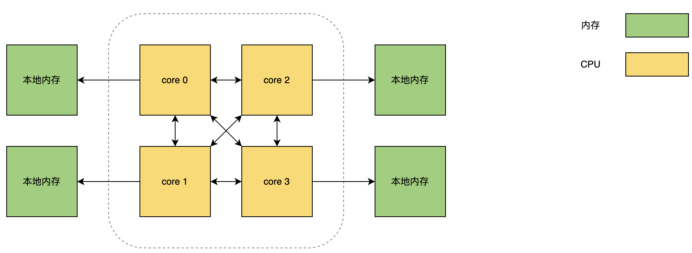
* ZGC运作过程
  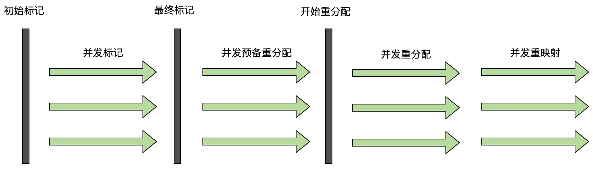
  * Concurrent Mark(并发标记)
    * 遍历对象图做可达性分析的阶段, 前后也要经过类似于G1, Shenandoah 的初始标记, 最终标记的短暂停顿。
    * 与G1, Shenandoah不同的是, ZGC的标记是在指针上而不是在对象上进行的, 标记阶段会更新染色指针中的Marked0、Marked1标志位。
    * 访问对象时，如果对象地址视图是 Remapped，就把对象地址视图切换到 Marked0，如果对象地址视图已经是 Marked0/Marked1，说明已经被其他标记线程访问过了，跳过不处理。
    * 标记过程中用户线程新创建的对象会直接进入 Marked0/Marked1 视图。
    * 标记过程中用户线程访问对象时，如果对象的地址视图是 Remapped，就把对象地址视图切换到 Marked0/Marked1。
    * 标记结束后，如果对象地址视图是 Marked0/Marked1，那就是活跃的，如果对象地址视图是 Remapped，那就是不活跃的。
  * Concurrent Prepare for Relocate(并发预备重分配)
    * 此阶段ZGC会扫描所有Region, 需要根据特定的查询条件统计出本次收集过程要清理哪些Region, 将这些Region组成重分配集(Relocation Set)。
    * 注意区分和G1中的回收集（Collection Set ）的区别。
    * ZGC每次都会扫描所有的Region，用范围更大的扫描成本换取省去G1中记忆集的维护成本。
    * 此外，JDK12后ZGC的类卸载和弱引用的处理也在这个阶段。
  * Concurrent Relocate(并发重分配)
    * 是ZGC执行过程中的核心阶段, 此过程要把重分配集中的存活对象复制到新的Region上
    * 并为重分配集中的每个Region维护一个转发表(Forward Table), 记录从旧对象到新对象的转向关系。
    * 由于染色指针的存在, ZGC能仅从引用上就明确得知一个对象是否处于重分配集之中。
      ```
      如果用户线程此时并发访问了位于重分配集中的对象, 这次访问将会被预置的内存屏障截获, 
      然后立即根据Region上的转发表记录将访问转发到新复制的对象上, 并同时修正该引用的值, 
      使其直接指向新对象, 此即为Self-Healing(自愈)[只有第一次访问旧对象会陷入转发]。
      (Shenandoah的转发指针每次都要转发)
      另一个好处是，如果一个Region中所有对象都复制完毕了，该Region就可以被回收了，只要保留转发表即可。
      ```
  * Concurrent Remap(并发重映射)
    * 修正整个堆中指向重分配集中旧对象的所有引用。
    * 重映射清理这些旧引用的主要目的是为了不变慢, 并不是很迫切。
    * ZGC将并发重映射阶段要做的工作, 合并到了下一次垃圾收集循环中的并发标记阶段里去完成, 从而节省了一次遍历对象图的开销。
    * 并发重映射阶段会把所有引用修正,并删除转发表的记录。 
## Finalize
1. 第一次标记
   * 对象在进行可达性分析后发现没有与 GC Roots 相连接的引用链，那它将会被第一次标记。 
2. 第二次标记
   * 假如对象没有覆盖 finalize 方法，或者 finalize 方法已经被虚拟机调用过，那么不执行 finalize 方法。 如果有必要执行 finalize 方法，那么该对象将会被放置在一个名为 F-Queue 的队列之中，并在稍后由一条由虚拟机自动建立的、低调度优先级的 Finalizer 线程去执行它们的 finalize 方法。
   * finalize 方法是对象逃脱死亡命运的最后一次机会，稍后收集器将对 F-Queue 中的对象进行第二次小规模的标记，如果对象要在 finalize 中成功拯救自己，只要重新与引用链上的任何一个对象建立关联即可。 如果对象这时候还没有逃脱，那基本上它就真的要被回收了。
   * 这里所说的「执行 finalize 方法」是指虚拟机会触发这个方法开始运行，但并不承诺一定会等待它运行结束。这样做的原因是，如果某个对象的 finalize 方法执行缓慢，或者更极端地发生了死循环，将很可能导致 F-Queue 队列中的其他对象永久处于等待，甚至导致整个内存回收子系统的崩溃。


