# JVM memory
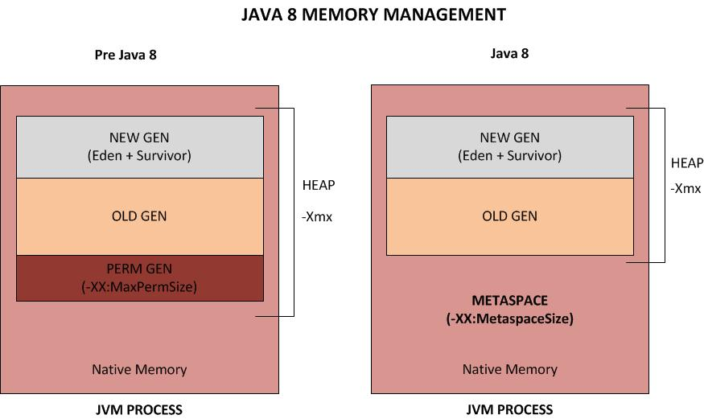
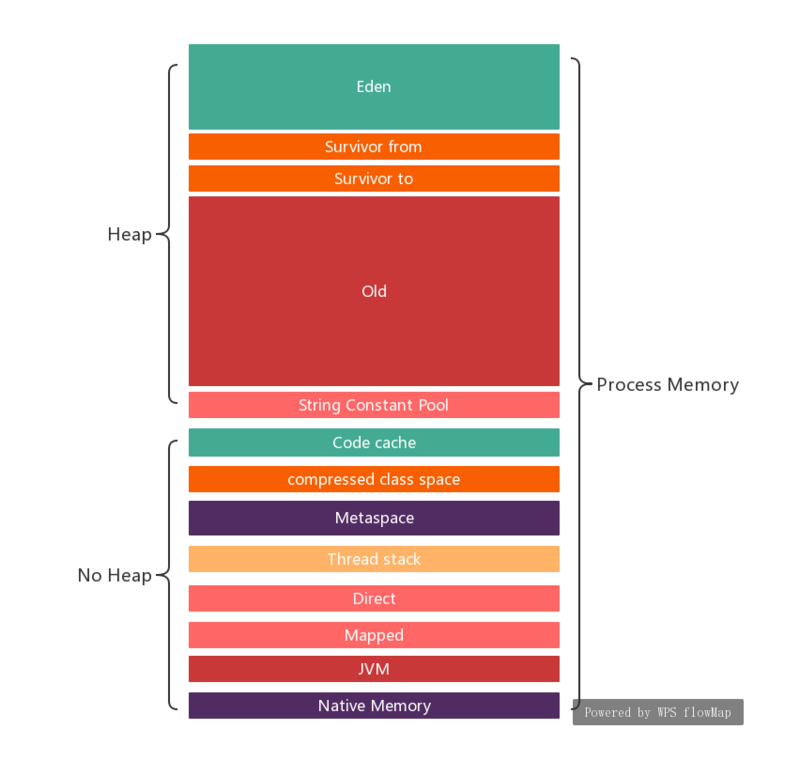
## Non-heap
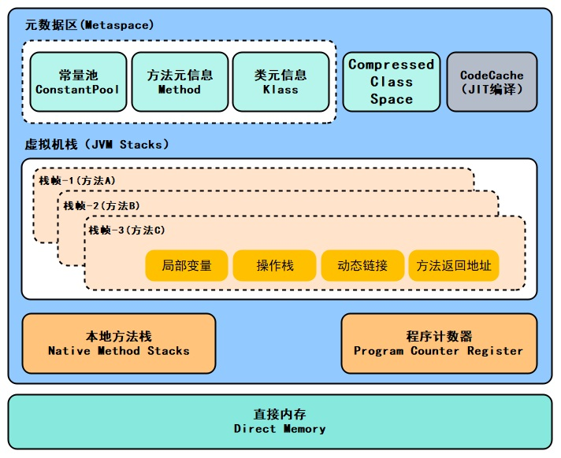
### Metaspace
```
JAVA8以后使用Metaspace替代了PermGen(永久代)，将元数据移动到了非堆内存中。
当一个类被加载时，它的类加载器会负责在 Metaspace 中分配空间用于存放这个类的元数据
只有当这个类加载器加载的所有类都没有存活的对象，并且没有到达这些类和类加载器的引用时，相应的 Metaspace 空间才会被 GC 释放
释放 Metaspace 的空间，并不意味着将这部分空间还给系统内存，这部分空间通常会被 JVM 保留下来
Metaspace 可能在两种情况下触发 GC：Metaspace需要扩容时、达到MaxMetaspaceSize时，所以通常把-XX:MetaspaceSize和-XX:MaxMetaspaceSize设置为相同的值（Metaspace默认大小只有21MB）
```
* 元空间不再与堆连续，而且是存在于本地内存（Native memory）
* 默认情况下元空间是可以无限使用本地内存的，但为了不让它如此膨胀，JVM同样提供了参数来限制它使用的使用
  * -XX:MetaspaceSize，class metadata的初始空间配额，以bytes为单位，达到该值就会触发垃圾收集进行类型卸载，同时GC会对该值进行调整：如果释放了大量的空间，就适当的降低该值；如果释放了很少的空间，那么在不超过MaxMetaspaceSize（如果设置了的话），适当的提高该值。
  * -XX：MaxMetaspaceSize，可以为class metadata分配的最大空间。默认是没有限制的
  * -XX：MinMetaspaceFreeRatio，在GC之后，最小的Metaspace剩余空间容量的百分比，减少为class metadata分配空间导致的垃圾收集。
  * -XX:MaxMetaspaceFreeRatio,在GC之后，最大的Metaspace剩余空间容量的百分比，减少为class metadata释放空间导致的垃圾收集。
* 字符串常量池
  * 字符串常量池原本存放于方法区，jdk7开始放置于堆中, jdk8移到元空间（metaspace）
  * 字符串常量池存储的是string对象的直接引用，而不是直接存放的对象，是一张string table
* 静态变量
  * 静态变量是有static修饰的变量，jdk7时从方法区迁移至堆中，jdk8移到元空间（metaspace）

### Code Cache

### Compressed Class Space

### Thread stack

### Program counter register

### Directly memory
  ```
  NIO(New Input/Output)类，引入了一种基于通道（Channel）与缓冲区（Buffer）的 I/O 方式，它可以使用 native 函数库直接分配堆外内存，
  然后通过一个存储在Java堆中的 DirectByteBuffer 对象作为这块内存的引用进行操作
  可以帮助JAVA实现零拷贝
  默认大小为堆内存大小，可通过-XX:MaxDirectMemorySize设置
  不会被GC，使用时要注意释放
  ```
  * NIO: ByteBuffer.allocateDirect

### Mapped

### JVM

### Native memory

## Reserved-Memory(保留内存)与Committed-Memory(提交内存)
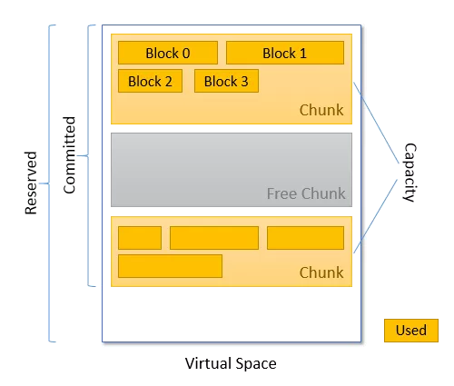
* heap Xms设置的内存启动后会先commit，加快后续的使用；如果Xms和Xmx设置成一样，所有的heap都会在启动阶段就commit
* reserve ---> commit ---> capacity ---> use
  ```
  reserved
  reserved memory 是指JVM 通过mmaped PROT_NONE 申请的虚拟地址空间，在页表中已经存在了记录(entries)，说白了，就是已分配的大小
  在堆内存下，就是xmx值，jvm申请的最大保留内存。
  
  committed
  committed memory 是JVM向操做系统实际分配的内存(malloc/mmap),mmaped PROT_READ | PROT_WRITE，相当于程序实际申请的可用内存。
  在堆内存下，当xms没有扩容时就是xms值，最小堆内存，扩容后就是扩容后的值，heap committed memory。
  注意，committed申请的内存并不是说直接占用了物理内存，由于操作系统的内存管理是惰性的，对于已申请的内存虽然会分配地址空间，但并不会直接占用物理内存，
  真正使用的时候才会映射到实际的物理内存。所以committed > resident也是很可能的
  
  当Java程序启动后，会根据Xmx为堆预申请一块保留内存，并不会直接使用，也不会占用物理内存
  然后申请(malloc之类的方法)Xms大小的虚拟内存，但是由于操作系统的内存管理是惰性的，有一个内存延迟分配的概念。malloc虽然会分配内存地址空间，
  但是并没有映射到实际的物理内存，只有当对该地址空间赋值时，才会真正的占用物理内存，才会影响RES的大小。
  所以可能会出现进程所用内存大于当前堆+非堆的情况。 
  
  比如说该Java程序在5分钟前，有一定活动，占用了2.6G堆内存(无论堆中的什么代)，经过GC之后，虽然堆内存已经被回收了，堆占用很低，
  但GC的回收只是针对Jvm申请的这块内存区域，并不会调用操作系统释放内存。所以该进程的内存并不会释放，这时就会出现进程内存远远大于堆+非堆的情况。
  
  Metaspace由一个或多个虚拟空间组成，虚拟空间的分配单元是Chunk，其中Chunk使用列表进行维护。

  当使用一个classLoader加载一个类时，过程如下：
  1、当前classLoader是否有对应的Chunk且有足够的空间。
  2、查找空闲列表中的有没有空闲的Chunk。
  3、如果没有，就从当前虚拟空间中分配一个新的Chunk，这个时候会把对应的内存进行Commit，这个动作就是提交。
  4、如果当前虚拟空间不足，则预留(reserves)一个新的虚拟空间。

  reserved是jvm启动时根据参数和操作系统预留的内存大小。
  committed是指那些被commit的Chunk大小之和；
  capacity是指那些被实际分配的Chunk大小之和；
  因为有GC的存在，有些Chunk的数据可能会被回收，那么这些Chunk属于committe的一部分，但不属于capacity
  另外，这些被分配的Chunk，基本很难被100%用完，存在碎片内存的情况，这些Chunk实际被使用的内存之和即used的大小；
  ``` 

## Heap
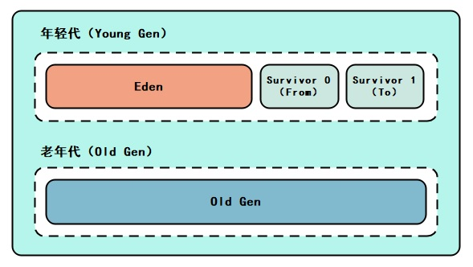
```
堆是Java 虚拟机所管理的内存中最大的一块，默认为物理内存1/4大小
堆是被所有线程共享的区域，在虚拟机启动时创建
堆里面存放的都是对象的实例（new 出来的对象都存在堆中）
我们平常所说的垃圾回收，主要回收的就是堆区
默认的，新生代 ( Young ) 与老年代 ( Old ) 的比例的值为 1:2
默认的，Eden : From : To = 8 : 1 : 1 ( 可以通过参数 –XX:SurvivorRatio 来设定 )
```
* 对象实例
  * 类初始化生成的对象
  * 基本数据类型的数组也是对象实例
  * Class类对象
* 栈上分配
  ```
  针对那些作用域不会逃逸出方法的对象（逃逸分析），在分配内存时不在将对象分配在堆内存中，而是将对象属性打散(成基本类型)后分配在栈（线程私有的，属于栈内存）上，
  这样，随着方法的调用结束，栈空间的回收就会随着将栈上分配的打散后的对象回收掉，不再给gc增加额外的无用负担，从而提升应用程序整体的性能
  
  -XX:＋DoEscapeAnalysis  启动逃逸分析
  -XX:+EliminateAllocations  启用标量替换，允许对象打散分配到栈上
  ```
* 线程分配缓冲区（Thread Local Allocation Buffer）
  ```
  Thread Local Allocation Buffer （TLAB，线程本地分配缓冲区）
  占用 Eden 区（缺省 Eden 的1%），默认开启，线程私有
  优化多线程堆空间分配对象指针碰撞问题
  
  在Java程序中很多对象都是小对象且用过即丢，它们不存在线程共享也适合被快速GC，所以对于小对象通常JVM会优先分配在TLAB上，
  并且TLAB上的分配由于是线程私有所以没有锁开销。因此在实践中分配多个小对象的效率通常比分配一个大对象的效率要高。
 
  如果开启栈上分配，JVM会先进行栈上分配，如果没有开启栈上分配或则不符合条件的则会进行TLAB分配，
  如果TLAB分配不成功，再尝试在eden区分配，如果对象满足了直接进入老年代的条件，那就直接分配在老年代。
  
  过程：
  1. 编译器通过逃逸分析，确定对象是在栈上分配还是在堆上分配。如果是在堆上分配，则进入选项2. 
  2. 如果tlab_top + size <= tlab_end，则在在TLAB上直接分配对象并增加tlab_top 的值，如果现有的TLAB不足以存放当前对象则3.
  3. 重新申请一个TLAB，并再次尝试存放当前对象。如果放不下，则4.
  4. 在Eden区加锁（这个区是多线程共享的），如果eden_top + size <= eden_end则将对象存放在Eden区，增加eden_top 的值，如果Eden区不足以存放，则5.
  5. 执行一次Young GC（minor collection）。
  6. 经过Young GC之后，如果Eden区任然不足以存放当前对象，则直接分配到老年代。
  
  TLAB例子：
  一个100KB的TLAB区域，如果已经使用了80KB，当需要分配一个30KB的对象时，TLAB是如何分配的呢？
  此时，虚拟机有两种选择：第一，废弃当前的TLAB（会浪费20KB的空间）；
  第二，将这个30KB的对象直接分配到堆上，保留当前TLAB（当有小于20KB的对象请求TLAB分配时可以直接使用该TLAB区域）。
  JVM选择的策略是：在虚拟机内部维护一个叫refill_waste的值，当请求对象大于refill_waste时，会选择在堆中分配，
  反之，则会废弃当前TLAB，新建TLAB来分配新对象。
  【默认情况下，TLAB和refill_waste都是会在运行时不断调整的，使系统的运行状态达到最优。】
  
  -XX:+UseTLAB  启用TLAB   默认启用
  -XX:TLABRefillWasteFraction  设置允许空间浪费比例  默认值64 即用1/64的TLAB空间大小作为refill_waste
  -XX:+ResizeTLAB  启用系统自动调整TLAB的大小
  -XX:TLABSize     指定TLAB大小  单位byte
  ```
  * 线程私有，但是不影响java堆的共性
  * 增加线程分配缓冲区是为了提升对象分配时的效率

```
常见调优参数
参数名称	含义	默认值	说明
-Xms	初始堆大小    物理内存的1/64  默认空余堆内存小于40%时(MinHeapFreeRatio)，堆增大到-Xmx的值
-Xmx	最大堆大小	物理内存的1/4	  默认空余堆内存大于70%时(MaxHeapFreeRatio)，堆减小到-Xms的值
-Xmn	年轻代大小	堆内存的1/3	  此处的大小是eden+ 2 survivor space，增大年轻代后,将会减小年老代大小
-Xss	每个线程的堆栈大小	1M	
-XX:NewRatio	年轻代与年老代的比值	2	-XX:NewRatio=4表示年轻代与年老代所占比值为1:4,年轻代占整个堆栈的1/5，当Xms=Xmx并且设置了Xmn的情况下，该参数不需要进行设置
-XX:MetaspaceSize	元空间初始大小	21M	元空间的大小达到这个值时，会触发Full GC并会卸载没有用的类
-XX:MaxMetaspaceSize	元空间最大可分配大小	物理内存的1/64	
-XX:MaxDirectMemorySize	直接内存最大可分配大小	与堆内存相同
```

* 应用可分配的最大内存
  * [-Xmx] + 线程数量*[-Xss] + [-XX:MaxMetaspaceSize] + Code cache + compressed class space + [-XX:MaxDirectMemorySize] + Mapped + JVM + Native Memory

## GC重点
### 可达性分析法
* GC Roots的对象:
  * 在虚拟机栈（栈帧中的本地变量表）中引用的对象，譬如各个线程被调用的方法堆栈中使用到的参数、局部变量、临时变量等
  * 在方法区中类静态属性引用的对象，譬如Java类的引用类型静态变量。
  * 在方法区中常量引用的对象，譬如字符串常量池（String Table）里的引用
  * 在本地方法栈中JNI（即通常所说的Native方法）引用的对象
  * Java虚拟机内部的引用，如基本数据类型对应的Class对象，一些常驻的异常对象（比如NullPointExcepiton、OutOfMemoryError）等，还有系统类加载器
  * 所有被同步锁（synchronized关键字）持有的对象
  * 反映Java虚拟机内部情况的JMXBean、JVMTI中注册的回调、本地代码缓存等
### 分代收集理论
* 建立在两个分代假说之上：
  * 弱分代假说（Weak Generational Hypothesis）：绝大多数对象都是朝生夕灭的
  * 强分代假说（Strong Generational Hypothesis）：熬过越多次垃圾收集过程的对象就越难以消亡
* 多款常用的垃圾收集器的一致的设计原则：
  * 收集器应该将Java堆划分出不同的区域，然后将回收对象依据其年龄（年龄即对象熬过垃圾收集过程的次数）分配到不同的区域之中存储
  ```
  1.如果一个区域中大多数对象都是朝生夕灭，难以熬过垃圾收集过程的话，那么把它们集中放在一起，每次回收时只关注如何保留少量存活而不是去标记那些大量将要被回收的对象，就能以较低代价回收到大量的空间 --- 年轻代
  2.如果剩下的都是难以消亡的对象，那把它们集中放在一块，虚拟机便可以使用较低的频率来回收这个区域，这就同时兼顾了垃圾收集的时间开销和内存的空间有效利用。 --- 老年代
  在Java堆划分出不同的区域之后，垃圾收集器才可以每次只回收其中某一个或者某些部分的区域 ——因而才有了“Minor GC”“Major GC”“Full GC”这样的回收类型的划分
  ```
* 跨代引用假说（Intergenerational Reference Hypothesis）：跨代引用相对于同代引用来说仅占极少数
  ```
  存在互相引用关系的两个对象，是应该倾向于同时生存或者同时消亡的。
  举个例子，如果某个新生代对象存在跨代引用，由于老年代对象难以消亡，该引用会使得新生代对象在收集时同样得以存活，
  进而在年龄增长之后晋升到老年代中，这时 跨代引用也随即被消除了。

  依据这条假说，我们就不应再为了少量的跨代引用去扫描整个老年代，也不必浪费空间专门记录 每一个对象是否存在及存在哪些跨代引用，
  只需在新生代上建立一个全局的数据结构（该结构被称 为“记忆集”，Remembered Set），这个结构把老年代划分成若干小块，标识出老年代的哪一块内存会存在跨代引用。
  此后当发生Minor GC时，只有包含了跨代引用的小块内存里的对象才会被加入到GC Roots进行扫描。
  虽然这种方法需要在对象改变引用关系（如将自己或者某个属性赋值）时维护记录数 据的正确性，会增加一些运行时的开销，但比起收集时扫描整个老年代来说仍然是划算的。
  ```
* Partial GC
  * Minor GC/Young GC
  * Major GC/Old GC: 目前只有CMS收集器会有单独收集老年代的行为。
* 混合收集（Mixed GC）：指目标是收集整个新生代以及部分老年代的垃圾收集。目前只有G1收集器会有这种行为。
* 整堆收集（Full GC）：收集整个Java堆和metaspace/方法区的垃圾收集。
* GC算法
  * 标记-清除算法(Mark-Sweep)
    * 执行效率不稳定
    * 内存空间的碎片化问题
  * 标记-复制算法(Copying)
    * 空间利用率为50%的初级形态 
    * 空间利用率为90%的优化形态
      ```
      Appel式回收的具体做法是把新生代分为一块较大的Eden空间和两块较小的 Survivor空间，每次分配内存只使用Eden和其中一块Survivor。
      发生垃圾搜集时，将Eden和Survivor中仍然存活的对象一次性复制到另外一块Survivor空间上，然后直接清理掉Eden和已用过的那块Survivor空间, 
      更为详细的过程如下:

      首先，Eden区最大，对外提供堆内存。当 Eden 区快要满了，则进行 Minor GC，把存活对象放入Survivor A区，清空 Eden 区；
      Eden区被清空后，继续对外提供堆内存；
      当Eden区再次被填满，此时对Eden区和Survivor A区同时进行 Minor GC，把存活对象放入Survivor B区，同时清空Eden 区和Survivor A区；
      Eden区继续对外提供堆内存，并重复上述过程，即在Eden区填满后，把Eden区和某个Survivor区的存活对象放到另一个Survivor区；
      当某个Survivor区被填满，且仍有对象未被复制完毕时(后面会提到的分配担保机制)，或者某些对象在反复Survive 15 次左右时，则把这部分剩余对象放到Old区；
      
      扩展: 为什么复制15次(15岁)后，被判定为高龄对象，晋升到老年代呢？ 因为每个对象的年龄是存在对象头中的，对象头用4bit存储了这个年龄数，而4bit最大可以表示十进制的15，所以是15岁。
      有几种情况，对象会晋升到老年代： 
      1. 超大对象会直接进入到老年代（受虚拟机参数-XX:PretenureSizeThreshold参数影响，默认值0，即不开启，单位为Byte，例如：3145728=3M，那么超过3M的对象，会直接晋升老年代） 
      2. 如果to区已满，多出来的对象也会直接晋升老年代; 
      3. 复制15次(15岁)后，依然存活的对象，也会进入老年代
      
      HotSpot虚拟机默认Eden和Survivor的大小比例是8∶1，也即每次新生代中可用内存空间为整个新生代容量的90%（Eden的80%加上一个Survivor的10%），只有一个Survivor空间，即10%的新生代是会 被“浪费”的。
      
      因此Appel式回收还有一个充当罕见情况的“逃生门”的安 全设计，当Survivor空间不足以容纳一次Minor GC之后存活的对象时，就需要依赖其他内存区域（实 际上大多就是老年代）进行分配担保（Handle Promotion）。
      带有分配担保机制的标记复制中的Minor GC 在发生Minor GC之前，虚拟机必须先检查老年代最大可用的连续空间是否大于新生代所有对象总空间，
      只要老年代的连续空间大于新生代对象总大小或者历次晋升的平均大小，就会进行 Minor GC，否则将进行Full GC。
      
      在发生Minor GC之前，虚拟机必须先检查老年代最大可用的连续空间是否大于新生代所有对象总空间
      如果这个条件成立，那这一次Minor GC可以确保是安全的。
      如果不成立，则虚拟机会先查看XX:HandlePromotionFailure参数的设置值是否允许担保失败（Handle Promotion Failure）；
      如果允许，那会继续检查老年代最大可用的连续空间是否大于历次晋升到老年代对象的平均大小，
      如果大于，将尝试进行一次Minor GC，尽管这次Minor GC是有风险的(minorGC如果失败,还需要再一次的Full GC)；
      如果小于，或者-XX:HandlePromotionFailure设置不允许冒险，那这时就要改为进行一次Full GC。
      
      动态对象年龄判定
      为了能更好地适应不同程序的内存状况，HotSpot虚拟机并不是永远要求对象的年龄必须达到XX:MaxTenuringThreshold才能晋升老年代，
      如果在Survivor空间中相同年龄所有对象大小的总和大于 Survivor空间的一半，年龄大于或等于该年龄的对象就可以直接进入老年代，无须等到-XX:MaxTenuringThreshold中要求的年龄。
      执行如下代码方法，并将设置-XX:MaxTenuringThreshold=15， 发现运行结果中Survivor占用仍然为0%，
      而老年代比预期(因为分配担保机制,预计老年代中应该之后有4MB大对象)增加了8%(预期40%,实际48%)，
      也就是说allocation1、allocation2 对象都直接进入了老年代，并没有等到15岁的临界年龄。因为这两个对象加起来已经到达了512KB， 并且它们是同年龄的，满足同年对象达到Survivor空间一半的规则。
      我们只要注释掉其中一个对象的 new操作，就会发现另外一个就不会晋升到老年代了。
      ```
  * 标记-压缩算法(Mark-Compact)
    * 又叫做标记整理
    ```
    针对老年代对象的存亡特征，1974年Edward Lueders提出了另外一种有针对性的“标记-压缩”（Mark-Compact）算法，
    其中的标记过程仍然与“标记-清除”算法一样，但后续步骤不是直接对可回收对象进行清理，而是让所有存活的对象都向内存空间一端移动，然后直接清理掉边界以外的内存
    ```
    * 标记-清除算法与标记-压缩算法的本质差异在于前者是一种非移动式的回收算法，而后者是移动式的。
    * CMS: 让虚拟机平时多数时间都采用标记-清除算法，暂时容忍内存碎片的存在，直到内存空间的碎片化程度已经 大到影响对象分配时，再采用标记-压缩算法收集一次，以获得规整的内存空间。
  * 分代算法
    * 复制算法适用于每次回收时，存活对象少的场景(年轻代)，这样就会减少复制量。
    * 标记压缩算法适用于回收时，存活对象多的场景(老年代)，这样就会减少内存碎片的产生，碎片整理的代价就会小很多。
  * new an object

    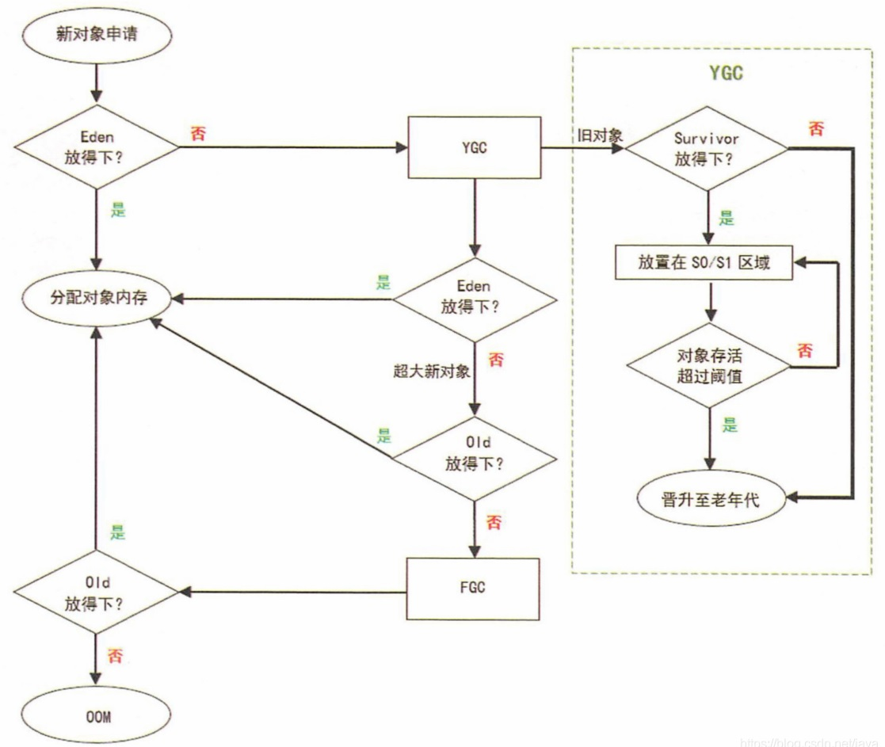

## 申请系统内存
* Linux 的虚拟内存管理有几个关键概念：
  1) 每个进程都有独立的虚拟地址空间，进程访问的虚拟地址并不是真正的物理地址；
  2) 虚拟地址可通过每个进程上的页表(在每个进程的内核虚拟地址空间)与物理地址进行映射，获得真正物理地址；
  3) 如果虚拟地址对应物理地址不在物理内存中，则产生缺页中断，真正分配物理地址，同时更新进程的页表；如果此时物理内存已耗尽，则根据内存替换算法淘汰部分页面至物理磁盘中。
* Linux 虚拟地址空间如何分布
  * Linux 使用虚拟地址空间，大大增加了进程的寻址空间，由低地址到高地址分别为：
    1) 只读段：该部分空间只能读，不可写；(包括：代码段、rodata 段(C常量字符串和#define定义的常量) )
    2) 数据段：保存全局变量、静态变量的空间；
    3) 堆 ：就是平时所说的动态内存， malloc/new 大部分都来源于此。其中堆顶的位置可通过函数 brk 和 sbrk 进行动态调整。
    4) 文件映射区域 ：如动态库、共享内存等映射物理空间的内存，一般是 mmap 函数所分配的虚拟地址空间。
    5) 栈：用于维护函数调用的上下文空间，一般为 8M ，可通过 ulimit –s 查看。
    6) 内核虚拟空间：用户代码不可见的内存区域，由内核管理(页表就存放在内核虚拟空间)。

  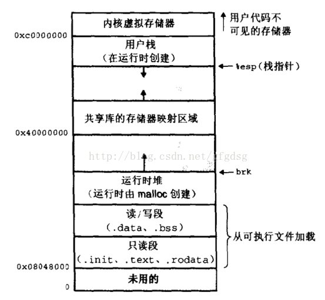
  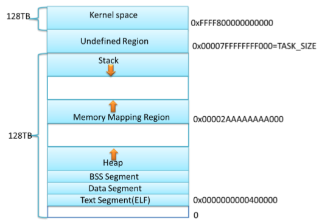

  ```
  32 位系统有4G 的地址空间::
  其中 0x08048000~0xbfffffff 是用户空间，0xc0000000~0xffffffff 是内核空间，包括内核代码和数据、与进程相关的数据结构（如页表、内核栈）等。
  另外，%esp 执行栈顶，往低地址方向变化；brk/sbrk 函数控制堆顶_edata往高地址方向变化。
  
  * brk和sbrk分别是调整堆顶的brk指针的指向，一种是相对，一种是绝对位置的调整

  64 位系统的虚拟地址空间划分发生了改变：
  1、地址空间大小不是2^32，也不是2^64，而一般是2^48。因为并不需要 2^64 这么大的寻址空间，过大空间只会导致资源的浪费。64位Linux一般使用48位来表示虚拟地址空间，40位表示物理地址，
  这可通过 /proc/cpuinfo 来查看
  address sizes   : 40 bits physical, 48 bits virtual
  2、其中，0x0000000000000000~0x00007fffffffffff 表示用户空间， 0xFFFF800000000000~ 0xFFFFFFFFFFFFFFFF 表示内核空间，共提供 256TB(2^48) 的寻址空间。
  这两个区间的特点是，第 47 位与 48~63 位相同，若这些位为 0 表示用户空间，否则表示内核空间。
  3、用户空间由低地址到高地址仍然是只读段、数据段、堆、文件映射区域和栈；  
  ```

* 如何查看进程发生缺页中断的次数？
  ```
  ps -o majflt,minflt -C <program_name>
  ps -o majflt,minflt -p <pid>
  
  majflt代表major fault，中文名叫大错误，minflt代表minor fault，中文名叫小错误。
  这两个数值表示一个进程自启动以来所发生的缺页中断的次数。
  其中 majflt 与 minflt 的不同是: majflt 表示需要读写磁盘，可能是内存对应页面在磁盘中需要load 到物理内存中，也可能是此时物理内存不足，需要淘汰部分物理页面至磁盘中。
  ```
* 发成缺页中断后，执行了那些操作？ 当一个进程发生缺页中断的时候，进程会陷入内核态，执行以下操作：
  1) 检查要访问的虚拟地址是否合法
  2) 查找/分配一个物理页
  3) 填充物理页内容（读取磁盘，或者直接置0，或者啥也不干）
  4) 建立映射关系（虚拟地址到物理地址）
  5) 重新执行发生缺页中断的那条指令
  ```如果第3步，需要读取磁盘，那么这次缺页中断就是majflt，否则就是minflt。```

* 内存分配的原理
  * 从操作系统角度来看，进程分配内存有两种方式，分别由两个系统调用完成：brk和mmap（不考虑共享内存）。
    1) brk是将数据段(.data)的最高地址指针_edata往高地址推；
    2) mmap是在进程的虚拟地址空间中（堆和栈中间，称为文件映射区域的地方）找一块空闲的虚拟内存。
  * 这两种方式分配的都是虚拟内存，没有分配物理内存。在第一次访问已分配的虚拟地址空间的时候，发生缺页中断，操作系统负责分配物理内存，然后建立虚拟内存和物理内存之间的映射关系。
  * 在标准C库中，提供了malloc/free函数分配释放内存，这两个函数底层是由brk，sbrk，mmap，munmap这些系统调用实现的。

* 下面以一个例子来说明内存分配的原理：
  * 情况一、malloc小于128k的内存，使用brk分配内存，将_edata往高地址推(只分配虚拟空间，不对应物理内存(因此没有初始化)，第一次读/写数据时，引起内核缺页中断，内核才分配对应的物理内存，然后虚拟地址空间建立映射关系)，如下图：

  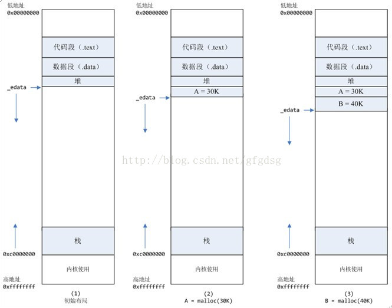
    1) 进程启动的时候，其（虚拟）内存空间的初始布局如图1所示。
       ```
       其中，mmap内存映射文件是在堆和栈的中间（例如libc-2.2.93.so，其它数据文件等），为了简单起见， 省略了内存映射文件。
       _edata指针（glibc里面定义）指向数据段的最高地址。
       ```
    2) 进程调用A=malloc(30K)以后，内存空间如图2：
       ```
       malloc函数会调用brk系统调用，将_edata指针往高地址推30K，就完成虚拟内存分配。
       你可能会问： 只要把_edata+30K就完成内存分配了？
       事实是这样的，_edata+30K只是完成虚拟地址的分配， A这块内存现在还是没有物理页与之对应的， 等到进程第一次读写A这块内存的时候，发生缺页中断，这个时候，内核才分配A这块内存对应的物理页。
       也就是说，如果用malloc分配了A这块内容，然后从来不访问它，那么，A对应的物理页是不会被分配的。
       ```
    3) 进程调用B=malloc(40K)以后，内存空间如图3。

  * 情况二、malloc大于128k的内存，使用mmap分配内存，在堆和栈之间找一块空闲内存分配(对应独立内存，而且初始化为0)，如下图：

  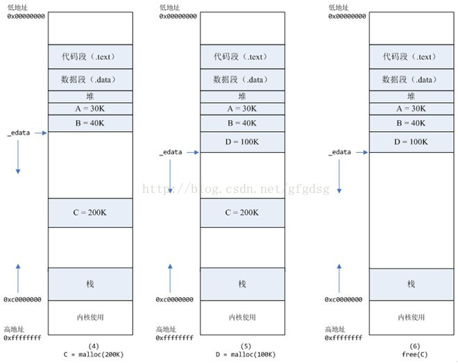
  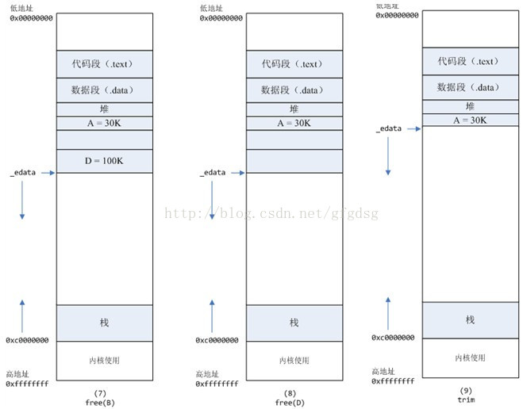
    1) 进程调用C=malloc(200K)以后，内存空间如图4：
      ```
      默认情况下，malloc函数分配内存，如果请求内存大于128K（可由M_MMAP_THRESHOLD选项调节），那就不是去推_edata指针了，而是利用mmap系统调用，从堆和栈的中间分配一块虚拟内存。
      这样子做主要是因为::
      brk分配的内存需要等到高地址内存释放以后才能释放（例如，在B释放之前，A是不可能释放的，这就是内存碎片产生的原因，什么时候紧缩看下面），而mmap分配的内存可以单独释放。
      ```
    2) 进程调用D=malloc(100K)以后，内存空间如图5；
    3) 进程调用free(C)以后，C对应的虚拟内存和物理内存一起释放。
    4) 进程调用free(B)以后，如图7所示：
     ```
     B对应的虚拟内存和物理内存都没有释放，因为只有一个_edata指针，如果往回推，那么D这块内存怎么办呢？
     当然，B这块内存，是可以重用的，如果这个时候再来一个40K的请求，那么malloc很可能就把B这块内存返回回去了。
     ```
    5) 进程调用free(D)以后，如图8所示：
     ```B和D连接起来，变成一块140K的空闲内存。```
    6) 当最高地址空间的空闲内存超过128K（可由M_TRIM_THRESHOLD选项调节）时，执行内存紧缩操作（trim）。 
     ```在上一个步骤free的时候，发现最高地址空闲内存超过128K，于是内存紧缩，变成图9所示。```

* 既然堆内内存brk和sbrk不能直接释放，为什么不全部使用 mmap 来分配，munmap直接释放呢？
  ```
  既然堆内碎片不能直接释放，导致疑似“内存泄露”问题，为什么 malloc 不全部使用 mmap 来实现呢(mmap分配的内存可以会通过 munmap 进行 free ，实现真正释放)？而是仅仅对于大于 128k 的大块内存才使用 mmap ？ 

  其实，进程向 OS 申请和释放地址空间的接口 sbrk/mmap/munmap 都是系统调用，频繁调用系统调用都比较消耗系统资源的。并且， mmap 申请的内存被 munmap 后，重新申请会产生更多的缺页中断。
  例如使用 mmap 分配 1M 空间，第一次调用产生了大量缺页中断 (1M/4K 次 ) ，当munmap 后再次分配 1M 空间，会再次产生大量缺页中断。缺页中断是内核行为，会导致内核态CPU消耗较大。
  另外，如果使用 mmap 分配小内存，会导致地址空间的分片更多，内核的管理负担更大。
  同时堆是一个连续空间，并且堆内碎片由于没有归还 OS ，如果可重用碎片，再次访问该内存很可能不需产生任何系统调用和缺页中断，这将大大降低 CPU 的消耗。 
  因此， glibc 的 malloc 实现中，充分考虑了 sbrk 和 mmap 行为上的差异及优缺点，默认分配大块内存 (128k) 才使用 mmap 获得地址空间，也可通过 mallopt(M_MMAP_THRESHOLD, <SIZE>) 来修改这个临界值。
  ```

### C语言的内存分配方式与malloc
* C语言跟内存分配方式
  1) 从静态存储区域分配。内存在程序编译的时候就已经分配好，这块内存在程序的整个运行期间都存在。例如全局变量，static变量。
  2) 在栈上创建。在执行函数时，函数内局部变量的存储单元都可以在栈上创建，函数执行结束时这些存储单元自动被释放。栈内存分配运
     算内置于处理器的指令集中，效率很高，但是分配的内存容量有限。
  3) 从堆上分配，亦称动态内存分配。程序在运行的时候用malloc或new申请任意多少的内存，程序员自己负责在何时用free或delete释放内存。动态内存的生存期由我们决定，使用非常灵活，但问题也最多
  ```
  C语言跟内存申请相关的函数主要有 alloc,calloc,malloc,free,realloc,sbrk等.其中alloc是向栈申请内存,因此无需释放. 
  malloc分配的内存是位于堆中的,并且没有初始化内存的内容,因此基本上malloc之后,调用函数memset来初始化这部分的内存空间.
  calloc则将初始化这部分的内存,设置为0. 而realloc则对malloc申请的内存进行大小的调整.申请的内存最终需要通过函数free来释放. 而sbrk则是增加数据段的大小;
  malloc/calloc/free基本上都是C函数库实现的,跟OS无关.C函数库内部通过一定的结构来保存当前有多少可用内存.
  如果程序 malloc的大小超出了库里所留存的空间,那么将首先调用brk系统调用来增加可用空间,然后再分配空间.
  free时,释放的内存并不立即返回给os, 而是保留在内部结构中. 可以打个比方: brk类似于批发,一次性的向OS申请大的内存,而malloc等函数则类似于零售,满足程序运行时的要求.这套机制类似于缓冲.
  使用这套机制的原因: 系统调用不能支持任意大小的内存分配(有的系统调用只支持固定大小以及其倍数的内存申请,这样的话,对于小内存的分配会造成浪费; 系统调用申请内存代价昂贵,涉及到用户态和核心态的转换.
  函数malloc()和calloc()都可以用来分配动态内存空间，但两者稍有区别。
  
  在Linux系统上，程序被载入内存时，内核为用户进程地址空间建立了代码段、数据段和堆栈段，在数据段之后的堆栈段之间的空闲区域用于动态内存分配。
  内核数据结构mm_struct中的成员变量start_code和end_code是进程代码段的起始和终止地址，start_data和 end_data是进程数据段的起始和终止地址，
  start_stack是进程堆栈段起始地址，start_brk是进程动态内存分配起始地址（堆的起始 地址），还有一个 brk（堆的当前最后地址），就是动态内存分配当前的终止地址。
  C语言的动态内存分配基本函数是malloc()，在Linux上的基本实现是通过内核的brk系统调用。brk()是一个非常简单的系统调用，只是简单地改变mm_struct结构的成员变量brk的值。
  
  mmap系统调用实现了更有用的动态内存分配功能，可以将一个磁盘文件的全部或部分内容映射到用户空间中，进程读写文件的操作变成了读写内存的操作。
  在 linux/mm/mmap.c文件的do_mmap_pgoff()函数，是mmap系统调用实现的核心。do_mmap_pgoff()的代码，只是新建了一个vm_area_struct结构，并把file结构的参数赋值给其成员变量m_file，并没有把文件内容实际装入内存。
  Linux内存管理的基本思想之一，是只有在真正访问一个地址的时候才建立这个地址的物理映射。
  ```

#### mmap
* 头文件: #include <sys/mman.h>
* 函数：void *mmap(void *start,size_t length,int prot,int flags,int fd,off_t offsize);
* 参数start：指向欲映射的内存起始地址，通常设为 NULL，代表让系统自动选定地址，映射成功后返回该地址。
* 参数length：代表将文件中多大的部分映射到内存。
* 参数prot：映射区域的保护方式。可以为以下几种方式的组合：
  * PROT_EXEC 映射区域可被执行
  * PROT_READ 映射区域可被读取
  * PROT_WRITE 映射区域可被写入
  * PROT_NONE 映射区域不能存取
    * reserved memory是PROT_NONE的， committed memory是 PROT_READ 和 PROT_WRITE的，具体的原因是什么呢？
* 参数flags：影响映射区域的各种特性。在调用mmap()时必须要指定MAP_SHARED 或MAP_PRIVATE。
  * MAP_FIXED 如果参数start所指的地址无法成功建立映射时，则放弃映射，不对地址做修正。通常不鼓励用此旗标。
  * MAP_SHARED 对映射区域的写入数据会复制回文件内，而且允许其他映射该文件的进程共享。
  * MAP_PRIVATE 对映射区域的写入操作会产生一个映射文件的复制，即私人的“写入时复制”（copy on write）对此区域作的任何修改都不会写回原来的文件内容。
  * MAP_ANONYMOUS建立匿名映射。此时会忽略参数fd，不涉及文件，而且映射区域无法和其他进程共享。
  * MAP_DENYWRITE 只允许对映射区域的写入操作，其他对文件直接写入的操作将会被拒绝。
  * MAP_LOCKED 将映射区域锁定住，这表示该区域不会被置换（swap）。
* 参数fd：要映射到内存中的文件描述符。
  1) Linux文件系统中的普通文件，就是通常使用mmap来读取文件的方式，映射到文件时，fd就是对应文件的fd
  2) 匿名文件，效果就是直接向操作系统申请一块虚拟内存，传入参数fd = -1时就是映射到匿名文件
     * 如果使用匿名内存映射时，即flags中设置了MAP_ANONYMOUS，fd设为-1。有些系统不支持匿名内存映射，则可以使用fopen打开/dev/zero文件，然后对该文件进行映射，可以同样达到匿名内存映射的效果。
* 参数offset：文件映射的偏移量，通常设置为0，代表从文件最前方开始对应，offset必须是分页大小的整数倍。
* 返回值：若映射成功则返回映射区的内存起始地址，否则返回MAP_FAILED(－1)，错误原因存于errno 中。
* errno 错误代码：
  * EBADF 参数fd 不是有效的文件描述词
  * EACCES 存取权限有误。如果是MAP_PRIVATE 情况下文件必须可读，使用MAP_SHARED则要有PROT_WRITE以及该文件要能写入。
  * EINVAL 参数start、length 或offset有一个不合法。
  * EAGAIN 文件被锁住，或是有太多内存被锁住。
  * ENOMEM 内存不足。
* 共享内存的两种方式：
  1) 使用普通文件提供的内存映射：
    ```
    fd=open(name, flag, mode); if(fd<0) ...
    ptr=mmap(NULL, len , PROT_READ|PROT_WRITE, MAP_SHARED , fd , 0);
    ```
  2) 使用特殊文件提供匿名内存映射：
    ```
    适用于具有亲缘关系的进程之间。由于父子进程特殊的亲缘关系，在父进程中先调用mmap()，然后调用 fork()。
    那么在调用fork()之后，子进程继承父进程匿名映射后的地址空间，同样也继承mmap()返回的地址，这样，父子进程就可以通过映射区域进行通信了。
    注意，这里不是一般的继承关系。一般来说，子进程单独维护从父进程继承下来的一些变量。而mmap()返回的地址，却由父子进程共同维护。
    对于具有亲缘关系的进程实现共享内存最好的方式应该是采用匿名内存映射的方式。此时，不必指定具体的文件，只要设置相应的标志即可。
    ```
* Examples
  ```
  #include <unistd.h>
  #include <stdio.h>
  #include <sys/mman.h>
  #include <fcntl.h>
  #include <stdlib.h>
  
  //定义存放记录的结构体
  
  typedef struct
  {
  int index; //编号
  
      char text[10]; //内容
  
  } RECORD;
  
  #define SIZE (50)
  #define EDIT_INDEX (10)
  
  int main(void)
  {
  RECORD record, *p_mapped_memory_addr;
  int i, fd;
  FILE *fp;
  
      //创建文件并写入测试数据
  
      fp = fopen("records.dat", "w+");
      for (i = 0; i < SIZE; i++)
      {
          record.index = i;
          sprintf(record.text, "No.%d", i);
          fwrite(&record, sizeof(record), 1, fp);//因为字节序对齐，在32位机上，sizeof(record)＝16，并不是14。
  
      }
      fclose(fp);
      printf("Ok, write %d records to the file: records.dat .\n", SIZE);
  
      //将第一30条记录编号修改为300，并相应地修改其内容。
  
      //采用传统方式
  
      fp = fopen("records.dat", "r+");
      fseek(fp, EDIT_INDEX * sizeof(record), SEEK_SET);
      fread(&record, sizeof(record), 1, fp);
  
      record.index = EDIT_INDEX*10;
      sprintf(record.text, "No.%d", record.index);
  
      fseek(fp, EDIT_INDEX * sizeof(record), SEEK_SET);
      fwrite(&record, sizeof(record), 1, fp);
      fclose(fp);
      printf("Ok, edit the file of records.dat using traditional method.\n");
  
      /
  
      //同样的修改，这次使用内存映射方式。
  
      //将记录映射到内存中
  
      fd = open("records.dat", O_RDWR);
      p_mapped_memory_addr = (RECORD *)mmap(0, SIZE * sizeof(record), PROT_READ | PROT_WRITE, MAP_SHARED, fd, 0);
      //修改数据
  
      p_mapped_memory_addr[EDIT_INDEX].index = EDIT_INDEX*10;
      sprintf(p_mapped_memory_addr[EDIT_INDEX].text, "No.%d",
              p_mapped_memory_addr[EDIT_INDEX].index);
  
      /* Synchronize the region starting at ADDR and extending LEN bytes with the
       file it maps. Filesystem operations on a file being mapped are
       unpredictable before this is done. Flags are from the MS_* set.
  
       This function is a cancellation point and therefore not marked with
       __THROW. extern int msync (void *__addr, size_t __len, int __flags);
       */
      //将修改写回映射文件中(采用异步写方式)
  
      msync((void *)p_mapped_memory_addr, SIZE * sizeof(record), MS_ASYNC);
      /* Deallocate any mapping for the region starting at ADDR and extending LEN
       bytes. Returns 0 if successful, -1 for errors (and sets errno). 
       extern int munmap (void *__addr, size_t __len) __THROW;
       */
      //释放内存段
  
      munmap((void *)p_mapped_memory_addr, SIZE * sizeof(record));
      printf("Ok, edit the file of records.dat using mmap method.\n");
  
      //关闭文件
  
      close(fd);
      
      return 0;
  
  }

  ```

### glibc 内存分析方法
* 通过读取/proc/$pid/maps，该文件的具体内容可以通过 man 5 proc来了解，其的部分的解释如下：
  ```
  address           perms  offset    dev    inode       pathname
  00400000-00452000 r-xp   00000000  08:02  173521      /usr/bin/dbus-daemon
  00651000-00652000 r--p   00051000  08:02  173521      /usr/bin/dbus-daemon
  00652000-00655000 rw-p   00052000  08:02  173521      /usr/bin/dbus-daemon
  00e03000-00e24000 rw-p   00000000  00:00  0           [heap]
  00e24000-011f7000 rw-p   00000000  00:00  0           [heap]
  ```
* perms代表了内存的权限，有5种格式：
  * r = read
  * w = write
  * x = execute
  * s = shared
  * p = private (copy on write)
* offset字段是文件中的偏移量
* dev是设备（主要：次要）
* inode是该设备上的inode. 0表示没有inode与内存区域相关联，就像.BSS（未初始化的数据存放的section）
* pathname字段指向映射的文件。同时会提供几种伪地址： 
  - [stack]：进程的栈 
  - [stack:<tid>]：各个线程的栈 
  - [vdso]：虚拟动态共享对象 
  - [heap]：进程的堆
* 具体分析
  * 我们用C语言编写一个简单的程序，在其中调用 malloc 来动态分配内存，并使用 getchar 使程序暂停，帮助我们查看程序的内存分配具体情况，源代码如下：

    ```
    /* Per thread arena example. */
    
    #include <stdio.h>
    #include <stdlib.h>
    #include <pthread.h>
    #include <unistd.h>
    #include <sys/types.h>
    
    void* threadFunc(void* arg) {
        printf("Before malloc in thread 1\n");
        getchar();
        char* addr = (char*) malloc(1000 * sizeof(char));
        printf("After malloc and before free in thread 1\n");
        getchar();
        free(addr);
        printf("After free in thread 1\n");
        getchar();
    }
    
    int main() {
        pthread_t t1;
        void* s;
        int ret;
        char* addr;
    
        printf("Welcome to per thread arena example::%d\n", getpid());
        printf("Before malloc in main thread\n");
        getchar();
        addr = (char*) malloc(6553500 * sizeof(char));
        printf("After malloc and before free in main thread\n");
        getchar()
        free(addr);
        printf("After free in main thread\n");
        getchar();
        ret = pthread_create(&t1, NULL, threadFunc, NULL);
        if(ret) {
            printf("Thread creation error\n");
            return -1;
        }
        ret = pthread_join(t1, &s);
        if(ret) {
            printf("Thread join error\n");
            return -1;
        }
    
        return 0;
    }
    ```
    
  * 我们运行程序，检测输出的内容：
    ```
    $ gcc main.c -lpthread -o mthread
    $ ./mthread
    Welcome to per thread arena example::13201
    Before malloc in main thread
    ``` 
    
  * 我们根据程序 PID 查看程序的内存分配情况: （或者pmap -p [pid]）
    ```
    $ cat /proc/13201/maps
    56424b4c2000-56424b4c3000 r-xp 00000000 08:01 673794              /home/zhf/mthread
    56424b6c2000-56424b6c3000 r--p 00000000 08:01 673794              /home/zhf/mthread
    56424b6c3000-56424b6c4000 rw-p 00001000 08:01 673794              /home/zhf/mthread
    56424c8db000-56424c8fc000 rw-p 00000000 00:00 0                   [heap]
    ...
    ```
  * 此时主进程并没有调用malloc，但进程已经初始化部分内存空间作为进程的堆，地址为56424c8db000-56424c8fc000，大小为132KB。这个堆内存的连续区域被称为arena。这个 arena 是由主线程创建，则被称为main arena。进一步的分配请求会继续使用这个 arena 直到 arena 空闲空间耗尽。：
    ```
    ...
    After malloc and before free in main thread
    ...
    $ cat /proc/13201/maps
    56424b4c2000-56424b4c3000 r-xp 00000000 08:01 673794              /home/zhf/mthread
    56424b6c2000-56424b6c3000 r--p 00000000 08:01 673794              /home/zhf/mthread
    56424b6c3000-56424b6c4000 rw-p 00001000 08:01 673794              /home/zhf/mthread
    56424c8db000-56424c8fc000 rw-p 00000000 00:00 0                   [heap]
    7f6075cd0000-7f6076310000 rw-p 00000000 00:00 0
    ...
    ```
  * 由于我们在使用malloc申请了一块较大的地址，原有的堆空间无法满足需求，因此会使用 mmap 系统调用，进一步扩张arena的区域，新申请的内存区域没与之前的堆相连，地址为7f6075cd0000-7f6076310000 。接着主线程free内存块。
    ```
    ...
    After free in main thread
    ...
    $ cat /proc/13201/maps
    56424b4c2000-56424b4c3000 r-xp 00000000 08:01 673794              /home/zhf/mthread
    56424b6c2000-56424b6c3000 r--p 00000000 08:01 673794              /home/zhf/mthread
    56424b6c3000-56424b6c4000 rw-p 00001000 08:01 673794              /home/zhf/mthread
    56424c8db000-56424c8fc000 rw-p 00000000 00:00 0                   [heap]
    ...
    ```
  * 在主线程 free 之后： 在上面的输出里我们可以看到，当分配内存区域被释放时，其后内存不会被立即释放给操作系统。分配内存区域（1000 bytes 大小）只释放给 glibc malloc 库，在这里的释放掉的 Chunk 会被添加到 main arenas 中（在glibc malloc 里，freelist 被称为 bins）。此后当用户申请内存时，glibc malloc 不会从内核中获得新的堆内存，而是尽量在bins 里找到一个空闲块(Free Chunk)。只有当没有空闲块存在时，glibc malloc 才会从继续内核中申请内存。
    ```
    ...
    Before malloc in thread 1
    ...
    $ cat /proc/13201/maps
    56424b4c2000-56424b4c3000 r-xp 00000000 08:01 673794              /home/zhf/mthread
    56424b6c2000-56424b6c3000 r--p 00000000 08:01 673794              /home/zhf/mthread
    56424b6c3000-56424b6c4000 rw-p 00001000 08:01 673794              /home/zhf/mthread
    56424c8db000-56424c8fc000 rw-p 00000000 00:00 0                   [heap]
    7f6075b0f000-7f6075b10000 ---p 00000000 00:00 0
    7f6075b10000-7f6076310000 rw-p 00000000 00:00 0
    ...
    ``` 
  * 接着我们创建线程，我们可以看到，在线程调用malloc之前，已经为线程分配好了线程堆，其地址为7f6075b10000-7f6076310000。我们可以看到线程堆的地址进程堆的地址并不连续，这表明堆内存通过使用 mmap 系统调用而不是主线程（使用 sbrk）创建。
    ```
    ...
    After malloc and before free in thread 1
    ...
    $ cat /proc/13201/maps
    56424b4c2000-56424b4c3000 r-xp 00000000 08:01 673794              /home/zhf/mthread
    56424b6c2000-56424b6c3000 r--p 00000000 08:01 673794              /home/zhf/mthread
    56424b6c3000-56424b6c4000 rw-p 00001000 08:01 673794              /home/zhf/mthread
    56424c8db000-56424c8fc000 rw-p 00000000 00:00 0                   [heap]
    7f6070000000-7f6070031000 rw-p 00000000 00:00 0
    7f6070031000-7f6074000000 ---p 00000000 00:00 0
    7f6075b0f000-7f6075b10000 ---p 00000000 00:00 0
    7f6075b10000-7f6076310000 rw-p 00000000 00:00 0
    ...  
    ```
  
  * 在线程malloc之后，出现一个新的线程堆地址，其中7f6070000000-7f6070031000 有读写权限，7f6070031000-7f6074000000仅支持写时拷贝(copy on write)。7f6070000000-7f6070031000这块内存区域被称为thread arena。
    * 注意：当用户申请的内存大小超过 128KB（ malloc(132*1024) ）并且当一个arena 里没有足够的空间来满足用户的请求时，内存是使用 mmap 系统调用来分配的（不使用 sbrk） 无论这个请求是来自于 main arena 还是 thread arena。
    ```
    ...
    After free in thread 1
    ...
    $ cat /proc/13201/maps
    56424b4c2000-56424b4c3000 r-xp 00000000 08:01 673794                     /home/zhf/mthread
    56424b6c2000-56424b6c3000 r--p 00000000 08:01 673794                     /home/zhf/mthread
    56424b6c3000-56424b6c4000 rw-p 00001000 08:01 673794                     /home/zhf/mthread
    56424c8db000-56424c8fc000 rw-p 00000000 00:00 0                          [heap]
    7f6070000000-7f6070031000 rw-p 00000000 00:00 0
    7f6070031000-7f6074000000 ---p 00000000 00:00 0
    7f6075b0f000-7f6075b10000 ---p 00000000 00:00 0
    7f6075b10000-7f6076310000 rw-p 00000000 00:00 0
    ``` 
  * 在线程 free 之后后：在上面的输出我们可以看到，释放的堆内存并不会给操作系统。相反，这块内存区域还给了 glibc malloc 里，并将这个释放块添加到 thread arenas 的 bins 里，由 freelist 维护。

* Arena 共享
  ```
  在以上示例中，我们看到了主线程包含main arena 同时每个线程包含了它自己的 thread arena。那么是不是无论多少线程，每个线程都有自己独立的 arena 呢？
  显然不是，一个进程可以包含比 CPU 核数量更多的线程数量，在这样的情况下，每个线程单独有一个 arena ，其代价十分昂贵。因此，应用程序的arena 数量的限制是基于系统里现有的 CPU 核的数量。

  For 32 bit systems:
  Number of arena = 2 * number of cores.
  For 64 bit systems:
  Number of arena = 8 * number of cores.
  假设我们有一个多线程的程序（4线程 - 主线程 + 3个用户线程），在一个单核 32 位系统上运行。这里线程数量 > 2 * 核心数量。因此，glibc malloc 认定 Multiple Arena 被所有可用进程共享。但它是怎样共享的呢？
  
  当主线程第一次调用 malloc 时，glibc malloc 会直接为它分配一个 main arena，不需要任何的附加条件
  当用户线程1和用户线程2第一次调用 malloc 时，会为这些线程创建一个新的 arena 。此时，各个线程与arena是一一对应的。
  当户线程3第一次调用 malloc 时， 此时 glibc malloc 能维持的 arena 数量已到达上限，因此尝试重用 现存的 arena （main arena 、arena 1 或arena 2）。
  遍历了所有可用的 arena，尽量去锁定可用的 arena。
  如果锁定成功（我们假设说 main arena 被锁定成功），就向用户返回该 arena。
  如果没有 arena 是空闲的，那么就将线程3的malloc操作 阻塞，直到有可用的arena为止。。
  现在当用户线程3第二次调用 malloc 时，malloc 会尽量使用上次访问的 arena （main arena）。如果 main arena 是空闲的， 用户线程3会一直使用该 arena 并屏蔽其他线程的申请直到 main arena 被释放。
  main arena 就是这样在主线程和用户线程3间共享。
  ```
  
* 模块
  * arena: 内存分配区，管理了一片内存，对外分发和回收，可以理解为一个内存池，分main arena和non main arena。
  * chunk: 进程申请到的一块内存叫做一个内存片，arena内部使用chunk数据结构来描述内存片，包括进程正在使用的内存片，和进程free掉的空闲内存片
    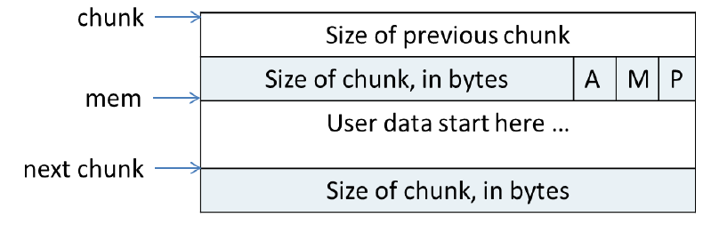
    * A：是否main arena内存
    * M：使用mmap内存
    * P：上一块是否被使用
    * size of previous chunk：上一块没有被使用时，表示上块长度，被使用时是上块用来存User data的。
    * Size of chunk：就是下一块的size of previous chunk，释放时填上本块长度，供下块合并用。
    * A "memory block" is a contiguous chunk of memory
  * 空闲chunk的组织: 分给进程的内存片arena可以不管，但是进程free回来的，arena需要通过一定方式组织起来，方便进程再次使用。组织方式有下面几种：
    * bins
      ```
      bins是个数组，包含128个bin，每个bin是个链表，分small bin和large bin两种，各64个，small bin中chunk大小固定，两个相邻的small bin中的chunk大小相差8bytes，
      large bin中chunk大小是一定范围内的，其中的chunk按大小排列。
      空闲chunk按大小选择合适的bin，按新旧顺序挂到链表上，优先分配旧的chunk。
      ```
      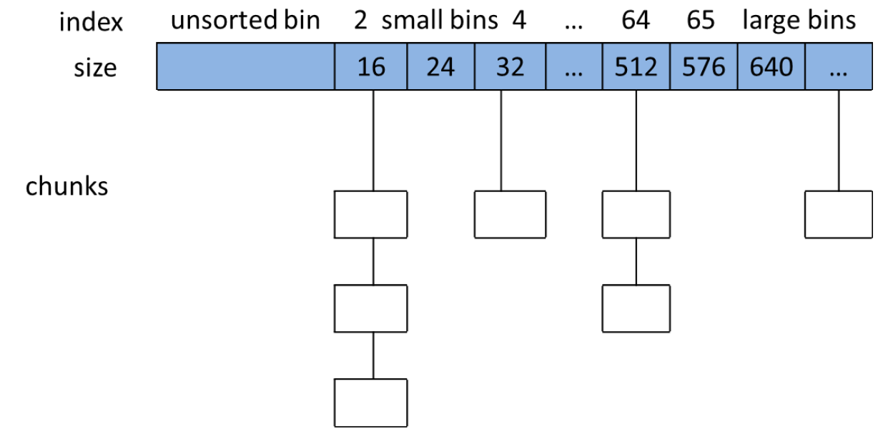
    * fast bins
      ```
      不大于max_fast （默认值为64B）的chunk被释放后，首先会被放到fast bins 中，fast bins中的chunk并不改变它的使用标志P。
      这样也就无法将它们合并，当需要给用户分配的chunk小于或等于max_fast时，ptmalloc首先会在fast bins中查找相应的空闲块。
      在特定的时候，ptmalloc会遍历fast bins中的chunk，将相邻的空闲chunk进行合并，并将合并后的chunk加入unsorted bin中。
      ```
    * unsorted bin
      ```
      进行malloc时，如果在fast bins中没有找到合适的chunk，则ptmalloc会先在unsorted bin中查找合适的空闲chunk，如果unsorted bin不能满足分配要求。
      malloc便会将unsorted bin中的chunk加入bins中。然后再从bins中继续进行查找和分配过程。从这个过程可以看出来，unsorted bin可以看做是bins的一个缓冲区，增加它只是为了加快分配的速度。
      ```
  * 特殊chunk
    * top chunk 
      ```
      程序第一次进行 malloc 的时候，heap 会被分为两块，一块给用户，剩下的那块就是 top chunk。
      其实，所谓的 top chunk 就是处于当前堆的物理地址最高的 chunk。
      这个 chunk 不属于任何一个 bin，它的作用在于当所有的 bin 都无法满足用户请求的大小时，如果其大小不小于指定的大小，就进行分配，并将剩下的部分作为新的 top chunk。
      否则，就对 heap 进行扩展后再进行分配。在 main arena 中通过 sbrk 扩展 heap，而在 thread arena 中通过 mmap 分配新的 heap。
      
      前面的bin中都是回收回来的内存，top chunk才是内存的初始来源，每个arena都有一个top chunk，用来管理Heap的，
      Heap会在arena第一次分配内存时初始化，会分配一块(chunk_size + 128K) align 4K的空间（132K）作为初始的Heap，
      top chunk占据整个空间，每次分配会在低地址出切出一片，如下图：
      ```
      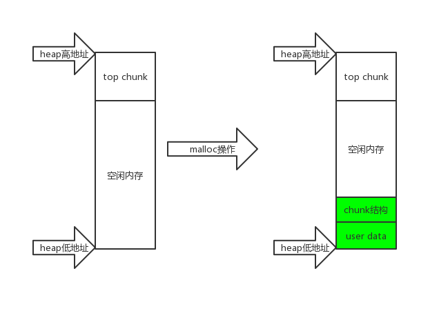
      * 回收时，只有和top chunk相连的内存才能和top chunk合并，才能进而还给系统。
      * 子线程Heap：在main arena中mmap出64M的空间，叫做sub-heap，再在sub-heap上初始化Heap。
      * 主线程的Heap才是真Heap，使用进程Heap，使用brk申请内存。
        
        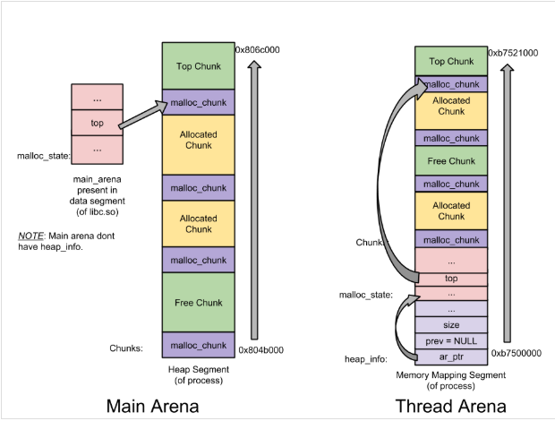
      * 子线程的heap不够用时，会在申请新的sub-heap，和老的sub-heap单向链表连起来，top chunk会搬到新sub-heap上。
        
        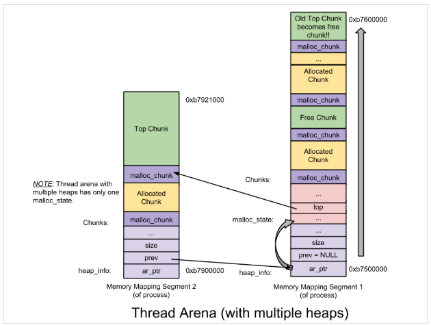
    * mmaped chunk
      * 描述mmap出来的内存，单独管理，free时按阈值来决定是否munmap，有动态调整阈值功能，防止太频繁的mmap和munmap。本文不关注。
    * Last remainder
      ```
      即最后一次small request中因分割而得到的剩余部分，它有利于改进引用局部性，也即后续对 small chunk 的 malloc 请求可能最终被分配得彼此靠近。
      当用户请求 small chunk而无法从small bin和unsorted bin得到时，会在large bin中找最合适的chunk，然后做切割，返回给用户的User chunk，
      剩下的是Remainder chunk添加到unsorted bin中。这一Remainder chunk就将成为last remainder chunk。
      ```

* 分配和回收步骤
  * malloc小于128K的内存
    1) 获取arena锁
    2) 将用户的请求大小转换为实际需要分配的chunk空间大小。
    3) 判断所需分配chunk的大小是否满足chunk_size <= max_fast (max_fast 默认为 64B)，如果是的话，则转下一步，否则跳到第5步。
    4) 首先尝试在fast bins中取一个所需大小的chunk分配给用户。如果可以找到，则分配结束。否则转到下一步。
    5) 判断所需大小是否处在small bins中，即判断chunk_size < 512B是否成立。如果chunk大小处在small bins中，则转下一步，否则转到第7步。
    6) 根据所需分配的chunk的大小，找到具体所在的某个small bin，从该bin的尾部摘取一个恰好满足大小的chunk。若成功，则分配结束，否则，转到下一步。
    7) 到了这一步，说明需要分配的是一块大的内存，或者small bins中找不到合适的 chunk。于是，ptmalloc首先会遍历fast bins中的chunk，将相邻的chunk进行合并，并链接到unsorted bin中，然后遍历unsorted bin中的chunk，如果unsorted bin只有一个chunk，并且这个chunk在上次分配时被使用过，并且所需分配的chunk大小属于small bins，并且chunk的大小大于等于需要分配的大小，这种情况下就直接将该chunk进行切割，分配结束，否则将根据chunk的空间大小将其放入small bins或是large bins中，遍历完成后，转入下一步。
    8) 到了这一步，说明需要分配的是一块大的内存，或者small bins和unsorted bin中都找不到合适的 chunk，并且fast bins和unsorted bin中所有的chunk都清除干净了。从large bins中按照“smallest-first，best-fit”原则，找一个合适的 chunk，从中划分一块所需大小的chunk，并将剩下的部分链接回到bins中。若操作成功，则分配结束，否则转到下一步。
    9) 如果搜索fast bins和bins都没有找到合适的chunk，那么就需要操作top chunk来进行分配了。判断top chunk大小是否满足所需chunk的大小，如果是，则从top chunk中分出一块来。否则转到下一步。
    10) 到了这一步，说明top chunk也不能满足分配要求，所以，于是就有了两个选择: 如果是主分配区，调用sbrk()，增加top chunk大小；如果是非主分配区，调用mmap来分配一个新的sub-heap，增加top chunk大小。扩大top chunk后，切分内存片，返回给用户。
  * free过程
    * 下一块为高地址，前一块为低地址。
    1) free()函数同样首先需要获取分配区的锁，来保证线程安全。
    2) 若chunk_size <= max_fast，并且chunk不在heap顶部，也就是说不与top chunk相邻，则转到下一步，否则跳到第4步。
    3) 将chunk放到fast bins中，函数返回。
    4) 判断前一个chunk是否处在使用中，如果也是空闲块，则合并。并转下一步。
    5) 判断当前释放chunk的下一个块是否为top chunk，如果是，则转第7步，否则转下一步。
    6) 判断下一个chunk是否处在使用中，如果下一个chunk也是空闲的，则合并，并将合并后的chunk放到unsorted bin中。并转到第8步。
    7) 如果执行到这一步，说明释放了一个与top chunk相邻的chunk。则无论它有多大，都将它与top chunk合并，并更新top chunk的大小等信息。转下一步。
    8) 判断合并后的chunk的大小是否大于FASTBIN_CONSOLIDATION_THRESHOLD（默认64K），如果是，进行fast bins的合并操作，遍历fast bins中的chunk，与相邻的空闲chunk合并，合并后的chunk会被放到unsorted bin中。fast bins将变为空，操作完成之后转下一步。
    9) 判断top chunk的大小是否大于mmap收缩阈值（默认为128KB），如果是的话，对于主分配区，则会试图归还top chunk中的一部分给操作系统，但是初始化的132KB空间是不会归还的；如果为非主分配区，会进行sub-heap收缩，将top chunk的一部分返回给操作系统，如果top chunk为整个sub-heap，会把整个sub-heap还回给操作系统。做完这一步之后，释放结束，从 free() 函数退出。

* VSS, USS, PSS, and RSS are four indicators for measuring memory usage:
 * VSS: Virtual Set Size, virtual memory footprint, including shared libraries.
 * RSS: Resident Set Size, actual physical memory usage, including shared libraries.
 * PSS: Proportion Set Size, the actual physical memory used, shared libraries, etc. are allocated proportionally.
 * USS: Unique Set Size, the physical memory occupied by the process, does not calculate the memory usage of the shared library.
 * Generally we have VSS >= RSS >= PSS >= USS.
 ```
 VSS reflects the virtual address space requested and not returned by the current process, 
 RSS contains the so-called shared libraries, 
 PSS shares the size of the shared libraries in proportion to the shared processes, 
 and USS does not count the memory of the shared libraries directly.
 ```

* useful command
  * strace -f -e "brk,mmap,munmap" -p pid
  * gdp -pid pid
  * jstack pid
  * https://github.com/gperftools/gperftools
  * https://github.com/btraceio/btrace

## Java Thread
* 内核线程模型
  * 内核线程(Kernel Level Thread，KLT)是直接由操作系统内核来支持的线程
  * 程序一般不会直接使用内核线程，而是使用内核线程的一种高级接口(轻量级进程Light Weight Process)LWP，也就是通常意义所描述的线程
  * 每个轻量级进程都由一个内核支持，因此先支持内核线程，才能有轻量级进程。其中KLT、Schedule、LWP之间关系如下图所示：

  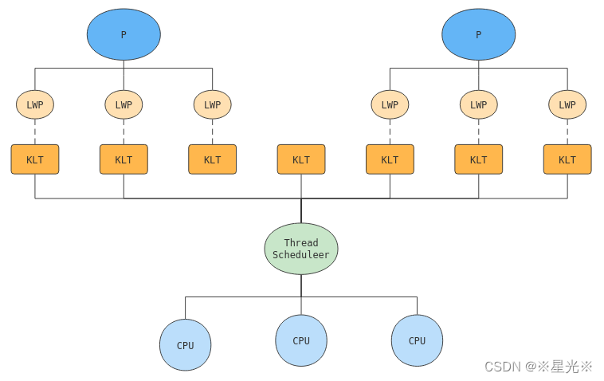
* 用户线程模型
  * User Thread: 指完全建立在用户空间的线程，线程的控制无需内核参与，内核也无法感知其实现模式，这种线程也不需要进行用户态和内核态的切换
* Java Thread: Thread对象本身是在堆内存创建的，调用start()后开辟的线程空间是属于栈内存的。
  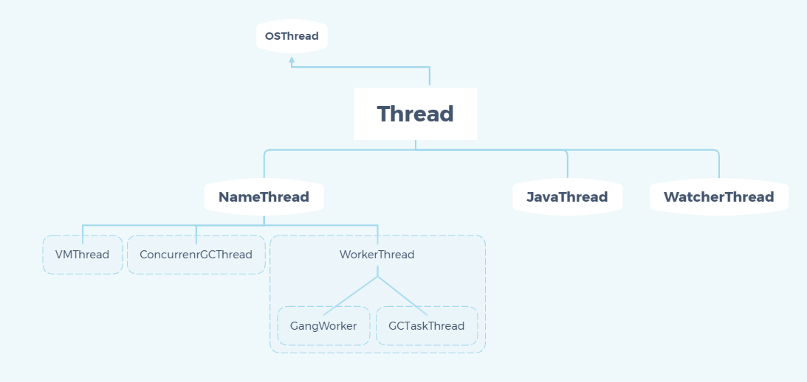
  ```
  这些类构成了JVM的线程模型，其中最主要的是下面几个类：

  java.lang.Thread：这个是java语言里的线程类，由这个java类创建的instance都会1:1映射到一个操作系统的osthread。
  
  JavaThread：JVM中C++定义的类，一个JavaThread的instance代表了在JVM中的java.lang.Thread的instance，它维护了线程的状态，并且维护了一个指针指向java.lang.Thread创建的对象(oop)。它同时还维护了一个指针指向对应的OSThread，来获取底层操作系统创建的osthread的状态。
  
  OSThread:JVM中C++定义的类，代表了JVM对底层操作系统的osthread的抽象，它维护着实际操作系统创建的线程句柄handle，可以获取底层osthread的状态。
  
  VMThread：JVM中C++定义的类，这个类和用户创建的线程无关，是JVM本身用来进行虚拟机操作的线程，比如GC。
  
  1.3.2 用户在JVM中创建线程
  有两种方式可以让用户在JVM中创建线程：
  
    1. new java.lang.Thread().start()
  
    2. 使用JNI将一个native thread attach到JVM中
  
  针对new java.lang.Thread.start()这种方式，只有调用start()方法的时候，才会真正的在JVM中去创建线程，主要的生命周期步骤有：
  
    1. 创建对应的JavaThread的实例
  
    2. 创建对应的OSThread的实例
  
    3. 创建实际的底层操作系统的native thread
  
    4. 准备相应的JVM资源，如ThreadLocal存储空间分配等
  
    5. 底层native thread开始运行，调用java.lang.Thread生成的Object的run()方法
  
    6. java.lang.Thread生成的Object的run()方法执行完毕返回后，或者抛出异常终止后，终止native thread
  
    7. 释放JVM相关的thread的资源，清除对应的JavaThread和OSThread
  
  针对JNI将一个native thread attach到JVM中，主要步骤有：
  
    1. 通过JNI call AttachCurrentThread申请连接到执行的JVM实例
  
    2. JVM创建相应的JavaThread和OSThread对象
  
    3. 创建相应的java.lang.Thread的对象
  
    4. 一旦java.lang.Thread的对象闯创建之后，JNI就可以调用java代码了
  
    5. 当通过JNI call DetachCurrentThread之后，JNI就从JVM实例中断开连接
  
    6. JVM清除相应的JavaThread，OSThread，java.lang.Thread对象
  ```
  
* JVM中线程状态
  * 从JVM的角度来看待线程状态主要状态有以下5种：
    * _thread_new：新创建的线程
    * _thread_in_Java：在运行java代码
    * _thread_in_vm：在运行JVM本身的代码
    * _thread_in_native:在运行native代码
    * _thread_blocked:线程被阻塞了，包括等待一个锁，等待一个条件，sleep，执行一个阻塞的IO等
  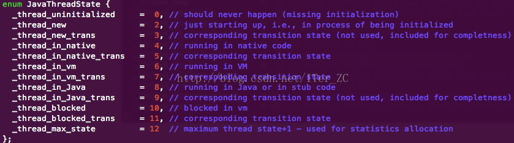
  * 从OSThread角度，JVM还定义了一些线程状态给外部使用
    * 比较常见的有： 
      * Runnable:可以运行或者正在运行的 
      * MONITOR_WAIT:等待锁 
      * OBJECT_WAIT:执行了Object.wait()之后在条件队列种等待的 
      * SLEEPING：执行了Thread.sleep()的
  * 从JavaThread，JVM定义了一些针对JavaThread对象的状态，基本类似。多了一个TIMED_WAITING的状态，用来表示定时阻塞的状态。
    
    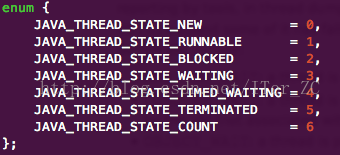
