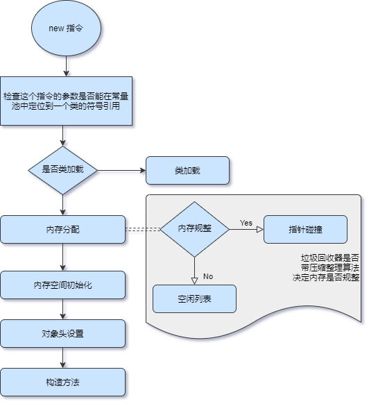
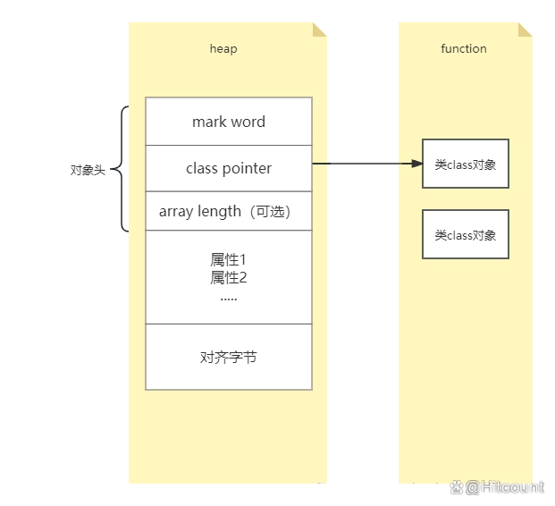
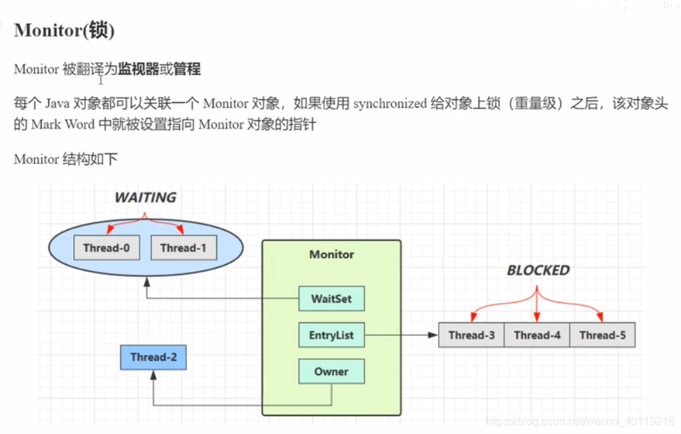
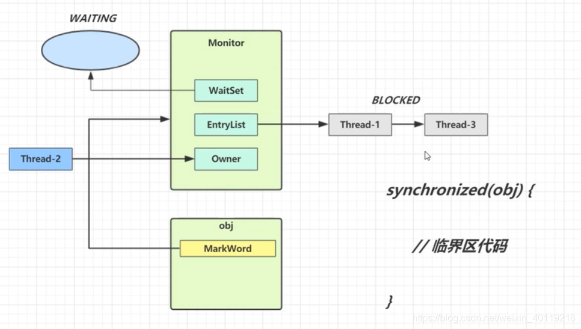
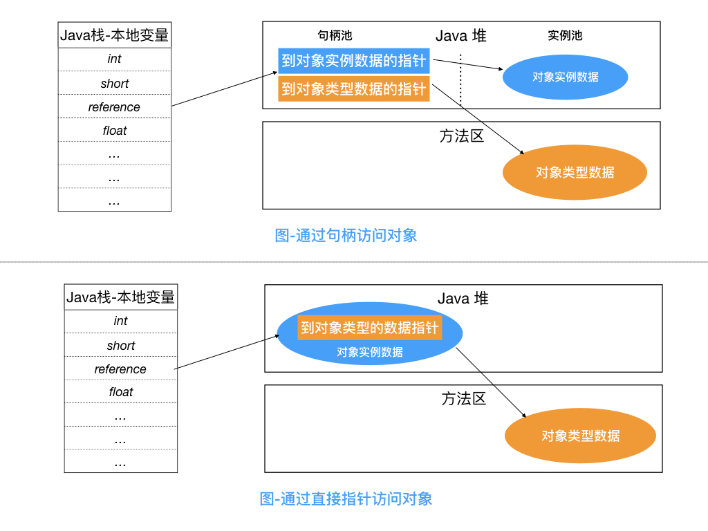

# 对象

## 类加载过程
* 加载
  * 通过一个类的全限定名来获取定义此类的二进制字节流。
  * 将这个字节流所代表的静态存储结构转化为方法区的运行时数据结构。
  * 在堆内存中生成一个代表这个类的 java.lang.Class 实例对象，作为方法区这个类的各种数据的访问入口。
  * 对于数组类而言，情况有所不同，数组类本身不通过类加载器创建，它是由 Java 虚拟机直接在内存中动态构造出来的。
* 验证
  * 验证的目的是确保 Class 文件的字节流中包含的信息符合《Java 虚拟机规范》的全部约束要求，保证这些信息被当作代码运行后不会危害虚拟机自身的安全。
  * 文件格式验证： 验证字节流是否符合 Class 文件格式的规范，并且能被当前版本的虚拟机处理。
  * 元数据验证： 对字节码描述的信息进行语义分析，以保证其描述的信息符合《Java 语言规范》的要求。
  * 字节码验证： 通过数据流分析和控制流分析，确定程序语义是合法的、符合逻辑的。
  * 符号引用验证： 简单来说就是该类是否缺少或者被禁止访问它依赖的某些外部类、方法、字段等资源。此验证校验行为发生在虚拟机将符号引用转化为直接引用的时候，即「解析阶段」中进行。
* 准备
  * 准备阶段是正式为类中定义的变量（静态变量）分配内存并设置类变量初始值的阶段（赋零值），从概念上讲，这些变量所使用的内存都应当在方法区中进行分配。
* 解析
  * 解析阶段是 Java 虚拟机将常量池内的符号引用替换为直接引用的过程。
  * 解析动作主要针对类或接口、字段、类方法、接口方法、方法类型、方法句柄和调用点限定符这 7 类符号引用进行
* 初始化
  * 初始化阶段就是执行类构造器方法 <clinit> (类变量赋值)的过程

## 创建过程
```
当 Java 虚拟机遇到一条字节码 new 指令时。在虚拟机的创建过程主要步骤：
类加载
内存分配
内存空间初始化
对象头设置
构造方法
```


* 内存空间初始化
  * 内存分配完成之后，虚拟机必须将分配到的内存空间（但不包括对象头）都初始化为零值。
  * 这步操作保证了对象的实例字段在 Java 代码中可以不赋初始值就直接使用，使程序能访问到这些字段的数据类型所对应的零值。
  * 如果使用了 TLAB 的话，这一项工作也可以提前至 TLAB 分配时进行。

## 内存分布
* 在 HotSpot 虚拟机里，对象在堆内存中的存储布局可以划分为三个部分：
  * 对象头：用于存储对象自身的运行时数据和类型指针
  * 实例数据：对象真正存储的有效信息
  * 对齐填充：补齐二进制的位数

### 对象头



* HotSpot 虚拟机对象的对象头部分包括两类信息
  * 对象头信息
  * 类型指针
  
```
普通的对象获取到的对象头结构为:

|--------------------------------------------------------------|
|                     Object Header (128 bits)                 |
|------------------------------------|-------------------------|
|        Mark Word (64 bits)         | Klass pointer (64 bits) |
|------------------------------------|-------------------------|
普通对象压缩后获取结构:

|--------------------------------------------------------------|
|                     Object Header (96 bits)                  |
|------------------------------------|-------------------------|
|        Mark Word (64 bits)         | Klass pointer (32 bits) |
|------------------------------------|-------------------------|
数组对象获取到的对象头结构为:

|---------------------------------------------------------------------------------|
|                                 Object Header (128 bits)                        |
|--------------------------------|-----------------------|------------------------|
|        Mark Word(64bits)       | Klass pointer(32bits) |  array length(32bits)  |
|--------------------------------|-----------------------|------------------------|


```

#### 对象头信息 (Mark Word)

```
|------------------------------------------------------------------------|
|                            Mark Word (64 bits)                         |
|------------------------------------------------------------------------|
| unused:25   | hashcode:31 | unused:1 | GC年龄:4 | 是否是偏向锁:1 | lock:2    无锁
|------------------------------------------------------------------------|
| threadId:54 | 偏向时间戳:2  | unused:1 | GC年龄:4 | 是否是偏向锁:1 | lock:2    偏向锁
|------------------------------------------------------------------------|
|              指向栈中锁记录的指针:62                              | lock:2    轻量级锁
|------------------------------------------------------------------------|
|              指向管程Monitor的指针:62                            | lock:2    重量级锁
|------------------------------------------------------------------------|
|                                                               | lock:2     GC 标识
|------------------------------------------------------------------------|

lock: 
2位的锁状态标记位，由于希望用尽可能少的二进制位表示尽可能多的信息，所以设置了lock标记。该标记的值不同，整个mark word表示的含义不同。
通过倒数三位数 我们可以判断出锁的类型

enum {  locked_value             	= 0, // 0 不是偏向锁 00 轻量级锁
         unlocked_value           = 1,// 0 不是偏向锁 01 无锁
         monitor_value            = 2,// 0 不是偏向锁 10 重量级锁
         marked_value             = 3,// 0 不是偏向锁 11 gc标志
         biased_lock_pattern      = 5 // 1 是偏向锁 01 偏向锁
  };

```

* JVM升级锁的过程
  1. 当没有被当成锁时，这就是一个普通的对象，Mark Word记录对象的HashCode，锁标志位是01，是否偏向锁那一位是0。
  2. 当对象被当做同步锁并有一个线程A抢到了锁时，锁标志位还是01，但是否偏向锁那一位改成1，前23bit记录抢到锁的线程id，表示进入偏向锁状态。
  3. 当线程A再次试图来获得锁时，JVM发现同步锁对象的标志位是01，是否偏向锁是1，也就是偏向状态，Mark Word中记录的线程id就是线程A自己的id，表示线程A已经获得了这个偏向锁，可以执行同步锁的代码。
  4. 当线程B试图获得这个锁时，JVM发现同步锁处于偏向状态，但是Mark Word中的线程id记录的不是B，那么线程B会先用CAS操作试图获得锁，这里的获得锁操作是有可能成功的，因为线程A一般不会自动释放偏向锁。如果抢锁成功，就把Mark Word里的线程id改为线程B的id，代表线程B获得了这个偏向锁，可以执行同步锁代码。如果抢锁失败，则继续执行步骤5。
  5. 偏向锁状态抢锁失败，代表当前锁有一定的竞争，偏向锁将升级为轻量级锁。JVM会在当前线程的线程栈中开辟一块单独的名为锁记录（Lock Record）的空间，用于存储锁对象目前的Mark Word的拷贝，官方称之为 Displaced Mark Word。同时在对象锁Mark Word中保存指向Lock Record的指针。上述两个保存操作都是CAS操作，如果保存成功，代表线程抢到了同步锁，就把Mark Word中的锁标志位改成00，可以执行同步锁代码。如果保存失败，表示抢锁失败，竞争太激烈，继续执行步骤6。
  6. 轻量级锁抢锁失败，JVM会使用自旋锁，自旋锁不是一个锁状态，只是代表不断的重试，尝试抢锁。从JDK1.7开始，自旋锁默认启用，自旋次数由JVM决定。如果抢锁成功则执行同步锁代码，如果失败则继续执行步骤7。
  7. 自旋锁重试之后如果抢锁依然失败，同步锁会升级至重量级锁，锁标志位改为10。在这个状态下，未抢到锁的线程都会被阻塞，Mark Word中存储的就是指向重量级锁（互斥量）的指针。
  
     * 重量锁的实现中，ObjectMonitor类里有字段可以记录非加锁状态下的mark word，其中可以存储identity hash code的值。或者简单说就是重量锁可以存下identity hash code。
          

#### 类型指针 (Klass Pointer)
  * 对象头类型指针对象是指向它的类型元数据的指针
  * Java 虚拟机通过这个指针来确定该对象是哪个类的实例
  * 此外，如果对象是一个 Java 数组，那在对象头中还必须有一块用于记录数组长度的数据


### 实例数据
* 实例数据部分是对象真正存储的有效信息，即我们在程序代码里面所定义的各种类型的字段内容，无论是从父类继承下来的，还是在子类中定义的字段都必须记录起来。
* HotSpot 虚拟机默认的分配顺序为 longs/doubles、ints、shorts/chars、bytes/booleans、oops（普通对象指针）， 从默认的分配策略中可以看到，相同宽度的字段总是被分配到一起存放，在满足这个前提条件的情况下，在父类中定义的变量会出现在子类之前。
  ```
  这部分的存储顺序会受到虚拟机分配策略参数（-XX：FieldsAllocationStyle 参数）和字段在 Java 源码中定义顺序的影响。
  如果 HotSpot 虚拟机的 +XX：CompactFields 参数值为 true（默认为 true），那子类之中较窄的变量也允许插入父类变量的空隙之中，以节省出一点点空间。
  ```
  
### 对齐填充
* 对齐填充没有特别的含义，它仅仅起着占位符的作用。可以简单的理解为二进制数据位补齐的操作。
* 由于 HotSpot 虚拟机的自动内存管理系统要求对象起始地址必须是 8 字节的整数倍。对象头部分已经被精心设计成正好是 8 字节的倍数（1 倍或者 2 倍），因此，如果对象实例数据部分没有对齐的话，就需要通过对齐填充来补全。

## 对象的访问方式
* reference 类型在《Java 虚拟机规范》里面只规定了它是一个指向对象的引用
* 主流的访问方式主要有「使用句柄」和「直接指针」两种
* 使用句柄访问的话，Java 堆中将可能会划分出一块内存来作为句柄池，reference 中存储的就是对象的句柄地址，而句柄中包含了对象实例数据与类型数据各自具体的地址信息，其结构如下图所示。
  * 优点：reference存储的是稳定的句柄地址，在对象被移动（垃圾收集时移动对象是非常普遍的行为）时只会改变句柄中的实例数据指针，而reference本身不需要改变。
  * 缺点：增加了一次指针定位的时间开销。
* 使用直接指针访问的话，Java 堆中对象的内存布局就必须考虑如何放置访问类型数据的相关信息，reference 中存储的直接就是对象地址，如果只是访问对象本身的话，就不需要多一次间接访问的开销，如下图所示。
  * 优点：节省了一次指针定位的开销。
  * 缺点：在对象被移动时(如进行GC后的内存重新排列)，reference本身需要被修改。


## 对象实列初始化
* 「类构造器」- 在类里定义了类变量（static 修饰的变量），则为类生成一个类构造器 <clinit> 方法用于初始化类变量。
* 「对象实例构造器（构造函数）」- 为对象生成实例构造器 <init> 方法用于初始化对象实例。
* 变量、语句块
  ```
  class Father {
    // 类常量
    public static final String STATIC_FINAL = "static-final-Father";
    // 类变量
    public static String STATIC = "static-Father";
    // 类变量
    public static final String STATIC_METHOD = staticMethod();
    // 静态语句块
    static {
        System.out.println("static{}-Father");
        System.out.println(STATIC_FINAL);
        System.out.println(STATIC);
        System.out.println(STATIC_METHOD);
    }  
    // 类方法（静态方法）
    public static String staticMethod() {
        return "staticMethod";
    }

    // 实例变量
    private String name = "name-Father";
    private Object o = new Object();
    // 实例构造器
    public Father(String name) {
        this.name = name;
        System.out.println("Constructor-Father");
    }
    
    // 实例构造器语句块
    {
        System.out.println(name);
    }
  }
  ```
* 过程
  * 类加载中的准备阶段
    * 会为类常量（static final 修饰的基本数据类型与字符串成员变量）在常量池分配内存并设值。
    * 同时对类变量初始化（int 设为 0，对象设为 null 等）
  * 类加载中的初始化阶段，执行类构造器 <clinit> 方法为类变量赋值以及调用静态语句块。
  * 此时，类变量初始化完成，类变量在类加载阶段仅初始化一次。（后续创建对象实例时不再初始化了）
  * 使用 new 关键字创建对象实例时，虚拟机会将声明的实例变量、实例构造器语句块合并为一个 <init> 方法一起执行。
  * 以上过程中如果加载类有父类，则先加载父类。如果 new 创建对象实例时，对象有父类，则先调用父类的构造方法。