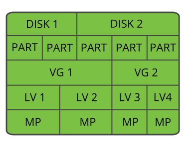
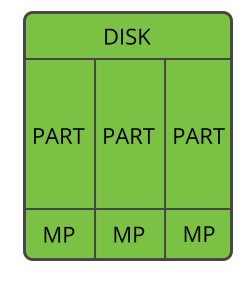

## disk mapping
1. Disk -> Partition -> Volume Group (VG) -> Logic Volume Mapping (LVM) -> Mapping Point (MP)

   
   * A Volume Group can map to multiple physical partitions
   * A Volume Group can split to multiple LVMs
   * A LVM mapping to a FS path
     ```
     
     ```
2. Disk -> Partition -> Mapping Point (MP)

   
   * A physical partition mapping to a fs path
   
3. Example

   ```
    # lsblk
    NAME            MAJ:MIN RM   SIZE RO TYPE MOUNTPOINT
    sda               8:0    0   1.8T  0 disk
    ├─sda1            8:1    0     1M  0 part
    ├─sda2            8:2    0   475M  0 part
    └─sda3            8:3    0   1.8T  0 part
      ├─centos-root 253:0    0   1.7T  0 lvm /root
      └─centos-swap 253:1    0    32G  0 lvm
    sdb               8:16   0 931.5G  0 disk
    ├─sdb1            8:17   0   512M  0 part /boot/efi
    └─sdb2            8:18   0   931G  0 part /
    sdc               8:32   0   1.8T  0 disk
    └─sdc1            8:33   0   1.8T  0 part /home1
    sdd               8:48   0 223.6G  0 disk
    └─sdd1            8:49   0 223.6G  0 part
   
     sda is a disk
     sda1, sda2 and sda3 are partitions
     centos is a VG, the VG splits to two LVM root and swap.
     lvm root maps to /root
     
     sdc is another disk, it has only one partition sbc mapped to /home1
   
     in /etc/fstab, can see the mount paths:
     LVM /dev/centos/root mount to /root
     PARTITON the UUID of /dev/sdc1 mount to /home1
   
     from output of df -h, can see the mapped FS paths:
     /dev/mapper/centos-root map to /root
     /dev/sdc1 map to /home1
   
     
   ```
   

## disk operation
* partition disk: ``` sudo fdisk /dev/sdb ```
* create a physical volume: ``` sudo pvcreate /dev/sdb1 ```
* create a volume group: ``` sudo vgcreate my_vg /dev/sdb1 ```
* create logical volumes: ``` sudo lvcreate -L 10G -n my_lv my_vg ```
* extend a volume group: ``` sudo vgextend my_vg /dev/sdc1 ```
* extend a LVM: ``` sudo lvextend -l +100%FREE /dev/my_vg/my_lv   |  sudo lvextend -L +5G /dev/my_vg/my_lv ```