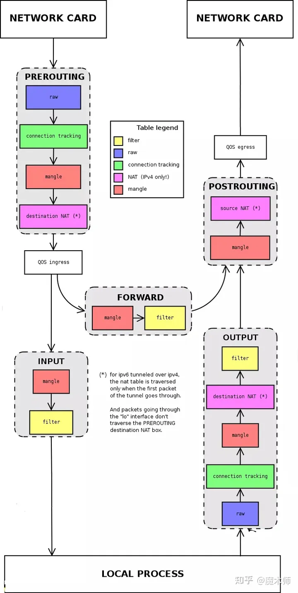

## ip rule ，iptables ,ip route 的过程
* iptables 和 ip route 是两个不同的工具，它们在不同的阶段执行不同的功能。ip route 是用来管理和控制
* ip route 是用来管理和控制路由表的，它决定了数据包应该从哪个网卡或网关发送出去。
  * linux 系统中，可以自定义从 1－252个路由表。其中，linux系统维护了4个路由表：
    * 0#表： 系统保留表
    * 253#表： defulte table 没特别指定的默认路由都放在改表
    * 254#表： main table 没指明路由表的所有路由放在该表
    * 255#表： local table 保存本地接口地址，广播地址、NAT地址 由系统维护，用户不得更改
  * ip route show table [table_num/name]
* ip rule：用于管理路由表的路由规则。
  * ip rule show table [table_num/name]
      ```
      # ip route show
      优先级  判断条件  动作    表ID
      0:    from all lookup local      // 任何源地址的包，都查询，local表
      32766:    from all lookup main
      32767:    from all lookup default
      ```
    
* iptables 是用来配置、管理和控制网络数据包的过滤、转发和转换的，它根据用户定义的规则对数据包进行检查、修改或丢弃。
  ```
  1.iptables中的“四表五链“
      A.“四表”是指，iptables的功能——filter, nat, mangle, raw.
  
      filter, 控制数据包是否允许进出及转发（INPUT、OUTPUT、FORWARD）,可以控制的链路有input, forward, output
  
      nat, 控制数据包中地址转换，可以控制的链路有prerouting, input, output, postrouting
  
      mangle,修改数据包中的原数据，可以控制的链路有prerouting, input, forward, output, postrouting
  
      raw,控制nat表中连接追踪机制的启用状况，可以控制的链路有prerouting, output
  
      注：在centos7中，还有security表，不过这里不作介绍
  
      B.“五链”是指内核中控制网络的NetFilter定义的五个规则链，分别为
  
      PREROUTING, 路由前
  
      INPUT, 数据包流入口
  
      FORWARD, 转发管卡
  
      OUTPUT, 数据包出口
  
      POSTROUTING, 路由后
  
  2.iptables命令的语法规则
      iptables [-t table] COMMAND [chain] CRETIRIA -j ACTION
  
      -t table，是指操作的表，filter、nat、mangle或raw, 默认使用filter
  
      COMMAND，子命令，定义对规则的管理
  
      chain, 指明链路
  
      CRETIRIA, 匹配的条件或标准
  
      ACTION,操作动作
  
      例如，不允许10.8.0.0/16网络对80/tcp端口进行访问，
  
      iptables -A INPUT -s 10.8.0.0/16 -d 172.16.55.7 -p tcp --dport 80 -j DROP
  
      查看iptables列表
  
      iptables -L -n
  
  3.规则管理
  　　     -A, --append chain rule-specification：追加新规则于指定链的尾部；
  
          -I, --insert chain [rulenum] rule-specification：插入新规则于指定链的指定位置，默认为首部；
  
          -R, --replace chain rulenum rule-specification：替换指定的规则为新的规则；
  
          -D, --delete chain rulenum：根据规则编号删除规则；
  
  4.查看规则　
  
  　　    -L, --list [chain]：列出规则；
  
         -v, --verbose：详细信息；
  
         -vv， -vvv 更加详细的信息
  
         -n, --numeric：数字格式显示主机地址和端口号；
  
         -x, --exact：显示计数器的精确值；
  
         --line-numbers：列出规则时，显示其在链上的相应的编号；
  
         -S, --list-rules [chain]：显示指定链的所有规则；
  ```
  


* 一般来说，ip route 先于 ip tables 执行，因为路由表是在内核中最先处理数据包的部分。
  * 当内核收到一个数据包时，它会先查看路由表，找到合适的出口网卡或网关，然后将数据包发送出去。
  * 在发送之前，内核会根据 iptables 中的规则对数据包进行过滤、转发或转换。
  * 例如，内核可能会根据 NAT 规则更改数据包中的源地址或目标地址，或者根据 filter 规则接受或丢弃数据包。
  * 当然，这只是一个简化的描述，实际上 ip tables 和 ip route 之间还有一些交互和顺序的细节。
  * 例如，ip tables 中有一些链可以在路由之前或之后对数据包进行处理，如 PREROUTING 和 POSTROUTING 链
    ```
    创建一个名为 mark 的自定义链:
    iptables -t mangle -N mark
    
    在 PREROUTING 链中跳转到 mark 链
    iptables -t mangle -A PREROUTING -j mark
    
    在 mark 链中给来自 192.168.1.0/24 的数据包打上 1 的标记
    iptables -t mangle -A mark -s 192.168.1.0/24 -j MARK --set-mark 1
    
    在 mark 链中给其他数据包打上 2 的标记
    iptables -t mangle -A mark -j MARK --set-mark 2
    
    (
      不创建mark链的话是不是直接用PREROUTING链：
      iptables -t mangle -A PREROUTING -s 192.168.1.0/24 -j MARK --set-mark 1
      iptables -t mangle -A PREROUTING -j MARK --set-mark 2
    )
    
    创建两个路由表 table1 和 table2
    echo “201 table1” >> /etc/iproute2/rt_tables echo “202 table2” >> /etc/iproute2/rt_tables
    
    在 table1 中添加默认路由为 eth0
    ip route add default dev eth0 table table1
    
    在 table2 中添加默认路由为 eth2
    ip route add default dev eth1 table table2
    
    添加两条路由策略，根据标记选择路由表
    ip rule add fwmark 1 table table1 
    ip rule add fwmark 2 table table2
    
    
    这样，当内核收到一个数据包时，它会先查看路由表，找到合适的出口网卡或网关，然后将数据包发送到 iptables 的 mangle 表的 PREROUTING 链。
    在这里，内核会根据数据包的源地址给它打上一个标记，然后将数据包重新送回路由表进行第二次路由。
    这次，内核会根据数据包的标记选择不同的路由策略和出口网卡，从而实现了按源地址分流的效果。
    
    另一个例子：
    iptables -t mangle -A FORWARD -i eth3 -p tcp --dport 80 -j MARK --set-mark 1 // eth3输入的HTTP协议数据，标记为 mark 1 
    iptables -t mangle -A FORWARD -i eth3 -p tcp --dport 25 -j MARK --set-mark 2  // eth3 输入的SMTP协议数据，标记为 mark 2
    iptables -t mangle -A FORWARD -i eth3 -p tcp --dport 110 -j MARK --set-mark 2  // eth3 输入的POP协议数据，标记为 mark 2
    iptables -t mangle -A FORWARD -i eth3 -j MARK --set-mark 3                    // eth3 输入的其他数据，标记为 mark 3
    ip rule add fwmark 1 table 1   // fwmark 1 的数据，使用 table 1
    ip rule add fwmark 2 table 2  
    ip rule add fwmark 3 table 3
    
    iptables -w -A POSTROUTING -t nat ! -o eth_1 -s 192.168.1.123 -j MASQUERADE  (改源地址为eth_1的地址)
    iptables -t nat -A POSTROUTING -s 10.8.0.0/255.255.255.0 -o eth0 -j SNAT –to-source 192.168.5.3-192.168.5.5 （改源地址）
    iptables -w -A PREROUTING -t nat -p tcp -i eth_1 -d 192.168.3.123 --dport 8080 -j DNAT --to-destination 192.168.3.111 （改目标地址）

    多个端口禁用
    iptables -I INPUT_DATA -d 172.16.0.7 -p tcp -m multiport --dports 22,80,139,445,3306 -j ACCEPT
    连续ip禁用
    # iptables -I INPUT -d 172.16.0.7 -p tcp -m multiport --dports 22,80,139,445,3306 -m iprange --src-range 172.16.0.61-172.16.0.70 -j REJECT
    禁非主动建立连接的forward
    # iptables -I FORWARD -o eth0 -m state ! --state RELATED,ESTABLISHED -j REJECT
    ```
* net.ipv4.conf.eth0.route_localnet的作用
  ```
  默认情况下不能将本机的请求跳转/转发到回环接口上
  例如：iptables -t nat -I PREROUTING -p tcp -d 192.168.1.0/24 --dport 2222 -j DNAT --to-destination 127.0.0.1:2222 是不生效的
  需要sysctl -w net.ipv4.conf.eth0.route_localnet=1 开启route_localnet后，数据包就可以在lo上做nat
  
  永久开启：
  echo "net.ipv4.conf.eth0.route_localnet=1" >> /etc/sysctl.conf
  sysctl -p
  ```