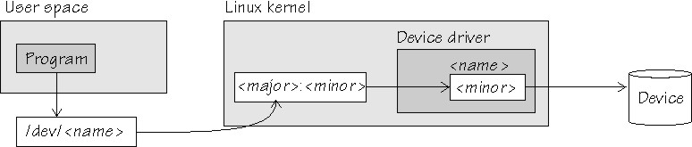

* useful commands
  * curl -k -s --tlsv1.3 --tls-max 1.3 -v <url> -o /dev/null
  * Linux查看硬盘（fdisk | lsblk）
    ```
    # fdisk -l /dev/sda
    Disk /dev/sda：1.84 TiB，2000398934016 字节，3907029168 个扇区
    Disk model: ST2000NX0253
    单元：扇区 / 1 * 512 = 512 字节
    扇区大小(逻辑/物理)：512 字节 / 4096 字节
    I/O 大小(最小/最佳)：4096 字节 / 4096 字节
    磁盘标签类型：gpt
    磁盘标识符：27E8F38B-1909-4730-B931-D399FF19A594
    设备 起点 末尾 扇区 大小 类型
    /dev/sda1 2048 4095 2048 1M BIOS 启动
    /dev/sda2 4096 976895 972800 475M Microsoft 基本数据
    /dev/sda3 976896 3726032895 3725056000 1.8T Linux LVM

    # lsblk
    NAME            MAJ:MIN RM   SIZE RO TYPE MOUNTPOINT
    sda               8:0    0   1.8T  0 disk
    ├─sda1            8:1    0     1M  0 part
    ├─sda2            8:2    0   475M  0 part
    └─sda3            8:3    0   1.8T  0 part
      ├─centos-root 253:0    0   1.7T  0 lvm
      └─centos-swap 253:1    0    32G  0 lvm
    sdb               8:16   0 931.5G  0 disk
    ├─sdb1            8:17   0   512M  0 part /boot/efi
    └─sdb2            8:18   0   931G  0 part /
    sdc               8:32   0   1.8T  0 disk
    └─sdc1            8:33   0   1.8T  0 part /home1
    sdd               8:48   0 223.6G  0 disk
    └─sdd1            8:49   0 223.6G  0 part
    ```
    * All devices are managed under /dev folder
    * major number: identify the driver associated with the device. 
    * Kernel uses the major number at open time to dispatch execution to the appropriate driver. 
      * /proc/devices
        ```
        cat /proc/devices
        Character devices:
        1 mem
        4 tty
        4 ttyS
        5 /dev/tty
        5 /dev/console
        7 vcs
        
        Block devices:
        8 sd
        ```
      * For example /dev/null and /dev/zero are both managed by driver 1
        ```
        ls -al /dev/zero
        crw-rw-rw- 1 root root 1, 5 Jun  7 21:34 /dev/zero
        ```
      * whereas virtual consoles and serial terminals are managed by driver 4. 
    * minor number: refers to an instance, which is used by the driver itself, specified by the major number. 
    * minor number is used for driver to identify the difference between devices.

      
    
  * 查看磁盘剩余空间信息
    ```
    # df -hl
    文件系统              容量 已用 可用 已用% 挂载点
    Filesystem            Size Used Avail Use% Mounted on
    /dev/hda2              45G   19G   24G 44% /
    /dev/hda1             494M   19M 450M   4% /boot
    /dev/hda6             4.9G 2.2G 2.5G 47% /home
    /dev/hda5             9.7G 2.9G 6.4G 31% /opt
    none                 1009M     0 1009M   0% /dev/shm
    /dev/hda3             9.7G 7.2G 2.1G 78% /usr/local
    /dev/hdb2              75G   75G     0 100% /
    /dev/hdb2              75G   75G     0 100% /
    
    
    
    更多命令
    df -h 查看每个根路径的分区大小
    du -sh [目录名] 返回该目录的大小
    du -sm [文件夹] 返回该文件夹总M数
    du -hd 1  当前目录下子目录和文件的大小
      # 相当于 du --max-depth=1 -h
    ```