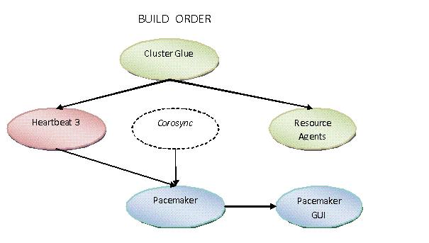

# Corosync+Pacemaker

## Corosync
* 配置
  * 配置文件详解
    ```
    [root@Clone3 ~]# vim /etc/corosync/corosync.conf
    totem {       
            version: 2                //版本号
            crypto_cipher: none        
            crypto_hash: none
            secauth：on      //是否开启认证
            thread：0        //实现认证时，并发线程数，0表示默认 线程数 0 表示不基于线程模式工作而是进程
            interface {
                    ringnumber: 0      //环号码，为这个网卡定义一个唯一的环号码，以避免心跳信息环发送
                    bindnetaddr: 192.168.1.0    //绑定的网络地址
                    mcastaddr: 239.255.1.1      //广播地址
                    mcastport: 5405            //广播端口
                    ttl: 1                     //只向外播一次
            }
    }
    logging {
            fileline: off
            to_stderr: no
            to_logfile: yes
            logfile: /var/log/cluster/corosync.log
            to_syslog: yes        debug: off
            timestamp: on
            logger_subsys {
                    subsys: QUORUM                debug: off
            }       
    }  
    //添加如下行 使pacemaker 以corosync插件方式运行 
    service {               //定义一个服务来启动pacemaker
        ver: 0              //定义版本
        name: pacemaker    //这个表示启动corosync时会自动启动pacemaker}
    aisexec {                 //表示以哪个用户的身份去运行
        user: root
        group: root         
    }

    quorum {
    
    }
    nodelist {
       node {
    
       }
       node {
    
       }
    }


    ```
  * 使用命令生成corosync密钥，并复制到各个节点
    ```
    [root@Clone3 ~]# corosync-keygen
    [root@Clone3 ~]# scp /etc/corosync/authkey root@Clone2:/etc/corosync/
    ```
  * 复制corosync配置文件到各个节点
    ```
    [root@Clone3 ~]# scp /etc/corosync/corosync.conf root@Clone2:/etc/corosync/corosync.conf
    ```
  * 查看安装corosync生成的文件
    * /usr/lib/ocf
    ```
    rpm -ql corosync
    ```
  * 启动和停止
    ```
    /usr/share/corosync/corosync start
    /usr/share/corosync/corosync stop

    /usr/sbin/corosync-notifyd -f $OPTIONS
    ```
## Pacemaker
* 由来
  * Heartbeat 3.0拆分之后的组成部分：
    * Heartbeat：将原来的消息通信层独立为heartbeat项目，新的heartbeat只负责维护集群各节点的信息以及它们之前通信；
    * Cluster Glue：相当于一个中间层，它用来将heartbeat和pacemaker关联起来，主要包含2个部分，即为LRM和STONITH。
    * Resource Agent：用来控制服务启停，监控服务状态的脚本集合，这些脚本将被LRM调用从而实现各种资源启动、停止、监控等等。
    * Pacemaker : 也就是Cluster Resource Manager （简称CRM），用来管理整个HA的控制中心，客户端通过pacemaker来配置管理监控整个集群。
      
  * /var/lib/pacemaker/cib/cib.xml
  ```
  Open Cluster Framework (OCF)
  Cluster Information Base (CIB)
  Open Compute Project (OCP)
  ```
  

* 启动
  * /usr/sbin/pacemakerd -f  /  /usr/sbin/pacemakerd -V

* crmsh命令
  * RHEL自6.4起不再提供集群的命令行配置工具crmsh，转而使用pcs；所以如果想使用crmsh可以自行安装：下载并安装crmsh，p
    ```
    [root@Clone3 ~]# yum install pssh-2.3.1-2.el6.x86_64.rpm crmsh-1.2.6-4.el6.x86_64.rpm
    ```
  * cibadmin -Q
  * crm_mon
  * crm_resource
  * crm_verify -L -V
  * crm status
  * crm configure property stonith-enabled=false
  * crm configure show
  * crm ra classes # 查看当前集群系统所支持resource_agent的类型
  * 如果想要查看某种类别下的所用资源代理的列表，可以使用类似如下命令实现：
    * crm ra list lsb
    * crm ra list ocf heartbeat
    * crm ra list ocf pacemaker
    * crm ra list stonith
    * crm ra list systemd
    * crm ra info [class:[provider:]]resource_agent
  * 其他
    ```
    以下列表提供了一些与群集管理相关的任务，并简要介绍了完成这些任务所使用的工具：
  
    监视群集的状态
    crm_mon 命令可用于监视您的群集状态和配置。其输出包括节点数、uname、UUID、状态、群集中配置的资源及其各自的当前状态。crm_mon 的输出可显示在控制台上或打印到 HTML 文件。当具有不包含状态部分的群集配置文件时，crm_mon 会按文件中所指定的方式创建节点和资源概览。有关对此工具的用法及命令语法的详细介绍，请
    
    管理 CIB
    cibadmin 命令是用于操作 CIB 的低级管理命令。它可用于转储、更新和修改全部或部分 CIB，删除整个 CIB 或执行其他 CIB 管理操作。有关对此工具的用法及命令语法的详细介绍，
    
    管理配置更改
    crm_diff 命令可帮助您创建和应用 XML 增补程序。这对可视化两个版本的群集配置之间的更改或保存更改可能非常有用，以便以后使用 cibadmin 应用更改。有关对此工具的用法及命令语法的详细介绍，
    
    操作 CIB 属性
    您可以使用 crm_attribute 命令来查询和操作 CIB 中使用的节点属性和群集配置选项。有关对此工具的用法及命令语法的详细介绍，
    
    验证群集配置
    crm_verify 命令可检查配置数据库 (CIB) 的一致性和其他问题。它可检查包含配置的文件或连接到运行中的群集。它可报告两类问题。虽然警告解决方法已经传达到管理员，但是必须先修复错误，High Availability Extension 才能正常工作。crm_verify 可帮助创建新的或已修改的配置。您可以本地复制运行的群集中的 CIB，编辑它，使用 crm_verify 验证它，然后使用 cibadmin 使新配置生效。有关对此工具的用法及命令语法的详细介绍，
    
    管理资源配置
    crm_resource 命令可在群集上执行各种资源相关的操作。它可以修改已配置资源的定义，启动和停止资源，删除资源或在节点间迁移资源。有关对此工具的用法及命令语法的详细介绍，
    
    管理资源故障计数
    crm_failcount 命令可查询指定节点上每个资源的故障计数。此工具还可用于重设置故障计数，同时允许资源在它多次失败的节点上再次运行。有关对此工具的用法及命令语法的详细介绍，
    
    管理节点的备用状态
    crm_standby 命令可操作节点的备用属性。备用模式中的所有节点都不再具备主管资源的资格，并且必须移动那里的所有资源。备用模式对执行维护任务（如内核更新）非常实用。从节点删除备用属性，使之再次成为群集中完全处于活动状态的成员。有关对此工具的用法及命令语法的详细介绍，
    ```
  * 一级子命令
    ```
    [root@node-1 corosync]# crm  
    crm(live)# help  
    This is crm shell, a Pacemaker command line interface.  
    Available commands:  
    cib              manage shadow CIBs //cib沙盒  
    resource         resources management //所有的资源都在这个子命令后定义  
    configure        CRM cluster configuration //编辑集群配置信息  
    node             nodes management //集群节点管理子命令  
    options          user preferences //用户优先级  
    history          CRM cluster history //命令历史记录  
    site             Geo-cluster support  
    ra               resource agents information center //资源代理子命令（所有与资源代理相关的程都在此命令之下）  
    status           show cluster status //显示当前集群的状态信息  
    help,?           show help (help topics for list of topics)//查看当前区域可能的命令  
    end,cd,up        go back one level //返回第一级crm(live)
    quit,bye,exit    exit the program //退出crm（live）交互模式
    ```
  * resource资源状态控制子命令
    ```
    crm(live)resource# help  
    vailable commands:  
    status           show status of resources //显示资源状态信息  
    start            start a resource //启动一个资源  
    stop             stop a resource //停止一个资源  
    restart          restart a resource //重启一个资源  
    promote          promote a master-slave resource //提升一个主从资源  
    demote           demote a master-slave resource //降级一个主从资源  
    manage           put a resource into managed mode  //将一个资源加入到管理模式下  
    unmanage         put a resource into unmanaged mode  //从管理模式下去除一个资源  
    migrate          migrate a resource to another node //将资源迁移到另一个节点上  
    unmigrate        unmigrate a resource to another node  
    param            manage a parameter of a resource //管理资源的参数  
    secret           manage sensitive parameters //管理敏感参数  
    meta             manage a meta attribute //管理源属性  
    utilization      manage a utilization attribute  
    failcount        manage failcounts //管理失效计数器  
    cleanup          cleanup resource status //清理资源状态  
    refresh          refresh CIB from the LRM status //从LRM（LRM本地资源管理）更新CIB（集群信息库），在  
    reprobe          probe for resources not started by the CRM //探测在CRM中没有启动的资源  
    trace            start RA tracing //启用资源代理（RA）追踪  
    untrace          stop RA tracing //禁用资源代理（RA）追踪  
    help             show help (help topics for list of topics) //显示帮助  
    end              go back one level //返回一级（crm(live)#）
    quit             exit the program //退出交互式程序 
    ```
  * configure资源定义子命令
    ```
    crm(live)configure# help  
    Available commands:  
    node             define a cluster node //定义一个集群节点  
    primitive        define a resource //定义资源  
    monitor          add monitor operation to a primitive //对一个资源添加监控选项（如超时时间，启动失败后的操作）  
    group            define a group //定义一个组类型（将多个资源整合在一起）  
    clone            define a clone //定义一个克隆类型（可以设置总的克隆数，每一个节点上可以运行几个克隆）  
    ms               define a master-slave resource //定义一个主从类型（集群内的节点只能有一个运行主资源，其它从的做备用）  
    rsc_template     define a resource template //定义一个资源模板  
    location         a location preference //定义位置约束优先级（默认运行于那一个节点（如果位置约束的值相同，默认倾向性那一个高，就在那一个节点上运行））  
    colocation       colocate resources //排列约束资源（多个资源在一起的可能性）  
    order            order resources //资源的启动的先后顺序  
    rsc_ticket       resources ticket dependency  
    property         set a cluster property //设置集群属性  
    rsc_defaults     set resource defaults //设置资源默认属性（粘性）  
    fencing_topology node fencing order //隔离节点顺序  
    role             define role access rights //定义角色的访问权限  
    user             define user access rights //定义用用户访问权限  
    op_defaults      set resource operations defaults //设置资源默认选项  
    schema           set or display current CIB RNG schema  
    show             display CIB objects //显示集群信息库对  
    edit             edit CIB objects //编辑集群信息库对象（vim模式下编辑）  
    filter           filter CIB objects //过滤CIB对象  
    delete           delete CIB objects //删除CIB对象  
    default-timeouts set timeouts for operations to minimums from the meta-data  
    rename           rename a CIB object //重命名CIB对象  
    modgroup         modify group //改变资源组  
    refresh          refresh from CIB //重新读取CIB信息  
    erase            erase the CIB //清除CIB信息  
    ptest            show cluster actions if changes were committed  
    rsctest          test resources as currently configured  
    cib              CIB shadow management  
    cibstatus        CIB status management and editing    //cib状态管理和编辑  
    template         edit and import a configuration from a template   //编辑或导入配置模板  
    commit           commit the changes to the CIB //将更改后的信息提交写入CIB  
    verify           verify the CIB with crm_verify //CIB语法验证  
    upgrade          upgrade the CIB to version 1.0 //升级CIB到1.0  
    save             save the CIB to a file //将当前CIB导出到一个文件中（导出的文件存于切换crm 之前的目录）  
    load             import the CIB from a file //从文件内容载入CIB  
    graph            generate a directed graph  
    xml              raw xml  
    help             show help (help topics for list of topics) //显示帮助信息  
    end              go back one level //回到第一级(crm(live)#)  
    quit             exit the program  //退出crm交互模式 
    ```
  * node节点管理子命令
    ```
    crm(live)# node  
    crm(live)node# help  
    Node management and status commands.  
    Available commands:  
    status           show nodes status as XML //以xml格式显示节点状态信息  
    show             show node //命令行格式显示节点状态信息  
    standby          put node into standby //模拟指定节点离线（standby在后面必须的FQDN）  
    online           set node online // 节点重新上线  
    maintenance      put node into maintenance mode  //将一个节点状态改为maintenance  
    ready            put node into ready mode   //将一个节点状态改为ready  
    fence            fence node //隔离节点  
    clearstate       Clear node state //清理节点状态信息  
    delete           delete node //删除 一个节点  
    attribute        manage attributes  
    utilization      manage utilization attributes  
    status-attr      manage status attributes  
    help             show help (help topics for list of topics)  
    end              go back one level  //回到上一次  
    quit             exit the program    //退出
    ```
  * ra资源代理子命令
    ```
    crm(live)# ra  
    crm(live)ra# help  
    Available commands:  
    classes          list classes and providers //为资源代理分类  
    list             list RA for a class (and provider)//显示一个类别中的提供的资源  
    meta             show meta data for a RA //显示一个资源代理序的可用参数（如meta ocf:heartbeat:IPaddr2）  
    providers        show providers for a RA and a class  
    help             show help (help topics for list of topics)  
    end              go back one level  
    quit             exit the program 
    ```
  * 命令实列
    * 系统资源查看
      ```
      crm(live)ra# classes   //系统所使用的资源代理  
      lsb  
      ocf / heartbeat pacemaker  
      service  
      stonith
      ```
    * 默认系统资源列表
      ```
      crm(live)ra# list ocf   //列表默认系统资源  
      CTDB               ClusterMon         Delay              Dummy              Filesystem         HealthCPU  
      IPaddr             IPaddr2            IPsrcaddr          HealthCPU          HealthSMART        HealthSMART  
      LVM                MailTo             Route              SendArp            Squid  
      Stateful           SysInfo            SystemHealth       VirtualDomain      Xinetd  
      apache             conntrackd         controld           db2                dhcpd  
      ethmonitor         exportfs           iSCSILogicalUnit   mysql              named  
      nfsnotify          nfsserver          pgsql              ping               pingd  
      postfix            remote             rsyncd             symlink            tomcat
      ```
    * 查看外加的系统资源
      ```
      crm(live)ra# list lsb  //列表外加的系统资源  
      NetworkManager     abrt-ccpp          abrt-oops          abrtd              acpid  
      atd                auditd             autofs             blk-availability   certmonger  
      corosync           corosync-notifyd   cpuspeed           crond              cups  
      dnsmasq            firstboot          haldaemon          halt               hsqldb  
      ip6tables          iptables           irqbalance         jexec              kdump  
      killall            lvm2-lvmetad       lvm2-monitor       mdmonitor          messagebus  
      mysqld             netconsole         netfs              network            nfs  
      nfslock            nginx              nmb                ntpd               ntpdate  
      oddjobd            openfire           pacemaker          php-fpm            portreserve  
      postfix            psacct             quota_nld          rdisc              redis  
      restorecond        rngd               rpcbind            rpcgssd            rpcidmapd  
      rpcsvcgssd         rsyslog            sandbox            saslauthd          single  
      slapd              smartd             smb                snmpd              snmptrapd  
      spice-vdagentd     sshd               sssd               sysstat            udev-post  
      vsftpd             wdaemon            winbind            wpa_supplicant     ypbind
      ```
    * 查看系统资源的参数
      ```
      crm(live)ra# meta ocf:heartbeat:IPaddr //查看系统资源IPaddr的参数
      Manages virtual IPv4 and IPv6 addresses (Linux specific version) (ocf:heartbeat:IPaddr)

      This Linux-specific resource manages IP alias IP addresses.
      It can add an IP alias, or remove one.
      In addition, it can implement Cluster Alias IP functionality
      if invoked as a clone resource.
      
      If used as a clone, you should explicitly set clone-node-max >= 2,
      and/or clone-max < number of nodes. In case of node failure,
      clone instances need to be re-allocated on surviving nodes.
      This would not be possible if there is already an instance on those nodes,
      and clone-node-max=1 (which is the default).
      
      Parameters (*: required, []: default):
      
      ip* (string): IPv4 or IPv6 address
      The IPv4 (dotted quad notation) or IPv6 address (colon hexadecimal notation)
      example IPv4 “192.168.1.1”.
      example IPv6 “2001:db8:DC28:0:0:FC57:D4C8:1FFF”.
      ```
    * 属性修改
      ```
      crm(live)configure# property stonith-enabled=false //禁用stonith-enable
      crm(live)configure# property no-quorum-policy=ignore //忽略投票规则
      ```
    * 资源的三种约束
      ```
      crm(live)configure# colocation  #排列约束，指定哪些资源捆绑一起，在同一节点上运行
      crm(live)configure# order       #指定排列约束中的资源启动顺序，该顺序和colocation顺序相反
      crm(live)configure# location    #位置约束，指定资源首选在哪些节点上运行
      ```
    * 定义一资源所使用的命令
     ```
     /**
       * primitive:定义一资源所使用的命令
       * webip:为资源起一个名字
       * ocf:heartbeat;IPaddr：所使用资源代理的类别，由谁提供的那一个代理程序
       * op monitor 对webip做监控
       * interval:间隔时间
       * timeout：超时时间
       * on-fail：失败自起
       */  
     crm(live)configure# primitive webip ocf:heartbeat:IPaddr params ip=192.168.10.130 op monitor interval=30s timeout=20s on-fail=restart
     ```
    * 定义排列约束
      ```
      /** 
        * 定义排列约束
        * colocation：排列约束命令
        * nginx_web : 约束名
        * inf:#(可能性，inf表示永久在一起，也可以是数值)
        * webip nginx_res：#资源名称
        */  
        crm(live)configure# colocation nginx_web inf: nginx_res webip
      ```
    * 定义资源启动顺序
      ```
      /**
        * 定义节点权重
        * location：节点权重命令
        * webip_and_webnfs_and_webserver：约束名称
        * webip 500: node1：webip这个资源的node1节点的权重是500
        */  
        crm(live)configure# location webip_and_webnfs_and_webserver webip 500: node1
      ```
    * 定义默认资源属性
      ```
      /**
        * 定义默认资源属性
        * rsc_defaults：默认资源
        * 这样定义代表集群中每一个资源的默认权重，只有当资源服务不在当前节点时，权重才会生效，比如，这里我定义了三个资源webip、webnfs、webserver，对每一个资源的权重为100，那么加在一起就变成了300,之前己经定义node1的位置约束的值为500，当node1宕机后，重新上线，这样就切换到node1上了。
        */  
      crm(live)configure# rsc_defaults resource-stickiness=100
      ```
    * 删除资源或者节点
      ```
      crm(live)configure# delete nginx_res  //删除一个资源，约束，排序，组等  
      crm(live)node# delete node1  //删除一个节
      ```
    * 资源其他
      ```
      crm(live)configure# verify //审核  
      crm(live)configure# commit //提交  
      crm(live)configure# show //显示
      ```
    * 节点挂起和在线
      ```
      crm(live)node# standby node1   //节点挂起  
      crm(live)node# online node1    //节点上线
      ```
    * 查看和设置resource属性
      ```
      crm resource param <resource> show <prop>
      crm resource param <resource> set <prop> <value>
      ```
    * 查看和设置resource failcount
      ```
      crm resource failcount <resource> show <node>
      crm resource failcount <resource> set <node> <count-value>

      当您创建资源时，您可以通过为该资源设置 migration-threshold 选项来配置资源，
      使其在定义多个故障后移至新节点。达到阈值后，这个节点将不再被允许运行失败的资源，直到：
          管理员使用 pcs resource failcount 命令手动重置资源的故障计数。
          达到资源的 failure-timeout 值。
      migration-threshold 的值默认设置为 INFINITY。INFINITY 在内部被定义为一个非常大但有限的数字。值 0 会禁用 migration-threshold 功能。
      # pcs resource meta dummy_resource migration-threshold=10
      # pcs resource defaults migration-threshold=10
      
      # crm resource meta apache show migration-threshold
      # crm resource meta  apache set migration-threshold <value>
      
      Simply define migration-threshold=N for a resource and it will migrate to a new node after N failures. 
      There is no threshold defined by default. 
      To determine the resource’s current failure status and limits, run crm_mon --failcounts.
      
      By default, once the threshold has been reached, 
      the troublesome node will no longer be allowed to run the failed resource until the administrator manually resets the resource’s failcount using crm_failcount (after hopefully first fixing the failure’s cause).
      Alternatively, it is possible to expire them by setting the failure-timeout option for the resource.
      
      For example, a setting of migration-threshold=2 and failure-timeout=60s would cause the resource to move to a new node after 2 failures,
      and allow it to move back (depending on stickiness and constraint scores) after one minute.
      
      There are two exceptions to the migration threshold concept: when a resource either fails to start or fails to stop.
          If the cluster property start-failure-is-fatal is set to true (which is the default), 
          start failures cause the failcount to be set to INFINITY and thus always cause the resource to move immediately.
      
          Stop failures are slightly different and crucial. If a resource fails to stop and STONITH is enabled, 
          then the cluster will fence the node in order to be able to start the resource elsewhere. 
          If STONITH is not enabled, then the cluster has no way to continue and will not try to start the resource elsewhere, 
          but will try to stop it again after the failure timeout.
      ```
    * 获取resource
      ```
      cibadmin --query --xpath "//clone[@id='xxxx']/primitive[@id]"
      ```
    * 移动resource
      ```
      crm_resource --resource myResource --move --node altNode
      
      crm_resource --resource myResource --move --lifetime=P0Y0M0DT0H2M --node altNode 
        ban myResource on current node for 2 minutes 
      ```
      * example
        ```
        # crm resource move WebSite pcmk-1
        # crm_mon
        ============
        Last updated: Fri Aug 28 16:19:24 2009
        Stack: openais
        Current DC: pcmk-2 - partition with quorum
        Version: 1.1.5-bdd89e69ba545404d02445be1f3d72e6a203ba2f
        2 Nodes configured, 2 expected votes
        2 Resources configured.
        ============
        
        Online: [ pcmk-1 pcmk-2 ]
        
        ClusterIP    (ocf::heartbeat:IPaddr):    Started pcmk-1
        WebSite    (ocf::heartbeat:apache):    Started pcmk-1
        ```
        * Notice how the colocation rule we created has ensured that ClusterIP was also moved to pcmk-1. 
        * For the curious, we can see the effect of this command by examining the configuration
          ```
          # crm configure show
          node pcmk-1
          node pcmk-2
          primitive WebSite ocf:heartbeat:apache \
          params configfile="/etc/httpd/conf/httpd.conf" \
          op monitor interval="1min"
          primitive ClusterIP ocf:heartbeat:IPaddr2 \
          params ip="192.168.122.101" cidr_netmask="32" \
          op monitor interval="30s"
          location cli-prefer-WebSite WebSite \
          rule $id="cli-prefer-rule-WebSite" inf: #uname eq pcmk-1
          location prefer-pcmk-1 WebSite 50: pcmk-1
          colocation website-with-ip inf: WebSite ClusterIP
          property $id="cib-bootstrap-options" \
          dc-version="1.1.5-bdd89e69ba545404d02445be1f3d72e6a203ba2f" \
          cluster-infrastructure="openais" \
          expected-quorum-votes="2" \
          stonith-enabled="false" \
          no-quorum-policy="ignore"
          rsc_defaults $id="rsc-options" \
          resource-stickiness="100"
          ```
          * [rule $id="cli-prefer-rule-WebSite" inf: #uname eq pcmk-1] is the automated constraint used to move the resources to pcmk-1
        * Giving Control Back to the Cluster: it remove the automated constraint above, and the resources are still active on pcmk-1.
          ```
          # crm resource unmove WebSite
          ```
      * update cib
        ```
        #crm -F -w configure load update <file>
        ```
    * 查看cluster里的nodes和node的status
      ```
      crmadmin -N
      crmadmin -S <node_name>
      ```
    * 和pcs命令比较
      ```
      一.概念
      
      1.crmsh
      
      This project is not part of the GNU Project.
      
      Pacemaker command line interface for management and configuration
      
      crmsh不属于GNU,是管理pacemaker的命令行界面,最新版本v1.2.6 RC 3 2013-8-29日发布
      
      crmsh支持自动补全
      
      2.pcs
      
      PCS - Pacemaker/Corosync configuration system
      
      专用于pacemaker+corosync的设置工具,有CLI和web-based GUI界面
      
      二.命令比较
      
      显示集群设置
      crmsh # crm configure show  // # cibadmin --query > tmp.xml  // cibadmin --replace --xml-file tmp.xml
      pcs   # pcs cluster cib xxxx.xml   // pcs cluster cib-push xxxx.xml
      显示集群状态
      crmsh # crm_mon -1    / crm_mon -Afr1
      pcs   # pcs status
      挂起节点
      crmsh # crm node standby
      pcs   # pcs cluster standby pcmk-1
      crmsh # crm node online
      pcs   # pcs cluster unstandby pcmk-1
      设置option
      crmsh # crm configure property stonith-enabled=false
      pcs   # pcs property set stonith-enabled=false
      列出可用资源
      crmsh # crm ra classes
      pcs   # pcs resource standards
      crmsh # crm ra list ocf pacemaker
      pcs   # pcs resource agents ocf:pacemaker
      创建资源
      crmsh # crm configure primitive ClusterIP ocf:heartbeat:IPaddr2 \
      params ip=192.168.122.120 cidr_netmask=32 \
      op monitor interval=30s
      pcs   # pcs resource create ClusterIP IPaddr2 ip=192.168.0.120 cidr_netmask=32
      开启资源
      crmsh # crm resource start ClusterIP
      pcs   # pcs resource start ClusterIP
      关闭资源
      crmsh # crm resource stop ClusterIP
      pcs   # pcs resource stop ClusterIP
      删除资源
      crmsh # crm configure delete ClusterIP
      pcs   #
      更新资源
      crmsh # crm configure edit ClusterIP
      pcs   # pcs resource update ClusterIP clusterip_hash=sourceip
      显示资源
      crmsh #
      pcs   # pcs resource show WebFS
      资源默认属性
      crmsh # crm configure rsc_defaults resource-stickiness=100
      pcs   # pcs resource rsc defaults resource-stickiness=100
      pcs   # pcs resource rsc defaults(列出defaults)
      操作的默认属性
      crmsh # crm configure op_defaults timeout=240s
      pcs   # pcs resource op defaults timeout=240s
      pcs # pcs resource op defaults
      资源间关系
      crmsh # crm configure colocation website-with-ip INFINITY: WebSite ClusterIP
      pcs   # pcs constraint colocation add WebSite ClusterIP INFINITY
      资源顺序
      crmsh # crm configure order apache-after-ip mandatory: ClusterIP WebSite
      pcs   # pcs constraint order ClusterIP then WebSite
      节点粘性
      crmsh # crm configure location prefer-pcmk-1 WebSite 50: pcmk-1
      pcs   # pcs constraint location WebSite prefers pcmk-1=50
      移动资源
      crmsh # crm resource move WebSite pcmk-1
      pcs   # pcs resource move WebSite pcmk-1
      crmsh # crm resource unmove WebSite
      pcs   # pcs resource unmove WebSite
      创建克隆资源
      crmsh # configure clone WebIP ClusterIP meta globally-unique="true" clone-max="2" clone-node-max="2"
      pcs   # pcs resource clone ClusterIP globally-unique=true clone-max=2 clone-node-max=2
      创建主从资源
      crmsh # crm configure ms WebDataClone WebData \
      meta master-max=1 master-node-max=1 \
      clone-max=2 clone-node-max=1 notify=true
      pcs   # pcs resource master WebDataClone WebData \
      master-max=1 master-node-max=1 clone-max=2 clone-node-max=1 \
      notify=true
      脚本
      crmsh # crm
      crmsh # cib new drbd_cfg
      crmsh # configure primitive WebData ocf:linbit:drbd params drbd_resource=wwwdata \
      op monitor interval=60s
      crmsh # configure ms WebDataClone WebData meta master-max=1 master-node-max=1 \
      clone-max=2 clone-node-max=1 notify=true
      crmsh # cib commit drbd_cfg
      crmsh # quit
      pcs   # pcs cluster cib drbd_cfg
      pcs   # pcs -f drbd_cfg resource create WebData ocf:linbit:drbd drbd_resource=wwwdata \
      op monitor interval=60s
      pcs   # pcs -f drbd_cfg resource master WebDataClone WebData master-max=1 master-node-max=1 \
      clone-max=2 clone-node-max=1 notify=true
      pcs   # pcs cluster push cib drbd_cfg
      ```
