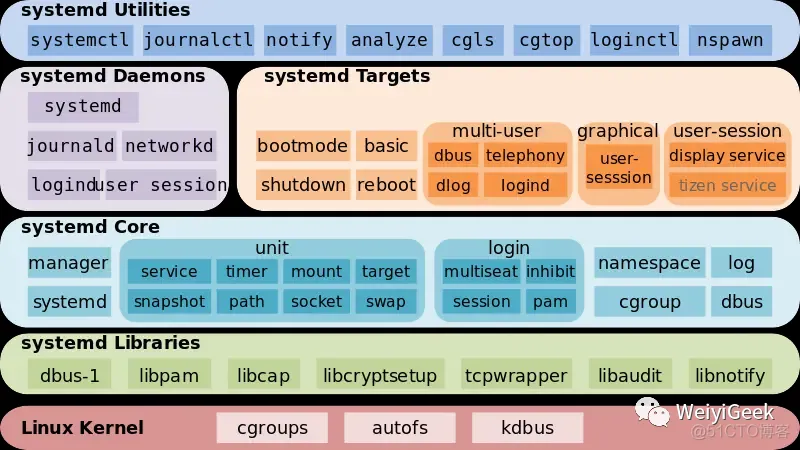

# systemd

## 采用systemd管理
* systemd所管理的所有系统资源都称作Unit
* 通过systemd命令集可以方便的对这些Unit进行管理. 比如systemctl、hostnamectl、timedatectl、localctl等命令
* systemd: a system daemon 是内核启动后的第一个用户进程，PID 为1，是所有其它用户进程的父进程(相当于以前的init进程)。
  ```
  > ls -al /sbin/init
  xxxx /sbin/init -> /usr/lib/systemd/systemd
  ```
* systemd 特点
  * 支持并行化任务；
  * 同时采用 socket 式与 D-Bus 总线式激活服务；
  * 按需启动守护进程（daemon）；
  * 利用 Linux 的 cgroups 监视进程；比如systemctl 显示 CPU 和 Mem 信息就是基于此。
  * 支持快照和系统恢复；
  * 维护挂载点和自动挂载点；
  * 各服务间基于依赖关系进行精密控制。
  * systemd* 支持 SysV 和 LSB 初始脚本，可以替代 sysvinit。
  * 除此之外功能还包括日志进程、控制基础系统配置，维护登陆用户列表以及系统账户、运行时目录和设置，可以运行容器和虚拟机，可以简单的管理网络配置、网络时间同步、日志转发和名称解析等。
  * 最新系统都采用systemd管理（RedHat7，CentOS7，Ubuntu15…）
  * CentOS7 支持开机并行启动服务，显著提高开机启动效率
  * CentOS7关机只关闭正在运行的服务，而CentOS6，全部都关闭一次。
  * CentOS7服务的启动与停止不再使用脚本进行管理，也就是/etc/init.d下不在有脚本。
  * CentOS7使用systemd解决原有模式缺陷，比如原有service不会关闭程序产生的子进程。
* systemd 体系架构
  1.最底层：systemd 内核层面依赖 cgroup、autofs、kdbus
  2.第二层：systemd libraries是 systemd 依赖库
  3.第三层：systemd Core是 systemd 自己的库
  4.第四层：systemd daemons以及 targets 是自带的一些基本 unit、target，类似于 sysvinit 中自带的脚本
  5.最上层就是和 systemd 交互的一些工具，比如我们下面将要学习的systemctl;

  
* systemd 语法
    ```
    systemctl   [command]    [unit]（配置的应用名称）
    
    command可选项·
    start：启动指定的unit         systemctl start nginx
    stop：关闭指定的unit          systemctl stop nginx
    restart：重启指定unit         systemctl restart nginx
    reload：重载指定unit          systemctl reload nginx
    enable：系统开机时自动启动指定unit，前提是配置文件中有相关配置 systemctl enable nginx
    disable：开机时不自动运行指定unit  systemctl disable nginx
    status：查看指定unit当前运行状态   systemctl status nginx
    ```
    * systemctl list-units -t service
    * systemctl list-units -t target
    * systemctl list-units --state=failed  / systemctl --failed
    * systemctl list-units -h
    * systemctl daemon-reload
    * systemctl reset-failed xxx
    * systemctl --no-block start xxx / systemctl start xxx
    * systemctl is-active xxx
    * systemctl show --property=pppp xxx 
    * systemctl status xxxx
* systemd 配置文件说明
    ```
    /etc/systemd/system/*  #系统管理员安装的单元, 优先级更高
    /run/systemd/system/*  #运行时动态创建unit文件的目录
    /usr/lib/systemd/system/* #系统或第三方软件安装时添加的配置文件。存放systemctl脚本
    /usr/lib/systemd/user/* #系统或第三方软件安装时添加的配置文件。
    ```
  * CentOS 7的服务systemctl脚本存放在：/usr/lib/systemd/，有系统 system 和用户 user 之分， 即：/usr/lib/systemd/system 和 /usr/lib/systemd/user
    * 每一个 Unit 都需要有一个配置文件用于告知 systemd 对于服务的管理方式
    * 配置文件存放于/usr/lib/systemd/system/ ，设置开机启动后会在 /etc/systemd/system 目录建立软链接文件
    * 每个Unit的配置文件配置默认后缀名为.service
    * 在 /usr/lib/systemd/ 目录中分为 system 和 user 两个目录，一般将开机不登陆就能运行的程序存在系统服务里，也就是 /usr/lib/systemd/system
    * 配置文件使用方括号分成了多个部分，并且区分大小写
  * target 服务可以视作一批服务的集合
* 编写服务配置
  * 每一个服务以.service结尾，一般会分为3部分：[Unit]、[Service]和[Install]
    * [Unit]：记录unit文件的通用信息。
    * [Service]：记录Service的信息。
    * [Install]：安装信息。
  * /usr/lib/systemd/system/nginx.service
    ```
    [Unit]
    Description=nginx - high performance web server   #服务的简单描述
    Documentation=http://nginx.org/en/docs/  #指定服务的文档，可以是一个或多个文档的 URL 路径
    After=network.target remote-fs.target nss-lookup.target #表明需要依赖的服务，作用决定启动顺序
    
    [Service]
    Type=forking # 以 fork 方式从父进程创建子进程，创建后父进程会立即退出，子进程将成为主进程
    PIDFile=/usr/local/nginx/logs/nginx.pid #pid文件路径
    ExecStartPre=/usr/local/nginx/sbin/nginx -t -c /usr/local/nginx/conf/nginx.conf #启动前要做什么
    ExecStart=/usr/local/nginx/sbin/nginx -c /usr/local/nginx/conf/nginx.conf #启动服务命令
    ExecReload=/usr/local/nginx/sbin/nginx -s reload  #重启服务命令
    ExecStop=/usr/local/nginx/sbin/nginx -s quit 停止当前服务时执行的命令
    PrivateTmp=true #True表示给服务分配独立的临时空间
    
    [Install]
    WantedBy=multi-user.target #服务安装的用户模式，从字面上看，就是想要使用这个服务的有是谁？上文中使用的是：multi-user.target ，就是指想要使用这个服务的目录是多用户。
    ```
* 配置项说明
  * [Unit]
    * 主要是对这个服务的说明，内容， 文档介绍以及对一些依赖服务定义
      * Description : 服务的简单描述
      * Documentation ： 服务文档
      * **After **= : 依赖，仅当依赖的服务启动之后再启动自定义的服务单元
      * Before：表明被依赖的服务
      * Requisite：依赖到的其他unit ，强依赖，即依赖的unit启动失败。该unit不启动。
      * Wants：依赖到的其他unit，弱依赖，即依赖的unit 启动失败。该unit继续启动
      * Conflicts：定义冲突关系
  * [Service]
    * 服务的主体定义，主要定义服务的一些运行参数，及操作动作
      * Type: 启动类型simple、forking、oneshot、notify、dbus
        * simple: 默认值，执行ExecStart指定的命令，启动主进程
        * forking: 以 fork 方式从父进程创建子进程，创建后父进程会立即退出，子进程将成为主进程
        * oneshot: 一次性进程，类似于simple，但只执行一次，Systemd 会等当前服务退出，再继续往下执行
        * dbus: 当前服务通过D-Bus启动，类似于simple，但会等待 D-Bus 信号后启动
        * notify: 当前服务启动完毕，会发出通知信号通知Systemd，然后 Systemd 再继续启动其他服务
        * idle: 类似于simple，但是要等到其他任务都执行完毕，才会启动该服务。一种使用场合是为让该服务的输出，不与其他服务的输出相混合
      * User：指定开机自动运行该程序的用户名
      * Group：指定开机自动运行该程序的用户组
      * LimitCORE=infinity：限制内核文件的大小
      * LimitNOFILE=65536：服务最大允许打开的文件描述符数量
      * LimitNPROC=65536：进程的最大数量
      * PIDFile：指定开机自动运行该程序的pid文件(一般在程序配置文件中配置该项)
      * ExecStart：启动当前服务的命令
      * ExecStartPre：启动当前服务之前执行的命令,上文中是测试配置文件 －t
      * ExecStartPost：启动当前服务之后执行的命令
      * ExecReload：重启当前服务时执行的命令
      * ExecStop：停止当前服务时执行的命令
      * ExecStopPost：停止当其服务之后执行的命令
      * KillMode：定义如何停止服务。KillMode字段可以设置的值如下
        * control-group(默认值)：当前控制组里面的所有子进程，都会被杀掉;
        * process：只杀主进程;
        * mixed：主进程将收到SIGTERM信号，子进程收到SIGKILL信号;
        * none：没有进程会被杀掉，只是执行服务的stop命令。如ssh服务将KillMode设为process，不停止任何sshd子进程，即子进程打开的SSH session仍然保持连接，这个设置不太常见，但对 sshd 很重要，否则你停止服务的时候，会连自己打开的 SSH session一起杀掉。
      * KillSignal: 设置杀死进程的第一步使用什么信号, 默认值为 SIGTERM 信号。
      * RestartSec：自动重启当前服务等待的秒数
      * Restart：定义了当前服务退出后，Systemd的重启方式，可能的值包括
        * no(默认值)：退出后不会重启;
        * always：不管是什么退出原因，总是重启;
        * on-success：只有正常退出时(退出状态码为0)，才会重启;
        * on-failure：非正常退出时(退出状态码非0)，包括被信号终止和超时，才会重启;
        * on-abnormal：只有被信号终止和超时，才会重启;
        * on-abort：只有在收到没有捕捉到的信号终止时，才会重启;
        * on-watchdog：超时退出，才会重启，如ssh服务设置为on-failure，表示任何意外的失败，就将重启sshd。如果sshd正常停止(比如执行systemctl stop命令)，它就不会重启。
      * RemainAfterExit：值为yes或no，表示进程退出以后，服务仍然保持执行。这样的话，一旦使用systemctl stop命令停止服务，ExecStop指定的命令就会执行
      * TimeoutSec：定义 Systemd 停止当前服务之前等待的秒数
      * Environment：指定当前服务的环境变量
      * EnvironmentFile：指定当前服务的环境参数文件，该文件的key=value键值对，可以用$key的形式，在当前配置文件中获取
      * 所有的启动设置都可以加上一个连词号(-)，表示"抑制错误"，即发生错误的时候，不影响其他命令的执行。比如，EnvironmentFile=-/etc/sysconfig/sshd，表示即使/etc/sysconfig/sshd文件不存在，也不会抛出错误。
      * PrivateTmp 的值设置成true ，服务启动时会在/tmp目录下生成类似systemd-private-433ef27ba3d46d8aac286aeb1390e1b-nginx.service-RedVyu的文件夹，用于存放nginx的临时文件。
  * [Install]
    * 服务安装的相关设置，一般可设置为多用户的
      * WantedBy：它的值是一个或多个 Target，当前 Unit 激活时(enable)符号链接会放入/etc/systemd/system目录下面以 Target 名 + .wants后缀构成的子目录中
      * RequiredBy：它的值是一个或多个 Target，当前 Unit 激活时，符号链接会放入/etc/systemd/system目录下面以 Target 名 + .required后缀构成的子目录中
      * Alias：当前 Unit 可用于启动的别名
      * Also：当前 Unit 激活(enable)时，会被同时激活的其他 Unit
      * Linux 缓和的执行进程关闭，然后重启。在对配置文件修改后需要重启进程时可发送此信号。

## 利用systemd控制cgroup
* 介绍
  * systemd 自动创建 slice、scope 和 service 单位的层级，来为 cgroup 树提供统一结构。
    * 系统中运行的所有进程，都是 systemd init 进程的子进程。
　　 * 在资源管控方面，systemd 提供了三种单位类型：
      * service —— 一个或一组进程，由 systemd 依据单位配置文件启动。service 对指定进程进行封装，这样进程可以作为一个整体被启动或终止。命名：name.service
      * scope —— 一组systemd外部创建的进程。由强制进程通过 fork() 函数启动和终止、之后被 systemd 在运行时注册的进程，scope 会将其封装。例如：用户会话、 容器和虚拟机被认为是 scope。命名：name.scope
      * slice —— 一组按层级排列的单位。slice 并不包含进程，但会组建一个层级，并将 scope 和 service 都放置其中。真正的进程包含在 scope 或 service 中。在这一被划分层级的树中，每一个 slice 单位的名字对应通向层级中一个位置的路径。小横线（"-"）起分离路径组件的作用。
        * 例如：如果一个 slice 的名字是：parent-name.slice
          * 这说明 parent-name.slice 是 parent.slice 的一个子 slice。这一子 slice 可以再拥有自己的子 slice，被命名为：parent-name-name2.slice，以此类推。
        * 根 slice 的表示方式：-.slice
        * system.slice —— 所有系统 service 的默认位置；
        * user.slice —— 所有用户会话的默认位置；
        * machine.slice —— 所有虚拟机和 Linux 容器的默认位置。
* 创建slice，service
  * 创建cc.service运行文件
    ```
    #cat /usr/libexec/cc.py
    #!/usr/bin/python
    while True:
    pass
    ```
    ```
    #chmod +x /usr/libexec/cc.py
    ```
  * 创建cc.service的unit文件
    ```
    #vim /etc/systemd/system/cc.service
    [Unit]
    Description=cc
    ConditionFileIsExecutable=/usr/libexec/cc.py
    [Service]
    Type=simple
    ExecStart=/usr/libexec/cc.py
    [Install]
    WantedBy=multi-user.target
    ```
  * 启动cc服务
    ```
    systemctl restart cc
    ```
  * 查看cc服务状态
    ```
    #systemctl status cc
    ● cc.service - cc
       Loaded: loaded (/etc/systemd/system/cc.service; disabled; vendor preset: disabled)
       Active: active (running) since Fri 2016-08-26 11:00:12 CST; 5s ago
       Main PID: 33542 (cc.py)
       CGroup: /system.slice/cc.service
               └─33542 /usr/bin/python /usr/libexec/cc.py
    Aug 26 11:00:12 localhost systemd[1]: Started cc.
    Aug 26 11:00:12 localhost systemd[1]: Starting cc...
    ```
  * cc服务跑满了cpu
    ```
    #top
      PID USER      PR  NI    VIRT    RES    SHR S  %CPU %MEM     TIME+ COMMAND
    33542 root      20   0  125320   4532   2032 R 100.0  0.0   0:23.39 cc.py
    ```
  * cc.service是通过systemd启动的，所以，执行systemd-cgls，将会在system.slice下面。
    * 如果你不经过systemd执行/usr/libexec/cc.py，那么，执行systemd-cgls，这个进程将属于cgroup树的user.slice下。
    ```
    #systemd-cgls
     └─system.slice
     ├─cc.service
     │ └─35480 /usr/bin/python /usr/libexec/cc.py
    ```
* 使用crgoup控制进程资源
  * 判断cc服务，属于cgroup树的哪个分支
    ```
    #systemctl show cc
    Slice=system.slice
    ControlGroup=/system.slice/cc.service
    ```
  * 修改服务，所属slice
    ```
    #vim /usr/lib/systemd/system/cc.service
    [Unit]
    Description=cc
    ConditionFileIsExecutable=/usr/libexec/cc.py
    [Service]
    Type=simple
    ExecStart=/usr/libexec/cc.py
    Slice=jiangyi.slice
    [Install]
    WantedBy=multi-user.target
    ```
    ```
    #systemd-cgl
     ├─jiangyi.slice
     │ └─cc.service
     │   └─37720 /usr/bin/python /usr/libexec/cc.py
    ```
  * 此时，我们并没有为jiangyi.slice使用cgroup
    ```
    #lscgroup |grep jiangyi.slice
    #lscgroup |grep cc.service
    ```
  * 在cc.service中添加CPUAccounting=yes。
    * 这是在宣布，jiangyi.slice，和jiangyi.slice下的cc.service，都将开始使用cgroup的cpu,cpuacct这个资源管理。
    ```
    #lscgroup |grep jiangyi
    cpu,cpuacct:/jiangyi.slice
    cpu,cpuacct:/jiangyi.slice/cc.service
    #lscgroup |grep cc.service
    cpu,cpuacct:/jiangyi.slice/cc.service
    ```
  * 此时cc.service依然占用了cpu的100%，如下，都是这2个参数的默认值。
    * 其中，可以用  cpu.cfs_period_us 和 cpu.cfs_quota_us 来限制该组中的所有进程在单位时间里可以使用的 cpu 时间。
    * 这里的  cfs 是完全公平调度器的缩写。cpu.cfs_period_us 就是时间周期，默认为  100000，即百毫秒。
    * cpu.cfs_quota_us 就是在这期间内可使用的 cpu 时间，默认 -1，即无限制。
    ```
    #cat /sys/fs/cgroup/cpu/jiangyi.slice/cc.service/cpu.cfs_period_us
    100000
    #cat /sys/fs/cgroup/cpu/jiangyi.slice/cc.service/cpu.cfs_quota_us
    -1
    ```
  * 只要执行如下2步，cc.service的cpu占用率就会立刻跌倒50%。
    ```
    #ps aux | grep cc
    root      39402 99.8  0.0 125320  4536 ?        Rs   11:21   5:38 /usr/bin/python /usr/libexec/cc.py
    ```
    ```
    echo 50000 > /sys/fs/cgroup/cpu/jiangyi.slice/cc.service/cpu.cfs_quota_us
    echo 39402 > /sys/fs/cgroup/cpu/jiangyi.slice/cc.service/tasks
    ```
    ```
    #top
      PID USER      PR  NI    VIRT    RES    SHR S  %CPU %MEM     TIME+ COMMAND
    39402 root      20   0  125320   4536   2032 R  50.2  0.0   7:57.40 cc.py
    ```
  * systemd控制crgoup
    * systemd其实是通过UNIT文件的配置，来使用cgroup的功能的
    * 比如，使得cc.srevice利用cgroup的cpu，memory，blockIO的资源管理；
    * 需要的参数分别是：CPUAccounting=yes  MemoryAccounting=yes TasksAccounting=yes BlockIOAccounting=yes
    * 这些参数，在#man systemd.resource-control中，有详细的解释。
      ```
      #cat /etc/systemd/system/cc.service
      [Unit]
      Description=cc
      ConditionFileIsExecutable=/usr/libexec/cc.py
      [Service]
      Type=simple
      ExecStart=/usr/libexec/cc.py
      Slice=jiangyi.slice
      CPUAccounting=yes
      MemoryAccounting=yes
      TasksAccounting=yes
      BlockIOAccounting=yes
      [Install]
      WantedBy=multi-user.target
      ```
    * cgroup的信息，在systemctl status cc中也是有体现的。
    * 限制memory MemoryLimit=2000000K CPUQuota=40%。
    * 限制cpu CPUQuota=40%
  * 创建临时 cgroup
    ```
    # systemd-run --unit=name --scope --slice=slice_name command
    ```
    * name 代表您想要此单位被识别的名称。如果 --unit 没有被指定，单位名称会自动生成。建议选择一个描述性的名字，因为它将代表 systemctl 输出中的单位。在单位运行时期间，此名字需为独一无二的。
    * 使用可选的 --scope 参数创建临时 scope 单位来替代默认创建的 service 单位。
    * --slice 选项，让您新近创建的 service 或 scope 单位可以成为指定 slice 的一部分。用现存 slice（如 systemctl -t slice 输出所示）的名字替代 slice_name，或者通过传送一个独有名字来创建新 slice。默认情况下，service 和 scope 做为 system.slice 的一部分被创建。 
    * 用您希望在 service 单位中运行的指令替代 command。将此指令放置于 systemd-run 句法的最末端。
  * 日常运维
    * 停止一个service
      ```
      #systemctl kill toptest.service --signal=SIGTERM
      
      systemctl kill name.service --kill-who=PID,... --signal=signal 
      用单位名（如 httpd.service）替代 name。使用 --kill-who 从 cgroup 中挑选您希望结束的进程。如要同时终止多项进程，请传送一份 PID 的逗号分隔列表。
      用您希望发送至指定进程的 POSIX 信号类型替代 signal。默认情况下是 SIGTERM。更多信息，请参阅 systemd.kill manual page。
      ```
    * 命令列界面设定参数
      ```
      #systemctl set-property httpd.service CPUShares=600 MemoryLimit=500M
      ```
    * 希望此更改为临时更改，请添加 –runtime
      ```
      #systemctl set-property --runtime name property=value
      ```
    * cgroup 动态描述
      ```
      #systemd-cgtop
      ```