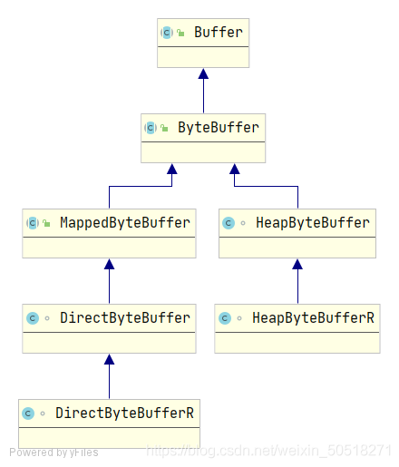
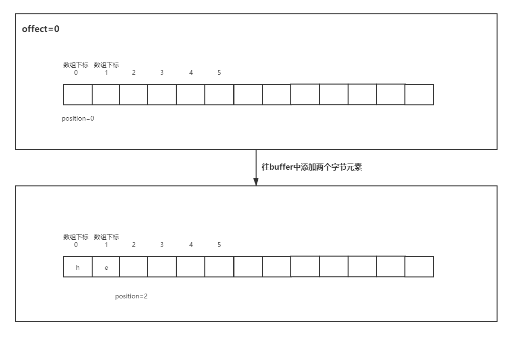
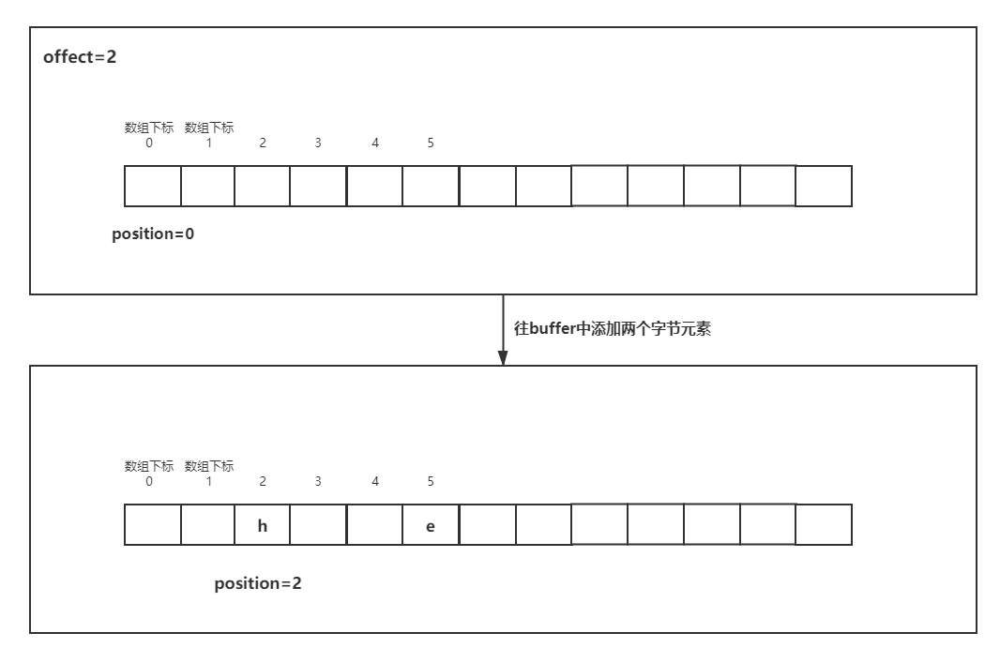
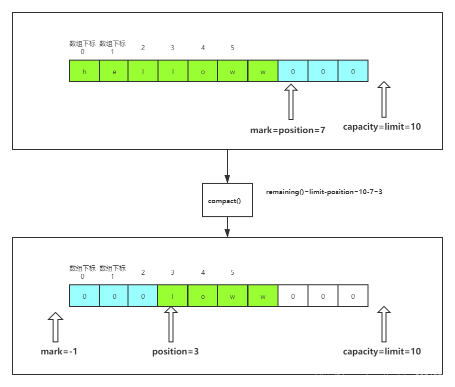
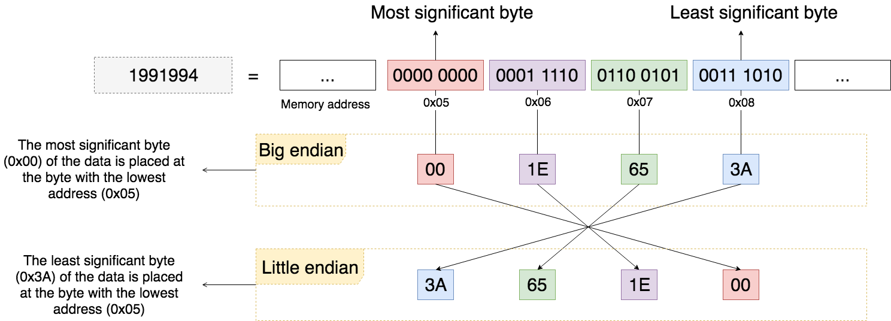
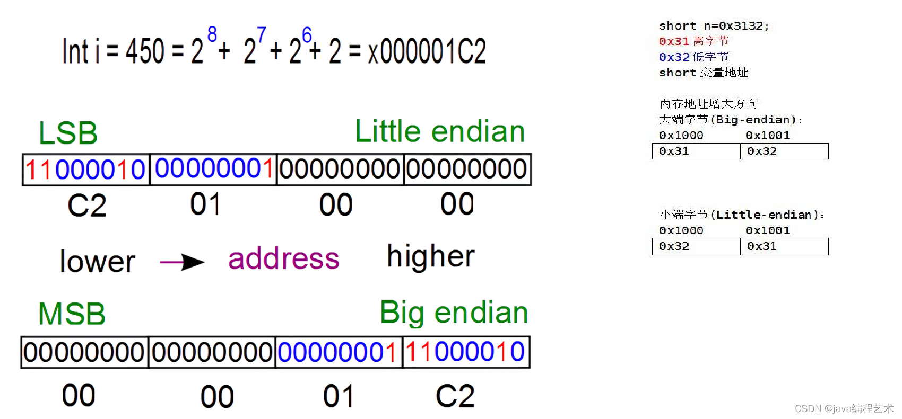

# Byte buffer
## java.nio.ByteBuffer
* Hierarchy

  
  1. Direct Buffer: get direct buffer by allocateDirect which is not controlled by JVM
  2. Non-Direct Buffer: get non-direct buffer from JVM heap.
  3. HeapByteBufferR和DirectByteBufferR are read-only
* properties
  1. capacity：一个buffer的capacity是指它所包含的元素数量。该值永远不会为负数，也永远不会改变。（给定了初始值之后就不会改变了）。对于non-direct buffers，在内部维护一个字节数组用于存放元素，这里的capacity大小也就是指定了这个数组的大小
  2. limit：是buffer中第一个不能够被读取或写入的元素的索引值（元素是存放在数组中的，元素的索引值即数组的下标），该值永远不会为负数，并且不能比capacity值大。
  3. position：和limit相对，是buffer中第一个能够被读取或写入的元素的索引值。该值永远不会为负数，并且不能比limit值大。初始化的时候为0，每往buffer存放数据，position的值都会加1。
  4. mark：定义了这样的一个元素索引值，当调用reset方法时，position的值就等于mark值。若没有定义，调用reset方法会报InvalidMarkException。这个值从来不会被定义，但是一旦被定义，该值永远不会为负数，并且不能比position的值大。当定义了mark，如果调整之后的position或limit的值小于了mark值，则mark值会失效（值为-1）。mark未被定义时的值是-1，一旦被定义，值就不能是负数了。
  5. 0<=mark<=position<=limit<=capacity。一个新创建的buffer，position初始化为0，mark不会被定义，即值为-1。从limit、position的定义可以看出，最大的数据读取或写入长度是limit减去position。若position=0，limit=5，则此时最大的读取存放数据的长度就是5。数组的下标范围其实是从0到4。可以理解成是一种左闭右开的关系，即包括position的位置，不包括limit的位置。也可以说是读取存放数据的数组下标是从position开始到limit-1的下标位置。
  6. offset: 来确定元素的起始位置。默认值为0。可以认为是通过position和offset来确定元素的数组下标的。(下图中typo： offect -> offset)
     * in direct bytebuffer: offset is not stored, it's just used to determine the address (new address = address + offset).
  7. address: The address (including offset) of allocated direct memory.

  
  
* operations
  1. Preparation Write to the buffer: before channel-read or put operations to fill the buffer
     * clear(): limit = capacity, position = 0, mark = -1
       ```
       buf.clear();
       in.read(buf);
       ```
     * compact(): 

       
       * copy unconsumed bytes (from position to limit) to the beginning of buffer
       * position = remaining() (discard original consumed bytes), limit = capacity, mark = -1
  2. remaining(): get available spaces (limit - position) - (when reading)
  3. Preparation Read from the buffer: before reading from the buffer
     * flip(): set limit to current position, then set position to 0 and discard mark
       * it can only read bytes which were already consumed last time. (re-read consumed bytes)
  4. rewind(): set position to 0 and discard mark
     * it can read all bytes in the buffer
     * it's used for repeat reading or overwriting
  5. mark(): mark = position.
  6. reset(): position = mark (it's used after mark(), if mark == -1, reset will throw exception)
  7. duplicate(): duplicate a same bytebuffer which has it owner offset, mark, position, limit and capacity (byte array/direct address shared)
  8. slice(): offset = current position + current offset, limit = capacity = remaining(), position = 0
  9. java.nio.ByteOrder: ByteOrder.nativeOrder() - default ByteOrder.BIG_ENDIAN is native order.
      * buffer.order(ByteOrder.LITTLE_ENDIAN)对byte[] buffer进行大小端的转换
      * Integer 和 Long 都提供了一个静态方法reverseBytes()
        ```
        public class ReverseBytesOfLongClass {
            public static void main(String[] args) {
                long value = 1296;
                System.out.println("value:" + value);
                System.out.println("Long.toBinaryString(value):" + Long.toBinaryString(value));
                System.out.println("Long.reverseBytes(value):" + Long.reverseBytes(value));
                System.out.println("Long.toBinaryString(Long.reverseBytes(value)):" + Long.toBinaryString(Long.reverseBytes(value)));
            }
        }
       
        输出：
        value:1296
        Long.toBinaryString(value):10100010000
        Long.reverseBytes(value):1154328879490400256
        Long.toBinaryString(Long.reverseBytes(value)):1000000000101000000000000000000000000000000000000000000000000
       
        BIG_ENDIAN: 10100010000: 101,00010000   java can display the binary correctly
        LITTLE_ENDIAN: 1000000000101000000000000000000000000000000000000000000000000: 10000,00000101,00000000,00000000,00000000,00000000,00000000,00000000
        ```
      * ByteOrder.LITTLE_ENDIAN: 小字节序、低字节序 - 即低位字节排放在内存的低地址端，高位字节排放在内存的高地址端。example: 低阶字节存储在起始地址(A)，高阶字节存储在下一个地址(A + 1)
      * ByteOrder.BIG_ENDIAN (网络字节顺序): 大字节序、高字节序 - 即高位字节排放在内存的低地址端，低位字节排放在内存的高地址端。example: 高阶字节存储在起始地址(A)，低阶字节存储在下一个地址(A + 1)
      ```
      根据这些定义，一种32位数据模式，它被视为32位无符号整数。“高阶”字节是2的最大次方：231，…, 224。“低阶”字节是2的最小次方: 27，…, 20。
      示例如下：
        MSB：全称为Most Significant Byte，在二进制数中属于最高有效位，MSB是最高加权位，与十进制数字中最左边的一位类似。
        LSB：全称为Least Significant Byte，在二进制数中意为最低有效位，
        一般来说，MSB位于二进制数的最左侧，LSB位于二进制数的最右侧。
      ```

      
      
      * 字节顺序是否影响文件格式?
        * 以多个字节为基本单位存储的文件或者数据类型才受字节顺序影响。
        * 以1字节为基本单位的文件格式独立于字节顺序，例如ASCII文件。
        * 其他文件格式使用一些固定的端顺序格式，例如JPEG文件以大端顺序格式存储。
        * java 全部为大端(与平台无关)： Java二进制文件中的所有内容都以大端顺序存储。这意味着如果您只使用Java，那么所有文件在所有平台(Mac、PC、UNIX等)上的处理方式都是相同的。
        * C语言默认是小端模式：用C语言编写的程序通常使用 小端顺序
  
* sun.nio.ch.IOUtil
```
static int read(FileDescriptor var0, ByteBuffer var1, long var2, NativeDispatcher var4) throws IOException {
    if (var1.isReadOnly()) {
        throw new IllegalArgumentException("Read-only buffer");
    } else if (var1 instanceof DirectBuffer) {
        // If ByteBuffer is instance of DirectByteBuffer, read file content into this ByteBuffer
        return readIntoNativeBuffer(var0, var1, var2, var4);
    } else {
        // If ByteBuffer is instance of HeapByteBuffer, create a temporary DirectByteBuffer to get file content
        // Then copy the bytes from the temporary DirectByteBuffer to the HeapByteBuffer (one more copy then using DirectByteBuffer)
        // Because HeapByteBuffer is controlled by JVM, so it may be moved by "compacting GC".
        // But the ByteBuffer passed to the native code should not be moved during native code running.
        // So it cannot pass HeapByteBuffer to native code.
        ByteBuffer var5 = Util.getTemporaryDirectBuffer(var1.remaining());
        int var7;
        try {
            int var6 = readIntoNativeBuffer(var0, var5, var2, var4);
            var5.flip();
            if (var6 > 0) {
                var1.put(var5);
            }

            var7 = var6;
        } finally {
            Util.offerFirstTemporaryDirectBuffer(var5);
        }

        return var7;
    }
 }
```
* 在进行IO操作时，例如文件读写，或者socket读写，少了一次copy性能有提升 (不用从direct buffer copy到head buffer)。 (注意，仅限于有IO操作的场景下)
* 在非IO操作的场景下，例如仅仅做数据的编解码，不和机器硬件打交道，那么即使使用了HeapByteBuffer也不会产生copy动作，如果此时仍然在使用DirectByteBuffer，由于数据存储部分在堆外存，内存空间的分配和释放比堆内存更加复杂一些，性能也稍慢一些，在netty中是通过buf池的方案来解决的
* new DirectByteBuffer时
  1. 会调用System.gc()去触发一个full gc (in Bits.reserveMemory)，当然前提是你没有显示的设置-XX:+DisableExplicitGC来禁用显式GC。但调用System.gc()并不能够保证full gc马上就能被执行。
  2. 之后会进行最多9次尝试，看JVM进程是否有足够的可用堆外内存来分配堆外内存。 （通过-XX:MaxDirectMemorySize来指定最大的堆外内存， 默认是67108864L）
  3. 每次尝试会触发一次非堵塞的Reference#tryHandlePending(false)。该方法会将已经被JVM垃圾回收的DirectBuffer对象的堆外内存释放。
  4. 如果9次尝试后还是没有足够的堆外内存，报堆外内存不足错误。

## io.netty.buffer.ByteBuf
*      +-------------------+------------------+------------------+
       | discardable bytes |  readable bytes  |  writable bytes  |
       |                   |     (CONTENT)    |                  |
       +-------------------+------------------+------------------+
       |                   |                  |                  |
       0      <=      readerIndex   <=   writerIndex    <=    capacity
* 三种使用模式：
  * Heap Buffer 堆缓冲区
    * 堆缓冲区是ByteBuf最常用的模式，他将数据存储在堆空间。
  * Direct Buffer 直接缓冲区
    * 直接缓冲区是ByteBuf的另外一种常用模式，他的内存分配都不发生在堆，jdk1.4引入的nio的ByteBuffer类允许jvm通过本地方法调用分配内存，这样做有两个好处
    * 通过免去中间交换的内存拷贝, 提升IO处理速度; 直接缓冲区的内容可以驻留在垃圾回收扫描的堆区以外。
    * DirectBuffer 在 -XX:MaxDirectMemorySize=xxM大小限制下, 使用 Heap 之外的内存, GC对此”无能为力”,也就意味着规避了在高负载下频繁的GC过程对应用线程的中断影响.
  * Composite Buffer 复合缓冲区
    * 复合缓冲区相当于多个不同ByteBuf的视图，这是netty提供的，jdk不提供这样的功能。

# Pool
## io.netty.util.Recycler
* FastThreadLocal<Stack<T>> threadLocal: provide Stack to cache the instances of T
* protected abstract T newObject(Handle<T> handle): if no available instance of T in cache, new one by newObject.
* When cache an instance of T, Stack will create a DefaultHandle to wrap the instance of T.
* The DefaultHandle provides recycle method to re-cache the returned instance of T to the Stack.
