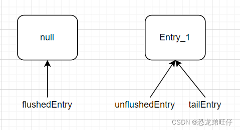
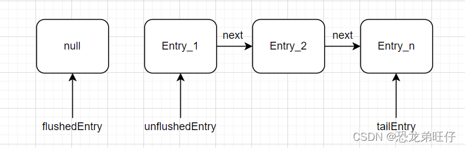
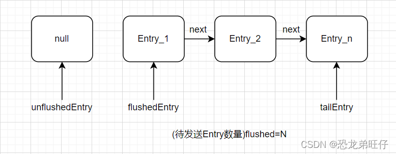
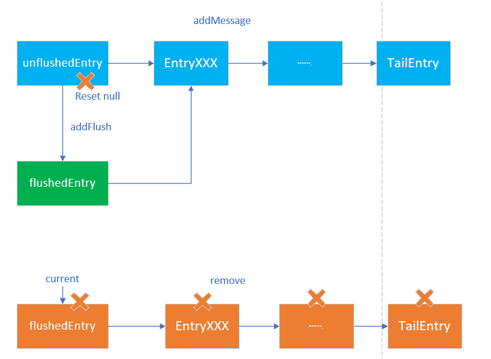

# io.netty.channel.ChannelOutboundBuffer
Write option for NioSocketChannel:
1. Write message (bytes) to ChannelOutboundBuffer
2. Flush will send the message from ChannelOutboundBuffer to peer.

## addMessage
* Add entry illustrations
  1. First entry:
  
  
  2. More entries:

  
* If tailEntry is null, set flushedEntry to null.
* Add the message to be the tailEntry.
* If unflushedEntry is null, set unflushedEntry point to the message (tailEntry).
* calls incrementPendingOutboundBytes to increase total pending bytes:
  if total pending bytes >= channel.config().getWriteBufferHighWaterMark(), set ChannelOutboundBuffer un-writable and call pipline.fireChannelWritabilityChanged.
  fireChannelWritabilityChanged triggers handler.channelWritablilityChanged.
## addFlush

* If unflushedEntry is not null: 
  1. If flushedEntry is null, set flushedEntry point to unflushedEntry.
  2. Iterate entries from unflushedEntry to increase flushed.
  3. set unflushedEntry to null.

## nioBuffers
* Iterate entries from flushedEntry to the entry before unflushedEntry.
* Get the message (ByteBuf) from each entry.msg.
* Convert each message (ByteBuf) to ByteBuffer and append them to the nioBuffers (ByteBuffer[]) stored in NIO_BUFFERS.
* return nioBuffers

## NioSocketChannel.doWrite writes the contents in nioBuffers to peer.
* Call removeBytes to clear entries in ChannelOutboundBuffer
* If not write all buffers completely to peer, call incompleteWrite to register write_op to selector (for continuing socket writing) or call ChannelOutboundBuffer.flush 

## removeBytes
* Based on written bytes, clear entries started by flushedEntry.
* For each entry
  1. If one entry.msg totally consumed, remove this entry by remove method.
  2. Else just changing the entry.msg red index.
  3. Remove method calls removeEntry method; removeEntry method removes current flushedEntry and set flushedEntry point to flushedEntry.next
  4. Remove method calls decrementPendingOutboundBytes to decrease total pending bytes: 
     if total pending bytes <= channel.config().getWriteBufferLowWaterMark(), set ChannelOutboundBuffer writable and call pipline.fireChannelWritabilityChanged.
     fireChannelWritabilityChanged triggers handler.channelWritablilityChanged. In channelWritablilityChanged, if channel.isWritable() is true then it can add message to ChannelOutboundBuffer.
  5. If flushed all entries (flushed is 0), then set flushedEntry to null; if previous flushedEntry point to tailEntry, set tailEntry to null

# io.netty.handler.stream.ChunkedWriteHandler
* write: write message to queue
* flush: doFlush first to pop messages from queue to ChannelOutboundBuffer.addMessage; if failed, call ChannelOutboundBuffer.flush to release the buffer in ChannelOutboundBuffer
* ChannelOutboundBuffer get more free buffer, then fireChannelWritabilityChanged to pipline (above 4).
* Then in ChunkedWriteHandler.channelWritablilityChanged, it calls doFlush to pop messages from queue to ChannelOutboundBuffer.addMessage