# Netty
## Depends
```
nettyVersion = '4.1.5.RELEASE'
compile "io.netty:netty-all:${nettyVersion}"

只需要最基本的NIO传输功能,只需要引入依赖
compile "io.netty:netty-transport:${nettyVersion}"
此依赖会通过传递依赖的形式自动引入
netty-buffer,netty-common,netty-resolver,netty-transport
```

## Netty server example:
   ```
   public class NettyOioServer {

        public void server(int port) throws Exception {
            final ByteBuf buf = Unpooled.unreleasableBuffer(
                    Unpooled.copiedBuffer("Hi!\r\n", Charset.forName("UTF-8")));
            EventLoopGroup group = new OioEventLoopGroup();
            try {
                ServerBootstrap b = new ServerBootstrap();        //1
    
                b.group(group)                                    //2
                 .channel(OioServerSocketChannel.class)
                 .localAddress(new InetSocketAddress(port))
                 .childHandler(new ChannelInitializer<SocketChannel>() {//3
                     @Override
                     public void initChannel(SocketChannel ch) 
                         throws Exception {
                         ch.pipeline().addLast(new ChannelInboundHandlerAdapter() {            //4
                             @Override
                             public void channelActive(ChannelHandlerContext ctx) throws Exception {
                                 ctx.writeAndFlush(buf.duplicate()).addListener(ChannelFutureListener.CLOSE);//5
                             }
                         });
                     }
                 });
                ChannelFuture f = b.bind().sync();  //6
                f.channel().closeFuture().sync();
            } finally {
                group.shutdownGracefully().sync();        //7
            }
        }
   }
   ```

## Channel
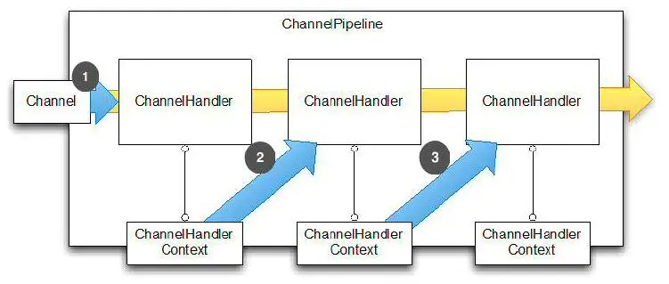
* Channel，表示一个连接，可以理解为每一个请求，就是一个Channel。
* ChannelHandler，核心处理业务就在这里，用于处理业务请求。
* ChannelHandlerContext，用于传输业务数据。
* ChannelPipeline，用于保存处理过程需要用到的ChannelHandler和ChannelHandlerContext。

## event loop
* Reactor 线程模型
  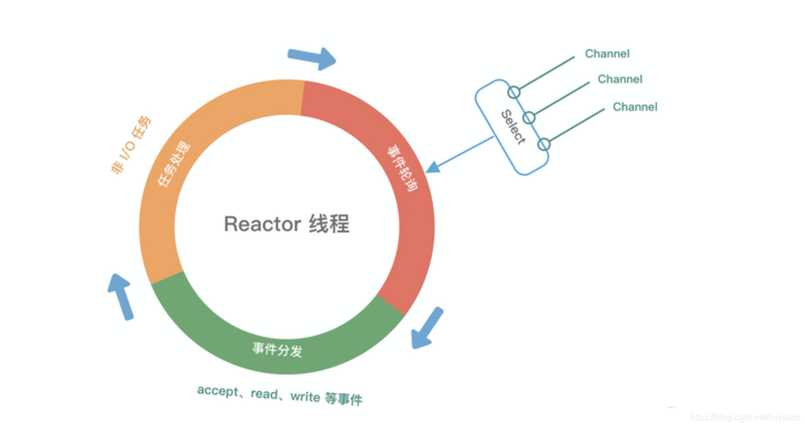
* EventLoop 通用的运行模式: 
  * 应用程序都会将产生的事件放入事件队列当中。
  * 然后 EventLoop 会轮询从队列中取出事件执行或者将事件分发给相应的事件监听者执行。
  * 事件执行的方式通常分为立即执行、延后执行、定期执行几种。
  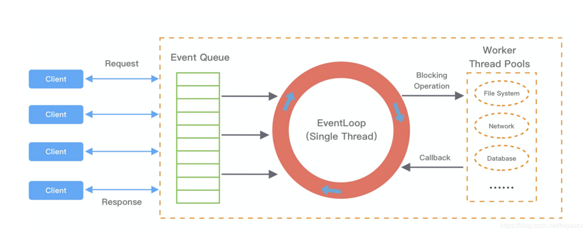
* Netty的EventLoop
  * 可以理解为 Reactor 线程模型的事件处理引擎
  * 每个 EventLoop 线程都维护一个 Selector 选择器和任务队列 taskQueue。
  * 它主要负责处理 I/O 事件、普通任务和定时任务
* NioEventLoop
  * 事件轮询 select、事件处理 processSelectedKeys、任务处理 runAllTasks
  * 提供了一个参数 ioRatio，可以调整 I/O 事件处理和任务处理的时间比例。
  * NioEventLoop 无锁串行化的设计不仅使系统吞吐量达到最大化，也不用处理线程安全问题 （单线程）
  * 单线程执行避免了线程切换，但是它的缺陷就是不能执行时间过长的 I/O 操作
```
protected void run() {
    for (;;) {
        try {
            try {
                switch (selectStrategy.calculateStrategy(selectNowSupplier, hasTasks())) {
                case SelectStrategy.CONTINUE:
                    continue;
                case SelectStrategy.BUSY_WAIT:
                case SelectStrategy.SELECT:
                    select(wakenUp.getAndSet(false)); // 轮询 I/O 事件
                    if (wakenUp.get()) {
                        selector.wakeup();
                    }
                default:
                }
            } catch (IOException e) {
                rebuildSelector0();
                handleLoopException(e);
                continue;
            }

            cancelledKeys = 0;
            needsToSelectAgain = false;
            final int ioRatio = this.ioRatio;
            if (ioRatio == 100) {
                try {
                    processSelectedKeys(); // 处理 I/O 事件
                } finally {
                    runAllTasks(); // 处理所有任务
                }
            } else {
                final long ioStartTime = System.nanoTime();
                try {
                    processSelectedKeys(); // 处理 I/O 事件
                } finally {
                    final long ioTime = System.nanoTime() - ioStartTime;
                    runAllTasks(ioTime * (100 - ioRatio) / ioRatio); // 处理完 I/O 事件，再处理异步任务队列
                }
            }
        } catch (Throwable t) {
            handleLoopException(t);
        }
        
        try {
            if (isShuttingDown()) {
                closeAll();
                if (confirmShutdown()) {
                    return;
                }
            }
        } catch (Throwable t) {
            handleLoopException(t);
        }
    }
}
```
  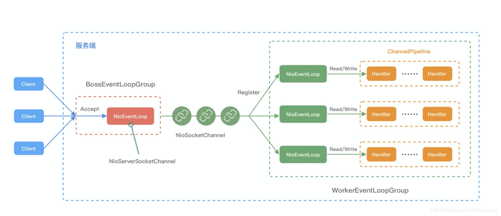
  * NioEventLoop 线程的可靠性至关重要，一旦 NioEventLoop 发生阻塞或者陷入空轮询，就会导致整个系统不可用。
    * 在 JDK 中， Epoll 的实现是存在漏洞的，即使 Selector 轮询的事件列表为空，NIO 线程一样可以被唤醒，导致 CPU 100% 占用。这就是臭名昭著的 JDK epoll 空轮询的 Bug
    * Netty rebuild一个Selector解决 epoll 空轮询的 Bug
    ```
    long time = System.nanoTime();
    if (time - TimeUnit.MILLISECONDS.toNanos(timeoutMillis) >= currentTimeNanos) {
        selectCnt = 1;
    } else if (SELECTOR_AUTO_REBUILD_THRESHOLD > 0 &&
        selectCnt >= SELECTOR_AUTO_REBUILD_THRESHOLD) {
        selector = selectRebuildSelector(selectCnt);
        selectCnt = 1;
        break;
    }
    ```
      * 每次执行 select 操作之前记录当前时间 currentTimeNanos。
      * time - TimeUnit.MILLISECONDS.toNanos(timeoutMillis) >= currentTimeNanos，如果事件轮询的持续时间大于等于 timeoutMillis，那么说明是正常的，否则表明阻塞时间并未达到预期，可能触发了空轮询的 Bug。
      * Netty 引入了计数变量 selectCnt。在正常情况下，selectCnt 会重置，否则会对 selectCnt 自增计数。当 selectCnt 达到 SELECTOR_AUTO_REBUILD_THRESHOLD（默认512） 阈值时，会触发重建 Selector 对象。
        * 异常的 Selector 中所有的 SelectionKey 会重新注册到新建的 Selector 上，重建完成之后异常的 Selector 就可以废弃了。
* NioEventLoop 处理的任务类型基本可以分为三类。
  1. 普通任务: 通过 NioEventLoop 的 execute() 方法向任务队列 taskQueue 中添加任务。
  2. 定时任务：通过调用 NioEventLoop 的 schedule() 方法向定时任务队列 scheduledTaskQueue 添加一个定时任务，用于周期性执行该任务。例如，心跳消息发送等。定时任务队列 scheduledTaskQueue 采用优先队列 PriorityQueue 实现。
  3. 尾部队列：tailTasks 相比于普通任务队列优先级较低，在每次执行完 taskQueue 中任务后会去获取尾部队列中任务执行。尾部任务并不常用，主要用于做一些收尾工作，例如统计事件循环的执行时间、监控信息上报等。
```
protected boolean runAllTasks(long timeoutNanos) {
    // 1. 合并定时任务到普通任务队列
    fetchFromScheduledTaskQueue();

    // 2. 从普通任务队列中取出任务
    Runnable task = pollTask();
    if (task == null) {
        afterRunningAllTasks();
        return false;
    }
    
    // 3. 计算任务处理的超时时间
    final long deadline = ScheduledFutureTask.nanoTime() + timeoutNanos;
    long runTasks = 0;
    long lastExecutionTime;
    
    for (;;) {
        // 4. 安全执行任务
        safeExecute(task);
        runTasks ++;

        // 5. 每执行 64 个任务检查一下是否超时
        if ((runTasks & 0x3F) == 0) {
            lastExecutionTime = ScheduledFutureTask.nanoTime();
            if (lastExecutionTime >= deadline) {
                break;
            }
        }

        task = pollTask();
        if (task == null) {
            lastExecutionTime = ScheduledFutureTask.nanoTime();
            break;
        }
    }

    // 6. 收尾工作
    afterRunningAllTasks();
    this.lastExecutionTime = lastExecutionTime;
    return true;
}
```
  * fetchFromScheduledTaskQueue 函数：将定时任务从 scheduledTaskQueue 中取出，聚合放入普通任务队列 taskQueue 中，只有定时任务的截止时间小于当前时间才可以被合并。
  * 从普通任务队列 taskQueue 中取出任务。
  * 计算任务执行的最大超时时间。
  * safeExecute 函数：安全执行任务，实际直接调用的 Runnable 的 run() 方法。
  * 每执行 64 个任务进行超时时间的检查，如果执行时间大于最大超时时间，则立即停止执行任务，避免影响下一轮的 I/O 事件的处理。
  * 最后获取尾部队列中的任务执行。
* NioEventLoopGroup 与 Reactor 线程模型的对应
  * 单Reactor单线程模型
```
EventLoopGroup bossGroup = new NioEventLoopGroup(1);
ServerBootstrap b = new ServerBootstrap();
b.group(bossGroup)
.channel(NioServerSocketChannel.class)
...
```
  * 单Reactor多线程模型
    * Netty的改进 （EventLoop的特性）
      * 虽然是但reactor,但是BossGroup 线程维护Selector , 只关注Accecpt
      * workgroup线程维护的Selector，关注read/write事件

      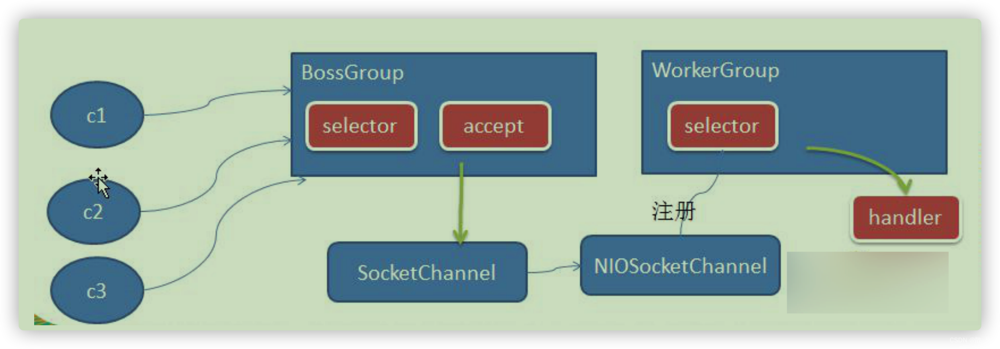
      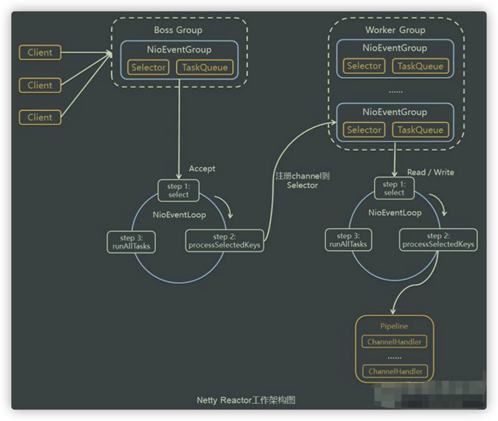
```
EventLoopGroup bossGroup = new NioEventLoopGroup(1);
EventLoopGroup workerGroup = new NioEventLoopGroup();
ServerBootstrap b = new ServerBootstrap();
b.group(bossGroup, workerGroup)
 .channel(NioServerSocketChannel.class)
 ...
```
  * 主从Reactor多线程模型

    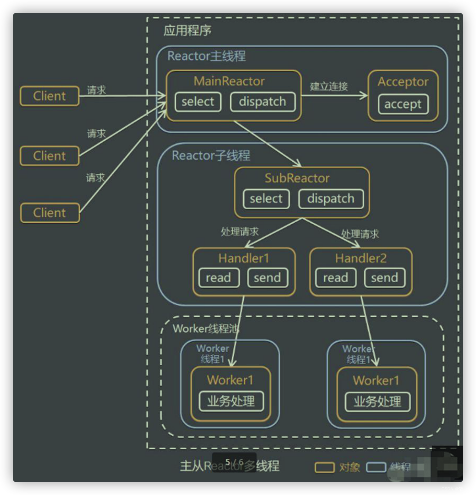
    * 其实在Netty 的服务器端的 acceptor 阶段, 没有使用到多线程, 因此上面的 主从多线程模型在 Netty 的服务器端是不存在的.
    * 一个server bootstrap创建一个ServerSocketChannel
    * 服务器端的 ServerSocketChannel 只绑定到了 bossGroup 中的一个线程, 因此在调用 Java NIO 的 Selector.select 处理客户端的连接请求时, 实际上是在一个线程中的
    * 所以对只有一个服务的应用来说, bossGroup 设置多个线程是没有什么作用的, 反而还会造成资源浪费.
    * the creator of Netty says multiple boss threads are useful if we share NioEventLoopGroup between different server bootstraps

```
EventLoopGroup bossGroup = new NioEventLoopGroup(2);
EventLoopGroup workerGroup = new NioEventLoopGroup();
ServerBootstrap b = new ServerBootstrap();
b.group(bossGroup, workerGroup)
 .channel(NioServerSocketChannel.class)
 ...
```

    

## ByteBuf
* ByteBuf是一个存储字节的容器，最大特点就是使用方便，它既有自己的读索引和写索引，方便你对整段字节缓存进行读写，也支持get/set，方便你对其中每一个字节进行读写，他的数据结构如下图所示：
  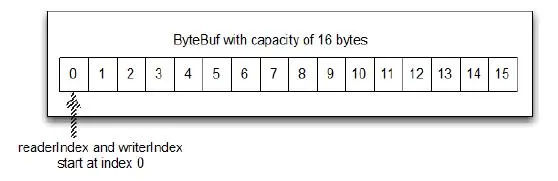

## Codec
* Netty中的编码/解码器，通过他你能完成字节与pojo、pojo与pojo的相互转换，从而达到自定义协议的目的。
* 在Netty里面最有名的就是HttpRequestDecoder和HttpResponseEncoder了。
* Decoder和Encoder，他们分别就是ChannelInboundHandler和ChannelOutboundHandler
* Encoder: 
  * 最重要的实现类是MessageToByteEncoder<T>, 这个类的作用就是将消息实体T从对象转换成byte，写入到ByteBuf，然后再丢给剩下的ChannelOutboundHandler传给客户端，流程图如下：
    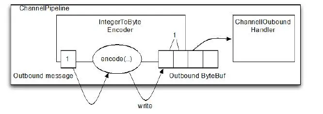
  * 实现MessageToByteEncoder的encode方法
  * example:
    ```
    public class ShortToByteEncoder extends
        MessageToByteEncoder<Short> {  //1
        @Override
        public void encode(ChannelHandlerContext ctx, Short msg, ByteBuf out)
                throws Exception {
            out.writeShort(msg);  //2
        }
    }
    ```
* Decoder:
  * ByteToMessageDecoder<T>
  * 实现ByteToMessageDecoder的decode和decodeLast方法
  * decode和decodeLast的不同之处，在于他们的调用时机不同，正如描述所说，decodeLast只有在Channel的生命周期结束之前会调用一次，默认是调用decode方法。
  * example
  ```
  public class ToIntegerDecoder extends ByteToMessageDecoder {  //1
    @Override
    public void decode(ChannelHandlerContext ctx, ByteBuf in, List<Object> out)
            throws Exception {
        if (in.readableBytes() >= 4) {  //2
            out.add(in.readInt());  //3
        }
    }
  }
  ```
  * ReplayingDecoder
    * 读取缓冲区的数据之前需要检查缓冲区是否有足够的字节，使用ReplayingDecoder就无需自己检查；若ByteBuf中有足够的字节，则会正常读取；若没有足够的字节则会停止解码。
    * example 
      ```
      public class LiveDecoder extends ReplayingDecoder<LiveDecoder.LiveState> { //1

          public enum LiveState { //2
              LENGTH,
              CONTENT
          }


          public LiveDecoder() {
              super(LiveState.LENGTH); // 3
          }

          @Override
          protected void decode(ChannelHandlerContext channelHandlerContext, ByteBuf byteBuf, List<Object> list) throws Exception {
              switch (state()) { // 4
                  case LENGTH:
                      int length = byteBuf.readInt();
                      if (length > 0) {
                          checkpoint(LiveState.CONTENT); // 5
                      } else {
                          LiveMessage message = new LiveMessage();
                          list.add(message); // 6
                      }
                      break;
                  case CONTENT:
                      byte[] bytes = new byte[message.getLength()];
                      byteBuf.readBytes(bytes);
                      String content = new String(bytes);
                      message.setContent(content);
                      LiveMessage message = new LiveMessage();
                      list.add(message);
                      break;
                  default:
                      throw new IllegalStateException("invalid state:" + state());
              }
          }
      }
      ```
* 

## 搭建Netty Server
* 先了解http request和response

  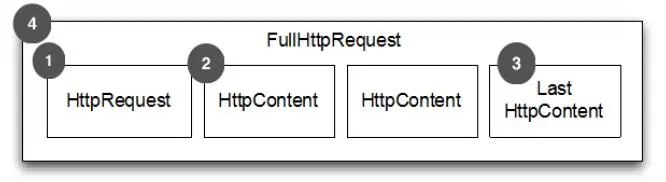

  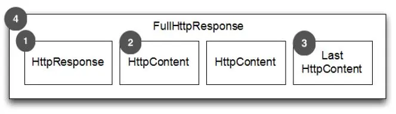
  
* 启动类: 负责启动（BootStrap）和main方法

```
package com.dz.netty.http;

import io.netty.bootstrap.ServerBootstrap;
import io.netty.channel.ChannelInitializer;
import io.netty.channel.ChannelOption;
import io.netty.channel.nio.NioEventLoopGroup;
import io.netty.channel.socket.SocketChannel;
import io.netty.channel.socket.nio.NioServerSocketChannel;
import io.netty.handler.codec.http.HttpObjectAggregator;
import io.netty.handler.codec.http.HttpRequestDecoder;
import io.netty.handler.codec.http.HttpResponseEncoder;

public class HttpServer {

    private final int port;

    public HttpServer(int port) {
        this.port = port;
    }

    public static void main(String[] args) throws Exception {
        if (args.length != 1) {
            System.err.println(
                    "Usage: " + HttpServer.class.getSimpleName() +
                            " <port>");
            return;
        }
        int port = Integer.parseInt(args[0]);
        new HttpServer(port).start();
    }

    public void start() throws Exception {
        ServerBootstrap b = new ServerBootstrap();
        NioEventLoopGroup group = new NioEventLoopGroup();
        b.group(group)
                .channel(NioServerSocketChannel.class)
                .childHandler(new ChannelInitializer<SocketChannel>() {
                    @Override
                    public void initChannel(SocketChannel ch)
                            throws Exception {
                        System.out.println("initChannel ch:" + ch);
                        ch.pipeline()
                                .addLast("decoder", new HttpRequestDecoder())   // 1
                                .addLast("encoder", new HttpResponseEncoder())  // 2
                                .addLast("aggregator", new HttpObjectAggregator(512 * 1024))    // 3
                                .addLast("handler", new HttpHandler());        // 4
                    }
                })
                .option(ChannelOption.SO_BACKLOG, 128) // determining the number of connections queued
                .childOption(ChannelOption.SO_KEEPALIVE, Boolean.TRUE);

        b.bind(port).sync();
    }
}
```
   1. HttpRequestDecoder，用于解码request
   2. HttpResponseEncoder，用于编码response
   3. aggregator，消息聚合器（重要）。为什么能有FullHttpRequest这个东西，就是因为有他，HttpObjectAggregator，如果没有他，就不会有那个消息是FullHttpRequest的那段Channel，同样也不会有FullHttpResponse。 如果我们将HttpObjectAggregator(512 * 1024)的参数含义是消息合并的数据大小，如此代表聚合的消息内容长度不超过512kb。
   4. 添加我们自己的处理接口

* 业务处理类HttpHandler
```
package com.dz.netty.http;

import io.netty.buffer.Unpooled;
import io.netty.channel.ChannelHandlerContext;
import io.netty.channel.SimpleChannelInboundHandler;
import io.netty.handler.codec.http.*;
import io.netty.util.AsciiString;

public class HttpHandler extends SimpleChannelInboundHandler<FullHttpRequest> { // 1

    private AsciiString contentType = HttpHeaderValues.TEXT_PLAIN;

    @Override
    protected void channelRead0(ChannelHandlerContext ctx, FullHttpRequest msg) throws Exception {
        System.out.println("class:" + msg.getClass().getName());
        DefaultFullHttpResponse response = new DefaultFullHttpResponse(HttpVersion.HTTP_1_1,
                HttpResponseStatus.OK,
                Unpooled.wrappedBuffer("test".getBytes())); // 2

        HttpHeaders heads = response.headers();
        heads.add(HttpHeaderNames.CONTENT_TYPE, contentType + "; charset=UTF-8");
        heads.add(HttpHeaderNames.CONTENT_LENGTH, response.content().readableBytes()); // 3
        heads.add(HttpHeaderNames.CONNECTION, HttpHeaderValues.KEEP_ALIVE);

        ctx.write(response);
    }

    @Override
    public void channelReadComplete(ChannelHandlerContext ctx) throws Exception {
        System.out.println("channelReadComplete");
        super.channelReadComplete(ctx);
        ctx.flush(); // 4
    }

    @Override
    public void exceptionCaught(ChannelHandlerContext ctx, Throwable cause) throws Exception {
        System.out.println("exceptionCaught");
        if(null != cause) cause.printStackTrace();
        if(null != ctx) ctx.close();
    }
}
```

* 构建HTTPS服务
```
public class SSLChannelInitializer extends ChannelInitializer<SocketChannel> {

    private final SslContext sslContext;

    public SSLChannelInitializer() {
        String keyStoreFilePath = "/root/.ssl/test.pkcs12";
        String keyStorePassword = "Password@123";

        try {
            KeyStore keyStore = KeyStore.getInstance("PKCS12");
            keyStore.load(new FileInputStream(keyStoreFilePath), keyStorePassword.toCharArray());

            KeyManagerFactory keyManagerFactory = KeyManagerFactory.getInstance(KeyManagerFactory.getDefaultAlgorithm());
            keyManagerFactory.init(keyStore, keyStorePassword.toCharArray());

            sslContext = SslContextBuilder.forServer(keyManagerFactory).build();
        } catch (Exception e) {
            throw new RuntimeException(e);
        }
    }

    @Override
    protected void initChannel(SocketChannel ch) {
        ChannelPipeline pipeline = ch.pipeline();
        SSLEngine sslEngine = sslContext.newEngine(ch.alloc());
        pipeline
                .addLast(new SslHandler(sslEngine))
                  .addLast("decoder", new HttpRequestDecoder())
                  .addLast("encoder", new HttpResponseEncoder())
                  .addLast("aggregator", new HttpObjectAggregator(512 * 1024))
                  .addLast("handler", new HttpHandler());
        ;
    }
}
```

* 实现长连接
```
package com.dz.netty.live;

import io.netty.channel.Channel;
import io.netty.channel.ChannelHandlerContext;
import io.netty.channel.SimpleChannelInboundHandler;
import io.netty.util.concurrent.ScheduledFuture;
import org.slf4j.Logger;
import org.slf4j.LoggerFactory;

import java.util.HashMap;
import java.util.Map;
import java.util.concurrent.TimeUnit;

public class LiveHandler extends SimpleChannelInboundHandler<LiveMessage> { // 1

    private static Map<Integer, LiveChannelCache> channelCache = new HashMap<>();
    private Logger logger = LoggerFactory.getLogger(LiveHandler.class);

    @Override
    protected void channelRead0(ChannelHandlerContext ctx, LiveMessage msg) throws Exception {
        Channel channel = ctx.channel();
        final int hashCode = channel.hashCode();
        System.out.println("channel hashCode:" + hashCode + " msg:" + msg + " cache:" + channelCache.size());

        if (!channelCache.containsKey(hashCode)) {
            System.out.println("channelCache.containsKey(hashCode), put key:" + hashCode);
            channel.closeFuture().addListener(future -> {
                System.out.println("channel close, remove key:" + hashCode);
                channelCache.remove(hashCode);
            });
            ScheduledFuture scheduledFuture = ctx.executor().schedule(
                    () -> {
                        System.out.println("schedule runs, close channel:" + hashCode);
                        channel.close();
                    }, 10, TimeUnit.SECONDS);
            channelCache.put(hashCode, new LiveChannelCache(channel, scheduledFuture));
        }

        switch (msg.getType()) {
            case LiveMessage.TYPE_HEART: {
                LiveChannelCache cache = channelCache.get(hashCode);
                ScheduledFuture scheduledFuture = ctx.executor().schedule(
                        () -> channel.close(), 5, TimeUnit.SECONDS);
                cache.getScheduledFuture().cancel(true);
                cache.setScheduledFuture(scheduledFuture);
                ctx.channel().writeAndFlush(msg);
                break;
            }
            case LiveMessage.TYPE_MESSAGE: {
                channelCache.entrySet().stream().forEach(entry -> {
                    Channel otherChannel = entry.getValue().getChannel();
                    otherChannel.writeAndFlush(msg);
                });
                break;
            }
        }
    }

    @Override
    public void channelReadComplete(ChannelHandlerContext ctx) throws Exception {
        logger.debug("channelReadComplete");
        super.channelReadComplete(ctx);
    }

    @Override
    public void exceptionCaught(ChannelHandlerContext ctx, Throwable cause) throws Exception {
        logger.debug("exceptionCaught");
        if(null != cause) cause.printStackTrace();
        if(null != ctx) ctx.close();
    }
}
```

Client
```
package com.dz.test;

import org.slf4j.Logger;
import org.slf4j.LoggerFactory;

import java.io.IOException;
import java.net.InetSocketAddress;
import java.net.Socket;
import java.nio.ByteBuffer;
import java.util.Scanner;

public class LongConnTest {

    private Logger logger = LoggerFactory.getLogger(LongConnTest.class);

    String host = "localhost";
    int port = 8080;

    public void testLongConn() throws Exception {
        logger.debug("start");
        final Socket socket = new Socket();
        socket.connect(new InetSocketAddress(host, port));
        Scanner scanner = new Scanner(System.in);
        new Thread(() -> {
            while (true) {
                try {
                    byte[] input = new byte[64];
                    int readByte = socket.getInputStream().read(input);
                    logger.debug("readByte " + readByte);
                } catch (IOException e) {
                    e.printStackTrace();
                }
            }
        }).start();
        int code;
        while (true) {
            code = scanner.nextInt();
            logger.debug("input code:" + code);
            if (code == 0) {
                break;
            } else if (code == 1) {
                ByteBuffer byteBuffer = ByteBuffer.allocate(5);
                byteBuffer.put((byte) 1);
                byteBuffer.putInt(0);
                socket.getOutputStream().write(byteBuffer.array());
                logger.debug("write heart finish!");
            } else if (code == 2) {
                byte[] content = ("hello, I'm" + hashCode()).getBytes();
                ByteBuffer byteBuffer = ByteBuffer.allocate(content.length + 5);
                byteBuffer.put((byte) 2);
                byteBuffer.putInt(content.length);
                byteBuffer.put(content);
                socket.getOutputStream().write(byteBuffer.array());
                logger.debug("write content finish!");
            }
        }
        socket.close();
    }

    // 因为Junit不支持用户输入,所以用main的方式来执行用例
    public static void main(String[] args) throws Exception {
        new LongConnTest().testLongConn();
    }
}
```