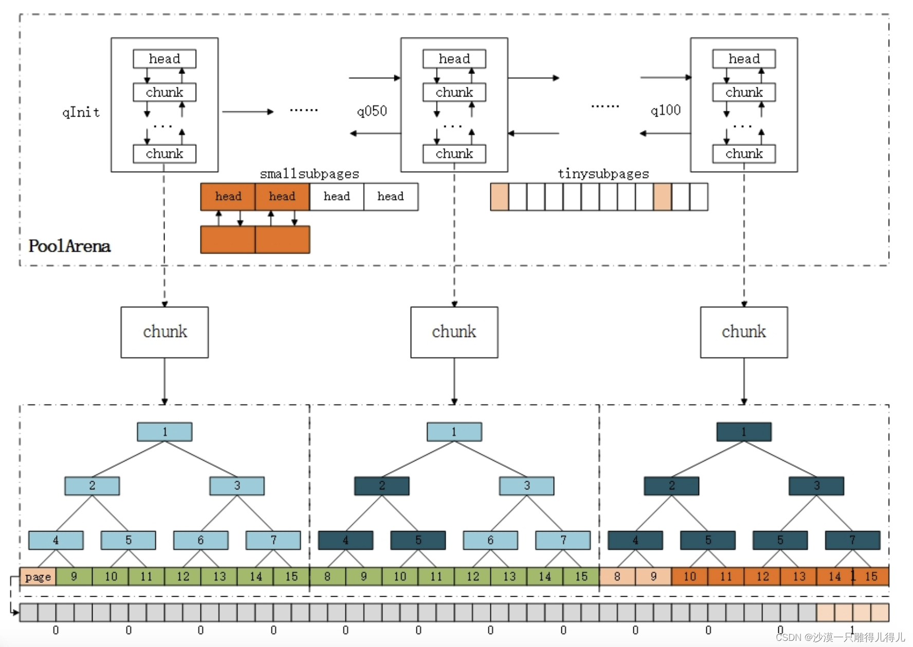

# ByteBuf Allocators

## `io.netty.buffer.UnpooledByteBufAllocator`

## `io.netty.buffer.PooledByteBufAllocator`
* chunkSize
  * maxOrder (int) //表示chunk中由Page节点构成的二叉树的最大高度。默认11 最大不超过14
  * calculate chunkSize based on maxOrder
    * number of page: 2的maxOrder次方 - 1
    * chunkSize: number of page * pageSize -> 默认16M
  * calculate pageShifts 
    * 默认pageSize 8192： 赋值不能小于4096 必须是power of 2，而且必须大于directMemoryCacheAlignment
    * 默认directMemoryCacheAlignment 0
    * pageShifts: Integer.SIZE - 1 - Integer.numberOfLeadingZeros(pageSize) # log base 2  默认13
* threadCache PoolThreadLocalCache which is a FastThreadLocal
  * initialValue
    * get the least used heapArena and directArena from heapArenas and directArenas by calling leastUsedArena
    * then new PoolThreadCache: the constructor will increase the arenas.numThreadCaches
  * leastUsedArena
    * compare numThreadCaches of the arena
* smallCacheSize   默认256
* normalCacheSize  默认64
* heapArenas 
* directArenas 
* methods
  * newDirectBuffer
    1. get PoolThreadCache from ThreadLocal
    2. call cache.directArena.allocate to create pooled direct ByteBuf if cache is not null
    3. otherwise create Unpooled direct ByteBuf

### io.netty.buffer.PoolThreadCache
* `MemoryRegionCache<ByteBuffer>[] normalDirectCaches`
  * 每个对应的normal allocate size 有一个MemoryRegionCache存在这个数组
  * 每个MemoryRegionCache能存储的cache size是64
* `MemoryRegionCache<byte[]>[] normalHeapCaches`
  * 每个对应的subpage allocate size 有一个MemoryRegionCache存在这个数组
  * 每个MemoryRegionCache能存储的cache size是256
* methods
  * add
    * cache到the size index 对应的MemoryRegionCache
    * 会create一个entry出做cache，这个entry中有PoolChunk，handle， normCapacity以及nioBuffer
  * allocate
    * 拿到对应size index的MemoryRegionCache
    * call MemoryRegionCache.allocate
    * 会从MemoryRegionCache的cache中poll一个cache的entry出来
    * 然后调用MemoryRegionCache.initBuf, 它会去call PoolChunk.initBuff/PoolChunk.initBufWithSubpage
  * trim
    * call每个MemoryRegionCache.trim 去Free up cached PoolChunks if not allocated frequently enough. (based on  int free = size - allocations)
    * Free PoolChunks will call PoolChunk.parent.free to free in PoolChunk

### `io.netty.buffer.PoolArena<T>`

* `PooledByteBufAllocator` parent
* smallSubpagePools `PoolSubpage<T>[]`
  * each has a element head which is PoolSubpage 
* `PoolChunkList` instances
  * q100 (100% - Max) <--> q075 (75% - 100%) <--> q050 (50% - 100%) <--> q025 (25% - 75%) <--> q000 (1% - 50%) <-- qInit (Min - 25%) --> qInit
* pageSize: the size of a page
* pageShifts
* chunkSize
* `short[][]` sizeClasses
  ```
  内存池类似于一个内存零售商, 从操作系统中申请一整块内存, 然后对其进行合理分割, 将分割后的小内存返回给程序。这里存在3个尺寸:
  1. 分割尺寸: 底层内存管理的基本单位, 比如常见的以页为单位分配, 但是页的大小是灵活的;
  2. 申请尺寸: 内存使用者希望申请到的内存大小;
  3. 分配尺寸: 内存池实际分配的内存大小, 存在该尺寸的原因是分配尺寸>=申请尺寸;
  
  每LOG2_QUANTUM (4) 个sizeClass为一个group
  number of group = log2(chunkSize) + 1 - LOG2_QUANTUM = maxOrder + pageShifts - LOG2_QUANTUM (减去LOG2_QUANTUM是因为group的index是从0开始)  default = 11 + 13 - 4 = 20 
  
  index: Size class index (从0开始的索引)
  log2Group: Log of group base size (no deltas added， 尺寸分组的base, 4个的sizeClass为一个组)。 group中base(最小)的sizeClass 大小是2的log2Group次方。 (4就是16个bytes）
  log2Delta：Log of delta to previous size class. (分组内的增量单位, 4就是16个bytes）
  nDelta: Delta multiplier (分组内增量单位的倍数, 总增量就是2的log2Delta次方 * nDelta)
  isMultiPageSize: ‘yes’ if a multiple of the page size ‘no’ otherwise (page的整数倍) => Normal内存块
  isSubPage: ‘yes’ if a subpage size class ‘no’ otherwise. (是否为SubPage，小于一个page) => Small内存块
     logSize:   
       log2Ndelta = nDelta == 0 ? 0 : log2(nDelta);
       logSize = (log2Delta + log2Ndelta) == log2Group ? log2Group + 1 : log2Group;
     isSubpage = log2Size < pageShifts + LOG2_SIZE_CLASS_GROUP? yes : no;
       当log2Size >= pageShifts + LOG2_SIZE_CLASS_GROU 才能保证 size 是pageSize的整数倍, 因为这时增加的log2Delta = log2Size - LOG2_SIZE_CLASS_GROUP >= pageShifts (是pageSize的整数倍增长)
       还一个情况是log2Group是14的最后一个SizeClass, 它的logSize也是15
     
  log2DeltaLookup: Same as log2Delta if a lookup table size class ‘no’ otherwise. 表示的是lookup的size的值即为log2Delata值，如果logSize值大于12 (即SizeClass的size等于或者大于一个pageSize)则为0 'no'.

  
  sizeClass的size计算: (1 << log2Group) + (1 << log2Delta) * nDelta  =>  2的log2Group次方 + 2的log2Delta次方 * nDelta
  size表示的是netty所支持的所有Huge之外的size
  可以看到，每个内存块size都是(1 << log2Delta => 16)的倍数
  从第3组开始，该组的每个SizeClass之间size相差的倍数是前一组每个SizeClas之间size相差的倍数的两倍
  
  (index, log2Group, log2Delta, nDelta, isMultiPageSize, isSubPage, log2DeltaLookup) size => [2的(log2Group - 4)次方 + 2的(log2Delta - 4)次方 * nDelta] * 16
                                                                                          =>  2的log2Group次方 + 2的log2Delta次方 * nDelta
                                                                                           
  ( 0,     4,        4,         0,       no,             yes,        4)    1 * 16
  ( 1,     4,        4,         1,       no,             yes,        4)    2 * 16
  ( 2,     4,        4,         2,       no,             yes,        4)    3 * 16
  ( 3,     4,        4,         3,       no,             yes,        4)    4 * 16
  
  ( 4,     6,        4,         1,       no,             yes,        4)    5 * 16
  ( 5,     6,        4,         2,       no,             yes,        4)    6 * 16
  ( 6,     6,        4,         3,       no,             yes,        4)    7 * 16
  ( 7,     6,        4,         4,       no,             yes,        4)    8 * 16
  
  ( 8,     7,        5,         1,       no,             yes,        5)    10 * 16
  ( 9,     7,        5,         2,       no,             yes,        5)    12 * 16
  ( 10,    7,        5,         3,       no,             yes,        5)    14 * 16
  ( 11,    7,        5,         4,       no,             yes,        5)    16 * 16
  
  ( 12,    8,        6,         1,       no,             yes,        5)    20 * 16
  ( 13,    8,        6,         2,       no,             yes,        5)    24 * 16
  ( 14,    8,        6,         3,       no,             yes,        5)    28 * 16
  ( 15,    8,        6,         4,       no,             yes,        5)    32 * 16
  
  ( 16,    9,        7,         1,       no,             yes,        5)    40 * 16
  ( 17,    9,        7,         2,       no,             yes,        5)    48 * 16
  ( 18,    9,        7,         3,       no,             yes,        5)    56 * 16
  ( 19,    9,        7,         4,       no,             yes,        5)    64 * 16
  ...
  ...
  
  ( 72,    23,       21,        1,       yes,            no,        no)    [1 << 19 + (1 << 17) * 1] * 16
  ( 73,    23,       21,        2,       yes,            no,        no)    [1 << 19 + (1 << 17) * 2] * 16
  ( 74,    23,       21,        3,       yes,            no,        no)    [1 << 19 + (1 << 17) * 3] * 16
  ( 75,    23,       21,        4,       yes,            no,        no)    [1 << 19 + (1 << 17) * 4] * 16
  
  ( 76,    24,       22,        1,       yes,            no,        no)    [1 << 20 + (1 << 18) * 1] * 16 ? > chunkSize
  
  
  # int log2Ndelta = nDelta == 0? 0 : log2(nDelta);               // nDelta: 0 ~ 3 或者 1 ~ 4， log2(1) == 0, log2(2) == 1, log2(3) == 1, log2(4) == 2
    byte remove = 1 << log2Ndelta < nDelta? yes : no;             // 所以remove为 no
    int log2Size = log2Delta + log2Ndelta == log2Group? log2Group + 1 : log2Group;   //只有当nDel它为4的时候，log2Size = log2Group + 1
    if (log2Size == log2Group) {
       remove = yes;
    }
  
  
  size2idxTab[0] = 0
  size2idxTab[1] = 1
  size2idxTab[2] = 2
  size2idxTab[3] = 3
  
  size2idxTab[4] = 4
  size2idxTab[5] = 5
  size2idxTab[6] = 6
  size2idxTab[7] = 7
  
  size2idxTab[8]   = 8
  size2idxTab[9]   = 8
  size2idxTab[10]  = 9
  size2idxTab[11]  = 9
  size2idxTab[12]  = 10
  size2idxTab[13]  = 10
  size2idxTab[14]  = 11
  size2idxTab[15]  = 11
  
  size2idxTab[16]  = 12
  size2idxTab[17]  = 12
  size2idxTab[18]  = 12
  size2idxTab[19]  = 12
  size2idxTab[20]  = 13
  size2idxTab[21]  = 13
  size2idxTab[22]  = 13
  size2idxTab[23]  = 13
  size2idxTab[24]  = 14
  size2idxTab[25]  = 14
  size2idxTab[26]  = 14
  size2idxTab[27]  = 14
  size2idxTab[28]  = 15
  size2idxTab[29]  = 15
  size2idxTab[30]  = 15
  size2idxTab[31]  = 15
  ...
  ```

* `int[nSizes]` sizeIdx2sizeTab
  * the size of each SizeClass
* nSizes: the number of SizeClass  = the size of sizeIdx2sizeTab
* `int[nPSizes]` pageIdx2sizeTab
  * the size of each SizeClass with isMultiPageSize 'yes'
* nPSizes: the number of SizeClass with isMultiPageSize 'yes'
* nSubpages: the number of SizeClass with isSubPage 'yes'
* smallMaxSizeIdx: the max index of the SizeClass with isSubPage 'yes'
* `int[lookupMaxSize >> LOG2_QUANTUM]` size2idxTab
  * `size2idxTab[index]对应的size是LOG2_QUANTUM * index`
  * `size2idxTab[index]的值是对应的SizeClass的index值： 对应的SizeClass的size最接近LOG2_QUANTUM * index`
* lookupMaxSize: the max size of the SizeClass with log2DeltaLookup is not 'no'
* methods
  * size2SizeIdx: get index of SizeClass based on reqCapacity
    * reqCapacity <= lookupMaxSize: return the index stored in size2idxTab => subPage allocate 
    * reqCapacity > chunkSize: return nSizes  => Huge allocate
    * otherwise: return the index of SizeClass with log2DeltaLookup is 'no'  => normal allocate

    ```
    public int size2SizeIdx(int size) {
      if (size == 0) {
          return 0;
      }
      // #1
      if (size > chunkSize) {
          return nSizes;
      }
      // #2
      if (directMemoryCacheAlignment > 0) {
          size = alignSize(size);
      }
      // #3
      if (size <= lookupMaxSize) {
          //size-1 / MIN_TINY
          return size2idxTab[size - 1 >> LOG2_QUANTUM];
      }
      // #4
      int x = log2((size << 1) - 1);
      // #5
      int shift = x < LOG2_SIZE_CLASS_GROUP + LOG2_QUANTUM + 1
              ? 0 : x - (LOG2_SIZE_CLASS_GROUP + LOG2_QUANTUM);
  
      int group = shift << LOG2_SIZE_CLASS_GROUP;
      // #6
      int log2Delta = x < LOG2_SIZE_CLASS_GROUP + LOG2_QUANTUM + 1
              ? LOG2_QUANTUM : x - LOG2_SIZE_CLASS_GROUP - 1;
      // #7
      int deltaInverseMask = -1 << log2Delta;
      int mod = (size - 1 & deltaInverseMask) >> log2Delta &
                (1 << LOG2_SIZE_CLASS_GROUP) - 1;
  
      return group + mod;
    }
    
    
    #1 大于chunkSize，就是返回nSizes代表申请的是Huge内存块。
    #2 不使用sizeClasses表格，直接将申请内存大小转换为directMemoryCacheAlignment的倍数，directMemoryCacheAlignment默认为0。
    #3 SizeClasses将一部分较小的size与对应index记录在size2idxTab作为位图，这里直接查询size2idxTab，避免重复计算
       size2idxTab中保存了(size-1)/(2^LOG2_QUANTUM) --> idx的对应关系。
       从sizeClasses方法可以看到，sizeClasses表格中每个size都是(2^LOG2_QUANTUM) 的倍数。
    #4 (size << 1) 对申请内存大小进行log2的向上取整，就是每组最后一个内存块size。-1是为了避免申请内存大小刚好等于2的指数次幂时被翻倍。
       将log2Group = log2Delta + LOG2_SIZE_CLASS_GROUP，nDelta=2^LOG2_SIZE_CLASS_GROUP代入计算公式，可得
       lastSize = 1 << (log2Group + 1), 即x = log2Group + 1
    #5 shift， 当前在第几组，从0开始（sizeClasses表格中0~3行为第0组，4~7行为第1组，以此类推，不是log2Group）
       x < LOG2_SIZE_CLASS_GROUP + LOG2_QUANTUM + 1，即log2Group < LOG2_SIZE_CLASS_GROUP + LOG2_QUANTUM ，满足该条件的是第0组的size，这时shift固定是0。
       从sizeClasses方法可以看到，除了第0组，都满足shift = log2Group  + 1 - LOG2_QUANTUM - LOG2_SIZE_CLASS_GROUP。
       shift << LOG2_SIZE_CLASS_GROUP就是该组第一个内存块size的索引 => group
    #6 计算log2Delta
       第0组固定是LOG2_QUANTUM
       除了第0组，log2Delta = log2Group - LOG2_SIZE_CLASS_GROUP 
                          = log2Group + 1 - LOG2_SIZE_CLASS_GROUP - 1
                          = x - LOG2_SIZE_CLASS_GROUP - 1
       /** ???
       将nDelta = 2^LOG2_SIZE_CLASS_GROUP代入计算公式
       lastSize = ( 2^LOG2_SIZE_CLASS_GROUP + 2^LOG2_SIZE_CLASS_GROUP ) * (1 << log2Delta)
       lastSize = (1 << log2Delta) << LOG2_SIZE_CLASS_GROUP << 1
       */
    #7 前面已经定位到第几组了，下面要找到申请内存大小应分配在该组第几位
       这里要找到比申请内存大的最小size。得到对应的nDelta， 则能求出mod是等于nDelta - 1，即等于上一个size的nDelta
       申请内存大小可以理解为上一个size加上一个不大于(1 << log2Delta)的值，不大于(1 << log2Delta)的值n 满足 0 < n <= (1 << log2Delta)
       
       deltaInverseMask = -1 << log2Delta  
       (size - 1 & deltaInverseMask)  =>  L
       是把n给去掉了，结果L是去掉n后的大小， 为1 << log2Delta的倍数
       这里用size - 1，为了下面计算出来的nDelta是上个size对应的nDelta
       
       L = (1 << log2Delta) * nDelta + (1 << log2Group)
         = (1 << log2Delta) * nDelta + (1 << (log2Delta + LOG2_SIZE_CLASS_GROUP))
         = 2 ^ log2Delta * nDelta + 2 ^ (log2Delta + LOG2_SIZE_CLASS_GROUP)
         = 2 ^ log2Delta * nDelta + 2 ^ log2Delta * 2 ^ LOG2_SIZE_CLASS_GROUP
         = (2 ^ log2Delta) * (nDelta + 2 ^ LOG2_SIZE_CLASS_GROUP)
    
       所以上个szie的nDelta:
       nDelta = L / (1 << log2Delta) - (1 << LOG2_SIZE_CLASS_GROUP)
              = (L >> log2Delta) - (1 << LOG2_SIZE_CLASS_GROUP)
              = ((size - 1 & deltaInverseMask) >> log2Delta) - (1 << LOG2_SIZE_CLASS_GROUP)
              = (size - 1 & deltaInverseMask) >> log2Delta & (1 << LOG2_SIZE_CLASS_GROUP) - 1
    
       (size - 1 & deltaInverseMask) >> log2Delta: 最大是8，最小是4，所以支持上面最后一步的减法转按位与
    ```
  * pages2pageIdxCompute
    * get index in pageIdx2sizeTab based on reqCapacity
    
    ```
    private int pages2pageIdxCompute(int pages, boolean floor) {
        // #1
        int pageSize = pages << pageShifts;  
        if (pageSize > chunkSize) {
            return nPSizes;
        }

        // #2
        int x = log2((pageSize << 1) - 1);

        // #3
        int shift = x < LOG2_SIZE_CLASS_GROUP + pageShifts
                ? 0 : x - (LOG2_SIZE_CLASS_GROUP + pageShifts);
  
        int group = shift << LOG2_SIZE_CLASS_GROUP;

        // #4
        int log2Delta = x < LOG2_SIZE_CLASS_GROUP + pageShifts + 1?
                pageShifts : x - LOG2_SIZE_CLASS_GROUP - 1;

        //#5
        int deltaInverseMask = -1 << log2Delta;
        int mod = (pageSize - 1 & deltaInverseMask) >> log2Delta &
                  (1 << LOG2_SIZE_CLASS_GROUP) - 1;

        int pageIdx = group + mod;

        if (floor && pageIdx2sizeTab[pageIdx] > pages << pageShifts) {
            pageIdx--;
        }

        return pageIdx;
    }
    
    #1 根据page的数量得出总的request的pageSize， 如果pageSize > chunkSize 就不能走normal allocate 要去走huge allocate
    #2 (size << 1) 对申请内存大小进行log2的向上取整，就是每组最后一个内存块size。-1是为了避免申请内存大小刚好等于2的指数次幂时被翻倍
    #3 x 是SizeClass index， 根据x得到shift:
         如果x < LOG2_SIZE_CLASS_GROUP + pageShifts （isMultiPageSize no）， 设置shift为0
         else shift = x - (LOG2_SIZE_CLASS_GROUP + pageShifts)
         shift对应到了pageIdx2sizeTab里面的index
         shift << LOG2_SIZE_CLASS_GROUP就是该组第一个内存块size的索引 => group
    #4 log2Delta:
         当x <= LOG2_SIZE_CLASS_GROUP + pageShifts, log2Delta = pageShifts
         else: log2Delta = x - LOG2_SIZE_CLASS_GROUP - 1
    # 求mod 和size2SizeIdx一样
    
    最后 pageIdx = group + mod    
    ```

  * newChunk
    * Create memory by creating instance of ByteBuffer with chunkSize 
    * Create PoolChunk with above memory, and initial allocating pageSize, pageShifts, chunkSize and maxPageIdx (nPSizes)
  * allocate
    * call newByteBuf to get/create ByteBuf instance from pool (newByteBuf implemented by subclass)
    * call size2SizeIdx with reqCapacity to determine huge, normal or small allocation.
    * if normal or small allocation, call cache.allocateSmall/cache.allocateNormal to apply allocation
    * if failed, call allocateSmall/allocateNormal to apply allocation
  * allocateSmall
    * 
  * allocateNormal
    * go PoolChunkList q050 -> q025 -> q000 -> qInit -> q075 to find one do the allocation
    * if not find
      * newChunk to do the allocation
      * add the created chunk to qInit
  * allocateHuge
    * newUnpooledChunk based on reqCapacity
    * ByteBuf.initUnpooled
  * free
    * if chunk.unpooled, destroyChunk
    * else
      * check SizeClass.Small or SizeClass.Normal by checking the subPage flag bit of the handle
      * if cache is not null, add this chunk to the cache
      * else call chunk.parent.free

#### `io.netty.buffer.PoolChunkList<T>`
* maxCapacity -> (int) (chunkSize * (100L - minUsage) / 100L) #  Calculate the maximum amount of bytes that can be allocated from a PoolChunk
* freeMinThreshold
* freeMaxThreshold
* `PoolChunk` chain => head
* `PoolChunkList` prevList, nextList
* methods
  * allocate
    * check reqCapacity not greater than maxCapacity
    * go through existed PoolChunk chain to find a PoolChunk to allocate it.
    * if no PoolChunk can allocate it return false.
    * If finding one PoolChunk can allocate, allocate it and remove this PoolChunk to next PoolChunkList if the PoolChunk.freeBytes <= freeMinThreshold
    * (Netty内存池分配出来的内存空间不是Client申请size的大小，而是大于size的最小2的幂次方（size > 512）或者是16的倍数。)
  * add
    * if PoolChunk.freeBytes <= freeMinThreshold add it to next PoolChunkList
    * else adding it
  * free
    * call chunk.free
    * if chunk.freeBytes > freeMaxThreshold and prevList is not null, move this chunk to the prevList
#### `io.netty.buffer.PoolChunk<T>`


* T memory
  * 维护一段连续内存
  * Netty向OS申请的最小内存
  * 负责chunk内的内存分配 （小于chunkSize）
  * 一个chunk默认由211个页面构成，因为一个page 8k，所以默认完全二叉树11层。
* `PoolChunk` prev, next
* `PoolSubpage<T>[]` subpages
  * 对于一个Chunk来说，在一个page内分配小于pageSize的用对应的subPage来分配
* runsAvail
  * size: nPSizes
  * runsAvail是一个LongPriorityQueue的数组
  * 一个page对应一个LongPriorityQueue
  * LongPriorityQueue里面也有个数组记录对应page的分配情况 => handle
  * handle
    * handle是一个long值，代表分配的内存的位置，具体格式如下：
    
    
    * 记录page个数的为第34~48位, 所以initHandle = (long) pages << SIZE_SHIFT; => pages * 2^34
    * 默认的pages为2048(2的11次方), 即initHandle的pages，放在runsAvail的最后一个
    * insertAvailRun
      * 放在runsAvail的最后一个
* methods
  * initBuf
    * check the subpage bit of handle to determine if it's subpage allocation
    * if yes, call initBufWithSubpage to allocation subpage
    * else call PooledByteBuf.init to allocate pages from memory
      * offset in memory: runOffset(handle) << pageShifts
      * reqCapacity
      * runSize(pageShifts, handle): max allocated size (to determine need to reallocate when changing the ByteBuf's capacity)
  * allocate
    * if subpage allocate, call allocateSubpage
    * otherwise call allocateRun to get handle to allocate reqCapacity
      * if the handle less than 0, return false
      * else 
        * get the runOffset based on handle
        * calling initBuf to associate the request capacity from memory (ByteBuffer) to ByteBuf
  * allocateSubpage
    * find the PoolSubpage head based on sizeIndex
    * calculate a new runSize by calling calculateRunSize based on sizeIndex: runSize满足reqSize且是pageSize和reqSize的最小公倍数
    * call allocateRun to allocate pages -> runHandle
    * int runOffset = runOffset(runHandle);
    * create PoolSubpage subpage and set it to `subpages[runOffset]`
    * insert this subpage behind PoolSubpage head
    * subpage.allocate()
  * calculateRunSize
    * int maxElements = 1 << pageShifts - SizeClasses.LOG2_QUANTUM; //一个page是16的多少倍: (1 << pageShifts) / (1 << SizeClasses.LOG2_QUANTUM) = 1 << pageShifts - SizeClasses.LOG2_QUANTUM
      * subPage的size最大可能是4个page，最小是 16 即 (1 << SizeClasses.LOG2_QUANTUM)
    * find the lowest common multiple of pageSize and elemSize  // elemSize最小为16， 所以上面的式子可以算出一个page里面最大可能的element个数
  * allocateRun
    * calculate required page number based on reqCapacity: reqCapacity >> pageShifts
    * call runFirstBestFit get the best page (LongPriorityQueue from runsAvail: 已经有分配信息handle的)
      * 如果这个chunk还没有分配过任何page，返回最后一个LongPriorityQueue （initHandle）
      * else 从对应pages的index of runsAvail开始找，找到有handle的LongPriorityQueue的index返回
    * 取出得到的index，获取availRun的handle
    * call removeAvailRun to remove the handle from availRun
    * call splitLargeRun to update the handle
    * update freeBytes based on this allocated handle
    * return updated handle
  * removeAvailRun
    * remove the handle from LongPriorityQueue
    * call runOffset get runOffset based on handle
    * call runPages get pages based on handle
    * remove entries in runsAvailMap based on runOffset
  * splitLargeRun
    * get total pages based on handle
    * remPages = totalPages - needPages
    * if remPages > 0
      * call runOffset get runOffset based on handle
      * availOffset = runOffset + needPages;
      * updatedHandle: availRun = toRunHandle(availOffset, remPages, 0)
      * insertAvailRun
        * 将update handle放到runsAvail的remPages对应的index位置 
      * return toRunHandle(runOffset, needPages, 1)
    * else mark inuse for the handle and return it.
  * free
    * check is subPage based on handle
      * 拿到PoolSubpage head
        * int sizeIdx = arena.size2SizeIdx(normCapacity); PoolSubpage<T> head = arena.findSubpagePoolHead(sizeIdx);
      * 拿到subpage
        *  int sIdx = runOffset(handle); PoolSubpage<T> subpage = subpages[sIdx];
      * subpage.free
      * 如果需要在chunk里面free这个subpage
        * assert !subpage.doNotDestroy; subpages[sIdx] = null;
      * else return
    * get pages from handle
    * get finalRun (handle) by collapseRuns(handle) -> collapseNext(collapsePast(handle))
    * set finalRun not used and not subPage
    * insertAvailRun(runOffset(finalRun), runPages(finalRun), finalRun);
    * freeBytes += pages << pageShifts;
  * collapsePast
    * get runOffset and runPages based on handle
    * check if previous pastRun existed by getAvailRunByOffset(runOffset - 1)
    * if previous pastRun existed
      * get pastOffset and pastPages based on previous pastRun
      * check if continuous between previous pastOffset and runOffSet: pastRun != handle && pastOffset + pastPages == runOffset
        * if continuous, remove pastRun, update handle = toRunHandle(pastOffset, pastPages + runPages, 0), and return it
        * else return current handle
    * else return current handle
  * collapseNext
    * get runOffset and runPages based on handle
    * check if next nextRun existed by getAvailRunByOffset(runOffset + runPages)
      * key for current runOffset in runsAvailMap are runOffset and runOffset + runPages - 1
    * if next nextRun existed
      * get nextOffset and nextPages based on next nextRun
      * check if continuous between runOffSet and next nextOffset: nextRun != handle && runOffSet + runPages == runOffset
        * if continuous, remove nextRun, update handle = toRunHandle(runOffSet, runPages + nextPages, 0), and return it
        * else return current handle
    * else return current handle

#### `io.netty.buffer.PoolSubpage<T>`
* SubPage: 如果用户需要需要的内存小于pageSize，那么就会把一页page分割成多个subpage。 (对于一个8KB的Page来说, tiny和small的小页就是一个subPage)
* `PoolSubpage<T>` prev, next
* maxNumElems: 能分配的这个size的subPage的最大个数  => runSize / elemSize
* numAvail: 还能分配的这个size的subPage的个数
* nextAvail: 下一次分配subPage的位置，初始为0 第一个位置 （bitmap中的位置）
* bitmapLength: 每64位对应一个long型的变量，maxNumElems / 64  不能整除就 再加上1 向上取整
* bitmap: 存了bitmapLength个long型的变量, 来记录elem分配情况
* methods
  * allocate 
    * 获取nextAvail，将对应的bit位置在bitmap中设置成1，表示已经被使用
    * 如果numAvail == 0，将这个subPage从subPagePool中移除
  * free
    * 根据bitmapIdx将对应的bit位置在bitmap中设置成0，表示未被使用
    * setNextAvail(bitmapIdx)
    * numAvail += 1
    * 如果 numAvail 为1， 将次subPage 加回到subPagePool
    * 如果numAvail == maxNumElems，  Subpage not in use
      * 如果是head上挂的唯一的一个subPage 留着
      * 否则将这个subPage从subPagePool中移除，设置doNotDestroy=false  => 会在chunk中做整个subPage的free

#### io.netty.buffer.LongPriorityQueue
* array: 记录分配的page信息 => handle， array初始大小9
  * tree的结构，parent -> n，left child ->  2n, right child -> 2n + 1 
  * parent的值小于左右child
* size: 已分配的page数量
* methods:
  * lift
    * 将当前位置handle和parent的handle，如果parent的handle比较大，则交换位置
    * 然后把交换的位置设置成当前位置，重复上面的操作
  * sink
    * 从当前的位置的左右child找出比较小的child 
    * 当前的位置如果比这个child的值大，就和这个child交换位置
    * 然后把交换的位置设置成当前位置，重复上面的操作
  * offer
    * 将分配的page的handle记录到array
    * 如果array空间不够，扩大一倍
    * lift 存入的handle
  * remove
    * 找到handle的位置
    * 将当前handle的位置的值设置成array在size的位置的值
    * size --
    * lift 当前位置的handle
    * sink 当前位置的handle
  * poll
    * size 为0 return -1
    * 位置为1的值取出
    * 将位置1设置成array在size的位置的值
    * array在size的位置的值设置成0
    * size --
    * sink 位置1
    * 返回前面取出的值
  * peek
    * size 为0 return -1
    * 返回位置1上的handle

#### Subclass: DirectArena

#### Subclass: HeapArena

