# Zero copy （没在内存层面复制数据）
## 网络传输过程 read() + write()
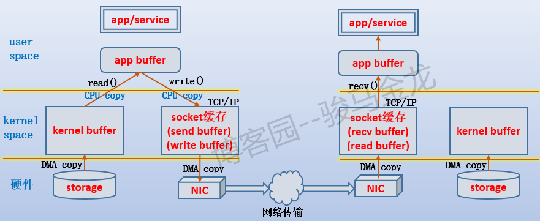
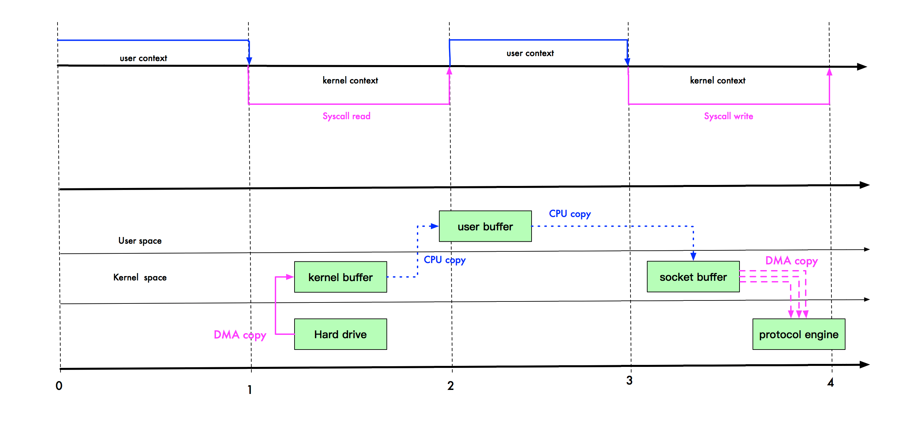
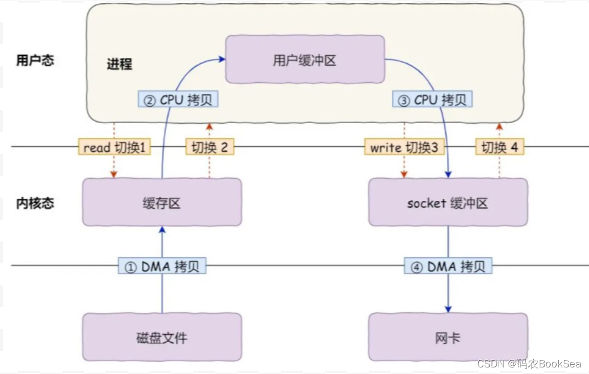
* server端读取请求的文件，然后发送给client
  1. server端读取请求的文件，调用read() 发起system call让内核从存储设备中加载该文件到内存中的kennel buffer
     * 内存设备和存储设备之间的数据传输是DMA copy(Direct Memory Access)，没有cpu参与。用户态切换到内核态
     * 第一次copy （DMA）， 第一次上下文切换
  2. 当数据准备好后,内核唤醒server端子进程/线程，让它使用read()函数把数据复制到它自己的缓冲区app buffer
     * 内核态切换到用户态，cpu copy (kennel buffer -> app buffer)。到了app buffer的数据独属于进程/线程
     * 第二次copy，第二次上下文切换
  3. 当数据处理完后，需要把它响应给浏览器，也就是使用write()通过TCP连接传输出去
     * TCP协议栈有自己的缓冲区，要通过它发送数据，必须将数据写到它的send buffer中
     * cpu copy (app buffer -> TCP send buffer)。用户态切换到内核态
     * 第三次copy，第三次上下文切换
  4. 非本机数据最终还是会通过网卡传输出去的，从socket的TCP send buffer中拷贝到网络协议引擎（网卡）。
     * 内存和设备之间的数据传输是DMA copy. 
     * 第四次copy（DMA）
  5. write()方法返回
     * 内核态切换到用户态
     * 第四次上下文切换

* client端接受请求的文件
  1. client主机的网卡收到响应数据后，将它传输到TCP的recv buffer
     * DMA copy （DMA）
     * 第一次copy
  2. 通知client进程使用recv()将数据从recv buffer读到app buffer
     * cpu copy，内核态切换到用户态
     * 第二次copy，第一次上下文切换

## mmap() + write()
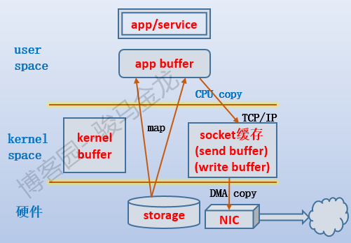
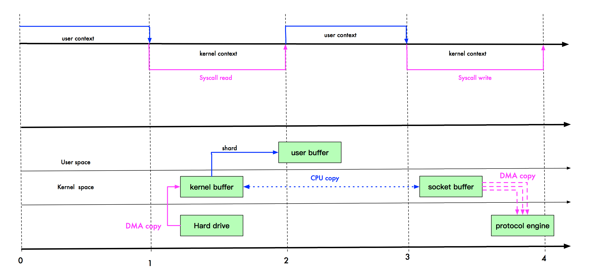
* 对于server端mmap优化, 优化了第一步和第二步
  1. server端读取请求的文件，调用mmap() 发起system call让内核从存储设备中加载该文件到内存中的kennel buffer
     * DMA copy, 用户态切换到内核态
     * 第一次copy （DMA）， 第一次上下文切换
  2. 调用mmap()将文件直接映射到用户程序的内存中。
     * 即Share kennel buffer到用户空间 （内核空间和用户空间的虚拟地址映射到同一个物理地址）。
       * 多个虚拟内存可以指向同一个物理地址
       * 虚拟内存空间可以远远大于物理内存空间
       
         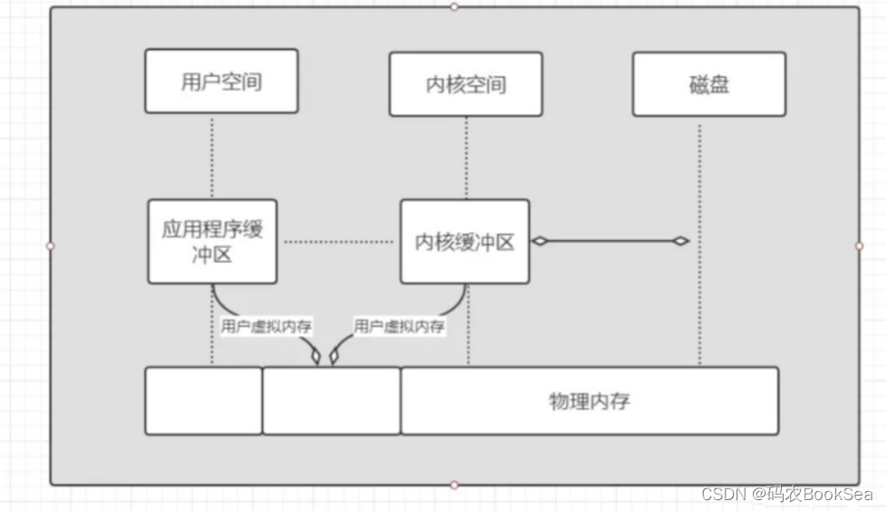
         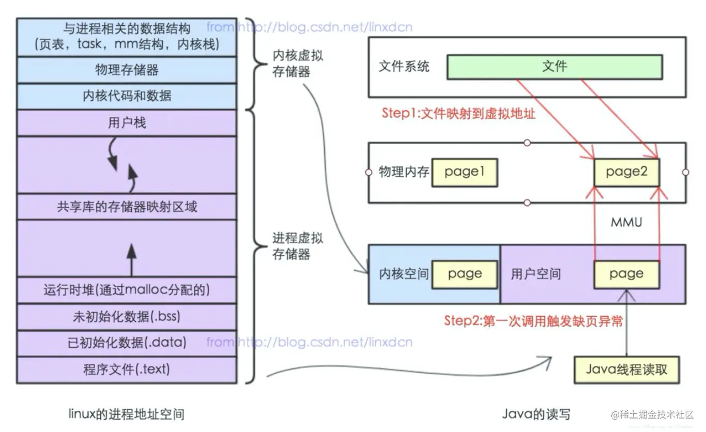
     * 映射成功时返回指向目标区域的指针， 这段内存空间可以用作进程间的共享内存空间，内核也可以直接操作这段空间。
     * 内核态切换到用户态
     * 第二次上下文切换
* 减少了一次copy
* Code
  ```
  #include <sys/mman.h>
  void *mmap(void *addr, size_t length, int prot, int flags,
             int fd, off_t offset);
  ```
* mmap也有一个很明显的缺陷——不可靠，写到mmap中的数据并没有被真正的写到硬盘，操作系统会在程序主动调用flush的时候才把数据真正的写到硬盘。
  * Kafka提供了一个参数——producer.type来控制是不是主动flush；
    * 如果Kafka写入到mmap之后就立即flush然后再返回Producer叫同步(sync)；
    * 写入mmap之后立即返回Producer不调用flush叫异步(async)。
## sendfile()
* sendfile()函数借助文件描述符来实现数据拷贝：直接将文件描述in_fd的数据拷贝给文件描述符out_fd，其中in_fd是数据提供方，out_fd是数据接收方。
* 文件描述符的操作都是在内核进行的，不会经过用户空间，所以数据不用拷贝到app buffer，实现了零复制。
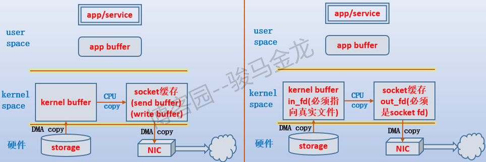
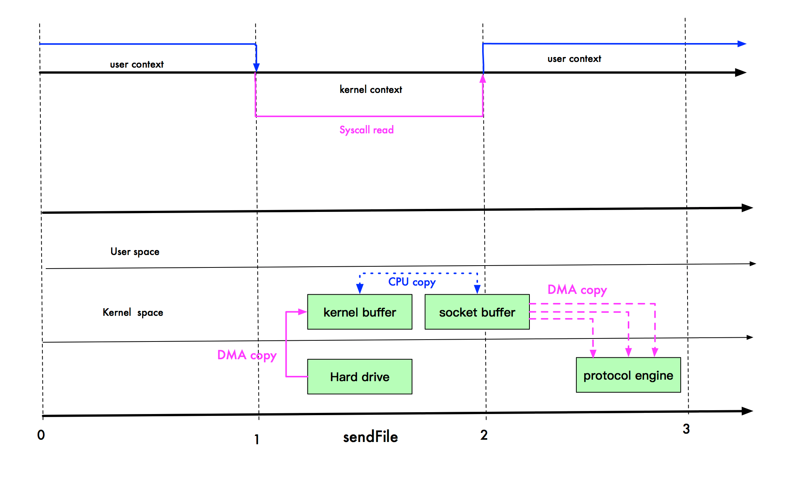
* 对于server端sendfile优化
  1. server端读取请求的文件，调用sendfile() 发起system call让内核从存储设备中加载该文件到内存中的kennel buffer
      * DMA copy, 用户态切换到内核态
      * 第一次copy （DMA）， 第一次上下文切换
  2. 当数据准备好后, 直接调用write(),无需切换到用户态
      * CPU copy (kennel buffer -> TCP send buffer)
      * 第二次copy
      * DMA copy (TCP send buffer -> 网络协议引擎（网卡）)
      * 第三次copy （DMA）
      * Linux 2.4版本对这步的优化 - 带有 scatter/gather 的 sendfile方式
        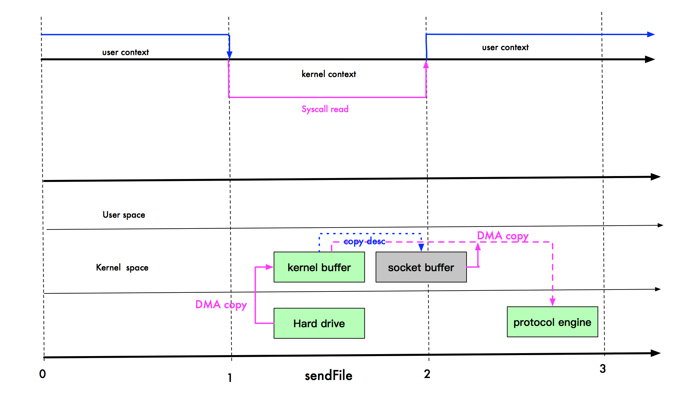
        * CPU copy 只拷贝文件描述符(offset和length等信息) (kennel buffer -> TCP send buffer)
        * DMA copy 直接到网卡 (kennel buffer -> 网络协议引擎（网卡）)
        * 再减少一次copy
  3. sendFile()方法返回 (copy到TCP send buffer的时候返回)
      * 内核态切换到用户态
      * 第二次上下文切换
* Code
  ```
  #include<sys/sendfile.h> 
  ssize_t sendfile(int out_fd, int in_fd, off_t *offset, size_t count);
  ```
* sendfile的in_fd必须指向支持mmap的文件，也就是真实存在的文件，而不能是socket、管道等文件。
* 在Linux 2.6.33之前，还限制out_fd必须是指向socket文件的描述符，所以人们总认为它专门用于进行网络数据拷贝。
* 但从Linux 2.6.33开始，out_fd可以是任何文件，且如果是一个普通文件，则sendfile()会合理地修改文件的offset。
* 以nginx开启了tcp_nopush的sendfile为例，
  * 当开启了tcp_nopush功能后，nginx先在用户空间构建响应首部，
  * 并放进socket send buffer中，然后再向sender buffer中写入一个待加载文件的标识(例如，
  * 声明我稍后要读取a.txt文件中的数据发给你)，这两部分先发送给客户端，
  * 然后再加载磁盘文件(sendfile模式加载)，每挤满一次send buffer就发送一次，直到所有数据都发送完。
* Java sendFile 底层实现
  * Java send file api 是 FileChannel.transferTo 方法和 FileChannel.transferFrom 方法。
  * 注意：send file 是一个从磁盘到网卡驱动的 IO 优化。反过来，网卡到磁盘，是没有这个 IO 优化的。也就是说 transferFrom 方法并没有这种福利。
  * transferFrom就是使用了 MMAP 和 堆外内存而已。如果是普通 FileChannel 的话，就走 mmap，否则，走堆外内存，例如我们本次使用的 SocketChannelImpl。
  * transferTo先尝试sendfile，如操作系统不支持，对于信任的channel类型，调用mmap，否则走标准的read/write系统调用。
    * windows系统是不支持sendfile的，所以windows下实际走的是mmap，性能较之read/write方式也要好很多。
## splice()
* splice()函数可以在两个文件描述符之间移动数据，且其中一个描述符必须是管道描述符。
  * splice(fd, ...pipe, ...)
  * splice(pipe, ...fd, ...)
* splice一直以来就只是一种机制，它并不仅限于sendfile的功能。也就是说 sendfile 是 splice 的一个子集。
* 在 Linux 2.6.23 版本中， sendfile 机制的实现已经没有了，但是其 API 及相应的功能还在，只不过 API 及相应的功能是利用了 splice 机制来实现的。
* 和sendfile 不同的是，splice 不需要硬件支持。

## tee()
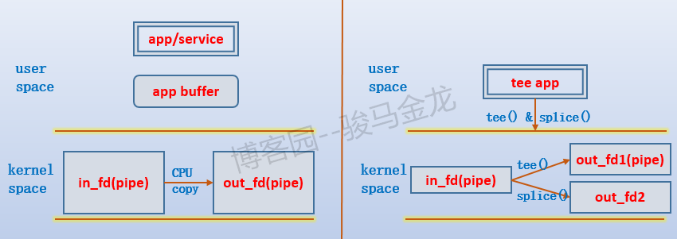
* tee()函数在两个管道描述符之间复制数据
* 由于从in_fd复制给另一个管道out_fd时，不认为数据是来自于in_fd的，所以复制数据后，in_fd仍可使用splice()函数进行数据移动。

## 写时复制技术(copy-on-write,COW)
* 使用copy-on-write技术，使得在fork子进程时不复制内存页，而是共享内存页(也就是说，子进程也指向父进程的物理空间)，
* 只有在该子进程需要修改某一块数据，才会将这一块数据拷贝到自己的app buffer中并进行修改，
* 那么这一块数据就属于该子进程的私有数据，可随意访问、修改、复制。这在一定程度上实现了零复制，即使复制了一些数据块，也是在逐渐需要的过程进行复制的。
* Test Code
```
/*
 * project:  normal
 * file:     proc.cpp
 * brief:	 fork test copy-on-write
 * author:   wenfh2020
 * date:     2020-01-02
 * page:     https://wenfh2020.com
 */

#include <errno.h>
#include <signal.h>
#include <stdio.h>
#include <stdlib.h>
#include <string.h>
#include <sys/types.h>
#include <sys/wait.h>
#include <unistd.h>

#include <iostream>

#define MEM_SIZE (1024 * 1024 * 1024 / 4)

volatile bool is_child_end = false;

// 修改测试数据
void format_data(int* array, size_t len) {
    if (array) {
        srand((unsigned)time(NULL));
        for (size_t i = 0; i < len; i++) {
            array[i] = i + rand() % len;
        }
    }
}

// 测试内存对象
class alloc_data {
   public:
    alloc_data() : m_array(NULL), m_len(MEM_SIZE) {
        m_array = new int[m_len];
        if (m_array != NULL) {
            format_data(m_array, m_len);
            printf("alloc, data ptr: %#lx, array ptr: %#lx\n",
                   (unsigned long)this, (unsigned long)&m_array);
        } else {
            printf("alloc data fail, pid: %d\n", getpid());
        }
    }

    virtual ~alloc_data() {
        if (m_array != NULL) {
            delete[] m_array;
            printf("delete data, pid: %d\n", getpid());
        }
    }

    void reset() {
        printf("reset data, data ptr: %#lx, array ptr: %#lx\n",
               (unsigned long)this, (unsigned long)&m_array);
        format_data(m_array, m_len);
    }
    int get_data_len() { return m_len; }

   private:
    int* m_array;
    int m_len;
};

alloc_data g_data;

void sig_child_handler(int /*signal_num*/) {
    pid_t pid;
    int status;
    int old_errno = errno;

    while ((pid = waitpid(-1, &status, WNOHANG)) > 0) {
        if (WIFEXITED(status)) {
            printf("child %d terminated normally with exit status = %d\n", pid,
                   WEXITSTATUS(status));
        } else {
            printf("child %d terminated abnormally\n", pid);
        }
    }

    if (errno != ECHILD) {
        printf("waitpid error\n");
        is_child_end = true;
        return;
    }

    errno = old_errno;
    printf("sig_child_handler end, errno: %d\n", errno);
    is_child_end = true;
}

void do_some_thing() {
    while (!is_child_end) {
        usleep(100);
    }
}

// #define SIGCHLD 20      /* to parent on child stop or exit */

void signal_set() {
    struct sigaction sigchild_action;
    memset(&sigchild_action, 0, sizeof(sigchild_action));
    sigchild_action.sa_handler = &sig_child_handler;
    sigaction(SIGCHLD, &sigchild_action, NULL);
}

int main() {
    signal_set();
    pid_t pid = fork();
    if (0 == pid) {
        printf("child pid: %d, data ptr: %#lx\n", getpid(),
               (unsigned long)&g_data);
        sleep(5);  // update data before
        printf("child pid: %d, reset data:\n", getpid());
        g_data.reset();
        sleep(5);  // update data later
        exit(0);
    } else if (pid > 0) {
        printf("parent pid: %d, data ptr: %#lx\n", getpid(),
               (unsigned long)&g_data);
        // sleep(10);
        // sleep() makes the calling process sleep until seconds seconds have
        // elapsed or a signal arrives which is not ignored.
    } else {
        printf("fork fail\n");
        exit(1);
    }

    do_some_thing();
    printf("parent end, pid: %d\n", getpid());
    return 0;
}  
```

## mmap 和 sendFile 的区别。
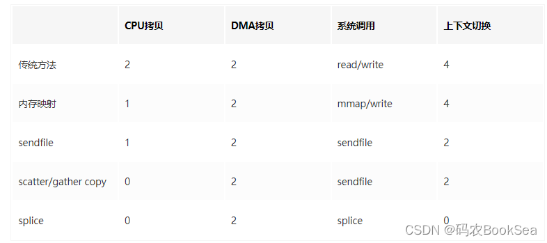
* mmap 适合小数据量读写，sendFile 适合大文件传输。
* mmap 需要 4 次上下文切换，3 次数据拷贝；sendFile 需要 2 次上下文切换，最少 2 次数据拷贝。
* sendFile 可以利用 DMA 方式，减少 CPU 拷贝，mmap 则不能（必须从内核拷贝到 Socket 缓冲区）。
* rocketMQ 在消费消息时，使用了 mmap。kafka 使用了 sendFile。


## 零拷贝应用
### Java NIO
* JVM的GC机制则会存在对内存的拷贝移动，会影响效率。当有一些高性能要求场景，需要直接使用OS原生的堆内存
* DirectByteBuffer则是可出直接申请与释放JVM堆外内存。此内存不由JVM管理，不受GC影响。直接使用堆外内存从而避免了数据在JVM堆与OS用户堆的拷贝。
* Java NIO API提供了OS层零拷贝的API封装，上层也非常方便的使用。
  * mmap ：NIO中map返回一个MappedByteBuffer类，其底层是mmap系统调用
  * sendfile : NIO中提供的FileChannel提供两个方法（transferTo/transferFrom），其底层是sendfile系统调用

### Netty
* Netty相比与Java内置的NIO，它从三个层次来减少数据的拷贝：
  * 避免数据流经用户空间 ：Netty的FileRegion中FileChannel.tranferTo，可以实现数据如何写到目标中，可以使用mmap+write
  * 避免数据在JVM堆与OS用户堆的拷贝 ：Java提供DirectByteBuffer，Netty提供对DirectByteBuffer与JVM的堆内存的统一ByteBuf接口封装
  * 避免数据在用户空间多次多次拷贝 ：Netty提供ByteBuf抽象，支持引用计数与池化。并提供CompositeByteBuf组合视图来减少拷贝
  * ByteBuf：retain/release引用计数
  * ByteBufHolder：duplicate对于ByteBuf进行一个浅拷贝，共享同一个数据区域，但不共享read和write索引
  * CompositeByteBuf：组合数个缓冲区为一体，并对外展现为一个缓冲区，可以将它们逻辑上当成一个完整的ByteBuf来操作，这样就免去了重新分配空间再复制数据的开销