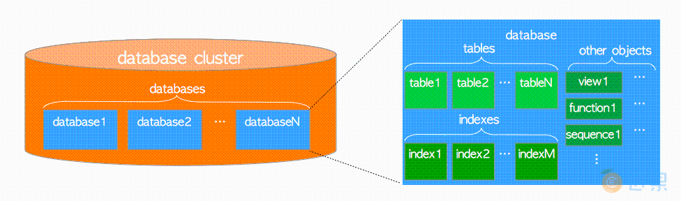
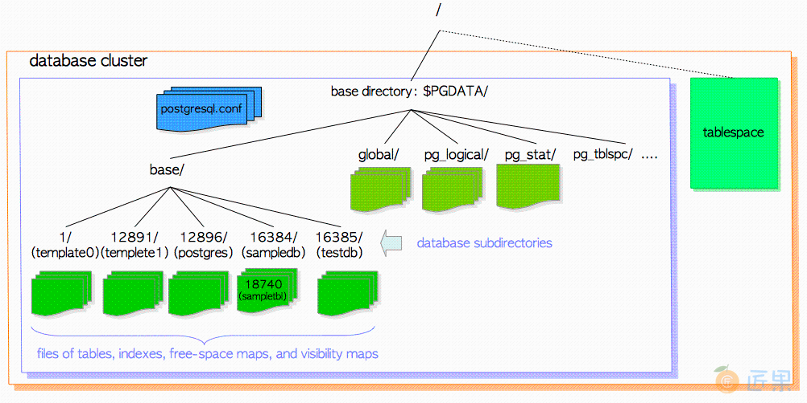
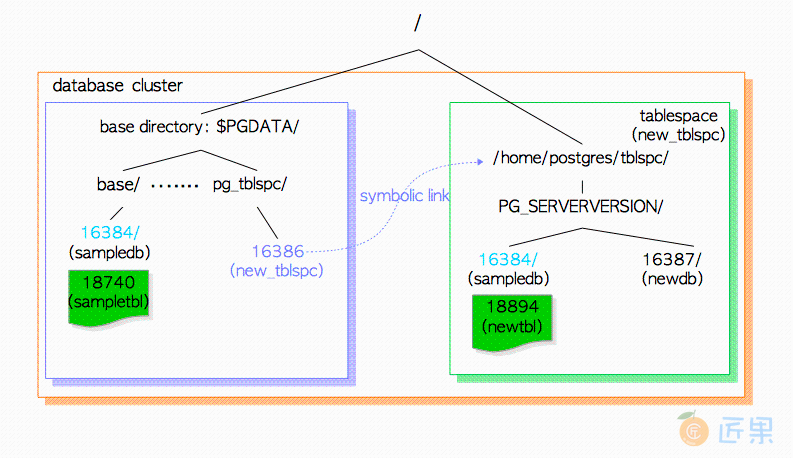
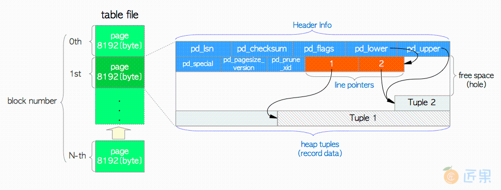
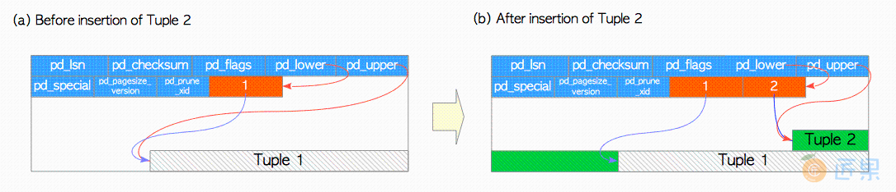
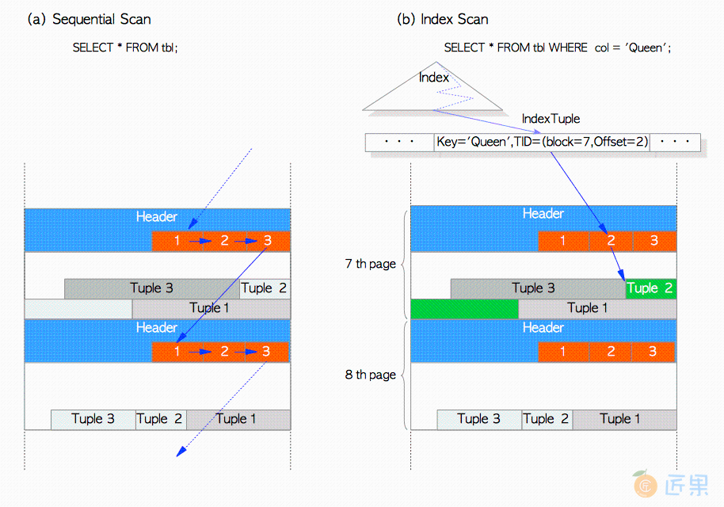
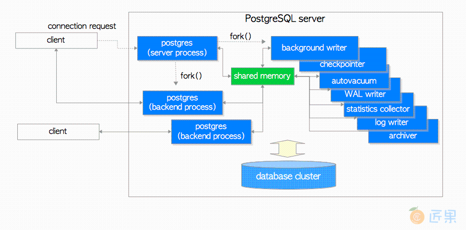
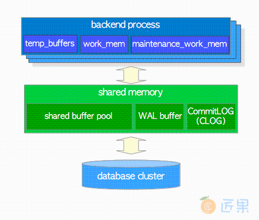

## 数据库集簇的逻辑结构
* 数据库集簇（database cluster） 是一组数据库（database） 的集合，由一个PostgreSQL服务器管理。
* 数据库（database） 是数据库对象（database objects） 的集合。

  
* PostgreSQL中数据库本身也是数据库对象
* 在PostgreSQL内部，所有的数据库对象都通过相应的对象标识符（Object Identifiers, OID）进行管理
* OID是无符号的4字节整型
* 数据库对象与相应OID之间的关系存储在相应的系统目录中
* 数据库和堆表对象的OID分别存储在pg_database和pg_class
  ```
  sampledb=# SELECT datname, oid FROM pg_database WHERE datname = 'sampledb';
  datname  |  oid  
  ----------+-------
  sampledb | 16384
  (1 row)
  sampledb=# SELECT relname, oid FROM pg_class WHERE relname = 'sampletbl';
  relname  |  oid  
  -----------+-------
  sampletbl | 18740
  (1 row)
  ```
  
## 数据库集簇的物理结构
* 数据库集簇在本质上就是一个文件目录 - 基础目录（base directory）, 包含着一系列子目录与文件。
* 执行 initdb 命令会在指定目录下创建基础目录从而初始化一个新的数据库集簇。
* 通常会将基础目录的路径配置到环境变量PGDATA中, 但这并不是必须的。
* base子目录中的每一个子目录都对应一个数据库，数据库中每个表和索引都会在相应子目录下存储为（至少）一个文件；还有几个包含特定数据的子目录，以及配置文件。
* 虽然PostgreSQL支持表空间（Tablespace） ，但该术语的含义与其他RDBMS不同。 PostgreSQL中的表空间对应一个包含基础目录之外数据的目录。
  
  

### 数据库集簇的布局
* base目录下的主要的文件与子目录：
  ```
  子目录	描述
  base/	每个数据库对应的子目录存储于此
  global/	数据库集簇范畴的表（例如pg_database），以及pg_control文件。
  pg_commit_ts/	事务提交的时间戳数据（9.5及更新版本）。
  pg_clog/ (9.6-)	事务提交状态数据（9.6及更老版本），在版本10中被重命名为pg_xact。
  pg_dynshmem/	动态共享内存子系统中使用的文件（9.4或更新版本）。
  pg_logical/	逻辑解码的状态数据（9.4或更新版本）。
  pg_multixact/	多事务状态数据
  pg_notify/	LISTEN/NOTIFY状态数据
  pg_repslot/	复制槽数据（9.4或更新版本）。
  pg_serial/	已提交的可串行化事务相关信息（9.1或更新版本）
  pg_snapshots/	导出快照（9.2或更新版本）。 PostgreSQL函数pg_export_snapshot在此子目录中创建快照信息文件。
  pg_stat/	统计子系统的永久文件
  pg_stat_tmp/	统计子系统的临时文件
  pg_subtrans/	子事务状态数据
  pg_tblspc/	指向表空间的符号链接
  pg_twophase/	两阶段事务（prepared transactions）的状态文件
  pg_wal/ (10+)	WAL（ Write Ahead Logging）段文件（10或更新版本），从pg_xlog重命名而来。
  pg_xact/ (10+)	事务提交状态数据，（10或更新版本），从pg_clog重命名而来。
  pg_xlog/ (9.6-)	WAL（Write Ahead Logging） 段文件（9.6及更老版本），它在版本10中被重命名为pg_wal。
  ```

### 数据库布局
* 一个数据库与base子目录下的一个子目录对应, 且该子目录的名称与相应数据库的OID相同。
* 例子：数据库sampledb的OID为16384时，它对应的子目录名称即为16384。
 ```
 $ cd $PGDATA
 $ ls -ld base/16384
 drwx------  213 postgres postgres  7242  8 26 16:33 16384
 ```

### 表与索引相关文件的布局
* 每个小于1GB的表或索引都在相应的数据库目录中存储为单个文件。
* 在数据库内部，表和索引作为数据库对象是通过OID来管理的，而这些数据文件则由变量relfilenode管理。
* relfilenode值通常与其OID一致，但也有例外
  ```
  sampledb=# SELECT relname, oid, relfilenode FROM pg_class WHERE relname = 'sampletbl';
  relname  |  oid  | relfilenode
  -----------+-------+-------------
  sampletbl | 18740 |       18740
  (1 row)
  ```
* 从上面的结果可以看出oid和relfilenode值相等。还可以看到表sampletbl的数据文件路径是base/16384/18740。
  ```
  $ cd $PGDATA
  $ ls -la base/16384/18740
  -rw------- 1 postgres postgres 8192 Apr 21 10:21 base/16384/18740
  ```
* 表和索引的relfilenode值会被一些命令（例如TRUNCATE，REINDEX，CLUSTER）所改变。
* 对表 sampletbl执行TRUNCATE，PostgreSQL会为表分配一个新的relfilenode（18812），删除旧的数据文件（18740），并创建一个新的数据文件（18812）。
  ```
  sampledb=# TRUNCATE sampletbl;
  TRUNCATE TABLE
  sampledb=# SELECT relname, oid, relfilenode FROM pg_class WHERE relname = 'sampletbl';
  relname  |  oid  | relfilenode
  -----------+-------+-------------
  sampletbl | 18740 |       18812
  (1 row)
  ```
* 在9.0或更高版本中，内建函数pg_relation_filepath能够根据OID或名称返回关系对应的文件路径，非常实用。
  ```
  sampledb=# SELECT pg_relation_filepath('sampletbl');
  pg_relation_filepath
  ----------------------
  base/16384/18812
  (1 row)
  ```
* 当表和索引的文件大小超过1GB时，PostgreSQL会创建并使用一个名为relfilenode.1的新文件。如果新文件也填满了，则会创建下一个名为relfilenode.2的新文件，依此类推。
  ```
  $ cd $PGDATA
  $ ls -la -h base/16384/19427*
  -rw------- 1 postgres postgres 1.0G  Apr  21 11:16 data/base/16384/19427
  -rw------- 1 postgres postgres  45M  Apr  21 11:20 data/base/16384/19427.1
  ```
* 在构建PostgreSQL时，可以使用配置选项--with-segsize更改表和索引的最大文件大小。
* 每个表都有两个与之相关联的文件，后缀分别为_fsm和_vm。这些实际上是空闲空间映射（free space map） 和可见性映射（visibility map） 文件，分别存储了表文件每个页面上的空闲空间信息与可见性信息
  ```
  $ cd $PGDATA
  $ ls -la base/16384/18751*
  -rw------- 1 postgres postgres  8192 Apr 21 10:21 base/16384/18751
  -rw------- 1 postgres postgres 24576 Apr 21 10:18 base/16384/18751_fsm
  -rw------- 1 postgres postgres  8192 Apr 21 10:18 base/16384/18751_vm
  ```
* 在数据库系统内部，这些文件（主体数据文件，空闲空间映射文件，可见性映射文件等）也被称为相应关系的分支（fork）
  * 每个 关系（relation） 可能会有四种分支，分支编号分别为0，1，2，3
  * 空闲空间映射是表/索引数据文件的第一个分支（分支编号为1）
  * 可见性映射表是数据文件的第二个分支（分支编号为2）
  * 数据文件的分支编号为0。
  * 3号分支init是很少见的特殊分支，通常用于不被日志记录（unlogged）的表与索引。
  * 每个分支都会被存储为磁盘上的一到多个文件
    * PostgreSQL会将过大的分支文件切分为若干个段，以免文件的尺寸超过某些特定文件系统允许的大小，也便于一些归档工具进行并发复制，默认的段大小为1GB。
### 表空间
* 表空间（Tablespace）是基础目录之外的附加数据区域。 在8.0版本中引入了该功能。

  
* 执行CREATE TABLESPACE语句会在指定的目录下创建表空间。而在该目录下还会创建版本特定的子目录（例如PG_9.4_201409291）。版本特定的命名方式为：
  ```
  PG_主版本号_目录版本号
  ```
* 例子：如果在/home/postgres/tblspc中创建一个表空间new_tblspc，其oid为16386，则会在表空间下创建一个名如PG_9.4_201409291的子目录。
  ```
  $ ls -l /home/postgres/tblspc/
  total 4
  drwx------ 2 postgres postgres 4096 Apr 21 10:08 PG_9.4_201409291
  ```
  * 表空间目录通过pg_tblspc子目录中的符号链接寻址，链接名称与表空间的OID值相同。
    ```
    $ ls -l $PGDATA/pg_tblspc/
    total 0
    lrwxrwxrwx 1 postgres postgres 21 Apr 21 10:08 16386 -> /home/postgres/tblspc
    ```
  * 如果在该表空间下创建新的数据库（OID为16387），则会在版本特定的子目录下创建相应目录。
    ```
    $ ls -l /home/postgres/tblspc/PG_9.4_201409291/
    total 4
    drwx------ 2 postgres postgres 4096 Apr 21 10:10 16387
    ```
  * 如果在该表空间内创建一个新表，但新表所属的数据库却创建在基础目录下
    * 那么PG会首先在版本特定的子目录下创建名称与现有数据库OID相同的新目录
    * 然后将新表文件放置在刚创建的目录下。
    ```
    sampledb=# CREATE TABLE newtbl (.....) TABLESPACE new_tblspc;
    sampledb=# SELECT pg_relation_filepath('newtbl');
    pg_relation_filepath
    ----------------------------------------------
    pg_tblspc/16386/PG_9.4_201409291/16384/18894
    ```
* 获取表空间OID
  ```
  sampledb=# select oid, spcname from pg_tablespace;
  sampledb=# SELECT pg_tablespace_location(<tbl_space.oid>);
  ```
* 自带两个表空间：pg_default,pg_global
  * pg_default 用来存储系统目录对象，用户表、用户表index、临时表、临时表index、内部临时表的默认空间。
  * pg_global 用来存储系统字典表
* CREATE DATABASE dbname 默认的数据库所有者是当前创建数据库的角色，默认的表空间是系统的默认表空间–pg_default。
* CREATE TABLESPACE tskanon OWNER kanon LOCATION ‘/tmp/data/tskanon’
  * CREATE DATABASE dbkanon TEMPLATE template1 OWNER kanon TABLESPACE tskanon;
  ```
  CREATE DATABASE actually works by copying an existing database. By default, it copies the standard system database named template1. 
  If you add objects to template1, these objects will be copied into subsequently created user databases.
  
  ~# psql template1 -U c4
  psql (10.22)
  Type "help" for help.
  
  template1=# 


  There is a second standard system database named template0. This database contains the same data as the initial contents of template1, 
  that is, only the standard objects predefined by your version of PostgreSQL. 
  template0 should never be changed after the database cluster has been initialized. 
  
  ~# psql template0 -U c4
  psql: FATAL:  database "template0" is not currently accepting connections


  template0 database in PostgreSQL has two uses:
  Fix template1 database when it is corrupted by the user.
  Restoring a database dump.
  ```

### Schema
* 可以将其理解为一个命名空间或目录: pg_namespace 
* 不同的模式下可以有相同名称的表、函数等对象而不会产生冲突。提出模式的概念是为了便于管理，只要有权限，各个模式的对象可以互相调用。
* 一个数据库包含一个或者多个模式，模式中又包含了表、函数以及操作符等数据库对象。
* 当前用户、当前模式、当前数据库
  ```
  postgres=> \c postgres
  您现在已经连接到数据库 “postgres”,用户 “hr”.
  postgres=>
  postgres=> select current_user,current_schema,current_database();
  current_user | current_schema | current_database
  --------------±---------------±-----------------
  hr | public | postgres
  (1 行记录)
  postgres=> \c hrdb
  您现在已经连接到数据库 “hrdb”,用户 “hr”.
  hrdb=> select current_user,current_schema,current_database();
  current_user | current_schema | current_database
  --------------±---------------±-----------------
  hr | hr | hrdb
  (1 行记录)
  
  模式搜索路径
  hrdb=> show search_path;
  search_path
  -----------------
  "$user", public
  (1 行记录)
  ```
* \dn+ 列出当前数据库的所有的模式和相关的权限。
  ```
  Name | Owner | Access privileges | Description
  --------±---------±---------------------±-----------------------
  public | postgres | postgres=UC/postgres+| standard public schema
         |          | =UC/postgres         |
  (1 rows)
  ```
  * 第一列：当前数据库中模式的名称
  * 第二列：当前数据库中每一个模式的所有者，默认为创建这个模式的角色。
  * 第三列：模式的访问权限
    * postgres(权限接受者)=UC(权限)/postgres(权限授予者)
    * 对模式来说只有两种可以被授予的权限：USAGE和CREATE,对应权限信息中的的U和C。
      * USAGE权限允许角色查询数据库对象，例如包含在模式中的表和视图。
      * CREATE权限允许角色在模式中创建数据库对象。
    * 接受权限者为空字符串，这代表权限会授予给所有的用户
    * ROLE vs USER
      * CREATE ROLE kanon PASSWORD ‘kanon’ LOGIN 等同于CREATE USER kanon PASSWORD ‘kanon’.
      * 或者 CREATE ROLE kanon PASSWORD ‘kanon’, 然后修改kanon的权限，增加LOGIN权限：ALTER ROLE kanon LOGIN
* 在数据库创建的同时，就已经默认为数据库创建了一个模式–public，这也是该数据库的默认模式。
* 创建table在其他模式（命名空间）CREATE TABLE <schema_name>.test (id integer not null);
* 数据库是被模式(schema)来切分的，一个数据库至少有一个模式，所有数据库内部的对象(object)是被创建于模式的。
* 连接到一个数据库后，是通过该数据库的search_path来寻找schema的搜索顺序
* 可以通过命令 SHOW search_path; 具体的顺序，也可以通过SET search_path TO 'schema_name’来修改顺序。
* 官方建议是这样的：在管理员创建一个具体数据库后，应该为所有可以连接到该数据库的用户分别创建一个与用户名相同的模式，然后，将search_path设置为"$user"
## 堆表文件的内部布局
* 在数据文件（堆表，索引，也包括空闲空间映射和可见性映射）内部, 它被划分为固定长度的页（pages） ，或曰 区块（blocks） ，大小默认为8192字节（8KB）。
* 每个文件中的页从0开始按顺序编号，这些数字称为区块号（block numbers） 。
* 如果文件已填满，PostgreSQL通过在文件末尾追加一个新的空页来增长文件。
  
  * 堆元组（heap tuples） —— 堆元组就是数据记录本身。它们从页面底部开始依序堆叠。
  * 行指针（line pointer） —— 每个行指针占4个字节，保存着指向堆元组的指针。
    * 它们也被称为项目指针（item pointer） 
    * 行指针简单地组织为一个数组，扮演了元组索引的角色。
    * 每个索引项从1开始依次编号，称为偏移号（offset number）。
    * 当向页面中添加新元组时，一个相应的新行指针也会被放入数组中，并指向新添加的元组。
    * 首部数据（header data） —— 页面的起始位置分配了由结构PageHeaderData定义的首部数据。它的大小为24个字节
      * pd_lsn —— 本页面最近一次变更所写入XLOG记录对应的LSN。它是一个8字节无符号整数，与WAL机制相关
      * pd_checksum —— 本页面的校验和值。
      * pd_lower，pd_upper —— pd_lower指向行指针的末尾，pd_upper指向最新堆元组的起始位置。
      * pd_special —— 在索引页中会用到该字段。在堆表页中它指向页尾。
        * （在索引页中它指向特殊空间的起始位置，特殊空间是仅由索引使用的特殊数据区域，包含特定的数据，具体内容依索引的类型而定，如B树，Gist，Gin等。)
  ```
  /* @src/include/storage/bufpage.h */
  /*
  * 磁盘页面布局
  *
  * 对任何页面都适用的通用空间管理信息
  *
  *        pd_lsn        - 本页面最近变更对应xlog记录的标识。
  *        pd_checksum - 页面校验和
  *        pd_flags    - 标记位
  *        pd_lower    - 空闲空间开始位置
  *        pd_upper    - 空闲空间结束位置
  *        pd_special    - 特殊空间开始位置
  *        pd_pagesize_version - 页面的大小，以及页面布局的版本号
  *        pd_prune_xid - 本页面中可以修剪的最老的元组中的XID.
  *
  * 缓冲管理器使用LSN来强制实施WAL的基本规则："WAL需先于数据写入"。直到xlog刷盘位置超过
  * 本页面的LSN之前，不允许将缓冲区的脏页刷入磁盘。
  *
  * pd_checksum 存储着页面的校验和，如果本页面配置了校验。0是一个合法的校验和值。如果页面
  * 没有使用校验和，我们就不会设置这个字段的值；通常这意味着该字段值为0，但如果数据库是从早于
  * 9.3版本从 pg_upgrade升级而来，也可能会出现非零的值。因为那时候这块地方用于存储页面最后
  * 更新时的时间线标识。 注意，并没有标识告诉你页面的标识符到底是有效还是无效的，也没有与之关
  * 联的标记为。这是特意设计成这样的，从而避免了需要依赖页面的具体内容来决定是否校验页面本身。
  *
  * pd_prune_xid是一个提示字段，用于帮助确认剪枝是否有用。目前对于索引页没用。
  *
  * 页面版本编号与页面尺寸被打包成了单个uint16字段，这是有历史原因的：在PostgreSQL7.3之前
  * 并没有页面版本编号这个概念，这样做能让我们假装7.3之前的版本的页面版本编号为0。我们约束页面
  * 的尺寸必须为256的倍数，留下低8位用于页面版本编号。
  *
  * 最小的可行页面大小可能是64字节，能放下页的首部，空闲空间，以及一个最小的元组。当然在实践中
  * 肯定要大得多(默认为8192字节)，所以页面大小必需是256的倍数并不是一个重要限制。而在另一端，
  * 我们最大只能支持32KB的页面，因为 lp_off/lp_len字段都是15bit。
  */
  typedef struct PageHeaderData
  {
    PageXLogRecPtr     pd_lsn;            /* 最近应用至本页面XLog记录的LSN */
    uint16            pd_checksum;    /* 校验和 */
    uint16              pd_flags;        /* 标记位，详情见下 */
    LocationIndex     pd_lower;        /* 空闲空间起始位置 */
    LocationIndex     pd_upper;        /* 空闲空间终止位置 */
    LocationIndex     pd_special;        /* 特殊用途空间的开始位置 */
    uint16              pd_pagesize_version;
    TransactionId     pd_prune_xid;     /* 最老的可修剪XID, 如果没有设置为0 */
    ItemIdData        pd_linp[FLEXIBLE_ARRAY_MEMBER]; /* 行指针的数组 */
  } PageHeaderData;
  /* 缓冲区页中的项目指针(item pointer)，也被称为行指针(line pointer)。
  *
  * 在某些情况下，项目指针处于 “使用中”的状态，但在本页中没有任何相关联的存储区域。
  * 按照惯例，lp_len == 0 表示该行指针没有关联存储。独立于其lp_flags的状态.
  */
  typedef struct ItemIdData
  {
    unsigned    lp_off:15,        /* 元组偏移量 (相对页面起始处) */
                lp_flags:2,        /* 行指针的状态，见下 */
                lp_len:15;        /* 元组的长度，以字节计 */
  } ItemIdData;
  /* lp_flags有下列可能的状态，LP_UNUSED的行指针可以立即重用，而其他状态的不行。 */
  #define LP_UNUSED        0        /* unused (lp_len必需始终为0) */
  #define LP_NORMAL        1        /* used (lp_len必需始终>0) */
  #define LP_REDIRECT        2        /* HOT 重定向 (lp_len必需为0) */
  #define LP_DEAD            3        /* 死元组，有没有对应的存储尚未可知 */
  ```
  * 行指针的末尾与最新元组起始位置之间的空余空间称为空闲空间（free space） 或空洞（hole） 。
  * 为了识别表中的元组，数据库内部会使用元组标识符（tuple identifier, TID） 。TID由一对值组成：元组所属页面的区块号 ，及指向元组的行指针的偏移号 。
  * 大小超过约2KB（8KB的四分之一）的堆元组会使用一种称为 TOAST（The Oversized-Attribute Storage Technique，超大属性存储技术） 的方法来存储与管理。

## 读写元组的方式
* 写入堆元组
  * 让我们假设有一个表，仅由一个页面组成，且该页面只包含一个堆元组。 
    * 此页面的pd_lower指向第一个行指针
      * 而该行指针和pd_upper都指向第一个堆元组。

    
    * 当第二个元组被插入时, 它会被放在第一个元组之后。
      * 第二个行指针被插入到第一个行指针的后面，并指向第二个元组
      * pd_lower更改为指向第二个行指针
      * pd_upper更改为指向第二个堆元组
      *  页面内的首部数据（例如pd_lsn，pg_checksum，pg_flag）也会被改写为适当的值
* 读取堆元组
  * 简述两种典型的访问方式：顺序扫描与B树索引扫描：
    * 顺序扫描 —— 通过扫描每一页中的行指针，依序读取所有页面中的所有元组
    * B树索引扫描 —— 索引文件包含着索引元组，索引元组由一个键值对组成，键为被索引的列值，值为目标堆元组的TID。
      * 进行索引查询时，首先使用键进行查找，如果找到了对应的索引元组，PostgreSQL就会根据相应值中的TID来读取对应的堆元组

    

## 进程架构
* PostgreSQL是一个客户端/服务器风格的关系型数据库管理系统，采用多进程架构，运行在单台主机上。
* 我们通常所谓的“PostgreSQL服务器（PostgreSQL Server） ” 实际上是一系列协同工作的进程集合，包含着下列进程：
  * postgres服务器进程（Postgres Server Process） 是所有数据库集簇管理进程的父进程。
  * 每个后端进程（Backend Process） 负责处理客户端发出的查询和语句。
  * 各种后台进程（Background Process） 负责执行各种数据库管理任务（例如清理过程与检查点过程）。
  * 各种复制相关（Replication Associated Process） 的进程负责流复制
  * 后台工作进程（Background Worker Process） 在9.3版被引入，它能执行任意由用户实现的处理逻辑

  
* 后端进程
  * 每个后端进程（也称为*”postgres“* ）由postgres服务器进程启动，并处理连接另一侧的客户端发出的所有查询。它通过单条TCP连接与客户端通信，并在客户端断开连接时终止。
  * PostgreSQL允许多个客户端同时连接；配置参数max_connections用于控制最大客户端连接数 （默认为100）。
  ```
  因为PostgreSQL没有原生的连接池功能，因此如果许多客户端频繁地重复与PostgreSQL服务器建立断开连接（譬如Web应用），
  则会导致建立连接与创建后端进程的开销变大。这种情况对数据库服务器的性能有负面影响，通常可以使用池化中间件（pgbouncer或pgpool-II）来避免该问题。
  ```
* 后台进程
  ```
  进程	概述	
  background writer	本进程负责将共享缓冲池中的脏页逐渐刷入持久化存储中（例如，HDD，SSD）（在9.1及更旧版本中，它还负责处理检查点（checkpoint） ）
  checkpointer	在9.2及更新版本中，该进程负责处理检查点。
  autovacuum launcher	周期性地启动自动清理工作进程（更准确地说，它向Postgres服务器请求创建自动清理工作进程）
  WAL writer	本进程周期性地将WAL缓冲区中的WAL数据刷入持久存储中。
  statistics collector	本进程负责收集统计信息，用于诸如pg_stat_activity，pg_stat_database等系统视图。
  logging collector (logger)	本进程负责将错误消息写入日志文件。
  archiver	本进程负责将日志归档。
  ```
* 例子： postgres服务器进程（pid为9687），两个后端进程（pid为9697和9717）
  ```
  postgres> pstree -p 9687
  -+= 00001 root /sbin/launchd
  \-+- 09687 postgres /usr/local/pgsql/bin/postgres -D /usr/local/pgsql/data
  |--= 09688 postgres postgres: logger process   
  |--= 09690 postgres postgres: checkpointer process   
  |--= 09691 postgres postgres: writer process   
  |--= 09692 postgres postgres: wal writer process   
  |--= 09693 postgres postgres: autovacuum launcher process   
  |--= 09694 postgres postgres: archiver process   
  |--= 09695 postgres postgres: stats collector process   
  |--= 09697 postgres postgres: postgres sampledb 192.168.1.100(54924) idle  
  \--= 09717 postgres postgres: postgres sampledb 192.168.1.100(54964) idle in transaction
  ```
## 内存架构
* PostgreSQL的内存架构可以分为两部分：
  * 本地内存区域 —— 由每个后端进程分配，供自己使用。
    ```
    子区域	描述
    work_mem:	执行器在执行ORDER BY和DISTINCT时使用该区域对元组做排序，以及存储归并连接和散列连接中的连接表。
    maintenance_work_mem:	某些类型的维护操作使用该区域（例如VACUUM，REINDEX）。
    temp_buffers:	执行器使用此区域存储临时表。
    ```
  * 共享内存区域 —— 供PostgreSQL服务器的所有进程使用。
    ```
    子区域	描述
    shared buffer pool:	PostgreSQL将表和索引中的页面从持久存储加载至此，并直接操作它们。
    WAL buffer:	为确保服务故障不会导致任何数据丢失，PostgreSQL实现了WAL机制。 WAL数据（也称为XLOG记录）是PostgreSQL中的事务日志；WAL缓冲区是WAL数据在写入持久存储之前的缓冲区。
    commit log:	提交日志（Commit Log, CLOG） 为并发控制（CC）机制保存了所需的所有事务状态（例如进行中，已提交，已中止等）。
    ```
    * 除了上面这些，PostgreSQL还分配了这几个区域：
      * 用于访问控制机制的子区域（例如信号量，轻量级锁，共享和排他锁等）。
      * 各种后台进程使用的子区域，例如checkpointer和autovacuum。
      * 用于事务处理的子区域，例如保存点（save-point） 与 两阶段提交（2PC） 。
   
  
