## 索引管理
### 创建索引
* 创建索引时，不能包括schema模式名，因为索引默认被创建在其基表所在的模式中，创建的索引类型默认是btree。
* 创建索引: ```CREATE INDEX [IF NOT EXISTS] index_name ON schema_name.table_name ( column_name );```
  * 例子: ```CREATE INDEX idx_vehiclestructured_recordid ON viid_vehicle.vehiclestructured (recordid);```
* 创建指定索引类型: ```CREATE INDEX IF NOT EXISTS index_name ON schema_name.table_name USING GIN ( column_name );```
* 并发构建索引，在创建索引时不阻塞写入: ```CREATE INDEX CONCURRENTLY [IF NOT EXISTS] index_name ON schema_name.table_name (column_name);```
  * 例子: ```CREATE INDEX CONCURRENTLY idx_vehiclestructured_recordid ON viid_vehicle.vehiclestructured (recordid);```
* 创建联合索引: ```CREATE INDEX [IF NOT EXISTS] index_name ON schema_name.table_name(column01_name,column02_name,...);```
  * 例子: ```CREATE INDEX CONCURRENTLY idx_vehiclestructured_join ON viid_vehicle.vehiclestructured (deviceid,vehiclecolor);```

### 修改索引
* 索引重命名: ```ALTER INDEX [IF EXISTS] schema_name.old_name RENAME TO new_name;```
  * 例子: ```ALTER INDEX IF EXISTS viid_vehicle.idx_vehiclestructured_recordid RENAME TO idx_vehiclestructured_recordid1;```

### 删除索引
* ```DROP INDEX [IF EXISTS] schema_name.index_name;```
  * 例子: ```DROP INDEX IF EXISTS viid_vehicle.idx_vehiclestructured_recordid;```

### 重建索引
* ```REINDEX {INDEX | TABLE | DATABASE | SYSTEM} schema_name.index_name;```
  * 例子: 
    ```
    REINDEX INDEX viid_vehicle.idx_vehiclestructured_recordid;
    REINDEX TABLE viid_vehicle.vehiclestructured; 
    REINDEX DATABASE viid;
    
    or
    
    DROP INDEX viid_vehicle.idx_vehiclestructured_recordid;
    CREATE INDEX idx_vehiclestructured_recordid ON viid_vehicle.vehiclestructured ( recordid );
    ```

## 索引扫描方式
### ctid
* ctid在PostgreSQL中表示数据记录的物理行当信息，表示表中的一条记录位于哪个数据块的哪个位置上。
  ```
  CREATE TABLE test(
  id int4,
  name varchar(16)
  );
  
  INSERT INTO test (id,name) VALUES (1, 'bob');
  INSERT INTO test (id,name) VALUES (2, 'tom');
  INSERT INTO test (id,name) VALUES (3, 'jim');
  INSERT INTO test (id,name) VALUES (4, 'amy');

  SELECT ctid, * FROM test;
    ctid  | id | name
   -------+----+------
   (0, 1) | 1  | bob
   (0, 2) | 2  | tom
   (0, 3) | 3  | jim
   (0, 4) | 4  | amy
  ```
* 可以看出ctid的形式为(blockid,itemid),用(0,1)来解释:0表示块id;1表示在该块第一条记录。
* 现在把表中的数据删除一条之后，再重新插入一条新数据，再来查看该表每一行记录的ctid情况。
  ```
  DELETE FROM test WHERE name = 'jim';
  INSERT INTO test (id, name) VALUES (5, 'mike');
  
  SELECT ctid, * FROM test;
    ctid  | id | name
   -------+----+------
   (0, 1) | 1  | bob
   (0, 2) | 2  | tom
   (0, 4) | 4  | amy
   (0, 5) | 5  | mike
  ```
* 可以看出来，当表中name=jim这条数据被删除时，该条数据的空间(0,3)是被保留下来的，下一条插入的数据使用的ctid是(0,5)，可以看出数据虽然被删除，但是空间是没有释放的，如果要想把这块空间重新给新入库的数据使用，需要用到vacuum这个命令，或者设置参数autovacuum=on;
* 执行vacuum命令之后，再插入一条新数据，再来查看该表每一行记录的ctid情况。
  ```
  DVACUUM test;
  INSERT INTO test (id, name) VALUES (6, 'john');
  
  SELECT ctid, * FROM test;
    ctid  | id | name
   -------+----+------
   (0, 1) | 1  | bob
   (0, 2) | 2  | tom
   (0, 3) | 6  | john
   (0, 4) | 4  | amy
   (0, 5) | 5  | mike
  ```
* 可以看出来(0,3)这个空间又被重新使用了；ctid作为唯一标识，可以用它进行数据的去重操作。

### Seq Scan
```
SeqScan叫做顺序扫描也叫做全表扫描，虽然它和索引没有关系，但是这边也提一下，方式就是把表的所有的数据块全部读取一遍，筛选出符合条件的数据。
当表的数据量较少时，建立索引查询效率比不上全表扫描。原因是索引扫描至少要发生两次I/O，一次是读取索引块，另一次是读取数据块，固耗时久。
```

### Index Scan
```
IndexScan的索引扫描方式就是根据查询索引找到匹配记录的ctid，再通过ctid去查堆表把相应的数据读出来。
```

### Bitmap Scan
```
BitmapScan通过索引找到匹配记录的ctid集合，把ctid集合在内存中建一个位图做集合运算和排序等。再根据位图列表的数据文件把相应的数据读出来。
例如计划走了两个索引，可以把两个索引形成的位图进行and或or计算，合并成一个位图，再到表的数据文件中把数据读出来。

BitmapScan属于PG中的扫描算子，其实际上包含两个部分BitmapHeapScan和BitmapIndexScan。
顾名思义，前者是进行heap文件扫描获取数据元组的，后者则是根据Index构造数据位图。这两部分实际上是组合使用，BitmapIndexScan的输出作为BitmapHeapScan的依据。


```

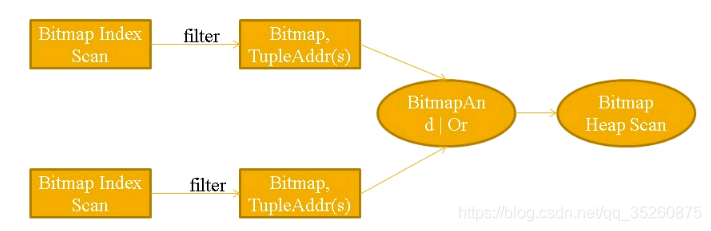


### Index Only Scan
```
如果索引字段中包含了所有返回字段，对vm文件中全为可见的数据块，不查堆表直接返回索引中的值。
```


## 常用索引

### btree
```
Btree是pg中默认的索引类型,用户不指定索引，索引默认就是btree。
Btree适合于所有的数据类型,支持=,<,>,<=,>=,以及between,in,is null和以字符串开头的模糊查询(前模糊)。


Btree也适用于联合索引,但是联合索引要想起作用where之后跟着的条件必须包含第一个索引列。
适用于主键、以及特殊场景的联合索引(包含第一个索引列)。建议将选择性好的列放在第一列。列的选择性就是看该字段是否唯一，如主键是选择性最好的
```
* 原理
  * meta page和root page是一定有的，meta page需要一个页来存储，表示指向root page的page id。
  * 随着记录数的增加，一个root page可能存不下所有的heap item，就会有leaf page,甚至branch page，甚至多层的branch page。
  * 一共有几层branch和 leaf，可以用btree page元数据的level来表示。
  * btree索引演变过程
    * btree索引一层结构
      * 安装扩展准备数据
      
        ```
        --使用pageinspect扩展工具查看结构，数据准备
        create extension pageinspect;
        --主键索引使用的是btree索引，索引名字 tb_order_pkey
        create table tb_order(id int primary key, order_no varchar(255));
        insert into tb_order select generate_series(1, 100), md5(random()::varchar);
        --analyze 统计数据库表数据，统计结果存储到pg_statistic系统表中
        --vacuum 用于清理死亡元组占用的存储空间
        vacuum analyze tb_order;
        ```

        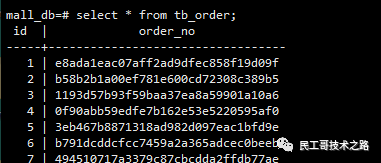  

      * 查看meta块: 此时level为0即高度为1，root块为1。
      ```
      select * from bt_metap('tb_order_pkey');--查看meta块
      ```
      
      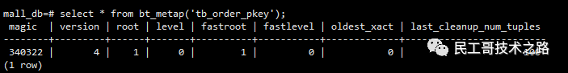
      * 根据root 的 page id =1查看 root page的stats
      ```
      select * from bt_page_stats('tb_order_pkey', 1);--查看page的统计状态信息
      ```

      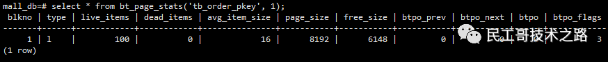
      ```
      图中参数说明如下：
      
      live_items:存活的索引行
      dead_items：死亡的索引行
      avg_item_size:平均索引行大小
      page_size:块大小，详细看最后说明
      free_size：块空余大小
      btpo_prev：块左边
      btpo_next：块右边
      btpo：当前块层次，代表处于0层
      btpo_flags：当前块类型，3代表：他既是leaf又是root，即2+1
      meta page
      root page: 表示为btpo flags=2
      branch page: 表示为btpo flags=0
      leaf page: 表示为btpo flags=1
      ```
      * 查看指定索引块内容
      ```
      select * from bt_page_items('tb_order_pkey', 1);--查看指定索引页的内容
      ```

      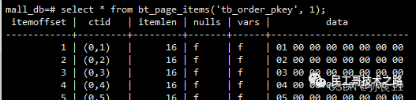
    
      * 通过索引ctid访问数据
      ```
      select * from tb_order where ctid = '(0, 1)';--通过索引ctid访问数据
      ```

      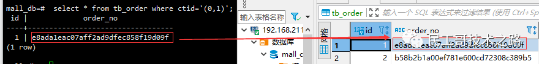
    * btree索引二层结构
      * 包括 meta page, root page, leaf page

        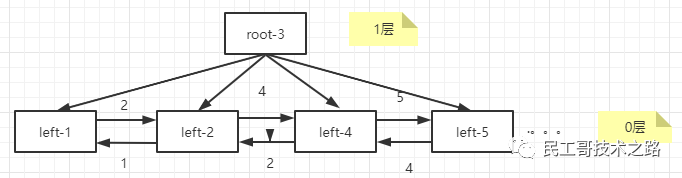
      * 安装扩展准备数据
        ```
        --使用pageinspect扩展工具查看结构，数据准备
        create extension pageinspect;
        --主键索引使用的是btree索引，索引名字 tb_order_pkey
        create table tb_order2(id int primary key, order_no varchar(255));
        insert into tb_order2 select generate_series(1, 10000), md5(random()::varchar);
        --analyze 统计数据库表数据，统计结果存储到pg_statistic系统表中
        --vacuum 用于清理死亡元组占用的存储空间
        vacuum analyze tb_order2;
        ```
  
        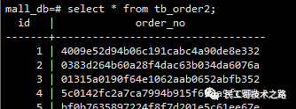
    
      * 查看meta块: 此时level为1即高度为2，root块id为3
        ```
        select * from bt_metap('tb_order2_pkey');--查看meta块
        ```

        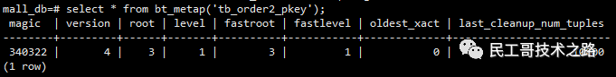
      
      * 根据root 的 page id =3查看 root page的stats
        ```
        select * from bt_page_stats('tb_order2_pkey', 3);--查看page的统计状态信息
        ```

        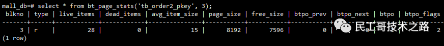
      * 查看指定索引块内容
        ```
        select * from bt_page_items('tb_order2_pkey', 3);--查看指定索引页的内容
        ```

        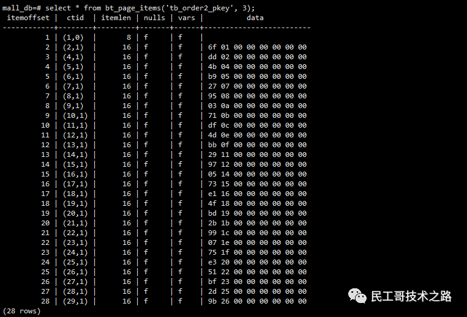
    * btree索引三层结构
      * 包括 meta page, root page, leaf page，branch page。
      

### gin
```
gin是倒排索引(es中字段默认会创建一个倒排索引)，是一个存储对(key,list[])集合的索引结构,
其中key是一个键值，而list[]是一组出现过key的位置。如(‘hello’,’14:2 23:4’)中，表示hello在14:2和23:4这两个位置出现过。

gin适合单值稀疏数据搜索。

gin适合多列任意搜索，当用户的需求是按照任意列进行搜索时，gin支持多列展开单独建立索引域。
从这边可以看出gin和btree都适用联合索引，两者的区分就是,看索引是否是任意的，如果第一个索引列是必有的可以选择btree，相反选择gin。

GIN 代表广义倒排索引（generalized inverted indexes），
主要用于单个字段中包含多个值的数据，例如 hstore、 array、 jsonb 以及 range 数据类型。
一个倒排索引为每个元素值都创建一个单独的索引项，可以有效地查询某个特定元素值是否存在。
```

#### 前后模糊索引 - pg_trgm
* 对于前后都需要模糊的字段需要用到pg_trgm索引，需要注意的是，数据库的lc_type不能为‘C’，可以通过命令 \l+ database_name 来查看。需要提前创建扩展：
  ```
  CREATE EXTENSION btree_bin;
  CREATE EXTENSION pg_trgm;
  ```
  * 例子
    * 先是没有创建索引的情况：
    
    ```
    EXPLAIN (ANALYZE,BUFFERS) SELECT * FROM viid_vehicle.vehiclestructured WHERE plateno LIKE '%S906%';
    
    结果：
    Seq Scan on  vehiclestructured  (cost=10000000000.00..10000194079.56 rows=496 width=167) (actual time=69.815..16439.940 rows=1913 loops=1)
           Filter: ((plateno)::text ~~ '%S906%'::text)
           Rows Removed by Filter: 4998087
           Buffers: shared read: 131580
        Planning time: 134.088 ms
        Execution time: 16441.152 ms
    ```
    * 创建pg_trgm索引：
    ```
    CREATE INDEX idx_vehiclestructured_plateno_like ON viid_vehicle.vehiclestructured USING GIN (plateno GIN_TRGM_OPS);
    
    EXPLAIN (ANALYZE,BUFFERS) SELECT * FROM viid_vehicle.vehiclestructured WHERE plateno LIKE '%S906%';
    
    Bitmap Heap Scan on vehiclestructured  (cost=83.84..1982.68 rows=496 width=167) (actual time=103.819..6488.143 rows=1913 loops=1)
      Recheck Cond: ((plateno)::text ~~ '%S906%'::text)
      Rows Removed by Index Recheck: 14
      Heap Blocks: exact=1908
      Buffers: shared hit=16 read=1934
      -> Bitmap Index Scan on idx_vehiclestructured_plateno_like  (cost=0.00..83.72 rows=496 width=0) (actual time=66.178..66.178 rows=1927 loops=1)
           Index Cond: ((plateno)::text ~~ '%S906%'::text)
           Buffers: shared hit=16 read=26
    Planning time: 342.607 ms
    Execution time: 6489.416 ms
    ```
    * 从结果可以看出在使用pg_trgm索引的情况下，能够大大地优化查询时间。
    * 
#### pg_trgm原理
* pg_trgm使用时将字符串的前端添加2个空格，末端添加一个空格，之后每三个连续的字符串作为一个TOKEN进行拆分，对TOKEN建立GIN倒排索引。
* 查看字符串的原理：
  ```
  SELECT SHOW_TRGM('viid');
  
  结果：
            show_trgm
  ----------------------------- 
  {"  v"," vi","id ",iid,vii}
  ```
  
#### pg_trgm适用场景
* 有前缀的模糊查询，例如a%，至少需要提供1个字符。
* 有后缀的模糊查询，例如%ab，至少需要提供2个字符。
* 前后模糊查询，例如%abc%，至少需要提供3个字符。

### brin
```
Brin索引(block range indexes)是块级索引，它不是以行号为单位记录索引明细，而是记录每个数据块或者每段连续的数据块的统计信息。
因此brin索引空间占用特别小，对数据写入、更新、删除的影响很小。
Brin索引适合时序数据(timestamp类型)，在时间或序列字段创建索引，进行等值、范围查询时效果好；以及对存储空间比较严格的场景。

CREATE INDEX idx_vehiclestructured_plateno_like ON viid_vehicle.vehiclestructured USING BRIN(plateno);
```

### gist
```
gist是一种平衡树结构的访问方法，gist索引更多的适用于多维数据类型和几何数据类型。缺点就是gist索引创建耗时较长，占用空间也比较大。
```

### zombodb
```
Zombodb是pg和elasticsearch结合的一个索引接口，可以直接读写es。
与es结合使用，实现sql接口的搜索引擎，实现数据的透明搜索。
```

### hash
```
Hash索引只能处理简单等值机比较。当一个索引列涉及到一个使用=操作符的比较时，查询规划器将考虑使用一个Hash索引；

CREATE INDEX idx_vehiclestructured_recordid ON viid_vehicle.vehiclestructured USING HASH (recordid);
```

## Others
```
 多列索引：目前，只有 B-tree、GiST、GIN 和 BRIN 索引类型支持多列索引，最多可以指定32个列（该限制可以在源代码文件 pg_config_manual.h 中修改，但是修改后需要重新编译PostgreSQL）。
 
 唯一索引：目前，只有 B-tree 能够被声明为唯一。  CREATE [ UNIQUE ] INDEX ....
 
 表达式索引：从表的一列或多列计算而来的一个函数或者标量表达式。索引表达式的维护代价较为昂贵，因为在每一个行被插入或更新时都得为它重新计算相应的表达式。
 然而，索引表达式在进行索引搜索时却不需要重新计算，因为它们的结果已经被存储在索引中了。
 
 部分索引：一个部分索引是建立在表的一个子集上，而该子集则由一个条件表达式（被称为部分索引的谓词）定义。而索引中只包含那些符合该谓词的表行的项。
 使用部分索引的一个主要原因是避免索引公值（查询结果行在一个表中占比超过一定百分比的值不会使用索引）。
 
 覆盖索引：目前，B-树索引总是支持只用索引的扫描。GiST 和 SP-GiST 索引只对某些操作符类支持只用索引的扫描。其他索引类型不支持这种扫描。仅访问索引就可获取查询所需的全部数据，无需回表（Index-Only Scan）。

```
