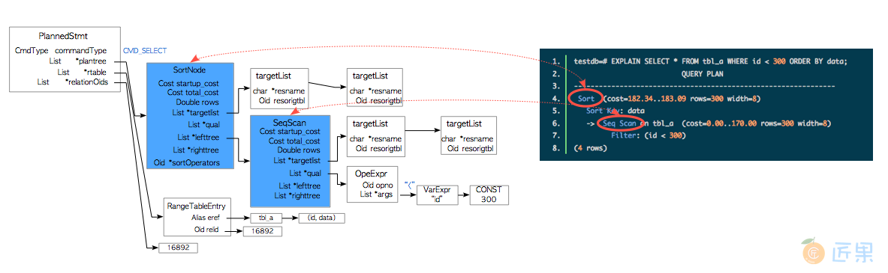

# 查询处理

## 概览
* 查询处理是PostgreSQL中最为复杂的子系统。
* 查询连接后，后端进程由五个子系统组成
  * 解析器（Parser） 解析器根据SQL语句生成一颗语法解析树（parse tree） 。
  * 分析器（Analyzer） 分析器对语法解析树进行语义分析，生成一颗查询树（query tree） 。
  * 重写器（Rewriter） 重写器按照规则系统中存在的规则，对查询树进行改写。
  * 计划器（Planner） 计划器基于查询树，生成一颗执行效率最高的计划树（plan tree） 。
  * 执行器（Executor） 执行器按照计划树中的顺序访问表和索引，执行相应查询

  
* 解析器（Parser）
  ```
  testdb=# SELECT id, data FROM tbl_a WHERE id < 300 ORDER BY data;
  ```
  * 语法解析树的根节点是一个定义在parsenodes.h中的SelectStmt数据结构。
    ```
    typedef struct SelectStmt
    {
      NodeTag         type;
      /* 这些字段只会在SelectStmts“叶节点”中使用 */
      List       *distinctClause;     /* NULL, DISTINCT ON表达式列表, 或
      对所有的(SELECT DISTINCT)为lcons(NIL,NIL) */
      IntoClause *intoClause;         /* SELECT INTO 的目标 */
      List       *targetList;         /* 结果目标列表 (ResTarget) */
      List       *fromClause;         /* FROM 子句 */
      Node       *whereClause;        /* WHERE 限定条件 */
      List       *groupClause;        /* GROUP BY 子句 */
      Node       *havingClause;       /* HAVING 条件表达式 */
      List       *windowClause;       /* WINDOW window_name AS (...), ... */
      /*  在一个表示值列表的叶节点中，上面的字段全都为空，而这个字段会被设置。
       * 注意这个子列表中的元素仅仅是表达式，没有ResTarget的修饰，还需要注意列表元素可能为
       * DEFAULT (表示一个 SetToDefault 节点)，而无论值列表的上下文。
       * 由分析阶段决定否合法并拒绝。      */
      List       *valuesLists;        /* 未转换的表达式列表 */
      /* 这些字段会同时在SelectStmts叶节点与SelectStmts上层节点中使用 */
      List       *sortClause;         /* 排序子句 (排序依据的列表) */
      Node       *limitOffset;        /* 需要跳过的元组数目 */
      Node       *limitCount;         /* 需要返回的元组数目 */
      List       *lockingClause;      /* FOR UPDATE (锁子句的列表) */
      WithClause *withClause;         /* WITH 子句 */
      /* 这些字段只会在上层的 SelectStmts 中出现 */
      SetOperation op;                /* set 操作的类型 */
      bool            all;            /* 是否指明了 ALL 选项? */
      struct SelectStmt *larg;        /* 左子节点 */
      struct SelectStmt *rarg;        /* 右子节点 */
    } SelectStmt;
    ```
    
  * 解析器生成语法分析树时只会检查语法，只有当查询中出现语法错误时才会返回错误。
  * 解析器并不会检查输入查询的语义，举个例子，如果查询中包含一个不存在的表名，解析器并不会报错，语义检查由分析器负责。
  * 分析器（Analyzer）
    * 析器对解析器产出的语法解析树（parse tree） 进行语义分析，并产出一颗查询树（query tree） 。
    * 查询树的根节点是parsenode.h中定义的Query数据结构
      * 这个结构包含着对应查询的元数据，比如命令的类型（SELECT/INSERT等）
      * 还包括了一些叶子节点，叶子节点由列表或树组成，包含了特定子句相应的数据。
      ```
      /*
       * Query -
       *      解析与分析过程会将所有的语句转换为一颗查询树，供重写器与计划器用于进一步的处理。
       *    功能语句（即不可优化的语句）会设置utilityStmt字段，而Query结构本身基本上是空的。
       *      DECLARE CURSOR 是一个特例：它的形式与SELECT类似，但原始的DeclareCursorStmt会
       *    被放在 utilityStmt 字段中。
       *    计划过程会将查询树转换为一颗计划树，计划树的根节点是一个PlannedStmt结构
       *    执行器不会用到查询树结构
       */
      typedef struct Query
      {
          NodeTag        type;
          CmdType        commandType;        /* select|insert|update|delete|utility */
          QuerySource querySource;        /* 我来自哪里? */
          uint32        queryId;            /* 查询标识符 (可由插件配置) */
          bool        canSetTag;            /* 我设置了命令结果标签吗? */
          Node           *utilityStmt;        /* 如果这是一条DECLARE CURSOR或不可优化的语句 */
          int        resultRelation;         /* 对增删改语句而言是目标关系的索引; SELECT为0 */
          bool        hasAggs;            /* 是否在目标列表或having表达式中指定了聚合函数 */
          bool        hasWindowFuncs;     /* tlist是否包含窗口函数 */
          bool        hasSubLinks;        /* 是否包含子查询SubLink */
          bool        hasDistinctOn;        /* 是否包含来自DISTINCT ON的distinct子句 */
          bool        hasRecursive;        /* 是否制定了WITH RECURSIVE */
          bool        hasModifyingCTE;    /* 是否在WITH子句中包含了INSERT/UPDATE/DELETE */
          bool        hasForUpdate;        /* 是否指定了FOR [KEY] UPDATE/SHARE*/
          bool        hasRowSecurity;     /* 是否应用了行安全策略 */
          List           *cteList;            /* CTE列表 */
          List           *rtable;            /* 范围表项目列表 */
          FromExpr       *jointree;            /* 表连接树 (FROM 与 WHERE 子句) */
          List           *targetList;        /* 目标列表 (TargetEntry的列表) */
          List           *withCheckOptions;    /* WithCheckOption的列表 */
          OnConflictExpr     *onConflict;     /* ON CONFLICT DO [NOTHING | UPDATE] */
          List           *returningList;        /* 返回值列表(TargetEntry的列表) */
          List           *groupClause;        /* SortGroupClause的列表 */
          List           *groupingSets;        /* 如果有，GroupingSet的列表 */
          Node           *havingQual;        /* 分组的Having条件列表 */
          List           *windowClause;        /* 窗口子句列表 */
          List           *distinctClause;     /* SortGroupClause列表 */
          List           *sortClause;        /* SortGroupClause列表 */
          Node           *limitOffset;        /* Offset跳过元组数目 (int8 表达式) */
          Node           *limitCount;        /* Limit返回元组数目 (int8 表达式) */
          List           *rowMarks;          /* RowMarkClause列表 */
          Node           *setOperations;        /* 如果是UNION/INTERSECT/EXCEPT的顶层查询，
                                             则为集合操作列表 */
          List           *constraintDeps;     /* 确认查询语义是否合法时，所依赖约束对象的OID列表 */
      } Query;
      ```
      
* 重写器（Rewriter）
  * PostgreSQL的规则系统正是基于重写器实现的
  * 当需要时，重写器会根据存储在pg_rules中的规则对查询树进行转换。
  * 视图
    * 视图是基于规则系统实现的
    * 当使用CREATE VIEW命令定义一个视图时，PostgreSQL就会创建相应的规则，并存储到系统目录中。
    * 假设下面的视图已经被定义，而pg_rule中也存储了相应的规则。
      ```
      sampledb=# CREATE VIEW employees_list 
      sampledb-#   AS SELECT e.id, e.name, d.name AS department
      sampledb-#      FROM employees AS e, departments AS d WHERE e.department_id = d.id;
      ```
      * 当执行视图的查询，重写器会基于pg_rules中存储的视图规则将rangetable节点重写为一颗查询子树，与子查询相对应。

        
* 计划器与执行器
  * 计划器从重写器获取一颗查询树（query tree） ，基于查询树生成一颗能被执行器高效执行的（查询）计划树（plan tree） 
  * 计划器是完全基于代价估计（cost-based） 的
    ```
    pg_hint_plan
    PostgreSQL不支持SQL中的提示（hint） ，并且永远也不会去支持。如果你想在查询中使用提示，可以考虑使用pg_hint_plan扩展
    ```
  * PostgreSQL中的EXPLAIN命令会显示命令的计划树。
    ```
    testdb=# EXPLAIN SELECT * FROM tbl_a WHERE id < 300 ORDER BY data;
                            QUERY PLAN               
    ---------------------------------------------------------------
    Sort  (cost=182.34..183.09 rows=300 width=8)
      Sort Key: data
      ->  Seq Scan on tbl_a  (cost=0.00..170.00 rows=300 width=8)
          Filter: (id < 300)
    (4 rows)
    ```
    
  * 计划树由许多称为计划节点（plan node） 的元素组成
  * 这些节点挂在PlannedStmt结构对应的计划树上, 定义在plannodes.h中
  * 每个计划节点都包含着执行器进行处理所必需的信息
  * 上图的计划树就是一个列表，包含一个排序节点和一个顺序扫描节点；因而执行器会首先对表tbl_a执行顺序扫描，并对获取的结果进行排序。
  * 用冲区管理器来访问数据库集簇的表和索引
    * 当处理一个查询时，执行器会使用预先分配的内存空间，比如temp_buffers和work_mem，必要时还会创建临时文件。

      

## 单表查询的代价估计
* costsize.c中的函数用于估算各种操作的代价。所有被执行器执行的操作都有着相应的代价函数。
  * example: 数cost_seqscan() 和 cost_index()分别用于估算顺序扫描和索引扫描的代价。
* 三种代价：启动（start-up） ， 运行（run） 和总和（total） 。总代价 是启动代价 和运行代价 的和
  * 启动代价（start-up） ：在读取到第一条元组前花费的代价
    * 比如索引扫描节点的启动代价 就是读取目标表的索引页，取到第一个元组的代价
  * 运行代价（run） ： 获取全部元组的代价
  * 总代价（total） ：前两者之和
* EXPLAIN命令显示了每个操作的启动代价和总代价
  ```
  testdb=# EXPLAIN SELECT * FROM tbl;
                       QUERY PLAN            
  ---------------------------------------------------------
  Seq Scan on tbl  (cost=0.00..145.00 rows=10000 width=8)
  (1 row)
  ```
  * 第4行显示了顺序扫描的相关信息。代价部分包含了两个值：0.00和145.00。在本例中，启动代价和总代价分别为0.00和145.00。
* 估算代价
  * 查询优化过程中，查询请求的不同执行方案是通过建立不同的路径（Path）来表达的
  * 在生成了许多符合条件的路径之后，要从中选择出代价最小的路径，把它转化为一个计划，传递给执行器执行
  * 因此，优化器的核心工作是建立多条路径，然后从中找出最优的那一条
  * 评价路径优劣的依据是用系统表pg_statistic中的系统统计信息估计出的不同路径的代价（Cost）
  * 某个路径的代价要考虑CPU代价和磁盘存取代价两方面。
    * 磁盘代价以从磁盘顺序存取一个页面的代价为单位
    * 所有其他形式的代价计算都是相对磁盘存取代价来计算的。
  * 参数 (在配置文件postgresql.conf中)
    ```
    seq_page_cost:          顺序存取页的代价，值为1.0
    random_page_cost:       非顺序存取页的代价，值为4.0
    cpu_tuple_cost:         典型的CPU处理一个元组的代价，值为0.01
    cpu_index_tuple_cost:   典型的CPU处理一个索引元组的代价，值为0.005
    cpu_operator_cost:      CPU处理一个典型的WHERE操作的代价，值为0.0025 (在投影、约束条件中包含大量的表达式，对这些表达式求值同样需要消耗CPU资源)
    qual_op_cost:  粗略的来讲，是评估索引的成本，这里为0.0025
    effective_cache_size:   用来量度PostgreSQL和OS 缓存的磁盘页的数量，值为16384
    ```
  * 基本数据
    * 表元组数            ntuples -> pg_class.reltuples
    * 表磁盘块数          nblocks -> pg_class.relpages
    * 符合选条件的元组数    nrows
  * 统计信息： pg_class
    * 如果用户要给某个表生成统计信息，则可以使用ANALYZE语句对一个表进行统计分析，这样就能给这个表生成统计信息并且保存在PG_STATISTIC系统表中。
  * 直方图信息（存储在系统表中）：各个属性值出现的次数的统计信息
  * 路径代价估算基本步骤
    *  首先根据统计信息和查询条件，估算出这次查询要进行的I/O次数以及要取出的元组个数
    *  然后根据元组个数（分为表元组和索引元组）计算出CPU的代价
    *  最后综合考虑CPU代价和I/O次数（磁盘代价）即可得到最后的代价。
    *  不同的路径类型有不同的代价估算方式。
  * 公式
    * 代价估算从I/O次数和 CPU 开销两个方面考虑，估算公式为P+W*T。
      * P表示在执行时所要访问的页面数，反映了磁盘I/O次数
      * T表示在执行时所要访问的元组数，反映了 CPU 开销
      * W 表示磁盘I/O代价和 CPU 开销间的权重因子。
      * 通过对估算公式的分析可以发现，计算代价时只需考虑访问的页面数和元组数。
  * 选择率
    * 选择率(selectivity）用来定量地描述前述代价估算公式中的权重因子W。
    * 选择率的计算要综合考虑以下各类参数：约束条件中的操作符、约束常量、索引中的元组数、某字段的最大值和最小
      * 选择率 = 约束条件过滤后的元组数/约束条件过滤前的总元组数。
      ```
      约束条件                             选择率
      r.field = value         1/字段r.field 上所定义的索引关系的元组数
      r.field > value        （字段r.field 的最大值-value) / (字段r.field 的最大值一字段r.field的最小值）
      r.field < value        （value-字段rfield 的最小值) /（字段r.field 的最大值一字段r.field的最小值）
      ```
      * 例如，一个people表中有四分之一是儿童，那么person = ‘child’ 的选择率就是0.25。
      * 多个条件例子
        * 执行SQL语句 SELECT * FROM STUDENT WHERE sname='ww' AND (ssex IS NOT NULL OR sno>5)
        * 其中sname='ww' AND (ssex IS NOT NULL OR sno>5)是由3个约束条件拼接起来的一个完整的约束条件
          * W(A+B) = W(A) + W(B) - W(AB)
          * W(AB) = W(A) × W(B)
        * 计算sname='ww'、(ssex IS NOT NULL)和(sno>5)三个子约束条件的选择率，然后根据其中的AND运算符和OR运算符再计算总的选择率。
          ```
          W(ssex IS NOT NULL OR sno>5)
          = W(ssex IS NOT NULL) + W(sno>5) - W(ssex IS NOT NULL AND sno>5)
          = W(ssex IS NOT NULL) + W(sno>5) - W(ssex IS NOT NULL) × W(sno>5)
          = 0.857142 + 0.333333 - 0.857142 × 0.333333
          = 0.90476
          
          W(`sname='ww' AND (ssex IS NOT NULL OR sno>5))
          = W(sname='ww') × W(ssex IS NOT NULL OR sno>5)
          = 0.142857 × 0.90476
          = 0.129252
          ```
    * 查询谓词的选择率是通过直方图界值(histogram_bounds)或高频值（MCV - Most Common Value）估计的，这些信息都存储在系统目录pg_statistics中，并可通过pg_stats视图查询。
      * 表中每一列的高频值都在pg_status视图中的most_common_vals和most_common_freqs中成对存储。
        * 1、高频值：该列上最常出现的取值列表 most_common_vals，指字段 MCV 列表
        * 2、高频值频率：高频值相应出现频率的列表 most_common_freqs，指MCV的频率列表
        ```
        --查看高频值相关的
        select most_common_vals,most_common_freqs from pg_stats
        where tablename='test' and attname='col';
        --直方图信息
        select histogram_bounds from pg_stats where tablename='tb1' and attname='data';
        ```
        * 可查出表 test 字段 col 值 240 对应的频率，将该频率作为Selectivity值
        * 如果 MCV 没有查询出结果，则使用 histogram_bounds 来估算。
      * selectivity histogram_bounds估算
        ```
        postgres=# select histogram_bounds from pg_stats where tablename = 'tb1' and attname = 'data';

        {1,100,200,300,400,500,600,700,800,900,1000,1100,1200,1300,1400,1500,1600,1700,1800,1900,2000,2100,2200,2300,2400,2500,2600,2700,2800,2900,3000,3100,3200,3300,3400,3500,3600,3700,3800,3900,4000,4100,4200,4300,4400,4500,4600,4700,480
        0,4900,5000,5100,5200,5300,5400,5500,5600,5700,5800,5900,6000,6100,6200,6300,6400,6500,6600,6700,6800,6900,7000,7100,7200,7300,7400,7500,7600,7700,7800,7900,8000,8100,8200,8300,8400,8500,8600,8700,8800,8900,9000,9100,9200,9300,9400,9
        500,9600,9700,9800,9900,10000}
        (1 row)
        ```
        * 默认情况下，直方图界值会将列上的取值划分入100个桶。
        * 桶从0开始编号，每个桶保存了（大致）相同数量的元组。
        * 直方图界值就是相应桶的边界。
          * 比如，直方图界值的第0个值是1, 即1是bucket_0中的最小值。 第1个值是100，即100是bucket_1中的最小值。

          
        * 由于查询带有where子句data<240，而值239落在第二个桶中，通过线性插值推算出相应的选择率。因此查询中data列的选择率可以套用下面的公式计算：
          ```
          selectivity = (2 + (239-hb[2]) / (hb[3]-hb[2])) / 100
                      = (2 + (239-200) / (300-200)) / 100
                      = (2 + 39 / 100) / 100
                      = 0.0239
          
          # selectivity = 桶index + (filter值 - hb[桶index]) / (hb[桶index + 1]- hb[桶index]) / 100
          ```

    ```
    seq_page_cost/random_page_cost
    默认值分别是1.0和4.0，这意味着Postgresql假设随机扫描的进度是顺序扫描的1/4，pg默认值是基于HDD(普通硬盘)设置的。
    如果使用SSD时，最好将random_page_cost的值设置为1.0
    ```
    
  * ??? 单个表的扫描代价
    
    ```
    扫描方式                 P                              T
    顺序扫描              NumPages                       NumTuples
    一级索引扫描          NumPages * F                  NumTuples * F
    二级索引扫描      NumPages * F + ITuples * F   ITuples * F + NumTuples * F
    ```
    * 其中，NumPages 表示表的页面数；NumTuples 表示表的元组数；ITuples 表示索引表的元组数；F表示多个约束条件组合后的选择率。
  * ???? 两个表的连接代价
    ```
    连接方式                 代价计算公式 
    嵌套循环连接        Couter + Nouter * Cinner
    归并连接        Couter + Csortouter + Cinner + Csortinner
    Hash 连接      Couter + Ccreatehash + Nouter * Chash
    ```
    * Couter 表示扫描外连接表的代价。
    * Cinner 表示扫描内连接表的代价。
    * Csortouter 表示将外连接表进行排序的代价（使用临时存储空间）。
    * Csortinner：表示内连接表进行排序的代价（使用临时存储空间）。
    * Ccreatehash 表示对内连接表进行 Hash 的代价（使用临时存储空间）。
    * Chash 表示单独的Hash 的代价。
    * Nouter 表示外连接表的大小。
* example
  ```
  testdb=# CREATE TABLE tbl (id int PRIMARY KEY, data int);
  testdb=# CREATE INDEX tbl_data_idx ON tbl (data);
  testdb=# INSERT INTO tbl SELECT generate_series(1,10000),generate_series(1,10000);
  testdb=# ANALYZE;
  testdb=# \d tbl
  Table "public.tbl"
  Column |  Type   | Modifiers
  --------+---------+-----------
  id     | integer | not null
  data   | integer |
  Indexes:
  "tbl_pkey" PRIMARY KEY, btree (id)
  "tbl_data_idx" btree (data)
  ```
* 顺序扫描
  ```
  testdb=# SELECT * FROM tbl WHERE id < 8000;
  ```
  * 在顺序扫描中，启动代价等于0
  * ntuples和nblocks
    ```
    testdb=# SELECT relpages, reltuples FROM pg_class WHERE relname = 'tbl';
    relpages | reltuples
    ----------+-----------
    45 |     10000
    (1 row)
    ```
  * Total cost = 0 + (45 * 1 + 10000 * 0.01 + 10000 * 0.0025) =  0 + 170 = 170
    * Total cost = start cost + run cost = start cost + IO cost + cpu cost =  start cost + seq_page_cost * nblocks + (cpu_tuple_cost * ntuples + cpu_operator_cost * ntuples)
    ```
    testdb=# EXPLAIN SELECT * FROM tbl WHERE id < 8000;
    QUERY PLAN
    --------------------------------------------------------
    Seq Scan on tbl  (cost=0.00..170.00 rows=8000 width=8)
    Filter: (id < 8000)
    (2 rows)
    ```
    * 第5行显示了一个顺序扫描的过滤器Filter: (id < 8000)。更精确的说，它是一个表级过滤谓词。
    * 注意，这种类型的过滤器只会在读取所有元组的时候使用，他并不会减少需要扫描的表页面数量。
* 索引扫描
  * PostgreSQL支持很多索引方法，比如B树，GiST，GIN和BRIN，不过索引扫描的代价估计都使用一个共用的代价函数：cost_index()
  ```
  testdb=# SELECT id, data FROM tbl WHERE data < 240;
  
  testdb=# SELECT relpages, reltuples FROM pg_class WHERE relname = 'tbl_data_idx';
  relpages | reltuples
  ----------+-----------
  30 |     10000
  (1 row)
  ```
  * INtuples 10000, INBlocks 30.
  * start_cost = {ceil (log2 (INtuples)) + (Hindex+1) * 50} * cpu_operator_cost
    * Hindex - 索引高度
      ```
      postgres=# select * from bt_metap('tb1_data_idx');
      magic  | version | root | level | fastroot | fastlevel | last_cleanup_num_delpages | last_cleanup_num_tuples | allequalimage
      --------+---------+------+-------+----------+-----------+---------------------------+-------------------------+---------------
      340322 |       4 |    3 |     1 |        3 |         1 |                         0 |                      -1 | t
      (1 row)
    
      level 1 表示 Hindex是1
      root 3 表示索引树的根在page 3
      ```
    * bt_page_stats和bt_page_items
      ```
      查询page的信息  select * from bt_page_stats('tb1_order2_pkey', 3)
      live_items:存活的页块
      dead_items：死亡的页块
      avg_item_size:平均索引行大小
      page_size:块大小
      free_size：块空余大小 
      btpo_prev：块左边 
      btpo_next：块右边 
      btpo：当前块层次，1代表处于2层，表示下面还有一层
      btpo_flags：当前块类型，3代表：他既是leaf又是root，即2+1
         meta page
         root page:表示为btpo_flags=2
         branch page :表示为btpo_flags=0
         leaf page:表示为btpo_flags=1
      ```
      
      ```
      查询指定索引块内容  select * from bt_page_items('tb1_order2_pkey', 3)
      该索引有28个页
      ```
      
  * 索引扫描的run成本指表和索引cpu成本、IO成本之和： run_cost = (index_cpu_cost + table_cpu_cost) + (index_io_cost + table_io_cost)
    * 如果使用仅索引扫描，则不会计算table_cpu_cost与table_io_cost。 (仅索引扫描是值 索引col = value的情况， 只返回一条数据)
    * index_cpu_cost = selectivity * INtuples * (cpu_index_tuple_cost + qual_op_cost)
      * qual_op_cost: the evaluation cost of index 默认0.0025
      * Selectivity 指where子句的索引的搜索范围的比例，它是从0到1的浮点数，如 (Selectivity x Ntuple) 指读取表tuple的数量， (Selectivity x INtuples) 指读取索引页的数量。
    * table_cpu_cost = selectivity * Ntuple * cpu_tuple_cost
    * index_io_cost = ceil(selectivity * INblocks) * random_page_cost
    * table_io_cost = max_io_cost + indexCorerelatition² * (min_io_cost - max_io_cost)
      * max_io_cost是最差情况下的I/O成本，即随机扫描所有数据页的成本。这个成本由以下公式定义：
        * max_io_cost = Nblocks * random_page_cost
      * min_io_cost是最优情况下的I/O成本，即顺序扫描选定的数据页。这个成本由以下公式定义：
        * min_io_cost = 1 * random_page_cost + (ceil(selectivity x Nblocks) - 1) * seq_page_cost
      * indexCorrelation—索引相关性
        * 索引相关性是列值在物理上的顺序和逻辑上的顺序的统计相关性。
        * 索引相关性的取值范围从-1到1。
        * 例子
          * 表tbl_corr有5个列：两个列为文本类型，三个列为整数类型。这三个整数列保存着从1到12的数字。
          * 在物理上表tbl_corr包含三个页，每页有4条元组。每个数字列有一个名如index_col_asc的索引。
          ```
          testdb=# \d tbl_corr
          Table "public.tbl_corr"
          Column  |  Type   | Modifiers
          ----------+---------+-----------
          col      | text    |
          col_asc  | integer |
          col_desc | integer |
          col_rand | integer |
          data     | text    |
          Indexes:
          "tbl_corr_asc_idx" btree (col_asc)
          "tbl_corr_desc_idx" btree (col_desc)
          "tbl_corr_rand_idx" btree (col_rand)
          ```

          ```
          testdb=# SELECT col,col_asc,col_desc,col_rand
          testdb-#                         FROM tbl_corr;
          col    | col_asc | col_desc | col_rand
          ----------+---------+----------+----------
          Tuple_1  |       1 |       12 |        3
          Tuple_2  |       2 |       11 |        8
          Tuple_3  |       3 |       10 |        5
          Tuple_4  |       4 |        9 |        9
          Tuple_5  |       5 |        8 |        7
          Tuple_6  |       6 |        7 |        2
          Tuple_7  |       7 |        6 |       10
          Tuple_8  |       8 |        5 |       11
          Tuple_9  |       9 |        4 |        4
          Tuple_10 |      10 |        3 |        1
          Tuple_11 |      11 |        2 |       12
          Tuple_12 |      12 |        1 |        6
          (12 rows)
          ```

          ```
          testdb=# SELECT tablename,attname, correlation FROM pg_stats WHERE tablename = 'tbl_corr';
          tablename | attname  | correlation
          -----------+----------+-------------
          tbl_corr  | col_asc  |           1
          tbl_corr  | col_desc |          -1
          tbl_corr  | col_rand |    0.125874
          (3 rows)
          ```
          * 当执行下列查询时，由于所有的目标元组都在第一页中，PostgreSQL只会读取第一页
            ```testdb=# SELECT * FROM tbl_corr WHERE col_asc BETWEEN 2 AND 4;```
          * 而执行下列查询时则不然，PostgreSQL需要读所有的页
            ```testdb=# SELECT * FROM tbl_corr WHERE col_rand BETWEEN 2 AND 4;```
            
          * 如此可知，索引相关性是一种统计上的相关性。在索引扫描代价估计中，索引相关性体现了索引顺序和物理元组顺序扭曲程度给随机访问性能造成的影响大小。
* bitmap scan
  ```
  在PostgreSQL中，对于单列上的btree索引查询,我们看到的都是普通的索引扫描Index Scan,比如下面这样:
  bill=# explain select * from t1 where c1=10;
                             QUERY PLAN                             
  --------------------------------------------------------------------
  Index Scan using idx_t1 on t1  (cost=0.15..10.73 rows=10 width=12)
  Index Cond: (c1 = 10)
  (2 rows)
  
  对于多个单列索引是用在组合查询SQL中的场合下,我们可以看到使用的是bitmap scan,例如:
  bill=# create index idx_t11 on t1 using btree(c1);
  CREATE INDEX
  bill=# create index idx_t12 on t1 using btree(c2);
  CREATE INDEX
  bill=# create index idx_t13 on t1 using btree(c3);
  CREATE INDEX
  bill=# explain select * from t1 where c1 =10 and c2 =20 and c3 = 30;  
  QUERY PLAN
  -----------------------------------------------------------------------------
  Bitmap Heap Scan on t1  (cost=3.31..4.62 rows=1 width=12)
  Recheck Cond: ((c3 = 30) AND (c2 = 20))
  Filter: (c1 = 10)
  ->  BitmapAnd  (cost=3.31..3.31 rows=1 width=0)
  ->  Bitmap Index Scan on idx_t13  (cost=0.00..1.53 rows=10 width=0)
  Index Cond: (c3 = 30)
  ->  Bitmap Index Scan on idx_t12  (cost=0.00..1.53 rows=10 width=0)
  Index Cond: (c2 = 20)
  (8 rows)
  

  那么这两者有什么区别呢?PostgreSQL又是如何处理多个组合条件的BITMAP SCAN的呢？
  首先我们来说一下Index Scan,这个是最简单的btree索引扫描,其原理是通过索引key去寻找元组的ctid,然后回表获取对应的数据(index only scan除外).
  而BITMAP SCAN是对于每个查询条件，在对应索引中找到符合条件的堆表PAGE，每个索引构造一个bitmap串。
  在这个bitmap串中，每一个BIT位对应一个HEAP PAGE，代表这个HEAP PAGE中有符合该条件的行(只要任意一行符合条件则该PAGE的BIT位就会被标位1)。
  根据条件的多少，组成了多个bitmap:
  +---------------------------------------------+    
  |100000000001000000010000000000000111100000000| bitmap 1    
  |000001000001000100010000000001000010000000010| bitmap 2    
  &&&&&&&&&&&&&&&&&&&&&&&&&&&&&&&&&&&&&&&&&&&&&    
  |000000000001000000010000000000000010000000000| Combined bitmap    
  +-----------+-------+--------------+----------+    
  |       |              |    
  v       v              v    
  Used to scan the heap only for matching pages:    
  +---------------------------------------------+    
  |___________X_______X______________X__________|    
  +---------------------------------------------+
  
  例如我们在c1列上创建了一个索引,我们使用c1=10的查询就会创建bitmap1这样一个bitmap串,
  然后c2=20创建bitmap2这样的bitmap串,然后对这两个bitmap串进行and操作,
  得到了combined bitmap这样一个bitmap串,但此时我们注意到前面的执行计划最后还有一步Recheck Cond,
  这是干嘛的呢?正如我们前文所说,每一个BIT位对应一个HEAP PAGE,我们需要去每一个page上去recheck得到需要的行,这就是Recheck Cond的作用.
  ```
* 排序
  ```
  select id,data from tb1 where data<240 order by id;
  ```
  * start_cost = C + comparison_cost * Nsort * log2(Nsort)
    * C就是上一次扫描的总成本，即上次索引扫描的总成本，为13.475
    
    ```
    start_cost = C + comparison_cost * Nsort * log2(Nsort)
               = C + 2 * cpu_operator_cost * Nsort * log2(Nsort)
	           = 13.475 + (2 x 0.0025) * 240.0 * log2(240)
			   = 13.475 + 9.488
			   = 22.963
    ```
  * 运行成本是在内存中读取排好序的元组的成本 
    ```
    run_cost = cpu_operator_cost * Nsort
		     = 0.0025 * 240
		     = 0.6
    ```

  ```
  1、postgres=# explain select id,data from tb1 where data<240 order by id;
  2、                                   QUERY PLAN                                    
  3、---------------------------------------------------------------------------------
  4、 Sort  (cost=22.91..23.51 rows=239 width=8)
  5、   Sort Key: id
  6、   ->  Index Scan using tb1_data_idx on tb1  (cost=0.29..13.47 rows=239 width=8)
  7、         Index Cond: (data < 240)
  8、(4 rows)
  ```

  ```
  analyze <table> - updates the statistics of the table.
  vacuum analyze <table> - removes stale versions of the updated records from the table and then updates the statistics of the table.
  explain <query> - only generates a plan for the query using statistics of the tables involved in the query.
  explain (analyze) <query> - generates a plan for the query using existing statistics of the tables involved in the query, 
          and also runs the query collecting actual run time data. Since the query is actually run, if the query is a DML query, 
          then care should be taken to enclose it in begin and rollback if the changes are not intended to be persisted.
  ```
