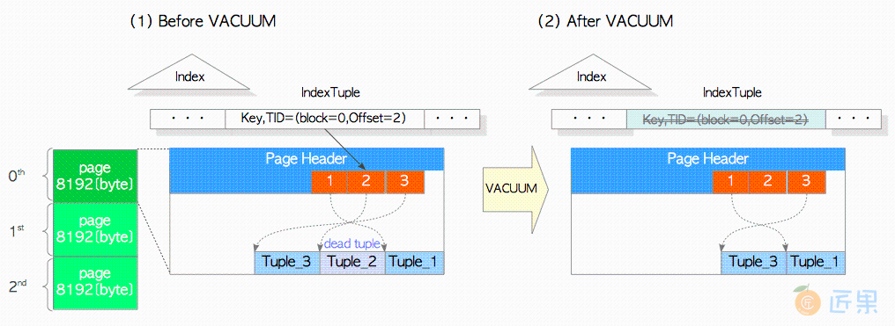
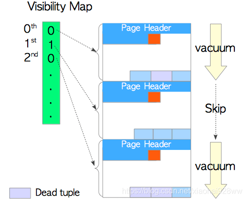
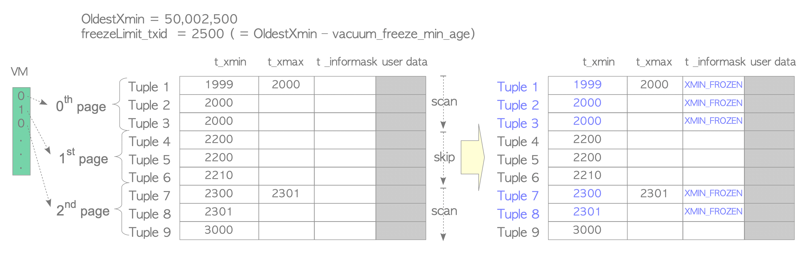
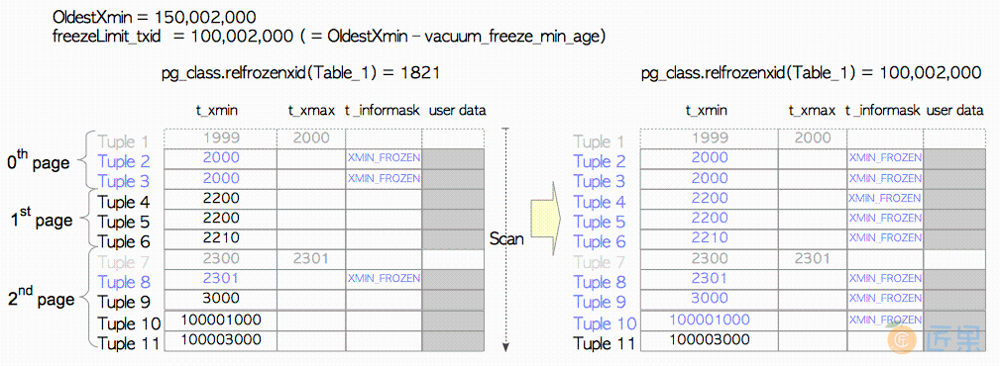
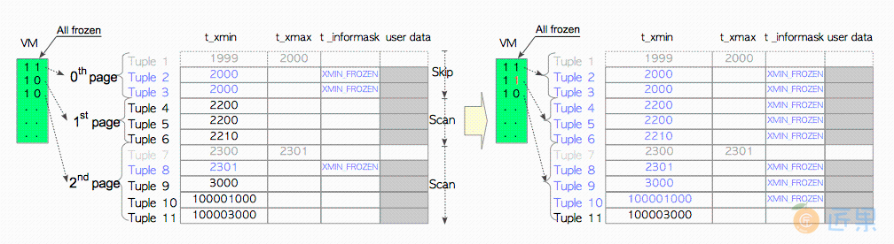
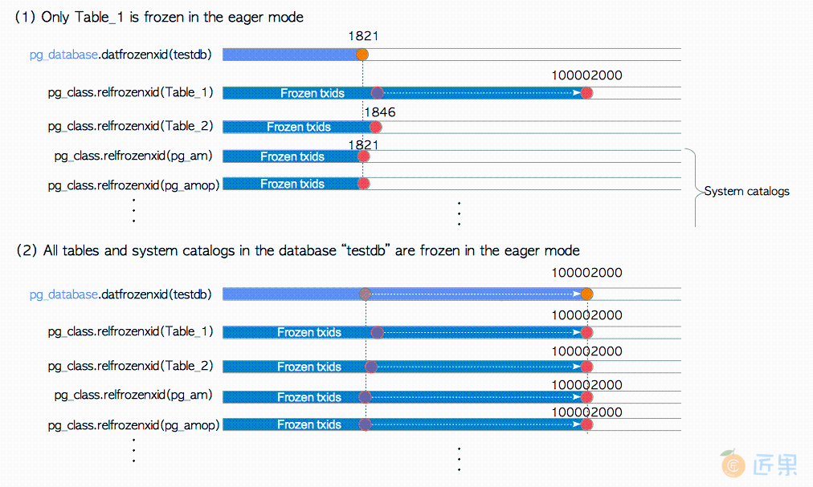
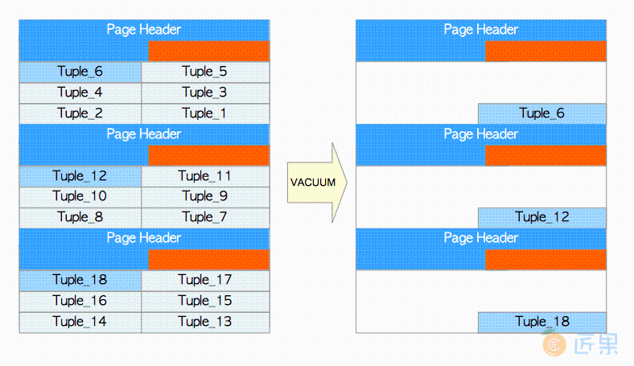
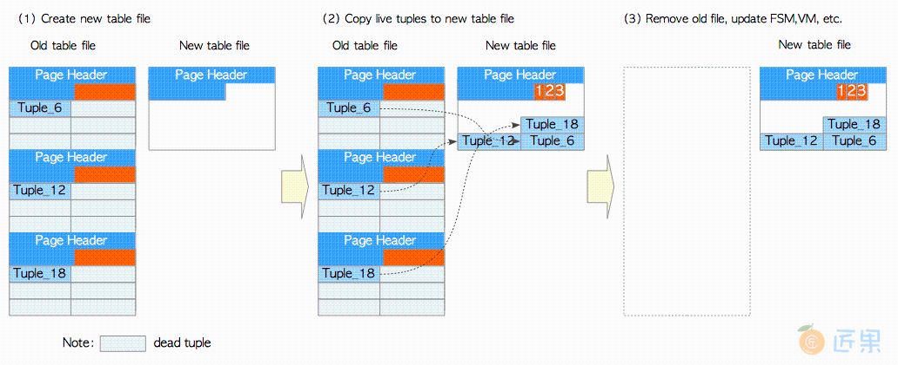
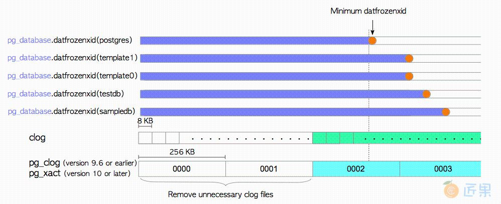

# 清理过程 - vacuum
## 并发清理概述
* 清理过程为指定的表，或数据库中的所有表执行以下任务。
  1. 移除死元组
     * 移除每一页中的死元组，并对每一页内的活元组进行碎片整理。
     * 移除指向死元组的索引元组。
  2. 冻结旧的事务标识（txid）
     * 如有必要，冻结旧元组的事务标识（txid）。
     * 更新与冻结事务标识相关的系统视图（pg_database与pg_class）。
     * 如果可能，移除非必需的提交日志（clog）。
  3. 其他
     * 更新已处理表的空闲空间映射（FSM）和可见性映射（VM）。
     * 更新一些统计信息（pg_stat_all_tables等）。
* 伪代码
  ```
    (1)     FOR each table
    (2)         在目标表上获取 ShareUpdateExclusiveLock 锁
    
                /* 第一部分 */
    (3)         扫描所有页面，定位死元组；如有必要，冻结过老的元组。
    (4)         如果存在，移除指向死元组的索引元组。
    
                /* 第二部分 */
    (5)         FOR each page of the table
    (6)             移除死元组，重排本页内的活元组。
    (7)             更新 FSM 与 VM
                END FOR
    
                /* 第三部分 */
    (8)         如果可能，截断最后的页面。
    (9)         更新系统数据字典与统计信息
                释放ShareUpdateExclusiveLock锁
            END FOR
    
            /* 后续处理 */
    (10)    更新统计信息与系统数据字典
    (11)    如果可能，移除没有必要的文件，以及clog中的文件。
  
    (1) 从指定的表集中依次处理每一张表。
    (2) 获取表上的ShareUpdateExclusiveLock锁， 此锁允许其他事务对该表进行读取。
    (3) 扫描表中所有的页面，以获取所有的死元组，并在必要时冻结旧元组。
    (4) 删除指向相应死元组的索引元组（如果存在）。
    (5) 对表的每个页面执行步骤(6)和(7)中的操作
    (6) 移除死元组，并重新分配页面中的活元组。
    (7) 更新目标表对应的FSM与VM。
    (8) 如果最后一个页面没有任何元组，则截断最后一页。
    (9) 更新与目标表 清理过程相关的统计数据和系统视图。
    (10) 更新与清理过程相关的统计数据和系统视图。
    (11) 如果可能，移除clog中非必需的文件与页面。
  ```
  * 第一部分: 执行冻结处理，并删除指向死元组的索引元组。
    * 首先，PostgreSQL扫描目标表以构建死元组列表，如果可能的话，还会冻结旧元组。
    * 死元组列表存储在本地内存中的maintenance_work_mem里（维护用的工作内存）。
    * 扫描完成后，PostgreSQL根据构建得到的死元组列表来删除索引元组。该过程在内部被称为“清除阶段（cleanup stage） ”。(代价高昂)
    * 当maintenance_work_mem已满，且未完成全部扫描时，PostgreSQL继续进行后续任务，即步骤5到7；完成后再重新返回步骤3并继续扫描。
  * 第二部分: 这一部分会移除死元组，并逐页更新FSM和VM
    
    * 请注意，非必需的行指针是不会被移除的，它们会在将来被重用。因为如果移除了行指针，就必须同时更新所有相关索引中的索引元组。
  * 第三部分: 第三部分会针对每个表，更新与清理过程相关的统计信息和系统视图。此外，如果最后一页中没有元组，则该页会从表文件中被截断。
  * 后续处理: 更新与清理过程相关的几个统计数据，以及相关的系统视图；如果可能的话，它还会移除部分非必需的clog

## 可见性映射 - Visible Map (VM)
  
* 每个表都拥有各自的可见性映射, 用于保存表文件中每个页面的可见性。
* 页面的可见性确定了每个页面是否包含死元组。清理过程可以跳过没有死元组的页面。
* 可见性映射VM和vacuum有关，vacuum是一个比较消耗资源的操作，为了提高vacuum的效率，让vacuum只扫描存在死元组的页面，而跳过全部都是活跃元组的页面，设计了VM数据结构。
* 在数据base目录，每个表都存在一个对应的vm文件，vm由若干个8k页面组成，类似一个数组结构，记录了该表各个页面上是否包含死亡元组信息。
  * 每个VM文件以后缀_vm存储。 例如，一个表文件的relfilenode是18751，其FSM（18751_fsm）和VM（18751_vm）文件如下所示。
    ```
    $ cd $PGDATA
    $ ls -la base/16384/18751*
    -rw------- 1 postgres postgres  8192 Apr 21 10:21 base/16384/18751
    -rw------- 1 postgres postgres 24576 Apr 21 10:18 base/16384/18751_fsm
    -rw------- 1 postgres postgres  8192 Apr 21 10:18 base/16384/18751_vm
    ```
* 在9.6以后的版本中，针对冻结过程，vm的功能进行了增强，vm中除了记录死亡元组信息，还记录了页面元组的冻结标识信息(_infomask字段置为XMIN_FROZEN)。如果页面所有元组都已经被冻结，则置vm中的冻结标识为1，freeze操作就会跳过该页面，提升效率。
* 冻结有两种模式，懒惰模式（lazy mode）和急切模式（eager mode）。他们之间的区别在于懒惰模式是跟随者普通vacuum进程进行的，只会扫描包含死元组的页面，而急切模式会扫描所有页面（当然9.6之后已经优化），
* 冻结同时更新相关系统视图frozenxid信息，并且清理无用的clog文件。

## 事务冻结 (freeze)

### 冻结事务 - freeze
* pg必须保证一个数据库中两个有效的事务之间的差不能超过2^31（21亿)（同一个数据库中，存在的最旧和最新两个事务txid相差不得超过2^31）。
* pg引入了冻结（freeze）功能去保证事务之间的差
  * 惰性清理 - lazy vacuum
    * 挨个扫描页面，同时配合vm可见性映射跳过不存在死元组的页面
    * OldestXmin 表示当前活跃的所有事务中最小的事务标识，如果不存在其他事务，则是当前执行vacuum的事务id
    * 当开始冻结处理时，PostgreSQL计算freezeLimit_txid，并冻结t_xmin小于freezeLimit_txid的元组。
      
      * 第0页： 三条元组被冻结，因为所有元组的t_xmin值都小于freezeLimit_txid。此外，因为Tuple_1是一条死元组，因而在该清理过程中被移除。
      * 第1页： 通过引用可见性映射（从VM中发现该页面所有元组都可见 - 所有元组都是活跃的），清理过程跳过了对该页面的清理。
      * 第2页： Tuple_7和Tuple_8被冻结，且Tuple_7被移除
    * 在完成清理过程之前，与清理相关的统计数据会被更新，例如pg_stat_all_tables视图中的n_live_tup，n_dead_tup，last_vacuum，vacuum_count等字段。
    * 存在问题
      * 因为惰性模式可能会跳过页面，它可能无法冻结所有需要冻结的元组。 (例如第一页)
  * 迫切模式 - eager vacuum
    * 迫切模式弥补了惰性模式的缺陷。它会扫描所有页面，检查表中的所有元组
    * 更新相关的系统视图，并在可能时删除非必需的clog文件与页面。
    * 满足以下条件时，会执行迫切模式。
      * pg_database.datfrozenxid是系统视图pg_database中的列，保存着每个数据库中最老的已冻结的事务标识。
      * 假设所有pg_database.datfrozenxid的值都是1821（这是在9.5版本中安装新数据库集群之后的初始值）。 
      * 所有pg_class.relfrozenxid也是1821
      * vacuum_freeze_table_age是配置参数（默认为150,000,000）。
      * Example
        * 执行VACUUM命令时的事务标识为150,002,000，且没有其他事务。因此，OldestXmin=150,002,000，freezeLimit_txid=100,002,000。
        * 因为1821 < (OldestXmin - vacuum_freeze_table_age) ，因而冻结过程会以迫切模式执行
          * 9.5或更早版本
            
            * 第0页： 即使所有元组都被冻结，也会检查Tuple_2和Tuple_3, Tuple_1被移除。
            * 第1页： 此页面中的三条元组都会被冻结，因为所有元组的t_xmin值都小于freezeLimit_txid。注意在惰性模式下会跳过此页面。
            * 第2页： 将Tuple_10冻结，而Tuple_11没有冻结。
          * 9.6+版本
            
            *  新VM包含着每个页面中所有元组是否都已被冻结的信息。在迫切模式下进行冻结处理时，可以跳过仅包含冻结元组的页面。
      * 冻结一张表后，目标表的pg_class.relfrozenxid将被更新
        * pg_class是一个系统视图，每个pg_class.relfrozenxid列都保存着相应表的最近冻结的事务标识。
        * 本例中表1的pg_class.relfrozenxid会被更新为当前的freezeLimit_txid
        * 这意味着表1中t_xmin小于100,002,000的所有元组都已被冻结。
      * 在完成清理过程之前，必要时会更新pg_database.datfrozenxid。
        * pg_database.datfrozenxid列都包含相应数据库中的最小pg_class.relfrozenxid
          ```
          如果在迫切模式下仅仅对表1做冻结处理，则不会更新该数据库的pg_database.datfrozenxid，
          因为其他关系的pg_class.relfrozenxid（当前数据库可见的其他表和系统视图）还没有发生变化，如图6.5(1)所示。
          如果当前数据库中的所有关系都以迫切模式冻结，则数据库的pg_database.datfrozenxid就会被更新，
          因为此数据库的所有关系的pg_class.relfrozenxid都被更新为当前的freezeLimit txid
          ```
          
        
      * 如何显示pg_class.relfrozenxid与pg_database.datfrozenxid
          ```
          testdb=# VACUUM table_1;
          VACUUM
          
          testdb=# SELECT n.nspname as "Schema", c.relname as "Name", c.relfrozenxid
          FROM pg_catalog.pg_class c
          LEFT JOIN pg_catalog.pg_namespace n ON n.oid = c.relnamespace
          WHERE c.relkind IN ('r','')
          AND n.nspname <> 'information_schema'
          AND n.nspname !~ '^pg_toast'
          AND pg_catalog.pg_table_is_visible(c.oid)
          ORDER BY c.relfrozenxid::text::bigint DESC;
          
            Schema   |            Name         | relfrozenxid
          ------------+-------------------------+--------------
          public     | table_1                 |    100002000
          public     | table_2                 |         1846
          pg_catalog | pg_database             |         1827
          pg_catalog | pg_user_mapping         |         1821
          pg_catalog | pg_largeobject          |         1821
          ...
          pg_catalog | pg_transform            |         1821
          (57 rows)
        
          testdb=# SELECT datname, datfrozenxid FROM pg_database 
            WHERE datname = 'testdb';
           datname | datfrozenxid 
          ---------+--------------
           testdb  |         1821
          (1 row)
          ```
    * FREEZE选项
      * 带有FREEZE选项的VACUUM命令会强制冻结指定表中的所有事务标识。
      * 虽然这是在迫切模式下执行的，但这里freezeLimit会被设置为OldestXmin（而不是OldestXmin - vacuum_freeze_min_age）。
      * 例如当txid=5000的事务执行VACUUM FULL命令，且没有其他正在运行的事务时，OldesXmin会被设置为5000，而t_xmin小于5000的元组将会被冻结。

  * 元组冻结
    * 9.4之前 
      * 直接将要冻结的元组的t_xmin设置为2（FrozenTransactionId）
      * 即可使其对所有普通事务可见。该元组原来对应的txid相当于被回收了
      * 将所有符合条件的元组t_xmin设置成2后，就保证了所有元组的最老和最新的事务年龄不超过2^31
      * 问题：
        * 当前可见的数据页（通过visibility map可以快速定位）需要全部扫描，带来大量的IO扫描
        * 符合条件的元组需要更新xmin，造成大量的脏页，带来大量的IO
    * 之后
      * 只更新元组头结点的t_infomask为HEAP_XMIN_FROZEN，表示该元组已经被冻结过（frozen）
      * 有些插入操作，也可以直接将记录置为frozen，例如大批量的COPY数据，insert into等
      * 如果整个page所有记录已经frozen，则在vm文件中标记该页为FROZEN，冻结清理会跳过该页，减少了IO扫描
      * 如果vm页损坏了，可以通过vacuum DISABLE_PAGE_SKIPPING强制扫描所有的数据页。
  * 相关的参数：
    * vacuum_freeze_min_age： 
      * 决定要不要冻结元组；当元组的年龄超过vacuum_freeze_min_age后可以进行freeze。 默认5000万
      * 冻结过程应该在平时不断地自动做而不是等到事务号需要回卷的时候才去做
      * 增大该参数可以避免一些无用的freeze操作，减小该参数可以使表在必须被强制清理前保留更多的txid。
    * vacuum_freeze_table_age
      * 决定要不要进行aggressive vacuum ；当表的年龄超过vacuum_freeze_table_age则会aggressive vacuum
    * 
  * 术语：
    * 表年龄：当前pg_class.relfrozenxid和当前活动事务最小事务ID -> OldestXmin的差值
      * pg_class.relfrozenxid < OldestXmin - vacuum_freeze_table_age -> OldestXmin - pg_class.relfrozenxid > vacuum_freeze_table_age
    * 元组年龄：当前元组的t_xmin和当前活动事务最小事务ID -> OldestXmin的差值
      * t_xmin < OldestXmin - vacuum_freeze_min_age -> OldestXmin - t_xmin > vacuum_freeze_min_age
## 自动清理（AutoVacuum）
* 守护进程 - 清理过程自动化
* 周期性地唤起几个autovacuum_worker进程，
  * 默认情况下会每分钟唤醒一次（由参数autovacuum_naptime定义）
  * 每次唤起三个工作进程（由autovacuum_max_works定义）。
* autovacuum功能
  * vacuum
    * autovacuum工作进程会依次对各个表执行并发清理，从而将对数据库活动的影响降至最低。
    * 更新或删除的元组数
      * 死亡元组数查询: ``` select relid,schemaname,relname,n_dead_tup from pg_stat_user_tables;```
    * 触发条件
      * pg_stat_all_tables.n_dead_tup >= autovacuum_vacuum_threshold + autovacuum_vacuum_scale_factor * pg_class.reltupes
    * 配置参数
      * 清理基本阈值：autovacuum_vacuum_threshold  默认值为50
      * 清理缩放系数：autovacuum_vacuum_scale_factor  默认值0.2
  * vacuum analyze
    * 更新查询计划器使用的统计信息以选择或选择执行查询的最有效计划。
    * ANALYZE的效率稍差,因为VACUUM的成本与死元组的数量成正比(当很少/没有时成本比较低),ANALYZE必须在每次执行时从头开始重建统计数据。
    * Analyze只需要获取一个read锁，不会影响表的正常读写。
    * 分析比较值：自从上次ANALYZE以来插入、更新或删除的行数
    * 改变行数查询： ``` select relid,schemaname,relname,n_mod_since_analyze from pg_stat_user_tables;```
    * 触发条件
      * pg_stat_all_tables.n_mod_since_analyze >= autovacuum_analyze_threshold + autovacuum_analyze_scale_factor * pg_class.reltupes
    * 配置参数
      * 分析基本阈值：autovacuum_analyze_threshold  默认值为50
      * 分析缩放系数：autovacuum_analyze_scale_factor  默认值0.1
      * 参数查询： select name,setting,short_desc  from pg_settings where name like 'autovacuum%';

## 完整清理 （VACUUM FULL）

* 假设一个表由三个页面组成，每个页面包含六条元组。
* 执行DELETE命令以删除元组，并执行VACUUM命令以移除死元组
  ```
  testdb=# DELETE FROM tbl WHERE id % 6 != 0;
  testdb=# VACUUM tbl;
  ```
* 死元组虽然都被移除了，但表的尺寸没有减小。剩下的三个元组还是分别在三个页面里面
* 完整清理
  
  1. 创建新的表文件：
     * 当对表执行VACUUM FULL命令时，PostgreSQL首先获取表上的AccessExclusiveLock锁，并创建一个大小为8 KB的新的表文件。
     * AccessExclusiveLock锁不允许任何其他访问。
  2. 将活元组复制到新表
  3. 删除旧文件，重建索引，并更新统计信息，FSM和VM
* 伪代码
  
  ```
  (1)     FOR each table
  (2)         获取表上的AccessExclusiveLock锁
  (3)         创建一个新的表文件
  (4)         FOR 每个活元组 in 老表
  (5)             将活元组拷贝到新表中
  (6)             如果有必要，冻结该元组。
              END FOR
  (7)         移除旧的表文件
  (8)         重建所有索引
  (9)         更新FSM与VM
  (10)        更新统计信息
              释放AccessExclusiveLock锁
          END FOR
  (11)    移除不必要的clog文件
  ```
* 使用VACUUM FULL命令时，应当考虑两点
  * 当执行完整清理时，没有人可以访问（读/写）表。
  * 最多会临时使用两倍于表的磁盘空间；因此在处理大表时，有必要检查剩余磁盘容量。
* pg_freespacemap
  * 查询表页面的平均空间空闲率
    ```
    testdb=# CREATE EXTENSION pg_freespacemap;
    CREATE EXTENSION
    
    testdb=# SELECT count(*) as "number of pages",
    pg_size_pretty(cast(avg(avail) as bigint)) as "Av. freespace size",
    round(100 * avg(avail)/8192 ,2) as "Av. freespace ratio"
    FROM pg_freespace('accounts');
    number of pages | Av. freespace size | Av. freespace ratio
    -----------------+--------------------+---------------------
               1640 | 99 bytes           |                1.21
    (1 row)
    ```
  * 删除几乎所有的元组，并执行VACUUM命令，则可以发现每个页面几乎都是空的。
    ```
    testdb=# DELETE FROM accounts WHERE aid %10 != 0 OR aid < 100;
    DELETE 90009
    
    testdb=# VACUUM accounts;
    VACUUM
    
    testdb=# SELECT count(*) as "number of pages",
    pg_size_pretty(cast(avg(avail) as bigint)) as "Av. freespace size",
    round(100 * avg(avail)/8192 ,2) as "Av. freespace ratio"
    FROM pg_freespace('accounts');
    number of pages | Av. freespace size | Av. freespace ratio
    -----------------+--------------------+---------------------
    1640 | 7124 bytes         |               86.97
    (1 row)
    ```
* pg_freespace
  * 查询表每个页面的空间空闲率
    ```
    testdb=# SELECT *, round(100 * avail/8192 ,2) as "freespace ratio"
    FROM pg_freespace('accounts');
    blkno | avail | freespace ratio
    -------+-------+-----------------
    0 |  7904 |           96.00
    1 |  7520 |           91.00
    2 |  7136 |           87.00
    3 |  7136 |           87.00
    4 |  7136 |           87.00
    5 |  7136 |           87.00
    ....
    ```
  * 执行VACUUM FULL后会发现表被压实了。
    ```
    testdb=# VACUUM FULL accounts;
    VACUUM
    testdb=# SELECT count(*) as "number of blocks",
    pg_size_pretty(cast(avg(avail) as bigint)) as "Av. freespace size",
    round(100 * avg(avail)/8192 ,2) as "Av. freespace ratio"
    FROM pg_freespace('accounts');
    number of pages | Av. freespace size | Av. freespace ratio
    -----------------+--------------------+---------------------
                164 | 0 bytes            |                0.00
    (1 row)
    ```
* Note
  ```
  PostgreSQL Vacuum removes only the dead rows that are not in use anymore.
  A tuple is considered not needed when transaction ID (t_xmax of this tuple) of the deleting transaction 
  is older than oldest transaction (OldestXmin) which is still active in the PostgreSQL database.
  ```
## 移除不必要的提交日志文件
* 当更新pg_database.datfrozenxid时，PostgreSQL会尝试删除不必要的clog文件。 注意相应的clog页面也会被删除。
* Example
  
  * clog文件0002中包含最小的pg_database.datfrozenxid 
  * 则可以删除旧文件（0000和0001），因为存储在这些文件中的所有事务在整个数据库集簇中已经被视为冻结了。
* pg_database.datfrozenxid与clog文件
  ```
  $ psql testdb -c "SELECT datname, datfrozenxid FROM pg_database"
    datname  | datfrozenxid 
  -----------+--------------
   template1 |      7308883
   template0 |      7556347
   postgres  |      7339732
   testdb    |      7506298
  (4 rows)
  
  $ ls -la -h data/pg_clog/    # 10或更新的版本, "ls -la -h data/pg_xact/"
  total 316K
  drwx------  2 postgres postgres   28 Dec 29 17:15 .
  drwx------ 20 postgres postgres 4.0K Dec 29 17:13 ..
  -rw-------  1 postgres postgres 256K Dec 29 17:15 0006
  -rw-------  1 postgres postgres  56K Dec 29 17:15 0007
  ```
  
## Note
   ```
   If transaction 9 creates a row, a new tuple is created with a header xmin value of 9. 
   If a later transaction 12 updated the row, 
   a new tuple is created with xmin 12 and the old tuple xmax is marked as 12 indicating that the old tuple was “alive” from 9–12. 
   Thus the row has two tuples (row versions) one which lived between 9–12 and one that is alive starting from 12 and onwards. 
   A repeatable read transaction 10 for instance must read the row’s old tuple 9–12 and not the new one updated by transcation 11.
   
   | xmix | xmax | c1  | c_tid |
   |------|------|-----|-------|
   | 9    | 12   | 100 | (0,1) |
   | 12   | -    | 200 | (0,2) |
   
   A VACUUM operation clean tuples that have been deleted AND no longer required (not visible) by any running transcations.
   | xmix | xmax | c1  | c_tid |
   |------|------|-----|-------|
   | 12   | -    | 200 | (0,2) |
   
   To sovle transcation ID wraped around issue:
   Freezing old rows that is known to be visible to all transcations and kicking them out of its MVCC versioning essentially. 
   If it's frozen, it skips MVCC checks and just reads the row. (MVCC checks: like doing a check on xmin)
   Frozen tuples are technically should never be dead tuples.
   
   t_informask:
   there is a mask in the header in called info mask with many bits, 
   some of these bits are XMIN committed : indicating that the transaction which created this row has been committed, 
   and XMIN invalid indicating that the transaction which created this row has rollbacked or just bad for some other reasons.
   
   
   ```