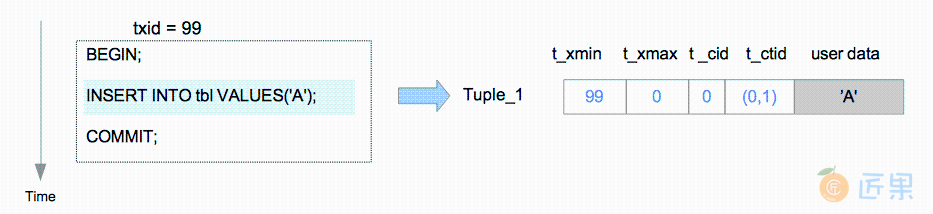

# 并发控制
## 事务隔离等级
* 并发控制是一种用于维持一致性与隔离性的技术，一致性与隔离性是ACID的两个属性。
* 并发控制技术
  * 多版本并发控制（Multi-version Concurrency Control, MVCC）
    * 每个写操作都会创建一个新版本的数据项，并保留其旧版本。
    * 当事务读取数据对象时，系统会选择其中的一个版本，通过这种方式来确保各个事务间相互隔离。
    * MVCC的主要优势在于“读不会阻塞写，而写也不会阻塞读”
  * 严格两阶段锁定（Strict Two-Phase Locking, S2PL）
    * 写操作发生时会阻塞相应对象上的读操作
    * 因为写入者获取了对象上的排他锁
  * 乐观并发控制（Optimistic Concurrency Control, OCC）
*  快照隔离（Snapshot Isolation，SI）。
  * PostgreSQL和一些RDBMS使用的一种MVCC的变体
  * 一些RDBMS（例如Oracle）使用回滚段来实现快照隔离SI。当写入新数据对象时，旧版本对象先被写入回滚段，随后用新对象覆写至数据区域。
  * PostgreSQL使用更简单的方法：新数据对象被直接插入到相关表页中。读取对象时，PostgreSQL根据可见性检查规则（visibility check rules） ，为每个事务选择合适的对象版本作为响应。
  * SI中不会出现在ANSI SQL-92标准中定义的三种异常：脏读(未提交读)，不可重复读（提交读)和幻读(可重复读)。
  * 但SI无法实现真正的可串行化，因为在SI中可能会出现串行化异常：例如写偏差（write skew） 和只读事务偏差（Read-only Transaction Skew）
    * 为了解决这个问题，PostgreSQL从9.1版本之后添加了可串行化快照隔离（SSI，Serializable Snapshot Isolation）
    * SSI可以检测串行化异常，并解决这种异常导致的冲突。因此，9.1版本之后的PostgreSQL提供了真正的SERIALIZABLE隔离等级。
      * serializable类似加上表锁或者行锁+间隙锁
* PostgreSQL对DML（SELECT, UPDATE, INSERT, DELETE等命令）使用SSI，对DDL（CREATE TABLE等命令）使用2PL。

## 事务标识（transaction id, txid）
### 事务ID
* 事务ID（XID）使用32位无符号数来表示，顺序产生，依次递增
    * 0：InvalidTransactionId，表示无效的事务ID
    * 1：BootstrapTransactionId，表示系统表初始化时的事务ID，比任何普通的事务ID都旧。
    * 2：FrozenTransactionId，冻结的事务ID，比任何普通的事务ID都旧。
        * Txid=2的事务在参与事务id比较时总是比所有事务都旧，冻结的txid始终处理非活跃状态，并且始终对其他事务可见。
    * 大于2的事务ID都是普通的事务ID。
* 获取当前事务的txid： ``` SELECT txid_current();```
* 每个元组会来用（t_xmin, t_xmax）来标示自己的可用性
    * t_xmin 存储的是产生这个元组的事务ID，可能是insert或者update语句
    * t_xmax 存储的是删除或者锁定这个元组的XID
* 每个事务只能看见t_xmin比自己XID 小且没有被删除的元组
### 事务ID回卷 - Wraparound
* txid 是用32位无符号数来表示的。
* pg将txid空间视为一个环，若不进行特殊处理，txid到达最大值42亿后溢出，新的XID又会从3开始分配（0-2保留）。
* 而按照PostgreSQL的MVCC 机制实现，之前的事务就可以看到这个新事务创建的元组，而新事务不能看到之前事务创建的元组，这违反了事务的可见性。这种现象称为XID 的回卷问题 - 事务ID回卷。
* 所以pg将txid空间一分为二，对于某个特定的txid，其后约21亿个txid属于未来，均不可见；其前约21亿个txid属于过去，均可见。
* 当新老事务id差超过21亿的时候，也有事务ID回卷问题， 此时数据库会报出如下错误并且拒绝接受所有连接，必须进入单用户模式执行vacuum freeze操作。
    ```
     ERROR: database is not accepting commands to avoid wraparound data loss in database “xxdb”
     HINT: Stop the postmaster and vacuum that database in single-user mode
    ```
  
    * 如上图所示，当前事务号走到了+100，由txid=100的事务号创建的元组（元组的xmin=100）对于当前事务属于过去来说是可见的，
    * 当下一个事务+101开启时，该元组就变为未来的事务号了，该元组就变为了不可见。为了解决这个问题，pg引入了冻结事务id的概念，并使用freeze过程实现旧事务号的冻结。
### 事务ID的比较

* 比较特殊事务与普通事务txid
```
if (!TransactionIdIsNormal(id1) || !TransactionIdIsNormal(id2))
    return (id1 < id2);
```
* 普通事务txid之间的比较
```
diff = (int32) (id1 < id2);
return diff < 0;
```
## 元组结构
* 表页中的堆元组分为两类：普通数据元组与TOAST元组。
* 堆元组由三个部分组成，即HeapTupleHeaderData结构，空值位图，以及用户数据。
  
* HeapTupleHeaderData结构在src/include/access/htup_details.h中定义。
    ```
    typedef struct HeapTupleFields
    {
            TransactionId t_xmin;           /* 插入事务的ID */
            TransactionId t_xmax;          /*删除或锁定事务的ID*/
            union
            {
                    CommandId       t_cid;     /* 插入或删除的命令ID */
                    TransactionId     t_xvac;    /* 老式VACUUM FULL的事务ID */
            } t_field3;
    } HeapTupleFields;
    typedef struct DatumTupleFields
    {
            int32          datum_len_;          /* 变长头部长度*/
            int32          datum_typmod;           /* -1或者是记录类型的标识 */
            Oid            datum_typeid;           /* 复杂类型的OID或记录ID */
    } DatumTupleFields;
    typedef struct HeapTupleHeaderData
    {
            union
            {
                    HeapTupleFields t_heap;
                    DatumTupleFields t_datum;
            } t_choice;
            ItemPointerData t_ctid;         /* 当前元组，或更新元组的TID */
            /* 下面的字段必需与结构MinimalTupleData相匹配! */
            uint16          t_infomask2;    /* 属性与标记位 */
            uint16          t_infomask;     /* 很多标记位 */
            uint8           t_hoff;         /* 首部+位图+填充的长度 */
            /* ^ - 23 bytes - ^ */
            bits8           t_bits[1];      /* NULL值的位图 —— 变长的 */
            /* 本结构后面还有更多数据 */
    } HeapTupleHeaderData;
    typedef HeapTupleHeaderData *HeapTupleHeader;
    
    ```
* 虽然HeapTupleHeaderData结构包含七个字段，但后续部分中只需要了解四个字段即可。
  * t_xmin保存插入此元组的事务的txid。
  * t_xmax保存删除或更新此元组的事务的txid。如果尚未删除或更新此元组，则t_xmax设置为0，即无效。
  * t_cid保存命令标识（command id, cid） ，cid意思是在当前事务中，执行当前命令之前执行了多少SQL命令，从零开始计数。例如，假设我们在单个事务中执行了三条INSERT命令BEGIN;INSERT;INSERT;INSERT;COMMIT;。如果第一条命令插入此元组，则该元组的t_cid会被设置为0。如果第二条命令插入此元组，则其t_cid会被设置为1，依此类推。
  * t_ctid保存着指向自身或新元组的元组标识符（tid）
  * tid用于标识表中的元组。在更新该元组时，其t_ctid会指向新版本的元组；否则t_ctid会指向自己。
* 元组的增删改
  * 描述用于插入与更新元组的自由空间映射（Free Space Map, FSM）。
  * 页中的元组
    
  * 插入元组

    
    * 假设元组是由txid=99的事务插入页面中的，在这种情况下，被插入元组Tuple 1的header字段会依以下步骤设置。
      * Tuple_1
        * t_xmin设置为99，因为此元组由txid=99的事务所插入。
        * t_xmax设置为0，因为此元组尚未被删除或更新。
        * t_cid设置为0，因为此元组是由txid=99的事务所执行的第一条命令所插入的。
        * t_ctid设置为(0,1)，指向自身，因为这是该元组的最新版本。
  * pageinspect
    * PostgreSQL自带了一个第三方贡献的扩展模块pageinspect，可用于检查数据库页面的具体内容。

      ```
      testdb=# CREATE EXTENSION pageinspect;
      CREATE EXTENSION
      testdb=# CREATE TABLE tbl (data text);
      CREATE TABLE
      testdb=# INSERT INTO tbl VALUES(A);
      INSERT 0 1
      testdb=# SELECT lp as tuple, t_xmin, t_xmax, t_field3 as t_cid, t_ctid 
                      FROM heap_page_items(get_raw_page(tbl, 0));
       tuple | t_xmin | t_xmax | t_cid | t_ctid 
      -------+--------+--------+-------+--------
           1 |     99 |      0 |     0 | (0,1)
      (1 row)
      
      ```
  * 删除

    
    * 在删除操作中，目标元组只是在逻辑上被标记为删除。目标元组的t_xmax字段将被设置为执行DELETE命令事务的txid。
    * 假设Tuple_1被txid=111的事务删除。在这种情况下，Tuple_1的首部字段会依以下步骤设置。
      * Tuple 1
        * t_xmax被设为111
    * 如果txid=111的事务已经提交，那么Tuple_1就不是必需的了。通常不需要的元组在PostgreSQL中被称为死元组（dead tuple） 。
    * 死元组最终将从页面中被移除。清除死元组的过程被称为清理（VACUUM）过程
  * 更新

    
    * 在更新操作中，PostgreSQL在逻辑上实际执行的是删除最新的元组，并插入一条新的元组
    * 假设由txid=99的事务插入的行，被txid=100的事务更新两次。
      * 当执行第一条UPDATE命令时
        * Tuple_1的t_xmax被设为txid 100，在逻辑上被删除；
        * 然后Tuple_2被插入；接下来重写Tuple_1的t_ctid以指向Tuple_2。Tuple_1和Tuple_2的头部字段设置如下。
          * Tuple 1
            * t_xmax被设置为100
            * t_ctid从(0,1)被改写为(0,2)
          * Tuple 2
            * t_xmin被设置为100。
            * t_xmax被设置为0。
            * t_cid被设置为0。
            * t_ctid被设置为(0,2)。
      * 当执行第二条UPDATE命令时
        * Tuple_2被逻辑删除，Tuple_3被插入。Tuple_2和Tuple_3的首部字段设置如下。
          * Tuple 2:
            * t_xmax被设置为100。
            * t_ctid从(0,2)被改写为(0,3)。
          * Tuple 3
            * t_xmin被设置为100。
            * t_xmax被设置为0。
            * t_cid被设置为1。
            * t_ctid被设置为(0,3)。
    * 与删除操作类似，如果txid=100的事务已经提交，那么Tuple_1和Tuple_2就成为了死元组，而如果txid=100的事务中止，Tuple_2和Tuple_3就成了死元组。
* 空闲空间映射 (FSM)
  * 插入堆或索引元组时，PostgreSQL使用表与索引相应的FSM 来选择可供插入的页面。
  * 表和索引都有各自的FSM。每个FSM存储着相应表或索引文件中每个页面可用空间容量的信息。
  * 所有FSM都以后缀fsm存储，在需要时它们会被加载到共享内存中。
  * pg_freespacemap
    * 扩展pg_freespacemap能提供特定表或索引上的空闲空间信息。以下查询列出了特定表中每个页面的空闲率。
      ```
      testdb=# CREATE EXTENSION pg_freespacemap;
      CREATE EXTENSION
      
      testdb=# SELECT *, round(100 * avail/8192 ,2) as "freespace ratio"
      FROM pg_freespace(accounts);
      blkno | avail | freespace ratio
      -------+-------+-----------------
      0 |  7904 |           96.00
      1 |  7520 |           91.00
      2 |  7136 |           87.00
      3 |  7136 |           87.00
      4 |  7136 |           87.00
      5 |  7136 |           87.00
      ....

      ```
      
## 提交日志（Commit Log, clog）
* PostgreSQL在提交日志（Commit Log, clog）中保存事务的状态。提交日志（通常称为clog）分配于共享内存中，并用于事务处理过程的全过程。

### 事务状态
* PostgreSQL定义了四种事务状态，即：IN_PROGRESS，COMMITTED，ABORTED和SUB_COMMITTED (SUB_COMMITTED状态用于子事务)

### 提交日志如何工作

* clog在逻辑上是一个数组，由共享内存中一系列8KB页面组成。
* 数组的序号索引对应着相应事务的标识，而其内容则是相应事务的状态。
* clog如何工作
  * T1: txid 200提交；txid 200的状态从IN_PROGRESS变为COMMITTED。
  * T2: txid 201中止；txid 201的状态从IN_PROGRESS变为ABORTED
* txid不断前进，当clog空间耗尽无法存储新的事务状态时，就会追加分配一个新的页面。
* 当需要获取事务的状态时，PostgreSQL将调用相应内部函数读取clog，并返回所请求事务的状态。

### 提交日志的维护
* 当PostgreSQL关机或执行存档过程时，clog数据会写入至pg_clog子目录下的文件中 (注意在10版本中，pg_clog被重命名为pg_xact).
* 这些文件被命名为0000，0001等等。文件的最大尺寸为256 KB。
* 例如当clog使用八个页面时，从第一页到第八页的总大小为64 KB，这些数据会写入到文件0000（64 KB）中；
* 而当clog使用37个页面时（296 KB），数据则会写入到0000和0001两个文件中，其大小分别为256 KB和40 KB。
* 当PostgreSQL启动时会加载存储在pg_clog（pg_xact）中的文件，用其数据初始化clog。
* clog的大小会不断增长，因为只要clog一填满就会追加新的页面。但并非所有数据都是必需的。
* 清理过程会定期删除这些不需要的旧数据（clog页面和文件）


## 事务快照
* 事务快照（transaction snapshot）是一个数据集，存储着某个特定事务在某个特定时间点所看到的事务状态信息：哪些事务处于活跃状态。这里活跃状态意味着事务正在进行中，或还没有开始。
* 事务快照在PostgreSQL内部的文本表示格式定义为100:100:。举个例子，这里100:100:意味着txid < 100的事务处于非活跃状态，而txid ≥ 100的事务处于活跃状态。
* 函数txid_current_snapshot显示当前事务的快照

  ```
  testdb=# SELECT txid_current_snapshot();
  txid_current_snapshot 
  -----------------------
   100:104:100,102
  (1 row)
  ```
  * txid_current_snapshot的文本表示是xmin:xmax:xip_list，各部分描述如下。
    * xmin 最早仍然活跃的事务的txid。所有比它更早的事务txid < xmin要么已经提交并可见，要么已经回滚并生成死元组。
    * xmax 第一个尚未分配的txid。所有txid ≥ xmax的事务在获取快照时尚未启动，因而其结果对当前事务不可见。
    * xip_list 获取快照时活跃事务 的txid列表。该列表仅包括xmin与xmax之间的txid。 
  * 例如，在快照100:104:100,102中，xmin是100，xmax是104，而xip_list为100,102。
    * xmin 最早仍然活跃的事务的txid。所有比它更早的事务txid < xmin要么已经提交并可见，要么已经回滚并生成死元组。
    * xmax 第一个尚未分配的txid。所有txid ≥ xmax的事务在获取快照时尚未启动，因而其结果对当前事务不可见。
    * xip_list 获取快照时活跃事务 的txid列表。该列表仅包括xmin与xmax之间的txid。 例如，在快照100:104:100,102中，xmin是100，xmax是104，而xip_list为100,102。
      
    * 第一个例子是100:100:
      * 因为xmin为100，因此txid < 100的事务是非活跃的
      * 因为xmax为100，因此txid ≥ 100的事务是活跃的
    * 第二个例子是100:104:100,102
      * txid < 100的事务不活跃。
      * txid ≥ 104的事务是活跃的。
      * txid等于100和102的事务是活跃的，因为它们在xip_list中，而txid等于101和103的事务不活跃。
* 事务快照是由事务管理器提供的。在READ COMMITTED隔离级别，事务在执行每条SQL时都会获取快照
* 其他情况下（REPEATABLE READ或SERIALIZABLE隔离级别），事务只会在执行第一条SQL命令时获取一次快照。获取的事务快照用于元组的可见性检查
* 使用获取的快照进行可见性检查时，所有活跃 的事务都必须被当成IN PROGRESS的事务等同对待，无论它们实际上是否已经提交或中止。
* 事务管理器与事务
  
  * 假设三个事务一个接一个地开始，并且Transaction_A和Transaction_B的隔离级别是READ COMMITTED，Transaction_C的隔离级别是REPEATABLE READ。
  * T1： 
    * Transaction_A启动并执行第一条SELECT命令。执行第一个命令时，Transaction_A请求此刻的txid和快照。
    * 在这种情况下，事务管理器分配txid=200，并返回事务快照200:200:。
  * T2:
    * Transaction_B启动并执行第一条SELECT命令。事务管理器分配txid=201，并返回事务快照200:200:，
    * 因为Transaction_A(txid=200)正在进行中。因此无法从Transaction_B中看到Transaction_A。
  * T3:
    * Transaction_C启动并执行第一条SELECT命令。事务管理器分配txid=202，并返回事务快照200:200:
    * 因此不能从Transaction_C中看到Transaction_A和Transaction_B。
  * T4:
    * Transaction_A已提交。事务管理器删除有关此事务的信息。
  * T5:
    * Transaction_B和Transaction_C执行它们各自的SELECT命令。 
    * Transaction_B需要一个新的事务快照，因为它使用了READ COMMITTED隔离等级。
    * 在这种情况下，Transaction_B获取新快照201:201:，因为Transaction_A(txid=200)已提交。
    * 因此Transaction_A的变更对Transaction_B可见了。
    * Transaction_C不需要新的事务快照，因为它处于REPEATABLE READ隔离等级，并继续使用已获取的快照，即200:200:。
    * 因此，Transaction_A的变更仍然对Transaction_C不可见。

## 可见性检查规则
### 规则
* t_xmin的状态为ABORTED元组始终不可见(规则1），因为插入此元组的事务已中止。
  ```
            /* 创建元组的事务已经中止 */
  Rule 1:   IF t_xmin status is ABORTED THEN
                RETURN Invisible
            END IF
  ```
* t_xmin的状态为IN_PROGRESS：
  ```
            /* 创建元组的事务正在进行中 */
            IF t_xmin status is IN_PROGRESS THEN
                /* 当前事务自己创建了本元组 */
                IF t_xmin = current_txid THEN
                    /* 该元组没有被标记删除，则应当看见本事务自己创建的元组 */
  Rule 2:           IF t_xmax = INVALID THEN
                        RETURN Visible /* 例外，被自己创建的未删元组可见 */
  Rule 3:           ELSE  
                        /* 这条元组被当前事务自己创建后又删除掉了，故不可见 */
                        RETURN Invisible
                    END IF
  Rule 4:       ELSE   /* t_xmin ≠ current_txid */
                    /* 其他运行中的事务创建了本元组 */
                    RETURN Invisible
                END IF
            END IF
  ```
* t_xmin的状态为COMMITTED：
  ```
            /* 创建元组的事务已经提交 */
            IF t_xmin status is COMMITTED THEN
  Rule 5:       /* 创建元组的事务在获取的事务快照中处于活跃状态，创建无效，不可见 */
                IF t_xmin is active in the obtained transaction snapshot THEN
                    RETURN Invisible
                /* 元组被删除，但删除元组的事务中止了，删除无效，可见 */
                /* 该元组没有被标记删除，则应当看见本事务自己创建的元组 */
  Rule 6:       ELSE IF t_xmax = INVALID OR status of t_xmax is ABORTED THEN
                    RETURN Visible
                /* 元组被删除，但删除元组的事务正在进行中，分情况 */
                ELSE IF t_xmax status is IN_PROGRESS THEN
                    /* 如果恰好是被本事务自己删除的，删除有效，不可见 */
  Rule 7:           IF t_xmax =  current_txid THEN
                        RETURN Invisible
                    /* 如果是被其他事务删除的，删除无效，可见 */
  Rule 8:           ELSE /* t_xmax ≠ current_txid */
                        RETURN Visible
                    END IF
                /* 元组被删除，且删除元组的事务已经提交 */
                ELSE t_xmax status is COMMITTED THEN
                   /* 删除元组的事务在获取的事务快照中处于非活跃状态，删除无效，可见 */
  Rule 9:          IF t_xmax is active in the obtained transaction snapshot THEN
                       return Visible
  Rule 10：         ELSE /* 删除有效, 不可见 */
                       RETURN InVisible
                    END IF
                END IF
            END IF
  ```
  * 规则6是显而易见的， t_xmax为INVALID，或者t_xmax对应事务已经中止，相应元组可见。
  * 三种例外 invisible
    * 第一个例外情况是t_xmin在获取的事务快照中处于活跃 状态（规则5）。
      * 在这种情况下，这条元组是不可见的，因为t_xmin应该被视为正在进行中
      * 取快照时创建该元组的事务尚未提交，因此对于REPEATABLE READ以及更高隔离等级而言，即使在判断时创建该元组的事务已经提交，但其结果仍然不可见。
    * 第二个例外情况是t_xmax是当前的txid（规则7）。
      * 此元组是不可见的，因为它已经被此事务本身更新或删除。
      * 相反，如果t_xmax的状态是IN_PROGRESS并且t_xmax不是当前的txid（规则8），则元组是可见的，因为它尚未被删除（因为删除该元组的事务尚未提交）。
    * 第三个例外情况是t_xmax的状态为COMMITTED，且t_xmax在获取的事务快照中是非活跃 的（规则10）
      * 在这种情况下该元组不可见，因为它已被另一个事务更新或删除。
      * 相反，如果t_xmax的状态为COMMITTED，但t_xmax在获取的事务快照中处于活跃状态（规则9），则元组可见，因为t_xmax对应的事务应被视为正在进行中，删除尚未提交生效。
### 流程


* 执行时序
  * T1：启动事务(txid=200)
  * T2：启动事务(txid=201)
  * T3：执行txid=200和201的事务的SELECT命令
  * T4：执行txid=200的事务的UPDATE命令
  * T5：执行txid=200和201的事务的SELECT命令
  * T6：提交txid=200的事务
  * T7：执行txid=201的事务的SELECT命令
* 为了简化描述，假设这里只有两个事务，即txid=200和201的事务。txid=200的事务的隔离级别是READ COMMITTED，而txid=201的事务的隔离级别是READ COMMITTED或REPEATABLE READ。
  * T3的SELECT命令：
    * 在T3时间点，表tbl中只有一条元组Tuple_1，按照规则6，这条元组是可见的，因此两个事务中的SELECT命令都返回"Jekyll"。
  * T5的SELECT命令
    * txid=200的事务所执行的SELECT命令。根据规则7，Tuple_1不可见，根据规则2，Tuple_2可见；因此该SELECT命令返回"Hyde"。
    * 在由txid=201的事务所执行的SELECT命令中，Tuple_1基于规则8确定可见，而Tuple_2基于规则4不可见；因此该SELECT命令返回"Jekyll"。
  * T7的SELECT命令
    * txid=201的事务处于READ COMMITTED隔离级别时
      * txid=200的事务被视为已提交，因为在这个时间点获取的事务快照是201:201:
      * 因此Tuple_1根据规则10不可见，Tuple_2根据规则6可见，SELECT命令返回"Hyde"。
    * 当txid=201的事务处于REPEATABLE READ级别时
      * 即使在T7时刻txid=200的事务实际上已经提交，它也必须被视作仍在进行，因而获取到的事务快照是200:200: 
      * 根据规则9，Tuple 1是可见的，根据规则5，Tuple_2不可见，所以最后SELECT命令会返回"Jekyll"。
* 提示位（Hint Bits）
  * PostgreSQL在内部提供了三个函数TransactionIdIsInProgress，TransactionIdDidCommit和TransactionIdDidAbort，用于获取事务的状态。
    * 这些函数被设计为尽可能减少对clog的频繁访问。
    * 尽管如此，如果在检查每条元组时都执行这些函数，那这里很可能会成为一个性能瓶颈。
    * 为了解决这个问题，PostgreSQL使用了提示位（hint bits） 
      ```
      #define HEAP_XMIN_COMMITTED       0x0100   /* 元组xmin对应事务已提交 */
      #define HEAP_XMIN_INVALID         0x0200   /* 元组xmin对应事务无效/中止 */
      #define HEAP_XMAX_COMMITTED       0x0400   /* 元组xmax对应事务已提交 */
      #define HEAP_XMAX_INVALID         0x0800   /* 元组xmax对应事务无效/中止 */
      ```
      * 在读取或写入元组时，PostgreSQL会择机将提示位设置到元组的t_informask字段中。 
      * 假设PostgreSQL检查了元组的t_xmin对应事务的状态，结果为COMMITTED。 
      * 在这种情况下，PostgreSQL会在元组的t_infomask中置位一个HEAP_XMIN_COMMITTED标记，表示创建这条元组的事务已经提交了。
      * 如果已经设置了提示位，则不再需要调用TransactionIdDidCommit和TransactionIdDidAbort来获取事务状态了。
* PostgreSQL可重复读等级中的幻读
  * PostgreSQL实现的REPEATABLE READ隔离等级不允许发生幻读。 在原则上，快照隔离中不允许出现幻读。

## 防止丢失更新
* 丢失更新（Lost Update），又被称作写-写冲突（ww-conflict）
* 是事务并发更新同一行时所发生的异常，REPEATABLE READ和SERIALIZABLE隔离等级必须阻止该异常的出现。
### 并发UPDATE命令的行为
* 执行UPDATE命令时，内部实际上调用了ExecUpdate函数。
  ```
  (1) FOR row in 本UPDATE命令待更新的所有行集
  (2)     WHILE true
              /* 第一部分 */
  (3)         IF 目标行 正在 被更新 THEN
  (4)             等待 更新目标行的事务 结束(提交或中止)
  
  (5)             IF (更新目标行的事务已提交)
                      AND (当前事务隔离级别是 可重复读或可串行化) THEN
  (6)                     中止当前事务  /* 以先更新者为准 */
                  ELSE 
  (7)                 跳转步骤（2）
                  END IF
  
              /* 第二部分 */
  (8)         ELSE IF 目标行 已经 被另一个并发事务所更新 THEN
  (9)             IF (当前事务的隔离级别是 读已提交 ) THEN
  (10)                更新目标行
                  ELSE
  (11)                中止当前事务  /* 先更新者为准 */
                  END IF
  
              /* 第三部分 */
              /* 目标行没有被修改过，或者被一个 已经结束 的事务所更新 */
              ELSE  
  (12)            更新目标行
              END IF
          END WHILE 
      END FOR 
  ```
  
  1. 获取被本UPDATE命令更新的每一行，并对每一行依次执行下列操作。
  2. 重复以下过程，直到目标行更新完成，或本事务中止。
  3. 如果目标行正在 被更新则进入步骤（4），否则进入步骤（8）。
  4. 等待正在更新目标行的事务结束，因为PostgreSQL在SI中使用了以先更新者为准（first-updater-win） 的方案。
  5. 如果更新目标行的事务已经提交，且当前事务的隔离等级为可重复读或可串行化则进入步骤（6），否则进入步骤（7）。
  6. 中止本事务，以防止丢失更新。（因为另一个事务已经对目标行进行了更新并提交）
  7. 跳转回步骤（2），并对目标行进行新一轮的更新尝试。
  8. 如果目标行已被 另一个并发 事务所更新则进入步骤（9），否则进入步骤（12）。
  9. 如果当前事务的隔离级别为读已提交 则进入步骤（10），否则进入步骤（11）。
  10. 更新目标行，并回到步骤（1），处理下一条目标行。
  11. 中止当前事务，以防止丢失更新。
  12. 更新目标行，并回到步骤（1），因为目标行尚未被修改过，或者虽然已经被更新，但更新它的事务已经结束。已终止的事务更新，即存在写写冲突。
* Example
  * 事务Tx_A和Tx_B更新同一张表中的同一行，它们的隔离等级均为READ COMMITTED。
    
    |Tx_A|Tx_B|
    |-----|-----|
    | START TRANSACTION ISOLATION LEVEL READ COMMITTED; |     |
    | START TRANSACTION | START TRANSACTION ISOLATION LEVEL READ COMMITTED;  |
    |    |  START TRANSACTION    |
    |  UPDATE tbl SET name = 'Hyde';  |     |
    |  UPDATE 1     |     |
    |  |  UPDATE tbl SET name = 'Utterson';     |
    |  |  ↓*-- 本事务进入阻塞状态，等待Tx_A完成*  |
    | COMMIT; |   ↓*-- Tx_A提交，阻塞解除*   |
    |  |    UPDATE 1  |

  * Tx_A和Tx_B更新同一张表中的同一行，它们的隔离等级分别为读已提交和可重复读。

    |Tx_A| Tx_B                                            |
    |-------------------------------------------------|-----|
    | START TRANSACTION ISOLATION LEVEL READ COMMITTED; |     |
    | START TRANSACTION | START TRANSACTION ISOLATION LEVEL REPEATABLE READ; |
    |    | START TRANSACTION                               |
    |  UPDATE tbl SET name = 'Hyde';         |     |
    |  UPDATE 1     |                                                 |
    |  | UPDATE tbl SET name = 'Utterson';               |
    |  | ↓*-- 本事务进入阻塞状态，等待Tx_A完成*                        |
    | COMMIT; | ↓*-- Tx_A提交，阻塞解除*                               |
    |  | ERROR:couldn't serialize access due to concurrent update   |

  * Tx_B（可重复读）尝试更新已经被Tx_A更新的目标行，且Tx_A已经提交。 在这种情况下，Tx_B会中止（ExecUpdate中的步骤2,8,9,11）。

    | Tx_A   | Tx_B  |
    |-------------------------------------------------|-----|
    | START TRANSACTION ISOLATION LEVEL READ COMMITTED; |     |
    | START TRANSACTION                                 | START TRANSACTION ISOLATION LEVEL REPEATABLE READ; |
    |                                                   | START TRANSACTION                               |
    | UPDATE tbl SET name = 'Hyde';                     |     |
    | UPDATE 1                                          |    |
    | Commit;                                                 |    |
    |                                                   | UPDATE tbl SET name = 'Utterson';               |
    |                                                   | ERROR:couldn't serialize access due to concurrent update   |

## 可串行化快照隔离
* 可串行化快照隔离（SSI）已经嵌入到快照隔离（SI）中，用以实现真正的可串行化隔离等级。
### SSI实现的基本策略
* 读-写冲突（rw-conflict）
  * 写-读冲突（wr-conflicts） （脏读）
  * 写-写冲突（ww-conflicts） （丢失更新）
  * 读写冲突（rw-conflicts）
    
* SSI只需要考虑读-写冲突, 即写偏差（Write-Skew）
  1. 使用SIREAD锁记录事务访问的所有对象（元组，页面，关系）。
  2. 当写入任何堆元组/索引元组时，使用SIREAD锁检测读-写冲突。
  3. 如果从读-写冲突中检测出串行化异常，则中止事务。
* SSI实现中的两种数据结构：SIREAD锁与读-写冲突来描述SSI机制。它们都储存在共享内存中。
  * SIREAD锁
    * 在内部又被称为谓词锁（predicate lock）
    * 是一个由对象与虚拟事务标识构成的二元组，存储着哪个事务访问了哪个对象的相关信息。
    * 注意这里省略了对虚拟事务标识的描述，使用txid而非虚拟txid能大幅简化说明。
    * 在SERIALIZABLE模式下只要执行DML命令，就会通过CheckTargetForConflictsOut函数创建出SIREAD锁。
    * Example
      * 如果txid=100的事务读取给定表的Tuple_1，则会创建一个SIREAD锁{Tuple_1,{100}}。
      * 如果是其他事务，例如txid=101读取了Tuple_1，则SIREAD锁会更新为{Tuple_1,{100,101}}。
    * 请注意，读取索引页时也会创建SIREAD锁
    * SIREAD锁有三个级别：元组，页面，以及关系。
      * 如果单个页面内所有元组的SIREAD锁都被创建，则它们会聚合为该页上的单个SIREAD锁
      * 原有相关元组上的SIREAD锁都会被释放（删除），以减少内存空间占用。对读取的页面也是同理。
      * 当为索引创建SIREAD锁时，一开始会创建页级别的SIREAD锁。
  * 读-写冲突
    * 读-写冲突是一个三元组，由SIREAD锁，以及两个分别读写该SIREAD锁的事务txid构成。
    * 当在可串行化模式下执行INSERT，UPDATE或DELETE命令时，函数CheckTargetForConflictsIn会被调用
    * 并检查SIREAD锁来检测是否存在冲突，如果有就创建一个读-写冲突。
    * Example
      * 假设txid = 100的事务读取了Tuple_1，然后txid=101的事务更新了Tuple_1。
      * 在这种情况下，txid=101的事务中的UPDATE命令会调用CheckTargetForConflictsIn函数
      * 并检测到在Tuple_1上存在txid=100,101之间的读-写冲突，并创建rw-conflict{r = 100, w = 101, {Tuple_1}}。
    * CheckTargetForConflictOut、CheckTargetForConflictIn函数，以及在可串行化模式中执行COMMIT命令会触发的PreCommit_CheckForSerializationFailure函数，都会使用创建的读写冲突来检查串行化异常。
    * 如果它们检测到异常，则只有先提交的事务会真正提交，其他事务会中止（依据以先提交者为准（first-committer-win） 策略）。
  * 原理
    ```
    testdb=# CREATE TABLE tbl (id INT primary key, flag bool DEFAULT false);
    testdb=# INSERT INTO tbl (id) SELECT generate_series(1,2000);
    testdb=# ANALYZE tbl;
    ```
    * 事务Tx_A和Tx_B执行以下命令
      
      * 假设所有命令都使用索引扫描。 因此当执行命令时，它们会同时读取堆元组与索引页，每个索引页都包含指向相应堆元组的索引元组。
        
      * T1 ：Tx_A执行SELECT命令，该命令读取堆元组Tuple_2000，以及包含主键的索引页Pkey_2。
      * T2 ：Tx_B执行SELECT命令。 此命令读取堆元组Tuple_1，以及包含主键的索引页Pkey_1。
      * T3 ：Tx_A执行UPDATE命令，更新Tuple_1。
      * T4 ：Tx_B执行UPDATE命令，更新Tuple_2000。
      * T5 ：Tx_A提交。
      * T6 ：Tx_B提交，然而由于写偏差异常而被中止。
      
      * T1 ： 执行Tx_A的SELECT命令时，CheckTargetForConflictsOut会创建SIREAD锁。
        * 在本例中该函数会创建两个SIREAD锁：L1与L2。L1和L2分别与Pkey_2和Tuple_2000相关联。
      * T2 ： 执行Tx_B的SELECT命令时，CheckTargetForConflictsOut会创建两个SIREAD锁：L3和L4。L3和L4分别与Pkey_1和Tuple_1相关联。
      * T3 ： 执行Tx_A的UPDATE命令时，CheckTargetForConflictsOut和CheckTargetForConflictsIN会分别在ExecUpdate执行前后被调用。
        * 在本例中，CheckTargetForConflictsOut什么都不做。而CheckTargetForConflictsIn则会创建读-写冲突C1，
        * 这是Tx_B和Tx_A在Pkey_1和Tuple_1上的冲突，因为Pkey_1和Tuple_1都由Tx_B读取并被Tx_A写入。
      * T4 ： 执行Tx_B的UPDATE命令时，CheckTargetForConflictsIn会创建读-写冲突C2，
        * 这是Tx_A与Tx_B在Pkey_2和Tuple_2000上的冲突。 在这种情况下，C1和C2在前趋图中构成一个环；因此Tx_A和Tx_B处于不可串行化状态。
        * 但事务Tx_A和Tx_B都尚未提交，因此CheckTargetForConflictsIn不会中止Tx_B。注意这是因为PostgreSQL的SSI实现采用先提交者为准方案。
      * 当Tx_A尝试提交时，将调用PreCommit_CheckForSerializationFailure。
        * 此函数可以检测串行化异常，并在允许的情况下执行提交操作。在这里因为Tx_B仍在进行中，Tx_A成功提交。
      * 当Tx_B尝试提交时，PreCommit_CheckForSerializationFailure检测到串行化异常，且Tx_A已经提交；因此Tx_B被中止。
      * 此外，如果在Tx_A提交之后（T5时刻），Tx_B执行了UPDATE命令，则Tx_B会立即中止。因为Tx_B的UPDATE命令会调用CheckTargetForConflictsIn，并检测到串行化异常
      * 如果Tx_B在T6时刻执行SELECT命令而不是COMMIT命令，则Tx_B也会立即中止。因为Tx_B的SELECT命令调用的CheckTargetForConflictsOut会检测到串行化异常
        
      
* 假阳性的串行化异常
  * 在可串行化模式下，因为永远不会检测到假阴性（false-negative，发生异常但未检测到）
  * 可能会检测到假阳性异常（没有发生异常但误报发生）
    
    * 当使用顺序扫描时，如SIREAD锁的解释中所述，PostgreSQL创建了一个关系级的SIREAD锁。 
    * 在这种情况下，产生了与tbl表上SIREAD锁相关联的读-写冲突。
    
    * 如果事务Tx_A和Tx_B都获取里相同的索引SIREAD锁，PostgreSQL也会误报假阳性异常。
    * 虽然实际上没有冲突，但Tx_A与Tx_B两者之一也将被中止
    * 即使使用索引扫描，如果事务Tx_A和Tx_B都获取里相同的索引SIREAD锁，PostgreSQL也会误报假阳性异常
    * 因为使用相同索引页的索引扫描。（如果Tx_A和Tx_B获取不同索引页上的SIREAD锁则不会误报，并且两个事务都可以提交）
    。

## 所需的维护进程
* PostgreSQL的并发控制机制需要以下维护过程。
  * 删除死元组及指向死元组的索引元组
  * 移除提交日志（clog） 中非必需的部分
  * 冻结旧的事务标识（txid）
  * 更新FSM，VM，以及统计信息
