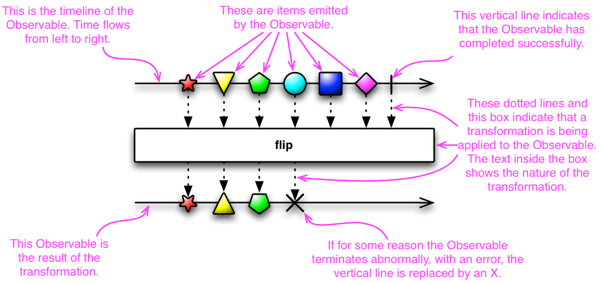
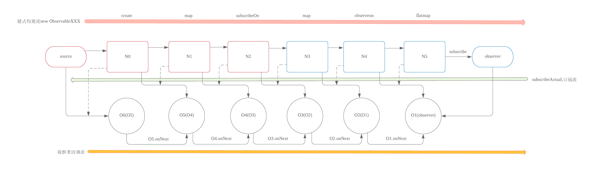
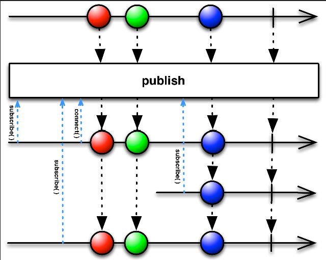
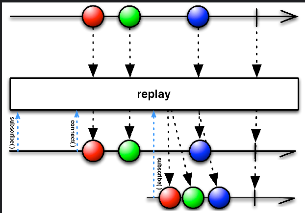

## Observable
* In ReactiveX an observer subscribes to an Observable.
* Then that observer reacts to whatever item or sequence of items the Observable emits.
  
* “hot” Observable
  * may begin emitting items as soon as it is created
  * so any observer who later subscribes to that Observable may start observing the sequence somewhere in the middle
* “cold” Observable
  * waits until an observer subscribes to it before it begins to emit items
  * so such an observer is guaranteed to see the whole sequence from the beginning
  * there is also something called a “Connectable” Observable

* When creating Observables (by calling observables' operations), it forms the observables chain
  * each observable operation creates a downstream observable
  * method subscribe call is from downstream to upstream, each layer's observable subscribes the co-layer's observer
    * it forms observers chain when calling observables subscribe
      * it passes downstream observer to create upstream observer
      * and then let the upstream observable subscribe the created upstream observer
      * last, the top upstream observable subscribes this observers chain.
    * observers chain will be called by the top upstream observable subscribe method
      * observers actions are called from upstream to downstream
* different implementations of method subscribe (-> method subscribeActual which is implemented by subclass)
  * Observable -> ObservableSource
    * ConnectableObservable (“cold” Observable)
      * ObservablePublish
        
      * ObservableReplay
        
  * Single -> SingleSource
  * Flowable -> Publisher
  * Completable -> CompletableSource
* switch thread
  * subscribeOn 
    * make the subscribe calls on the switched thread
    * because subscribe calls are from downstream to upstream
    * we should put the subscribeOn to the last which makes all most all subscribe calls on the switched thread
  * observeOn
    * make the observer actions calls on the switched thread
    * because observer actions calls are from upstream to downstream
    * we should put the observeOn to the beginning, which make most all observer actions calls on the switched thread

* other operators
  * lift: the passed ObservableOperator is executed synchronized, which is different with other operators

## Observer 
* SingleObserver
  * onSubscribe, onSuccess, onError (no onNext and onComplete) 
* CompletableObserver
  * onComplete, onError
* Subscriber
  * onSubscribe, onNext, onError, onComplete

* Observer
  * onSubscribe, onNext, onError, onComplete

### The Observable Contract

#### Notifications
* An Observable communicates with its observers with the following notifications:
  * OnNext
    * conveys an item that is emitted by the Observable to the observer
    * onNext(T t)
      * An Observable calls this method whenever the Observable emits an item. 
      * This method takes as a parameter the item emitted by the Observable.
  * OnCompleted
    * indicates that the Observable has completed successfully and that it will be emitting no further items
    * onComplete()
      * An Observable calls this method after it has called onNext for the final time, if it has not encountered any errors.
  * OnError
    * indicates that the Observable has terminated with a specified error condition and that it will be emitting no further items
    * onError(Throwable t)
      * An Observable calls this method to indicate that it has failed to generate the expected data
      * or has encountered some other error
      * It will not make further calls to onNext or onCompleted
      * The onError method takes as its parameter an indication of what caused the error.
  * OnSubscribe (optional)
    * indicates that the Observable is ready to accept Request notifications from the observer
    * onSubscribe(Disposable d): for Observer
      * in observable subscribe method call, it can pass a Disposable to the downstream observer by onSubscribe method
      * Disposable.dispose() can be called anytime to cancel the connection (stop the upstream observable) in the downstream observer
    * onSubscribe(Subscription d): for Subscriber
      * in flowable subscribe method call, it can pass a Subscription to the downstream observer by onSubscribe method
      * Subscription.request is used to get items from upstream flowable
      * Subscription.cancel is used to stop the upstream flowable
* An Observable may call onNext zero or more times then may follow those calls with a call to either onCompleted or onError
* An observer communicates with its Observable by means of the following notifications:
  * Subscribe
    * indicates that the observer is ready to receive notifications from the Observable
  * Unsubscribe
    * indicates that the observer no longer wants to receive notifications from the Observable
  * Request (optional)
    * indicates that the observer wants no more than a particular number of additional OnNext notifications from the Observable
* Backpressure
  * An Observable may implement backpressure if it detects that its observer implements Request notifications and understands OnSubscribe notifications.
  * If an Observable implements backpressure and its observer employs backpressure, the Observable will not begin to emit items to the observer immediately upon subscription. Instead, it will issue an OnSubscribe notification to the observer.
  * At any time after it receives an OnSubscribe notification, an observer may issue a Request notification to the Observable it has subscribed to. 
  * This notification requests a particular number of items. The Observable responds to such a Request by emitting no more items to the observer than the number of items the observer requests.
  * An Observable that does not implement backpressure should respond to a Request notification from an observer by issuing an OnError notification that indicates that backpressure is not supported.
