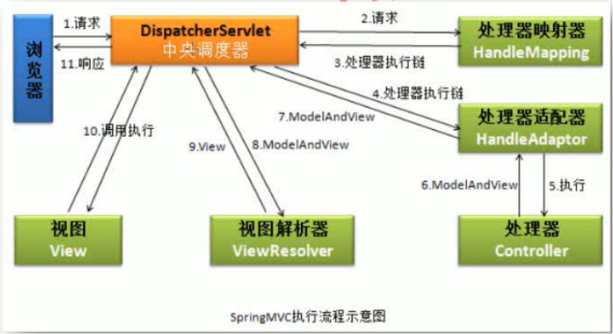

# org.springframework.web.servlet.DispatcherServlet



* init
  1. Create PropertyValues from servlet init parameters
  2. Create BeanWrapper for the servlet
  3. Create ResourceEditor and register it to BeanWrapper by its registerCustomEditor method. (convert string to Resource)
  4. initBeanWrapper
  5. set properties of the servlet from PropertyValues via BeanWrapper
  6. initServletBean
  7. initWebApplicationContext: default contextConfigLocation is <servlet-name>-servlet.xml
  8. onRefresh
  9. initStrategies: default strategies: DispatcherServlet.properties
     * ...
     * initHandlerMappings
     * initHandlerAdapters
     * ...
  10. initFrameworkServlet

* service
  * service (service -> super.service -> doGet/doPost...) -> processRequest -> doService -> doDispatch -> processDispatchResult -> render
  * processHandlerException: get handlerExceptionResolvers from handlerExceptionResolvers to resolveException
  * render
    1. LocaleResolver gets the Local, and set the Local to response
       * CookieLocaleResolver, SessionLocaleResolver
       * org.springframework.web.servlet.i18n.LocaleChangeInterceptor
    2. view is string, get View by a ViewResolver in the List viewResolvers
       * ViewResolver: org.springframework.web.servlet.view.UrlBasedViewResolver, org.springframework.web.servlet.view.ResourceBundleViewResolver
       * org.springframework.web.servlet.view.ContentNegotiatingViewResolver: viewResolvers ```List<ViewResolver>```
       * View: org.springframework.web.servlet.view.InternalResourceView, org.springframework.web.servlet.view.JstlView
       * Json view: org.springframework.web.servlet.view.json.MappingJackson2JsonView
    3. view.render with Model, request, response
    4. HandlerExceptionResolver

* handler mapping
  1. getHandler: get HandlerExecutionChain from HandlerMapping.getHandler(request) by iterating each HandlerMapping
  2. Calling HandlerExecutionChain (in doDispatch)
     * Get a HandlerAdapter support the HandlerExecutionChain.getHandler()
     * mappedHandler.applyPreHandle
     * HandlerAdapter.handle the request with HandlerExecutionChain.getHandler()
     * mappedHandler.applyPostHandle

* org.springframework.web.servlet.mvc.method.annotation.RequestMappingHandlerMapping
  * isHandler: Class with annotation Controller or RequestMapping
  * initHandlerMethods -> detectHandlerMethods -> registerHandlerMethod -> handlerMethodsInitialized
    * urlMap ```MultiValueMap<String, RequestMappingInfo>: url [value in Class level RequestMapping if have] + value in method level RequestMapping```
    * nameMap ```MultiValueMap<String, HandlerMethod>```
    * handlerMethods ```Map<RequestMappingInfo, HandlerMethod>```
  * getHandler -> getHandlerInternal (null then getDefaultHandler) -> getHandlerExecutionChain based on internal handler (HandlerMethod), HandlerInterceptors and MappedInterceptors
    * filter RequestMappingInfos from urlMap based on input lookupPath
    * get matched RequestMappingInfos based on filter RequestMappingInfos
    * if matched RequestMappingInfos empty, get matched RequestMappingInfos based on all RequestMappingInfos in urlMap
    * if matched RequestMappingInfos not empty
      1. sort matched RequestMappingInfos with MatchComparator
      2. handleMatch with the first matched RequestMappingInfo
      3. return HandlerMethod based on the first matched RequestMappingInfo from handlerMethods
    * else, handleNoMatch

* org.springframework.web.servlet.mvc.method.annotation.RequestMappingHandlerAdapter
  * supports: handler is HandlerMethod
  * handle -> handleInternal -> invokeHandleMethod -> ServletInvocableHandlerMethod.invokeAndHandle (ModelAndViewContainer)
  * in invokeHandleMethod: getModelFactory and ModelFactory.init, then add all session attributes and handle methods with annotation ModelAttribute to get value for storing to ModelAndViewContainer
  * getModelAndView based on ModelAndViewContainer
    * if no return from handler, ModelAndViewContainer.isRequestHandled is true and getModelAndView returns null
  * properties
    * argumentResolvers ```HandlerMethodArgumentResolverComposite```
    * initBinderArgumentResolvers ```HandlerMethodArgumentResolverComposite```
    * customArgumentResolvers ```List<HandlerMethodArgumentResolver>```: will be added to argumentResolvers and initBinderArgumentResolvers by default
    * returnValueHandlers ```HandlerMethodReturnValueHandlerComposite```
    * customReturnValueHandlers ```List<HandlerMethodReturnValueHandler>```: will be added to returnValueHandlers by default
    * messageConverters ```List<HttpMessageConverter<?>>```: for some argumentResolvers
  * getDataBinderFactory
    * create InitBinderMethods from InitBinder methods of the ControllerAdvice beans (isApplicableToBeanType:advice for this handler)
    * create InitBinderMethods from InitBinder methods in the handler
    * create ServletRequestDataBinderFactory with above InitBinderMethods and ConfigurableWebBindingInitializer
    * ServletRequestDataBinderFactory.createBinderInstance -> ExtendedServletRequestDataBinder (DataBinder)
      ```
          WebDataBinder binder = binderFactory.createBinder(webRequest, attribute, name); 
             -> create dataBinder (ExtendedServletRequestDataBinder)
             -> call WebBindingInitializer.initBinder to init dataBinder
             -> it will call binderMethods (InitBinder.value match the name) above to fill attribute
          attribute -> parameter -> binder.getTarget()
          binder.bind(request) -> read value from request/url to attribute
          name -> value of the parameter's annotation ModelAttribute. If it's null, getVariableNameForParameter
          DataBinder will be called by argument resovler ModelAttributeMethodProcessor
      ```
* org.springframework.web.method.ControllerAdviceBean: wrap Object with annotation ControllerAdvice
  * get methods tagged with annotation InitBinder or ModelAttribute
  * add it responseBodyAdvice if it implements interface ResponseBodyAdvice
  * ControllerAdvice advices the beans which have matched the basePackages, assignableTypes or tagged matched annotations.

* org.springframework.web.HttpRequestHandler, org.springframework.web.servlet.mvc.Controller
  * HttpRequestHandler的handlerRequest()不提供返回值，而Controller接口需要返回一个ModelAndView。
  * HttpRequestHandler与HttpRequestHandlerServlet处于spring-web包中，所以可以脱离SpringMVC的依赖，但Controller接口处于spring-webmvc包中，所以不能脱离SpringMVC来使用。
  * Two ways to use HttpRequestHandler
    1. use HttpRequestHandlerServlet (servlet name should be the same as the bean name of the handler in mvc context)
    2. Set the bean name or its aliases of the handler start with / (via BeanNameUrlHandlerMapping to locate this handler)
       * Then HttpRequestHandlerAdapter will call the handler
  * For using Controller, set the bean name or its aliases of the controller start with / (via BeanNameUrlHandlerMapping to locate this controller)
    * Then SimpleControllerHandlerAdapter will call the handler
* org.springframework.web.servlet.mvc.HttpRequestHandlerAdapter, org.springframework.web.servlet.mvc.SimpleControllerHandlerAdapter

* org.springframework.web.servlet.handler.BeanNameUrlHandlerMapping
  * register the class names of the handlers to mapping by the bean names and their aliases of the handler
  * The handlers should implement HttpRequestHandler or Controller

* org.springframework.web.servlet.mvc.annotation.DefaultAnnotationHandlerMapping (deprecated in Spring 3.2, use RequestMappingHandlerMapping)
  * register the class names of the handlers to mapping by the value in the annotation RequestMapping of the handlers and their methods
  * The handlers should implement HttpRequestHandler or Controller

* org.springframework.web.servlet.handler.SimpleUrlHandlerMapping
  * register handlers based on configured urlMap
  * The handlers should implement HttpRequestHandler or Controller

* org.springframework.web.servlet.mvc.annotation.AnnotationMethodHandlerAdapter (deprecated in Spring 3.2, use RequestMappingHandlerAdapter)

* org.springframework.web.servlet.config.AnnotationDrivenBeanDefinitionParser
  * parse ```<mvc:annotation-driven>```
  * registers the following HandlerMappings: RequestMappingHandlerMapping, BeanNameUrlHandlerMapping
  * registers the following HandlerAdapters: RequestMappingHandlerAdapter, HttpRequestHandlerAdapter, SimpleControllerHandlerAdapter

* org.springframework.beans.PropertyEditorRegistry
  * PropertyEditor注册器: 用户为某类型注册PropertyEditor
  * registerCustomEditor方法注册PropertyEditor
  * BeanWrapperImpl extends PropertyEditorRegistrySupport which implements PropertyEditorRegistry
  * BeanWrapperImpl.setPropertyValue -> convertIfNecessary -> propertyEditorRegistry.findCustomEditor(requiredType, propertyName) 
    -> doConvertValue -> PropertyEditor.setValue/PropertyEditor.setValueAsText