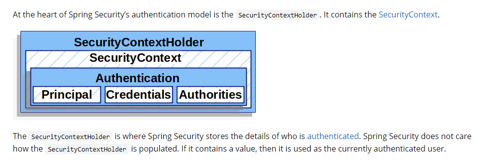

# Spring Security 
## Spring Security 的初始化和认证授权是围绕下面三类展开的
* org.springframework.web.filter.DelegatingFilterProxy
* org.springframework.security.web.FilterChainProxy (springSecurityFilterChain)
* org.springframework.security.web.SecurityFilterChain (org.springframework.security.web.DefaultSecurityFilterChain)


## DelegatingFilterProxy
* Creation
  ``` 
  SpringServletContainerInitializer.onStartup -> AbstractSecurityWebApplicationInitializer.onStartup 
  -> AbstractSecurityWebApplicationInitializer.(beforeSpringSecurityFilterChain)insertSpringSecurityFilterChain(afterSpringSecurityFilterChain)
  -> create DelegatingFilterProxy with target filter name "springSecurityFilterChain"
  -> add filter DelegatingFilterProxy as "springSecurityFilterChain" to servlet context
  ```
* initFilterBean (called by init)
  1. find delegated filter named "springSecurityFilterChain" from spring bean context
  2. init delegated filter
* The delegated filter is "springSecurityFilterChain" in spring bean context
  ```
   Annotation org.springframework.security.config.annotation.web.configuration.EnableWebSecurity imports 
   Configuration org.springframework.security.config.annotation.web.configuration.WebSecurityConfiguration
   WebSecurityConfiguration.springSecurityFilterChain creates the delegated filter
   ```
* doFilter: call doFilter of delegated filter.

## FilterChainProxy
* doFilter
  1. Found a matched SecurityFilterChain to get its Filters list
  2. If found, create VirtualFilterChain with the security filters. Then VirtualFilterChain.doFilter 
  3. VirtualFilterChain.doFilter calls the security filters one by one, then calls original filter chain in servlet context.
### org.springframework.security.config.annotation.web.configuration.WebSecurityConfiguration
* webSecurity WebSecurity
* webSecurityConfigurers: List<SecurityConfigurer<Filter, WebSecurity>>
* setFilterChainProxySecurityConfigurer
    1. create org.springframework.security.config.annotation.web.builders.WebSecurity as webSecurity
    2. webSecurityConfigurers = AutowiredWebSecurityConfigurersIgnoreParents.getWebSecurityConfigurers()
        * getWebSecurityConfigurers finds all beans of org.springframework.security.config.annotation.web.WebSecurityConfigurer
    3. Sort webSecurityConfigurers by annotation org.springframework.core.annotation.Order on SecurityConfigurer implementation class
    4. webSecurity apply each webSecurityConfigurer in webSecurityConfigurers
* springSecurityFilterChain: call webSecurity.build to create and return FilterChainProxy
### org.springframework.security.config.annotation.SecurityConfigurer
#### org.springframework.security.config.annotation.authentication.configuration.EnableGlobalAuthentication
* import org.springframework.security.config.annotation.authentication.configuration.AuthenticationConfiguration
  * enableGlobalAuthenticationAutowiredConfigurer
  * getAuthenticationManager
#### org.springframework.security.config.annotation.web.configuration.WebSecurityConfigurerAdapter
* Create a Configure class extends WebSecurityConfigurerAdapter with EnableWebSecurity tag to configure Spring Security.
* init
    1. Create HttpSecurity as http
    2. add http to webSecurity.securityFilterChainBuilders
* authenticationManager: find AuthenticationManager
* setObjectPostProcessor
  1. create AuthenticationManagerBuilder
* getHttp
    1. Create HttpSecurity
    2. get AuthenticationManager and set it as AuthenticationManagerBuilder's parentAuthenticationManager
    3. http.setSharedObject(UserDetailsService.class, userDetailsService())
    4. call configure(HttpSecurity http), which is implemented by sub Configure class.
* userDetailsService
    1. Create UserDetailsServiceDelegator

#### org.springframework.security.config.annotation.web.configurers.AbstractHttpConfigurer
* subclass (for configuration, creating and adding filters)
  * CsrfConfigurer (created by HttpSecurity.csrf)
  * HeadersConfigurer (created by HttpSecurity.headers)
  * SessionManagementConfigurer (created by HttpSecurity.sessionManagement)
  * ExceptionHandlingConfigurer (created by HttpSecurity.exceptionHandling): add ExceptionTranslationFilter to HttpSecurity.filters
  * ExpressionUrlAuthorizationConfigurer (created by HttpSecurity.authorizeRequests): add FilterSecurityInterceptor to HttpSecurity.filters
  * FormLoginConfigurer (created by HttpSecurity.formLogin)
  * LogoutConfigurer (created by HttpSecurity.logout)
  * DaoAuthenticationConfigurer (created by HttpSecurity.userDetailsService) set userDetailsService to AuthenticationManagerBuilder
  * ...
### org.springframework.security.config.annotation.SecurityBuilder
#### org.springframework.security.config.annotation.web.builders.WebSecurity
* sharedObjects ```HashMap<Class<Object>, Object>```
* configurers ```LinkedHashMap<Class<? extends SecurityConfigurer<O, B>>, List<SecurityConfigurer<O, B>>>```
* ignoredRequests ```ArrayList<RequestMatcher>```: request patters without authentication check
* apply: add input configurer to configurers, configurer.init if WebSecurity is INITIALIZING
* securityFilterChainBuilders ```List<SecurityBuilder<? extends SecurityFilterChain>>```
  * call addSecurityFilterChainBuilder to add SecurityBuilder to securityFilterChainBuilders
* build -> doBuild -> performBuild
* configurer.init and configure.configure with WebSecurity as parameter for each confgure in configurers in doBuild
* performBuild
  1. create List for SecurityFilterChain as securityFilterChains to store all created DefaultSecurityFilterChain.
  2. Create DefaultSecurityFilterChain with each ignoredRequest from ignoredRequests.
  3. Call each securityFilterChainBuilder.build from securityFilterChainBuilders to build DefaultSecurityFilterChain
  4. Create FilterChainProxy with securityFilterChains
#### org.springframework.security.config.annotation.web.builders.HttpSecurity
* sharedObjects ```HashMap<Class<Object>, Object>```
* configurers ```LinkedHashMap<Class<? extends SecurityConfigurer<O, B>>, List<SecurityConfigurer<O, B>>>```
* requestMatcherConfigurer ```RequestMatcherConfigurer```
* filters ```List<Filter>```
* requestMatcher ```RequestMatcher```
* comparitor ```FilterComparator```: manage order of the items in filters
* addFiler and addFilerXXX: add filter to filters, and record order in comparitor
* build -> doBuild -> performBuild
* configurer.init and configure.configure with HttpSecurity as parameter for each confgure in configurers in doBuild
* performBuild
  1. sort filters based on comparitor: org.springframework.security.config.annotation.web.builders.FilterComparator
  2. create DefaultSecurityFilterChain with requestMatcher and filters

## DefaultSecurityFilterChain
* Provide request matcher and list of security filters for VirtualFilterChain
### org.springframework.security.config.annotation.web.configurers.ExpressionUrlAuthorizationConfigurer
* ExpressionInterceptUrlRegistry
  * configure
    1. Create FilterInvocationSecurityMetadataSource: copy contents from urlMappings to FilterInvocationSecurityMetadataSource.requestMap with parsing auth check statement to WebExpressionConfigAttribute
    2. Create and add FilterSecurityInterceptor to HttpSecurity.filters
  * urlMappings
  * chainRequestMatchersInternal: return AuthorizedUrl with list of RequestMatcher
  * AuthorizedUrl: access -> interceptUrl -> add AbstractConfigAttributeRequestMatcherRegistry.UrlMapping to urlMappings
  * AbstractConfigAttributeRequestMatcherRegistry.UrlMapping a RequestMatcher to list of SecurityConfig
  * SecurityConfig provides auth check statement
### org.springframework.security.web.access.intercept.FilterSecurityInterceptor
* authenticationManager ```AuthenticationManager```
* beforeInvocation
  1. SecurityContextHolder.getContext().getAuthentication() 
  2. Check if Authentication isAuthenticated; if not, call authenticationManager.authenticate
  3. SecurityContextHolder.getContext().setAuthentication(authentication)
     
  4. AccessDecisionManager.decide based on Authentication and List of ConfigAttribute filter by request from FilterInvocationSecurityMetadataSource.requestMap
* afterInvocation: AfterInvocationManager.decide based on returning from beforeInvocation.
### org.springframework.security.config.annotation.authentication.builders.AuthenticationManagerBuilder
* authenticationProviders ```List<AuthenticationProvider>```: added by calling authenticationProvider
* parentAuthenticationManager ```AuthenticationManager```
* performBuild: create ProviderManager with authenticationProviders and parentAuthenticationManager

### Authentication Check
* Main flow: FilterSecurityInterceptor.doFilter -> FilterSecurityInterceptor.beforeInvocation 
  -> ProviderManager.authenticate -> AuthenticationProvider.authenticate
  -> securityFilterChain -> FilterSecurityInterceptor.afterInvocation
  -> AccessDecisionManager.decide
#### org.springframework.security.authentication.ProviderManager
* it's authenticationManager in FilterSecurityInterceptor
* providers ```List<AuthenticationProvider>```
* parent ```AuthenticationManager```
* authenticate
  1. check each provider.supports in providers
  2. provider.authenticate if support
  3. if any success, pass authentication
  4. if not pass and parent is not null, parent.authenticate
#### org.springframework.security.access.AccessDecisionVoter
* voter checks if the Authentication passed the list of ConfigAttribute
* AuthenticatedVoter
  * Check Authentication authenticated
* RoleVoter
  * check one of ConfigAttribute's getAttribute started with the role_prefix and equals to Authentication's grantedAuthority
* WebExpressionVoter
  * set org.springframework.security.web.access.expression.DefaultWebSecurityExpressionHandler as expressionHandler
  * call expressionHandler.evaluateAsBoolean to check one WebExpressionConfigAttribute 
#### org.springframework.security.access.AccessDecisionManager -> org.springframework.security.access.vote.AbstractAccessDecisionManager
* decisionVoters ```List<AccessDecisionVoter<? extends Object>>```
* org.springframework.security.access.vote.AffirmativeBased
  * If one decisionVoter granted, pass
  * If no decisionVoter denied, pass
* org.springframework.security.access.vote.ConsensusBased
  * check all decisionVoter, aggregate the amounts of granted voters, denied voters and abstain voters
  * if granted > denied, pass. 
  * if denied > granted, fail.
  * otherwise, if allowIfEqualGrantedDeniedDecisions true, pass; if not fail.
* org.springframework.security.access.vote.UnanimousBased
  * if any decisionVoter denied, fail
  * aggregate the amounts of granted voters, and abstain voters
  * if granted > 0, pass
  * otherwise, if allowIfEqualGrantedDeniedDecisions true, pass; if not fail.
#### Others
* org.springframework.security.authentication.AuthenticationProvider
* org.springframework.security.core.userdetails.UserDetails
* org.springframework.security.core.userdetails.UserDetailsService
* org.springframework.security.web.AuthenticationEntryPoint
* org.springframework.security.web.context.SecurityContextRepository
* org.springframework.security.web.context.SecurityContextPersistenceFilter
* org.springframework.security.web.session.SessionManagementFilter
* org.springframework.security.core.context.SecurityContextHolder
* org.springframework.security.core.context.SecurityContextHolderStrategy