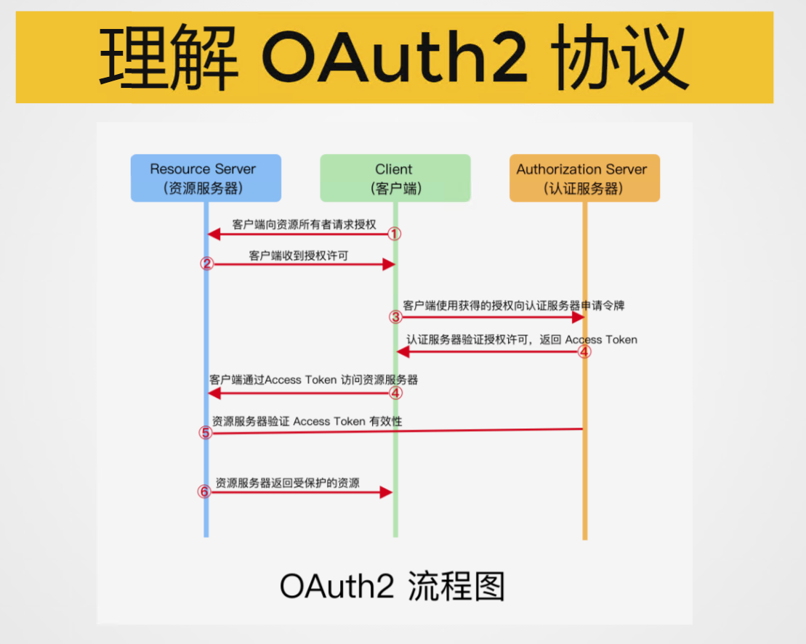
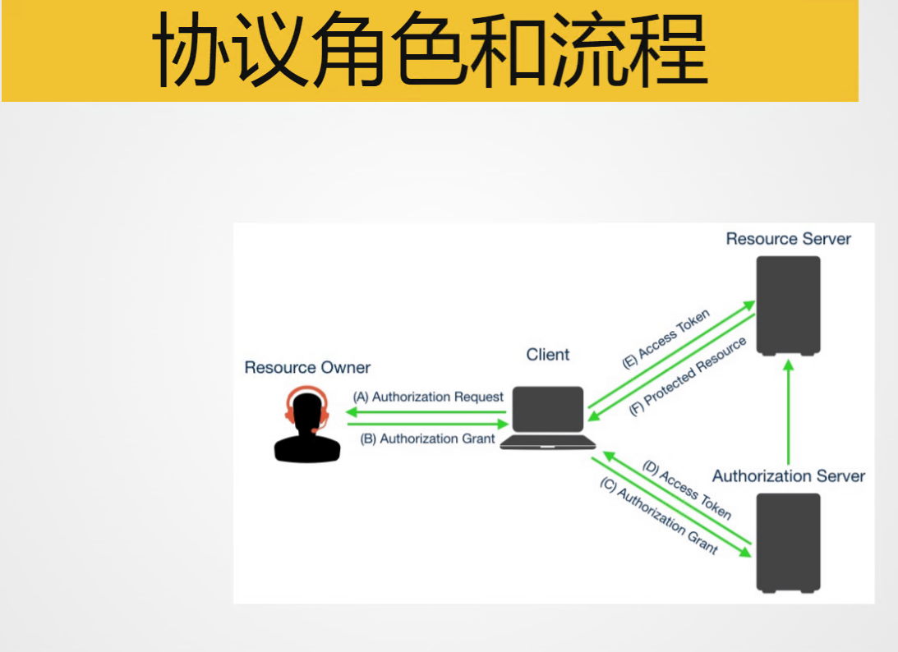
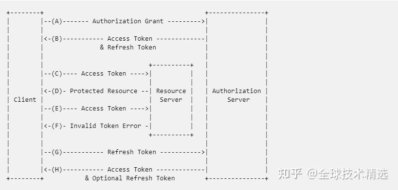
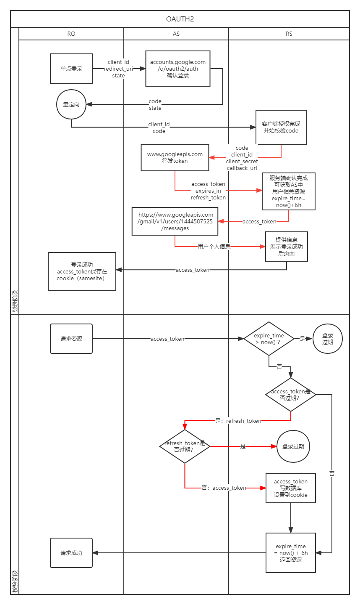

# Oauth2
## Work flow



## Protocol
### 授权码模式 (Authorization code Flow)

```
     +----------+
     | Resource |
     |   Owner  |
     |          |
     +----------+
          ^
          |
         (B)
     +----|-----+          Client Identifier      +---------------+
     |         -+----(A)-- & Redirection URI ---->|               |
     |  User-   |                                 | Authorization |
     |  Agent  -+----(B)-- User authenticates --->|     Server    |
     |          |                                 |               |
     |         -+----(C)-- Authorization Code ---<|               |
     +-|----|---+                                 +---------------+
       |    |                                         ^      v
      (A)  (C)                                        |      |
       |    |                                         |      |
       ^    v                                         |      |
     +---------+                                      |      |
     |         |>---(D)-- Authorization Code ---------'      |
     |  Client |          & Redirection URI                  |
     |         |                                             |
     |         |<---(E)----- Access Token -------------------'
     +---------+       (w/ Optional Refresh Token)
```

* 第三方应用向资源认证授权平台注册（应用名称，应用网站，应用描述，redirect_url/callback_url） -> 获取client_id和client_secret
* 实现步骤
  * 访问（资源认证授权平台）认证授权url: https://<server>/oauth/authorize?client_id=xxxxxx&redirect_url=<redirect_url/callback_url>&response_type=code&state=xxxxx&scope=xxxx
    * client_id: 标识第三方应用
    * redirect_url: 资源认证授权平台认证后callback第三方应用的一个地址，告诉第三方应用已经认证通过了 
    * response_type: 授权类型 -> 授权码类似 code
    * state (可选): 本地一个值，当资源认证授权平台认证后，在callback的时候带回这个state，可供第三方应用验证是来自资源认证授权平台的callback (防止crfs攻击的)  
    * scope (可选): 请求资源的范围，多个空格隔开
  * 资源认证授权平台callback: <redirect_url/callback_url>?code=xxxxxx&state=xxxxxxx
    * code: 就是资源认证授权平台通过后给的授权码，第三方应用可以用这个授权码去向资源认证授权平台拿授权access_token
  * 第三方应用后台用拿到的code（向资源认证授权平台）请求授权获取access_token:  POST https://<server>/oauth/token?grant_type=authorization_code&code=xxxxx&client_id=xxxxx&client_secret=xxxx&redirect_uri=CALLBACK_URL (这里需要redirect_uri来callback吗？)
    ```
     第三方应用会获得response,是带access_token的json数据
     {
        "access_token": "xxxxx",
        "token_type": "bearer",
        "expires_in": 3600,
        "refresh_token": "xxxxx",
        "other": "xxxxx" 
     }
    ```
    * grant_type：表示使用的授权模式。
  * 第三方应用用获取的access_token去资源服务器获取资源 （如果只需要用户信息，返回access_token的json里面一般就带有用户信息了）
* 用refresh_token更新access_token

  

  * 第三方应用后台用更新access_token: POST https://<server>/oauth/token?grant_type=refresh_token&refresh_token=xxxxx&client_id=xxxxx&client_secret=xxxx
   ```
     第三方应用会获得response,是带access_token的json数据
     {
        "access_token": "更新的access_token",
        "token_type": "bearer",
        "expires_in": 3600,
        "refresh_token": "更新的refresh_token"  (可选，如果refresh_token 只能使用一次的话)
     }
   ```
  * access_token 时效短, refresh_token 时效长, 比如 access_token 有效期1个小时, refresh_token 有效期1天
  * access_token 是授权服务器一定颁发的, 而 refresh_token 却是可选的
  * access_token 过期后, 可以使用 refresh_token 重新获取, 而 refresh_token 过期后就只能重新授权了, 也没有 refresh_refresh_token
    * 注意：通过refresh_token刷新后，返回来assessToken和refresh_token，但refresh_token过期时间不会重新刷新。
  * access_token 和 资源服务器和授权服务器交互, 而 refresh_token 只和 授权服务器交互
  * access_token 颁发后可以直接使用, 而使用 refresh_token 需要客户端秘钥 client_secret

* oauth登录成功获取到access_token后，如何维护应用自己的过期时间

  

* 使用access_token
  ```
  curl -H "Authorization: Bearer ACCESS_TOKEN" "https://api.<server>"
  ```

### 简化模式 (Implicit Grant Flow)

```
+----------+
 | Resource |
 |  Owner   |
 |          |
 +----------+
      ^
      |
     (B)
 +----|-----+          Client Identifier     +---------------+
 |         -+----(A)-- & Redirection URI --->|               |
 |  User-   |                                | Authorization |
 |  Agent  -|----(B)-- User authenticates -->|     Server    |
 |          |                                |               |
 |          |<---(C)--- Redirection URI ----<|               |
 |          |          with Access Token     +---------------+
 |          |            in Fragment
 |          |                                +---------------+
 |          |----(D)--- Redirection URI ---->|   Web-Hosted  |
 |          |          without Fragment      |     Client    |
 |          |                                |    Resource   |
 |     (F)  |<---(E)------- Script ---------<|               |
 |          |                                +---------------+
 +-|--------+
   |    |
  (A)  (G) Access Token
   |    |
   ^    v
   +---------+
   |         |
   |  Client |
   |         |
   +---------+

```

* 实现步骤
  * 访问（资源认证授权平台）认证授权url: https://<server>/oauth/authorize?client_id=xxxxxx&client_secret=xxxx&redirect_url=<redirect_url/callback_url>&response_type=token&state=xxxxx&scope=xxxx
  * 资源认证授权平台callback直接返回access_token : <redirect_url/callback_url>#token=xxxxxx?state=xxxxxxx
    * 注意，令牌(access_token)的位置是 URL 锚点（fragment），而不是查询字符串（querystring）: https://tools.ietf.org/html/rfc6749#section-4.2
    * 这是因为 OAuth 2.0 允许跳转网址是 HTTP 协议，因此存在"中间人攻击"的风险，而浏览器跳转时，锚点不会发到服务器，就减少了泄漏令牌的风险。
    * 这种方式把令牌直接传给前端，是很不安全的。因此，只能用于一些安全要求不高的场景，并且令牌的有效期必须非常短，通常就是会话期间（session）有效，浏览器关掉，令牌就失效了。


### 密码模式 (Resource Owner Password Credentials Flow)

```
     +----------+
     | Resource |
     |  Owner   |
     |          |
     +----------+
          v
          |    Resource Owner
         (A) Password Credentials
          |
          v
     +---------+                                  +---------------+
     |         |>--(B)---- Resource Owner ------->|               |
     |         |         Password Credentials     | Authorization |
     | Client  |                                  |     Server    |
     |         |<--(C)---- Access Token ---------<|               |
     |         |    (w/ Optional Refresh Token)   |               |
     +---------+                                  +---------------+

```

* 如果你高度信任某个第三方应用，RFC 6749 也允许用户把用户名和密码，直接告诉该应用。
* 实现步骤
  * 第三方应用要求用户提供资源认证授权平台的用户名和密码。
  * 第三方应用后台直接用得到的用户名密码向资源认证授权平台请求access_token: https://<server>/oauth/token?client_id=xxxxxx&response_type=password&username=xxx&password=xxx&state=xxxxx&scope=xxxx
    * 第三方应用会获得response,是带access_token的json数据


### 客户端模式 (Client Credentials Flow)
```
     +---------+                                  +---------------+
     |         |                                  |               |
     |         |>--(A)- Client Authentication --->| Authorization |
     | Client  |                                  |     Server    |
     |         |<--(B)---- Access Token ---------<|               |
     |         |                                  |               |
     +---------+                                  +---------------+
```
* 适用于没有前端的命令行应用，即在命令行下请求令牌。
* 实现步骤
  * 第三方应用向资源认证授权平台请求access_token: https://<server>/oauth/token?client_id=xxxxxx&client_secret=xxxx&response_type=client_credentials&state=xxxxx&scope=xxxx
    * 第三方应用会获得response,是带access_token的json数据
    * 这种方式给出的令牌，是针对第三方应用的，而不是针对用户的，即有可能多个用户共享同一个令牌。

### JWT (JSON Web Token)
* base64url{Header}.base64url{Payload}.Signature -> 设置成(response json中)access_token的值
    * 三个元素使用base64url算法encode的。（与base64不同的是，会把输出结果的(+)替换为(-),(/)替换为(_)，且没有标准的base64填充，将其的(=)去掉）
* Header: 主要声明了类型（一般就是jwt），和加密算法（常用的是HMAC、SHA256）
  ```
  头部（Header）
  {
      "alg":"HS256",
      "typ":"JWT"
  }
  ```
    * alg：是说明这个JWT签名所使用的算法的参数，常用HS256（默认）、HS512等，也可以为none。HS256表示的是HMAC SHA256。
    * type：说明token类型为JWT
* Payload: 声明部分
  ```
  声明（Payload）
    {
    "exp": 1416471934,
    "user_name": "user",
    "scope": [
    "read",
    "write"
    ],
    "authorities": [
    "ROLE_ADMIN",
    "ROLE_USER"
    ],
    "jti": "9bc92a44-0b1a-4c5e-be70-da52075b9a84",
    "client_id": "my-client-with-secret"
    }
  JWT 固定参数有：
      iss：发行人
      exp：到期时间
      sub：主题
      aud：用户
      nbf：在此之前不可用
      iat：发布时间
      jti：JWT ID 用于标识该 JWT
  ```
* Signature: 会将header和payload进行base64编码，然后以header中的加密方式+secret盐组合加密
    * encipher_method_in_header{base64url{Header}.base64url{Payload}, secret_salt}


## Spring Oauth2
### 认证授权服务器
1. pom 导入
   ```
   <!--导入spring cloud oauth2依赖-->
        <dependency>
            <groupId>org.springframework.cloud</groupId>
            <artifactId>spring-cloud-starter-oauth2</artifactId>
            <version>2.1.0.RELEASE</version>
            <exclusions>
                <exclusion>
                    <groupId>org.springframework.security.oauth.boot</groupId>
                    <artifactId>spring-security-oauth2-autoconfigure</artifactId>
                </exclusion>
            </exclusions>
        </dependency>
        <dependency>
            <groupId>org.springframework.security.oauth.boot</groupId>
            <artifactId>spring-security-oauth2-autoconfigure</artifactId>
            <version>2.1.11.RELEASE</version>
        </dependency>
        <!--引入security对oauth2的支持-->
        <dependency>
            <groupId>org.springframework.security.oauth</groupId>
            <artifactId>spring-security-oauth2</artifactId>
            <version>2.3.4.RELEASE</version>
        </dependency>
   ```
2. 认证授权服务配置

   ```
   package com.mugua.oauth.config;


   import com.mugua.oauth.service.CustomUserDetailsService;
   import com.mugua.oauth.service.impl.CustomTokenServices;
   import com.mugua.oauth.translator.CustomWebResponseExceptionTranslator;
   import com.mugua.oauth.wrapper.CustomUserDetailsByNameServiceWrapper;
   import org.springframework.beans.factory.annotation.Autowired;
   import org.springframework.beans.factory.annotation.Value;
   import org.springframework.cloud.context.config.annotation.RefreshScope;
   import org.springframework.context.annotation.Bean;
   import org.springframework.context.annotation.Configuration;
   import org.springframework.http.HttpMethod;
   import org.springframework.security.authentication.AuthenticationManager;
   import org.springframework.security.authentication.ProviderManager;
   import org.springframework.security.jwt.crypto.sign.MacSigner;
   import org.springframework.security.oauth2.config.annotation.configurers.ClientDetailsServiceConfigurer;
   import org.springframework.security.oauth2.config.annotation.web.configuration.AuthorizationServerConfigurerAdapter;
   import org.springframework.security.oauth2.config.annotation.web.configuration.EnableAuthorizationServer;
   import org.springframework.security.oauth2.config.annotation.web.configurers.AuthorizationServerEndpointsConfigurer;
   import org.springframework.security.oauth2.config.annotation.web.configurers.AuthorizationServerSecurityConfigurer;
   import org.springframework.security.oauth2.provider.client.JdbcClientDetailsService;
   import org.springframework.security.oauth2.provider.token.TokenStore;
   import org.springframework.security.oauth2.provider.token.store.JwtAccessTokenConverter;
   import org.springframework.security.oauth2.provider.token.store.JwtTokenStore;
   import org.springframework.security.web.authentication.preauth.PreAuthenticatedAuthenticationProvider;
   
   import javax.sql.DataSource;
   import java.util.Arrays;
   
   @Configuration
   @EnableAuthorizationServer
   @RefreshScope
   public class OauthServerConfig extends AuthorizationServerConfigurerAdapter {
   
       @Autowired
       private AuthenticationManager authenticationManager;
    
       @Autowired
       private DataSource dataSource;
    
       @Autowired
       private CustomUserDetailsService usersService;
    
       @Autowired
       private CustomWebResponseExceptionTranslator customWebResponseExceptionTranslator;
    
       /**
        * jwt签名密钥
        */
       @Value("${spring.sign.key}")
       private String signKey;
    
       /**
        * 设置令牌过期时间，一般大厂会设置为2个小时 单位为秒
        */
       @Value("${token.time.tokenValidity}")
       private String tokenValidity;
    
       /**
        * 设置刷新令牌的有效时间  3天
        */
       @Value("${token.time.refreshTokenValidity}")
       private String refreshTokenValidity;
    
       /**
        * 认证服务器最终是以api对外提供服务（校验合法性，并且生成令牌，校验令牌等）
        * 那么，以api接口方式对外的话，就必然涉及到接口的访问权限，需要在这这里进行配置
        */
       @Override
       public void configure(AuthorizationServerSecurityConfigurer security) throws Exception {
           super.configure(security);
           //相当于打开endpoint访问的接口开关，这样的话后期就能访问该接口
           security
                   //允许客户端表单认证
                   //主要是让/oauth/token支持client_id和client_secret做登陆认证如果开启了allowFormAuthenticationForClients，那么就在BasicAuthenticationFilter之前
                   //添加ClientCredentialsTokenEndpointFilter,使用ClientDetailsUserDetailsService来进行登陆认证
                   //这个如果配置支持allowFormAuthenticationForClients的，且url中有client_id和client_secret的会走ClientCredentialsTokenEndpointFilter来保护
                   //如果没有支持allowFormAuthenticationForClients或者有支持但是url中没有client_id和client_secret的，走basic认证保护
                   .allowFormAuthenticationForClients()
                   //开启端口/oauth/token_key的访问权限（允许） 可以理解为生成令牌
                   .tokenKeyAccess("permitAll()")
                   //开启端口/oauth/check_token的访问权限（允许）  可以理解为校验令牌
                   .checkTokenAccess("permitAll()");
    
       }
    
       /**
        * 客户端详情，比如client_id,secret
        * 比如这个服务就如果QQ平台，腾讯邮箱作为客户端，需要QQ平台进行认证授权登录认证等，
        * 提前需要到QQ平台注册，QQ平台会给QQ邮箱
        * 颁发client_id等必要参数，表明客户端是谁
        */
       @Override
       public void configure(ClientDetailsServiceConfigurer clients) throws Exception {
           super.configure(clients);
           // 从内存中加载客户端详情改为从数据库中加载客户端详情
           clients.withClientDetails(createJdbcClientDetailsService());
       }
    
    
       @Bean
       public JdbcClientDetailsService createJdbcClientDetailsService() {
           return new JdbcClientDetailsService(dataSource);
       }
    
    
       /**
        * 认证服务器是玩转token，那么这里配置token令牌管理相关（token此时就是一个字符串当下的token需要在服务器端存储)
        */
       @Override
       public void configure(AuthorizationServerEndpointsConfigurer endpoints) throws Exception {
           super.configure(endpoints);
           endpoints
                   //指定token存储方法
                   .tokenStore(tokenStore())
                   //token服务的一个描述，可以认为是token生成的细节的描述，比如有效时间等
                   .tokenServices(customTokenServices())
                   .reuseRefreshTokens(true)
                   //指定认证管理器，随后注入一个到当前类
                   .authenticationManager(authenticationManager)
                   .userDetailsService(usersService)
                   //异常翻译处理
                   .exceptionTranslator(customWebResponseExceptionTranslator)
                   //请求类型
                   .allowedTokenEndpointRequestMethods(HttpMethod.GET, HttpMethod.POST);
    
       }
    
       /**
        * 该方法用于创建tokenStore对象（令牌存储对象）token以什么形式存储
        */
       public TokenStore tokenStore() {
           //使用jwt令牌
           return new JwtTokenStore(jwtAccessTokenConverter());
       }
    
       /**
        * 返回jwt令牌转换器（帮助我们⽣成jwt令牌的）在这⾥，我们可以把签名密钥传递进去给转换器对象
        */
       public JwtAccessTokenConverter jwtAccessTokenConverter() {
           //签名密钥
           JwtAccessTokenConverter jwtAccessTokenConverter = new JwtAccessTokenConverter();
           jwtAccessTokenConverter.setSigningKey(signKey);
           //验证时使⽤的密钥，和签名密钥保持⼀致
           jwtAccessTokenConverter.setVerifier(new MacSigner(signKey));
           return jwtAccessTokenConverter;
       }
    
       public CustomTokenServices customTokenServices() {
           CustomTokenServices tokenServices = new CustomTokenServices();
           //令牌存在哪里
           tokenServices.setTokenStore(tokenStore());
           //开启令牌刷新
           tokenServices.setSupportRefreshToken(true);
           tokenServices.setReuseRefreshToken(true);
           tokenServices.setClientDetailsService(createJdbcClientDetailsService());
           //针对jwt令牌的添加
           tokenServices.setTokenEnhancer(jwtAccessTokenConverter());
           // 设置自定义的CustomUserDetailsByNameServiceWrapper
           if (usersService != null) {
               PreAuthenticatedAuthenticationProvider provider = new PreAuthenticatedAuthenticationProvider();
               provider.setPreAuthenticatedUserDetailsService(new CustomUserDetailsByNameServiceWrapper(usersService));
               tokenServices.setAuthenticationManager(new ProviderManager(Arrays.asList(provider)));
           }
           //设置令牌过期时间，一般大厂会设置为2个小时 单位为秒
           tokenServices.setAccessTokenValiditySeconds(Integer.parseInt(tokenValidity));
           //设置刷新令牌的有效时间  //3天
           tokenServices.setRefreshTokenValiditySeconds(Integer.parseInt(refreshTokenValidity));
           return tokenServices;
       }
   
   }   
   ```
3. 获取用户信息service

   ```
   package com.mugua.oauth.service;

   import org.springframework.security.core.userdetails.UserDetails;
   import org.springframework.security.core.userdetails.UserDetailsService;
   import org.springframework.security.core.userdetails.UsernameNotFoundException;

   /**
   * 继承原来的UserDetailsService新增自定义方法
   *
   * @author liwenchao
   */
   public interface CustomUserDetailsService extends UserDetailsService {

       UserDetails loadUserByUsername(String username, String userType) throws UsernameNotFoundException;

       @Override
       default UserDetails loadUserByUsername(String username) throws UsernameNotFoundException {
         return null;
       }
   }
   ```
   
   ```

   ```

