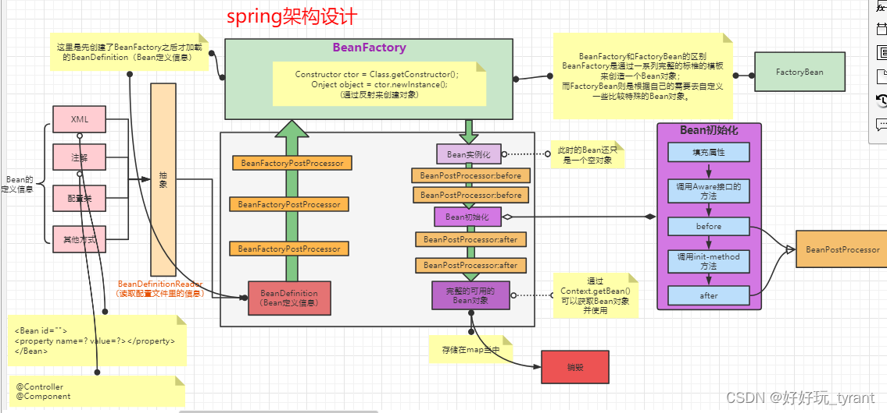

# BeanFoctory
  
## org.springframework.context.support.ClassPathXmlApplicationContext
* setConfigLocations: set xml configuration files paths
* refresh
  1. prepareRefresh: init property sources, validate required properties
  2. obtainFreshBeanFactory -> refreshBeanFactory
  3. prepareBeanFactory
     * set classloader
     * add default BeanPostProcessor(s)
     * registerResolvableDependency
     * registerSingleton
  4. postProcessBeanFactory: Allows post-processing of the bean factory in context subclasses.
  5. invokeBeanFactoryPostProcessors: Invoke factory processors registered as beans in the context.
  6. registerBeanPostProcessors: Register bean processors that intercept bean creation.
  7. initMessageSource: Initialize message source for this context.
  8. initApplicationEventMulticaster: Initialize event multicaster for this context
  9. onRefresh: Initialize other special beans in specific context subclasses.
  10. registerListeners: Check for listener beans and register them.
  11. finishBeanFactoryInitialization: Instantiate all remaining (non-lazy-init) singletons.
  12. finishRefresh:  Last step: publish corresponding event.
* refreshBeanFactory
  1. destroyBeans and closeBeanFactory if bean factory existed.
  2. createBeanFactory -> DefaultListableBeanFactory
  3. customizeBeanFactory: allowBeanDefinitionOverriding and allowCircularReferences
  4. loadBeanDefinitions
     * create XmlBeanDefinitionReader and initBeanDefinitionReader
     * loadBeanDefinitions by beanDefinitionReader
* beanDefinitionMap ```ConcurrentHashMap<String, BeanDefinition>```: Map of bean definition objects, keyed by bean name
* singletonObjects ```ConcurrentHashMap<String, Object>```: Cache of singleton objects: bean name --> bean instance
* singletonFactories ```ConcurrentHashMap<String, Object>```: Cache of singleton factories: bean name --> ObjectFactory
* earlySingletonObjects ```ConcurrentHashMap<String, Object>```: Cache of early singleton objects: bean name --> bean instance
* registeredSingletons ```LinkedHashSet<String>```: Set of registered singletons, containing the bean names in registration order
* singletonsCurrentlyInCreation ```Set<String>```: Names of beans that are currently in creation
* inCreationCheckExclusions ```inCreationCheckExclusions```: Names of beans currently excluded from in creation checks
* disposableBeans ```LinkedHashMap<String, Object>```: Disposable bean instances: bean name --> disposable instance
* containedBeanMap ```new ConcurrentHashMap<String, Set<String>>```: Map between containing bean names: bean name --> Set of bean names that the bean contains
* dependentBeanMap ```new ConcurrentHashMap<String, Set<String>>```: Map between dependent bean names: bean name --> Set of dependent bean names
* dependenciesForBeanMap ```oncurrentHashMap<String, Set<String>>```: Map between depending bean names: bean name --> Set of bean names for the bean's dependencies
* getBean by name
  1. transformedBeanName
  2. getSingleton
     * find it from singletonObjects
     * not found, find it from earlySingletonObjects
     * still not found, find singletonFactory from singletonFactories. If find put singletonFactory.getObject() to earlySingletonObjects
  3. if found
     * check if it is FactoryBean
     * if not, return instance
     * else, find instance from factoryBeanObjectCache cache
     * if not found, instance = FactoryBean.getObject 
     * postProcessObjectFromFactoryBean instance and store instance to factoryBeanObjectCache
  4. else, bean instance creation
     * 
     * if bean isPrototypeCurrentlyInCreation, throw BeanCurrentlyInCreationException
     * if not have bean definition, call parent.getBean if parent != 0
     * else markBeanAsCreated.
       1. get bean definition and depends beans
       2. for each depend bean
          * set the depend bean is a dependent of the bean in dependentBeanMap
          * set the bean depends on the depend bean in dependenciesForBeanMap
          * get depend bean by getBean
       3. create instance of the bean
          * if bean is singleton
            1. check bean is not in singletonsCurrentlyInCreation and add it to singletonsCurrentlyInCreation, if it is not in inCreationCheckExclusions
            2. createBean
            3. resolveBeforeInstantiation: call InstantiationAwareBeanPostProcessor.postProcessBeforeInstantiation
            4. if instance created, return instance
            5. else, doCreateBean
               * createBeanInstance: new instance of bean
               * applyMergedBeanDefinitionPostProcessors
               * earlySingletonExposure: isSingleton && allowCircularReferences && isSingletonCurrentlyInCreation
               * if earlySingletonExposure, call addSingletonFactory for early reference
               * populateBean: InstantiationAwareBeanPostProcessor.postProcessPropertyValues, checkDependencies, applyPropertyValues
               * initializeBean: invokeAwareMethods, BeanPostProcessor.postProcessBeforeInitialization, invokeInitMethods, applyBeanPostProcessorsAfterInitialization
               * if earlySingletonExposure, check dependent beans 
               * registerDisposableBeanIfNecessary
            6. add instance of bean to singletonObjects

## org.springframework.beans.factory.xml.XmlBeanDefinitionReader
* loadBeanDefinitions -> doLoadBeanDefinitions
  1. doLoadDocument: loaded as org.w3c.dom.Document
  2. registerBeanDefinitions
     * create DefaultBeanDefinitionDocumentReader
     * DefaultBeanDefinitionDocumentReader.registerBeanDefinitions

## org.springframework.beans.factory.xml.DefaultBeanDefinitionDocumentReader
* doRegisterBeanDefinitions
  1. create BeanDefinitionParserDelegate as delegate
  2. preProcessXml
  3. parseBeanDefinitions
     * if isDefaultNamespace (beans), parseDefaultElement
       1. parseBeanDefinitionElement to BeanDefinitionHolder as bdHolder
       2. decorateBeanDefinitionIfRequired bdHolder if needed
       3. register bean definition in bdHolder by BeanDefinitionReaderUtils.registerBeanDefinition (including register alias of the bean)
     * else, parseCustomElement
  4. postProcessXml
* BeanDefinitionParserDelegate.parseDefaultElement
  1. if import, importBeanDefinitionResource
  2. if alias, processAliasRegistration
  3. if bean, processBeanDefinition
  4. if beans, call doRegisterBeanDefinitions
* BeanDefinitionParserDelegate.parseCustomElement
  1. DefaultNamespaceHandlerResolver.resolve to get NamespaceHandler
  2. NamespaceHandler.parse
     * org.springframework.security.config.SecurityNamespaceHandler
       1. org.springframework.security.config.authentication.AuthenticationManagerBeanDefinitionParser: load ```<sec:authentication-manager>```
       2. org.springframework.security.config.http.HttpSecurityBeanDefinitionParser: load ```<sec:http>```
          * org.springframework.security.config.http.HttpConfigurationBuilder
          * org.springframework.security.config.http.AuthenticationConfigBuilder
