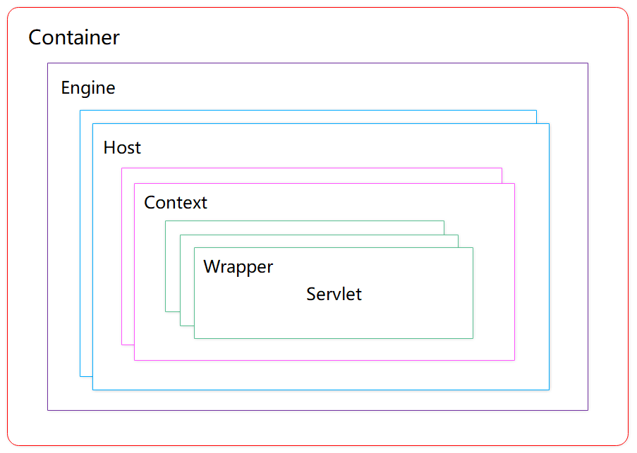

# Structure Design
## Feature


连接器和容器
为了完成上述两个功能，我们设计了两个核心组件连接器（Connector）和容器（Container）来分别做这两件事情。连接器负责对外交流（完成 Http 服务器功能），容器负责内部处理（完成 Servlet 容器功能）。

## Structure

* Server
  这里的 Server 就代表了一个 Tomcat 实例，包含了 Servlet 容器以及其他组件，负责组装并启动 Servlet 引擎、Tomcat 连接器
* Service
  服务是 Server 内部的组件，一个Server包括多个Service。它将若干个 Connector 组件绑定到一个 Container
* Container
  容器，负责处理用户的 servlet 请求，并返回对象给 web 用户的模块
  * Container handle flow: container.pipeline -> valve chain in container.pipeline -> basic valve in container.pipeline


### Tomcat connector
* functions
  1. socket 通信，也就是网络编程, 负责对接 I/O 模型 (EndPoint)
  2. 解析处理应用层协议，封装成一个 Request 对象 (Processor)
  3. Adapter 将 Request 转换为 标准的ServletRequest，并将 ServletRequest 对象传给 Servlet 容器(CoyoteAdapter.service)
  4. Adapter 将 从Servlet容器获取到的ServletResponse Response 转换为

        
* ProtocolHandler
  1. 封装EndPoint和Processor

  

  2. 相对稳定的部分或者是一些通用的处理逻辑使用抽象类AbstractProtocol来封装
  
  


### Servlet container
* Engine
表示整个 Catalina 的 Servlet 引擎，用来管理多个虚拟站点，一个 Service 最多只能有一个 Engine，但是一个Engine可包含多个 Host
* Host
代表一个虚拟主机，或者说一个站点，可以给 Tomcat 配置多个虚拟主机地址，而一个虚拟主机下可包含多个 Context
* Context
表示一个 Web 应用程序，一个Web应用可包含多个 Wrapper
* Wrapper
表示一个Servlet，负责管理整个 Servlet 的生命周期，包括装载、初始化、资源回收等




## Modules


* Listener 组件
可以在 Tomcat 生命周期中完成某些容器相关的监听器
* JNDI
JNDI是 Java 命名与目录接口，是属于 J2EE 规范的，Tomcat 对其进行了实现。JNDI 在 J2EE 中的角色就是“交换机”，即 J2EE 组件在运行时间接地查找其他组件、资源或服务的通用机制（你可以简单理解为给资源取个名字，再根据名字来找资源）
* Cluster 组件
提供了集群功能，可以将对应容器需要共享的数据同步到集群中的其他 Tomcat 实例中
* Realm 组件
提供了容器级别的用户-密码-权限的数据对象，配合资源认证模块使用
* Loader 组件
Web 应用加载器，用于加载 Web 应用的资源，它要保证不同 Web 应用之间的资源隔离
* Manager 组件
Servlet 映射器，它属于 Context 内部的路由映射器，只负责该 Context 容器的路由导航

  


# Implementation
## org.apache.catalina.util.LifecycleBase
* init -> initInternal, start -> startInternal, stop -> stopInternal, destroy -> destroyInternal

## org.apache.catalina.core.StandardServer
* Children
  1. globalNamingResources (NamingResourcesImpl)
  2. services (Service[])
* Parent: catalina (Catalina)
* constructor 
  1. create globalNamingResources (NamingResourcesImpl) 
  2. create NamingContextListener, register LifecycleListener (NamingContextListener) to the Server
* initInternal
  1. globalNamingResources.init
  2. Populate the extension validator with JARs from common and shared
  3. Init defined Services (Service.init)
* startInternal
  1. fireLifecycleEvent CONFIGURE_START_EVENT
  2. NamingContextLister: catches CONFIGURE_START_EVENT to create NameContext and bind it to Server
  3. NamingContextLister: register PropertyChangeListener (NamingContextListener) to globalNamingResources
  4. NamingContextLister: set NameContext to be global context
  5. NamingContextLister: bind classloader (server classloader) to Server and NameContext.
  6. NamingContextLister: set NameContext to be global naming context of the Server
  7. globalNamingResources.start
  8. Start defined Services (Service.start)


## org.apache.catalina.core.StandardService
* Children
  1. connectors (Connector[])
  2. engine (Engine) -> container
  3. executors (ArrayList<Executor>)
* Parent: server (Server)
* initInternal
  1. engine.init and init executors
  2. MapperListener.init
  3. init connectors
* startInternal
  1. engine.start and start executors
  2. MapperListener.start
  3. start connectors
* getExecutor: get Executor by name


## org.apache.catalina.mapper.MapperListener
* Parent: service (Service)
* constructor: Set service (Service) and mapper (Mapper) to service.getMapper()


## org.apache.catalina.core.StandardThreadExecutor
* startInternal: create executor (ThreadPoolExecutor0 and set it.


## org.apache.catalina.connector.Connector
* Parent: service (Service)
* constructor: create protocolHandler (ProtocolHandler), set uriCharset (Charset)
* executor configuration
  1. based on configured executor on Connector, get StandardThreadExecutor by StandardService.getExecutor(executor)
  2. set StandardThreadExecutor to Connector's ProtocolHandler if StandardThreadExecutor is not null
  3. Connector's ProtocolHandler will set the StandardThreadExecutor to its AbstractEndpoint.
  4. If AbstractEndpoint's StandardThreadExecutor is null, create one by AbstractEndpoint.createExecutor
* initInternal
  1. create adapter (CoyoteAdapter), set protocolHandler's adapter point to it.
  2. protocolHandler.init
* startInternal: protocolHandler.start


## org.apache.catalina.core.ContainerBase
* children (HashMap<String, Container>)
* parent (Container)
* listeners (List<ContainerListener>)
* pipeline (StandardPipeline)
* realm (Realm)
* thread (Thread): background thread
* accessLog (AccessLog)
* startStopExecutor (ThreadPoolExecutor)
* support (PropertyChangeSupport)
* cluster (Cluster)
* initInternal: init startStopExecutor
* startInternal
  1. start cluster if cluster is lifecycle
  2. start realm if realm is lifecycle
  3. using startStopExecutor to start children
  4. pipeline.start
  5. create thread, if backgroundProcessorDelay > 0 then using the thread to start ContainerBackgroundProcessor.
  6. ContainerBackgroundProcessor: bnd current container's loader if current container is context
  7. ContainerBackgroundProcessor: run all children's backgroundProcess, if its backgroundProcessorDelay > 0


## org.apache.catalina.valves.ValveBase
* container (Container)
* next (Valve)
* asyncSupported (boolean)


## org.apache.catalina.core.StandardEngine
* Parent: service (Service)
* children (Container): Hosts
* parent (Container): null
* constructor
  1. new StandardEngineValve, set it as pipeline's base
  2. set jvmRouteId to system property "jvmRoute"
  3. set backgroundProcessorDelay to 10
* initInternal: getRealm


## org.apache.catalina.core.StandardEngineValve
* invoke
  1. Get Host from request
  2. Set asyncSupported based on the asyncSupported of Host's pipeline, if request requires asyncSupported
  3. Call Host's pipeline


## org.apache.catalina.core.StandardPipeline
* basic (Valve): basic is the last valve of the pipeline
* first (Valve)
* container (Container)
* constructor: set container to Container
* startInternal: start valves in this pipeline


## org.apache.catalina.startup.EngineConfig
* LifecycleListener for Engine


## org.apache.catalina.core.StandardHost
* children (Container): Contexts, it add LifecycleListener (MemoryLeakTrackingListener) to each child.
* parent (Container): Engine
* contextClass: "org.apache.catalina.core.StandardContext"
* configClass: "org.apache.catalina.startup.ContextConfig"
* constructor: new StandardHostValve, set it as pipeline's base
* startInternal: if ErrorReportValveClass configured and pipeline does not have ErrorReportValve, create ErrorReportValve by ErrorReportValveClass and add it to pipeline


## org.apache.catalina.core.StandardHostValve
* invoke
  1. Get Context from request
  2. Set asyncSupported based on the asyncSupported of Context's pipeline, if request requires asyncSupported
  3. Call Context's pipeline


## org.apache.catalina.valves.ErrorReportValve
* invoke
  1. Call next valve firstly
  2. If response has error, report error

  
## org.apache.catalina.startup.HostConfig
* properties: deployed, serviced, invalidWars
* LifecycleListener for Host
* lifecycleEvent
  1. Get configuration from Host
  2. Handle event
     * PERIODIC_EVENT
       1. This event fired by container.backgroundProcess
       2. If Host auto deploy true
          * check resources of deployed applications which not in services
          * check and undeploy old versions applications
          * deploy applications
     * BEFORE_START_EVENT: Create host.getAppBaseFile() and host.getConfigBaseFile() if they are not existed when host.getCreateDirs() is true
     * START_EVENT
       1. host.getAppBaseFile() is not existed dir, set host auto deploy false and deployOnStartup false
       2. deploy applications if host.deployOnStartup is true
     * STOP_EVENT
* deployApps
  1. Get app base dir and app base config dir by host.getAppBaseFile() and host.getConfigBaseFile()
  2. Get app paths list for deploying from app base dir
  3. deployDescriptors: deploy XML descriptors from app base config dir
     * get XML descriptors file
     * create ContextName
     * check this ContextName is not serviced and not deployed
     * submit DeployDescriptor with XML descriptors file and ContextName to startStopExecutor for deploying
  4. deployWARs: deploy apps which are war files in app paths list
     * get war file
     * create ContextName
     * check this ContextName is not serviced
     * check this ContextName in not deployed
     * If the app deployed, check the unpack folder of the war file existed and logging warning message if unpackWAR is false now
     * validateContextPath for the war file, add the war file to invalidWars if failed
     * submit DeployWar with war file and ContextName to startStopExecutor for deploying
  5. deployDirectories: deploy apps which are sub folders of app base dir in app paths list
     * get app dir
     * create ContextName
     * check this ContextName is not serviced and not deployed
     * submit DeployDirectory with app dir and ContextName to startStopExecutor for deploying
* deployDescriptor
  1. create DeployedApplication with ContextName
  2. parse XML descriptors file to get Context (StandardContext)
  3. create ContextConfig
  4. add LifecycleListener (ContextConfig) to Context
  5. Set config file, name, path, version of Context from ContextName
  6. Check docBase of the Context. If docBase is set and it is sub folder of appBase, set docBase to null (isExternal == false)
  7. If docBase is external, add XML descriptors file and docBase to the redeployResources of the DeployedApplication
  8. add Context to Host's children.
  9. If docBase is external and it is war, add the docBase in appBase to the redeployResources of the DeployedApplication if unpackWAR is true
  10. If docBase is not external, add the war path (even the path not existed) in appBase to the redeployResources of the DeployedApplication
  11. If docBase is not external, add the docBase in appBase to the redeployResources of the DeployedApplication
  12. Add watched resources to reloadResources of the DeployedApplication
  13. addGlobalRedeployResources: context.xml.default under app config folder, conf/context.xml under catalina.base
  14. put DeployedApplication to deployed
* deployWAR
  1. deployXML is true
     * unpackWARs is true, copyXML is false, expandedDocBase is not out of date and META-INF/context.xml is under expandedDocBase: deploy the META-INF/context.xml
       And set META-INF/context.xml under docBase as config file of Context
     * xmlInWar is true: deploy the META-INF/context.xml in jar and set META-INF/context.xml in jar as config file of Context
     * copyXML is true and xmlInWar is true: copy META-INF/context.xml in jar to app base config dir
  2. deployXML is false
     * xmlInWar is true: throw error
     * create Context without xml
  3. add war file, context.xml in app base config dir to redeployResources
  4. create ContextConfig
  5. add LifecycleListener (ContextConfig) to Context
  6. Set name, path, version, docBase of Context from ContextName
  7. add Context to Host's children.
  8. If unpackWARs is true, add expandedDocBase to redeployResources. add META-INF/context.xml under expandedDocBase if copyXML is false
  9. add watched resources to reloadResources of the DeployedApplication
  10. addGlobalRedeployResources: context.xml.default under app config folder, conf/context.xml under catalina.base
  11. put DeployedApplication to deployed
* deployDirectory
  1. deployXML is true
     * xml META-INF/context.xml under docBase existed: deploy it.
     * if copyXML is true, copy META-INF/context.xml to app base config dir and set it as config file of Context
     * if copyXML is false, set META-INF/context.xml under docBase as config file of Context
  2. deployXML is false
     * xmlInWar is true: throw error
     * create Context without xml
  3. create ContextConfig
  4. add LifecycleListener (ContextConfig) to Context
  5. Set name, path, version, docBase of Context from ContextName
  6. add Context to Host's children.
  7. add war file under docBase to redeployResources
  8. add docBase to redeployResources
  9. add context.xml under app base config dir to redeployResources
  10. if copyThisXml is false, add context.xml under docBase to redeployResources
  11. add watched resources to reloadResources of the DeployedApplication
  12. addGlobalRedeployResources: context.xml.default under app config folder, conf/context.xml under catalina.base
  13. put DeployedApplication to deployed
* checkResources
  1. Get redeployResources from DeployedApplication
  2. For each redeploy resource
     * if resource existed or last modify is 0 
       * if resource last modify changed and (host autodeploy is false or last modify has to be more than 1000ms ago)
         1. if resource is dir: just update last modify in redeployResources for the resource
         2. if resource is war and app.hasDescriptor is true
            * reload application 
            * update last modify in redeployResources for the resource
            * update reloadResources
         3. Everything else triggers a redeploy: just need to undeploy here, deploy will follow
            * undeploy
            * deleteRedeployResources
     * else undeploy and deleteRedeployResources if resource is not existed after 500 ms
     * reload application and update reloadResources


## org.apache.catalina.core.StandardContext
* Context实例表示一个具体的web应用程序, 其中包含一个或者多个Wrapper实例, 每个Wrapper表示一个具体的servlet定义.
* children (Container): Wrapper
* parent (Container): Host
* constructor: new StandardContextValve, set it as pipeline's base. create broadcaster (NotificationBroadcasterSupport)
* initInternal
  1. init namingResources (NamingResourcesImpl) if it's existed
  2. broadcast Context created
* startInternal
  1. broadcast Context starting
  2. set configured false
  3. namingResources start if it's existed
  4. prepare Context workdir: $catalina.base/work/<engine name>/<host name>/<context path>
  5. create ApplicationContext if it's null
  6. set Context workdir as TEMPDIR in ApplicationContext and make it readonly
  7. create StandardRoot and set it as the resources of Context
  8. resources.start
  9. Create WebappLoader, and set it as application loader 
  10. Create cookieProcessor (Rfc6265CookieProcessor)
  11. Initialize character set mapper "org.apache.catalina.util.CharsetMapper"
  12. ExtensionValidator.validateApplication for resources
  13. Create NamingContextListener, and add it as LifecycleListener
  14. bind WebappLoader to current thread
  15. loader.start and set properties to loader.WebappClassLoaderBase
  16. unbindThread and bindThread
  17. start Realm, create safeHandler (CredentialHandler) and set it to ApplicationContext CREDENTIAL_HANDLER if Realm existed
  18. fire CONFIGURE_START_EVENT
  19. start children
  20. pipeline start
  21. create StandardManager (or ClusterManager) as manager
  22. set resources to ApplicationContext RESOURCES_ATTR
  23. Create DefaultInstanceManager as instanceManager and set it to ApplicationContext attribute
  24. bind WebappClassLoaderBase to instanceManager
  25. create StandardJarScanner as jarScanner and set it to ApplicationContext attribute
  26. mergeParameters: Set up the init params for ApplicationContext from context parameters and application level parameters
      ```
      params in web.xml
      <context-param>
          <param-name>companyName</param-name>
          <param-value>My Company, Incorporated</param-value>
      </context-param> 

      params in conext configuration for application level
      <Context ...>
          ...
          <Parameter name="companyName" value="My Company, Incorporated" override="false"/>
          ...
      </Context>
      ```
  27. Call ServletContainerInitializers
      * ServletContainerInitializer.onStartup
      * parameter Set<Class<?>> for onStartup specified by the class type defined in javax.servlet.annotation.HandlesTypes annotation of ServletContainerInitializer
  28. Create ApplicationEventListeners and LifecycleListeners(ServletContextListener, HttpSessionListener)
  29. Start ServletContextListeners by calling its contextInitialized
  30. Check constraints for uncovered HTTP methods
  31. start manager
  32. create and start filters by calling its init
  33. start Wrappers (Servlets) which have loadOnStartup true, by calling its load (Servlet.init)
  34. Start ContainerBackgroundProcessor thread
  35. unbindThread oldCCL
  36. broadcaster Context running
  37. getResources().gc()
* reload
  1. setPaused(true)
  2. stop()
  3. start()
  4. setPaused(false)


## org.apache.catalina.webresources.StandardRoot
* createWebResourceSet
* startInternal
  1. mainResources.clear, create mainResource (EmptyResourceSet/DirResourceSet/WarResourceSet), and add it to mainResources
     * webAppMount is / for DirResourceSet/WarResourceSet
  2. start other resources except classResources
  3. processWebInfLib: process jars under /WEB-INF/lib, create classResource (webAppMount is /WEB-INF/class) for each jar and add them to classResources
  4. start classResources
  5. The class files under /WEB-INF/class can be found in mainResource


## org.apache.catalina.loader.WebappLoader
* parentClassLoader: shared class loader
* loaderClass: ParallelWebappClassLoader.class.getName()
* classLoader (ParallelWebappClassLoader)
* context (StandardContext)
* reloadable: StandardContext.reloadable
* startInternal
  1. create ParallelWebappClassLoader as classLoader
  2. set StandardContext's resources as classLoader's resources
  3. build classPath based the libs paths in classLoader
     * set classPath to ApplicationContext CLASS_PATH_ATTR. 
     * If delegate is true (default true), put the libs of the classLoader to the last of classPath
     * because Jasper depends on this classPath.
  4. give classLoader file permissions: workDir "read,write"; workDir/- "read,write,delete"
  5. add file permissions (read) to classLoader for each lib paths
  6. classLoader.start
* backgroundProcess: if reloadable && modified()
  1. setContextClassLoader to this class' ClassLoader for current thread.
  2. StandardContext reload
  3. setContextClassLoader to context.getLoader().getClassLoader() -> ParallelWebappClassLoader


## org.apache.catalina.loader.WebappClassLoaderBase
* localRepositories (List<URL>)
* jarModificationTimes HashMap<String,Long>
*  resourceEntries Map<String, ResourceEntry>: The cache of ResourceEntry for classes and resources we have loaded. Keyed by resource path, not binary name.
* start
  1. add /WEB-INF/classes to localRepositories
  2. add jars under /WEB-INF/lib to localRepositories
  3. add jars' names and modify times to jarModificationTimes
* loadClass
  1. findClass from application StandardRoot
  2. if not find, delegate to parent class loader (shared class loader)
* findClassInternal
  1. binaryNameToPath
  2. find from cache resourceEntries
  3. If not found, find from resources and cache it to resourceEntries
* modified
  1. Have one or more classes or resources been modified so that a reload is appropriate?
  2. Check the ResourceEntry in resourceEntries: if any entry's modify time changed, return true
  3. Check jars under /WEB-INF/lib: if any jar modify time changes (based on jarModificationTimes), return true


## org.apache.catalina.core.DefaultInstanceManager
* containerClassLoader (server class loader)
* classLoader (application ParallelWebappClassLoader)
* loadClass
  1. className start with "org.apache.catalina" and class/subclass of ContainerServlet, load from containerClassLoader
     * A ContainerServlet is a servlet that has access to Catalina internal functionality
  2. else load from classLoader


## org.apache.catalina.core.ApplicationContext
* Standard implementation of ServletContext that represents a web application's execution environment.


## org.apache.catalina.session.StandardManager
* properties
  * sessions ```Map<String, Session>```: keep sessions with clients
  * processExpiresFrequency: Frequency of the session expiration processing
* doLoad: load session stored in SESSIONS.ser and active sessions (to notify SessionListener and HttpSessionEvent)
* doUnload: passivate sessions (to notify SessionListener and HttpSessionEvent) and store the sessions to SESSIONS.ser, then expire and recycle these sessions
* processExpires: Invalidate all sessions that have expired by calling session.isValid
* findSession: 

## org.apache.catalina.session.StandardSession
* properties
  * maxInactiveInterval: expire the session if exceeding it.
  * accessCount: The access count for this session.
  * thisAccessedTime: The current accessed time for this session.
* expire: invalidate this session 
* recycle: clear the contents of the session to avoid memory leak
* access: Update the accessed time information for this session (thisAccessedTime) and increase accessCount
* endAccess: end the access -> update thisAccessedTime and lastAccessedTime, then decrease accessCount
  * if LAST_ACCESS_AT_START, lastAccessedTime = thisAccessedTime and then thisAccessedTime = current time
  * otherwise, thisAccessedTime = current time and lastAccessedTime = thisAccessedTime
* isValid: check getIdleTimeInternal < maxInactiveInterval (accessCount > 0 if ACTIVITY_CHECK isValid is true, even getIdleTimeInternal >= maxInactiveInterval)
* getIdleTimeInternal: the idle time from last client access time without invalidation check
* request.getSession -> request.doGetSession -> manager.findSession -> session.access
* request.recycle() -> request.recycleSessionInfo -> session.endAccess
* JSESSIONID vs jsessionid: request.requestedSessionId, request.requestedSessionCookie, request.requestedSessionURL
  * jsessionid: in URL (like <url>;jessionid=xxxx?xxxxx), CoyoteAdapter.prepare -> CoyoteAdapter.postParseRequest -> request.getPathParameter
  * JSESSIONID: in cookie, CoyoteAdapter.prepare -> CoyoteAdapter.postParseRequest -> CoyoteAdapter.parseSessionCookiesId

## org.apache.catalina.ha.ClusterManager

## org.apache.catalina.core.StandardContextValve
* invoke
  1. Disallow any direct access to resources under WEB-INF or META-INF
  2. Select the Wrapper (Servlet) to be used for this Request
  3. Response ACK
  4. Check AsyncSupported
  5. Call Wrapper.pipeline


## org.apache.catalina.startup.ContextConfig
* load authenticators configuration from org/apache/catalina/startup/Authenticators.properties
* get login config -> auth method 
* Create authenticator based on auth method in login config (web.xml)
* add authenticator to pipeline of StandardContext if login config existed
* lifecycleEvent
  1. CONFIGURE_START_EVENT: configureStart
     * webConfig
       1. Create WebXmlParser and parse default conf/web.xml and web.xml.default
       2. Parse application web.xml to webXml
       3. processJarsForWebFragments application web.xml
          * Scan /WEB-INF/lib for JARs
          * Parse /META-INF/web-fragment.xml in jar if found
          * If no web-fragment.xml, return nul for that jar
       4. Order the fragments and scan JARs for ServletContainerInitializer implementations.
       5. processServletContainerInitializers: for no servlet configuration in web.xml
          * Create WebappServiceLoader to load classes of ServletContainerInitializer
            1. Load META-INF/services/javax.servlet.ServletContainerInitializer from the jars in shared class loader
            2. Load META-INF/services/javax.servlet.ServletContainerInitializer from the jars under /WEB-INF/lib
          * Scan the classes specified by annotation HandlesTypes for each ServletContainerInitializer
          * Add <ServletContainerInitializer, Set<Scanned classes specifed by HandlesTypes> to map
       6. processAnnotationsWebResource: for each class under /WEB-INF/classes and /WEB-INF/lib
          * javax/servlet/annotation/WebServlet
          * javax/servlet/annotation/WebFilter
          * javax/servlet/annotation/WebListener
       7. processAnnotations: for each class configured in fragments
       8. webXml merge the fragments
       9. webXml merge defaults 
       10. Convert explicitly mentioned jsps to servlets
       11. configureContext: Apply merged webXml to Context
           * Create Filters, Listeners
           * webxml.getServlets() to create Wrappers
       12. Look for static resources packaged in JARs
       13. Apply the ServletContainerInitializer config to the context
     * applicationAnnotationsConfig if ignoreAnnotations false
     * validateSecurityRoles
     * authenticatorConfig
     * set StandardContext configured true
  2. BEFORE_START_EVENT: beforeStart
     * fixDocBase: Adjust docBase
     * antiLocking: if antiResourceLocking is true
       1. set originalDocBase to docBase
       2. copy docBase to antiLockingDocBase ("java.io.tmpdir"/deploymentCount-$docBase[.war])
       3. set docBase to antiLockingDocBase
  3. AFTER_START_EVENT: set StandardContext docBase to originalDocBase if originalDocBase existed 
  4. CONFIGURE_STOP_EVENT: configureStop
     1. remove Wrappers from StandardContext
     2. remove constraints from StandardContext
     3. remove error pages from StandardContext
     4. remove filterDefs and filterMaps from StandardContext
     5. Removing Mime mappings
     6. Removing security role
     7. Removing servlet mappings
     8. Removing welcome files
     9. Removing wrapper lifecycle listeners and wrapper listeners
     10. Remove (partially) folders and files created by antiLocking
     11. Reset ServletContextInitializer scanning
  5. AFTER_INIT_EVENT: init
     * create contextDigester
     * set StandardContext configured false
     * contextConfig with contextDigester to parse default context configuration (<catalina.base>/conf/context.xml) if StandardContext override is false
     * if context.getConfigFile() existed, parse it
  6. AFTER_DESTROY_EVENT: destroy
     * Remove the work dir for the StandardContext


## javax.servlet.ServletContainerInitializer
* ServletContainerInitializers (SCIs) are registered via an entry in the file META-INF/services/javax.servlet.ServletContainerInitializer that must be included in the JAR file that contains the SCI implementation.
* Don't need to configure servlet in web.xml


## org.apache.catalina.core.StandardWrapper
* parent (Container): Context
* constructor: new StandardWrapperValve, set it as pipeline's base. create broadcaster (NotificationBroadcasterSupport)
* startInternal
  1. notify starting
  2. setAvailable(0L)
  3. notify running


## org.apache.catalina.core.StandardWrapperValve
* invoke
  1. Check Conext and Wrapper is available
  2. wrapper.allocate(): return the Servlet
     * loadServlet: create if Servlet is null
     * initServlet: call Servlet.init if Servlet is not inited
  3. Load filterChain from Context, set Servlet to filterChain
  4. Execute filterChain to call each Filter, then call servlet.service
  5. filterChain.release()
  6. wrapper.deallocate(servlet)
  7. wrapper unload (servlet.destroy) if wrapper.getAvailable() == Long.MAX_VALUE


## org.apache.catalina.valves.AccessLogValve
* Config AccessLogValve for a Container (Engine, Host or Context), then the Container can get AccessLog for logging.


## org.apache.catalina.deploy.NamingResourcesImpl


## Implementations of org.apache.coyote.ProtocolHandler
* constructor: Create Endpoint
* start
  1. start Endpoint
  2. Start asyncTimeout by a thread
* createProcessor
  1. Create Processor, set Adapter to Processor, configure others for Processor


## Implementations of org.apache.tomcat.util.net.AbstractEndpoint
* start
  1. bind
  2. startInternal
* bind
  1. ServerSocket bind
  2. open Selector
* startInternal
  1. createExecutor() if getExecutor() == null 
  2. create LimitLatch
  3. create Poller: Poll (If not read all contents, it will use Poll to wait for next READ event)
  4. create Acceptor: Accept connection from ServerSocket
  5. Acceptor -> get Executor to run (SocketProcessor.run -> ConnectionHandler.process -> createProcessor 
     -> Processor.process -> Processor.service -> Processor.prepareRequest -> getAdapter().service -> Processor.endRequest
     -> AbstractProcessor.action ActionCode.COMMIT -> Processor.prepareResponse -> Processor.outputBuffer.commit() 
     -> socketWrapper.write -> Processor.outputBuffer.end())

## org.apache.tomcat.util.net.AbstractJsseEndpoint
* initialiseSsl
  1. if isSSLEnabled, get sslImplementation to create SSLImplementation instance 
  2. createSSLContext with SSLHostConfigCertificate and negotiableProtocols, then slContext.init with keymanagers and trustmanagers
     * sslContext.init calls native method to set up ssl context
  3. set created sslContext to SSLHostConfigCertificate

## org.apache.tomcat.util.net.SecureNioChannel
* handshake -> processSNI ->  endpoint.createSSLEngine (get sslEngine)
* endpoint.createSSLEngine
  1. Get SSLHostConfig based on host name (not found, use default SSLHostConfig)
  2. selectCertificate
  3. certificate.getSslContext()
  4. sslContext.createSSLEngine()
  5. configure ssl engine

## org.apache.catalina.connector.CoyoteAdapter
* connector (Connector)
* service
  1. connector.createRequest(), connector.createResponse()
  2. postParseRequest: connector.getService().getMapper().map
  3. connector.getService().getContainer().getPipeline().getFirst().invoke   (Container is Engine)
  4. response.finishResponse()
  5. response.OutputBuffer.close() -> response.OutputBuffer.doFlush
  6. response.action ActionCode.CLIENT_FLUSH
  7. AbstractProcessor.action ActionCode.CLIENT_FLUSH
  8. AbstractProcessor.flush
  9. Processor.outputBuffer.commit()


## org.apache.catalina.mapper.Mapper
* defaultHostName: from Engine's defaultHost
* internalMap
  1. Iterate hosts and find the mappedHost based on input host name
  2. if MappedHost is null, return the defaultHost (mapped by defaultHostName)
  3. Find MappedContext based on input uri from MappedHost.contextList.contexts
  4. contexts = [MappedContext.versions[i].object]
  5. find the ContextVersion based on input version: contextVersion = MappedContext.versions[input version]
  6. context = contextVersion.object
  7. contextSlashCount = ContextVersion.slashCount: the amount of "/" in context.getPath
  8. internalMapWrapper
* internalMapWrapper
  1. Find MappedWrapper from contextVersion.exactWrappers/contextVersion.wildcardWrappers/contextVersion.extensionWrappers based on input uri
  2. requestPath = MappedWrapper.name, wrapper = MappedWrapper.object
  3. if uri == "/": pathInfo = "/", wrapperPath = "", contextPath = "", matchType = MappingMatch.CONTEXT_ROOT
  4. else: wrapperPath = MappedWrapper.name, matchType = MappingMatch.EXACT


## Realm
* Basic authentication flow
  ```
  Basic Access Authentication scheme是在HTTP1.0提出的认证方法，它是一种基于challenge/response的认证模式，针对特定的realm需要提供用户名和密码认证后才可访问，其中密码使用明文传输。Basic模式认证过程如下：
  ①浏览器发送http报文请求一个受保护的资源。
  ②服务端的web容器将http响应报文的响应码设为401，响应头部加入WWW-Authenticate: Basic realm=”myTomcat”。
  ③浏览器弹出对话框让用户输入用户名和密码，并用Base64进行编码，实际是用户名+冒号+密码进行Base64编码，即Base64(username:password)，这次浏览器就会在HTTP报文头部加入Authorization: Basic bXl0b21jYXQ=。
  ④服务端web容器获取HTTP报文头部相关认证信息，匹配此用户名与密码是否正确，是否有相应资源的权限，如果认证成功则返回相关资源，否则再执行②，重新进行认证。
  ⑤以后每次访问都要带上认证头部。
  服务端返回的认证报文中包含了realm=”myTomcat”，realm的值用于定义保护的区域，在服务端可以通过realm将不同的资源分成不同的域，域的名称即为realm的值，每个域可能会有自己的权限鉴别方案。
  ```
* Realm
  * 用户、密码和角色的集合
  * Tomcat包含以下几个常见的领域实现：UserDatabaseRealm、JDBCRealm、JNDIRealm与JAASRealm。
  * 另外，开发者可以创建额外的领域实现，以便作为其用户和密码的接口。领域在server.xml文件中以<Realm>元素指定：
  * <Realm> 可以嵌入以下任何一种 Container 元素中。Realm 元素的位置至关重要，它会对 Realm 的“范围”（比如说哪个 Web 应用能够共享同一验证信息）有直接的影响。
    
    ```
    <Engine> 元素 内嵌入该元素中的这种 Realm 元素可以被所有虚拟主机上的所有 Web 应用所共享，除非该 Realm 元素被内嵌入下属 <Host> 或 <Context> 元素的 Realm 元素所覆盖。
    <Host> 元素 内嵌入该元素中的这种 Realm 元素可以被这一虚拟主机上的所有 Web 应用所共享。除非该 Realm 元素被内嵌入下属 <Context> 元素的 Realm 元素所覆盖。
    <Context> 元素 内嵌入该元素中的这种 Realm 元素只能被这一 Web 应用所使用。
    ```
    
## Scope
* ApplicationContext (ServletContext) visible for whole application (all servlets, filters, listeners)
* StandardWrapper (ServletConfig) visible for a servlet. ServletConfig.getInitParameter:
  ```
   <servlet>
    <servlet-name>cas</servlet-name>
    <servlet-class>
      org.jasig.cas.web.init.SafeDispatcherServlet
    </servlet-class>
    <init-param>
      <param-name>publishContext</param-name>
      <param-value>false</param-value>
    </init-param>
  </servlet>
  ```
* ApplicationFilterConfig visible for a filter. ApplicationFilterConfig.getInitParameter
  ```
  <filter>
    <filter-name>springSecurityFilterChain</filter-name>
    <filter-class>org.springframework.web.filter.DelegatingFilterProxy</filter-class>
    <init-param>
      <param-name>xxx</param-name>
      <param-value>xxxxx</param-value>
    </init-param>
  </filter>
  ```
  