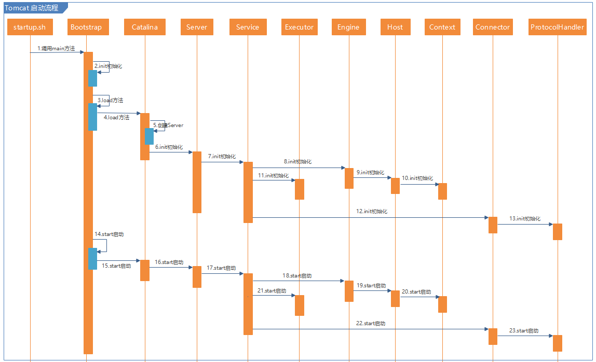

# Start

tomcat 的源码程序启动类 Bootstrap 配置VM参数（注意路径需要修改为自己的项目位置），因为 tomcat 源码运行也需要加载配置文件等。

-Dcatalina.home=D:/IdeaProjects/apache-tomcat-8.5.35-src
-Dcatalina.base=D:/IdeaProjects/apache-tomcat-8.5.35-src
-Djava.util.logging.manager=org.apache.juli.ClassLoaderLogManager
-Djava.util.logging.config.file=D:/IdeaProjects/apache-tomcat-8.5.35-src/conf/logging.properties


# org.apache.catalina.startup.Bootstrap
* main -> init -> load -> start
* init
  1. Create three classloader: common (parent), server (for tomcat instance), shared (shared for applications)
  2. Using server classloader to create catalinaDaemon (Catalina)
  3. Set catalinaDaemon's parent classloader to be share classloader
* load: call catalinaDaemon.load
* start: call catalinaDaemon.start


# org.apache.catalina.startup.Catalina
* load
  1. initDirs: check temporary folder "java.io.tmpdir"
  2. initNaming: set add "org.apache.naming" to variable java.naming.factory.url.pkgs, 
                 set java.naming.factory.initial to org.apache.naming.java.javaURLContextFactory if it's not set
  3. create start digester to parse configuration file (conf/server.xml) and create tomcat objects (Server, Service, Engine, Host ...)
  4. set Catalina , catalina.home and catalina.base to Server
  5. initStreams: Replace System.out and System.err with a custom PrintStream by SystemLogHandler
  6. call Server.init
* start
  1. call Server.start
  2. set shutdownHook to runtime.
  3. if await, call await and stop (listening for a shutdown command). No await for embedded tomcat.

## catalina.home和catalina.base这两个属性仅在你需要安装多个Tomcat实例而不想安装多个软件备份的时候使用，这样能节省磁盘空间。
* catalina.home(安装目录)：指向公用信息的位置，就是bin和lib的父目录。
* catalina.base(工作目录)：指向每个Tomcat目录私有信息的位置，就是conf、logs、temp、webapps和work的父目录。
```
In many circumstances, it is desirable to have a single copy of a Tomcat binary distribution shared among multiple users on the same server. 
To make this possible, you can set the CATALINA_BASE environment variable to the directory that contains the files for your 'personal' Tomcat instance.

When running with a separate CATALINA_HOME and CATALINA_BASE, the files and directories are split as following:
In CATALINA_BASE:
bin - Only: setenv.sh (*nix) or setenv.bat (Windows), tomcat-juli.jar
conf - Server configuration files (including server.xml)
lib - Libraries and classes, as explained below
logs - Log and output files
webapps - Automatically loaded web applications
work - Temporary working directories for web applications
temp - Directory used by the JVM for temporary files>

In CATALINA_HOME:
bin - Startup and shutdown scripts
lib - Libraries and classes, as explained below
endorsed - Libraries that override standard "Endorsed Standards". By default it's absent.
```
