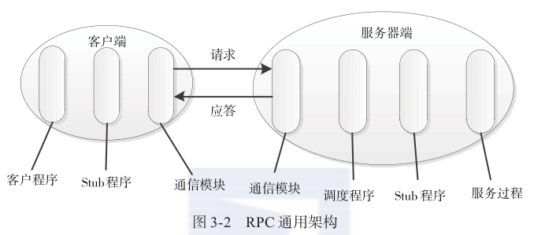
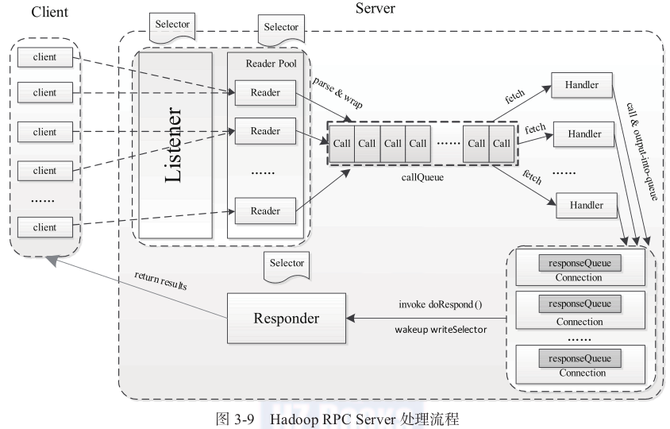

## RPC

- Stub程序: 一个代理程序, 保证函数调用的透明性
- 调度程序: 接收来自通信模块的请求消息, 并根据其中的标识选择一个Stub程序来处理
### org.apache.hadoop.ipc.RPC
```
  RpcEngine
  2 kinds of Rpc Engine: ProtobufRpcEngine, WritableRpcEngine
  It registers a specific Rpc Kind with its RpcInvoker and rpcRequestWrapperClas for each kind Rpc Engine:
  RpcKind                           RpcInvoker                                    rpcRequestWrapperClas                  RpcEngine
  RPC.RpcKind.RPC_PROTOCOL_BUFFER   ProtobufRpcEngine.Server.ProtoBufRpcInvoker   ProtobufRpcEngine.RpcProtobufRequest   ProtobufRpcEngine
  RPC.RpcKind.RPC_WRITABLE          WritableRpcEngine.Server.WritableRpcInvoker   WritableRpcEngine.Invocation           WritableRpcEngine
  
  RPC
  |--- Method setProtocolEngine    // set rpc engine for a specific protocol
  |--- Builder
  |    |--- Method build           // build a Rpc Server with a specific protocol via this protocol's Rpc Engine. (the specific protocol is the corresponding RpcKind of its Rpc Engine)
  |--- Server                      // Rpc Server's super class，which extends org.apache.hadoop.ipc.Server
  |    |--- Method addProtocol     // add a more protocol with its Rpc Kind to the server
  |    |--- Method call            // call the related service in the Rpc Server by a specific protocol via its Rpc Kind. Flow: call -> RpcInvoker.call (via org.apache.hadoop.ipc.Server.getRpcInvoker)                              
  |--- Methods getProxyXXX, stopProxy   // create or destory the rpc proxy for client
  
  Rpc Server
  Correspondingly, there are 2 kinds of Rpc Server: ProtobufRpcEngine.Server, WritableRpcEngine.Server
  Hierarchy: ProtobufRpcEngine.Server, WritableRpcEngine.Server 
             -> RPC.Server 
             -> org.apache.hadoop.ipc.Server
  Differences between ProtobufRpcEngine.Server and WritableRpcEngine.Server:
  
  RPC.Server.ProtoClassProtoImpl
    |--- protocolClass   // protocol class  e.g. ProtocolMetaInfoPB.class
    |--- protocolImpl    // protocol implementation instance  e.g. new ProtocolMetaInfoServerSideTranslatorPB(Server)
    
  
  ProtobufRpcEngine.Server.ProtoBufRpcInvoker
  |--- Methods call   // 1. get declaringClassProtoName and methodName from rpcRequest
                      //  RpcProtobufRequest request = (RpcProtobufRequest) writableRequest
                      //  RequestHeaderProto rpcRequest = request.getRequestHeader()
                      //  String methodName = rpcRequest.getMethodName()
                      //  String declaringClassProtoName = rpcRequest.getDeclaringClassProtocolName()
                      // 2. get ProtoClassProtoImpl by declaringClassProtoName
                      // 3. BlockingService service = (BlockingService) protocolImpl.protocolImpl
                      // 4. MethodDescriptor methodDescriptor = service.getDescriptorForType().findMethodByName(methodName);
                      // 5. Message prototype = service.getRequestPrototype(methodDescriptor); Message param = request.getValue(prototype);
                            (deserialize rpc request to protocol request object)                 
                      // 6. result = service.callBlockingMethod(methodDescriptor, null, param)  
                      // 7. return RpcWritable.wrap(result);        
    
  
  ProtobufRpcEngine.RpcProtobufRequest
    ProtobufRpcEngine.RpcProtobufRequest -> RpcWritable.Buffer -> RpcWritable -> Writable
    This class is used to deserialize rpc request to protocol request object
    
   
  ProtobufRpcEngine.Invoker   Stub, delegated to client proxy
  |--- Method invoke   // called by client: prepare rpc call info (new RpcProtobufRequest(rpcRequestHeader, theRequest)), then send to Rpc Server by Client.call
  |--- Client          // response for communicate with Rpc Server
  
  
  WritableRpcEngine.Server.WritableRpcInvoker
  |--- Methods call   // 1. Invocation call = (Invocation)rpcRequest
                      // 2. Method method = protocolImpl.protocolClass.getMethod(call.getMethodName(), call.getParameterClasses())
                      // 3. Object value =  method.invoke(protocolImpl.protocolImpl, call.getParameters())
                      // 4. return new ObjectWritable(method.getReturnType(), value)
  
  WritableRpcEngine.Invocation
    WritableRpcEngine.Invocation -> Writable  
    
  WritableRpcEngine.Invoker   Stub, delegated to client proxy
  |--- Method invoke   // called by client: prepare rpc call info (new Invocation(method, args)), then send to Rpc Server by Client.call
  |--- Client          // response for communicate with Rpc Server
```  

### org.apache.hadoop.ipc.Server
* Reactor based on Java NIO
* Work flow

```
  Server
  |--- Method registerProtocolEngine   // used for registering Rpc Kind with its RpcInvoker and rpcRequestWrapperClass.
  |--- Method queueCall   // store the RcpCall to CallQueueManager<Call>
  |--- CallQueueManager<Call>
  |--- Listener
  |    |--- ServerSocketChannel
  |    |--- Selector
  |    |--- InetSocketAddress
  |    |--- Reader   // n threads
  |    |    |--- Selector
  |    |    |--- BlockingQueue<Connection> 
  |    |    |--- Method addConnection   // add Connection to BlockingQueue<Connection> and wake up Reader.Selector
  |    |    |--- Method run   //  1. register OP_READ for SocketChannel in connections from BlockingQueue<Connection> to Reader.Selector with attach these connections, 2. listen Read event from Reader.Selector  3. call Listener.doRead
  |    |--- Method doRead    // call Connection.readAndProcess
  |    |--- Method doAccept  // 1. accept SocketChannel from Listener.ServerSocketChannel, 2. create Connection via SocketChannel by ConnectionManager.register 3. attach Connection to SelectKey and getReader the call addConnection by a Chosen Reader
  |    |--- Method getReader // Choose Reader by round robin algorithm
  |    |--- Method run    // 1. ConnectionManager.startIdleScan at beginning 2. listen Accept event from Selector  3. call doAccept  4.  ConnectionManager.stopIdleScan and ConnectionManager.closeAll at end
  |--- Handler   // n threads 
  |    |--- Method run  // take Rpc call from CallQueueManager<Call> and execute the call by call.run
  |--- Responder // 1 thread
  |    |--- Selector
  |    |--- Method doRespond  // 1. check the Call's connection is SASL or not, if yes, call Server.wrapWithSasl(Call) to wrap the Call
  |    |                      // 2. add the call to Call's connection's responseQueue
  |    |                      // 3. if call's connection's responseQueue size is 1, call Server.Responder.processResponse immediately.
  |    |                            (that means it will call processResponse when the responseQueue size increased to be 1 from 0. In this case the related SocketChannel of the Call will be registered to Responder.Selector with OP_WRITE, and in this case the processResponse will be called by doAsyncWrite which is called by Responder.run in regular)
  |    |
  |    |--- Method processResponse   // 1. write the rpc response in Call to client.
  |    |                             // 2. If the rpc response hasRemaining, add the Call to the top of the Call's connection's responseQueue for continuing the Call's responding
  |    |                             // 3. If called by Handler, call Responder.incPending(), then wake up and register OP_WRITE to Responder.Selector for current SocketChannel in Call's connection with attach Call, lastly call Responder.decPending()
  |    |                                   (that means if called by Handler and the response cannot write to client once, need to register current SocketChannel with OP_WRITE to Responder.Selector for writing remaining response to client)
  |    |
  |    |--- Method run  // 1. Wait for OP_WRITE registering If a channel is being registered (call Responder.waitPending)
  |    |                // 2. listen Write event from Responder.Selector and call Responder.doAsyncWrite if any Write event ready
  |    |                // 3. call Responder.doPurge to remove timeout Calls
  |    |
  |    |--- Method doAsyncWrite   // 1. call Server.Responder.processResponse to respond to client
  |    |                          // 2. if the all Calls response are finished, unregister the Call's SocketChannel from Responder.Selector
  |    |
  |    |--- Method doPurge       //  Remove calls that have been pending in the Call's connection's responseQueue for a long time.
  |
  |--- ConnectionManager
  |    |--- Set<Connection>
  |    |--- Method register  // create Connection and add it to Set<Connection>
  |    |--- Method startIdleScan   // Start a timer to check idle connections in Set<Connection> and close them
  |    |--- Method stopIdleScan    // Stop idle connections check timer
  |    |--- Method closeAll    // close all connections in Set<Connection> 
  |
  |--- Method getRpcRequestWrapper   // get Rpc Request class based on RpcKindProto
  | 
  |--- Method setupResponse   // 1. RpcResponseHeaderProto.Builder to build RpcResponseHeaderProto header
  |                           // 2. serialize rpc response to byte[] via RpcResponseHeaderProto header and Rpc Response object
  |                           // 3. set rpc response for the processed call 
  |   
  |--- Method wrapWithSasl    // Add SASL header and wrap the rpc response in Call, then setupResponse again with saslHeader
  
  Server.Connection
  |--- Method readAndProcess  // 1. call channelRead to read 'hrpc' (first read after connected) or rpc request length to dataLengthBuffer 
  |                           // 2. if first read, then read connection headers to connectionHeaderBuf secondly and check dataLengthBuffer == 'hrpc', dataLengthBuffer.clear() and go back to step 1
  |                           //    (Connection headers: version, authProtocol, serviceClass)
  |                           // 3. get a Rpc Request dataLength by dataLengthBuffer, then read a Rpc Request to requestData based on the dataLength 
  |                           // 4. call processOneRpc via the requestData
  |                           // 5. check connectionContextRead status before step 4, if false, means the processed requestData in step 4 is connection context instead of Rcp Call, then need to read the next rpc request to get the Rpc call. Otherwise, the processed requestData is Rpc call, finish this Rpc call.
  |
  |--- Method processOneRpc   // 1. deserialize the first part of requestData to RpcRequestHeaderProto 
  |                           // 2. get callId and retry from RpcRequestHeaderProto and checkRpcHeaders(RpcRequestHeaderProto)
  |                           // 3. Check callId, if callId < 0, call processRpcOutOfBandRequest(RpcRequestHeaderProto, requestData) to get connenect context or get SASL info, else call processRpcRequest(RpcRequestHeaderProto, requestData) to process Rpc Request
  |
  |--- Method processRpcOutOfBandRequest   // callId == -3: the requestData is connection context and call processConnectionContext
  |                                        // callId == -33: call saslReadAndProcess to process Rpc request by SASL flow
  |                                        // callId == -4: the requestData is a ping request
  |                                        // otherwise throw exception
  |
  |--- Method saslReadAndProcess   // 1. deserialize the rest part of requestData to RpcSaslProto
  |                                // 2. check the RpcSaslProto.getState(), if SaslState.WRAP, call unwrapPacketAndProcessRpcs(RpcSaslProto.getToken().toByteArray()) to process wrapped Rpc Call
  |                                // 3. else call saslProcess(RpcSaslProto) to setup SASL connection by interacting with client
  |
  |--- Method unwrapPacketAndProcessRpcs  // unwrap the Rpc Request, then call processOneRpc
  |
  |--- Method processRpcRequest   // 1. get rpcRequest class Class<? extends Writable> by Server.getRpcRequestWrapper(header.getRpcKind())
  |                               // 2. deserialize the rest part of requestData to rpcRequest
  |                               // 3. create RpcCall by rpcRpcRequest and connection, and add it CallQueueManager<Call> to by Server.queueCall(call), the Server.Handler[] will process it
  |
  |--- Method sendResponse   // call Server.Responder.doRespond(call)
  |--- LinkedList<RpcCall>   // response queue to store the calls' response 
  
  Server.RpcCall extends Server.Call
  |    |--- Method run  // 1. call ipc.RPC.Server.call by rpcRpcRequest, then get Rpc Response object
  |    |                // 2. call Server.setupResponse to prepare response and then call Call.sendResponse to send response to client 
  |    |--- Method doResponse  // call connection.sendResponse(call)
  
  
  Server.Call
  |    |--- Method sendResponse  // decrease responseWaitCount, then call child class' method doResponse
```
### Protocol and Service
* Protobuf based Service
```
1. Define the .proto file (including protocol and service definition)
   (take ProtocolInfo as example)
   definitions in ProtocolInfo.proto:
       option java_package = "org.apache.hadoop.ipc.protobuf";
       option java_outer_classname = "ProtocolInfoProtos";
       option java_generic_services = true;
       option java_generate_equals_and_hash = true;
       ...
       message ProtocolVersionProto
       message GetProtocolVersionsResponseProto
       message GetProtocolSignatureRequestProto
       message GetProtocolSignatureResponseProto
       message ProtocolSignatureProto
       service ProtocolInfoService
       
2. Hand write code
   a) ProtocolMetaInfoPB.java is the protocol
   It extends ProtocolInfoService.BlockingInterface
   It is tagged with @ProtocolInfo(
                         protocolName = "org.apache.hadoop.ipc.ProtocolMetaInfoPB", 
                         protocolVersion = 1)
   b) ProtocolMetaInfoServerSideTranslatorPB is the protocol implementation class            
            
3. Build
   Generate ProtocolInfoProtos.java:
       ProtocolVersionProto
       ProtocolVersionProtoOrBuilder
       GetProtocolVersionsResponseProtoOrBuilder
       GetProtocolVersionsResponseProto
       ...
       ProtocolInfoService
       
4. Usage
   ProtocolMetaInfoServerSideTranslatorPB xlator = new ProtocolMetaInfoServerSideTranslatorPB(Server);
   BlockingService protocolInfoBlockingService = ProtocolInfoService.newReflectiveBlockingService(xlator);
   addProtocol(RpcKind.RPC_PROTOCOL_BUFFER, ProtocolMetaInfoPB.class, protocolInfoBlockingService)
```
* Writable Service
```
normal class, and it uses Java reflection to implement RPC service
```
### org.apache.hadoop.ipc.Client
* work flow


```
Client
|--- ConcurrentMap<ConnectionId, Connection>   // connections to store client connection (one connection is one thread)
|
|--- Method getConnection   // get Connection by ConnectionId and add the Call to Connection.calls  ConnectionId: InetSocketAddress + protocol + UserGroupInformation + timeout + retryInterval + ...
|                           // It calls setupIOstreams Connection.setupIOstreams to set up connetion with Rpc Server
|--- Method call   // 1. create Call via rpcRequest object
|                  // 2. get connection via getConnection
|                  // 3. call connection.sendRpcRequest(call)
|                  // 4. getRpcResponse from connection
|
|--- Method getRpcResponse   // 1. call.getRpcResponse()

Client.Connection
|--- ExecutorService   //  sendParamsExecutor
|--- Socket
|--- IpcStreams   // Communicate with Rpc Server by controlling DataInputStream and DataOutputStream, including SASL data wrap and unwrap
|--- Method setupIOstreams   // 1. call setupConnection, then create IpcStreams with the socket
|                            // 2. call writeConnectionHeader to send "hrpc" and connection header
|                            // 3. call setupSaslConnection if using SASL
                             // 4. call writeConnectionContext to send connection context
|
|--- Method setupConnection  // create socket and connection to Rpc Server (java.net.socket instead of Java NIO)
|
|--- Method sendRpcRequest   // 1. RpcRequestHeaderProto header = ProtoUtil.makeRpcRequestHeader(...)
|                            // 2. final ResponseBuffer buf = new ResponseBuffer() header.writeDelimitedTo(buf) RpcWritable.wrap(call.rpcRequest).writeTo(buf)
|                            // 3. IpcStreams.sendRequest(buf.toByteArray())  ipcStreams.flush()
|                            // 4. IOUtils.closeStream(buf)
|                            // All above steps are executed by sendParamsExecutor
|
|--- Method run     //  waitForWork to wait, then receiveRpcResponse to get response    
|--- Method receiveRpcResponse   // receive and deserialize the response by ipcStreams.readResponse(), then set it to Call by Call.setRpcResponse
```

### Serialize and Deserialize
```
RPC Request = RpcRequestHeaderProto + rpcRequest (Writable) 
              rpcRequest: Invocation or RpcProtobufRequest
              Invocation = method + arguments
              RpcProtobufRequest = RequestHeaderProto + payload (payload can be deserialized to be specific protobuf protocol parameter object)
              
RPC Response = RpcResponseHeaderProto + rpcResponse (Writable)
               
Client 
   serializes RPC Request by RpcWritable.wrap(Class RpcProtobufRequest or Invocation).writeTo(buf) in Client.sendRpcRequest
       RpcProtobufRequest is for protobuf protocol 
   deserializes RPC Response by RpcWritable.wrap(Class RpcWritable.Buffer or Writable).readFrom(bb) in Client.receiveRpcResponse
       RpcWritable.Buffer is for protobuf protocol
Server 
    deserializes RPC Request by RpcWritable.wrap(Class Message or Writable).readFrom(bb) in Server.Connection.processOneRpc
        Message is for protobuf protocol
    serializes RPC Response ( by RpcWritable.writeTo or protobuf's writeTo) in Server.setupResponse
        refer ipc.Server.setupResponseForProtobuf and ipc.Server.setupResponseForWritable
```


## Call stack
### Server process request
```
Accept connection
Server.Listener.run -> Server.Listener.doAccept -> Server.Listener.getReader -> Server.ConnectionManager.register -> Server.Listener.Reader.addConnection
Read Request
Server.Reader.run -> Server.Listener.doRead -> Server.Listener.Connection.readAndProcess -> Server.Listener.Connection.processOneRpc [ -> SALS Layer ... ] -> Server.Listener.Connection.processRpcRequest  -> Server.queueCall -> CallQueueManager.put
Handle Request
Server.Handler.run -> CallQueueManager.task -> Server.Call.run -> RPC.Server.call -> RpcInvoker.call -> Server.Call.sendResponse -> Server.Listener.Connection.sendResponse -> Server.Responder.doResponse (synchronized) -> [ -> SALS Layer ... ] -> Server.Listener.Connection.responseQueue.addLast -> For the first Response in the Call then Server.Responder.processResponse (synchronized) and SocketChannel.register Call with OP_WRITE in processResponse
Send Response
Server.Responder.run -> Server.Responder.doAsyncWrite -> SelectionKey.attachment -> Server.Responder.processResponse (synchronized) -> Server.Listener.Connection.responseQueue.removeFirst -> Server.channelWrite
```
### Client RPC Call
```
Send Call
Proxy.method -> Invocation.call -> Client.call -> Client.getConnection -> [ -> Client.Connection.setupIOstreams if not connected] -> Client.Connection.sendRpcRequest
Receive Response
Client.Connection.run -> Client.Connection.receiveRpcResponse
```