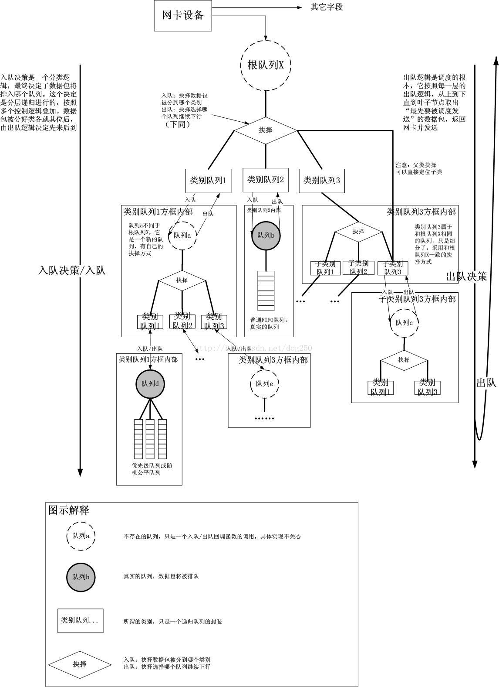
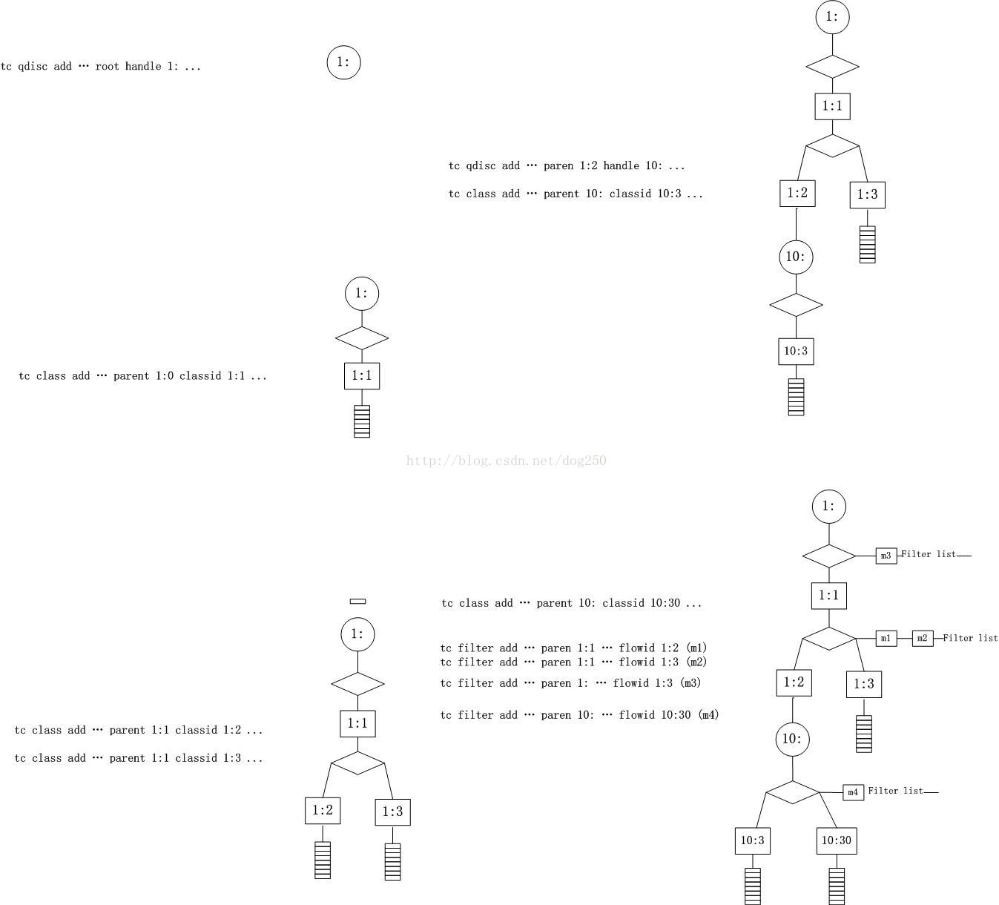

# 流量控制 (Traffic Control)

* Linux内核提供的流量限速、整形和策略控制机制。它以qdisc-class-filter的树形结构来实现对流量的分层控制。
* TC用于Linux内核的流量控制，主要是通过在输出端口处建立一个队列来实现流量控制(egress qdisc)。
* 网卡实际上还可以添加一个ingress qdisc，不过它有诸多的限制
  * ingress qdisc不能包含子类，而只能作过滤
  * ingress qdisc只能用于简单的整形
  * ingress qdisc本身的功能很有限，但可用于重定向incoming packets。通过Ingress qdisc把输入方向的数据包重定向到虚拟设备ifb，而ifb的输出方向可以配置多种qdisc，就可以达到对输入方向的流量做队列调度的目的。
    ```
    # add an ingress qdisc
    tc qdisc add dev eth0 handle ffff: ingress
    # drop too fast packets received from any host:
    tc filter add dev eth0 parent ffff: protocol ip prio 50 u32 match ip src 0.0.0.0/0 action police rate 800kbit burst 10k flowid :1 action drop
    or:   tc filter add dev eth0 parent ffff: protocol ip prio 50 u32 match ip src 0.0.0.0/0 police rate 800kbit burst 10k flowid :1 drop
    
    # it is possible to redirect exceeding traffic to the loopback interface instead of dropping it:
    tc filter add dev eth0 parent ffff: u32 \
          match u32 0 0 \
          action police rate 1mbit burst 100k conform-exceed pipe \
          action mirred egress redirect dev lo
    
    tc filter add dev eth0 parent ffff: prio 1 u32 match udp src 0.0.0.0/0 flowid 1:20 action drop
    
    # limit ingress 
    tc qdisc add dev ifb0 root handle 1: htb r2q 1
    tc class add dev ifb0 parent 1: classid 1:1 htb rate $SPEED
    tc filter add dev ifb0 parent 1: matchall flowid 1:1
  
    tc qdisc add dev $DEVICE ingress
    tc filter add dev $DEVICE ingress matchall action mirred egress redirect dev ifb0
    
    # drop
    tc qdisc add dev eth0 handle ffff: ingress
    tc filter add dev eth0 parent ffff: prio 1 u32 match udp src 0.0.0.0/0 action drop
    ```
* 基本组成
  * tc由qdisc、fitler和class三部分组成：
  * qdisc通过队列将数据包缓存起来，用来控制网络收发的速度
  * class用来表示控制策略
  * filter用来将数据包划分到具体的控制策略中
* qdisc
  * qdisc通过队列将数据包缓存起来，用来控制网络收发的速度。实际上，每个网卡都有一个关联的qdisc。它包括以下几种：
    * 无分类qdisc
      * [p|b]fifo：简单先进先出
      * pfifo_fast：根据数据包的tos将队列划分到3个band，每个band内部先进先出
      * red：Random Early Detection，带带宽接近限制时随机丢包，适合高带宽应用
      * sfq：Stochastic Fairness Queueing，按照会话对流量排序并循环发送每个会话的数据包
      * tbf：Token Bucket Filter，只允许以不超过事先设定的速率到来的数据包通过 , 但可能允许短暂突发流量朝过设定值
      * 支持的简单整形
        * 重新调度（reschedule）
        * 增加延迟（delay）
        * 丢弃（drop）
      * 如果没有可分类QDisc，不可分类QDisc只能附属于设备的根
      * 使用命令tc qdisc add dev DEV root <QDISC> <QDISC-PARAMETERS>
      * 要删除一个不可分类QDisc，需要使用命令tc qdisc del dev DEV root
      * 一个网络接口上如果没有设置QDisc，pfifo_fast就作为缺省的QDisc。
    * 有分类qdisc（可以包括多个队列）
      * cbq：Class Based Queueing，借助EWMA(exponential weighted moving average, 指数加权移动均值 ) 算法确认链路的闲置时间足够长 , 以达到降低链路实际带宽的目的。如果发生越限 ,CBQ 就会禁止发包一段时间。
      * htb：Hierarchy Token Bucket，在tbf的基础上增加了分层
      * prio：分类优先算法并不进行整形 , 它仅仅根据你配置的过滤器把流量进一步细分。缺省会自动创建三个FIFO类。
      * 原理
        * 类(Class)组成一个树，每个类都只有一个父类，而一个类可以有多个子类。某些QDisc(例如：CBQ和HTB)允许在运行时动态添加类，而其它的QDisc(例如：PRIO)不允许动态建立类。允许动态添加类的QDisc可以有零个或者多个子类，由它们为数据包排队。
        * 此外，每个类都有一个叶子QDisc，默认情况下，这个叶子QDisc使用pfifo的方式排队，我们也可以使用其它类型的QDisc代替这个默认的QDisc。而且，这个叶子叶子QDisc有可以分类，不过每个子类只能有一个叶子QDisc。当一个数据包进入一个分类QDisc，它会被归入某个子类。
        * 如果过滤器附属于一个类，相关的指令就会对它们进行查询。过滤器能够匹配数据包头所有的域，也可以匹配由ipchains或者iptables做的标记。
        * 树的每个节点都可以有自己的过滤器，但是高层的过滤器也可以直接用于其子类。如果数据包没有被成功归类，就会被排到这个类的叶子QDisc的队中。相关细节在各个QDisc的手册页中
      * 命令
        ```
        tc qdisc [ add | change | replace | link ] dev < DEV > [ parent < qdisc-id > | root ] handle < qdisc-id > < qdisc > < qdisc specific parameters >  
        tc class [ add | change | replace ] dev < DEV > parent < qdisc-id > classid < class-id > < qdisc > < qdisc specific parameters >
        tc filter [ add | change | replace ] dev < DEV > [ parent < qdisc-id > | root ] protocol < protocol > prio < priority > handle <filter-id> < filtertype > < filtertype specific parameters > flowid < flow-id > action <action>
        tc [-s | -d ] qdisc show dev < DEV >
        tc [-s | -d ] class show dev < DEV >
        tc filter show dev < DEV >  
        
        handle: 句柄
        ```
  * tc支持以下的classful qdisc
    * ATM
    * CBQ
    * DRR
    * DSMARK
    * HFSC
    * HTB
    * PRIO
    * QFQ
* filter
  * filter用来将数据包划分到具体的控制策略中，包括以下几种：
  * u32：根据协议、IP、端口等过滤数据包
  * fwmark：根据iptables MARK来过滤数据包
  * tos：根据tos字段过滤数据包
  * tc 支持以下的filter
    * basic
    * bpf
    * cgroup
    * flow
    * fw
    * route
    * rsvp
    * tcindex
    * u32
    * matchall
* class
  * class用来表示控制策略，只用于有分类的qdisc上。每个class要么包含多个子类，要么只包含一个子qdisc。当然，每个class还包括一些列的filter，控制数据包流向不同的子类，或者是直接丢掉。

* tc commands
  
* example
  ```
  Hadoop tc control by cgroup:
    delete first ->                            tc qdisc del dev eth0 root
    qdisc ->                                   tc qdisc add dev eth0 root handle 42: htb default 2
    filter for above qdisc (handle 42:) ->     tc filter add dev eth0 parent 42: protocol ip prio 10 handle 1: cgroup 
      above filter's handle is 1:
    add root class ->                          tc class add dev eth0 parent 42:0 classid 42:1 htb rate %s ceil %s
    add default class ->                       tc class add dev eth0 parent 42:1 classid 42:2 htb rate %s ceil %s
    add yarn class ->                          tc class add dev eth0 parent 42:1 classid 42:3 htb rate %s ceil %s
    add other class for cgroup ->              tc class add dev eth0 parent 42:1 classid 42:<cls-id> htb rate %s ceil %s
  
   # 清除原有的根队列(根据实际情况操作,非必要) 
    tc qdisc del dev $outdevice root 2>/dev/null
    tc qdisc del dev $outdevice ingress 2>/dev/null
    tc qdisc del dev $indevice root 2>/dev/null
  
  # 将$outdevice的ingress流量全部重定向到 $indevice 处理
    tc qdisc add dev $outdevice handle ffff: ingress
    tc filter add dev $outdevice parent ffff: protocol ip u32 match u32 0 0 action mirred egress redirect dev $indevice
  
  # $outdevice的出向限速:$outdevice添加根队列,使用htb,添加1:1类,使用htb 
    tc qdisc add dev $outdevice root handle 1: htb r2q 625 default 65
    tc class add dev $outdevice parent 1: classid 1:1 htb rate 1000Mbit
  
  # $outdevice的入向限速:$indevice添加根队列,使用htb,添加1:1类,使用htb 
    tc qdisc add dev $indevice root handle 1: htb r2q 625 default 65
    tc class add dev $indevice parent 1: classid 1:1 htb rate 1000Mbit  
  
  # $outdevice的出向限速:$outdevice设备添加子类\对应的filter配置规则和子类的队列
    tc class add dev $outdevice parent 1:1 classid 1:10 htb rate 10Mbit
    tc filter add dev $outdevice parent 1: protocol all prio 1 u32 match ip dst 192.168.0.2 classid 1:10
    tc qdisc add dev $outdevice parent 1:10 handle 10: sfq
     
  # $outdevice的出向限速:$outdevice设备添加子类\对应的filter配置规则和子类的队列 
    tc class add dev $outdevice parent 1:1 classid 1:11 htb rate 20Mbit
    tc filter add dev $outdevice parent 1: protocol all prio 1 u32 match ip dst 192.168.0.3 classid 1:11
    tc qdisc add dev $outdevice parent 1:11 handle 11: sfq
     
     
  # $outdevice的入向限速:$indevice设备添加子类\对应的filter配置规则和子类的队列
    tc class add dev $indevice parent 1:1 classid 1:10 htb rate 10Mbit
    tc filter add dev $indevice parent 1: protocol all prio 1 u32 match ip src 192.168.0.2 classid 1:10
    tc qdisc add dev $indevice parent 1:10 handle 10: sfq
     
     
  # $outdevice的入向限速:$indevice设备添加子类\对应的filter配置规则和子类的队列 
    tc class add dev $indevice parent 1:1 classid 1:11 htb rate 20Mbit
    tc filter add dev $indevice parent 1: protocol all prio 1 u32 match ip src 192.168.0.3 classid 1:11
    tc qdisc add dev $indevice parent 1:11 handle 11: sfq  
  
  # 使用 tc 下载限制单个IP 进行速度控制
    tc qdisc add dev eth0 root handle 1: htb r2q 1
    tc class add dev eth0 parent 1: classid 1:1 htb rate 30mbit ceil 60mbit
    tc filter add dev eth0 parent 1: protocol ip prio 16 u32 match ip dst 192.168.1.2  flowid 1:1
  
  # 使用 tc 对整段 IP 进行速度控制
    tc qdisc add dev eth0 root handle 1: htb r2q 1
    tc class add dev eth0 parent 1: classid 1:1 htb rate 50mbit ceil 1000mbit
    tc filter add dev eth0 parent 1: protocol ip prio 16 u32 match ip dst 192.168.111.0/24 flowid 1:1
  
  https://github.com/xgfone/snippet/blob/master/snippet/docs/linux/QoS/qos-filter.md
  ```

* tc可以用来控制netem的工作模式
  * 如果想使用netem，需要至少两个条件，一个是内核中的netem 功能被包含，另一个是要有tc.
  * 模拟延迟传输
    * 该命令将 eth0 网卡的传输设置为延迟100毫秒发送。
      ```tc qdisc add dev eth0 root netem delay 100ms```
    * 命令将 eth0 网卡的传输设置为延迟 100ms ± 10ms （90 ~ 110 ms 之间的任意值）发送。
      ```tc qdisc add dev eth0 root netem delay 100ms 10ms``
    * 将 eth0 网卡的传输设置为 100ms ，同时，大约有 30% 的包会延迟 ± 10ms 发送。
      ```tc qdisc add dev eth0 root netem delay 100ms 10ms 30%```
  * 模拟网络丢包
    * 将 eth0 网卡的传输设置为随机丢掉 1% 的数据包。
      ```tc qdisc add dev eth0 root netem loss 1%```
    * 将 eth0 网卡的传输设置为随机丢掉 1% 的数据包，成功率为 30% 。
      ```tc qdisc add dev eth0 root netem loss 1% 30%```
    * 将 eth0 网卡的传输设置为随机产生 1% 的重复数据包 。
      ```tc qdisc add dev eth0 root netem duplicate 1%```
  * 模拟数据包损坏
    * 将 eth0 网卡的传输设置为随机产生 0.2% 的损坏的数据包 。 (内核版本需在2.6.16以上）
      ```tc qdisc add dev eth0 root netem corrupt 0.2%```
  * 模拟数据包乱序
    * 将 eth0 网卡的传输设置为:有 25% 的数据包（50%相关）会被立即发送，其他的延迟 10 秒。
      ```tc qdisc change dev eth0 root netem delay 10ms reorder 25% 50%```
    * 新版本中，如下命令也会在一定程度上打乱发包的次序:
      ```tc qdisc add dev eth0 root netem delay 100ms 10ms```
  * 删除模拟配置
    * tc qdisc del dev eth0 root
    * 此外还有replace、change、show等指令可用